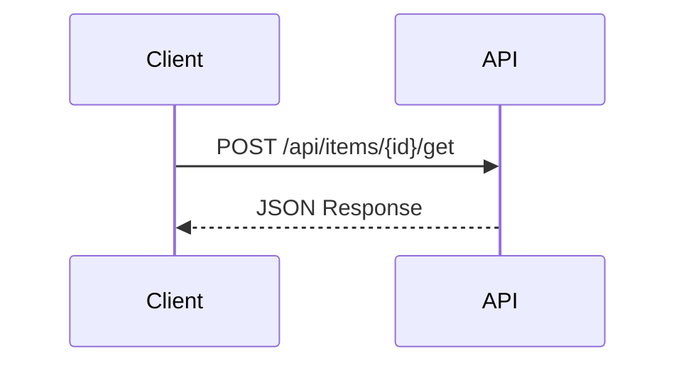

# リサーチガイドライン

このドキュメントでは、`docs/` 配下に格納するリサーチドキュメントの作成規約について説明します。

<!-- START doctoc generated TOC please keep comment here to allow auto update -->
<!-- DON'T EDIT THIS SECTION, INSTEAD RE-RUN doctoc TO UPDATE -->

- [目的](#目的)
- [ファイル命名規則](#ファイル命名規則)
    - [形式](#形式)
    - [ルール](#ルール)
    - [カテゴリ一覧](#カテゴリ一覧)
    - [例](#例)
- [ドキュメント構成](#ドキュメント構成)
    - [必須セクション](#必須セクション)
    - [セクション詳細](#セクション詳細)
- [記述ルール](#記述ルール)
    - [タイトルの形式](#タイトルの形式)
    - [調査情報の形式](#調査情報の形式)
    - [水平線の使用](#水平線の使用)
- [図表の活用](#図表の活用)
    - [Mermaid 図](#mermaid-図)
    - [表形式](#表形式)
- [コード引用](#コード引用)
    - [ソースコード参照](#ソースコード参照)
    - [引用時の注意](#引用時の注意)
- [Home.md の更新](#homemd-の更新)
    - [ルール](#ルール-1)
    - [形式](#形式-1)
- [チェックリスト](#チェックリスト)

<!-- END doctoc generated TOC please keep comment here to allow auto update -->

---

## 目的

リサーチドキュメントは、プリザンター本体の内部実装に関する知見を蓄積するためのものです。

| 目的           | 説明                                             |
| -------------- | ------------------------------------------------ |
| 知見の蓄積     | プリザンター本体の内部実装に関する知見を文書化   |
| 仕様の明確化   | API の動作仕様や制約事項を明確にする             |
| 問題点の文書化 | 既知の問題点や注意事項を記録する                 |
| 開発判断の根拠 | 実装方針を決定する際の根拠となる調査結果を残す   |
| 将来の参照     | 同様の調査が必要になった際に再利用できる形で残す |

---

## ファイル命名規則

### 形式

```text
docs/research/{カテゴリ連番}-{カテゴリ名（日本語）}/{ドキュメント連番}-{内容を端的に表す名前}.md
```

### ルール

| ルール           | 説明                                                                         |
| ---------------- | ---------------------------------------------------------------------------- |
| カテゴリフォルダ | 0 埋め 2 桁連番 + 日本語カテゴリ名のフォルダに格納する（`01-認証・権限` 等） |
| ドキュメント連番 | カテゴリごとに調査順で 0 埋め 3 桁の連番を付与する                           |
| 日本語で記述     | ファイル名・フォルダ名は日本語で記述する                                     |
| 区切り文字       | 単語はハイフンまたは中黒（・）で区切る                                       |
| 簡潔に           | 内容を端的に表す名前にする                                                   |

### カテゴリ一覧

| フォルダ名           | 説明            |
| -------------------- | --------------- |
| `01-認証・権限`      | 認証・権限      |
| `02-セッション`      | セッション      |
| `03-データ操作・API` | データ操作・API |
| `04-UI・画面`        | UI・画面        |
| `05-基盤・ツール`    | 基盤・ツール    |

### 例

| ファイル名                             | 説明               |
| -------------------------------------- | ------------------ |
| `03-データ操作・API/001-Upsert-API.md` | Upsert API の実装  |
| `02-セッション/002-セッション管理.md`  | Session 管理の実装 |
| `01-認証・権限/002-権限階層構造.md`    | 権限階層構造       |

---

## ドキュメント構成

### 必須セクション

すべてのリサーチドキュメントには以下のセクションを含めること。

```markdown
# {タイトル}

{概要説明（1〜2文）}

<!-- START doctoc generated TOC please keep comment here to allow auto update -->
<!-- END doctoc generated TOC please keep comment here to allow auto update -->

## 調査情報

| 調査日 | リポジトリ | ブランチ | タグ/バージョン | コミット | 備考   |
| ------ | ---------- | -------- | --------------- | -------- | ------ |
| {日付} | Pleasanter | {branch} | {tag}           | `{hash}` | {備考} |

## 調査目的

{調査の目的を簡潔に記述}

---

## {調査内容のセクション}

{本文}

---

## 結論

{調査結果のまとめ}
```

### セクション詳細

| セクション       | 必須 | 説明                                                     |
| ---------------- | :--: | -------------------------------------------------------- |
| タイトル（H1）   | Yes  | 対象の内容を簡潔に表す形式（目次の上）                   |
| 概要説明         | Yes  | ドキュメントの概要を1〜2文で記述                         |
| doctoc マーカー  | Yes  | 目次の自動生成用マーカー                                 |
| 調査情報         | Yes  | 調査日、リポジトリ、ブランチ、タグ、コミット、備考を記載 |
| 調査目的         | Yes  | なぜこの調査が必要だったか                               |
| 調査内容         | Yes  | 調査結果の本文（複数セクション可）                       |
| 結論             | Yes  | 調査結果のまとめ（表形式推奨）                           |
| 関連ソースコード | 任意 | 参照したソースコードファイルの一覧                       |
| 注意事項         | 任意 | 利用者への注意喚起                                       |
| 関連リンク       | 任意 | 関連するドキュメントや外部リンク                         |

---

## 記述ルール

### タイトルの形式

```markdown
# {対象の内容}
```

**例**:

- `# Upsert API 実装`
- `# Sessions API セッション有効期間`

### 調査情報の形式

調査情報は**テーブル形式**で統一する（追加調査時に行を追加するだけで済むため）。
リポジトリ情報は列で分離し、**Gitコミットハッシュを必須**で記載すること。

#### 基本形式

```markdown
## 調査情報

| 調査日       | リポジトリ | ブランチ | タグ/バージョン | コミット  | 備考     |
| ------------ | ---------- | -------- | --------------- | --------- | -------- |
| 2026年2月3日 | Pleasanter | main     |                 | `abc1234` | 初回調査 |
```

### 水平線の使用

主要セクションの区切りには水平線（`---`）を使用する。

---

## 図表の活用

### Mermaid 図

**視覚的に表現すべきものは Mermaid を使用すること**。テキストで説明するよりも図示した方が理解しやすい内容は、積極的に Mermaid 図を活用する。

#### 使用すべきケース

| ケース     | Mermaid 図の種類  | 用途例                                   |
| ---------- | ----------------- | ---------------------------------------- |
| 処理フロー | `flowchart`       | API の処理分岐、データ処理の流れ         |
| シーケンス | `sequenceDiagram` | API コール、コンポーネント間通信         |
| クラス構造 | `classDiagram`    | モデルの継承関係、依存関係               |
| 状態遷移   | `stateDiagram`    | セッション状態、レコードのライフサイクル |
| ER図       | `erDiagram`       | テーブル関係、データ構造                 |

#### 記述例

````markdown

````

### 表形式

比較や一覧は表形式で整理する：

```markdown
| 項目       | 値     | 説明            |
| ---------- | ------ | --------------- |
| パラメータ | `1440` | デフォルト値    |
| 単位       | 分     | 1440分 = 24時間 |
```

---

## コード引用

### ソースコード参照

プリザンター本体のソースコードを引用する場合：

````markdown
**ファイル**: `Implem.Pleasanter/Models/Sites/SiteUtilities.cs`（行番号: 100-120）

```csharp
public static ContentResultInheritance UpdateSiteSettingsByApi(
    Context context,
    SiteSettings ss,
    SiteModel siteModel)
{
    // 実装
}
```
````

### 引用時の注意

| ルール             | 説明                                 |
| ------------------ | ------------------------------------ |
| ファイルパスを明記 | どのファイルからの引用か明示する     |
| 行番号を記載       | 可能な場合は行番号も記載する         |
| 必要最小限の引用   | 説明に必要な部分のみ引用する         |
| コメントで補足     | 必要に応じてコード内にコメントを追加 |

---

## Home.md の更新

新しいリサーチドキュメントを追加した場合は、`docs/research/Home.md` のドキュメント一覧を更新すること。

### ルール

| ルール         | 説明                                                          |
| -------------- | ------------------------------------------------------------- |
| カテゴリ分類   | 適切なカテゴリの H3 セクション配下に追加する                  |
| リンクテキスト | ドキュメントの H1 タイトルをそのまま使用する                  |
| 連番           | カテゴリごとの連番（3 桁）を `#` 列に記載する                 |
| リンクパス     | `{カテゴリフォルダ}/{連番}-{ファイル名}` の相対パスで指定する |
| 説明文         | 1行で内容を簡潔に説明する                                     |
| 新規カテゴリ   | 既存カテゴリに該当しない場合は新規カテゴリを追加してよい      |
| 調査日         | 最初の調査日を `YYYY-MM-DD` 形式で記載する                    |

### 形式

```markdown
### {カテゴリ名}

| #      | ドキュメント                                           | 説明        | 調査日       |
| ------ | ------------------------------------------------------ | ----------- | ------------ |
| {連番} | [{H1タイトル}]({カテゴリフォルダ}/{連番}-{ファイル名}) | {1行の説明} | {YYYY-MM-DD} |
```

---

## チェックリスト

新しいリサーチドキュメントを作成する際のチェックリスト：

- [ ] ファイル名が命名規則に従っている
- [ ] doctoc マーカーが含まれている
- [ ] 調査日が記載されている
- [ ] 調査対象バージョンが記載されている
- [ ] 調査目的が明確に記述されている
- [ ] 結論セクションがある
- [ ] `npm run toc:all` で目次を生成した
- [ ] `Home.md` のドキュメント一覧を更新した
