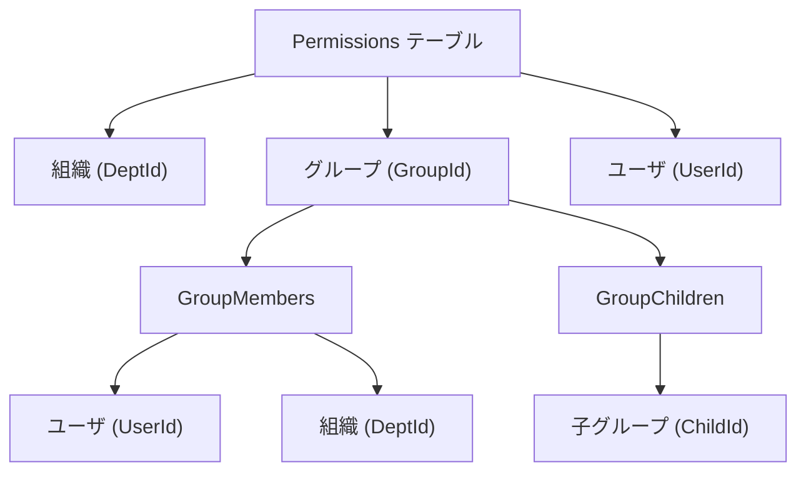
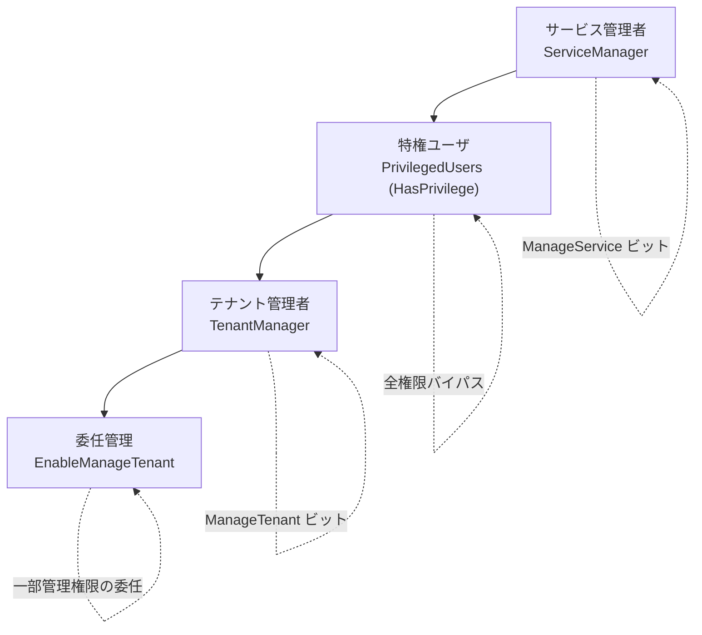
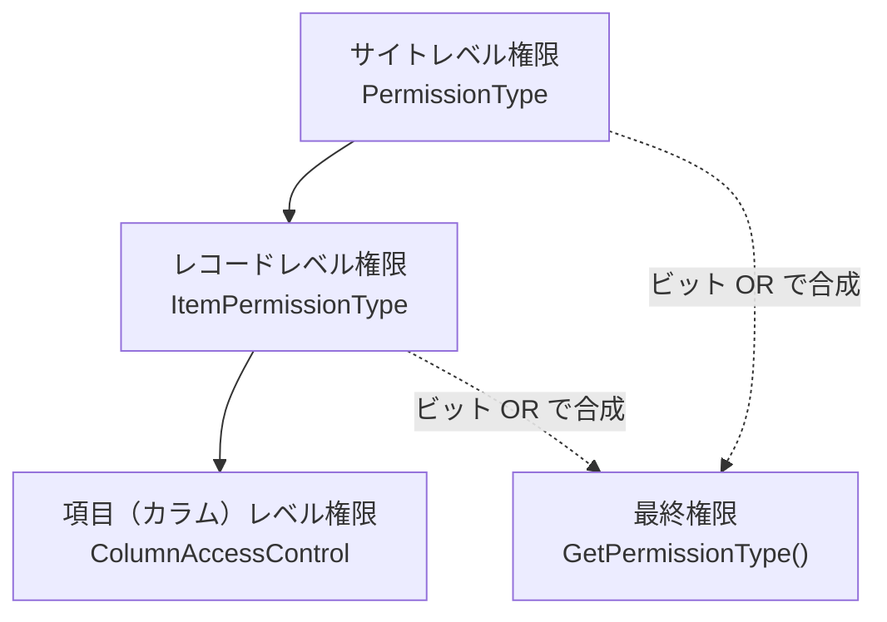
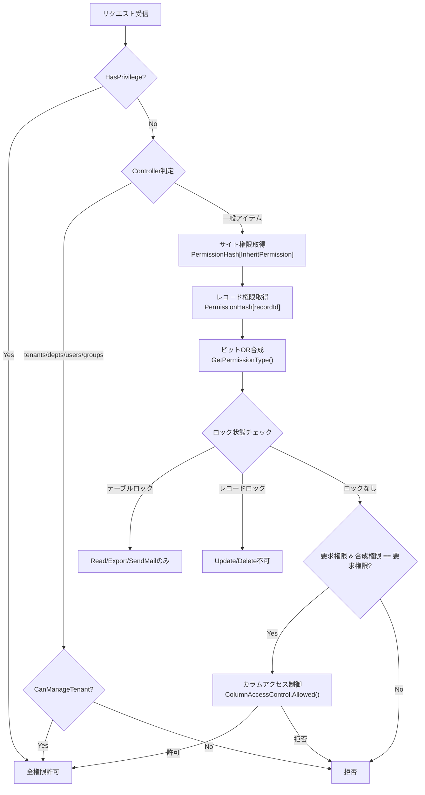

# ユーザアクセス権限・アクセス制御

プリザンターにおけるユーザ権限の階層構造（ユーザ・グループ・組織）と、サイト・レコード・項目の各レベルにおけるアクセス制御の実装詳細を調査する。

<!-- START doctoc generated TOC please keep comment here to allow auto update -->
<!-- DON'T EDIT THIS SECTION, INSTEAD RE-RUN doctoc TO UPDATE -->

- [調査情報](#調査情報)
- [調査目的](#調査目的)
- [権限種別（PermissionType）](#権限種別permissiontype)
    - [プリセット権限](#プリセット権限)
- [権限主体の階層構造](#権限主体の階層構造)
    - [概要](#概要)
    - [組織（Dept）](#組織dept)
    - [グループ（Group）](#グループgroup)
    - [ユーザ（User）](#ユーザuser)
    - [特権レベル](#特権レベル)
- [アクセス制御の3階層](#アクセス制御の3階層)
- [サイトレベルのアクセス制御](#サイトレベルのアクセス制御)
    - [権限継承（InheritPermission）](#権限継承inheritpermission)
    - [権限の取得SQL（GetPermissions）](#権限の取得sqlgetpermissions)
    - [権限のビットOR合成](#権限のビットor合成)
    - [サイト権限の設定](#サイト権限の設定)
- [レコードレベルのアクセス制御](#レコードレベルのアクセス制御)
    - [概要](#概要-1)
    - [権限の取得SQL（GetPermissionsById）](#権限の取得sqlgetpermissionsbyid)
    - [サイト権限とレコード権限の合成](#サイト権限とレコード権限の合成)
    - [レコード検索時の権限フィルタ](#レコード検索時の権限フィルタ)
    - [レコードの読み取り権限チェック](#レコードの読み取り権限チェック)
- [項目（カラム）レベルのアクセス制御](#項目カラムレベルのアクセス制御)
    - [概要](#概要-2)
    - [3種のカラムアクセス制御](#3種のカラムアクセス制御)
    - [許可判定ロジック（Allowed メソッド）](#許可判定ロジックallowed-メソッド)
    - [カラム権限の最終判定](#カラム権限の最終判定)
    - [PermissionForCreating / PermissionForUpdating](#permissionforcreating--permissionforupdating)
- [テーブル・レコードのロック機能](#テーブルレコードのロック機能)
- [コントローラごとの権限判定分岐](#コントローラごとの権限判定分岐)
- [権限解決の全体フロー](#権限解決の全体フロー)
- [結論](#結論)
- [関連ソースコード](#関連ソースコード)

<!-- END doctoc generated TOC please keep comment here to allow auto update -->

## 調査情報

| 調査日     | リポジトリ | ブランチ | タグ/バージョン    | コミット    | 備考 |
| ---------- | ---------- | -------- | ------------------ | ----------- | ---- |
| 2026-02-10 | Pleasanter | main     | Pleasanter_1.5.1.0 | `34f162a43` | -    |

## 調査目的

プリザンターにおけるアクセス制御の仕組みを明確にし、以下を理解する。

- ユーザ・グループ・組織の権限階層構造と構成パターン
- サイト・レコード・項目の各レベルにおけるアクセス制御の実装と優先度
- 権限の解決（合成）ロジック

---

## 権限種別（PermissionType）

権限はビットフラグ列挙型 `Permissions.Types` で定義される。ビット演算（OR / AND）により権限を合成・判定する。

**ソース**: `Implem.Pleasanter/Libraries/Security/Permissions.cs`

```csharp
public enum Types : long
{
    NotSet           = 0,            // 権限なし
    Read             = 1,            // 読み取り
    Create           = 2,            // 作成
    Update           = 4,            // 更新
    Delete           = 8,            // 削除
    SendMail         = 16,           // メール送信
    Export           = 32,           // エクスポート
    Import           = 64,           // インポート
    ManageSite       = 128,          // サイト管理
    ManagePermission = 256,          // 権限管理
    ManageTenant     = 1073741824,   // テナント管理（bit 30）
    ManageService    = 2147483648,   // サービス管理（bit 31）
}
```

### プリセット権限

| プリセット | パラメータ                       | 説明                 |
| ---------- | -------------------------------- | -------------------- |
| General    | `Parameters.Permissions.General` | 一般ユーザの既定権限 |
| Manager    | `Parameters.Permissions.Manager` | 管理者の既定権限     |

---

## 権限主体の階層構造

### 概要

プリザンターの権限主体は以下の3種類で、`Permissions` テーブルの各行はいずれか1つに紐づく。



### 組織（Dept）

**ソース**: `Implem.Pleasanter/Models/Depts/DeptModel.cs`

| フィールド | 型     | 説明       |
| ---------- | ------ | ---------- |
| TenantId   | int    | テナントID |
| DeptId     | int    | 組織ID     |
| DeptCode   | string | 組織コード |
| DeptName   | string | 組織名     |
| Disabled   | bool   | 無効フラグ |

- ユーザは1つの組織に所属できる（`Users.DeptId`）
- 組織は階層構造を持たない（フラット）

### グループ（Group）

**ソース**: `Implem.Pleasanter/Models/Groups/GroupModel.cs`

| フィールド | 型     | 説明       |
| ---------- | ------ | ---------- |
| TenantId   | int    | テナントID |
| GroupId    | int    | グループID |
| GroupName  | string | グループ名 |
| Disabled   | bool   | 無効フラグ |

#### グループメンバー

**ソース**: `Implem.Pleasanter/Models/GroupMembers/GroupMemberModel.cs`

| フィールド | 型   | 説明                       |
| ---------- | ---- | -------------------------- |
| GroupId    | int  | 所属グループID             |
| DeptId     | int  | 組織ID（組織単位で追加可） |
| UserId     | int  | ユーザID                   |
| ChildGroup | bool | 子グループフラグ           |
| Admin      | bool | グループ管理者フラグ       |

グループのメンバーには以下の3種類を追加できる。

- **ユーザ**: 個別ユーザを直接メンバーに追加
- **組織**: 組織を追加すると、その組織に所属するユーザ全員がメンバーとなる
- **子グループ**: 別のグループを子グループとして追加（`GroupChildren` テーブル）

#### グループの親子関係

**ソース**: `Implem.Pleasanter/Models/GroupChildren/GroupChildModel.cs`

| フィールド | 型  | 説明         |
| ---------- | --- | ------------ |
| GroupId    | int | 親グループID |
| ChildId    | int | 子グループID |

> **注意**: `GroupChildren` テーブルはグループ管理UIやLDAP同期で使用されるが、
> 権限チェックSQL（`GetPermissions`、`PermissionsWhere`）では
> `GroupChildren` テーブルは直接参照されない。
> 権限SQLは `GroupMembers` テーブルのみを使用する。

### ユーザ（User）

- ユーザは0または1つの組織（`DeptId`）に所属
- 複数のグループに所属可能
- `UserId = -1` は「全認証済みユーザ」を示す特殊値

### 特権レベル

プリザンターには通常の権限主体（ユーザ・グループ・組織）とは別に、特別な管理権限を持つ特権レベルが存在する。

#### 特権レベルの階層



#### 特権ユーザ（HasPrivilege）

**最上位の権限レベル**。全アクセス制御をバイパスする。

**ソース**: `Implem.ParameterAccessor/Parts/Security.cs`、
`Implem.Pleasanter/Libraries/Security/Permissions.cs`

**設定方法**: パラメータファイル `Security.json` の
`PrivilegedUsers` に LoginId をリストで指定する。

```csharp
// Security.cs（パラメータ定義）
public class Security
{
    public List<string> PrivilegedUsers;  // LoginIdのリスト
    // ...
}
```

```csharp
// Permissions.cs（判定ロジック）
public static bool PrivilegedUsers(string loginId)
{
    return loginId != null &&
        Parameters.Security.PrivilegedUsers?.Contains(loginId) == true;
}
```

**初期化**: `Context` のコンストラクタおよび `SetUser()` メソッドで
ログインユーザの LoginId から判定される。

```csharp
// Context.cs
HasPrivilege = Permissions.PrivilegedUsers(User.LoginId);
```

**TenantManager の自動付与**: 特権ユーザは `User.Set()` 時に
`TenantManager` が自動的に `true` に設定される。

**ソース**: `Implem.Pleasanter/Libraries/DataTypes/User.cs`

```csharp
TenantManager = dataRow.Bool("TenantManager")
    || Permissions.PrivilegedUsers(loginId: dataRow.String("LoginId"));
```

##### 特権ユーザがバイパスする機能一覧

| カテゴリ         | 対象                          | 効果                            |
| ---------------- | ----------------------------- | ------------------------------- |
| 権限チェック     | `ItemsCan()`                  | 全CRUD操作を無条件許可          |
| 権限チェック     | `Can()`, `CanRead()`          | サイト権限チェックをバイパス    |
| 権限チェック     | `HasPermission()`             | PermissionType が null でも許可 |
| SQLフィルタ      | `SetPermissionsWhere()`       | 権限フィルタSQLを追加しない     |
| SQLフィルタ      | 全文検索 WHERE                | 権限フィルタをスキップ          |
| 管理機能         | `CanManageTenant()`           | テナント管理権限として機能      |
| 管理機能         | `CanManageUser()`             | ユーザ管理権限として機能        |
| システム管理     | SysLogs 閲覧・エクスポート    | 特権ユーザのみアクセス可        |
| システム管理     | パラメータ再読込              | 特権ユーザのみ実行可            |
| システム管理     | SiteSettings マイグレーション | 特権ユーザのみ実行可            |
| ユーザ切替       | SwitchUser 機能               | 他ユーザとしてログイン可能      |
| ロック           | テーブル強制ロック解除        | ForceUnlockTable 実行可         |
| ロック           | レコードロック編集            | 他ユーザのロックも解除可        |
| UI表示           | サイトメニュー                | 全サイトをフィルタなしで表示    |
| UI表示           | ゴミ箱管理（トップ）          | トップレベルでもアクセス可      |
| UI表示           | 登録承認ボタン                | 特権ユーザのみ表示              |
| UI表示           | DBサイズ情報                  | バージョン画面に表示            |
| 設定制限         | UserSettings の Allow\*       | 全制限をバイパス                |
| サーバスクリプト | `context.HasPrivilege`        | スクリプト内で参照可能          |

核心となる権限チェックのコード:

```csharp
// ItemsCan — 全アイテムの権限チェック
private static bool ItemsCan(
    this Context context, SiteSettings ss,
    Types type, bool site, bool checkLocked = true)
{
    // ...（ロックチェック）
    return (ss.GetPermissionType(context: context, site: site) & type) == type
        || context.HasPrivilege;  // ← HasPrivilege なら無条件許可
}

// SQL WHERE バイパス
if (!context.HasPrivilege)  // ← 特権ユーザはフィルタを追加しない
{
    where.CheckRecordPermission(...);
}
```

##### ユーザ切替（SwitchUser）機能

特権ユーザのみが使用できる機能。他のユーザとしてログインし、
そのユーザの権限で操作を確認できる。

**ソース**: `Implem.Pleasanter/Models/Users/UserUtilities.cs`、
`Implem.Pleasanter/Models/Users/UserValidators.cs`

```csharp
// SwitchUser ボタン表示条件
context.HasPrivilege
    && User.Id != userModel.UserId
    && !disabled

// バリデーション
if (!Permissions.PrivilegedUsers(context.LoginId))
    return new ErrorData(type: Error.Types.InvalidRequest);
```

- 特権ユーザの画面にのみ「ユーザ切替」ボタンが表示される
- 切替先は `SwitchLoginId` セッションに保存される
- 元のユーザに戻る `ReturnSwitchUser` も特権ユーザのみ実行可

#### テナント管理者（TenantManager）

テナント単位の管理権限を持つユーザ。DB上の `Users.TenantManager`
フラグで設定される。

**ソース**: `Implem.Pleasanter/Libraries/Security/Permissions.cs`

```csharp
public static bool CanManageTenant(Context context)
{
    return context.User?.TenantManager == true
        || context.HasPrivilege;
}
```

- 部署・グループ・ユーザの管理が可能
- テナント設定の読み取り・更新が可能
- 特権ユーザは自動的にテナント管理者としても扱われる

`Admins()` メソッドで権限ビットが付与される:

```csharp
public static Types? Admins(Context context, Types? type = Types.NotSet)
{
    if (context.User?.TenantManager == true) type |= Types.ManageTenant;
    if (context.User?.ServiceManager == true) type |= Types.ManageService;
    return type;
}
```

#### サービス管理者（ServiceManager）

サービス全体の管理権限を持つユーザ。DB上の `Users.ServiceManager`
フラグで設定される。`ManageService` ビット（2147483648）が付与される。

- `AllowGroupAdministration` / `AllowGroupCreation`
  の UI 操作権を持つ

#### 委任管理（EnableManageTenant）

テナント管理者が特定ユーザに対して一部の管理権限を委任する仕組み。

**ソース**: `Implem.Pleasanter/Libraries/Settings/UserSettings.cs`

```csharp
public class UserSettings
{
    public bool? EnableManageTenant;       // テナント管理権限の委任
    public bool? DisableTopSiteCreation;   // トップサイト作成無効化
    public bool? DisableGroupAdmin;        // グループ管理無効化
    public bool? DisableGroupCreation;     // グループ作成無効化
    public bool? DisableApi;               // API無効化
    // ...
}
```

EnableManageTenant が有効なユーザは、テナント管理者なしでも
一部の管理操作が可能になる。

| 操作                       | EnableManageTenant での可否 |
| -------------------------- | --------------------------- |
| 部署の CRUD                | 可能                        |
| グループの CRUD            | 可能                        |
| ユーザの Read/Update       | 可能                        |
| ユーザの Create            | **不可**                    |
| テナント設定の Read/Update | 可能                        |

```csharp
// CanCreate - users コントローラ
case "users":
    if (context.UserSettings?.EnableManageTenant == true)
    {
        return false;   // ← 委任管理ではユーザ作成は不許可
    }
    else
    {
        return CanManageTenant(context: context);
    }
```

#### グループ管理の制御

グループの管理権限は `UserSettings` の `Allow*` メソッドで制御される。

**ソース**: `UserSettings.cs`

```csharp
public bool AllowGroupAdministration(Context context)
{
    if (context.HasPrivilege) return true;
    return (!Parameters.User.DisableGroupAdmin
        || context.User.AllowGroupAdministration)
            && DisableGroupAdmin != true;
}

public bool AllowGroupCreation(Context context)
{
    if (context.HasPrivilege) return true;
    return (!Parameters.User.DisableGroupCreation
        || context.User.AllowGroupCreation)
            && DisableGroupCreation != true;
}
```

| メソッド                   | パラメータ制御           | UserSettings 制御        | 特権ユーザ |
| -------------------------- | ------------------------ | ------------------------ | ---------- |
| `AllowGroupAdministration` | `DisableGroupAdmin`      | `DisableGroupAdmin`      | 常に true  |
| `AllowGroupCreation`       | `DisableGroupCreation`   | `DisableGroupCreation`   | 常に true  |
| `AllowCreationAtTopSite`   | `DisableTopSiteCreation` | `DisableTopSiteCreation` | 常に true  |
| `AllowApi`                 | `DisableApi`             | `DisableApi`             | 常に true  |

グループ操作の権限判定:

```csharp
// CanReadGroup: グループ一覧の閲覧
public static bool CanReadGroup(Context context)
{
    return context.UserSettings
        ?.AllowGroupAdministration(context: context) == true
        && (context.Id == 0
            || CanManageTenant(context: context)
            || Groups(context: context).Any()
            || context.HasPrivilege);
}

// CanEditGroup: グループの編集・削除
public static bool CanEditGroup(Context context)
{
    return context.UserSettings
        ?.AllowGroupAdministration(context: context) == true
        && (context.Id == 0
            || CanManageTenant(context: context)
            || Groups(context: context).Any(o => o["Admin"].ToBool())
            || context.HasPrivilege);
}
```

- グループ編集は `GroupMembers.Admin = true`（グループ管理者）
  またはテナント管理者/特権ユーザが可能

---

## アクセス制御の3階層

プリザンターのアクセス制御は以下の3階層で構成される。



---

## サイトレベルのアクセス制御

### 権限継承（InheritPermission）

サイトは `InheritPermission` フィールドにより、親サイトの権限を継承できる。

**ソース**: `Implem.Pleasanter/Libraries/Settings/SiteSettings.cs`

```csharp
public long InheritPermission;
```

- `InheritPermission` は権限継承元サイトの `SiteId` を指す
- `Permissions` テーブルの `ReferenceId` カラムと `Sites.InheritPermission` を JOIN して権限を解決する
- 子サイトが独自の権限を持つ場合は `InheritPermission = 自身のSiteId` とする

### 権限の取得SQL（GetPermissions）

**ソース**: `Implem.Pleasanter/Rds/Implem.SqlServer/SqlServerSqls.cs`

ログイン時に全サイトの権限を一括取得し、`Context.PermissionHash`（`Dictionary<long, Types>`）にキャッシュする。SQLは5つの `UNION ALL` で構成される。

| #   | 権限ソース                  | SQL JOIN パス                                         |
| --- | --------------------------- | ----------------------------------------------------- |
| 1   | 組織（Dept）直接指定        | `Sites → Permissions (InheritPermission) → Depts`     |
| 2   | グループ経由の組織          | `Sites → Permissions → Groups → GroupMembers → Depts` |
| 3   | グループ経由のユーザ        | `Sites → Permissions → Groups → GroupMembers → Users` |
| 4   | ユーザ直接指定              | `Sites → Permissions (UserId > 0 AND UserId = @_U)`   |
| 5   | 全認証ユーザ（UserId = -1） | `Sites → Permissions (UserId = -1)`                   |

```sql
-- パターン1: 組織直接
select distinct "Sites"."SiteId" as "ReferenceId", "Permissions"."PermissionType"
from "Sites"
    inner join "Permissions" on "Permissions"."ReferenceId"="Sites"."InheritPermission"
    inner join "Depts" on "Permissions"."DeptId"="Depts"."DeptId"
where "Sites"."TenantId"=@_T
    and "Depts"."DeptId"=@_D
    and "Depts"."Disabled"='false'

-- パターン2〜5は UNION ALL で結合（省略）
```

### 権限のビットOR合成

**ソース**: `Implem.Pleasanter/Libraries/Security/Permissions.cs` `Hash()` メソッド

同一 `ReferenceId` に対する複数行の権限をビット OR で合成する。

```csharp
private static Dictionary<long, Types> Hash(EnumerableRowCollection<DataRow> dataRows)
{
    var hash = dataRows
        .Select(o => o.Long("ReferenceId"))
        .Distinct()
        .ToDictionary(o => o, o => Types.NotSet);
    dataRows.ForEach(dataRow =>
    {
        var key = dataRow.Long("ReferenceId");
        hash[key] |= (Types)dataRow.Long("PermissionType");
    });
    return hash;
}
```

> **重要**: ユーザ・グループ・組織間に優先順位は存在しない。
> すべての権限ソースがビット OR で合成される。
> 例えば、組織経由で `Read` を持ち、ユーザ直接で `Update` を持つ場合、
> 結果は `Read | Update` となる。

### サイト権限の設定

**ソース**: `SiteSettings.cs` `SetPermissions()` メソッド

```csharp
private void SetPermissions(Context context, SiteSettings ss, long referenceId = 0)
{
    // 公開ページ → Read固定
    // フォーム → Create固定
    switch ((context.Publish, context.IsForm, context.Controller)) { ... }

    // サイトレベル権限: InheritPermission経由
    if (context.PermissionHash?.ContainsKey(ss.InheritPermission) == true)
        ss.PermissionType = context.PermissionHash[ss.InheritPermission];

    // レコードレベル権限: 個別レコードID
    if (referenceId != 0 && context.PermissionHash?.ContainsKey(referenceId) == true)
        ss.ItemPermissionType = context.PermissionHash[referenceId];

    // テーブルロック時の権限制限
    if (LockedTable())
    {
        var lockedPermissionType = Permissions.Types.Read
            | Permissions.Types.Export | Permissions.Types.SendMail;
        ss.PermissionType &= lockedPermissionType;
        ss.ItemPermissionType &= lockedPermissionType;
    }
}
```

---

## レコードレベルのアクセス制御

### 概要

サイト単位の権限に加えて、個別レコードに対して権限を設定できる（`Permissions` テーブルの `ReferenceId` にレコードIDを設定）。

### 権限の取得SQL（GetPermissionsById）

**ソース**: `SqlServerSqls.cs` `GetPermissionsById`

`GetPermissions` の結果に `UNION ALL` で追加される。`Items` テーブル経由で個別レコードの `ReferenceId` に対する権限を取得する。ソースパターンはサイトレベルと同じ5パターン（Dept直接、Group→Dept、Group→User、User直接、全ユーザ）。

### サイト権限とレコード権限の合成

**ソース**: `SiteSettings.cs` `GetPermissionType()` メソッド

```csharp
public Permissions.Types GetPermissionType(Context context, bool site = false)
{
    var permission = Permissions.Types.NotSet;
    if (PermissionType != null)
        permission |= (Permissions.Types)PermissionType;       // サイト権限
    if (ItemPermissionType != null && !site)
        permission |= (Permissions.Types)ItemPermissionType;   // レコード個別権限
    return permission;
}
```

| パラメータ           | 内容                     |
| -------------------- | ------------------------ |
| `PermissionType`     | サイトレベル権限         |
| `ItemPermissionType` | レコードレベル権限       |
| `site = false`       | レコード権限も含めて合成 |
| `site = true`        | サイト権限のみ           |

> **重要**: サイト権限とレコード権限はビット OR で合成される。つまりレコード権限はサイト権限を「拡張」する方向に働く。レコード権限でサイト権限を制限（縮小）することはできない。

### レコード検索時の権限フィルタ

**ソース**: `Permissions.cs` `SetPermissionsWhere()` メソッド

一覧表示時のSQLの WHERE 句に権限フィルタを追加する。

```csharp
// サイト権限で不足している場合のみ、レコード単位の権限チェックを追加
if (!CheckSitePermission(context, ss, permissionType) && checkPermission)
{
    where.CheckRecordPermission(
        context: context,
        ss: ss,
        // サイト権限で既に持っている部分をXORで除外
        permissionType: permissionType ^ ((ss.PermissionType ?? Types.NotSet) & permissionType));
}
```

- サイト権限で要求された権限を満たしている場合 → レコード権限チェックは省略（パフォーマンス最適化）
- サイト権限で不足している場合 → XOR演算で不足分のみをレコード権限で補完チェック

### レコードの読み取り権限チェック

```csharp
public static bool CanRead(Context context, long siteId, long id)
{
    var canRead = CanRead(context: context, siteId: siteId)        // サイト権限での判定
        || (GetById(context: context, id: id) & Types.Read) == Types.Read; // レコード権限での判定
    return canRead;
}
```

---

## 項目（カラム）レベルのアクセス制御

### 概要

各カラムに対して、作成・読み取り・更新の個別アクセス制御を設定できる。

**ソース**: `Implem.Pleasanter/Libraries/Settings/ColumnAccessControl.cs`

```csharp
public class ColumnAccessControl
{
    public string ColumnName;
    public List<int> Depts;          // 許可する組織IDリスト
    public List<int> Groups;         // 許可するグループIDリスト
    public List<int> Users;          // 許可するユーザIDリスト
    public List<string> RecordUsers; // レコード関連ユーザ（Manager, Ownerなど）
    public Permissions.Types? Type;  // 必要な権限タイプ
}
```

### 3種のカラムアクセス制御

**ソース**: `SiteSettings.cs`

```csharp
public List<ColumnAccessControl> CreateColumnAccessControls;  // 作成時
public List<ColumnAccessControl> ReadColumnAccessControls;     // 読み取り時
public List<ColumnAccessControl> UpdateColumnAccessControls;   // 更新時
```

### 許可判定ロジック（Allowed メソッド）

```csharp
public bool Allowed(Context context, SiteSettings ss, List<string> mine)
```

判定は以下の順序で行われ、最初にマッチした条件で決定する。

| 順序 | 条件                                                           | 結果 |
| ---- | -------------------------------------------------------------- | ---- |
| 1    | 全フィールド（Depts/Groups/Users/RecordUsers/Type）が未設定    | 許可 |
| 2    | ユーザの組織IDが `Depts` リストに含まれる                      | 許可 |
| 3    | ユーザの所属グループが `Groups` リストに含まれる               | 許可 |
| 4    | ユーザIDが `Users` リストに含まれる（`-1` で全認証ユーザ対象） | 許可 |
| 5    | `Type` が設定されており、サイト権限で `Type` を満たす          | 許可 |
| 6    | `Type` が設定されており、`RecordUsers` 未設定                  | 拒否 |
| 7    | `RecordUsers` に該当する（自分のレコードか）                   | 許可 |
| 8    | 上記いずれにも該当しない                                       | 拒否 |

```csharp
// DeptContains: 組織の有効チェック込み
private bool DeptContains(Context context)
{
    if (Depts?.Contains(context.DeptId) != true) return false;
    var dept = SiteInfo.Dept(tenantId: context.TenantId, deptId: context.DeptId);
    return dept?.Id == context.DeptId && dept?.Disabled == false;
}

// GroupContains: グループの有効チェック込み
private bool GroupContains(Context context)
{
    return Groups?.Any() == true
        && context.Groups?.Any() == true
        && Groups.Intersect(context.Groups)
            .Any(o => {
                var group = SiteInfo.Group(tenantId: context.TenantId, groupId: o);
                return group?.Id == o && group?.Disabled == false;
            });
}
```

### カラム権限の最終判定

**ソース**: `Permissions.cs` `ColumnPermissionType()` メソッド

```csharp
public static ColumnPermissionTypes ColumnPermissionType(
    Context context, SiteSettings ss, Column column, BaseModel baseModel)
{
    var canEdit = column.CanEdit(context, ss, baseModel);
    if (context.IsNew)
    {
        return column.CanCreate(...) && canEdit
            ? ColumnPermissionTypes.Update
            : column.CanRead(...)
                ? ColumnPermissionTypes.Read
                : ColumnPermissionTypes.Deny;
    }
    else
    {
        return column.CanRead(...) && canEdit
            ? ColumnPermissionTypes.Update
            : column.CanRead(...)
                ? ColumnPermissionTypes.Read
                : ColumnPermissionTypes.Deny;
    }
}
```

| 結果   | 新規作成時                        | 既存レコード更新時              |
| ------ | --------------------------------- | ------------------------------- |
| Update | CanCreate=true かつ CanEdit=true  | CanRead=true かつ CanEdit=true  |
| Read   | CanCreate=false かつ CanRead=true | CanRead=true かつ CanEdit=false |
| Deny   | CanRead=false                     | CanRead=false                   |

### PermissionForCreating / PermissionForUpdating

**ソース**: `SiteSettings.cs`

```csharp
public Dictionary<string, Permissions.Types> PermissionForCreating;
public Dictionary<string, Permissions.Types> PermissionForUpdating;
```

レコード作成・更新時に、指定した権限主体（Dept/Group/User またはカラム名 Manager/Owner 等）に対して自動的に権限を付与する仕組み。キーは `"Dept"`、`"Group"`、`"User"` またはカラム名。

---

## テーブル・レコードのロック機能

**ソース**: `SiteSettings.cs`

| ロック種別     | フィールド                             | 制限内容                                                 |
| -------------- | -------------------------------------- | -------------------------------------------------------- |
| テーブルロック | `LockedTableTime`, `LockedTableUser`   | 権限を Read/Export/SendMail に制限。Create/Import を禁止 |
| レコードロック | `LockedRecordTime`, `LockedRecordUser` | Update/Delete を禁止                                     |

```csharp
// ItemsCan での判定
if (checkLocked && ss.Locked())
{
    if ((type & Types.Update) == Types.Update) return false;
    if ((type & Types.Delete) == Types.Delete) return false;
}
if (ss.LockedTable())
{
    if ((type & Types.Create) == Types.Create) return false;
    if ((type & Types.Import) == Types.Import) return false;
}
```

---

## コントローラごとの権限判定分岐

**ソース**: `Permissions.cs` `CanRead()`, `CanCreate()`, `CanUpdate()`, `CanDelete()` 拡張メソッド

各 CRUD 操作は `context.Controller` の値により判定ロジックが分岐する。

| Controller     | Read                 | Create           | Update               | Delete           |
| -------------- | -------------------- | ---------------- | -------------------- | ---------------- |
| tenants        | CanManageTenant      | 不可             | CanManageTenant      | 不可             |
| depts          | CanManageTenant      | CanManageTenant  | CanManageTenant      | CanManageTenant  |
| groups         | CanReadGroup         | CanCreateGroup   | CanEditGroup         | CanEditGroup     |
| users          | CanManageTenant/自分 | CanManageTenant  | CanManageTenant/自分 | CanManageTenant  |
| サイトエディタ | CanManageSite        | CanManageSite    | CanManageSite        | CanManageSite    |
| 一般アイテム   | ItemsCan(Read)       | ItemsCan(Create) | ItemsCan(Update)     | ItemsCan(Delete) |

> **注**: `EnableManageTenant` UserSettings が有効な場合、テナント管理権限なしでも一部操作が可能になる。

---

## 権限解決の全体フロー



---

## 結論

| 観点                           | 結論                                                                                                    |
| ------------------------------ | ------------------------------------------------------------------------------------------------------- |
| 権限主体の種類                 | ユーザ、グループ、組織の3種類。これらに優先順位はなく、全てビットORで合成される                         |
| グループの構成                 | グループにはユーザ・組織・子グループをメンバーとして追加可能                                            |
| グループの権限SQL              | `GroupMembers` テーブル経由で解決。`GroupChildren` は権限SQLでは参照されない                            |
| サイト権限の継承               | `InheritPermission` で親サイトの権限を継承。子サイトが独自権限を持つ場合は自身のSiteIdを設定            |
| サイト権限とレコード権限の関係 | ビットORで合成される。レコード権限はサイト権限を「拡張」する方向にのみ機能し、制限（縮小）はできない    |
| レコード検索時の最適化         | サイト権限で充足する場合はレコード権限チェックを省略。不足分のみXOR演算で補完チェック                   |
| カラムアクセス制御             | 作成・読み取り・更新の3種。Dept→Group→User→権限Type→RecordUsersの順で評価し、最初にマッチした条件で決定 |
| ロック機能                     | テーブルロック（Create/Import禁止）とレコードロック（Update/Delete禁止）の2種類                         |
| 最高特権                       | `HasPrivilege`（設定ファイル指定）が全アクセス制御をバイパス                                            |
| 全認証ユーザ指定               | `UserId = -1` で全認証済みユーザに権限を付与可能                                                        |

---

## 関連ソースコード

| ファイル                                                      | 説明                              |
| ------------------------------------------------------------- | --------------------------------- |
| `Implem.Pleasanter/Libraries/Security/Permissions.cs`         | 権限チェックの中核ロジック        |
| `Implem.Pleasanter/Libraries/Security/Permission.cs`          | 単一権限エントリの表現            |
| `Implem.Pleasanter/Libraries/Settings/SiteSettings.cs`        | サイト設定・権限管理              |
| `Implem.Pleasanter/Libraries/Settings/ColumnAccessControl.cs` | 項目レベルアクセス制御            |
| `Implem.Pleasanter/Libraries/Settings/Column.cs`              | カラム定義・CanCreate/Read/Update |
| `Implem.Pleasanter/Models/Permissions/PermissionModel.cs`     | 権限モデル                        |
| `Implem.Pleasanter/Models/Permissions/PermissionUtilities.cs` | 権限管理UI・ユーティリティ        |
| `Implem.Pleasanter/Models/Groups/GroupModel.cs`               | グループモデル                    |
| `Implem.Pleasanter/Models/GroupMembers/GroupMemberModel.cs`   | グループメンバーモデル            |
| `Implem.Pleasanter/Models/GroupChildren/GroupChildModel.cs`   | 子グループモデル                  |
| `Implem.Pleasanter/Models/Depts/DeptModel.cs`                 | 組織モデル                        |
| `Rds/Implem.SqlServer/SqlServerSqls.cs`                       | 権限取得SQL定義                   |
| `Implem.ParameterAccessor/Parts/Security.cs`                  | PrivilegedUsers設定               |
| `Implem.ParameterAccessor/Parts/Permissions.cs`               | 権限パラメータ設定                |
| `Implem.Pleasanter/Libraries/Requests/Context.cs`             | HasPrivilege初期化                |
| `Implem.Pleasanter/Libraries/DataTypes/User.cs`               | TenantManager自動付与             |
| `Implem.Pleasanter/Libraries/Settings/UserSettings.cs`        | 委任管理・グループ管理制御        |
| `Implem.Pleasanter/Models/Users/UserUtilities.cs`             | SwitchUser機能                    |
| `Implem.Pleasanter/Models/Users/UserValidators.cs`            | SwitchUserバリデーション          |
