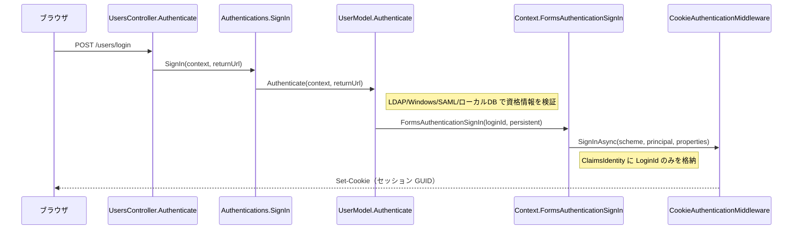
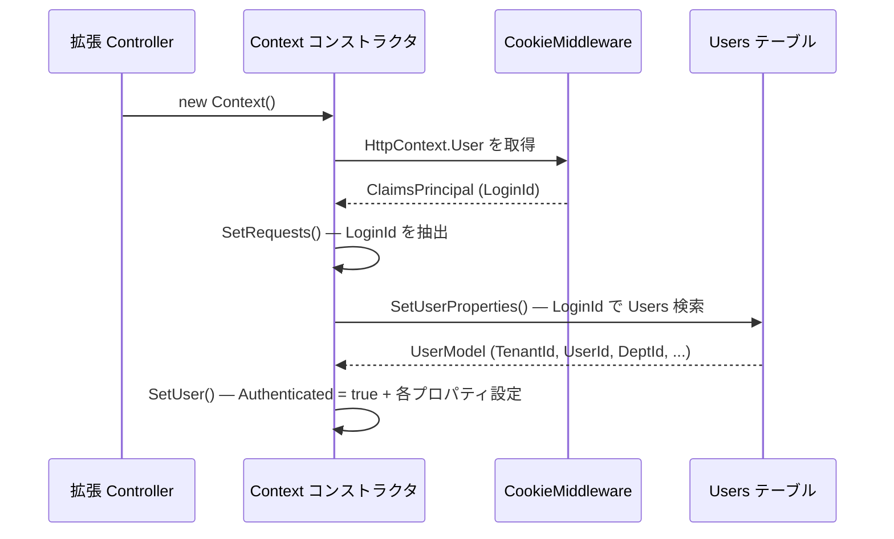
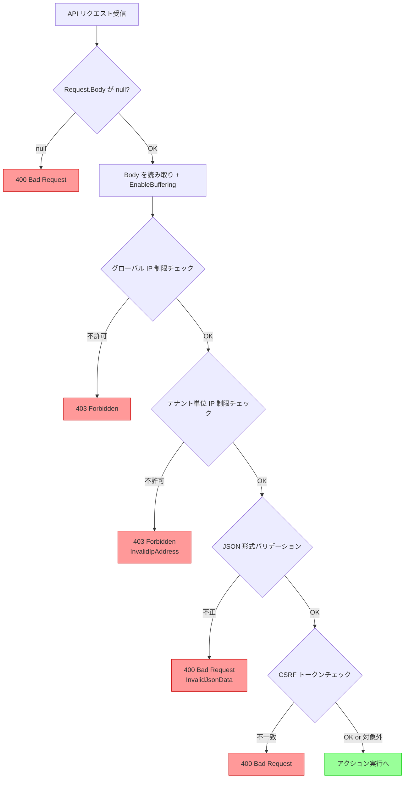
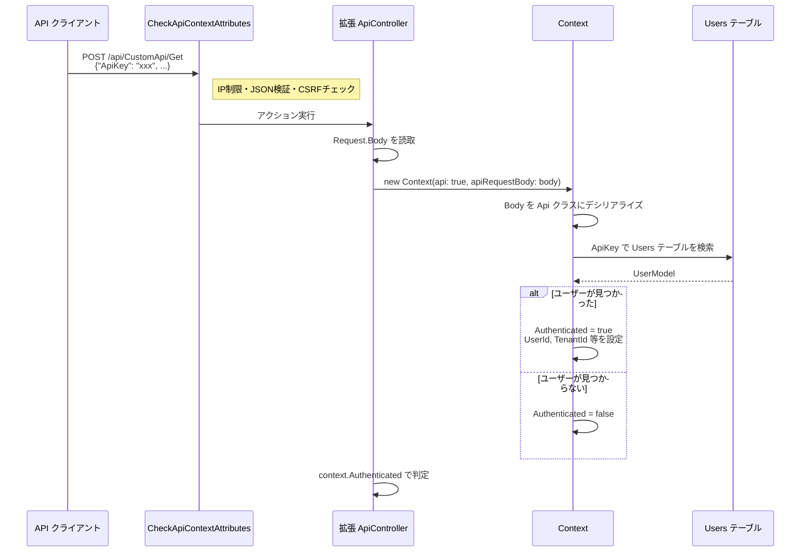
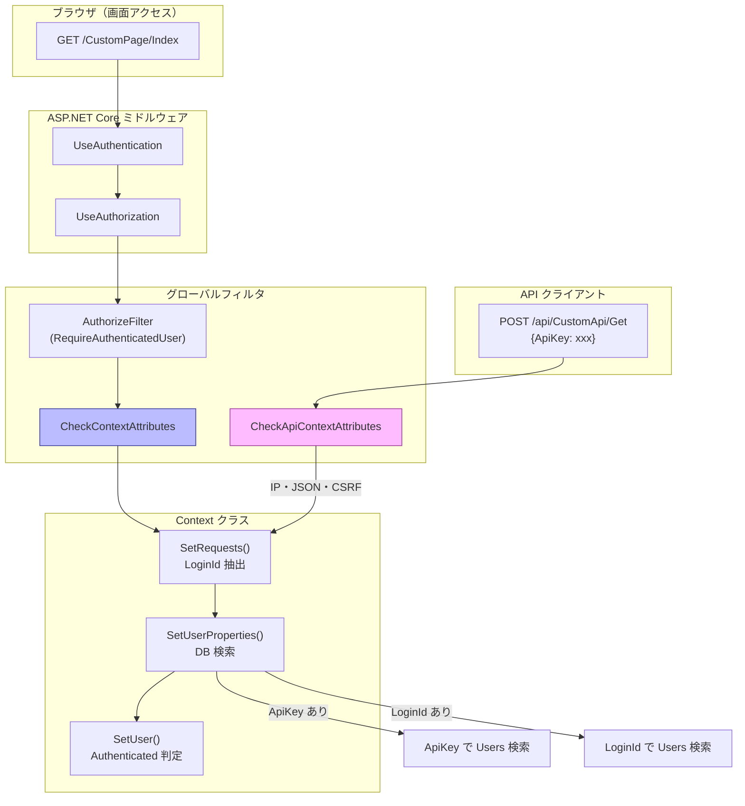

# プリザンター認証基盤の詳細

プリザンターの認証基盤（Cookie 認証・API キー認証・権限チェック）の内部実装を調査した。
拡張ライブラリで Controller / ApiController を作成する際の認証利用方法を含む。

<!-- START doctoc generated TOC please keep comment here to allow auto update -->
<!-- DON'T EDIT THIS SECTION, INSTEAD RE-RUN doctoc TO UPDATE -->

- [調査情報](#調査情報)
- [調査目的](#調査目的)
- [Cookie 認証（MVC Controller 用）](#cookie-認証mvc-controller-用)
    - [Startup.cs での認証設定](#startupcs-での認証設定)
    - [ログイン時の Cookie 発行フロー](#ログイン時の-cookie-発行フロー)
    - [`new Context()` でのユーザー情報取得フロー](#new-context-でのユーザー情報取得フロー)
    - [CheckContextAttributes（画面用フィルタ）](#checkcontextattributes画面用フィルタ)
    - [拡張 Controller での認証利用まとめ](#拡張-controller-での認証利用まとめ)
- [API キー認証（ApiController 用）](#api-キー認証apicontroller-用)
    - [CheckApiContextAttributes の処理内容](#checkapicontextattributes-の処理内容)
    - [API キー認証フロー](#api-キー認証フロー)
    - [API キー検証の内部処理](#api-キー検証の内部処理)
    - [API キーの生成方法](#api-キーの生成方法)
    - [Cookie 認証と API キー認証の併用](#cookie-認証と-api-キー認証の併用)
- [権限チェック](#権限チェック)
    - [HasPermission — サイトアクセス権限](#haspermission--サイトアクセス権限)
    - [HasPrivilege — 特権ユーザー判定](#hasprivilege--特権ユーザー判定)
    - [PermissionHash — 詳細権限の取得](#permissionhash--詳細権限の取得)
- [認証基盤の構成図](#認証基盤の構成図)
- [関連パラメータ](#関連パラメータ)
- [結論](#結論)
- [関連ソースコード](#関連ソースコード)

<!-- END doctoc generated TOC please keep comment here to allow auto update -->

## 調査情報

| 調査日        | リポジトリ | ブランチ | タグ/バージョン | コミット    | 備考     |
| ------------- | ---------- | -------- | --------------- | ----------- | -------- |
| 2026年2月12日 | Pleasanter | main     |                 | `34f162a43` | 初回調査 |

## 調査目的

- Cookie 認証（MVC Controller 用）の内部フローを明確にする
- API キー認証（ApiController 用）の検証ロジックを把握する
- `CheckContextAttributes` / `CheckApiContextAttributes` フィルタの処理内容を明らかにする
- `Context` クラスでのユーザー情報取得・権限チェックの仕組みを理解する

---

## Cookie 認証（MVC Controller 用）

### Startup.cs での認証設定

プリザンター本体は ASP.NET Core 標準の Cookie 認証を使用する。
`Startup.ConfigureServices()` で以下の設定が行われる。

**グローバル認可フィルタ**（全コントローラーに一括適用）:

```csharp
// Startup.cs L109
options.Filters.Add(
    new AuthorizeFilter(
        new AuthorizationPolicyBuilder()
            .RequireAuthenticatedUser()
            .Build()));
```

この設定により、**すべてのコントローラーに対して認証が要求される**。
個別に `[Authorize]` 属性を付与しなくても認証チェックが有効になる。
認証を不要にするには `[AllowAnonymous]` を明示的に指定する必要がある。

**Cookie 認証スキームの登録**:

```csharp
// Startup.cs L133-158
services
    .AddAuthentication(
        CookieAuthenticationDefaults.AuthenticationScheme)
    .AddCookie(o =>
    {
        o.LoginPath = new PathString("/users/login");
        o.ExpireTimeSpan = TimeSpan.FromMinutes(
            Parameters.Session.RetentionPeriod);
    });
```

| 設定項目          | 値                                           |
| ----------------- | -------------------------------------------- |
| 認証スキーム      | `CookieAuthenticationDefaults` (`"Cookies"`) |
| Cookie 名         | 未指定（デフォルト `.AspNetCore.Cookies`）   |
| ログインパス      | `/users/login`                               |
| 有効期限          | `Parameters.Session.RetentionPeriod` 分      |
| SlidingExpiration | デフォルト（`true`）                         |

**認証チケットのサーバーサイド保存**:

```csharp
// Startup.cs L160-162
services.AddSingleton<ITicketStore, AuthenticationTicketStore>();
services.AddOptions<CookieAuthenticationOptions>(
    CookieAuthenticationDefaults.AuthenticationScheme)
    .Configure<ITicketStore>(
        (options, store) => options.SessionStore = store);
```

`AuthenticationTicketStore`（カスタム `ITicketStore` 実装）により、
認証チケットはサーバーサイド（DB または Redis）に保存される。
Cookie にはセッション識別子（GUID）のみが格納される。

### ログイン時の Cookie 発行フロー



認証成功時に `Context.FormsAuthenticationSignIn()` が呼ばれ、
最小限のクレームで Cookie が発行される:

```csharp
// Context.cs L1173-1182
public void FormsAuthenticationSignIn(
    string userName, bool createPersistentCookie)
{
    var userClaims = new List<Claim>
    {
        new Claim(ClaimTypes.Name, userName)
    };
    var principal = new ClaimsPrincipal(
        new ClaimsIdentity(userClaims, "Forms"));
    var properties = new AuthenticationProperties()
    {
        IsPersistent = createPersistentCookie
    };
    AspNetCoreHttpContext.Current.SignInAsync(
        scheme: CookieAuthenticationDefaults
            .AuthenticationScheme,
        principal: principal,
        properties: properties);
}
```

**Cookie に格納されるクレーム**:

| クレーム           | 値                   |
| ------------------ | -------------------- |
| `ClaimTypes.Name`  | ユーザーの `LoginId` |
| AuthenticationType | `"Forms"`            |

`TenantId`、`UserId`、`DeptId` 等は Cookie には**含まれない**。
これらはリクエストごとに DB から再取得される（後述）。

### `new Context()` でのユーザー情報取得フロー

MVC Controller で `new Context()` を呼ぶと、
以下の 3 ステップでユーザー情報が設定される。



**Step 1: `SetRequests()`** — Cookie から `LoginId` を抽出:

```csharp
// Context.cs L233-269
var user = AspNetCoreHttpContext.Current.User;
LoginId = user.Identity?.Name;  // ClaimTypes.Name → LoginId
IsAuthenticated = user.Identity?.IsAuthenticated;
```

**Step 2: `SetUserProperties()`** — `LoginId` で DB 検索:

```csharp
// Context.cs L398-420
if (!LoginId.IsNullOrEmpty())
{
    SetUser(userModel: GetUser(
        where: Rds.UsersWhere().LoginId(loginId)));
}
```

**Step 3: `SetUser()`** — DB の結果から Context プロパティを設定:

```csharp
// Context.cs L475-490
private void SetUser(UserModel userModel, ...)
{
    if (userModel.AccessStatus
        == Databases.AccessStatuses.Selected)
    {
        Authenticated = true;
        TenantId = userModel.TenantId;
        DeptId = userModel.DeptId;
        UserId = userModel.UserId;
        Language = userModel.Language;
        HasPrivilege = Permissions.PrivilegedUsers(
            userModel.LoginId);
        // ... その他のプロパティ
    }
}
```

> **重要**: `IsAuthenticated`（Cookie 上の認証状態）と
> `Authenticated`（DB にユーザーが存在するか）は**別のプロパティ**である。
> Cookie が有効でも DB 上にユーザーがいなければ `Authenticated = false` となる。

### CheckContextAttributes（画面用フィルタ）

画面リクエスト用の認可フィルタ `CheckContextAttributes` が
グローバルフィルタとして全 MVC Controller に適用される。

```csharp
// Startup.cs L110
options.Filters.Add(new CheckContextAttributes());
```

このフィルタは以下のチェックを実行する:

| チェック内容                     | 結果                                            |
| -------------------------------- | ----------------------------------------------- |
| IP アドレス制限                  | 不許可 → 403 Forbidden                          |
| 契約期限チェック（OverDeadline） | 期限切れ → サインアウト＋ログインへリダイレクト |
| CSRF トークン検証                | 不一致 → Bad Request                            |
| DB 上のユーザー存在チェック      | 不在 → 強制サインアウト                         |
| パラメータ構文エラー             | エラー → エラーページへリダイレクト             |
| アップロードファイル名検証       | 不正 → エラー                                   |

拡張ライブラリの MVC Controller にもこのフィルタが自動適用されるため、
**追加の認証・認可コードを書かなくても基本的なセキュリティが確保される**。

### 拡張 Controller での認証利用まとめ

```csharp
[Authorize]  // ※ グローバルフィルタで既に適用済みだが明示推奨
public class CustomPageController : Controller
{
    [HttpGet]
    public ActionResult Index()
    {
        var context = new Context();
        // ↑ Cookie → LoginId → DB検索 の流れで
        //   以下のプロパティが自動設定される

        // context.Authenticated  — true/false
        // context.UserId         — ユーザー ID
        // context.TenantId       — テナント ID
        // context.DeptId         — 部署 ID
        // context.UserName       — ユーザー名
        // context.LoginId        — ログイン ID
        // context.HasPrivilege   — 特権ユーザーか
        // context.Language       — ユーザーの言語設定

        if (!context.Authenticated)
        {
            return Redirect("/errors/403");
        }
        // ビジネスロジック
        return Content("OK", "text/html");
    }
}
```

---

## API キー認証（ApiController 用）

### CheckApiContextAttributes の処理内容

`[CheckApiContextAttributes]` は `IAuthorizationFilter` を実装した
認可フィルタで、API リクエストに対して以下の 5 段階のチェックを
実行する。



| #   | チェック内容                  | 条件                                      | 失敗時レスポンス                  |
| --- | ----------------------------- | ----------------------------------------- | --------------------------------- |
| 1   | リクエスト Body null チェック | `Request.Body == null`                    | 400 Bad Request                   |
| 2   | グローバル IP 制限            | `Parameters.Security.AllowIpAddresses`    | 403 Forbidden                     |
| 3   | テナント単位 IP 制限          | `ContractSettings.AllowedIpAddress()`     | 403 Forbidden (InvalidIpAddress)  |
| 4   | JSON 形式バリデーション       | `context.InvalidJsonData`                 | 400 Bad Request (InvalidJsonData) |
| 5   | CSRF トークン検証             | `TokenCheck` 有効 & Cookie 認証済みの場合 | 400 Bad Request                   |

> **注意**: CSRF トークン検証（#5）は
> `Parameters.Security.TokenCheck == true` かつ
> `User.Identity.IsAuthenticated == true`
> （Cookie 認証済み）の場合のみ実行される。
> API キーのみで認証するリクエストでは実行されない。

### API キー認証フロー

API キーはリクエストボディの JSON に含めて送信する。
`Context` コンストラクタ内で API キーの抽出と
ユーザー検索が自動的に行われる。



**API キーの送信形式**（クライアント側）:

```json
{
    "ApiKey": "xxxxxxxxxxxxxxxxxxxxxxxxxxxxxxxx",
    "Offset": 0,
    "PageSize": 100
}
```

**`Api` クラスの構造**（リクエスト Body のデシリアライズ先）:

```csharp
// Libraries/Requests/Api.cs
public class Api
{
    public decimal ApiVersion { get; set; }
    public string ApiKey { get; set; }  // ← ここから取得
    public View View { get; set; }
    public List<string> Keys { get; set; }
    public int Offset { get; set; }
    public int PageSize { get; set; }
    public string Token { get; set; }   // CSRF トークン
    // ...
}
```

### API キー検証の内部処理

`Context.SetUserProperties()` 内で API キーによる
ユーザー解決が行われる:

```csharp
// Context.cs L398-420
var jsonApi = RequestDataString.Deserialize<Api>();

if (jsonApi?.ApiKey.IsNullOrEmpty() == false)
{
    // APIキーで Users テーブルを検索
    ApiKey = jsonApi.ApiKey;
    SetUser(userModel: GetUser(
        where: Rds.UsersWhere().ApiKey(ApiKey)));
}
else if (!LoginId.IsNullOrEmpty())
{
    // Cookie 認証のログインIDで検索（フォールバック）
    SetUser(userModel: GetUser(
        where: Rds.UsersWhere().LoginId(loginId)));
}
```

**`GetUser()` メソッド** — 無効・ロックアウトユーザーは除外される:

```csharp
// Context.cs L449-454
private UserModel GetUser(Rds.UsersWhereCollection where)
{
    return new UserModel().Get(
        context: this,
        ss: null,
        where: where
            .Disabled(false)    // 無効ユーザーを除外
            .Lockout(false));   // ロックアウトユーザーを除外
}
```

### API キーの生成方法

API キーはプリザンターのユーザー管理画面から生成される。
内部的には GUID を SHA-512 でハッシュ化した値が
Users テーブルの `ApiKey` カラムに保存される。

```csharp
// UserModel.cs L5644-5652
public ErrorData CreateApiKey(Context context, SiteSettings ss)
{
    ApiKey = Guid.NewGuid().ToString().Sha512Cng();
    return Update(context: context, ss: ss,
        updateMailAddresses: false);
}
```

### Cookie 認証と API キー認証の併用

API リクエストで Cookie 認証済み（ブラウザからの Ajax 等）の場合、
API キーが未指定でも `LoginId` から認証される。
優先順位は以下の通り:

1. **API キー**: リクエスト Body に `ApiKey` があれば最優先
2. **Cookie**: API キーがなく `LoginId`（Cookie）があればフォールバック

> **CSRF トークン**: Cookie 認証で API を呼ぶ場合、
> `Parameters.Security.TokenCheck` が有効なら
> リクエスト Body に `Token` を含める必要がある。

---

## 権限チェック

### HasPermission — サイトアクセス権限

`HasPermission` はサイト単位のアクセス権限を判定する。

```csharp
// Permissions.cs L434-440
public static bool HasPermission(
    this Context context, SiteSettings ss)
{
    return ss.PermissionType != null
        || ss.ItemPermissionType != null
        || ss.ReferenceType == null
        || context.HasPrivilege;
}
```

| 条件                            | 判定                                |
| ------------------------------- | ----------------------------------- |
| `ss.PermissionType != null`     | サイトに権限設定がある → 権限あり   |
| `ss.ItemPermissionType != null` | アイテムに権限設定がある → 権限あり |
| `ss.ReferenceType == null`      | 参照先未設定（トップ等）→ 権限あり  |
| `context.HasPrivilege`          | 特権ユーザー → 常に権限あり         |

### HasPrivilege — 特権ユーザー判定

`HasPrivilege` は `Parameters.Security.PrivilegedUsers` に
ログイン ID が含まれているかで判定される。

```csharp
// Permissions.cs L861-864
public static bool PrivilegedUsers(string loginId)
{
    return loginId != null
        && Parameters.Security.PrivilegedUsers
            ?.Contains(loginId) == true;
}
```

特権ユーザーはサイト権限に関わらず全サイトにアクセス可能。

### PermissionHash — 詳細権限の取得

`Context.SetPermissions()` により、ユーザーが持つ
サイトごとの権限情報が `PermissionHash` に格納される。

```csharp
// Context.cs L819-823
public void SetPermissions()
{
    PermissionHash = Permissions.Get(context: this);
    Groups = PermissionUtilities.Groups(context: this);
}
```

> `Permissions.Get()` は `context.Authenticated == true` の場合のみ
> DB からパーミッションを取得し、`false` の場合は空辞書を返す。

---

## 認証基盤の構成図



---

## 関連パラメータ

| パラメータ                                        | 説明                                     |
| ------------------------------------------------- | ---------------------------------------- |
| `Parameters.Session.RetentionPeriod`              | Cookie 有効期限（分）                    |
| `Parameters.Security.AllowIpAddresses`            | グローバル IP ホワイトリスト             |
| `Parameters.Security.IpRestrictionExcludeMembers` | IP 制限除外メンバー                      |
| `Parameters.Security.TokenCheck`                  | CSRF トークンチェックの有効/無効         |
| `Parameters.Security.PrivilegedUsers`             | 特権ユーザーのログイン ID リスト         |
| `Parameters.Security.SecureCookies`               | Cookie に Secure 属性を強制するか        |
| `Parameters.Security.ShowLoginPageOnAuthError`    | 認証エラー時にログインページを表示するか |

---

## 結論

| 項目                  | 結果                                                                                              |
| --------------------- | ------------------------------------------------------------------------------------------------- |
| Cookie 認証           | Cookie に `LoginId` のみ格納。リクエストごとに DB 検索でユーザー情報を解決する                    |
| API キー認証          | リクエスト Body の `ApiKey` で Users テーブルを検索し `Authenticated` を判定                      |
| グローバルフィルタ    | `AuthorizeFilter` + `CheckContextAttributes` が全 Controller に自動適用される                     |
| API フィルタ          | `CheckApiContextAttributes` で IP 制限・JSON 検証・CSRF トークン検証を実行                        |
| 認証チケット保存      | `AuthenticationTicketStore` によりサーバーサイド保存。Cookie にはセッション GUID のみ             |
| 権限チェック          | `HasPermission`（サイト単位）と `HasPrivilege`（特権ユーザー）の 2 段階                           |
| Cookie + API キー併用 | API キーが優先、Cookie はフォールバック。Cookie 経由の API 呼出時は CSRF トークンが必要な場合あり |

---

## 関連ソースコード

| ファイル                                                            | 内容                           |
| ------------------------------------------------------------------- | ------------------------------ |
| `Implem.Pleasanter/Startup.cs`                                      | 認証スキーム・ミドルウェア設定 |
| `Implem.Pleasanter/Libraries/Requests/Context.cs`                   | ユーザー情報取得・認証判定     |
| `Implem.Pleasanter/Filters/CheckContextAttributes.cs`               | 画面用認可フィルタ             |
| `Implem.Pleasanter/Filters/CheckApiContextAttributes.cs`            | API 用認可フィルタ             |
| `Implem.Pleasanter/Libraries/Security/Authentications.cs`           | ログイン処理                   |
| `Implem.Pleasanter/Libraries/Security/Permissions.cs`               | 権限判定ロジック               |
| `Implem.Pleasanter/Libraries/Security/AuthenticationTicketStore.cs` | 認証チケットサーバーサイド保存 |
| `Implem.Pleasanter/Models/Users/UserModel.cs`                       | 認証・API キー生成             |
| `Implem.Pleasanter/Libraries/Requests/Api.cs`                       | API リクエスト DTO             |
