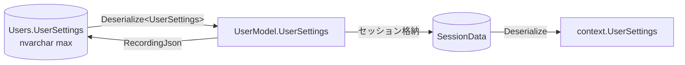
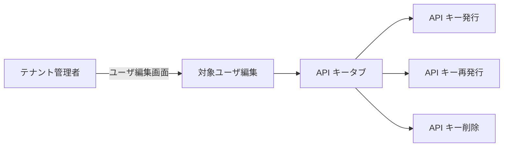
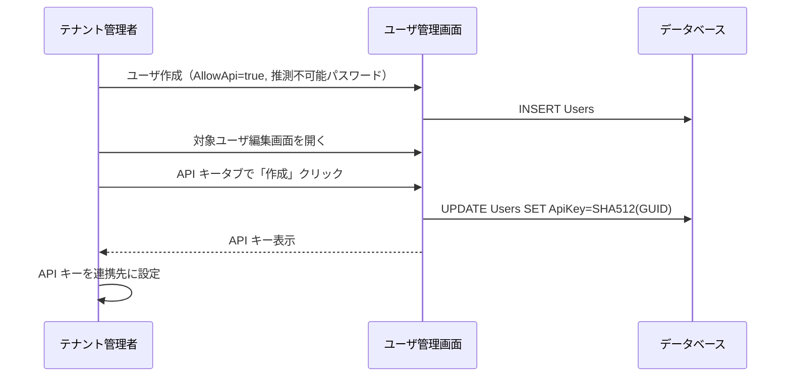

# API 専用ユーザの実装調査

プリザンターに「Web 画面でのログイン不可、API キーのみで利用するユーザ」を追加するために、既存の認証・ユーザ管理・API キー管理の実装を調査し、実現アプローチを整理する。

<!-- START doctoc generated TOC please keep comment here to allow auto update -->
<!-- DON'T EDIT THIS SECTION, INSTEAD RE-RUN doctoc TO UPDATE -->

- [調査情報](#調査情報)
- [調査目的](#調査目的)
- [現状の実装分析](#現状の実装分析)
    - [Users テーブルの関連カラム](#users-テーブルの関連カラム)
    - [認証フロー全体像](#認証フロー全体像)
    - [Web ログイン認証の詳細](#web-ログイン認証の詳細)
    - [API キー認証の詳細](#api-キー認証の詳細)
    - [Disabled フラグの影響範囲](#disabled-フラグの影響範囲)
    - [API キーの管理機能](#api-キーの管理機能)
    - [UserSettings JSON カラム](#usersettings-json-カラム)
    - [ユーザ管理画面でのカラム編集権限](#ユーザ管理画面でのカラム編集権限)
- [「API 専用ユーザ」が存在しない理由の考察](#api-専用ユーザが存在しない理由の考察)
- [実現アプローチ](#実現アプローチ)
    - [アプローチ 1: 推測不可能なパスワードの設定（コード変更不要）](#アプローチ-1-推測不可能なパスワードの設定コード変更不要)
    - [アプローチ 2: 管理者による API キー代理操作の追加（小規模改修）](#アプローチ-2-管理者による-api-キー代理操作の追加小規模改修)
    - [アプローチ 3: UserSettings.ApiOnly フラグの追加（DB スキーマ変更不要）](#アプローチ-3-usersettingsapionly-フラグの追加db-スキーマ変更不要)
- [アプローチ比較](#アプローチ比較)
- [結論](#結論)
- [関連ソースコード](#関連ソースコード)
- [関連ドキュメント](#関連ドキュメント)

<!-- END doctoc generated TOC please keep comment here to allow auto update -->

## 調査情報

| 調査日     | リポジトリ | ブランチ           | タグ/バージョン | コミット    | 備考 |
| ---------- | ---------- | ------------------ | --------------- | ----------- | ---- |
| 2026-02-24 | Pleasanter | Pleasanter_1.5.1.0 | -               | `34f162a43` | -    |

## 調査目的

システム連携用途で「Web 画面にはログインしないが API キーだけで操作するユーザ」（API 専用ユーザ / サービスアカウント）を実現したい。現行プリザンターに該当機能が存在するか、存在しない場合にどのような改修で実現可能かを明らかにする。

---

## 現状の実装分析

### Users テーブルの関連カラム

Users テーブルのうち、API 専用ユーザの実現に関わるカラムは以下の通り。

| カラム     | 型              | 既定値 | 説明                              |
| ---------- | --------------- | ------ | --------------------------------- |
| `AllowApi` | `bit`           | `0`    | API 利用を許可するフラグ          |
| `ApiKey`   | `nvarchar(128)` | `NULL` | SHA-512 ハッシュ化済みの API キー |
| `Disabled` | `bit`           | `0`    | ユーザ無効化フラグ                |
| `Lockout`  | `bit`           | `0`    | アカウントロックフラグ            |
| `Password` | `nvarchar`      | -      | ハッシュ化済みパスワード          |

`ApiOnly` のような「Web ログインを禁止しつつ API アクセスのみ許可する」専用フラグは存在しない。

### 認証フロー全体像

```mermaid
flowchart TD
    subgraph Web["Web ログイン"]
        W1[UsersController.Authenticate]
        W2[Authentications.SignIn]
        W3[UserModel.Authenticate<br/>returnUrl版]
        W4{DisabledUser?}
        W5[Authenticate<br/>bool版]
        W6{GetByCredentials<br/>.Disabled&#40;false&#41;}
        W7{Lockout?}
        W8{LoginExpired?}
        W9{AllowedIpAddress?}
        W10[Allow &#8594; Cookie発行]
        W11[Deny]
        W1 --> W2 --> W3 --> W4
        W4 -- Yes --> W11
        W4 -- No --> W5 --> W6
        W6 -- 認証失敗 --> W11
        W6 -- 認証成功 --> W8
        W8 -- Yes --> W11
        W8 -- No --> W9
        W9 -- No --> W11
        W9 -- Yes --> W7
        W7 -- Yes --> W11
        W7 -- No --> W10
    end

    subgraph API["API キー認証"]
        A1[new Context 生成]
        A2[SetUserProperties]
        A3[リクエスト JSON<br/>から ApiKey 取得]
        A4[GetUser<br/>.ApiKey&#40;key&#41;<br/>.Disabled&#40;false&#41;<br/>.Lockout&#40;false&#41;]
        A5[SetUser<br/>Authenticated = true]
        A6[認証失敗]
        A1 --> A2 --> A3 --> A4
        A4 -- ユーザ取得成功 --> A5
        A4 -- ユーザ未取得 --> A6
    end
```



### Web ログイン認証の詳細

Web ログイン時の認証は `UsersController.Authenticate` をエントリポイントとし、最終的に `UserModel.GetByCredentials` で DB 検索を行う。

```csharp
// UserModel.cs L4487-4507
public bool GetByCredentials(Context context, string loginId,
    string password, int tenantId = 0, bool updateLockout = false)
{
    Get(context: context,
        ss: SiteSettingsUtilities.UsersSiteSettings(context: context),
        where: Rds.UsersWhere()
            .TenantId(tenantId, _using: tenantId > 0)
            .LoginId(value: context.Sqls.EscapeValue(loginId),
                _operator: context.Sqls.LikeWithEscape)
            .Password(password)
            .Disabled(false));   // Disabled=false のみ対象
    var authenticated = AccessStatus == Databases.AccessStatuses.Selected;
    return authenticated;
}
```

認証成功後、追加で以下のチェックが行われる。

| #   | チェック項目       | 条件                               | 不合格時の動作           |
| --- | ------------------ | ---------------------------------- | ------------------------ |
| 1   | ログイン有効期限   | `LoginExpired()`                   | `DenyLoginExpired`       |
| 2   | IP アドレス制限    | `AllowedIpAddress()`               | `InvalidIpAddress`       |
| 3   | アカウントロック   | `Lockout`                          | `UserLockout`            |
| 4   | 二段階認証         | `EnabledSecondaryAuthentication()` | 認証コード画面へ遷移     |
| 5   | パスワード有効期限 | `PasswordExpired()`                | パスワード変更画面へ遷移 |

### API キー認証の詳細

API キー認証は `Context` コンストラクタ内の `SetUserProperties` で行われる。リクエスト JSON から `ApiKey` を取得し、Users テーブルを検索する。

```csharp
// Context.cs L396-433（抜粋）
if (jsonDeserializedRequestApi?.ApiKey.IsNullOrEmpty() == false)
{
    ApiKey = jsonDeserializedRequestApi.ApiKey;
    SetUser(userModel: GetUser(where: Rds.UsersWhere()
        .ApiKey(ApiKey)));  // ApiKey で Users テーブルを検索
}
```

```csharp
// Context.cs L458-464
private UserModel GetUser(Rds.UsersWhereCollection where)
{
    return new UserModel().Get(
        context: this,
        ss: null,
        where: where
            .Disabled(false)   // Disabled=false のみ
            .Lockout(false));  // Lockout=false のみ
}
```

API キー認証時には `AllowApi` フラグの検証は行われない。`AllowApi` は各 API エンドポイントのバリデータ（`UserValidators.OnApiEditing` 等）で事後的に検証される。

### Disabled フラグの影響範囲

`Disabled` フラグが `true` の場合の影響を以下にまとめる。

| 場面                         | コード箇所                   | 影響                                   |
| ---------------------------- | ---------------------------- | -------------------------------------- |
| Web ログイン（資格情報）     | `UserModel.GetByCredentials` | `.Disabled(false)` でログイン不可      |
| Web ログイン（事前チェック） | `UserModel.DisabledUser()`   | `RevealUserDisabled` 有効時に事前通知  |
| API キー認証                 | `Context.GetUser()`          | `.Disabled(false)` で API キー認証不可 |
| ユーザ切替                   | `UserValidators` L1964       | 無効ユーザへの切替を拒否               |
| ライセンスカウント           | `UserUtilities` L5417        | `.Disabled(false)` でカウント対象外    |

結論として、`Disabled` フラグは Web ログインと API キー認証の**両方をブロック**するため、「Web は不可だが API は可」という制御には使えない。

### API キーの管理機能

#### API キーの生成

```csharp
// UserModel.cs L5644-5653
public ErrorData CreateApiKey(Context context, SiteSettings ss)
{
    ApiKey = Guid.NewGuid().ToString().Sha512Cng();
    return Update(context: context, ss: ss, updateMailAddresses: false);
}
```

GUID を生成し SHA-512 でハッシュしたものが API キーとして保存される。

#### API キーの削除

```csharp
// UserModel.cs L5656-5664
public ErrorData DeleteApiKey(Context context, SiteSettings ss)
{
    ApiKey = string.Empty;
    return Update(context: context, ss: ss, updateMailAddresses: false);
}
```

#### API キー管理画面のアクセス制御

API キー管理画面（`/users/editapi`）は**自分自身の API キーのみ操作可能**。`UserUtilities.CreateApiKey` / `DeleteApiKey` は `context.UserId` をハードコードしている。

```csharp
// UserUtilities.cs L4798
var userModel = new UserModel(context: context, ss: ss, userId: context.UserId);
```

管理者（テナント管理者）が他のユーザの API キーを作成・削除する仕組みは存在しない。

#### API キー管理画面の表示条件

ナビゲーションメニューの「API 設定」リンクは以下の条件で表示される。

```csharp
// HtmlNavigationMenu.cs L742-745
case "AccountMenu_ApiSettings":
    return Parameters.Api.Enabled
        && context.ContractSettings.Api != false
        && canUseApi;  // context.UserSettings?.AllowApi(context) == true
```

#### AllowApi の判定ロジック

```csharp
// UserSettings.cs L103-109
public bool AllowApi(Context context)
{
    if (context.HasPrivilege) return true;
    return (!(Parameters.User.DisableApi || context.DisableApi)
        || context.User.AllowApi)
        && DisableApi != true;
}
```

| 優先度 | 条件                                                   | 結果     |
| ------ | ------------------------------------------------------ | -------- |
| 1      | 特権ユーザ                                             | 常に許可 |
| 2      | グローバル/テナントで API 無効 + 個別 `AllowApi=false` | 拒否     |
| 3      | グローバル/テナントで API 無効 + 個別 `AllowApi=true`  | 許可     |
| 4      | `UserSettings.DisableApi=true`                         | 拒否     |
| 5      | 上記以外                                               | 許可     |

### UserSettings JSON カラム

Users テーブルには `UserSettings` カラム（`nvarchar(max)`）が存在し、JSON 文字列としてユーザ固有の設定値を格納している。DB スキーマ変更なしでプロパティを拡張可能な構造である。

#### UserSettings の現行プロパティ

```csharp
// UserSettings.cs L11-17
[Serializable]
public class UserSettings
{
    public bool? EnableManageTenant;       // テナント管理者権限
    public bool? DisableTopSiteCreation;   // トップサイト作成の無効化
    public bool? DisableGroupAdmin;        // グループ管理の無効化
    public bool? DisableGroupCreation;     // グループ作成の無効化
    public bool? DisableMovingFromTopSite; // トップサイトからの移動の無効化
    public bool? DisableApi;               // API の無効化
    public bool? DisableStartGuide;        // スタートガイドの無効化
}
```

#### RecordingJson による永続化

DB への保存は `RecordingJson()` メソッドで制御されており、明示的に書き込みロジックが記述されたプロパティのみが永続化される。

```csharp
// UserSettings.cs L18-47
public string RecordingJson()
{
    var us = new UserSettings();
    if (EnableManageTenant == true) us.EnableManageTenant = EnableManageTenant;
    if (DisableTopSiteCreation == true) us.DisableTopSiteCreation = DisableTopSiteCreation;
    if (DisableGroupAdmin == true) us.DisableGroupAdmin = DisableGroupAdmin;
    if (DisableStartGuide == true) us.DisableStartGuide = DisableStartGuide;
    if (DisableMovingFromTopSite == true) us.DisableMovingFromTopSite = DisableMovingFromTopSite;
    return us.ToJson();
}
```

注意: `DisableApi` はクラスに定義されているが `RecordingJson()` に含まれていないため、DB に永続化されない。

#### シリアライズ/デシリアライズの互換性

Newtonsoft.Json の `JsonConvert.DeserializeObject<T>` は未知のプロパティを無視する
（`MissingMemberHandling` のデフォルト値が `Ignore`）。
逆に、クラスに存在するが JSON にないプロパティは `default`（`bool?` なら `null`）になる。
これにより、新しいプロパティを追加してもデシリアライズ時に既存データとの互換性が保たれる。

```csharp
// Jsons.cs L18-28
public static T Deserialize<T>(this string str)
{
    try { return JsonConvert.DeserializeObject<T>(str); }
    catch { return default(T); }
}
```

#### UserSettings の読み書きフロー



| 操作           | コード箇所                           | 説明                                              |
| -------------- | ------------------------------------ | ------------------------------------------------- |
| DB 読み込み    | `UserModel.GetUserSettings(dataRow)` | `Deserialize<UserSettings>()` で復元              |
| DB 書き込み    | `UserModel` L1766                    | `UserSettings.RecordingJson()` で JSON 化して保存 |
| セッション経由 | `UserModel.Session_UserSettings()`   | セッションデータから復元                          |

#### 拡張手順

新しいプロパティ（例: `ApiOnly`）を追加する場合、以下の手順のみで DB スキーマ変更なしに拡張できる。

1. `UserSettings.cs` にフィールド追加: `public bool? ApiOnly;`
2. `RecordingJson()` メソッドに書き込みロジック追加: `if (ApiOnly == true) us.ApiOnly = ApiOnly;`
3. DB マイグレーション不要（JSON カラムのため）

### ユーザ管理画面でのカラム編集権限

テナント管理者は他ユーザの編集画面で `AllowApi` チェックボックスを変更できる。ユーザ編集画面のアクセス制御は以下の通り。

```csharp
// Permissions.cs L767-774
public static bool CannotManageUsers(Context context)
{
    return (context.UserSettings?.EnableManageTenant == false
        || context.UserSettings?.EnableManageTenant == null)
        && !context.HasPrivilege
        && !Parameters.Service.ShowProfiles;
}
```

`AllowApi` カラム自体の更新権限は `ManageTenant` 権限として定義されている。

---

## 「API 専用ユーザ」が存在しない理由の考察

現行の設計思想は以下の通りと推察される。

1. API キーは「ユーザの分身」として設計されており、独立したサービスアカウントの概念がない
2. API キー管理は**本人操作**が前提。管理者でも他人のキーは操作できない
3. `Disabled` フラグは Web/API を区別せず一律にブロックする安全設計

---

## 実現アプローチ

### アプローチ 1: 推測不可能なパスワードの設定（コード変更不要）

運用で対処する最もシンプルな方法。

| 項目         | 内容                                                   |
| ------------ | ------------------------------------------------------ |
| 手順         | 十分に長いランダムパスワードを設定し、誰にも共有しない |
| Web ログイン | パスワードを知らない限りログイン不可（実質的に不可）   |
| API アクセス | `AllowApi=true` + API キー発行で利用可能               |
| 改修範囲     | なし                                                   |

#### 制約事項

| 制約                       | 説明                                                                                 |
| -------------------------- | ------------------------------------------------------------------------------------ |
| API キーの初回発行         | 本人がログインして「API 設定」画面から発行する必要がある                             |
| API キーの再発行・削除     | 同上。管理者が代行する仕組みがない                                                   |
| パスワード有効期限         | 期限切れ時にパスワード変更画面に遷移するため、API 利用に影響はないが運用上注意が必要 |
| 完全なログイン防止ではない | パスワードが漏洩すればログイン可能                                                   |
| ライセンスカウント         | `Disabled=false` のため通常ユーザとしてカウントされる                                |

#### API キー初回発行の手順

1. テナント管理者がユーザを作成（`AllowApi=true`）
2. 一時的にわかるパスワードを設定
3. そのユーザでログインし「API 設定」画面から API キーを発行
4. パスワードを推測不可能なランダム文字列に変更
5. API キーを連携先システムに設定

### アプローチ 2: 管理者による API キー代理操作の追加（小規模改修）

テナント管理者/ユーザ管理権限を持つユーザが、他ユーザの API キーを発行・再発行・削除できるようにする改修。



#### 改修箇所

| #   | ファイル             | 改修内容                                                                       |
| --- | -------------------- | ------------------------------------------------------------------------------ |
| 1   | `UserUtilities.cs`   | `CreateApiKey` / `DeleteApiKey` で `userId` パラメータを受け取れるようにする   |
| 2   | `UserUtilities.cs`   | ユーザ編集画面（`Editor`）に API キータブを追加                                |
| 3   | `UserValidators.cs`  | `OnApiCreating` / `OnApiDeleting` にテナント管理者の代理操作権限チェックを追加 |
| 4   | `UsersController.cs` | `CreateApiKey` / `DeleteApiKey` アクションで対象 `userId` を受け取る           |

#### 詳細設計

##### UserUtilities.CreateApiKey の改修

```csharp
// 現状: context.UserId をハードコード
var userModel = new UserModel(context: context, ss: ss, userId: context.UserId);

// 改修後: 対象 userId を引数で受け取る
public static string CreateApiKey(Context context, SiteSettings ss, int userId = 0)
{
    var targetUserId = userId > 0 ? userId : context.UserId;
    var userModel = new UserModel(context: context, ss: ss, userId: targetUserId);
    var invalid = UserValidators.OnApiCreating(
        context: context,
        userModel: userModel,
        targetUserId: targetUserId);
    // ...
}
```

##### UserValidators.OnApiCreating の改修

```csharp
public static ErrorData OnApiCreating(
    Context context, UserModel userModel, int targetUserId = 0)
{
    // 既存チェック
    if (!Parameters.Api.Enabled
        || context.ContractSettings.Api == false)
    {
        return new ErrorData(type: Error.Types.InvalidRequest);
    }
    // 代理操作の場合: テナント管理者権限チェック
    if (targetUserId > 0 && targetUserId != context.UserId)
    {
        if (Permissions.CannotManageUsers(context: context))
        {
            return new ErrorData(type: Error.Types.HasNotPermission);
        }
        // 対象ユーザの AllowApi チェック
        if (!userModel.AllowApi)
        {
            return new ErrorData(type: Error.Types.InvalidRequest);
        }
    }
    else
    {
        // 自分自身の場合: 既存の AllowApi チェック
        if (context.UserSettings?.AllowApi(context: context) == false)
        {
            return new ErrorData(type: Error.Types.InvalidRequest);
        }
    }
    // ...
}
```

##### ユーザ編集画面への API キータブ追加

```csharp
// UserUtilities.cs Editor 内に API キータブを追加
// テナント管理者が他ユーザ編集時に表示される
.Li(action: () => hb.A(
    href: "#FieldSetApiKey",
    text: Displays.ApiKey(context: context)),
    _using: context.UserSettings?.EnableManageTenant == true
        && userModel.AllowApi
        && Parameters.Api.Enabled)
```

#### 運用フロー



### アプローチ 3: UserSettings.ApiOnly フラグの追加（DB スキーマ変更不要）

`UserSettings` JSON カラムに `ApiOnly` プロパティを追加し、Web ログインを明示的にブロックする。DB スキーマ変更（`ALTER TABLE`）は不要。

#### 改修箇所

| #   | ファイル             | 改修内容                                              |
| --- | -------------------- | ----------------------------------------------------- |
| 1   | `UserSettings.cs`    | `public bool? ApiOnly;` フィールド追加                |
| 2   | `UserSettings.cs`    | `RecordingJson()` に `ApiOnly` の書き込みロジック追加 |
| 3   | `UserModel.cs`       | `Authenticate` で `ApiOnly` チェック追加              |
| 4   | `UserUtilities.cs`   | ユーザ編集画面に `ApiOnly` の表示・編集 UI 追加       |
| 5   | `UsersController.cs` | `ApiOnly` 更新のアクション追加（必要に応じて）        |

#### UserSettings.cs の改修

```csharp
// フィールド追加
public bool? ApiOnly;  // API 専用ユーザフラグ

// RecordingJson() に追加
public string RecordingJson()
{
    var us = new UserSettings();
    if (EnableManageTenant == true) us.EnableManageTenant = EnableManageTenant;
    if (DisableTopSiteCreation == true) us.DisableTopSiteCreation = DisableTopSiteCreation;
    if (DisableGroupAdmin == true) us.DisableGroupAdmin = DisableGroupAdmin;
    if (DisableStartGuide == true) us.DisableStartGuide = DisableStartGuide;
    if (DisableMovingFromTopSite == true) us.DisableMovingFromTopSite = DisableMovingFromTopSite;
    if (ApiOnly == true) us.ApiOnly = ApiOnly;  // 追加
    return us.ToJson();
}
```

#### Web ログインブロックの実装案

`UserModel.Authenticate`（returnUrl 版）の冒頭で、対象ユーザの `UserSettings` を DB から読み取り `ApiOnly` をチェックする。

```csharp
// UserModel.cs Authenticate(returnUrl版) に追加
public string Authenticate(Context context, string returnUrl, ...)
{
    // 既存: DisabledUser チェック
    if (Parameters.Security.RevealUserDisabled && DisabledUser(context: context))
    {
        return UserDisabled(context: context);
    }

    // 追加: ApiOnly ユーザの Web ログインブロック
    if (IsApiOnlyUser(context: context))
    {
        return Deny(context: context);  // 通常の認証失敗と同じレスポンス
    }

    // 既存処理の続き...
}

private bool IsApiOnlyUser(Context context)
{
    var userSettings = Repository.ExecuteScalar_string(
        context: context,
        statements: Rds.SelectUsers(
            column: Rds.UsersColumn().UserSettings(),
            where: Rds.UsersWhere()
                .Add(name: "LoginId", value: LoginId,
                    raw: "(lower(\"Users\".\"LoginId\") = lower(@LoginId))")
                .Disabled(false)))
        ?.Deserialize<UserSettings>();
    return userSettings?.ApiOnly == true;
}
```

#### API キー認証への影響

API キー認証は `Context.GetUser()` を通じて `Disabled(false)` と `Lockout(false)` のみをフィルタする。
`UserSettings` の中身はフィルタ条件に使われないため、
`ApiOnly=true` でも API キー認証は影響を受けない。改修不要。

```csharp
// Context.cs L458-464（変更不要）
private UserModel GetUser(Rds.UsersWhereCollection where)
{
    return new UserModel().Get(
        context: this,
        ss: null,
        where: where
            .Disabled(false)   // ApiOnly は影響しない
            .Lockout(false));
}
```

#### テナント管理者による UserSettings.ApiOnly の設定方法

テナント管理者がユーザ編集画面から `ApiOnly` を設定できるようにする。`UserSettings` は `NotForm: "1"` のため通常の編集フォームには表示されないが、`EnableManageTenant` 等と同様にプログラムから直接更新する方式を採る。

```csharp
// UserUtilities.cs に追加
public static string SetApiOnly(Context context, SiteSettings ss, int userId)
{
    if (Permissions.CannotManageUsers(context: context))
    {
        return Messages.ResponseHasNotPermission(context: context).ToJson();
    }
    var userModel = new UserModel(context: context, ss: ss, userId: userId);
    if (userModel.AccessStatus != Databases.AccessStatuses.Selected)
    {
        return Messages.ResponseNotFound(context: context).ToJson();
    }
    userModel.UserSettings.ApiOnly = context.Forms.Bool("ApiOnly");
    Repository.ExecuteNonQuery(
        context: context,
        statements: Rds.UpdateUsers(
            where: Rds.UsersWhere()
                .TenantId(context.TenantId)
                .UserId(userId),
            param: Rds.UsersParam()
                .UserSettings(userModel.UserSettings.RecordingJson()),
            addUpdatorParam: false,
            addUpdatedTimeParam: false));
    return new ResponseCollection(context: context).ToJson();
}
```

この方式は既存の `SetStartGuide` メソッドと同じパターンに従っている。

#### 注意点

- DB スキーマ変更は不要（`UserSettings` は `nvarchar(max)` の JSON カラム）
- CodeDefiner による自動生成コードへの影響が最小限
- `ApiOnly=true` のユーザは Web ログインできないため、API キー管理画面に自分でアクセスできない。アプローチ 2（管理者代理操作）との併用が必須
- `UserSettings.ApiOnly` はセッションにも格納されるため、設定変更の即時反映にはセッションの更新も考慮が必要

---

## アプローチ比較

| 観点                     | アプローチ 1             | アプローチ 2             | アプローチ 3                                |
| ------------------------ | ------------------------ | ------------------------ | ------------------------------------------- |
| コード改修               | 不要                     | 小規模（4 ファイル）     | 小規模（3-5 ファイル）                      |
| DB スキーマ変更          | 不要                     | 不要                     | 不要（JSON カラム活用）                     |
| Web ログイン防止         | 実質的（パスワード秘匿） | 実質的（パスワード秘匿） | 完全（フラグで制御）                        |
| API キー初回発行         | 本人ログインが必要       | 管理者が代理発行可能     | 管理者が代理発行可能（要アプローチ 2 併用） |
| API キー再発行           | 本人ログインが必要       | 管理者が代理操作可能     | 管理者が代理操作可能                        |
| 運用負荷                 | 初回発行時に手間         | 低い                     | 低い                                        |
| セキュリティ             | パスワード漏洩リスク     | パスワード漏洩リスク     | ログイン完全ブロック                        |
| 本体バージョンアップ影響 | なし                     | パッチ適用の追従が必要   | パッチ適用の追従が必要（DB 変更なし）       |

---

## 結論

| 項目                  | 結論                                                                             |
| --------------------- | -------------------------------------------------------------------------------- |
| 既存機能              | `ApiOnly` フラグは存在せず、API 専用ユーザの概念はプリザンター標準には存在しない |
| `Disabled` の流用     | Web/API の両方をブロックするため流用不可                                         |
| `AllowApi` の役割     | API 利用の許可フラグに過ぎず、Web ログインには影響しない                         |
| API キー管理の制約    | 現状は本人操作のみ。管理者が他ユーザの API キーを代理操作する機能がない          |
| UserSettings の活用   | `nvarchar(max)` JSON カラムのため、DB スキーマ変更なしでプロパティ拡張可能       |
| 推奨アプローチ        | アプローチ 2 + 3（管理者代理操作 + UserSettings.ApiOnly）の併用を推奨            |
| アプローチ 3 の優位性 | DB マイグレーション不要で実装でき、バージョンアップ追従の負荷も低い              |

## 関連ソースコード

| ファイル                                                      | 説明                                                    |
| ------------------------------------------------------------- | ------------------------------------------------------- |
| `Implem.Pleasanter/Models/Users/UserModel.cs`                 | ユーザモデル・認証ロジック・API キー CRUD               |
| `Implem.Pleasanter/Models/Users/UserUtilities.cs`             | ユーザ管理画面・API キー管理画面                        |
| `Implem.Pleasanter/Models/Users/UserValidators.cs`            | API キー作成・削除のバリデーション                      |
| `Implem.Pleasanter/Models/Users/UserApiModel.cs`              | API 経由のユーザ操作モデル                              |
| `Implem.Pleasanter/Libraries/Requests/Context.cs`             | API キー認証処理                                        |
| `Implem.Pleasanter/Libraries/Security/Authentications.cs`     | Web ログイン認証エントリポイント                        |
| `Implem.Pleasanter/Libraries/Security/Permissions.cs`         | ユーザ管理権限チェック                                  |
| `Implem.Pleasanter/Libraries/Settings/UserSettings.cs`        | `AllowApi` 判定ロジック・JSON 永続化（`RecordingJson`） |
| `Implem.Pleasanter/Libraries/HtmlParts/HtmlNavigationMenu.cs` | API 設定メニュー表示条件                                |
| `Implem.Pleasanter/Controllers/UsersController.cs`            | ユーザ関連コントローラー                                |
| `Implem.Pleasanter/Controllers/Api/UsersController.cs`        | ユーザ API コントローラー                               |
| `Implem.ParameterAccessor/Parts/User.cs`                      | ユーザ関連パラメータ定義                                |

## 関連ドキュメント

- [ユーザアクセス権限・アクセス制御](001-ユーザアクセス権限・アクセス制御.md)
- [権限階層構造（User・Group・Dept）](002-権限階層構造.md)
- [認証基盤の詳細](003-認証基盤.md)
