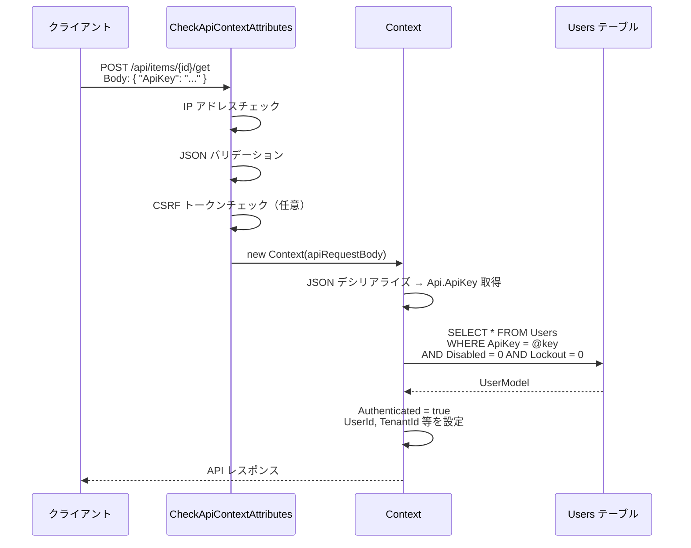
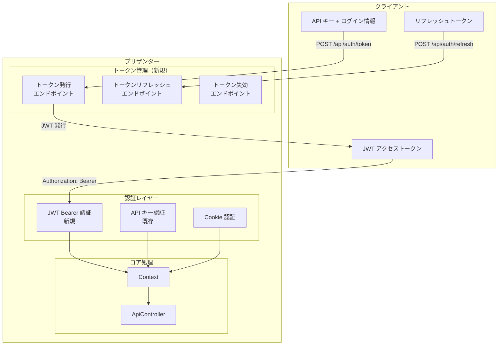
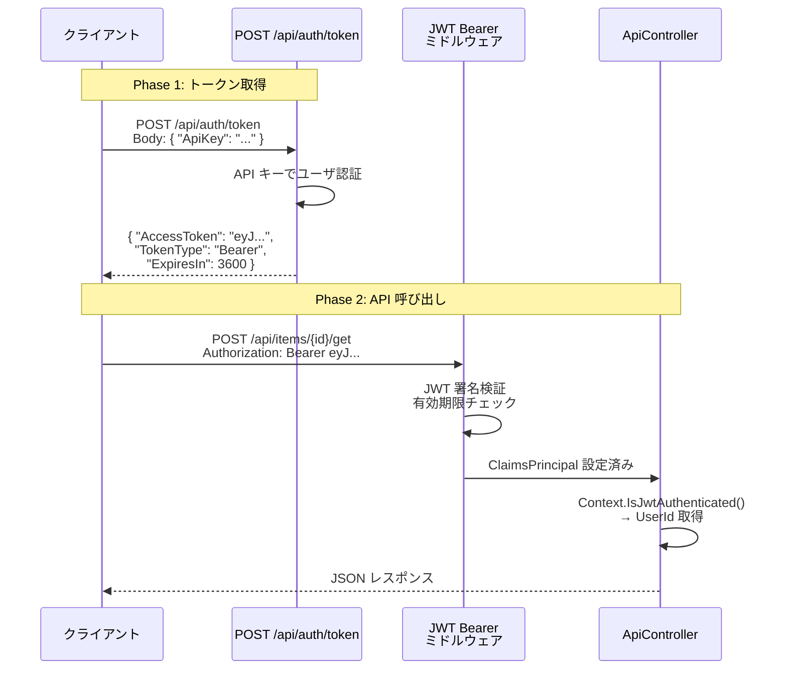
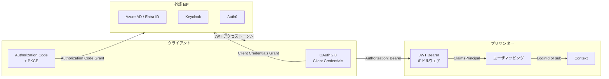
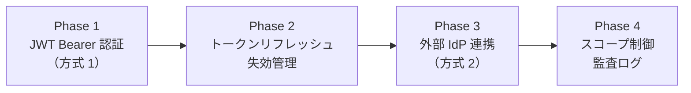

# API 認証への OAuth 2.0 / JWT 追加実装検討

プリザンターの API 認証に OAuth 2.0 および JWT（JSON Web Token）を追加する具体的な実装方法を検討する。
現行の API キー認証基盤を分析し、既存コードへの影響を最小限に抑えた段階的な導入アプローチを整理する。

<!-- START doctoc generated TOC please keep comment here to allow auto update -->
<!-- DON'T EDIT THIS SECTION, INSTEAD RE-RUN doctoc TO UPDATE -->

- [調査情報](#調査情報)
- [調査目的](#調査目的)
- [現行 API 認証の構造と制約](#現行-api-認証の構造と制約)
    - [現行の認証方式一覧](#現行の認証方式一覧)
    - [API キー認証の処理フロー](#api-キー認証の処理フロー)
    - [現行方式の制約](#現行方式の制約)
    - [関連するソースコード構造](#関連するソースコード構造)
- [方式 1: JWT Bearer トークン認証の追加](#方式-1-jwt-bearer-トークン認証の追加)
    - [概要](#概要)
    - [アーキテクチャ](#アーキテクチャ)
    - [改修箇所](#改修箇所)
    - [認証フロー（JWT）](#認証フローjwt)
- [方式 2: 外部 IdP 連携（OAuth 2.0 / OpenID Connect）](#方式-2-外部-idp-連携oauth-20--openid-connect)
    - [概要](#概要-1)
    - [アーキテクチャ](#アーキテクチャ-1)
    - [改修箇所](#改修箇所-1)
    - [Azure AD / Entra ID 連携のパラメータ設定例](#azure-ad--entra-id-連携のパラメータ設定例)
- [方式比較](#方式比較)
- [推奨実装アプローチ](#推奨実装アプローチ)
    - [段階的導入計画](#段階的導入計画)
    - [Phase 1 の具体的な改修ファイル一覧](#phase-1-の具体的な改修ファイル一覧)
    - [既存コードへの影響分析](#既存コードへの影響分析)
- [セキュリティ考慮事項](#セキュリティ考慮事項)
    - [トークン署名アルゴリズム](#トークン署名アルゴリズム)
    - [トークンストレージ](#トークンストレージ)
    - [攻撃対策](#攻撃対策)
- [結論](#結論)
- [関連ソースコード](#関連ソースコード)
- [関連ドキュメント](#関連ドキュメント)

<!-- END doctoc generated TOC please keep comment here to allow auto update -->

## 調査情報

| 調査日       | リポジトリ | ブランチ           | タグ/バージョン    | コミット    | 備考 |
| ------------ | ---------- | ------------------ | ------------------ | ----------- | ---- |
| 2026年3月3日 | Pleasanter | Pleasanter_1.5.1.0 | Pleasanter_1.5.1.0 | `34f162a43` | -    |

## 調査目的

- 現行の API キー認証の制約を明確にする
- OAuth 2.0 / JWT を追加するための具体的な改修箇所を特定する
- 既存の認証フローとの互換性を維持した実装方針を策定する
- ASP.NET Core の標準認証ミドルウェアとの統合方法を検討する

---

## 現行 API 認証の構造と制約

### 現行の認証方式一覧

| 認証方式         | 用途           | トランスポート        | 対象           |
| ---------------- | -------------- | --------------------- | -------------- |
| Cookie 認証      | Web UI         | Cookie ヘッダー       | MVC Controller |
| API キー認証     | 外部 API 連携  | JSON リクエストボディ | ApiController  |
| SAML 2.0         | SSO            | SAML アサーション     | MVC Controller |
| LDAP             | 社内認証       | パラメータ設定        | MVC Controller |
| Passkey（FIDO2） | パスワードレス | WebAuthn              | MVC Controller |

### API キー認証の処理フロー

現行の API 認証は、リクエストボディ内の `ApiKey` フィールドで認証を行う。



### 現行方式の制約

| 制約                       | 説明                                                                 |
| -------------------------- | -------------------------------------------------------------------- |
| API キーの有効期限がない   | 一度発行された API キーは、手動削除するまで永続的に有効              |
| スコープ制御がない         | API キーはユーザの全権限を引き継ぐため、操作範囲の限定ができない     |
| リクエストボディに認証情報 | `Authorization` ヘッダーではなくボディに含めるため、標準仕様と異なる |
| トークンリフレッシュがない | API キーは固定値であり、定期的なローテーションが自動化されていない   |
| 外部 IdP 連携なし          | API 認証では SAML/LDAP 等の外部 IdP を利用できない                   |
| 監査トレースが限定的       | トークン発行・失効の履歴が記録されない                               |

### 関連するソースコード構造

| ファイル                                    | 役割                            |
| ------------------------------------------- | ------------------------------- |
| `Startup.cs`（行 116-156）                  | 認証スキーム登録（Cookie/SAML） |
| `Context.cs`（行 404-408）                  | API キーからユーザ特定          |
| `CheckApiContextAttributes.cs`（行 17-96）  | API リクエストのバリデーション  |
| `Api.cs`                                    | API リクエストのデータモデル    |
| `UserModel.cs`（CreateApiKey メソッド）     | API キー生成（GUID → SHA512）   |
| `ParameterAccessor/Parts/Authentication.cs` | 認証パラメータ定義              |
| `ParameterAccessor/Parts/Security.cs`       | セキュリティパラメータ定義      |

---

## 方式 1: JWT Bearer トークン認証の追加

### 概要

ASP.NET Core 標準の JWT Bearer 認証ミドルウェアを追加し、
`Authorization: Bearer <JWT>` ヘッダーによる API 認証を実現する。
プリザンター自身がトークン発行サーバとなり、既存の API キー認証と併用する。

### アーキテクチャ



### 改修箇所

#### 1. パラメータ定義の追加

**ファイル**: `Implem.ParameterAccessor/Parts/Authentication.cs`

```csharp
public class Authentication
{
    public string Provider;
    public string DsProvider;
    public string ServiceId;
    public string ExtensionUrl;
    public bool RejectUnregisteredUser;
    public Passkey PasskeyParameters;
    public List<Ldap> LdapParameters;
    public Saml SamlParameters;
    public JwtBearer JwtBearerParameters;  // 追加
}
```

**新規ファイル**: `Implem.ParameterAccessor/Parts/JwtBearer.cs`

```csharp
public class JwtBearer
{
    public bool Enabled;
    public string Issuer;
    public string Audience;
    public string SecretKey;               // HMAC-SHA256 用（開発向け）
    public string CertificatePath;         // RSA 署名用（本番向け）
    public string CertificatePassword;
    public int AccessTokenExpirationMinutes;   // 既定: 60
    public int RefreshTokenExpirationDays;     // 既定: 30
    public bool AllowRefreshToken;
}
```

対応する JSON パラメータファイル（`Authentication.json`）には以下を追加する。

```json
{
    "JwtBearerParameters": {
        "Enabled": false,
        "Issuer": "Pleasanter",
        "Audience": "PleasanterApi",
        "SecretKey": "",
        "CertificatePath": "",
        "CertificatePassword": "",
        "AccessTokenExpirationMinutes": 60,
        "RefreshTokenExpirationDays": 30,
        "AllowRefreshToken": true
    }
}
```

#### 2. Startup.cs への JWT Bearer スキーム追加

**ファイル**: `Implem.Pleasanter/Startup.cs`（行 116-156 付近）

```csharp
var authBuilder = services
    .AddAuthentication(CookieAuthenticationDefaults.AuthenticationScheme)
    .AddCookie(o =>
    {
        o.LoginPath = new PathString("/users/login");
        o.ExpireTimeSpan = TimeSpan.FromMinutes(
            Parameters.Session.RetentionPeriod);
    });

// JWT Bearer 認証の追加
if (Parameters.Authentication.JwtBearerParameters?.Enabled == true)
{
    var jwtParams = Parameters.Authentication.JwtBearerParameters;
    authBuilder.AddJwtBearer(options =>
    {
        options.TokenValidationParameters = new TokenValidationParameters
        {
            ValidateIssuer = true,
            ValidIssuer = jwtParams.Issuer,
            ValidateAudience = true,
            ValidAudience = jwtParams.Audience,
            ValidateLifetime = true,
            ValidateIssuerSigningKey = true,
            IssuerSigningKey = GetSigningKey(jwtParams),
            ClockSkew = TimeSpan.FromMinutes(1)
        };
    });
}

// SAML 追加（既存）
if (Authentications.SAML())
{
    authBuilder.AddSaml2(options => { ... });
}
```

`net10.0` では `Microsoft.AspNetCore.Authentication.JwtBearer` はフレームワーク同梱であるため、追加 NuGet パッケージは不要である。

#### 3. トークン発行エンドポイントの新設

**新規ファイル**: `Implem.Pleasanter/Controllers/Api/AuthController.cs`

```csharp
[CheckApiContextAttributes]
[AllowAnonymous]
[ApiController]
[Route("api/[controller]")]
public class AuthController : ControllerBase
{
    /// <summary>
    /// API キー認証で JWT アクセストークンを発行する。
    /// POST /api/auth/token
    /// Body: { "ApiKey": "..." }
    /// </summary>
    [HttpPost("Token")]
    public ContentResult Token()
    {
        var body = default(string);
        using (var reader = new StreamReader(Request.Body))
            body = reader.ReadToEnd();
        var context = new Context(
            sessionStatus: false,
            sessionData: false,
            apiRequestBody: body,
            api: true);
        if (!context.Authenticated)
        {
            return ApiResults.Unauthorized(context: context)
                .ToHttpResponse(request: Request);
        }
        var token = JwtTokenService.GenerateAccessToken(context);
        var result = new
        {
            AccessToken = token,
            TokenType = "Bearer",
            ExpiresIn = Parameters.Authentication
                .JwtBearerParameters.AccessTokenExpirationMinutes * 60
        };
        // リフレッシュトークンが有効な場合
        if (Parameters.Authentication.JwtBearerParameters.AllowRefreshToken)
        {
            var refreshToken = JwtTokenService
                .GenerateRefreshToken(context);
            // RefreshTokens テーブルに保存
            // result にリフレッシュトークンを追加
        }
        return ApiResults.Success(
            context: context,
            id: context.UserId,
            message: null,
            body: result.ToJson())
            .ToHttpResponse(request: Request);
    }
}
```

#### 4. Context.cs での JWT クレーム抽出

**ファイル**: `Implem.Pleasanter/Libraries/Requests/Context.cs`（行 396-434 付近）

`SetUserProperties` メソッド内で、API キーが未指定かつ JWT Bearer トークンが存在する場合にクレームからユーザを特定する処理を追加する。

```csharp
private void SetUserProperties(bool sessionStatus, bool setData)
{
    if (HasRoute)
    {
        if (setData) SetData();
        var jsonDeserializedRequestApi = RequestDataString.Deserialize<Api>();
        InvalidJsonData = AspNetCoreHttpContext.Current.Request
            .HasJsonContentType()
            && !RequestDataString.IsNullOrEmpty()
            && jsonDeserializedRequestApi is null;
        SetApiVersion(api: jsonDeserializedRequestApi);

        // 1. API キー認証（既存）
        if (jsonDeserializedRequestApi?.ApiKey.IsNullOrEmpty() == false)
        {
            ApiKey = jsonDeserializedRequestApi.ApiKey;
            SetUser(userModel: GetUser(
                where: Rds.UsersWhere().ApiKey(ApiKey)));
        }
        // 2. JWT Bearer 認証（新規追加）
        else if (IsJwtAuthenticated())
        {
            var userId = GetUserIdFromJwtClaims();
            if (userId > 0)
            {
                SetUser(userModel: GetUser(
                    where: Rds.UsersWhere().UserId(userId)));
            }
        }
        // 3. セッション認証（既存）
        else if (!LoginId.IsNullOrEmpty())
        {
            // ... 既存コード ...
        }
    }
}

private bool IsJwtAuthenticated()
{
    return AspNetCoreHttpContext.Current?.User?.Identity?.IsAuthenticated == true
        && AspNetCoreHttpContext.Current?.User?.Identity?.AuthenticationType
            == JwtBearerDefaults.AuthenticationScheme;
}

private int GetUserIdFromJwtClaims()
{
    var userIdClaim = AspNetCoreHttpContext.Current?.User?
        .FindFirst(ClaimTypes.NameIdentifier);
    return userIdClaim != null
        ? int.TryParse(userIdClaim.Value, out var id) ? id : 0
        : 0;
}
```

#### 5. JWT トークン生成サービス

**新規ファイル**: `Implem.Pleasanter/Libraries/Security/JwtTokenService.cs`

```csharp
public static class JwtTokenService
{
    public static string GenerateAccessToken(Context context)
    {
        var jwtParams = Parameters.Authentication.JwtBearerParameters;
        var claims = new List<Claim>
        {
            new Claim(ClaimTypes.NameIdentifier,
                context.UserId.ToString()),
            new Claim(ClaimTypes.Name, context.LoginId),
            new Claim("TenantId", context.TenantId.ToString()),
            new Claim("DeptId", context.DeptId.ToString()),
        };
        var key = GetSigningCredentials(jwtParams);
        var token = new JwtSecurityToken(
            issuer: jwtParams.Issuer,
            audience: jwtParams.Audience,
            claims: claims,
            expires: DateTime.UtcNow.AddMinutes(
                jwtParams.AccessTokenExpirationMinutes),
            signingCredentials: key);
        return new JwtSecurityTokenHandler().WriteToken(token);
    }
}
```

### 認証フロー（JWT）



---

## 方式 2: 外部 IdP 連携（OAuth 2.0 / OpenID Connect）

### 概要

外部の IdP（Azure AD / Entra ID、Keycloak、Auth0 等）が発行する JWT トークンをプリザンターが検証する方式。トークン発行はプリザンター側では行わず、外部 IdP に委任する。

### アーキテクチャ



### 改修箇所

#### 1. パラメータ定義

**新規ファイル**: `Implem.ParameterAccessor/Parts/OAuthProvider.cs`

```csharp
public class OAuthProvider
{
    public bool Enabled;
    public string Authority;        // 例: https://login.microsoftonline.com/{tenant}
    public string Audience;         // 例: api://pleasanter
    public string ClientId;
    public string MetadataAddress;  // .well-known/openid-configuration URL
    public string UserIdClaim;      // ユーザ特定に使うクレーム名（既定: sub）
    public string LoginIdClaim;     // LoginId にマッピングするクレーム名
    public bool AutoProvision;      // 未登録ユーザの自動作成
}
```

`Authentication.cs` に追加する。

```csharp
public class Authentication
{
    // ... 既存フィールド ...
    public List<OAuthProvider> OAuthProviders;  // 追加（複数 IdP 対応）
}
```

#### 2. Startup.cs への OpenID Connect 検証追加

```csharp
if (Parameters.Authentication.OAuthProviders?.Any(p => p.Enabled) == true)
{
    foreach (var provider in Parameters.Authentication.OAuthProviders
        .Where(p => p.Enabled))
    {
        authBuilder.AddJwtBearer(
            provider.Authority,  // スキーム名として Authority を使用
            options =>
            {
                options.Authority = provider.Authority;
                options.Audience = provider.Audience;
                options.TokenValidationParameters =
                    new TokenValidationParameters
                    {
                        ValidateIssuer = true,
                        ValidateAudience = true,
                        ValidateLifetime = true,
                        NameClaimType = provider.LoginIdClaim ?? "sub"
                    };
            });
    }
    // 複数スキームの場合は PolicyScheme で振り分け
    services.AddAuthorization(options =>
    {
        var defaultPolicy = new AuthorizationPolicyBuilder(
            CookieAuthenticationDefaults.AuthenticationScheme,
            JwtBearerDefaults.AuthenticationScheme)
            .RequireAuthenticatedUser()
            .Build();
        options.DefaultPolicy = defaultPolicy;
    });
}
```

#### 3. ユーザマッピング

外部 IdP のクレームからプリザンターの `Users` テーブルへマッピングする処理が必要になる。
SAML 認証の `Saml.MapAttributes()` / `Saml.UpdateOrInsert()` と同様のロジックを
JWT 用に実装する。

```csharp
// Context.cs 内の SetUserProperties に追加
else if (IsExternalJwtAuthenticated())
{
    var loginIdClaim = GetLoginIdFromExternalJwtClaims();
    if (!loginIdClaim.IsNullOrEmpty())
    {
        SetUser(userModel: GetUser(
            where: Rds.UsersWhere().LoginId(
                value: Sqls.EscapeValue(loginIdClaim),
                _operator: Sqls.LikeWithEscape)));
        // AutoProvision が有効な場合、ユーザが存在しなければ自動作成
    }
}
```

### Azure AD / Entra ID 連携のパラメータ設定例

```json
{
    "OAuthProviders": [
        {
            "Enabled": true,
            "Authority": "https://login.microsoftonline.com/{tenant-id}/v2.0",
            "Audience": "api://pleasanter-api",
            "ClientId": "{client-id}",
            "MetadataAddress": "https://login.microsoftonline.com/{tenant-id}/v2.0/.well-known/openid-configuration",
            "UserIdClaim": "oid",
            "LoginIdClaim": "preferred_username",
            "AutoProvision": false
        }
    ]
}
```

---

## 方式比較

| 比較項目              | 方式 1: 自己発行 JWT             | 方式 2: 外部 IdP 連携    |
| --------------------- | -------------------------------- | ------------------------ |
| トークン発行          | プリザンター自身                 | 外部 IdP                 |
| 追加 NuGet パッケージ | 不要（net10.0 同梱）             | 不要（net10.0 同梱）     |
| ユーザ管理            | プリザンター Users テーブル      | 外部 IdP + マッピング    |
| 既存 API キー認証     | 併用可能                         | 併用可能                 |
| スコープ制御          | カスタム実装が必要               | IdP 側で設定可能         |
| 多要素認証            | 別途実装が必要                   | IdP 側で提供             |
| 実装規模              | 中（トークン発行サーバ構築）     | 小-中（検証のみ）        |
| 運用コスト            | 鍵管理・トークンストア管理が必要 | IdP の運用に依存         |
| M2M（機械間通信）     | API キー → JWT 変換で対応        | Client Credentials Grant |
| シングルサインアウト  | 別途実装が必要                   | IdP 側と連携可能         |

---

## 推奨実装アプローチ

### 段階的導入計画



| Phase | 内容                      | 改修ファイル数 | 説明                                           |
| ----- | ------------------------- | -------------- | ---------------------------------------------- |
| 1     | JWT Bearer 認証の基本実装 | 5-7 ファイル   | トークン発行・検証・Context 統合               |
| 2     | リフレッシュトークン      | 3-4 ファイル   | RefreshTokens テーブル追加・ローテーション処理 |
| 3     | 外部 IdP 連携             | 4-6 ファイル   | OAuthProvider パラメータ・ユーザマッピング     |
| 4     | スコープ制御・監査        | 5-8 ファイル   | クレームベース権限・トークン操作の SysLog 記録 |

### Phase 1 の具体的な改修ファイル一覧

| ファイル                                        | 変更内容                             |
| ----------------------------------------------- | ------------------------------------ |
| `ParameterAccessor/Parts/Authentication.cs`     | `JwtBearerParameters` プロパティ追加 |
| `ParameterAccessor/Parts/JwtBearer.cs`（新規）  | JWT パラメータクラス定義             |
| `Startup.cs`                                    | `AddJwtBearer` スキーム登録          |
| `Controllers/Api/AuthController.cs`（新規）     | トークン発行エンドポイント           |
| `Libraries/Security/JwtTokenService.cs`（新規） | トークン生成・検証ユーティリティ     |
| `Libraries/Requests/Context.cs`                 | JWT クレームからのユーザ特定処理追加 |
| `App_Data/Parameters/Authentication.json`       | JWT パラメータ既定値                 |

### 既存コードへの影響分析

| 影響箇所                       | 影響度 | 説明                                                         |
| ------------------------------ | ------ | ------------------------------------------------------------ |
| API キー認証                   | なし   | 既存フローは変更しない（JWT は追加スキーム）                 |
| Cookie 認証                    | なし   | DefaultScheme は Cookie のまま維持                           |
| CheckApiContextAttributes      | 低     | JWT 認証時は CSRF トークンチェックをスキップする条件追加のみ |
| SAML 認証                      | なし   | 独立したスキームとして共存                                   |
| Api.cs                         | なし   | ApiKey フィールドはそのまま利用                              |
| ApiController 各エンドポイント | なし   | `context.Authenticated` の判定ロジックは Context 側で吸収    |

---

## セキュリティ考慮事項

### トークン署名アルゴリズム

| アルゴリズム | 用途           | 鍵管理                               |
| ------------ | -------------- | ------------------------------------ |
| HS256        | 開発・検証環境 | 共有秘密鍵（`SecretKey` パラメータ） |
| RS256        | 本番環境       | RSA 秘密鍵 / X.509 証明書            |
| ES256        | 高セキュリティ | ECDSA 鍵（Azure Key Vault 等と連携） |

本番環境では RS256 以上の非対称鍵アルゴリズムを推奨する。HS256 は送信側・検証側が同一鍵を共有するため、鍵漏洩時の影響範囲が大きい。

### トークンストレージ

| ストレージ方式 | リフレッシュトークン | アクセストークン |
| -------------- | -------------------- | ---------------- |
| DB テーブル    | 必須（失効管理用）   | 不要（自己完結） |
| Redis          | 推奨（高速失効判定） | 任意             |

### 攻撃対策

| 攻撃手法                 | 対策                                                      |
| ------------------------ | --------------------------------------------------------- |
| トークン窃取             | 短い有効期限（AccessToken: 60 分以下）                    |
| リプレイ攻撃             | `jti`（JWT ID）クレームによる一回限り使用制御             |
| トークンすり替え         | `aud`（Audience）の厳密な検証                             |
| リフレッシュトークン漏洩 | DB での失効管理・ローテーション（使用済みトークン無効化） |
| 鍵漏洩                   | 鍵のローテーション機構・Azure Key Vault 等の HSM 利用     |

---

## 結論

| 項目                    | 結論                                                                                     |
| ----------------------- | ---------------------------------------------------------------------------------------- |
| 技術的実現性            | ASP.NET Core 標準の JWT Bearer 認証で実現可能。net10.0 では追加パッケージ不要            |
| 既存コードへの影響      | Context.cs の `SetUserProperties` への分岐追加と Startup.cs のスキーム登録が主な変更箇所 |
| 推奨アプローチ          | Phase 1（自己発行 JWT）から段階的に導入し、Phase 3 で外部 IdP 連携を追加する             |
| 後方互換性              | API キー認証はそのまま維持し、JWT は追加の認証スキームとして並行運用する                 |
| パラメータ制御          | `JwtBearerParameters.Enabled` フラグで機能の ON/OFF を切り替え可能にする                 |
| 主な改修規模（Phase 1） | 新規ファイル 3 個 + 既存ファイル変更 3-4 個                                              |

---

## 関連ソースコード

| ファイル                                                 | 行番号  | 内容                         |
| -------------------------------------------------------- | ------- | ---------------------------- |
| `Implem.Pleasanter/Startup.cs`                           | 116-156 | 認証スキーム登録             |
| `Implem.Pleasanter/Libraries/Requests/Context.cs`        | 396-460 | API キー認証・ユーザ特定     |
| `Implem.Pleasanter/Filters/CheckApiContextAttributes.cs` | 17-96   | API リクエストバリデーション |
| `Implem.Pleasanter/Libraries/Requests/Api.cs`            | -       | API リクエストモデル         |
| `Implem.Pleasanter/Controllers/Api/ItemsController.cs`   | 1-60    | API Controller パターン      |
| `Implem.ParameterAccessor/Parts/Authentication.cs`       | 1-14    | 認証パラメータ               |
| `Implem.ParameterAccessor/Parts/Security.cs`             | 1-32    | セキュリティパラメータ       |
| `Implem.Pleasanter/Implem.Pleasanter.csproj`             | 3       | TargetFramework: net10.0     |

## 関連ドキュメント

- [認証基盤の詳細](003-認証基盤.md)
- [API 専用ユーザ実装調査](004-API専用ユーザ実装調査.md)
