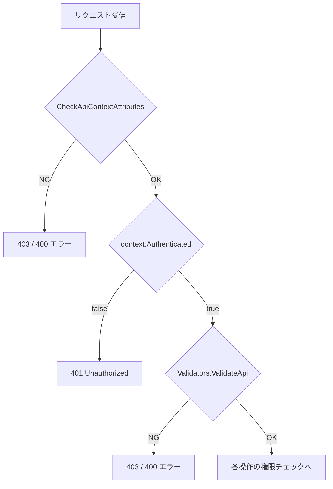
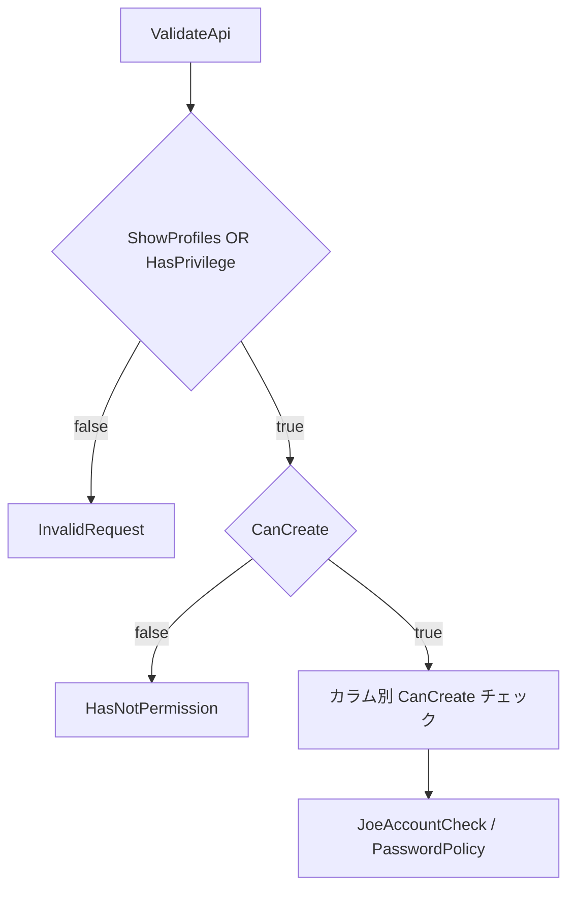
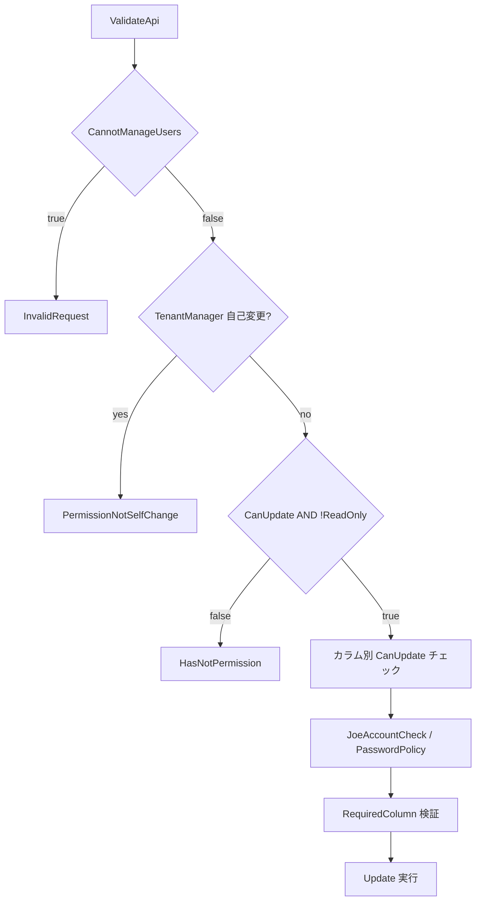
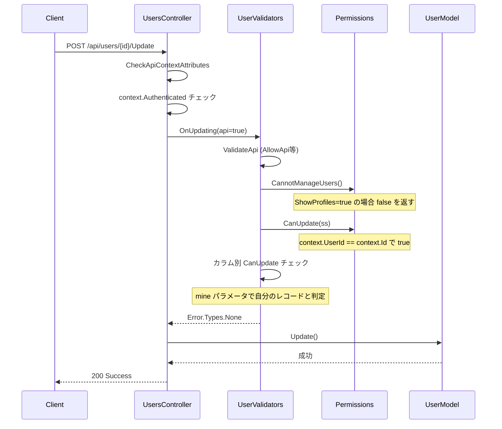

# api/users 実行権限調査

`api/users` エンドポイントの実行権限を調査する。ユーザが自身のプロファイルを更新する場合の権限処理、および各操作で変更可能なフィールドの制限を明確にする。

<!-- START doctoc generated TOC please keep comment here to allow auto update -->
<!-- DON'T EDIT THIS SECTION, INSTEAD RE-RUN doctoc TO UPDATE -->

- [調査情報](#調査情報)
- [調査目的](#調査目的)
- [エンドポイント一覧](#エンドポイント一覧)
- [権限チェックに関わる主要パラメータ・フラグ](#権限チェックに関わる主要パラメータフラグ)
- [共通の事前チェック](#共通の事前チェック)
    - [CheckApiContextAttributes](#checkapicontextattributes)
    - [Validators.ValidateApi](#validatorsvalidateapi)
- [操作別の権限チェック](#操作別の権限チェック)
    - [Get（取得）](#get取得)
    - [Create（作成）](#create作成)
    - [Update（更新）](#update更新)
    - [Delete（削除）](#delete削除)
    - [Import（インポート）](#importインポート)
- [操作権限の全体マトリクス](#操作権限の全体マトリクス)
    - [ユーザ種別ごとの操作可否](#ユーザ種別ごとの操作可否)
    - [操作別の判定変数マトリクス](#操作別の判定変数マトリクス)
    - [判定変数の評価フロー詳細](#判定変数の評価フロー詳細)
- [プロファイル更新の権限フロー](#プロファイル更新の権限フロー)
- [UserApiModel のフィールドと更新可能性](#userapimodel-のフィールドと更新可能性)
    - [プロファイル系フィールド](#プロファイル系フィールド)
    - [管理系フィールド](#管理系フィールド)
    - [システム系フィールド（通常は更新対象外）](#システム系フィールド通常は更新対象外)
- [関連する権限判定メソッド](#関連する権限判定メソッド)
- [OnEntry の API / 非 API 差異](#onentry-の-api--非-api-差異)
- [注意点](#注意点)
    - [ShowProfiles パラメータの影響](#showprofiles-パラメータの影響)
    - [EnableManageTenant の制限](#enablemanagetenant-の制限)
    - [TenantManager 自己変更防止のバイパス](#tenantmanager-自己変更防止のバイパス)
- [結論](#結論)
- [関連ソースコード](#関連ソースコード)

<!-- END doctoc generated TOC please keep comment here to allow auto update -->

## 調査情報

| 調査日     | リポジトリ | ブランチ | タグ/バージョン    | コミット    | 備考 |
| ---------- | ---------- | -------- | ------------------ | ----------- | ---- |
| 2026-03-04 | Pleasanter | main     | Pleasanter_1.5.1.0 | `34f162a43` | -    |

## 調査目的

- `api/users` の各エンドポイント（Get / Create / Update / Delete / Import）における権限チェックの仕組みを明確にする
- ユーザが自身のプロファイルを更新する場合のフローと制限を特定する
- 操作ごとの権限要件と更新可能なフィールドの範囲を整理する

---

## エンドポイント一覧

`api/users` のルーティングは `Controllers/Api/UsersController.cs` で属性ルーティングにより定義される。

| メソッド | ルート                  | 処理メソッド                  |
| -------- | ----------------------- | ----------------------------- |
| POST     | `api/users/Get`         | `UserUtilities.GetByApi()`    |
| POST     | `api/users/{id}/Get`    | `UserUtilities.GetByApi()`    |
| POST     | `api/users/Create`      | `UserUtilities.CreateByApi()` |
| POST     | `api/users/{id}/Update` | `UserUtilities.UpdateByApi()` |
| POST     | `api/users/{id}/Delete` | `UserUtilities.DeleteByApi()` |
| POST     | `api/users/Import`      | `UserUtilities.ImportByApi()` |

コントローラには `[AllowAnonymous]` と `[CheckApiContextAttributes]` が付与されている。
`[AllowAnonymous]` は ASP.NET Core の認証ミドルウェアをバイパスするだけで、
各アクションメソッド内で `context.Authenticated` を明示的にチェックし、
未認証の場合は `ApiResults.Unauthorized` を返す。

---

## 権限チェックに関わる主要パラメータ・フラグ

| パラメータ / フラグ               | 定義場所                           | 説明                                                                                                 |
| --------------------------------- | ---------------------------------- | ---------------------------------------------------------------------------------------------------- |
| `Parameters.Service.ShowProfiles` | `App_Data/Parameters/Service.json` | ユーザプロファイル機能の有効化フラグ。デフォルト `true`                                              |
| `User.TenantManager`              | Users テーブル                     | テナント管理者フラグ。ユーザ管理の大半の操作を許可する                                               |
| `context.HasPrivilege`            | `Context.cs`                       | サービス管理者特権。`PrivilegedUsers` に該当するログインIDを持つ場合に `true`                        |
| `UserSettings.EnableManageTenant` | `UserSettings.cs`                  | テナント管理者でないユーザにユーザ・組織・グループの管理権限を委譲する設定。ただしユーザの作成は不可 |
| `User.AllowApi`                   | Users テーブル                     | API アクセスの許可フラグ。`false` の場合 API 経由の操作が全面的に拒否される                          |

---

## 共通の事前チェック

全エンドポイントで以下の事前チェックが順に実行される。



### CheckApiContextAttributes

`PleasanterFilters/CheckApiContextAttributes.cs` に実装されたアクションフィルタ。以下を検証する。

- リクエストボディの存在チェック
- IP アドレス制限
- 契約設定の検証
- JSON 形式の妥当性
- API トークンの検証（有効化時）

### Validators.ValidateApi

`Libraries/General/Validators.cs` に実装。以下を検証する。

- API 機能がパラメータで有効化されているか
- 契約で API が許可されているか
- ユーザ設定で `AllowApi` が有効か
- リクエストデータの JSON 妥当性

---

## 操作別の権限チェック

### Get（取得）

`UserValidators.OnEntry()` が API モードで呼ばれる。

```csharp
// UserValidators.cs L18-43
public static ErrorData OnEntry(Context context, SiteSettings ss, bool api = false, ...)
{
    if (api)
    {
        var apiErrorData = Validators.ValidateApi(context: context, serverScript: serverScript);
        if (apiErrorData.Type != Error.Types.None) return apiErrorData;
        return new ErrorData(type: Error.Types.None);  // API は ValidateApi のみで通過
    }
    // 非 API の場合は CannotManageUsers チェックが入る
    ...
}
```

API の場合、`OnEntry` は `ValidateApi` のみで通過する。
`CannotManageUsers` チェックは実行されない。
そのため、`AllowApi=true` で認証済みのユーザであれば、
同一テナント内の全ユーザ情報を取得できる。

`AllowApi=false` の場合は `ValidateApi` 内で 403 エラーとなり、
Get を含む全 API 操作が拒否される。
`ShowProfiles` の値に関わらず API 経由でのアクセスは一切不可となる。
`AllowApi` は API アクセス全体のゲートであり、
個別操作の権限チェックより前段階で評価される。

取得結果は `Users_TenantId` でテナント単位にフィルタされる。
メールアドレスの取得はリクエストの `ApiGetMailAddresses` フラグに依存する。

### Create（作成）

`UserValidators.OnCreating()` で以下のチェックが行われる。



`CanCreate` の判定ロジック（`Permissions.cs` L505-513）:

```csharp
case "users":
    if (context.UserSettings?.EnableManageTenant == true)
        return false;   // EnableManageTenant ユーザはユーザ作成不可
    else
        return CanManageTenant(context: context);  // TenantManager のみ
```

ユーザ作成は `TenantManager` または `HasPrivilege` のみ許可される。`EnableManageTenant` を持つユーザは明示的に拒否される。

### Update（更新）

`UserValidators.OnUpdating()` のチェックフローが最も複雑で、プロファイル更新に直接関わる。



#### CannotManageUsers チェック

```csharp
// Permissions.cs L767-773
public static bool CannotManageUsers(Context context)
{
    return (context.UserSettings?.EnableManageTenant == false
        || context.UserSettings?.EnableManageTenant == null)
        && !context.HasPrivilege
        && !Parameters.Service.ShowProfiles;
}
```

`ShowProfiles=true`（デフォルト）の場合、この関数は常に `false` を返す。つまりデフォルト設定では全ユーザがこのチェックを通過する。

#### TenantManager 自己変更防止

```csharp
// UserValidators.cs L962-966
if (context.Forms.Exists("Users_TenantManager")
    && userModel.Self(context: context))
{
    return new ErrorData(type: Error.Types.PermissionNotSelfChange);
}
```

自分自身の `TenantManager` フラグを変更する操作はブロックされる。
ただしこのチェックは `context.Forms` を参照しており、
API リクエストでは `Forms` にデータが入らないため、
API 経由では事実上このチェックはバイパスされる。
API 経由での TenantManager 自己変更の防止はカラム別権限チェックに委ねられる。

#### CanUpdate 判定

```csharp
// Permissions.cs L556-559
case "users":
    return CanManageTenant(context: context)
        || context.UserId == context.Id
        || context.UserSettings?.EnableManageTenant == true;
```

`context.UserId == context.Id` の比較により、自分自身のレコード更新が許可される。
`context.Id` はルートパラメータ `{id}` から設定され、
`context.UserId` は認証済みユーザの ID である。

#### カラム別権限チェック

`OnUpdating` メソッド内でカラムごとに `column.CanUpdate(context, ss, mine)` が検証される。`mine` パラメータには `userModel.Mine(context)` の結果が渡され、自分自身のレコードかどうかが考慮される。

カラム権限で更新不可と判定された場合でも、値が変更されていなければエラーにはならない（`_Updated()` メソッドが `false` を返すため）。

### Delete（削除）

```csharp
// Permissions.cs L600-602
case "users":
    return CanManageTenant(context: context)
        && context.UserId != context.Id;
```

- `TenantManager` のみ削除可能
- 自分自身の削除は不可（`context.UserId != context.Id`）
- さらに `ShowProfiles=true` または `HasPrivilege` が前提条件

### Import（インポート）

```csharp
// Permissions.cs L666-667
case "users":
    return CanManageTenant(context: context);
```

`TenantManager` のみ実行可能。`EnableManageTenant` は含まれない。

---

## 操作権限の全体マトリクス

### ユーザ種別ごとの操作可否

| 操作   | TenantManager  | 一般ユーザ（自分自身） | EnableManageTenant | HasPrivilege |
| ------ | -------------- | ---------------------- | ------------------ | ------------ |
| Get    | 可             | 可                     | 可                 | 可           |
| Create | 可             | 不可                   | 不可               | 可           |
| Update | 可（全ユーザ） | 可（自分のみ）         | 可（全ユーザ）     | 可           |
| Delete | 可（他者のみ） | 不可                   | 不可               | 可           |
| Import | 可             | 不可                   | 不可               | 可           |
| Export | 可             | 不可                   | 可                 | 可           |

注: 上記は `ShowProfiles=true`（デフォルト）かつ `AllowApi=true` の場合。

### 操作別の判定変数マトリクス

各操作で参照される判定変数と、その評価順序を以下に示す。
全操作に共通で `ValidateApi`（`AllowApi` 等）が最初に評価され、
`false` の場合は後続チェックに到達せず 403 エラーとなる。

| 判定変数 / 条件            | Get | Create | Update | Delete | Import |
| -------------------------- | --- | ------ | ------ | ------ | ------ |
| `AllowApi`                 | 要  | 要     | 要     | 要     | 要     |
| `Parameters.Api.Enabled`   | 要  | 要     | 要     | 要     | 要     |
| `ContractSettings.Api`     | 要  | 要     | 要     | 要     | 要     |
| `ShowProfiles`             | -   | 要     | 要     | 要     | -      |
| `HasPrivilege`             | -   | 要     | 要     | 要     | 要     |
| `TenantManager`            | -   | 要     | 要     | 要     | 要     |
| `EnableManageTenant`       | -   | 参照   | 要     | -      | -      |
| `UserId == Id`（自己判定） | -   | -      | 要     | 要     | -      |
| カラム別アクセス制御       | -   | 要     | 要     | -      | -      |

凡例: 要 = 判定に使用 / 参照 = 条件に含まれるが拒否方向で参照 / - = 不使用

### 判定変数の評価フロー詳細

| 操作   | 判定フロー（評価順）                                           |
| ------ | -------------------------------------------------------------- |
| Get    | `ValidateApi` のみ                                             |
| Create | `ValidateApi` → `ShowProfiles \|\| HasPrivilege` → `CanCreate` |
| Update | `ValidateApi` → `CannotManageUsers` → `CanUpdate`              |
| Delete | `ValidateApi` → `ShowProfiles \|\| HasPrivilege` → `CanDelete` |
| Import | `ValidateApi` → `CanImport`                                    |

各判定メソッドの内部ロジック:

- `ValidateApi`: `AllowApi && Api.Enabled && ContractSettings.Api`
- `CannotManageUsers`: `!EnableManageTenant && !HasPrivilege && !ShowProfiles`
- `CanCreate`: `EnableManageTenant ? false : CanManageTenant`
- `CanUpdate`: `CanManageTenant \|\| UserId == Id \|\| EnableManageTenant`
- `CanDelete`: `CanManageTenant && UserId != Id`
- `CanImport`: `CanManageTenant`
- `CanManageTenant`: `TenantManager \|\| HasPrivilege`

---

## プロファイル更新の権限フロー

一般ユーザが自身のプロファイルを `api/users/{自分のUserId}/Update` で更新する場合のフローを以下に示す。



---

## UserApiModel のフィールドと更新可能性

`UserApiModel.cs` で定義される全フィールドと、操作者の権限による更新可能性の分類を示す。

### プロファイル系フィールド

一般ユーザが自分自身のプロファイル更新で変更可能なフィールド（カラムアクセス制御のデフォルト設定の場合）。

| フィールド名          | 型        | 説明         |
| --------------------- | --------- | ------------ |
| Name                  | string    | 氏名         |
| LastName              | string    | 姓           |
| FirstName             | string    | 名           |
| Birthday              | DateTime? | 生年月日     |
| Gender                | string    | 性別         |
| Language              | string    | 使用言語     |
| TimeZone              | string    | タイムゾーン |
| Theme                 | string    | テーマ       |
| FirstAndLastNameOrder | int?      | 姓名表示順   |
| Body                  | string    | 備考         |
| Password              | string    | パスワード   |

### 管理系フィールド

`TenantManager` 以上の権限を持つユーザのみが変更可能なフィールド。

| フィールド名                   | 型     | 説明                       |
| ------------------------------ | ------ | -------------------------- |
| LoginId                        | string | ログインID                 |
| GlobalId                       | string | グローバルID               |
| UserCode                       | string | ユーザコード               |
| DeptId                         | int?   | 組織ID                     |
| Manager                        | int?   | 管理者                     |
| TenantManager                  | bool?  | テナント管理者フラグ       |
| AllowCreationAtTopSite         | bool?  | トップサイト作成許可       |
| AllowGroupAdministration       | bool?  | グループ管理許可           |
| AllowGroupCreation             | bool?  | グループ作成許可           |
| AllowApi                       | bool?  | API 使用許可               |
| AllowMovingFromTopSite         | bool?  | トップサイトからの移動許可 |
| EnableSecondaryAuthentication  | bool?  | 二段階認証有効化           |
| DisableSecondaryAuthentication | bool?  | 二段階認証無効化           |
| Disabled                       | bool?  | 無効化フラグ               |
| Lockout                        | bool?  | ロックアウト               |
| LockoutCounter                 | int?   | ロックアウトカウンタ       |

### システム系フィールド（通常は更新対象外）

| フィールド名                              | 型        | 説明                     |
| ----------------------------------------- | --------- | ------------------------ |
| LastLoginTime                             | DateTime? | 最終ログイン日時         |
| PasswordExpirationTime                    | DateTime? | パスワード有効期限       |
| PasswordChangeTime                        | DateTime? | パスワード変更日時       |
| NumberOfLogins                            | int?      | ログイン回数             |
| NumberOfDenial                            | int?      | 認証失敗回数             |
| ApiKey                                    | string    | API キー                 |
| SecondaryAuthenticationCode               | string    | 二段階認証コード         |
| SecondaryAuthenticationCodeExpirationTime | DateTime? | 二段階認証コード有効期限 |
| LdapSearchRoot                            | string    | LDAP 検索ルート          |
| SynchronizedTime                          | DateTime? | 同期日時                 |
| SecretKey                                 | string    | 秘密鍵                   |
| EnableSecretKey                           | bool?     | 秘密鍵有効化             |
| LoginExpirationLimit                      | bool?     | ログイン有効期限制限     |
| LoginExpirationPeriod                     | int?      | ログイン有効期間         |

注: フィールドの更新可否はカラムアクセス制御の設定に依存する。上記の分類はデフォルト設定を前提としている。テナント管理画面でカラムごとの読み書き権限を変更することで、更新可能範囲をカスタマイズできる。

---

## 関連する権限判定メソッド

主要な権限判定メソッドの定義と役割を整理する。

| メソッド                                       | 定義場所       | 判定ロジック                                                         |
| ---------------------------------------------- | -------------- | -------------------------------------------------------------------- |
| `CanManageTenant(context)`                     | Permissions.cs | `User.TenantManager == true \|\| HasPrivilege`                       |
| `CanManageUser(context)`                       | Permissions.cs | `(User.TenantManager == true && ShowProfiles) \|\| HasPrivilege`     |
| `CannotManageUsers(context)`                   | Permissions.cs | `EnableManageTenant == null/false && !HasPrivilege && !ShowProfiles` |
| `CanManageTenantOrEnableManageTenant(context)` | Permissions.cs | `CanManageTenant \|\| EnableManageTenant`                            |
| `CanRead(context, ss)` [users]                 | Permissions.cs | `CanManageTenant \|\| UserId == Id \|\| EnableManageTenant`          |
| `CanCreate(context, ss)` [users]               | Permissions.cs | `EnableManageTenant ? false : CanManageTenant`                       |
| `CanUpdate(context, ss)` [users]               | Permissions.cs | `CanManageTenant \|\| UserId == Id \|\| EnableManageTenant`          |
| `CanDelete(context, ss)` [users]               | Permissions.cs | `CanManageTenant && UserId != Id`                                    |
| `CanImport(context, ss)` [users]               | Permissions.cs | `CanManageTenant`                                                    |
| `CanExport(context, ss)` [users]               | Permissions.cs | `CanManageTenant \|\| EnableManageTenant`                            |
| `CanSendMail(context, ss)` [users]             | Permissions.cs | `CanManageTenant \|\| UserId == Id`                                  |

---

## OnEntry の API / 非 API 差異

`UserValidators.OnEntry()` は API 呼び出しと非 API（画面操作）呼び出しで権限チェックのロジックが異なる。

| チェック項目         | API（`api=true`） | 非 API（`api=false`）              |
| -------------------- | ----------------- | ---------------------------------- |
| ValidateApi          | 実行              | 実行しない                         |
| CannotManageUsers    | 実行しない        | 実行（`ShowProfiles` 依存）        |
| CanManageTenant 判定 | 実行しない        | 実行（エントリ段階でブロック可能） |

API の場合、`OnEntry` は `ValidateApi` のみでエントリを許可し、詳細な権限チェックは各操作メソッド（`OnUpdating` 等）に委ねる設計となっている。

---

## 注意点

### ShowProfiles パラメータの影響

`ShowProfiles=false` に設定した場合、`CannotManageUsers()` が `true` を返すようになり、
`HasPrivilege` を持たないユーザは Update / Create / Delete / Import のいずれも実行できなくなる。
ただし Get（取得）は `OnEntry` の API パスで `CannotManageUsers` をチェックしないため、
`ShowProfiles=false` でも認証済みかつ `AllowApi=true` の API ユーザは取得可能である。

`AllowApi=false` の場合は `ValidateApi` で全操作がブロックされるため、
`ShowProfiles` の値に関わらず API 経由のアクセスは不可となる。

### EnableManageTenant の制限

`EnableManageTenant` が有効なユーザは他者のプロファイルを更新できるが、以下の操作は許可されない。

- ユーザの新規作成（`CanCreate` で明示的に `false` を返す）
- ユーザの削除（`CanDelete` に `EnableManageTenant` が含まれない）
- ユーザのインポート（`CanImport` に `EnableManageTenant` が含まれない）

### TenantManager 自己変更防止のバイパス

UI 経由では `context.Forms.Exists("Users_TenantManager")` チェックにより
自身の `TenantManager` フラグ変更がブロックされるが、
API 経由では `context.Forms` にデータが格納されないため、このチェックは機能しない。
API 経由での TenantManager 自己変更の防止はカラムアクセス制御に依存する。

---

## 結論

- `api/users` の権限チェックは
  `ValidateApi` → `CannotManageUsers` → `CanUpdate/CanCreate/CanDelete` →
  カラム別チェックの順に段階的に実行される
- 一般ユーザは `ShowProfiles=true`（デフォルト）の環境で、
  自分自身の UserId を指定して `api/users/{自分のId}/Update` を呼ぶことで、
  プロファイル系フィールド（Name, Language, TimeZone 等）を更新できる
- 他者の更新や管理系フィールドの変更には `TenantManager` 以上の権限が必要である
- ユーザ作成・削除・インポートは `TenantManager` または `HasPrivilege` に限定され、
  `EnableManageTenant` では許可されない
- `ShowProfiles=false` 設定時は `HasPrivilege` 以外の全操作がブロックされるが、
  Get（取得）のみ例外的に API ではブロックされない

## 関連ソースコード

| ファイル                                         | 概要                                                             |
| ------------------------------------------------ | ---------------------------------------------------------------- |
| `Controllers/Api/UsersController.cs`             | API エンドポイント定義                                           |
| `Models/Users/UserUtilities.cs`                  | GetByApi / CreateByApi / UpdateByApi / DeleteByApi / ImportByApi |
| `Models/Users/UserValidators.cs`                 | OnEntry / OnCreating / OnUpdating / OnDeleting                   |
| `Models/Users/UserApiModel.cs`                   | API リクエスト/レスポンスのフィールド定義                        |
| `Libraries/Security/Permissions.cs`              | CanRead / CanCreate / CanUpdate / CanDelete 等                   |
| `Libraries/General/Validators.cs`                | ValidateApi                                                      |
| `PleasanterFilters/CheckApiContextAttributes.cs` | API リクエストの事前検証                                         |
| `Implem.ParameterAccessor/Parts/Service.cs`      | ShowProfiles パラメータ定義                                      |
| `Libraries/Settings/UserSettings.cs`             | EnableManageTenant 定義                                          |
