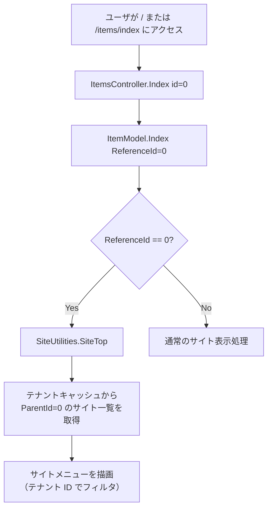
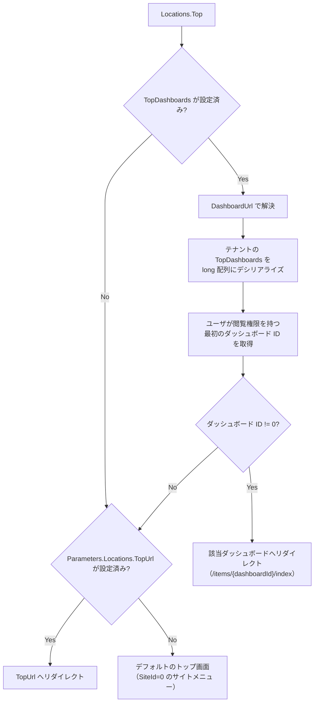

# マルチテナントにおける SiteId=0 の扱い

マルチテナント構成でのトップ画面（SiteId=0）の挙動と、テナントごとのトップページ制御の仕組みを調査する。

<!-- START doctoc generated TOC please keep comment here to allow auto update -->
<!-- DON'T EDIT THIS SECTION, INSTEAD RE-RUN doctoc TO UPDATE -->

- [調査情報](#調査情報)
- [調査目的](#調査目的)
- [SiteId=0 の概要](#siteid0-の概要)
    - [SiteId=0 の判定](#siteid0-の判定)
- [トップ画面のルーティングフロー](#トップ画面のルーティングフロー)
    - [ItemsController.Index](#itemscontrollerindex)
    - [ItemModel.Index](#itemmodelindex)
    - [処理フロー図](#処理フロー図)
- [テナント分離の仕組み](#テナント分離の仕組み)
    - [SiteUtilities.SiteTop のテナントキャッシュ参照](#siteutilitiessitetop-のテナントキャッシュ参照)
    - [Menu メソッドによるサイト一覧取得](#menu-メソッドによるサイト一覧取得)
    - [SiteMenu クラスにおけるテナントフィルタリング](#sitemenu-クラスにおけるテナントフィルタリング)
- [TopDashboards によるテナント別トップページ設定](#topdashboards-によるテナント別トップページ設定)
    - [TenantModel.TopDashboards](#tenantmodeltopdashboards)
    - [Locations.DashboardUrl によるトップページ解決](#locationsdashboardurl-によるトップページ解決)
    - [TopDashboards の解決フロー](#topdashboards-の解決フロー)
    - [ログイン後のリダイレクト](#ログイン後のリダイレクト)
- [トップ画面の権限制御](#トップ画面の権限制御)
    - [SiteTopPermission](#sitetoppermission)
- [テナントキャッシュの構造](#テナントキャッシュの構造)
- [結論](#結論)
- [関連ソースコード](#関連ソースコード)

<!-- END doctoc generated TOC please keep comment here to allow auto update -->

## 調査情報

| 調査日       | リポジトリ | ブランチ | タグ/バージョン    | コミット     | 備考     |
| ------------ | ---------- | -------- | ------------------ | ------------ | -------- |
| 2026年3月3日 | Pleasanter | main     | Pleasanter_1.5.1.0 | `34f162a439` | 初回調査 |

## 調査目的

マルチテナント構成において、SiteId=0 がどのように扱われるかを明らかにする。具体的には以下の疑問を解消する。

- 異なるテナント ID でも共通して SiteId=0 がトップ画面として扱われるのか
- テナント ID ごとに異なる SiteId がトップ画面として扱われるのか
- テナントごとのトップページ制御はどのような仕組みで実現されているか

---

## SiteId=0 の概要

SiteId=0 は、プリザンターにおいて「仮想的なルートサイト」として機能する。データベースの Sites テーブルに SiteId=0 のレコードが存在するわけではなく、アプリケーションロジック上で特別扱いされる値である。

### SiteId=0 の判定

`Context.SiteTop()` メソッドにより、現在のリクエストがトップ画面（SiteId=0）であるかが判定される。

**ファイル**: `Implem.Pleasanter/Libraries/Requests/Context.cs`（行番号: 887-890）

```csharp
public bool SiteTop()
{
    return SiteId == 0 && Id == 0 && Controller == "items" && Action == "index";
}
```

この判定には TenantId は含まれていない。つまり、SiteId=0 はテナント ID に依存せず、全テナントで共通して「トップ画面」を表す値として扱われる。

---

## トップ画面のルーティングフロー

ユーザがトップ画面（`/items/index` または `/`）にアクセスした際の処理フローを以下に示す。

### ItemsController.Index

**ファイル**: `Implem.Pleasanter/Controllers/ItemsController.cs`（行番号: 27-37）

```csharp
public ActionResult Index(long id = 0)
{
    var context = new Context();
    if (!context.Ajax)
    {
        var log = new SysLogModel(context: context);
        var html = new ItemModel(context: context, referenceId: id).Index(context: context);
        // ...
    }
}
```

`id` パラメータのデフォルト値は 0 であるため、パスに ID が含まれない場合は `ReferenceId=0` として処理される。

### ItemModel.Index

**ファイル**: `Implem.Pleasanter/Models/Items/ItemModel.cs`（行番号: 307-312）

```csharp
public string Index(Context context)
{
    if (ReferenceId == 0)
    {
        return SiteUtilities.SiteTop(context: context);
    }
    // ...
}
```

`ReferenceId == 0` の場合、`SiteUtilities.SiteTop()` が呼び出される。

### 処理フロー図



---

## テナント分離の仕組み

SiteId=0 自体はテナント共通の値であるが、トップ画面に表示されるサイト一覧はテナント ID で厳密にフィルタリングされる。

### SiteUtilities.SiteTop のテナントキャッシュ参照

**ファイル**: `Implem.Pleasanter/Models/Sites/SiteUtilities.cs`（行番号: 4245-4297）

```csharp
public static string SiteTop(Context context)
{
    var hb = new HtmlBuilder();
    var ss = new SiteSettings();
    ss.ReferenceType = "Sites";
    ss.PermissionType = context.SiteTopPermission();
    var siteConditions = SiteInfo.TenantCaches
        .Get(context.TenantId)?      // テナント ID をキーにキャッシュを取得
        .SiteMenu
        .SiteConditions(context: context, ss: ss);
    // ...
}
```

`SiteInfo.TenantCaches` は `Dictionary<int, TenantCache>` であり、テナント ID ごとに独立したキャッシュを保持している。

### Menu メソッドによるサイト一覧取得

**ファイル**: `Implem.Pleasanter/Models/Sites/SiteUtilities.cs`（行番号: 4793-4823）

```csharp
private static IEnumerable<SiteModel> Menu(Context context, SiteSettings ss)
{
    var siteCollection = new SiteCollection(
        context: context,
        column: Rds.SitesColumn()
            .SiteId()
            .Title()
            .ReferenceType()
            .SiteSettings(),
        where: Rds.SitesWhere()
            .TenantId(context.TenantId)   // テナント ID でフィルタ
            .ParentId(ss.SiteId)          // ParentId=0（トップ直下）
            .Add(
                raw: Def.Sql.HasPermission,
                _using: !context.HasPrivilege));
    // ...
}
```

`TenantId(context.TenantId)` と `ParentId(ss.SiteId)` の 2 条件でクエリが発行される。トップ画面の場合、`ss.SiteId` は 0 であるため、「現在のテナントに属し、かつ ParentId=0（トップ直下）のサイト」のみが取得される。

### SiteMenu クラスにおけるテナントフィルタリング

SiteMenu クラスの `SiteMenuElementDataRow` メソッドでも、テナント ID によるフィルタリングが行われている。

**ファイル**: `Implem.Pleasanter/Libraries/Server/SiteMenu.cs`（行番号: 223-237）

```csharp
private DataRow SiteMenuElementDataRow(Context context, long siteId)
{
    return Repository.ExecuteTable(
        context: context,
        statements: Rds.SelectSites(
            column: Rds.SitesColumn()
                .TenantId()
                .ReferenceType()
                .ParentId()
                .Title(),
            where: Rds.SitesWhere()
                .TenantId(context.TenantId, _using: context.TenantId != 0)
                .SiteId(siteId)))
                    .AsEnumerable()
                    .FirstOrDefault();
}
```

また、`Children` メソッドでも `TenantId` によるフィルタリングが行われている。

**ファイル**: `Implem.Pleasanter/Libraries/Server/SiteMenu.cs`（行番号: 61-80）

```csharp
public IEnumerable<SiteMenuElement> Children(
    Context context, long siteId, List<SiteMenuElement> data = null, bool withParent = false)
{
    // ...
    this.Select(o => o.Value)
        .Where(o => o.TenantId == context.TenantId)  // テナント ID でフィルタ
        .Where(o => o.ParentId == siteId)
        .ForEach(element => { /* ... */ });
    // ...
}
```

---

## TopDashboards によるテナント別トップページ設定

プリザンターにはテナントごとにトップページとして表示するダッシュボードを指定する機能（TopDashboards）がある。この機能を使うと、テナント管理画面から特定のダッシュボードサイトをトップページとして設定できる。

### TenantModel.TopDashboards

**ファイル**: `Implem.Pleasanter/Models/Tenants/TenantModel.cs`（行番号: 45）

```csharp
public string TopDashboards = string.Empty;
```

`TopDashboards` は JSON 配列形式の文字列で、ダッシュボードタイプのサイト ID を格納する（例: `[123, 456]`）。

### Locations.DashboardUrl によるトップページ解決

**ファイル**: `Implem.Pleasanter/Libraries/Responses/Locations.cs`（行番号: 13-44）

```csharp
public static string Top(Context context)
{
    var topUrl = DashboardUrl(context: context)
        ?? Get(context: context, parts: Parameters.Locations.TopUrl);
    return (Permissions.PrivilegedUsers(context.LoginId)
        && Parameters.Locations.LoginAfterUrlExcludePrivilegedUsers)
            || topUrl.IsNullOrEmpty()
                ? Get(context: context)
                : topUrl;
}

public static string DashboardUrl(Context context)
{
    var tenantModel = new TenantModel(
        context: context,
        ss: SiteSettingsUtilities.TenantsSiteSettings(context: context),
        tenantId: context.TenantId);           // テナント固有の設定を取得
    var dashboards = tenantModel.TopDashboards
        ?.Deserialize<long[]>()
            ?? System.Array.Empty<long>();
    var dashboardId = dashboards
        .FirstOrDefault(id => Permissions
            .CanRead(context: context, siteId: id));  // 権限チェック
    return dashboardId != 0
        ? ItemIndex(context: context, id: dashboardId)
        : null;
}
```

### TopDashboards の解決フロー



### ログイン後のリダイレクト

ログイン後のリダイレクト先も `Locations.DashboardUrl` を参照する。

**ファイル**: `Implem.Pleasanter/Models/Users/UserModel.cs`（行番号: 5692-5701）

```csharp
if (returnUrl.IsNullOrEmpty() || returnUrl == "/")
{
    var dashboardUrl = Locations.DashboardUrl(context: context);
    return dashboardUrl.IsNullOrEmpty()
        ? Locations.Get(
            context: context,
            parts: Parameters.Locations.LoginAfterUrl)
        : dashboardUrl;
}
```

---

## トップ画面の権限制御

SiteId=0 のトップ画面では、通常のサイト権限とは異なる特別な権限モデルが適用される。

### SiteTopPermission

**ファイル**: `Implem.Pleasanter/Libraries/Security/Permissions.cs`（行番号: 442-447）

```csharp
public static Types SiteTopPermission(this Context context)
{
    return context.UserSettings?.AllowCreationAtTopSite(context: context) != true
        ? Types.Read
        : (Types)Parameters.Permissions.Manager;
}
```

デフォルトでは `Types.Read`（読み取りのみ）が適用される。`AllowCreationAtTopSite` が有効なユーザのみ、トップ画面でサイトを作成できる。

---

## テナントキャッシュの構造

各テナントのサイト情報はテナントキャッシュとして管理される。

**ファイル**: `Implem.Pleasanter/Libraries/Server/TenantCache.cs`

```csharp
public class TenantCache
{
    public int TenantId;
    public Dictionary<long, DataRow> Sites;
    public SiteMenu SiteMenu;
    public Dictionary<int, Dept> DeptHash;
    public Dictionary<int, Group> GroupHash;
    public Dictionary<int, User> UserHash;
}
```

`SiteInfo.TenantCaches` は `Dictionary<int, TenantCache>` として定義されており、テナント ID をキーにして完全に分離されたキャッシュが保持される。

**ファイル**: `Implem.Pleasanter/Libraries/Server/SiteInfo.cs`（行番号: 19）

```csharp
public static Dictionary<int, TenantCache> TenantCaches = new Dictionary<int, TenantCache>();
```

---

## 結論

| 項目                                           | 結果                                                                                   |
| ---------------------------------------------- | -------------------------------------------------------------------------------------- |
| SiteId=0 はテナント共通か                      | 共通。SiteId=0 は全テナントで「仮想的なルートサイト」として同一の意味を持つ            |
| SiteId=0 のレコードは DB に存在するか          | 存在しない。アプリケーションロジック上の特殊値として扱われる                           |
| トップ画面のサイト一覧はテナント分離されるか   | される。SQL クエリで `TenantId` と `ParentId=0` の AND 条件が適用される                |
| テナントごとに異なるトップページを設定できるか | できる。`Tenants.TopDashboards` にダッシュボードの SiteId を JSON 配列で設定できる     |
| TopDashboards 未設定時の動作                   | SiteId=0 のサイトメニュー（該当テナントの ParentId=0 のサイト一覧）が表示される        |
| TopDashboards の権限制御                       | 設定された複数のダッシュボードのうち、ユーザが閲覧権限を持つ最初のものが表示される     |
| テナントキャッシュの分離                       | `SiteInfo.TenantCaches` により、テナント ID ごとに完全に独立したキャッシュが保持される |

まとめると、SiteId=0 自体はテナント ID に依存せず全テナントで共通の「仮想ルートサイト」であるが、トップ画面に表示される内容はテナント ID によって完全に分離される。さらに、TopDashboards 機能によりテナントごとに異なるダッシュボードをトップページとして設定することも可能である。

---

## 関連ソースコード

| ファイル                                              | 内容                                    |
| ----------------------------------------------------- | --------------------------------------- |
| `Implem.Pleasanter/Libraries/Requests/Context.cs`     | SiteTop() メソッド                      |
| `Implem.Pleasanter/Controllers/ItemsController.cs`    | Index アクション（id=0 のルーティング） |
| `Implem.Pleasanter/Models/Items/ItemModel.cs`         | ReferenceId=0 の分岐                    |
| `Implem.Pleasanter/Models/Sites/SiteUtilities.cs`     | SiteTop()、Menu()                       |
| `Implem.Pleasanter/Libraries/Responses/Locations.cs`  | Top()、DashboardUrl()                   |
| `Implem.Pleasanter/Models/Tenants/TenantModel.cs`     | TopDashboards プロパティ                |
| `Implem.Pleasanter/Libraries/Security/Permissions.cs` | SiteTopPermission()                     |
| `Implem.Pleasanter/Libraries/Server/SiteMenu.cs`      | SiteMenu のテナントフィルタリング       |
| `Implem.Pleasanter/Libraries/Server/SiteInfo.cs`      | TenantCaches 管理                       |
| `Implem.Pleasanter/Libraries/Server/TenantCache.cs`   | テナントキャッシュ構造                  |
| `Implem.Pleasanter/Models/Users/UserModel.cs`         | ログイン後リダイレクト                  |
