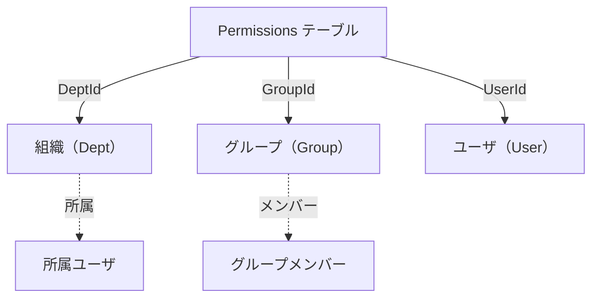
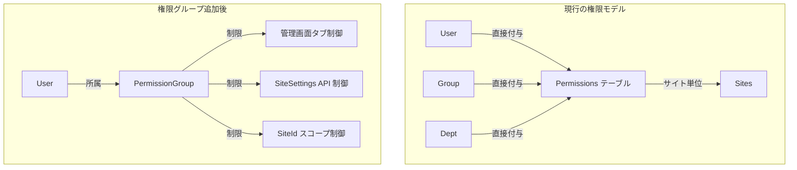
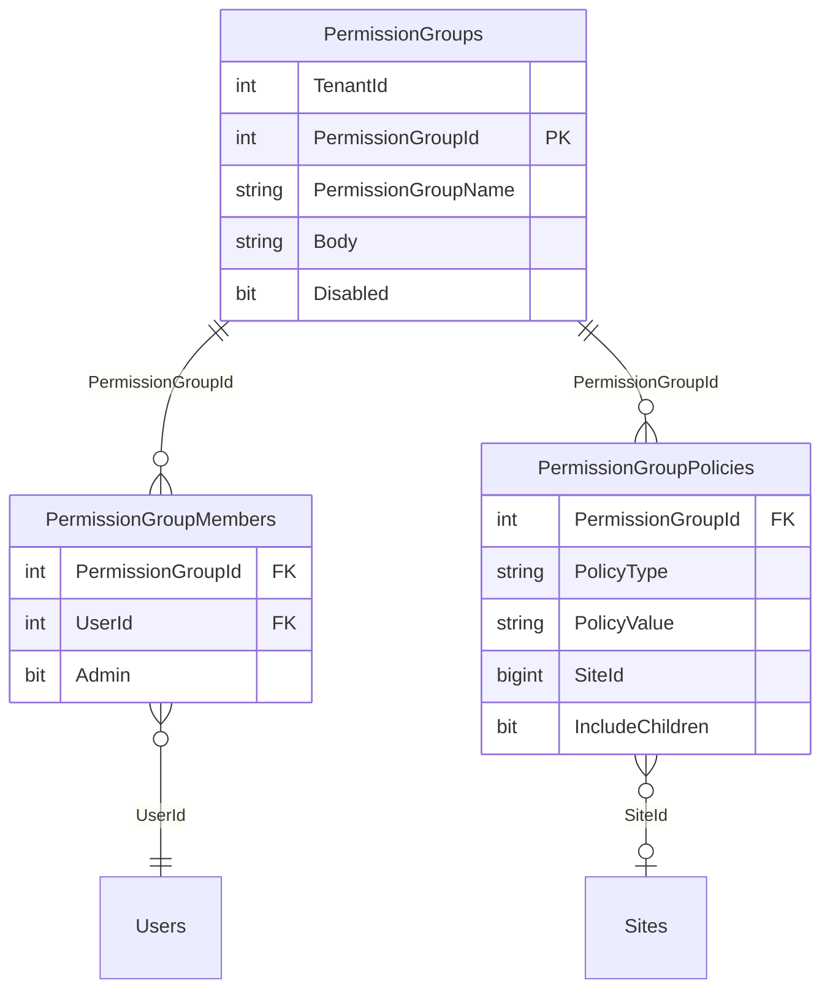
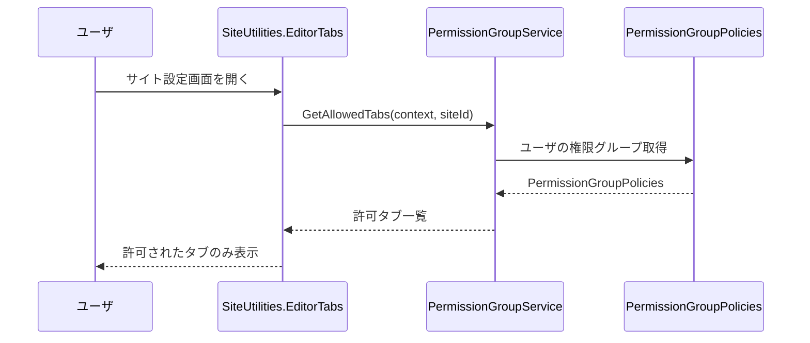
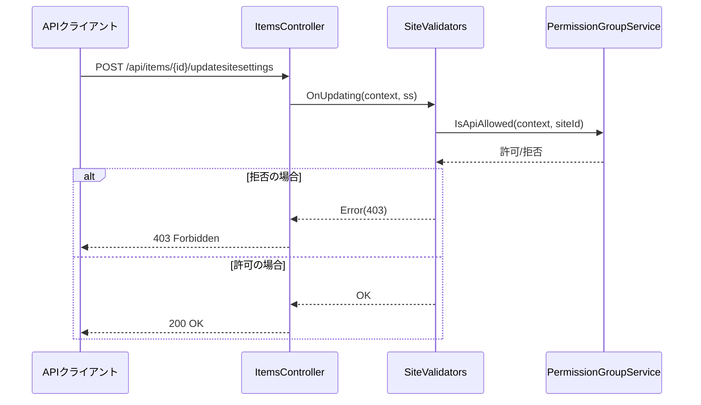
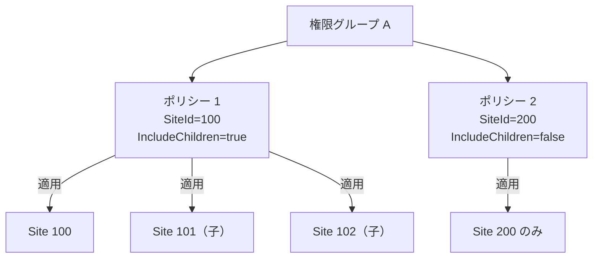
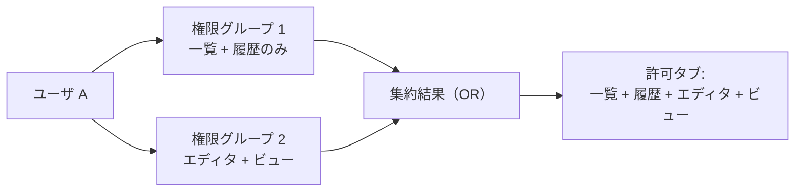
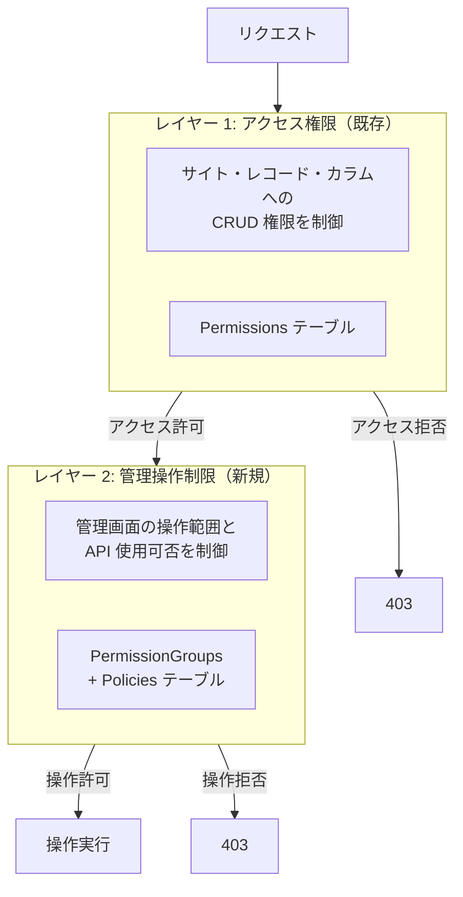

# 権限グループ実装調査

プリザンターに「権限グループ」概念を追加し、サイト管理者に対して管理画面の操作範囲や SiteSettings API の使用可否をグループ単位で制御するための実装調査を行う。

<!-- START doctoc generated TOC please keep comment here to allow auto update -->
<!-- DON'T EDIT THIS SECTION, INSTEAD RE-RUN doctoc TO UPDATE -->

- [調査情報](#調査情報)
- [調査目的](#調査目的)
- [現行の権限モデル](#現行の権限モデル)
    - [権限種別（PermissionType）](#権限種別permissiontype)
    - [プリセット権限パターン](#プリセット権限パターン)
    - [権限の3主体](#権限の3主体)
- [権限解決ロジック](#権限解決ロジック)
    - [PermissionHash の構築](#permissionhash-の構築)
    - [Hash メソッド（OR 集約）](#hash-メソッドor-集約)
    - [GetPermissions SQL（権限取得クエリ）](#getpermissions-sql権限取得クエリ)
    - [ItemsCan メソッド（権限判定の中核）](#itemscan-メソッド権限判定の中核)
    - [特権ユーザ（HasPrivilege）](#特権ユーザhasprivilege)
- [管理画面のタブ制御](#管理画面のタブ制御)
    - [サイト設定エディタのタブ一覧](#サイト設定エディタのタブ一覧)
    - [権限チェック関連メソッド](#権限チェック関連メソッド)
- [SiteSettings API のアクセス制御](#sitesettings-api-のアクセス制御)
    - [API エンドポイント](#api-エンドポイント)
    - [SiteValidators.OnUpdating](#sitevalidatorsonupdating)
    - [API 使用量制限](#api-使用量制限)
- [現行のグループシステム](#現行のグループシステム)
    - [Group モデル](#group-モデル)
    - [GroupMembers テーブル](#groupmembers-テーブル)
    - [グループ管理 UI](#グループ管理-ui)
    - [子グループ（GroupChildren）](#子グループgroupchildren)
- [サイト階層（SiteId 配下の概念）](#サイト階層siteid-配下の概念)
    - [InheritPermission](#inheritpermission)
    - [ParentId によるサイト階層](#parentid-によるサイト階層)
- [権限グループ機能の設計方針](#権限グループ機能の設計方針)
    - [概要](#概要)
    - [テーブル設計案](#テーブル設計案)
    - [ポリシー種別](#ポリシー種別)
    - [ER 図](#er-図)
- [改修箇所の分析](#改修箇所の分析)
    - [1. GUI 側のタブ制御](#1-gui-側のタブ制御)
    - [2. SiteSettings API の使用制限](#2-sitesettings-api-の使用制限)
    - [3. SiteId スコープ制御](#3-siteid-スコープ制御)
    - [4. 複数権限グループの所属と集約](#4-複数権限グループの所属と集約)
- [管理 UI の設計](#管理-ui-の設計)
    - [権限グループ管理画面](#権限グループ管理画面)
    - [操作権限](#操作権限)
- [CodeDefiner 対応](#codedefiner-対応)
    - [自動生成への対応](#自動生成への対応)
- [既存システムへの影響](#既存システムへの影響)
    - [互換性](#互換性)
    - [既存権限との関係](#既存権限との関係)
- [結論](#結論)
- [関連ソースコード](#関連ソースコード)
- [関連ドキュメント](#関連ドキュメント)

<!-- END doctoc generated TOC please keep comment here to allow auto update -->

## 調査情報

| 調査日     | リポジトリ | ブランチ | タグ/バージョン    | コミット    | 備考 |
| ---------- | ---------- | -------- | ------------------ | ----------- | ---- |
| 2026-03-04 | Pleasanter | main     | Pleasanter_1.5.1.0 | `34f162a43` | -    |

## 調査目的

以下の要件を満たす「権限グループ」機能をプリザンターに追加するために、既存の権限システムの実装を調査し、改修方針を明らかにする。

- サイト管理者に対して管理画面の操作範囲（一覧・履歴のみ等）を制限する
- SiteSettings API の使用可否をグループ単位で制限する
- 特定の SiteId 配下に制限するポリシーを適用する
- テナント管理者または特権ユーザが権限グループを追加・管理できる
- ユーザは複数の権限グループに所属でき、ユーザグループに近い UI で運用する

---

## 現行の権限モデル

### 権限種別（PermissionType）

権限はビットフラグ列挙型 `Permissions.Types` で定義されている。

**ファイル**: `Implem.Pleasanter/Libraries/Security/Permissions.cs`（行番号: 16-30）

```csharp
public enum Types : long
{
    NotSet           = 0,
    Read             = 1,            // 読み取り
    Create           = 2,            // 作成
    Update           = 4,            // 更新
    Delete           = 8,            // 削除
    SendMail         = 16,           // メール送信
    Export           = 32,           // エクスポート
    Import           = 64,           // インポート
    ManageSite       = 128,          // サイト管理
    ManagePermission = 256,          // 権限管理
    ManageTenant     = 1073741824,   // テナント管理（bit 30）
    ManageService    = 2147483648,   // サービス管理（bit 31）
}
```

### プリセット権限パターン

**ファイル**: `Implem.Pleasanter/App_Data/Parameters/Permissions.json`

| パターン  | 数値 | 含まれる権限                               |
| --------- | ---- | ------------------------------------------ |
| ReadOnly  | 1    | Read                                       |
| ReadWrite | 31   | Read + Create + Update + Delete + SendMail |
| Leader    | 255  | ReadWrite + Export + Import + ManageSite   |
| Manager   | 511  | Leader + ManagePermission                  |

### 権限の3主体

現行システムでは、Permissions テーブルに対して以下の 3 主体で権限を付与する。



| 主体  | テーブル | 説明                                   |
| ----- | -------- | -------------------------------------- |
| Dept  | Depts    | 組織単位の権限付与（1 ユーザ 1 Dept）  |
| Group | Groups   | グループ単位の権限付与（複数所属可能） |
| User  | Users    | 個別ユーザ単位の権限付与               |

---

## 権限解決ロジック

### PermissionHash の構築

ユーザのリクエストごとに `Context.PermissionHash` が構築される。

**ファイル**: `Implem.Pleasanter/Libraries/Security/Permissions.cs`（行番号: 88-114）

```csharp
public static Dictionary<long, Types> Get(Context context)
{
    if (context.Authenticated)
    {
        var statements = new List<SqlStatement>()
        {
            new SqlStatement(
                context.Sqls.GetPermissions,
                new SqlParamCollection())
        };
        // レコード単位の権限取得
        if (context.Id > 0 && context.Id != context.SiteId)
        {
            statements.Add(new SqlStatement(
                context.Sqls.GetPermissionsById.Replace(
                    "@ReferenceId", context.Id.ToStr()),
                new SqlParamCollection()));
        }
        return Hash(
            dataRows: Repository.ExecuteTable(
                context: context,
                statements: statements.ToArray())
                    .AsEnumerable());
    }
    else
    {
        return new Dictionary<long, Types>();
    }
}
```

### Hash メソッド（OR 集約）

**ファイル**: `Implem.Pleasanter/Libraries/Security/Permissions.cs`（行番号: 333-345）

複数経路から付与された権限はビット OR で合成される。

```csharp
private static Dictionary<long, Types> Hash(
    EnumerableRowCollection<DataRow> dataRows)
{
    var hash = dataRows
        .Select(o => o.Long("ReferenceId"))
        .Distinct()
        .ToDictionary(o => o, o => Types.NotSet);
    dataRows.ForEach(dataRow =>
    {
        var key = dataRow.Long("ReferenceId");
        hash[key] |= (Types)dataRow.Long("PermissionType");
    });
    return hash;
}
```

### GetPermissions SQL（権限取得クエリ）

**ファイル**: `Rds/Implem.SqlServer/SqlServerSqls.cs`（行番号: 84-136）

PermissionHash の構築に使用される SQL は、以下の 5 経路を UNION ALL で集約する。

| 経路 | 条件                                                          |
| ---- | ------------------------------------------------------------- |
| 1    | Dept の直接権限（`Permissions.DeptId = Depts.DeptId`）        |
| 2    | Group 経由の Dept 権限（GroupMembers に Dept が含まれる場合） |
| 3    | Group 経由の User 権限（GroupMembers に User が含まれる場合） |
| 4    | User の直接権限（`Permissions.UserId = @_U`）                 |
| 5    | 全ユーザ権限（`Permissions.UserId = -1`）                     |

### ItemsCan メソッド（権限判定の中核）

**ファイル**: `Implem.Pleasanter/Libraries/Security/Permissions.cs`（行番号: 808-829）

```csharp
private static bool ItemsCan(
    this Context context,
    SiteSettings ss,
    Types type,
    bool site,
    bool checkLocked = true)
{
    if (checkLocked && ss.Locked())
    {
        if ((type & Types.Update) == Types.Update) return false;
        if ((type & Types.Delete) == Types.Delete) return false;
    }
    if (ss.LockedTable())
    {
        if ((type & Types.Create) == Types.Create) return false;
        if ((type & Types.Import) == Types.Import) return false;
    }
    return (ss.GetPermissionType(
        context: context,
        site: site) & type) == type
            || context.HasPrivilege;
}
```

### 特権ユーザ（HasPrivilege）

**ファイル**: `Implem.Pleasanter/Libraries/Security/Permissions.cs`（行番号: 861-865）

`Parameters.Security.PrivilegedUsers` に LoginId が含まれるユーザは、全ての権限チェックをバイパスする。

```csharp
public static bool PrivilegedUsers(string loginId)
{
    return loginId != null &&
        Parameters.Security.PrivilegedUsers?.Contains(loginId) == true;
}
```

---

## 管理画面のタブ制御

### サイト設定エディタのタブ一覧

**ファイル**: `Implem.Pleasanter/Models/Sites/SiteUtilities.cs`（行番号: 3869-4207）

`EditorTabs` メソッドでサイト設定の各タブが生成される。以下は主要なタブと現在の表示制御条件を示す。

| タブ ID                         | 表示名               | 表示条件                                        |
| ------------------------------- | -------------------- | ----------------------------------------------- |
| `#FieldSetGeneral`              | 全般                 | 常に表示                                        |
| `#GuideEditor`                  | ガイド               | 常に表示                                        |
| `#SiteImageSettingsEditor`      | サイト画像           | 新規以外                                        |
| `#GridSettingsEditor`           | 一覧                 | テーブル系のみ                                  |
| `#FiltersSettingsEditor`        | フィルタ             | テーブル系のみ                                  |
| `#AggregationsSettingsEditor`   | 集計                 | テーブル系のみ                                  |
| `#EditorSettingsEditor`         | エディタ             | テーブル系 + Wiki                               |
| `#LinksSettingsEditor`          | リンク               | テーブル系のみ                                  |
| `#HistoriesSettingsEditor`      | 履歴                 | テーブル系のみ                                  |
| `#MoveSettingsEditor`           | 移動                 | テーブル系のみ                                  |
| `#SummariesSettingsEditor`      | 集計                 | テーブル系 + ContractSettings                   |
| `#FormulasSettingsEditor`       | 計算式               | テーブル系のみ                                  |
| `#ProcessesSettingsEditor`      | プロセス             | テーブル系 + ContractSettings                   |
| `#StatusControlsSettingsEditor` | ステータス制御       | テーブル系 + ContractSettings                   |
| `#ViewsSettingsEditor`          | ビュー               | テーブル系のみ                                  |
| `#NotificationsSettingsEditor`  | 通知                 | テーブル系 + ContractSettings                   |
| `#RemindersSettingsEditor`      | リマインダー         | テーブル系 + ContractSettings                   |
| `#ImportsSettingsEditor`        | インポート           | テーブル系のみ                                  |
| `#ExportsSettingsEditor`        | エクスポート         | テーブル系 + ContractSettings                   |
| `#StylesSettingsEditor`         | スタイル             | ContractSettings                                |
| `#ScriptsSettingsEditor`        | スクリプト           | ContractSettings                                |
| `#HtmlsSettingsEditor`          | HTML                 | ContractSettings                                |
| `#ServerScriptsSettingsEditor`  | サーバスクリプト     | ContractSettings                                |
| `#PublishSettingsEditor`        | 公開                 | テーブル系 + ContractSettings                   |
| `#FieldSetSiteAccessControl`    | サイトアクセス制御   | `context.CanManagePermission(ss)`               |
| `#FieldSetRecordAccessControl`  | レコードアクセス制御 | `EnableAdvancedPermissions(context, siteModel)` |

現行では **`ManageSite`（128）** 権限を持つユーザはほぼ全タブにアクセス可能であり、タブ単位の細かい制限は存在しない。

### 権限チェック関連メソッド

**ファイル**: `Implem.Pleasanter/Libraries/Security/Permissions.cs`

| メソッド              | 行番号 | 必要な権限       |
| --------------------- | ------ | ---------------- |
| `CanRead`             | 449    | Read             |
| `CanCreate`           | 494    | Create           |
| `CanUpdate`           | 537    | Update           |
| `CanDelete`           | 556    | Delete           |
| `CanSendMail`         | 607    | SendMail         |
| `CanExport`           | 631    | Export           |
| `CanImport`           | 651    | Import           |
| `CanManageSite`       | 696    | ManageSite       |
| `CanManagePermission` | 701    | ManagePermission |
| `CanManageTenant`     | 748    | ManageTenant     |
| `CanManageService`    | 755    | ManageService    |

---

## SiteSettings API のアクセス制御

### API エンドポイント

**ファイル**: `Implem.Pleasanter/Controllers/Api/ItemsController.cs`

| エンドポイント                            | メソッド                | 権限チェック                                          |
| ----------------------------------------- | ----------------------- | ----------------------------------------------------- |
| `POST /api/items/{id}/GetSiteSettings`    | GetByApi                | `context.Authenticated`                               |
| `POST /api/items/{id}/updatesitesettings` | UpdateSiteSettingsByApi | `context.Authenticated` + `SiteValidators.OnUpdating` |

### SiteValidators.OnUpdating

**ファイル**: `Implem.Pleasanter/Models/Sites/SiteValidators.cs`（行番号: 129-220）

SiteSettings の更新時に以下のバリデーションが実行される。

| チェック内容           | 判定メソッド                            |
| ---------------------- | --------------------------------------- |
| サイト管理権限         | `context.CanManageSite(ss: ss)`         |
| 権限継承の変更権限     | `context.CanManagePermission(ss: ss)`   |
| レコード権限の変更権限 | `context.CanManagePermission(ss: ss)`   |
| カラム単位の更新権限   | `ss.GetColumn().CanUpdate(context, ss)` |

### API 使用量制限

**ファイル**: `Implem.Pleasanter/Models/Sites/SiteModel.cs`

| プロパティ          | 説明                               |
| ------------------- | ---------------------------------- |
| `ApiCount`          | 現在の API コール数                |
| `ApiCountDate`      | リセット日                         |
| `WithinApiLimits()` | ContractSettings.ApiLimit との比較 |

現行の API 制限はサイト単位の呼び出し回数ベースであり、グループ単位の使用可否制御は存在しない。

---

## 現行のグループシステム

### Group モデル

**ファイル**: `Implem.Pleasanter/Models/Groups/GroupModel.cs`（行番号: 28-65）

| プロパティ      | 型             | 説明           |
| --------------- | -------------- | -------------- |
| `GroupId`       | int            | グループ ID    |
| `GroupName`     | string         | グループ名     |
| `Body`          | string         | 説明           |
| `Disabled`      | bool           | 無効化フラグ   |
| `GroupMembers`  | List\<string\> | メンバー一覧   |
| `GroupChildren` | List\<string\> | 子グループ一覧 |

### GroupMembers テーブル

**ファイル**: `Implem.Pleasanter/Models/GroupMembers/GroupMemberModel.cs`（行番号: 29-38）

| カラム       | 型   | 説明                        |
| ------------ | ---- | --------------------------- |
| `GroupId`    | int  | 所属先グループ              |
| `DeptId`     | int  | 組織 ID（Dept 単位の所属）  |
| `UserId`     | int  | ユーザ ID（個人単位の所属） |
| `ChildGroup` | bool | 子グループメンバーフラグ    |
| `Admin`      | bool | グループ管理者フラグ        |

### グループ管理 UI

**ファイル**: `Implem.Pleasanter/Models/Groups/GroupUtilities.cs`（行番号: 1149-1173）

グループ編集画面は以下の 4 タブで構成される。

| タブ                     | 表示条件 | 説明             |
| ------------------------ | -------- | ---------------- |
| `#FieldSetGeneral`       | 常時     | グループ基本情報 |
| `#FieldSetMembers`       | 新規以外 | メンバー管理     |
| `#FieldSetGroupChildren` | 新規以外 | 子グループ管理   |
| `#FieldSetHistories`     | 新規以外 | 変更履歴         |

### 子グループ（GroupChildren）

子グループにより階層的なグループ構造を構築可能。

**ファイル**: `Implem.Pleasanter/Models/Groups/GroupUtilities.cs`（行番号: 3750-3768）

```csharp
public static EnumerableRowCollection<DataRow> GroupChildren(
    Context context, int groupId, int offset = 0, int pageSize = 0)
{
    return Repository.ExecuteTable(
        context: context,
        statements: Rds.SelectGroups(
            column: Rds.GroupsColumn().GroupId().GroupName(),
            where: Rds.GroupsWhere()
                .GroupId_In(sub: Rds.SelectGroupChildren(
                    column: Rds.GroupChildrenColumn().ChildId(),
                    where: Rds.GroupChildrenWhere()
                        .GroupId(value: groupId))),
            orderBy: Rds.GroupsOrderBy().GroupId()))
                .AsEnumerable();
}
```

---

## サイト階層（SiteId 配下の概念）

### InheritPermission

サイトの権限継承は `Sites.InheritPermission` カラムで管理される。子サイトは親サイトの権限を継承可能。

**ファイル**: `Implem.Pleasanter/Libraries/Settings/SiteSettings.cs`（行番号: 603-654）

```csharp
public void SetPermissions(Context context, long referenceId)
{
    // ...
    if (context.PermissionHash?.ContainsKey(ss.InheritPermission) == true)
    {
        ss.PermissionType = context.PermissionHash[ss.InheritPermission];
    }
    if (referenceId != 0
        && context.PermissionHash?.ContainsKey(referenceId) == true)
    {
        ss.ItemPermissionType = context.PermissionHash[referenceId];
    }
}
```

### ParentId によるサイト階層

サイトモデルは `ParentId` プロパティでツリー構造を形成する。この階層は UI のナビゲーション（パンくずリスト）と権限継承に使用される。

---

## 権限グループ機能の設計方針

### 概要

現行の権限システムに「権限グループ」（PermissionGroup）レイヤーを追加し、ユーザに対して管理画面の操作範囲を制限する仕組みを設計する。



### テーブル設計案

#### PermissionGroups テーブル

権限グループの定義を格納する。

| カラム              | 型            | 説明                  |
| ------------------- | ------------- | --------------------- |
| TenantId            | int           | テナント ID           |
| PermissionGroupId   | int           | 権限グループ ID（PK） |
| PermissionGroupName | nvarchar(256) | 権限グループ名        |
| Body                | nvarchar(max) | 説明                  |
| Disabled            | bit           | 無効化フラグ          |
| Creator             | int           | 作成者 UserId         |
| Updator             | int           | 更新者 UserId         |
| CreatedTime         | datetime      | 作成日時              |
| UpdatedTime         | datetime      | 更新日時              |

#### PermissionGroupMembers テーブル

ユーザと権限グループの紐付けを格納する。

| カラム            | 型  | 説明                  |
| ----------------- | --- | --------------------- |
| PermissionGroupId | int | 権限グループ ID（FK） |
| UserId            | int | ユーザ ID（FK）       |
| Admin             | bit | グループ管理者フラグ  |

#### PermissionGroupPolicies テーブル

権限グループに紐づく制御ポリシーを格納する。

| カラム            | 型            | 説明                            |
| ----------------- | ------------- | ------------------------------- |
| PermissionGroupId | int           | 権限グループ ID（FK）           |
| PolicyType        | nvarchar(64)  | ポリシー種別（後述）            |
| PolicyValue       | nvarchar(max) | ポリシーの値（JSON 等）         |
| SiteId            | bigint        | 対象 SiteId（0 = テナント全体） |
| IncludeChildren   | bit           | 子サイトを含むかどうか          |

### ポリシー種別

| PolicyType               | PolicyValue 例                                     | 説明                                     |
| ------------------------ | -------------------------------------------------- | ---------------------------------------- |
| `SiteSettingsTabs`       | `["GridSettingsEditor","HistoriesSettingsEditor"]` | 許可するサイト設定タブ ID の一覧         |
| `SiteSettingsApiAccess`  | `{"allow": false}`                                 | SiteSettings API の使用可否              |
| `SiteSettingsApiMethods` | `["GetSiteSettings"]`                              | 許可する SiteSettings API メソッドの一覧 |

### ER 図



---

## 改修箇所の分析

### 1. GUI 側のタブ制御

#### 対象ファイル

`Implem.Pleasanter/Models/Sites/SiteUtilities.cs` の `EditorTabs` メソッド

#### 改修方針

`EditorTabs` の各タブ生成時に、現在のユーザが所属する権限グループのポリシーを参照し、許可されていないタブを非表示にする。



#### 実装例（擬似コード）

```csharp
// EditorTabs メソッド内の各タブに条件を追加
hb.Li(
    action: () => hb.A(
        href: "#GridSettingsEditor",
        text: Displays.Grid(context: context)),
    _using: PermissionGroupService.IsTabAllowed(
        context: context,
        siteId: siteModel.SiteId,
        tabId: "GridSettingsEditor"));
```

#### PermissionGroupService の権限解決ロジック

```csharp
public static bool IsTabAllowed(
    Context context, long siteId, string tabId)
{
    // 特権ユーザは常に許可
    if (context.HasPrivilege) return true;

    // テナント管理者は常に許可
    if (context.User?.TenantManager == true) return true;

    // ユーザの権限グループポリシーを取得
    var policies = GetPolicies(context, siteId, "SiteSettingsTabs");

    // ポリシーが存在しない場合は制限なし（既存動作を維持）
    if (!policies.Any()) return true;

    // いずれかの権限グループで許可されていれば許可（OR 結合）
    return policies.Any(p =>
        p.AllowedTabs.Contains(tabId));
}
```

### 2. SiteSettings API の使用制限

#### 対象ファイル

- `Implem.Pleasanter/Models/Sites/SiteUtilities.cs`（UpdateSiteSettingsByApi）
- `Implem.Pleasanter/Models/Sites/SiteValidators.cs`（OnUpdating）

#### 改修方針

SiteSettings API のバリデーション処理に権限グループチェックを追加する。



#### 実装例（擬似コード）

```csharp
// SiteValidators.OnUpdating に追加
public static ErrorData OnUpdating(
    Context context, SiteSettings ss, SiteModel siteModel)
{
    // 既存のチェック
    if (!context.CanManageSite(ss: ss))
    {
        return new ErrorData(type: Error.Types.HasNotPermission);
    }

    // 権限グループによる SiteSettings API 制限
    if (context.ApiRequestType != null
        && !PermissionGroupService.IsApiAllowed(
            context: context,
            siteId: siteModel.SiteId,
            apiMethod: "UpdateSiteSettings"))
    {
        return new ErrorData(type: Error.Types.HasNotPermission);
    }

    // ...既存のバリデーション
}
```

### 3. SiteId スコープ制御

#### 改修方針

権限グループポリシーに `SiteId` と `IncludeChildren` を指定することで、特定サイト配下のみに権限を適用する。



#### SiteId 階層の判定

サイト階層の判定には、既存の `ParentId` ベースのツリー探索を流用する。

```csharp
public static bool IsSiteInScope(
    Context context, long targetSiteId, long scopeSiteId,
    bool includeChildren)
{
    if (scopeSiteId == 0) return true;  // テナント全体
    if (targetSiteId == scopeSiteId) return true;
    if (!includeChildren) return false;

    // ParentId を辿って scopeSiteId の子孫かを判定
    return IsDescendant(context, targetSiteId, scopeSiteId);
}
```

### 4. 複数権限グループの所属と集約

ユーザが複数の権限グループに所属する場合、ポリシーは **OR 結合**（いずれかのグループで許可されていれば許可）で集約する。これは既存の Permissions テーブルの権限集約ロジック（ビット OR）と一貫性を持つ。



---

## 管理 UI の設計

### 権限グループ管理画面

テナント管理画面に「権限グループ」メニューを追加する。既存のグループ管理 UI（`GroupUtilities.cs`）のパターンを踏襲する。

#### 一覧画面

| 列             | 説明               |
| -------------- | ------------------ |
| 権限グループ名 | リンク付き名称     |
| メンバー数     | 所属ユーザ数       |
| ポリシー数     | 設定済みポリシー数 |
| 状態           | 有効/無効          |

#### 編集画面のタブ構成

| タブ     | 説明                                         |
| -------- | -------------------------------------------- |
| 全般     | 名称・説明・有効/無効                        |
| メンバー | ユーザの追加・削除（グループ管理 UI と同様） |
| ポリシー | タブ制御・API 制御・SiteId スコープの設定    |
| 変更履歴 | 変更履歴の閲覧                               |

### 操作権限

| 操作               | 必要な権限                        |
| ------------------ | --------------------------------- |
| 権限グループの作成 | TenantManager または HasPrivilege |
| 権限グループの編集 | TenantManager または HasPrivilege |
| 権限グループの削除 | TenantManager または HasPrivilege |
| メンバーの追加     | TenantManager または HasPrivilege |

---

## CodeDefiner 対応

### 自動生成への対応

プリザンターの Model クラスは CodeDefiner による自動生成の対象となる。新しいテーブル（PermissionGroups、PermissionGroupMembers、PermissionGroupPolicies）の追加には以下の対応が必要。

| 対応項目                       | 説明                                                  |
| ------------------------------ | ----------------------------------------------------- |
| Definition_Column 定義ファイル | 各テーブルのカラム定義 JSON を追加                    |
| Definition_Code テンプレート   | Model/Utilities/Validators 等の生成テンプレートを追加 |
| Definition_Sql 定義            | GetPermissionGroups 等の SQL 定義を追加               |
| RdsConfigurator                | テーブル作成 DDL の生成対応                           |
| MvcCreator                     | Controller/View の生成対応                            |

既存のグループ関連定義（`Model_GroupProperties_GroupMembers.json` 等）を参考に、同様のパターンで定義ファイルを作成する。

---

## 既存システムへの影響

### 互換性

| 項目                       | 影響度 | 説明                                                     |
| -------------------------- | ------ | -------------------------------------------------------- |
| 既存の権限チェックロジック | 低     | 権限グループは追加レイヤーであり、既存ロジックは変更不要 |
| Permissions テーブル       | なし   | 既存テーブルの変更は不要                                 |
| Groups テーブル            | なし   | 既存のグループ機能とは独立                               |
| SiteSettings API           | 中     | バリデーション処理への条件追加が必要                     |
| 管理画面 UI                | 中     | EditorTabs への条件追加が必要                            |
| Context クラス             | 低     | PermissionGroupHash の追加（PermissionHash と同様）      |
| パフォーマンス             | 低     | リクエストごとの権限グループ取得クエリが追加される       |

### 既存権限との関係

権限グループは既存の権限システム（Permissions テーブル）とは独立したレイヤーとして機能する。



---

## 結論

| 項目                 | 結論                                                                                 |
| -------------------- | ------------------------------------------------------------------------------------ |
| 実現可能性           | 既存の権限システムに追加レイヤーとして実装可能                                       |
| 既存グループとの関係 | Groups テーブルとは独立した新規テーブルとして設計する                                |
| GUI 制御             | SiteUtilities.EditorTabs の各タブに `_using` 条件を追加して制御可能                  |
| API 制御             | SiteValidators.OnUpdating にグループポリシーチェックを追加して制御可能               |
| SiteId スコープ      | ポリシーテーブルに SiteId + IncludeChildren を持たせて階層的なスコープ制御が可能     |
| 権限集約             | 複数グループ所属時は OR 結合で集約（既存の権限集約ロジックと一貫）                   |
| 管理権限             | テナント管理者（TenantManager）または特権ユーザ（HasPrivilege）が管理可能            |
| CodeDefiner 対応     | 既存の Group 定義パターンを踏襲して自動生成に対応可能                                |
| 主な改修ファイル     | SiteUtilities.cs、SiteValidators.cs、Permissions.cs、Context.cs、新規テーブル定義    |
| パフォーマンス影響   | Context 初期化時のクエリ 1 件追加（PermissionHash と同様のキャッシュ戦略で軽減可能） |

---

## 関連ソースコード

| ファイル                                                    | 説明                       |
| ----------------------------------------------------------- | -------------------------- |
| `Implem.Pleasanter/Libraries/Security/Permissions.cs`       | 権限種別・チェックロジック |
| `Implem.Pleasanter/Libraries/Security/Permission.cs`        | 権限クラス                 |
| `Implem.Pleasanter/Libraries/Settings/SiteSettings.cs`      | サイト設定・権限解決       |
| `Implem.Pleasanter/Models/Sites/SiteUtilities.cs`           | サイト管理 UI              |
| `Implem.Pleasanter/Models/Sites/SiteValidators.cs`          | サイト設定バリデーション   |
| `Implem.Pleasanter/Models/Groups/GroupModel.cs`             | グループモデル             |
| `Implem.Pleasanter/Models/Groups/GroupUtilities.cs`         | グループ管理 UI            |
| `Implem.Pleasanter/Models/GroupMembers/GroupMemberModel.cs` | グループメンバーモデル     |
| `Implem.Pleasanter/Libraries/Requests/Context.cs`           | コンテキスト・権限ハッシュ |
| `Implem.Pleasanter/Controllers/Api/ItemsController.cs`      | API コントローラー         |
| `Rds/Implem.SqlServer/SqlServerSqls.cs`                     | 権限取得 SQL               |

---

## 関連ドキュメント

| ドキュメント                                                                | 説明                        |
| --------------------------------------------------------------------------- | --------------------------- |
| [ユーザアクセス権限・アクセス制御](001-ユーザアクセス権限・アクセス制御.md) | 現行の権限モデル全体像      |
| [権限階層構造（User・Group・Dept）](002-権限階層構造.md)                    | 権限の 3 主体と集約ロジック |
| [認証基盤の詳細](003-認証基盤.md)                                           | 認証・権限チェックの実装    |
