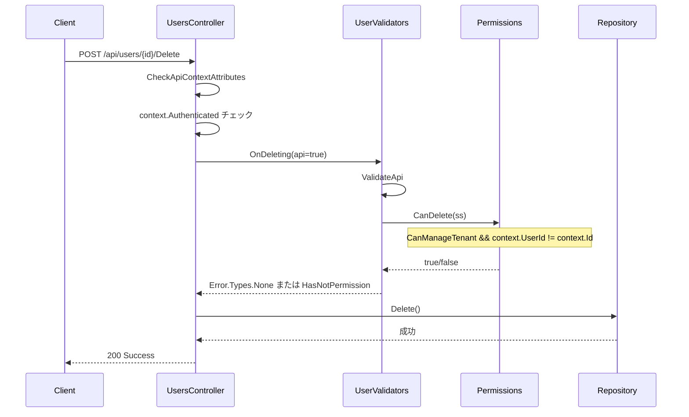

# テナント管理者による特権ユーザ削除制限

テナント管理者が特権ユーザを削除できないようにする機能の実装調査を行う。

<!-- START doctoc generated TOC please keep comment here to allow auto update -->
<!-- DON'T EDIT THIS SECTION, INSTEAD RE-RUN doctoc TO UPDATE -->

- [調査情報](#調査情報)
- [調査目的](#調査目的)
- [要件定義](#要件定義)
    - [現状の問題点](#現状の問題点)
    - [期待される動作](#期待される動作)
- [権限階層構造の理解](#権限階層構造の理解)
    - [特権ユーザ（PrivilegedUsers）とは](#特権ユーザprivilegedusersとは)
    - [TenantManager とは](#tenantmanager-とは)
- [現在のユーザ削除権限チェック](#現在のユーザ削除権限チェック)
    - [削除権限の判定ロジック](#削除権限の判定ロジック)
    - [削除処理のフロー](#削除処理のフロー)
- [実装方針](#実装方針)
    - [改修箇所](#改修箇所)
    - [実装案](#実装案)
    - [エラーメッセージの追加](#エラーメッセージの追加)
- [注意事項](#注意事項)
    - [SiteInfo.User の取得について](#siteinfouser-の取得について)
    - [UI と API の両方で機能させる](#ui-と-api-の両方で機能させる)
    - [既存のセルフチェック機能](#既存のセルフチェック機能)
- [実装手順](#実装手順)
    - [ステップ 1: CanDelete メソッドの改修](#ステップ-1-candelete-メソッドの改修)
    - [ステップ 2: エラーメッセージの追加（オプション）](#ステップ-2-エラーメッセージの追加オプション)
    - [ステップ 3: テスト](#ステップ-3-テスト)
- [まとめ](#まとめ)
- [関連ソースコード](#関連ソースコード)

<!-- END doctoc generated TOC please keep comment here to allow auto update -->

## 調査情報

| 調査日     | リポジトリ | ブランチ | タグ/バージョン    | コミット    | 備考 |
| ---------- | ---------- | -------- | ------------------ | ----------- | ---- |
| 2026-03-07 | Pleasanter | main     | Pleasanter_1.5.1.0 | `34f162a43` | -    |

## 調査目的

- テナント管理者が特権ユーザを削除できないようにする実装方法を調査する
- 特権ユーザ（PrivilegedUsers）の仕組みを理解する
- コード改修箇所を特定する

## 要件定義

ユーザ管理において、テナント管理者が特権ユーザ（PrivilegedUsers）を削除できないようにしたい。

### 現状の問題点

現在のプリザンターでは、テナント管理者（TenantManager）は以下の権限を持つ:

1. 同一テナント内のすべてのユーザを削除できる
2. 特権ユーザであっても削除可能
3. 自分自身の削除のみがブロックされている

特権ユーザは `Parameters.Security.PrivilegedUsers` で指定されたログイン ID を持つユーザで、すべてのアクセス制御をバイパスする最高権限を持つ。これらのユーザをテナント管理者が誤って削除できてしまうのは、セキュリティ上の問題がある。

### 期待される動作

- テナント管理者が特権ユーザを削除しようとした場合、エラーメッセージを表示して削除を拒否する
- 特権ユーザ自身（他の特権ユーザ）は削除可能とする
- UI（画面）と API の両方で同じ制限を適用する

## 権限階層構造の理解

プリザンターには以下の権限階層が存在する:

```
ServiceManager (最高)
  ↓
PrivilegedUsers (HasPrivilege - 完全なバイパス)
  ↓
TenantManager
  ↓
EnableManageTenant (委譲管理)
```

### 特権ユーザ（PrivilegedUsers）とは

**定義場所**: `Implem.ParameterAccessor/Parts/Security.cs`

```csharp
public class Security
{
    public List<string> PrivilegedUsers;
    // ...
}
```

**設定ファイル**: `App_Data/Parameters/Security.json`

```json
{
    "Security": {
        "PrivilegedUsers": ["admin", "system"]
    }
}
```

**判定メソッド**: `Implem.Pleasanter/Libraries/Security/Permissions.cs`

```csharp
// L861-865
public static bool PrivilegedUsers(string loginId)
{
    return loginId != null &&
        Parameters.Security.PrivilegedUsers?.Contains(loginId) == true;
}
```

**Context への反映**: `Implem.Pleasanter/Libraries/Requests/Context.cs`

```csharp
// L196
HasPrivilege = Permissions.PrivilegedUsers(User.LoginId);
```

### TenantManager とは

**データベースフラグ**: `Users.TenantManager` (bit 型)

**権限判定メソッド**: `Implem.Pleasanter/Libraries/Security/Permissions.cs`

```csharp
// L748-752
public static bool CanManageTenant(Context context)
{
    return context.User?.TenantManager == true
        || context.HasPrivilege;
}
```

特権ユーザは自動的にテナント管理者の権限も持つ。

## 現在のユーザ削除権限チェック

### 削除権限の判定ロジック

`Implem.Pleasanter/Libraries/Security/Permissions.cs`

```csharp
// L600-602
case "users":
    return CanManageTenant(context: context)
        && context.UserId != context.Id;
```

**現在の制限内容**:

1. `CanManageTenant(context)` が `true` であること
    - `User.TenantManager == true` または `HasPrivilege == true`
2. `context.UserId != context.Id` であること
    - 自分自身の削除は不可

**問題点**: 削除対象ユーザが特権ユーザかどうかのチェックが存在しない。

### 削除処理のフロー



## 実装方針

### 改修箇所

`Implem.Pleasanter/Libraries/Security/Permissions.cs` の `CanDelete` メソッド内で、削除対象ユーザが特権ユーザかどうかをチェックする。

### 実装案

#### 方針 1: CanDelete メソッドの改修（推奨）

`Permissions.cs` の `CanDelete` メソッドを改修して、削除対象ユーザが特権ユーザかどうかをチェックする。

**現在のコード** (`Permissions.cs` L600-602):

```csharp
case "users":
    return CanManageTenant(context: context)
        && context.UserId != context.Id;
```

**改修後のコード案**:

```csharp
case "users":
    // 削除対象ユーザの情報を取得
    var targetUser = SiteInfo.User(
        context: context,
        userId: context.Id);

    return CanManageTenant(context: context)
        && context.UserId != context.Id
        && (!PrivilegedUsers(loginId: targetUser?.LoginId)
            || context.HasPrivilege);
```

**ロジックの説明**:

1. `CanManageTenant` でテナント管理者または特権ユーザであることを確認
2. `context.UserId != context.Id` で自己削除を防止（既存のチェック）
3. `!PrivilegedUsers(loginId: targetUser?.LoginId) || context.HasPrivilege` で以下を制御:
    - 削除対象が特権ユーザでない場合: 削除可能
    - 削除対象が特権ユーザで、削除者も特権ユーザの場合: 削除可能
    - 削除対象が特権ユーザで、削除者が特権ユーザでない場合: 削除不可

#### 方針 2: UserValidators.OnDeleting メソッドの改修

`Implem.Pleasanter/Models/Users/UserValidators.cs` の `OnDeleting` メソッド内で、削除対象ユーザが特権ユーザかどうかをチェックする。

**実装箇所**: `UserValidators.cs` の `OnDeleting` メソッド

**追加コード案**:

```csharp
// CanDelete チェックの後に追加
if (!context.HasPrivilege)
{
    var targetUser = SiteInfo.User(
        context: context,
        userId: userModel.UserId);

    if (Permissions.PrivilegedUsers(loginId: targetUser?.LoginId))
    {
        return new ErrorData(type: Error.Types.HasNotPermission);
    }
}
```

**メリット・デメリット比較**:

| 方針                           | メリット                                                | デメリット                                      |
| ------------------------------ | ------------------------------------------------------- | ----------------------------------------------- |
| 方針 1: CanDelete 改修（推奨） | 権限チェックが集約される<br>UI/API で統一的に機能する   | SiteInfo.User の呼び出しでパフォーマンス影響    |
| 方針 2: OnDeleting 改修        | UserValidators 内で完結<br>ユーザ情報取得の最適化が可能 | UI/API の両方で OnDeleting が呼ばれることを前提 |

### エラーメッセージの追加

特権ユーザの削除を試みた場合に表示するエラーメッセージを追加する必要がある。

**追加箇所**: `Implem.DefinitionAccessor/Displays.json` または `Implem.DefinitionAccessor/Errors.json`

**エラー ID 案**: `Error.Types.CannotDeletePrivilegedUser`

**エラーメッセージ例**:

- 日本語: 「特権ユーザは削除できません。」
- 英語: "Cannot delete a privileged user."

## 注意事項

### SiteInfo.User の取得について

`SiteInfo.User()` はメモリキャッシュから情報を取得するため、パフォーマンスへの影響は最小限である。ただし、削除対象ユーザが存在しない場合は `null` が返されるため、null チェックが必要。

```csharp
var targetUser = SiteInfo.User(
    context: context,
    userId: context.Id);

if (targetUser != null && PrivilegedUsers(loginId: targetUser.LoginId))
{
    // 特権ユーザの場合の処理
}
```

### UI と API の両方で機能させる

- `CanDelete` は UI（画面）と API の両方で呼ばれるため、方針 1 を採用すれば自動的に両方で機能する
- `OnDeleting` も UI と API の両方で呼ばれるが、`api` パラメータで分岐している箇所があるため注意が必要

### 既存のセルフチェック機能

現在の実装では、自分自身の削除を防止するために `context.UserId != context.Id` がチェックされている。これは引き続き有効にする必要がある。

特権ユーザが自分自身を削除しようとした場合:

1. `context.UserId != context.Id` チェックで先にブロックされる（自己削除の防止）
2. 特権ユーザチェックには到達しない

これは意図した動作である。

## 実装手順

### ステップ 1: CanDelete メソッドの改修

`Implem.Pleasanter/Libraries/Security/Permissions.cs` の `CanDelete` メソッドを改修する。

```csharp
case "users":
    var targetUser = SiteInfo.User(
        context: context,
        userId: context.Id);

    return CanManageTenant(context: context)
        && context.UserId != context.Id
        && (!PrivilegedUsers(loginId: targetUser?.LoginId)
            || context.HasPrivilege);
```

### ステップ 2: エラーメッセージの追加（オプション）

より明確なエラーメッセージを表示したい場合は、専用のエラー型を追加する。

**`Implem.Libraries/Utilities/Error.cs` にエラー型を追加**:

```csharp
public enum Types
{
    // 既存のエラー型...
    CannotDeletePrivilegedUser = XXX,
}
```

**`Implem.DefinitionAccessor/Displays.json` にメッセージを追加**:

```json
{
    "CannotDeletePrivilegedUser": {
        "Ja": "特権ユーザは削除できません。",
        "En": "Cannot delete a privileged user."
    }
}
```

**`UserValidators.OnDeleting` で専用エラーを返す**:

```csharp
if (!context.HasPrivilege)
{
    var targetUser = SiteInfo.User(
        context: context,
        userId: userModel.UserId);

    if (Permissions.PrivilegedUsers(loginId: targetUser?.LoginId))
    {
        return new ErrorData(type: Error.Types.CannotDeletePrivilegedUser);
    }
}
```

### ステップ 3: テスト

以下のケースでテストを実施する:

1. テナント管理者が一般ユーザを削除できる（既存機能）
2. テナント管理者が特権ユーザを削除しようとするとエラーになる（新機能）
3. 特権ユーザが別の特権ユーザを削除できる（新機能）
4. 特権ユーザが自分自身を削除しようとするとエラーになる（既存機能）
5. API 経由でも同じ制限が適用される（新機能）

## まとめ

テナント管理者による特権ユーザの削除を防止するには、以下の改修を行う:

1. `Permissions.CanDelete` メソッドで削除対象ユーザが特権ユーザかどうかをチェック
2. 特権ユーザの削除は特権ユーザのみ許可する
3. エラーメッセージを追加して、削除が拒否された理由を明確にする

この改修により、特権ユーザの誤削除を防止し、セキュリティを向上させることができる。

## 関連ソースコード

| ファイル                                               | 概要                                 |
| ------------------------------------------------------ | ------------------------------------ |
| `Implem.Pleasanter/Libraries/Security/Permissions.cs`  | 権限チェックメソッド（CanDelete 等） |
| `Implem.Pleasanter/Models/Users/UserValidators.cs`     | ユーザ削除時のバリデーション         |
| `Implem.Pleasanter/Libraries/Requests/Context.cs`      | HasPrivilege の設定                  |
| `Implem.ParameterAccessor/Parts/Security.cs`           | PrivilegedUsers パラメータの定義     |
| `Implem.Pleasanter/Libraries/DataTypes/User.cs`        | User クラスの定義                    |
| `Implem.Pleasanter/Models/Sites/SiteInfo.cs`           | SiteInfo.User によるユーザ情報取得   |
| `Implem.Pleasanter/App_Data/Parameters/Security.json`  | PrivilegedUsers の設定ファイル       |
| `Implem.Pleasanter/Controllers/Api/UsersController.cs` | API エンドポイント定義               |
| `Implem.Pleasanter/Models/Users/UserUtilities.cs`      | DeleteByApi メソッド                 |
