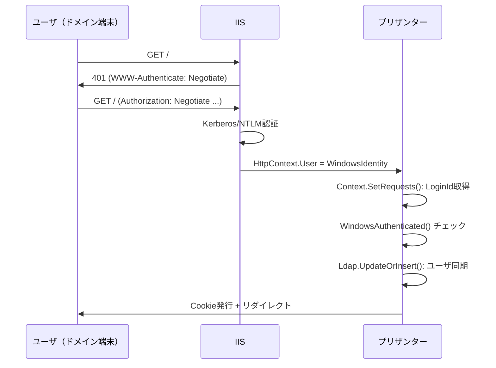
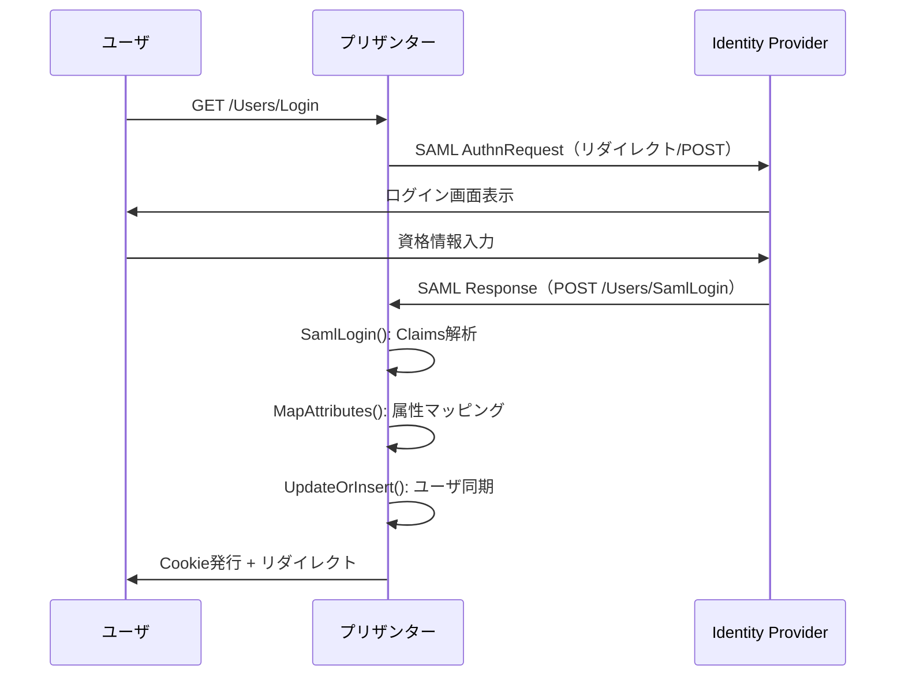

# プリザンター認証方式の実装詳細・フォールバック・2 段階認証

プリザンターが対応する全認証方式（組込認証・SAML・LDAP・Windows 認証）の実装詳細、プロバイダ間フォールバック、および 2 段階認証（メール / TOTP）の内部動作を調査した。

<!-- START doctoc generated TOC please keep comment here to allow auto update -->
<!-- DON'T EDIT THIS SECTION, INSTEAD RE-RUN doctoc TO UPDATE -->

- [調査情報](#調査情報)
- [調査目的](#調査目的)
- [認証方式の全体像](#認証方式の全体像)
    - [対応プロバイダ一覧](#対応プロバイダ一覧)
    - [パラメータクラス定義](#パラメータクラス定義)
- [認証フローの全体像](#認証フローの全体像)
    - [エントリポイント](#エントリポイント)
    - [認証判定フロー（UserModel.Authenticate — returnUrl 版）](#認証判定フローusermodelauthenticate--returnurl-版)
- [組込認証（ローカル DB 認証）](#組込認証ローカル-db-認証)
    - [概要](#概要)
    - [認証ロジック](#認証ロジック)
    - [ロックアウト処理](#ロックアウト処理)
- [LDAP 認証](#ldap-認証)
    - [概要](#概要-1)
    - [プラットフォーム分岐](#プラットフォーム分岐)
    - [Windows AD 実装（LdapDs）](#windows-ad-実装ldapds)
    - [Novell LDAP 実装（LdapNovellDs）](#novell-ldap-実装ldapnovellds)
    - [LDAP パラメータ](#ldap-パラメータ)
    - [LDAP ユーザ同期](#ldap-ユーザ同期)
- [Windows 認証](#windows-認証)
    - [概要](#概要-2)
    - [フォーム経由の認証（UserModel.Authenticate）](#フォーム経由の認証usermodelauthenticate)
    - [IIS レベルの SSO フロー](#iis-レベルの-sso-フロー)
    - [IIS 匿名認証と Windows 認証の併用](#iis-匿名認証と-windows-認証の併用)
    - [Windows SSO（パスワードレス）と LDAP+Local の比較](#windows-ssoパスワードレスと-ldaplocal-の比較)
    - [Windows 認証環境でのローカル専用ユーザの扱い](#windows-認証環境でのローカル専用ユーザの扱い)
    - [`"Windows+Local"` Provider の実現可能性](#windowslocal-provider-の実現可能性)
    - [組込認証との違い](#組込認証との違い)
    - [Windows 認証の検出](#windows-認証の検出)
- [SAML 認証](#saml-認証)
    - [概要](#概要-3)
    - [SAML 認証フロー](#saml-認証フロー)
    - [SamlLogin メソッド](#samllogin-メソッド)
    - [SAML 属性マッピング](#saml-属性マッピング)
    - [SAML パラメータ](#saml-パラメータ)
    - [シングルテナント vs マルチテナント SAML](#シングルテナント-vs-マルチテナント-saml)
    - [SAML 環境での組込認証](#saml-環境での組込認証)
- [プロバイダ間フォールバックロジック](#プロバイダ間フォールバックロジック)
    - [フォールバック全体像](#フォールバック全体像)
    - [LDAP+Local フォールバック](#ldaplocal-フォールバック)
    - [フォールバック一覧](#フォールバック一覧)
    - [LDAP の複数設定フォールバック](#ldap-の複数設定フォールバック)
- [2 段階認証](#2-段階認証)
    - [概要](#概要-4)
    - [パラメータ定義](#パラメータ定義)
    - [2 段階認証の有効判定](#2-段階認証の有効判定)
    - [2 段階認証のフロー](#2-段階認証のフロー)
    - [メール認証コード方式](#メール認証コード方式)
    - [TOTP 方式](#totp-方式)
    - [ユーザ側の 2 段階認証設定フィールド](#ユーザ側の-2-段階認証設定フィールド)
- [補助的な認証方式](#補助的な認証方式)
    - [TrustedProxy 認証](#trustedproxy-認証)
    - [Passkey 認証（WebAuthn）](#passkey-認証webauthn)
    - [Extension 認証](#extension-認証)
- [認証チケットの保存](#認証チケットの保存)
- [結論](#結論)
    - [認証方式の比較](#認証方式の比較)
    - [主要な設計上の特徴](#主要な設計上の特徴)
- [関連ソースコード](#関連ソースコード)
- [関連ドキュメント](#関連ドキュメント)

<!-- END doctoc generated TOC please keep comment here to allow auto update -->

## 調査情報

| 調査日     | リポジトリ | ブランチ | タグ/バージョン    | コミット      | 備考     |
| ---------- | ---------- | -------- | ------------------ | ------------- | -------- |
| 2026-03-18 | Pleasanter | main     | Pleasanter_1.5.2.0 | `46471ef5f18` | 初回調査 |

## 調査目的

- プリザンターが対応する認証方式（組込認証・SAML・LDAP・Windows 認証）の実装詳細を明らかにする
- 認証プロバイダ間のフォールバック（`LDAP+Local` 等）の挙動を把握する
- 2 段階認証（メール / TOTP）の内部動作とユーザ設定モデルを明らかにする
- 補助的な認証方式（TrustedProxy・Passkey・Extension）の位置づけを整理する

---

## 認証方式の全体像

### 対応プロバイダ一覧

`Authentication.json` の `Provider` 設定値により認証方式が決定される。

| Provider 値          | 認証方式                           | 実装クラス                                       |
| -------------------- | ---------------------------------- | ------------------------------------------------ |
| `null`（未指定）     | 組込認証（ローカル DB）            | `UserModel.GetByCredentials()`                   |
| `"LDAP"`             | LDAP 認証                          | `LdapDs` / `LdapNovellDs`                        |
| `"Windows"`          | Windows 統合認証（AD 経由）        | `LdapDs`                                         |
| `"LDAP+Local"`       | LDAP 認証 + 組込認証フォールバック | `LdapDs` / `LdapNovellDs` → `GetByCredentials()` |
| `"SAML"`             | SAML 認証（シングルテナント）      | `Saml` (Sustainsys.Saml2)                        |
| `"SAML-MultiTenant"` | SAML 認証（マルチテナント）        | `Saml` (Sustainsys.Saml2)                        |
| `"Extension"`        | 拡張認証（カスタム実装）           | `Extension`（未実装スタブ）                      |

> **設定ファイル**: `App_Data/Parameters/Authentication.json`

```json
{
    "Provider": null,
    "DsProvider": null,
    "ServiceId": null,
    "RejectUnregisteredUser": false,
    "LdapParameters": [ ... ],
    "SamlParameters": { ... },
    "TrustedProxyParameters": { "Enabled": false, "Header": "" }
}
```

> `Implem.Pleasanter/App_Data/Parameters/Authentication.json:1-99`

### パラメータクラス定義

```csharp
public class Authentication
{
    public string Provider;
    public string DsProvider;
    public string ServiceId;
    public string ExtensionUrl;
    public bool RejectUnregisteredUser;
    public Passkey PasskeyParameters;
    public List<Ldap> LdapParameters;
    public Saml SamlParameters;
    public TrustedProxy TrustedProxyParameters;
}
```

> `Implem.ParameterAccessor/Parts/Authentication.cs:4-15`

---

## 認証フローの全体像

### エントリポイント

認証のエントリポイントは `UsersController.Authenticate` アクション → `Authentications.SignIn()` → `UserModel.Authenticate()` の順で呼び出される。

```csharp
// UsersController.cs:405-419
public string Authenticate(string returnUrl, int isAuthenticationByMail = 0)
{
    var context = new Context();
    var log = new SysLogModel(context: context);
    var json = Authentications.SignIn(
        context: context,
        returnUrl: Url.IsLocalUrl(returnUrl) ? returnUrl : string.Empty,
        isAuthenticationByMail: Convert.ToBoolean(isAuthenticationByMail));
    log.Finish(context: context, responseSize: json.Length);
    return json;
}
```

> `Implem.Pleasanter/Controllers/UsersController.cs:405-419`

```csharp
// Authentications.cs:18-29
public static string SignIn(Context context, string returnUrl,
    bool isAuthenticationByMail = false, bool noHttpContext = false)
{
    return new UserModel(
        context: context,
        ss: SiteSettingsUtilities.UsersSiteSettings(context: context),
        formData: context.Forms)
            .Authenticate(
                context: context,
                returnUrl: returnUrl,
                noHttpContext: noHttpContext,
                isAuthenticationByMail: isAuthenticationByMail);
}
```

> `Implem.Pleasanter/Libraries/Security/Authentications.cs:18-29`

### 認証判定フロー（UserModel.Authenticate — returnUrl 版）

```mermaid
flowchart TD
    Start[ユーザがログインフォーム送信] --> ChkMail{SecondaryAuthentication<br/>NotificationType == Mail?}
    ChkMail -- Yes --> SetMail[isAuthenticationByMail = true]
    ChkMail -- No --> ChkDisabled
    SetMail --> ChkDisabled

    ChkDisabled{RevealUserDisabled &&<br/>DisabledUser?}
    ChkDisabled -- Yes --> Disabled[UserDisabled]
    ChkDisabled -- No --> ChkReject{RejectUnregisteredUser?}

    ChkReject -- Yes --> Deny1[Deny]
    ChkReject -- No --> AuthBool{Authenticate&#40;context&#41;<br/>= Provider別認証}

    AuthBool -- false --> ChkTenant{TenantOptions あり?}
    ChkTenant -- Yes --> TenantsDD[テナント選択表示]
    ChkTenant -- No --> Deny2[Deny]

    AuthBool -- true --> ChkExpired{LoginExpired?}
    ChkExpired -- Yes --> DenyExpired[DenyLoginExpired]
    ChkExpired -- No --> ChkIP{AllowedIpAddress?}

    ChkIP -- No --> InvalidIP[InvalidIpAddress]
    ChkIP -- Yes --> ChkLockout{Lockout?}

    ChkLockout -- Yes --> Lockout[UserLockout]
    ChkLockout -- No --> Chk2FA{EnabledSecondaryAuthentication?}

    Chk2FA -- Yes --> Handle2FA[2段階認証処理]
    Chk2FA -- No --> ChkPwExp{PasswordExpired?}

    ChkPwExp -- Yes --> ChangePW[パスワード変更ダイアログ]
    ChkPwExp -- No --> Allow[Allow → Cookie発行]
```



> `Implem.Pleasanter/Models/Users/UserModel.cs:4261-4344`

---

## 組込認証（ローカル DB 認証）

### 概要

`Provider` が `null`（未指定）またはデフォルトの場合、ローカル DB の Users テーブルに対してパスワード照合を行う。

### 認証ロジック

`UserModel.Authenticate(Context)` メソッドの `default` ケースで `GetByCredentials()` が呼ばれる。

```csharp
// UserModel.cs:4416-4422
default:
    authenticated = GetByCredentials(
        context: context,
        loginId: LoginId,
        password: Password,
        tenantId: context.Forms.Int("SelectedTenantId"));
    break;
```

> `Implem.Pleasanter/Models/Users/UserModel.cs:4416-4422`

`GetByCredentials()` は以下を行う：

1. `LoginId` と `Password`（ハッシュ化済み）で Users テーブルを検索
2. `Disabled = false` のユーザのみ対象
3. テナント ID でのフィルタリング（マルチテナント時）
4. 一致するレコードが見つかれば `true` を返す

### ロックアウト処理

認証結果に関わらず `UpdateLockout()` が呼ばれる。

```csharp
// UserModel.cs:4424-4428
UpdateLockout(
    context: context,
    loginId: LoginId,
    authenticated: authenticated);
return authenticated;
```

> `Implem.Pleasanter/Models/Users/UserModel.cs:4424-4428`

認証失敗時にロックアウトカウンタがインクリメントされ、閾値を超えると `Lockout = true` に設定される。

---

## LDAP 認証

### 概要

`Provider = "LDAP"` の場合、LDAP サーバに対して Bind 認証を行う。プラットフォームに応じて実装が自動切替される。

### プラットフォーム分岐

`Ldap.cs` がファサードとして機能し、`DsProvider` 設定値と OS を基に実装を選択する。

```csharp
// Ldap.cs:55-70
private static string Platform(Context context)
{
    switch (Parameters.Authentication.DsProvider)
    {
        case "Novell":
            return "others";
        default:
            if (Environment.OSVersion?.ToString().ToLower().Contains("windows") == true)
            {
                return "windows";
            }
            else
            {
                return "others";
            }
    }
}
```

> `Implem.Pleasanter/Libraries/DataSources/Ldap.cs:55-70`

| 条件                              | 使用クラス     | ライブラリ                 |
| --------------------------------- | -------------- | -------------------------- |
| `DsProvider = "Novell"`           | `LdapNovellDs` | `Novell.Directory.Ldap`    |
| Windows OS かつ DsProvider 未指定 | `LdapDs`       | `System.DirectoryServices` |
| その他（Linux 等）                | `LdapNovellDs` | `Novell.Directory.Ldap`    |

### Windows AD 実装（LdapDs）

```csharp
// LdapDs.cs:18-83 (要約)
public static bool Authenticate(Context context, string loginId, string password)
{
    foreach (var ldap in Parameters.Authentication.LdapParameters)
    {
        DirectorySearcher searcher;
        try
        {
            searcher = DirectorySearcher(
                loginId: ldap.LdapLoginPattern != null
                    ? ldap.LdapLoginPattern.Replace("{loginId}", loginId)
                    : loginId,
                password: password,
                ldap: ldap);
        }
        catch (DirectoryServicesCOMException e) { /* エラーログ */ return false; }

        searcher.Filter = ldap.LdapSearchPattern != null
            ? ldap.LdapSearchPattern.Replace("{loginId}", loginId)
            : $"({ldap.LdapSearchProperty}={loginId})";

        SearchResult result = searcher.FindOne();
        if (result != null)
        {
            UpdateOrInsert(context, result, ldap, DateTime.Now);
            return true;
        }
    }
    return false;
}
```

> `Implem.Pleasanter/Libraries/DataSources/LdapDs.cs:18-83`

**ポイント:**

- `LdapLoginPattern` で `{loginId}` プレースホルダを使用した DN テンプレートを指定可能
- `LdapSearchProperty` のデフォルトは `sAMAccountName`
- `DirectoryServicesCOMException` の `data 52e`（無効な資格情報）は `continue` で次の LDAP 設定を試行
- 認証成功時に `UpdateOrInsert()` でユーザ情報を自動同期（DeptCode, DeptName, UserCode, Name, MailAddress）

### Novell LDAP 実装（LdapNovellDs）

```csharp
// LdapNovellDs.cs:20-65 (要約)
public static bool Authenticate(Context context, string loginId, string password)
{
    foreach (var ldap in Parameters.Authentication.LdapParameters)
    {
        try
        {
            using (var con = LdapConnection(ldap.LdapSyncUser, ldap.LdapSyncPassword, ldap))
            {
                var entry = con.Search(
                    con.DN(ldap),
                    LdapConnection.ScopeSub,
                    $"({ldap.LdapSearchProperty}={loginId})",
                    null, false).FindOne();
                if (entry != null)
                {
                    con.Bind(entry.Dn, password);
                    UpdateOrInsert(context, entry, ldap, DateTime.Now);
                    return true;
                }
            }
        }
        catch (LdapException e) { /* data 52e チェック */ }
    }
    return false;
}
```

> `Implem.Pleasanter/Libraries/DataSources/LdapNovellDs.cs:20-65`

**ポイント:**

- サービスアカウント（`LdapSyncUser` / `LdapSyncPassword`）で初回接続し、ユーザ DN を検索
- 見つかったユーザ DN で `con.Bind(entry.Dn, password)` を実行して認証
- クロスプラットフォーム対応（Linux / macOS でも動作）

### LDAP パラメータ

```csharp
public class Ldap
{
    public string LdapSearchRoot;        // 検索ベースDN
    public string LdapLoginPattern;      // ログインDNテンプレート
    public string LdapSearchProperty;    // 検索属性（既定: sAMAccountName）
    public string LdapSearchPattern;     // カスタム検索フィルタ
    public string LdapAuthenticationType;// 認証タイプ
    public string NetBiosDomainName;     // NetBIOSドメイン名
    public int LdapTenantId;             // 紐付けテナントID
    public string LdapDeptCode;          // 部署コード属性
    public string LdapDeptName;          // 部署名属性
    public string LdapUserCode;          // ユーザコード属性
    public string LdapFirstName;         // 名前属性（既定: givenName）
    public string LdapLastName;          // 姓属性（既定: sn）
    public string LdapMailAddress;       // メールアドレス属性（既定: mail）
    public List<LdapExtendedAttribute> LdapExtendedAttributes; // 拡張属性
    public bool LdapExcludeAccountDisabled; // 無効アカウント除外
    public bool AutoDisable;             // 自動無効化
    public bool AutoEnable;              // 自動有効化
    public string LdapSyncUser;          // 同期用サービスアカウント
    public string LdapSyncPassword;      // 同期用パスワード
}
```

> `Implem.ParameterAccessor/Parts/Ldap.cs:4-37`

### LDAP ユーザ同期

認証成功時に自動で `UpdateOrInsert()` が呼ばれ、以下の情報が同期される。

| LDAP 属性                | Users テーブルカラム   | 備考                             |
| ------------------------ | ---------------------- | -------------------------------- |
| `sAMAccountName` 等      | `LoginId`              | 新規時のみ設定                   |
| `LdapDeptCode`           | `DeptId`（Depts 経由） | Depts テーブルも同時更新         |
| `LdapUserCode`           | `UserCode`             |                                  |
| `givenName` + `sn`       | `Name`                 | `LdapFirstName` + `LdapLastName` |
| `mail`                   | MailAddresses テーブル |                                  |
| `LdapExtendedAttributes` | 任意カラム             | 拡張属性マッピング               |

---

## Windows 認証

### 概要

`Provider = "Windows"` の場合、LDAP 認証と同じコードパスで処理される。Windows 認証は**IIS レベルの SSO フロー**と**フォーム経由のフロー**の 2 つの経路がある。

### フォーム経由の認証（UserModel.Authenticate）

ログインフォームから資格情報が送信された場合、`case "Windows":` は LDAP と同じコードパスを通る。

```csharp
// UserModel.cs:4354-4368
case "LDAP":
case "Windows":
    authenticated = Ldap.Authenticate(
        context: context,
        loginId: LoginId,
        password: context.Forms.Data("Users_Password"));
    if (authenticated)
    {
        Get(context: context,
            ss: SiteSettingsUtilities.UsersSiteSettings(context: context),
            where: Rds.UsersWhere().LoginId(
                value: context.Sqls.EscapeValue(LoginId),
                _operator: context.Sqls.LikeWithEscape));
    }
    break;
```

> `Implem.Pleasanter/Models/Users/UserModel.cs:4354-4368`

### IIS レベルの SSO フロー

IIS で Windows 認証が有効な場合、ブラウザと IIS 間で Negotiate/NTLM による透過的な認証が行われる。この場合、ユーザはログインフォームを経由せずに直接認証される。



ミドルウェアパイプライン内の `WindowsAuthenticated()` で IIS SSO を検出し、ユーザ同期とセッション作成を行う。

```csharp
// Startup.cs (SessionMiddleware内)
private static bool WindowsAuthenticated(Context context)
{
    return Authentications.Windows(context: context)
        && !context.LoginId.IsNullOrEmpty()
        && (!Parameters.Authentication.RejectUnregisteredUser
            || context.Authenticated);
}
```

> `Implem.Pleasanter/Startup.cs`

IIS SSO が成功した場合:

1. `context.LoginId` に Windows ユーザ名（`DOMAIN\username`）が設定される
2. `Ldap.UpdateOrInsert()` で AD 情報を Pleasanter に同期
3. Cookie が発行されセッションが開始される

### IIS 匿名認証と Windows 認証の併用

IIS で「Windows 認証」と「匿名認証」を両方有効にした場合の動作は以下の通り。

```mermaid
flowchart TD
    Start[ユーザがアクセス] --> IIS{IIS: Windows認証}
    IIS -- 成功: ドメインユーザ --> SSO[SSO: WindowsIdentity取得]
    SSO --> Sync[Ldap.UpdateOrInsert&#40;&#41;<br/>ユーザ同期 + Cookie発行]
    Sync --> Home[ホーム画面]

    IIS -- 失敗: ダイアログキャンセル等 --> Anon[匿名アクセス]
    Anon --> LoginPage[ログインフォーム表示]
    LoginPage --> Submit[資格情報入力・送信]
    Submit --> AuthSwitch{Provider = Windows}
    AuthSwitch --> LdapAuth[Ldap.Authenticate&#40;&#41;<br/>AD に対して認証]
    LdapAuth -- 成功 --> Allow[ログイン許可]
    LdapAuth -- 失敗 --> Deny[認証失敗<br/>ローカルDB認証は行われない]
```



> **重要**: IIS の匿名認証を有効にすると、Windows 認証に失敗したユーザがログインフォームに到達できるようになる。
> しかし、フォームから送信された資格情報は `Provider = "Windows"` → `case "Windows":` →
> **`Ldap.Authenticate()`（AD 認証）**を通るため、**ローカル DB への暗黙的なフォールバックは発生しない**。

| IIS 設定                    | Windows 認証成功時   | Windows 認証失敗時                          |
| --------------------------- | -------------------- | ------------------------------------------- |
| Windows 認証のみ            | SSO でログイン       | アクセス不可（401 エラー）                  |
| Windows 認証 + 匿名認証     | SSO でログイン       | ログインフォーム表示 → **AD 認証のみ**      |
| `LDAP+Local` + IIS 匿名認証 | ログインフォーム表示 | ログインフォーム表示 → **AD → ローカル DB** |

ローカル DB へのフォールバックが必要な場合は、`Provider = "LDAP+Local"` に変更し、LDAP 設定を AD に向ける必要がある。

### Windows SSO（パスワードレス）と LDAP+Local の比較

`Provider = "Windows"` は IIS レベルの Negotiate/NTLM によりログイン画面を経由しない SSO を実現する。
一方、`Provider = "LDAP+Local"` は常にログインフォームからの資格情報入力が必要であり、パスワードレス運用はできない。

| 項目                       | Windows（SSO）                                 | LDAP+Local                              |
| -------------------------- | ---------------------------------------------- | --------------------------------------- |
| 認証フロー                 | IIS が自動認証 → ログイン画面なし              | ログインフォームで資格情報を入力        |
| パスワードレス             | ○（ドメイン参加端末で透過的に認証）            | ×（常にパスワード入力が必要）           |
| エントリポイント           | ミドルウェア `WindowsAuthenticated()`          | `UserModel.Authenticate()` フォーム処理 |
| AD 認証                    | IIS Negotiate/NTLM                             | `Ldap.Authenticate()`（Bind 認証）      |
| ローカル DB フォールバック | ×                                              | ○（AD 失敗時に `GetByCredentials()`）   |
| IIS 要件                   | Windows 認証モジュール必須                     | 不要（クロスプラットフォーム対応）      |
| `"Windows+Local"` 相当     | **存在しない**（SSO + ローカル DB 両立は不可） | —                                       |

> **結論**: `Provider = "Windows"` の IIS SSO と `Provider = "LDAP+Local"` の
> ローカル DB フォールバックは排他的な機能であり、両方を同時に実現する `"Windows+Local"` 相当の
> Provider は存在しない。SSO が必要な場合は `"Windows"` を、ローカル DB フォールバックが必要な場合は
> `"LDAP+Local"` を選択する必要がある。

### Windows 認証環境でのローカル専用ユーザの扱い

`Provider = "Windows"` 環境では、AD に存在しないローカル専用ユーザ（管理者・特権ユーザ等）は
**認証手段がない**。

| シナリオ                     | ローカル専用ユーザのアクセス可否                            |
| ---------------------------- | ----------------------------------------------------------- |
| IIS: Windows 認証のみ        | × SSO 不可（AD に存在しない）、ログインフォームにも到達不可 |
| IIS: Windows 認証 + 匿名認証 | △ ログインフォームに到達可能だが、フォーム認証は AD のみ    |
| `LDAP+Local` に変更          | ○ AD 認証失敗後にローカル DB で認証可能（SSO は不可）       |

> **根拠**: `case "Windows":` は `case "LDAP":` と同じコードパスで `Ldap.Authenticate()` のみを呼ぶ。
> `LDAP+Local` のような `else { GetByCredentials() }` 分岐がないため、AD に存在しないユーザの
> ローカル DB 認証は行われない（`UserModel.cs:4354-4368`）。
> SAML 環境で提供される `AllowOriginalLogin`（テナント管理者向けローカル認証許可）に相当する
> 機構も Windows 認証には存在しない。

### `"Windows+Local"` Provider の実現可能性

現時点で `"Windows+Local"` という Provider 値は存在しない。
仮にこれを実装する場合、以下の 2 箇所の変更が必要となる。

**1. フォーム認証パス（`UserModel.Authenticate`）**

```csharp
// 現状: case "Windows": は case "LDAP": と同一
case "LDAP":
case "Windows":
    authenticated = Ldap.Authenticate(...);
    if (authenticated) { Get(...); }
    break;

// 追加案: case "Windows+Local":
case "Windows+Local":
    authenticated = Ldap.Authenticate(...);
    if (authenticated)
    {
        Get(...);
    }
    else
    {
        authenticated = GetByCredentials(...);  // ローカルDBフォールバック
    }
    break;
```

> `LDAP+Local` の既存パターンと同一構造。変更量は `UserModel.cs` の `switch` に 1 ケース追加。

**2. SSO パス（`WindowsAuthenticated()` ミドルウェア）**

```csharp
// 現状: Provider == "Windows" のみ SSO 有効
private static bool WindowsAuthenticated(Context context)
{
    return Authentications.Windows(context: context) ...;
}

// 変更案: "Windows+Local" でも SSO を有効化
public bool AuthenticationsWindows()
{
    if (Parameters.Authentication.Provider == "Windows"
        || Parameters.Authentication.Provider == "Windows+Local")  // 追加
    {
        return true;
    }
    return IdentityType?.Contains("Windows") ?? false;
}
```

> `AuthenticationsWindows()` の条件に `"Windows+Local"` を追加し、IIS SSO を維持。

**想定される動作フロー**:

```mermaid
flowchart TD
    Start[ユーザがアクセス] --> IIS{IIS: Windows認証}
    IIS -- 成功: ドメインユーザ --> SSO[SSO: WindowsAuthenticated&#40;&#41;<br/>Ldap.UpdateOrInsert&#40;&#41; + Cookie発行]
    SSO --> Home[ホーム画面]

    IIS -- 失敗: ダイアログキャンセル等 --> Anon[匿名アクセス]
    Anon --> LoginPage[ログインフォーム表示]
    LoginPage --> Submit[資格情報入力・送信]
    Submit --> AD{Ldap.Authenticate&#40;&#41;}
    AD -- 成功 --> Allow[ログイン許可]
    AD -- 失敗 --> Local{GetByCredentials&#40;&#41;<br/>ローカルDB認証}
    Local -- 成功 --> Allow2[ログイン許可]
    Local -- 失敗 --> Deny[認証失敗]
```



**影響範囲の評価**:

| 項目             | 評価                                                                                         |
| ---------------- | -------------------------------------------------------------------------------------------- |
| 変更ファイル数   | 2〜3 ファイル（`UserModel.cs`, `Context.cs`, `Authentication.cs`）                           |
| 既存動作への影響 | なし（新規 case 追加のみ、既存 case は変更しない）                                           |
| テスト観点       | SSO 成功 → AD 同期、フォーム → AD 成功、フォーム → AD 失敗 → ローカル DB 成功/失敗           |
| リスク           | IIS 匿名認証を有効にする必要があるため、SSO 失敗時のセキュリティポリシーとの整合性確認が必要 |

### 組込認証との違い

| 項目            | Windows 認証                          | 組込認証             |
| --------------- | ------------------------------------- | -------------------- |
| 認証先          | Active Directory（LDAP 経由）         | ローカル DB          |
| パスワード管理  | AD 側で管理                           | Users テーブルに保存 |
| ユーザ同期      | 認証成功時に自動同期                  | なし（手動登録）     |
| Windows OS 依存 | LdapDs は Windows 専用                | OS 非依存            |
| IIS SSO 対応    | ○（WindowsAuthenticated で自動検出）  | ×                    |
| フォールバック  | なし（`"LDAP"` / `"Windows"` の場合） | —                    |

### Windows 認証の検出

```csharp
// Context.cs:1237-1244
public bool AuthenticationsWindows()
{
    if (Parameters.Authentication.Provider == "Windows")
    {
        return true;
    }
    return IdentityType?.Contains("Windows") ?? false;
}
```

> `Implem.Pleasanter/Libraries/Requests/Context.cs:1237-1244`

`AuthenticationsWindows()` は以下のいずれかの条件で `true` を返す:

1. `Parameters.Authentication.Provider` が `"Windows"` に設定されている場合（設定ベース）
2. `IdentityType`（`HttpContext.User.Identity.GetType().Name`）が `"Windows"` を含む場合（IIS ベース）

---

## SAML 認証

### 概要

`Provider = "SAML"` または `"SAML-MultiTenant"` の場合、Sustainsys.Saml2 ライブラリを使用した SAML 2.0 認証を行う。

### SAML 認証フロー



### SamlLogin メソッド

```csharp
// Saml.cs:571-680 (要約)
public static (string redirectResultUrl, string html) SamlLogin(
    Context context, string returnUrl = "")
{
    // 1. SAML認証済みかチェック
    if (!Authentications.SAML()
        || context.AuthenticationType != "Federation"
        || context.IsAuthenticated != true)
    {
        return (Responses.Locations.SamlLoginFailed(context), null);
    }

    // 2. 既存セッションをクリア
    Authentications.SignOut(context);

    // 3. Claims からユーザ情報取得
    var loginId = context.UserClaims?.FirstOrDefault(
        claim => claim.Type == ClaimTypes.NameIdentifier);
    var attributes = Saml.MapAttributes(context.UserClaims, loginId.Value);

    // 4. テナント解決（SAML / SAML-MultiTenant で分岐）
    TenantModel tenant;
    if (Parameters.Authentication.Provider == "SAML-MultiTenant")
    {
        var ssocode = loginId.Issuer.TrimEnd('/').Substring(...);
        tenant = new TenantModel().Get(..., where: Rds.TenantsWhere().Comments(ssocode));
    }
    else
    {
        tenant = new TenantModel().Get(...,
            where: Rds.TenantsWhere().TenantId(Parameters.Authentication.SamlParameters.SamlTenantId));
    }

    // 5. 未登録ユーザ拒否（設定による）
    if (Parameters.Authentication.RejectUnregisteredUser) { ... }

    // 6. ユーザ情報の同期
    Saml.UpdateOrInsert(context, tenant.TenantId, loginId.Value, name, ...);

    // 7. Cookie発行
    var userModel = new UserModel().Get(...);
    context.LoginId = userModel.LoginId;
    var redirectResultUrl = userModel.AllowAfterUrl(context, returnUrl, ...);
    return (redirectResultUrl, null);
}
```

> `Implem.Pleasanter/Libraries/DataSources/Saml.cs:571-680`

### SAML 属性マッピング

`MapAttributes()` メソッドで SAML Claims をプリザンターのユーザ属性にマッピングする。

```csharp
// Saml.cs:32-77 (要約)
public static SamlAttributes MapAttributes(IEnumerable<Claim> claims, string nameId)
{
    var attributes = new SamlAttributes();
    var attributeMailAddress = Parameters.Authentication?.SamlParameters?.Attributes?["MailAddress"];

    // MailAddress: {NameId} プレースホルダ対応
    if (attributeMailAddress == "{NameId}")
    {
        attributes.Add("MailAddress", nameId);
    }
    else if (attributeMailAddress?.EndsWith("|{NameId}") == true)
    {
        // Claim値優先、なければNameIdにフォールバック
        var claimMailAddress = claims.FirstOrDefault(claim => claim.Type == attributeName);
        attributes.Add("MailAddress", claimMailAddress?.Value ?? nameId);
    }
    // ... 他の属性マッピング
}
```

> `Implem.Pleasanter/Libraries/DataSources/Saml.cs:32-77`

**マッピング対応表:**

| Authentication.json キー | マッピング先              | 備考                               |
| ------------------------ | ------------------------- | ---------------------------------- |
| `Name`                   | `UserModel.Name`          |                                    |
| `UserCode`               | `UserModel.UserCode`      |                                    |
| `Birthday`               | `UserModel.Birthday`      |                                    |
| `Gender`                 | `UserModel.Gender`        |                                    |
| `Language`               | `UserModel.Language`      |                                    |
| `TimeZone`               | `UserModel.TimeZone`      |                                    |
| `TenantManager`          | `UserModel.TenantManager` | テナント管理者フラグ               |
| `DeptCode`               | `Depts.DeptCode`          | 部署テーブル経由で `DeptId` に変換 |
| `Dept`                   | `Depts.DeptName`          |                                    |
| `Body`                   | `UserModel.Body`          |                                    |
| `MailAddress`            | MailAddresses テーブル    | `{NameId}` プレースホルダ対応      |

### SAML パラメータ

```json
{
    "SamlParameters": {
        "Attributes": { "Name": "Name", "MailAddress": "{NameId}", ... },
        "SamlTenantId": 1,
        "DisableOverwriteName": false,
        "NotCreatePersistentCookie": false,
        "SPOptions": {
            "EntityId": "http://localhost:59802/Saml2",
            "ReturnUrl": "http://localhost:59802/Users/SamlLogin",
            "AuthenticateRequestSigningBehavior": "IfIdpWantAuthnRequestsSigned",
            "OutboundSigningAlgorithm": "http://www.w3.org/2001/04/xmldsig-more#rsa-sha256"
        },
        "IdentityProviders": [
            {
                "EntityId": null,
                "SignOnUrl": null,
                "AllowUnsolicitedAuthnResponse": true,
                "Binding": "HttpPost",
                "LoadMetadata": false
            }
        ]
    }
}
```

> `Implem.Pleasanter/App_Data/Parameters/Authentication.json:48-94`

### シングルテナント vs マルチテナント SAML

| 項目             | `"SAML"`                            | `"SAML-MultiTenant"`                            |
| ---------------- | ----------------------------------- | ----------------------------------------------- |
| テナント解決     | `SamlTenantId` 固定値               | IdP Issuer URL から SSO コードを抽出            |
| SSO コード       | 不使用                              | `Tenants.Comments` と照合                       |
| テナント自動作成 | `SamlTenantId` が存在しなければ作成 | なし（事前登録必須）                            |
| IdP キャッシュ   | `Authentication.json` の静的設定    | DB 保存メタデータを `IdpCache` にキャッシュ     |
| ログイン URL     | `/Users/Login` → IdP へリダイレクト | `/Users/Login?ssocode=xxx` → IdP へリダイレクト |

### SAML 環境での組込認証

`Provider = "SAML"` の場合でも、`Authenticate(Context)` 内で `GetByCredentials()` が呼ばれるが、`AllowOriginalLogin` 設定で制限される。

```csharp
// UserModel.cs:4400-4414
case "SAML":
case "SAML-MultiTenant":
    authenticated = GetByCredentials(
        context: context,
        loginId: LoginId,
        password: Password,
        tenantId: context.Forms.Int("SelectedTenantId"));
    if (authenticated)
    {
        context = new Context(tenantId: TenantId);
        if (context.ContractSettings?.AllowOriginalLogin == 0 && TenantManager == false)
        {
            authenticated = false;
        }
    }
    break;
```

> `Implem.Pleasanter/Models/Users/UserModel.cs:4400-4414`

**`AllowOriginalLogin` のロジック:**

- `AllowOriginalLogin == 0` かつ `TenantManager == false` → 組込認証を拒否
- `TenantManager == true` のユーザは常に組込認証を利用可能（管理者用フォールバック）

---

## プロバイダ間フォールバックロジック

### フォールバック全体像

```mermaid
flowchart TD
    Start[Authenticate&#40;context&#41;] --> Switch{Provider 設定値}

    Switch -- "LDAP / Windows" --> LDAP1[Ldap.Authenticate&#40;&#41;]
    LDAP1 -- 成功 --> GetUser1[Users テーブルから取得]
    LDAP1 -- 失敗 --> End1[認証失敗]

    Switch -- "LDAP+Local" --> LDAP2[Ldap.Authenticate&#40;&#41;]
    LDAP2 -- 成功 --> GetUser2[Users テーブルから取得]
    LDAP2 -- 失敗 --> Fallback[GetByCredentials&#40;&#41;<br/>ローカルDB認証]
    Fallback -- 成功/失敗 --> End2[結果返却]

    Switch -- "Extension" --> Ext[Extension.Authenticate&#40;&#41;]
    Ext --> End3[NotImplementedException]

    Switch -- "SAML / SAML-MultiTenant" --> Local[GetByCredentials&#40;&#41;]
    Local -- 成功 --> ChkOriginal{AllowOriginalLogin == 0<br/>かつ TenantManager == false?}
    ChkOriginal -- Yes --> End4[認証失敗]
    ChkOriginal -- No --> End5[認証成功]
    Local -- 失敗 --> End6[認証失敗]

    Switch -- "default &#40;null&#41;" --> Default[GetByCredentials&#40;&#41;<br/>ローカルDB認証]
    Default --> End7[結果返却]
```



> `Implem.Pleasanter/Models/Users/UserModel.cs:4349-4429`

### LDAP+Local フォールバック

`Provider = "LDAP+Local"` は唯一の明示的フォールバック構成。LDAP 認証失敗時にローカル DB 認証にフォールバックする。

```csharp
// UserModel.cs:4370-4392
case "LDAP+Local":
    authenticated = Ldap.Authenticate(
        context: context,
        loginId: LoginId,
        password: context.Forms.Data("Users_Password"));
    if (authenticated)
    {
        Get(context: context, ...);
    }
    else
    {
        // LDAP失敗 → ローカルDB認証にフォールバック
        authenticated = GetByCredentials(
            context: context,
            loginId: LoginId,
            password: Password,
            tenantId: context.Forms.Int("SelectedTenantId"));
    }
    break;
```

> `Implem.Pleasanter/Models/Users/UserModel.cs:4370-4392`

### フォールバック一覧

| Provider             | 第 1 認証   | 第 2 認証（フォールバック）       | 備考                                                                                             |
| -------------------- | ----------- | --------------------------------- | ------------------------------------------------------------------------------------------------ |
| `null`（デフォルト） | ローカル DB | なし                              |                                                                                                  |
| `"LDAP"`             | LDAP        | なし                              | LDAP 失敗 = 認証失敗                                                                             |
| `"Windows"`          | LDAP（AD）  | なし                              | IIS 匿名認証併用時もローカル DB フォールバックなし（[詳細](#iis-匿名認証と-windows-認証の併用)） |
| `"LDAP+Local"`       | LDAP        | ローカル DB                       | **唯一の明示的フォールバック**                                                                   |
| `"SAML"`             | ローカル DB | なし（AllowOriginalLogin で制限） | SAML 認証自体は SamlLogin で別フロー                                                             |
| `"SAML-MultiTenant"` | ローカル DB | なし（AllowOriginalLogin で制限） | 同上                                                                                             |
| `"Extension"`        | カスタム    | なし                              | 未実装（NotImplementedException）                                                                |

> **注意**: `Provider = "Windows"` で IIS の匿名認証を併用した場合、Windows 認証失敗時にログインフォームに
> 到達できるが、フォームから送信された資格情報は AD に対して認証される。ローカル DB 認証にはフォールバック
> しない。AD 認証 + ローカル DB フォールバックが必要な場合は `Provider = "LDAP+Local"` を使用する。

### LDAP の複数設定フォールバック

`LdapParameters` は配列で複数の LDAP 設定を保持可能。`foreach` で順に試行し、1 つでも成功すれば認証成功となる。

```csharp
// LdapDs.cs:20-82 (抜粋)
foreach (var ldap in Parameters.Authentication.LdapParameters)
{
    // ... 各LDAP設定で認証試行
    // DirectoryServicesCOMException "data 52e" は continue で次の設定を試行
    if (result != null)
    {
        UpdateOrInsert(context, result, ldap, DateTime.Now);
        return true;
    }
}
return false;
```

> `Implem.Pleasanter/Libraries/DataSources/LdapDs.cs:20-82`

---

## 2 段階認証

### 概要

プリザンターは 2 段階認証（Secondary Authentication）として**メール認証コード**と **TOTP（Time-based One-Time Password）**の 2 方式を提供する。

### パラメータ定義

```csharp
public class SecondaryAuthentication
{
    public enum SecondaryAuthenticationMode
    {
        None,           // 無効
        DefaultEnable,  // デフォルト有効（ユーザが無効化可能）
        DefaultDisable  // デフォルト無効（ユーザが有効化可能）
    }

    public enum SecondaryAuthenticationModeNotificationTypes
    {
        Mail,  // メールで認証コード送信
        Totp   // TOTP（認証アプリ）
    }

    public SecondaryAuthenticationMode Mode;
    public SecondaryAuthenticationModeNotificationTypes NotificationType;
    public double? CountTolerances;                  // TOTP時間ステップ許容数
    public bool NotificationMailBcc;                 // BCC送信
    public string AuthenticationCodeCharacterType;   // コード文字種（Number/Letter/NumberAndLetter）
    public int? AuthenticationCodeLength;             // コード桁数
    public int? AuthenticationCodeExpirationPeriod;   // コード有効期間（秒）
}
```

> `Implem.ParameterAccessor/Parts/SecondaryAuthentication.cs:1-24`

### 2 段階認証の有効判定

```csharp
// UserModel.cs:5295-5338 (要約)
private bool EnabledSecondaryAuthentication(Context context)
{
    switch (Parameters.Security.SecondaryAuthentication?.Mode)
    {
        case SecondaryAuthenticationMode.None:
            return false;
        case SecondaryAuthenticationMode.DefaultEnable:
            if (DisableSecondaryAuthentication)  // ユーザが無効化している場合
                return false;
            break;
        case SecondaryAuthenticationMode.DefaultDisable:
            if (!EnableSecondaryAuthentication)  // ユーザが有効化していない場合
                return false;
            break;
        default:
            return false;
    }
    // 拡張SQL（OnUseSecondaryAuthentication）による追加条件判定
    var statements = new List<SqlStatement>()
        .OnUseSecondaryAuthentication(context).ToArray();
    if (!(statements?.Any() == true))
        return true;
    // ... SQL実行による条件判定
}
```

> `Implem.Pleasanter/Models/Users/UserModel.cs:5295-5338`

### 2 段階認証のフロー

```mermaid
flowchart TD
    Auth[第1段階認証成功] --> Chk2FA{EnabledSecondaryAuthentication?}
    Chk2FA -- No --> Allow[ログイン許可]
    Chk2FA -- Yes --> ChkCode{SecondaryAuthenticationCode<br/>がフォームにある?}

    ChkCode -- No: 初回表示 --> ChkTotp{TOTP SecretKey 登録済み?}
    ChkTotp -- No: TOTP未登録 --> Register[TOTP登録画面<br/>QRコード表示]
    ChkTotp -- Yes: 登録済み --> Open2FA[2段階認証入力画面]

    ChkCode -- Yes: コード送信済み --> Verify{コード検証}

    subgraph メール認証
        VerifyMail{Code一致 &&<br/>有効期限内?}
    end

    subgraph TOTP認証
        VerifyTotp{VerifyTotp&#40;&#41;<br/>OtpNet.Totp}
    end

    Verify --> VerifyMail
    Verify --> VerifyTotp
    VerifyMail -- 成功 --> PostAuth[HandlePostSecondaryAuthentication]
    VerifyMail -- 失敗 --> Retry[再入力要求]
    VerifyTotp -- 成功 --> PostAuth
    VerifyTotp -- 失敗 --> Retry

    PostAuth --> Allow2[ログイン許可]
```



### メール認証コード方式

`NotificationType = Mail` の場合、サーバがランダムコードを生成してメール送信する。

```csharp
// UserModel.cs:4291-4300 (抜粋)
return string.IsNullOrEmpty(secondaryAuthenticationCode)
    ? !EnableSecretKey && !isAuthenticationByMail
        ? OpenTotpRegisterCode(context)              // TOTP未登録時: 登録画面
        : OpenSecondaryAuthentication(context, ...)  // コード送信＋入力画面
    : !SecondaryAuthentication(context, secondaryAuthenticationCode, isAuthenticationByMail)
        ? Messages.ResponseSecondaryAuthentication(context, ...).ToJson()  // 失敗メッセージ
        : HandlePostSecondaryAuthentication(context, ...);                 // 成功処理
```

> `Implem.Pleasanter/Models/Users/UserModel.cs:4291-4315`

**メールコード検証:**

```csharp
// UserModel.cs:5343-5349
private bool SecondaryAuthentication(
    Context context, string secondaryAuthenticationCode, bool isAuthenticationByMail)
{
    return isAuthenticationByMail
        ? SecondaryAuthenticationCode == secondaryAuthenticationCode
            && SecondaryAuthenticationCodeExpirationTime.Value.InRange()
            && SecondaryAuthenticationCodeExpirationTime.Value > DateTime.Now
        : VerifyTotp(secondaryAuthenticationCode);
}
```

> `Implem.Pleasanter/Models/Users/UserModel.cs:5343-5349`

- `SecondaryAuthenticationCode`: DB に保存された一時コード
- `SecondaryAuthenticationCodeExpirationTime`: 有効期限（`AuthenticationCodeExpirationPeriod` 秒後）
- コード文字種: `AuthenticationCodeCharacterType`（`Number` / `Letter` / `NumberAndLetter`）

### TOTP 方式

`NotificationType = Totp` の場合、OtpNet ライブラリを使用した TOTP 検証を行う。

```csharp
// UserModel.cs:5355-5366
private bool VerifyTotp(string secondaryAuthenticationCode, double countTolerances = 0)
{
    OtpNet.Totp totp = new OtpNet.Totp(
        OtpNet.Base32Encoding.ToBytes(SecretKey), totpSize: 6);
    var beforeTime = countTolerances * -30;
    return countTolerances >= Parameters.Security.SecondaryAuthentication.CountTolerances
        ? false
        : totp.VerifyTotp(
            DateTime.UtcNow.AddSeconds((double)beforeTime),
            secondaryAuthenticationCode, out _,
            OtpNet.VerificationWindow.RfcSpecifiedNetworkDelay)
                ? true
                : VerifyTotp(secondaryAuthenticationCode, countTolerances + 1);
}
```

> `Implem.Pleasanter/Models/Users/UserModel.cs:5355-5366`

**TOTP 実装の特徴:**

| 項目           | 値 / 動作                                          |
| -------------- | -------------------------------------------------- |
| コード桁数     | 6 桁固定（`totpSize: 6`）                          |
| 時間ステップ   | 30 秒（OtpNet 標準）                               |
| 時間許容       | `CountTolerances` 回分の過去ステップも検証         |
| 検証方式       | 再帰呼出で `countTolerances` をインクリメント      |
| 検証ウィンドウ | `RfcSpecifiedNetworkDelay`（RFC 6238 準拠）        |
| SecretKey 保存 | `Users.SecretKey` カラムに Base32 エンコードで保存 |
| QR コード生成  | `OpenTotpRegisterCode()` で登録画面を表示          |

### ユーザ側の 2 段階認証設定フィールド

| Users カラム                                | 型         | 説明                                       |
| ------------------------------------------- | ---------- | ------------------------------------------ |
| `EnableSecondaryAuthentication`             | `bit`      | ユーザが 2FA を有効化（DefaultDisable 時） |
| `DisableSecondaryAuthentication`            | `bit`      | ユーザが 2FA を無効化（DefaultEnable 時）  |
| `SecondaryAuthenticationCode`               | `nvarchar` | メール認証コード（一時保存）               |
| `SecondaryAuthenticationCodeExpirationTime` | `datetime` | コード有効期限                             |
| `SecretKey`                                 | `nvarchar` | TOTP 用 Base32 シークレットキー            |

---

## 補助的な認証方式

### TrustedProxy 認証

リバースプロキシからのヘッダに基づくユーザ認証。

```csharp
// TrustedProxyAuthenticationMiddleware.cs:23-95 (要約)
public async Task InvokeAsync(HttpContext httpContext)
{
    var header = Strings.CoalesceEmpty(
        Environment.GetEnvironmentVariable("TRUSTED_PROXY_AUTH_HEADER"),
        Parameters.Authentication.TrustedProxyParameters?.Header ?? string.Empty);

    // ヘッダ未設定 or 認証済み → スキップ
    if (string.IsNullOrEmpty(header)) { await next(httpContext); return; }
    if (httpContext.User?.Identity?.IsAuthenticated == true) { await next(httpContext); return; }

    // プロキシ元IPの信頼検証
    if (!IsTrustedProxy(httpContext, out var trustReason)) { await next(httpContext); return; }

    // ヘッダからユーザ名取得 → DBユーザ照合
    var proxyUser = httpContext.Request.Headers[header].FirstOrDefault();
    var userModel = new UserModel().Get(...,
        where: Rds.UsersWhere().LoginId(proxyUser).Disabled(false).Lockout(false));

    // ClaimsIdentity作成 → Cookie発行
    var identity = new ClaimsIdentity(claims, "TrustedProxy");
    await httpContext.SignInAsync(CookieAuthenticationDefaults.AuthenticationScheme, principal, properties);
}
```

> `Implem.Pleasanter/Middlewares/TrustedProxyAuthenticationMiddleware.cs:23-95`

**特徴:**

- `KnownNetworks` / `KnownProxies` で信頼するプロキシ IP を制限
- IP 未設定時はすべてのプロキシを信頼（開発環境向け）
- `X-Original-For` ヘッダ → `RemoteIpAddress` の順で IP 解決
- 認証スキーム名: `"TrustedProxy"`

### Passkey 認証（WebAuthn）

FIDO2 / WebAuthn に基づくパスワードレス認証。

```csharp
public class Passkey
{
    public bool Enabled;
    public string ServerDomain;
    public string ServerName;
    public HashSet<string> Origins;
}
```

> `Implem.ParameterAccessor/Parts/Passkey.cs:9-15`

- `PasskeysController` / `PasskeyModel` / `PasskeyUtilities` で実装
- `isAuthenticationByPasskey = true` の場合、パスワード認証をスキップして直接認証成功判定

### Extension 認証

カスタム認証プロバイダ用の拡張ポイント。現在は未実装スタブ。

```csharp
// Extension.cs:19-26
public static bool Authenticate(
    Context context, string loginId, string password, UserModel userModel)
{
    throw new NotImplementedException();
}
```

> `Implem.Pleasanter/Libraries/DataSources/Extension.cs:19-26`

---

## 認証チケットの保存

認証成功後の Cookie チケットは `AuthenticationTicketStore` でセッションストアに保存される。

```csharp
// AuthenticationTicketStore.cs:18-72 (要約)
public class AuthenticationTicketStore : ITicketStore
{
    private static readonly string sessionKey = "AuthenticationTicket";

    public Task<string> StoreAsync(AuthenticationTicket ticket)
    {
        var guid = Strings.NewGuid();
        var serializedTicket = TicketSerializer.Default.Serialize(ticket);
        SessionUtilities.Set(context, sessionKey, Convert.ToBase64String(serializedTicket), guid);
        return Task.FromResult(guid);
    }

    public Task RemoveAsync(string key)
    {
        SessionUtilities.Remove(context, sessionKey, page: false, sessionGuid: key);
        if (Parameters.Session.UseKeyValueStore)
        {
            CacheForRedisConnection.Clear(key);  // Redis利用時はRedisからも削除
        }
        return Task.CompletedTask;
    }
}
```

> `Implem.Pleasanter/Libraries/Security/AuthenticationTicketStore.cs:12-73`

---

## 結論

### 認証方式の比較

| 認証方式         | 認証先           | ユーザ自動同期   | フォールバック             | 2 段階認証対応                | 設定値               |
| ---------------- | ---------------- | ---------------- | -------------------------- | ----------------------------- | -------------------- |
| 組込認証         | ローカル DB      | なし             | —                          | ○                             | `null`（デフォルト） |
| LDAP             | LDAP サーバ      | ○                | なし                       | ○                             | `"LDAP"`             |
| Windows          | Active Directory | ○                | なし                       | ○                             | `"Windows"`          |
| LDAP+Local       | LDAP → DB        | ○（LDAP 成功時） | ローカル DB                | ○                             | `"LDAP+Local"`       |
| SAML             | 外部 IdP         | ○                | 組込（AllowOriginalLogin） | △（SamlLogin 経由では未対応） | `"SAML"`             |
| SAML-MultiTenant | 外部 IdP         | ○                | 組込（AllowOriginalLogin） | △                             | `"SAML-MultiTenant"` |
| TrustedProxy     | プロキシヘッダ   | なし             | —                          | ×                             | Middleware           |
| Passkey          | WebAuthn         | なし             | —                          | ×                             | `PasskeyParameters`  |
| Extension        | カスタム         | —                | —                          | —                             | `"Extension"`        |

### 主要な設計上の特徴

1. **シングルプロバイダ設計**: `Authentication.Provider` は 1 つの値しか設定できないため、同時に複数の認証方式を有効にすることは原則不可
2. **`LDAP+Local` が唯一の明示的フォールバック**: LDAP 認証失敗時のみローカル DB 認証にフォールバックする仕組みが存在
3. **SAML の特殊なフォールバック**: SAML 環境でも `AllowOriginalLogin` と `TenantManager` フラグにより組込認証が利用可能
4. **LDAP の複数設定**: `LdapParameters` 配列により複数の LDAP サーバを順次試行可能
5. **2 段階認証は第 1 段階認証の後に適用**: Provider による認証成功後に 2FA チェックが行われるため、全プロバイダで利用可能（ただし SAML の SamlLogin 経路は別フロー）
6. **認証チケットはセッションストア**: DB または Redis に保存され、Cookie にはセッション ID のみ格納

## 関連ソースコード

| ファイル                                                                | 概要                                    |
| ----------------------------------------------------------------------- | --------------------------------------- |
| `Implem.Pleasanter/Libraries/Security/Authentications.cs`               | 認証エントリポイント                    |
| `Implem.Pleasanter/Models/Users/UserModel.cs:4261-4429`                 | 認証判定・プロバイダ切替ロジック        |
| `Implem.Pleasanter/Models/Users/UserModel.cs:5295-5366`                 | 2 段階認証・TOTP 検証                   |
| `Implem.Pleasanter/Libraries/DataSources/Ldap.cs`                       | LDAP ファサード（プラットフォーム分岐） |
| `Implem.Pleasanter/Libraries/DataSources/LdapDs.cs`                     | Windows AD LDAP 実装                    |
| `Implem.Pleasanter/Libraries/DataSources/LdapNovellDs.cs`               | Novell LDAP 実装                        |
| `Implem.Pleasanter/Libraries/DataSources/Saml.cs`                       | SAML 認証実装                           |
| `Implem.Pleasanter/Libraries/DataSources/Extension.cs`                  | 拡張認証スタブ                          |
| `Implem.Pleasanter/Middlewares/TrustedProxyAuthenticationMiddleware.cs` | TrustedProxy 認証                       |
| `Implem.Pleasanter/Libraries/Security/AuthenticationTicketStore.cs`     | 認証チケットストア                      |
| `Implem.ParameterAccessor/Parts/Authentication.cs`                      | 認証パラメータ定義                      |
| `Implem.ParameterAccessor/Parts/SecondaryAuthentication.cs`             | 2 段階認証パラメータ定義                |
| `Implem.ParameterAccessor/Parts/Ldap.cs`                                | LDAP パラメータ定義                     |
| `Implem.ParameterAccessor/Parts/Saml.cs`                                | SAML パラメータ定義                     |
| `Implem.ParameterAccessor/Parts/Passkey.cs`                             | Passkey パラメータ定義                  |
| `Implem.Pleasanter/Controllers/UsersController.cs`                      | 認証コントローラ                        |

## 関連ドキュメント

- [認証基盤の詳細](003-認証基盤.md) — Cookie 認証・API キー認証・Bearer ヘッダー認証の内部実装
- [API 専用ユーザ実装調査](004-API専用ユーザ実装調査.md) — ユーザテーブル構造と認証フロー
- [API 認証への OAuth 2.0 / JWT 追加実装検討](005-OAuth・JWT認証実装検討.md) — JWT Bearer 認証の追加検討
