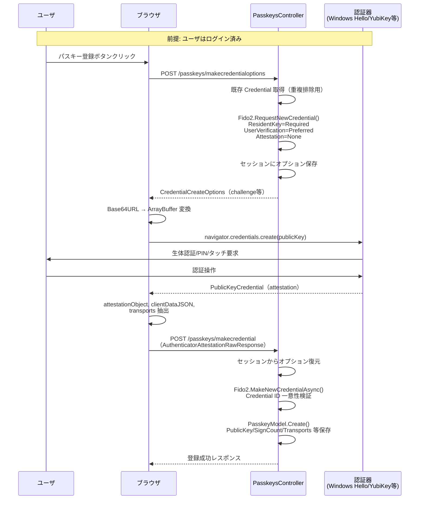
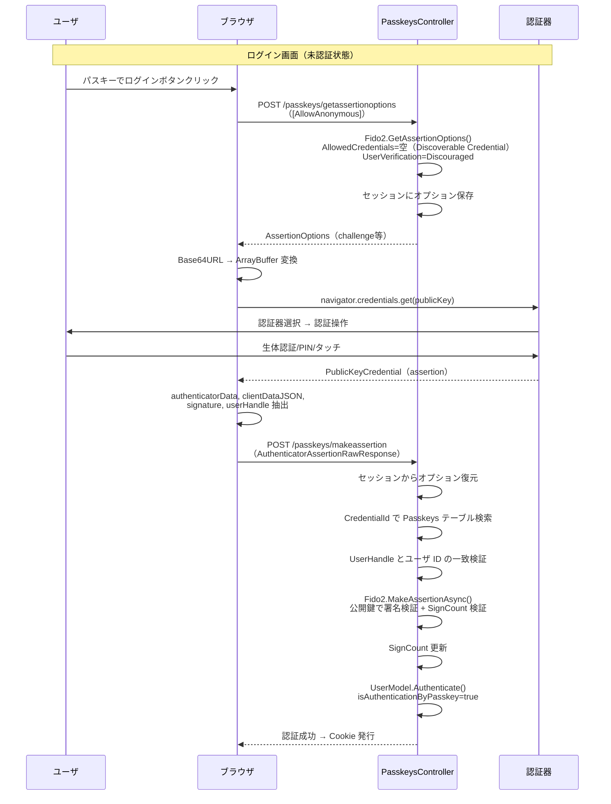
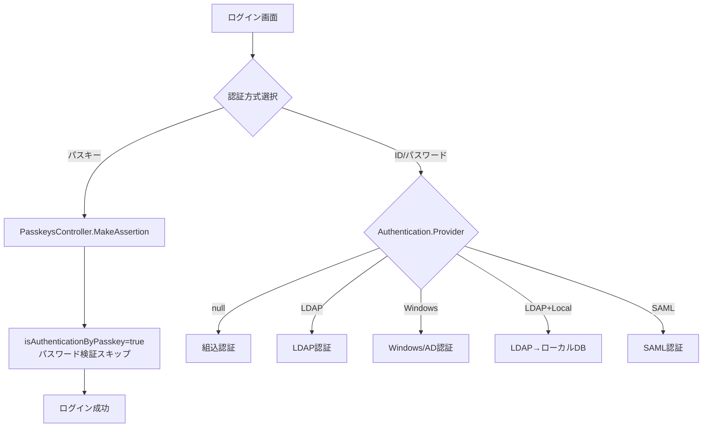

# 2 段階認証・補助認証・パスキー

プリザンターの 2 段階認証（メール / TOTP）、補助的な認証方式（TrustedProxy / Passkey / Extension）の実装詳細を調査した。Passkey（WebAuthn）については対応プラットフォーム・認証器タイプ・登録/認証フローを深掘りしている。

<!-- START doctoc generated TOC please keep comment here to allow auto update -->
<!-- DON'T EDIT THIS SECTION, INSTEAD RE-RUN doctoc TO UPDATE -->

- [調査情報](#調査情報)
- [調査目的](#調査目的)
- [2 段階認証](#2-段階認証)
    - [概要](#概要)
    - [パラメータ定義](#パラメータ定義)
    - [2 段階認証の有効判定](#2-段階認証の有効判定)
    - [2 段階認証のフロー](#2-段階認証のフロー)
    - [メール認証コード方式](#メール認証コード方式)
    - [TOTP 方式](#totp-方式)
    - [ユーザ側の 2 段階認証設定フィールド](#ユーザ側の-2-段階認証設定フィールド)
- [補助的な認証方式](#補助的な認証方式)
    - [TrustedProxy 認証](#trustedproxy-認証)
    - [Extension 認証](#extension-認証)
- [Passkey 認証（WebAuthn）](#passkey-認証webauthn)
    - [概要](#概要-1)
    - [パラメータ設定](#パラメータ設定)
    - [対応プラットフォーム・認証器タイプ](#対応プラットフォーム認証器タイプ)
    - [資格情報の保存](#資格情報の保存)
    - [登録フロー](#登録フロー)
    - [認証フロー](#認証フロー)
    - [クライアント側実装](#クライアント側実装)
    - [セキュリティ機能](#セキュリティ機能)
    - [Passkey と他の認証方式の関係](#passkey-と他の認証方式の関係)
    - [UI コンポーネント](#ui-コンポーネント)
- [認証チケットの保存](#認証チケットの保存)
- [結論](#結論)
    - [2 段階認証の特徴](#2-段階認証の特徴)
    - [Passkey の対応範囲](#passkey-の対応範囲)
- [関連ソースコード](#関連ソースコード)
- [関連ドキュメント](#関連ドキュメント)

<!-- END doctoc generated TOC please keep comment here to allow auto update -->

## 調査情報

| 項目       | 内容                                                                                      |
| ---------- | ----------------------------------------------------------------------------------------- |
| 調査日     | 2026-03-18                                                                                |
| 対象       | `Implem.Pleasanter` v1.4.x 系（メインブランチ）                                           |
| 関連ソース | `UserModel.cs`, `PasskeysController.cs`, `PasskeyModel.cs`, `passkey.ts`, `Passkey.cs` 他 |

## 調査目的

- 2 段階認証（メール / TOTP）の有効判定・検証ロジックを把握する
- 補助的な認証方式（TrustedProxy / Extension）の位置づけを整理する
- Passkey（WebAuthn）の対応プラットフォーム・認証器タイプ（物理キー / Windows Hello 等）を明確にする
- Passkey の登録・認証フローの実装詳細を把握する

## 2 段階認証

### 概要

プリザンターは 2 段階認証（Secondary Authentication）として**メール認証コード**と **TOTP（Time-based One-Time Password）**の 2 方式を提供する。

### パラメータ定義

```csharp
public class SecondaryAuthentication
{
    public enum SecondaryAuthenticationMode
    {
        None,           // 無効
        DefaultEnable,  // デフォルト有効（ユーザが無効化可能）
        DefaultDisable  // デフォルト無効（ユーザが有効化可能）
    }

    public enum SecondaryAuthenticationModeNotificationTypes
    {
        Mail,  // メールで認証コード送信
        Totp   // TOTP（認証アプリ）
    }

    public SecondaryAuthenticationMode Mode;
    public SecondaryAuthenticationModeNotificationTypes NotificationType;
    public double? CountTolerances;                  // TOTP時間ステップ許容数
    public bool NotificationMailBcc;                 // BCC送信
    public string AuthenticationCodeCharacterType;   // コード文字種（Number/Letter/NumberAndLetter）
    public int? AuthenticationCodeLength;             // コード桁数
    public int? AuthenticationCodeExpirationPeriod;   // コード有効期間（秒）
}
```

> `Implem.ParameterAccessor/Parts/SecondaryAuthentication.cs:1-24`

### 2 段階認証の有効判定

```csharp
// UserModel.cs:5295-5338 (要約)
private bool EnabledSecondaryAuthentication(Context context)
{
    switch (Parameters.Security.SecondaryAuthentication?.Mode)
    {
        case SecondaryAuthenticationMode.None:
            return false;
        case SecondaryAuthenticationMode.DefaultEnable:
            if (DisableSecondaryAuthentication)  // ユーザが無効化している場合
                return false;
            break;
        case SecondaryAuthenticationMode.DefaultDisable:
            if (!EnableSecondaryAuthentication)  // ユーザが有効化していない場合
                return false;
            break;
        default:
            return false;
    }
    // 拡張SQL（OnUseSecondaryAuthentication）による追加条件判定
    var statements = new List<SqlStatement>()
        .OnUseSecondaryAuthentication(context).ToArray();
    if (!(statements?.Any() == true))
        return true;
    // ... SQL実行による条件判定
}
```

> `Implem.Pleasanter/Models/Users/UserModel.cs:5295-5338`

### 2 段階認証のフロー

```mermaid
flowchart TD
    Auth[第1段階認証成功] --> Chk2FA{EnabledSecondaryAuthentication?}
    Chk2FA -- No --> Allow[ログイン許可]
    Chk2FA -- Yes --> ChkCode{SecondaryAuthenticationCode<br/>がフォームにある?}

    ChkCode -- No: 初回表示 --> ChkTotp{TOTP SecretKey 登録済み?}
    ChkTotp -- No: TOTP未登録 --> Register[TOTP登録画面<br/>QRコード表示]
    ChkTotp -- Yes: 登録済み --> Open2FA[2段階認証入力画面]

    ChkCode -- Yes: コード送信済み --> Verify{コード検証}

    subgraph メール認証
        VerifyMail{Code一致 &&<br/>有効期限内?}
    end

    subgraph TOTP認証
        VerifyTotp{VerifyTotp&#40;&#41;<br/>OtpNet.Totp}
    end

    Verify --> VerifyMail
    Verify --> VerifyTotp
    VerifyMail -- 成功 --> PostAuth[HandlePostSecondaryAuthentication]
    VerifyMail -- 失敗 --> Retry[再入力要求]
    VerifyTotp -- 成功 --> PostAuth
    VerifyTotp -- 失敗 --> Retry

    PostAuth --> Allow2[ログイン許可]
```



### メール認証コード方式

`NotificationType = Mail` の場合、サーバがランダムコードを生成してメール送信する。

```csharp
// UserModel.cs:4291-4300 (抜粋)
return string.IsNullOrEmpty(secondaryAuthenticationCode)
    ? !EnableSecretKey && !isAuthenticationByMail
        ? OpenTotpRegisterCode(context)              // TOTP未登録時: 登録画面
        : OpenSecondaryAuthentication(context, ...)  // コード送信＋入力画面
    : !SecondaryAuthentication(context, secondaryAuthenticationCode, isAuthenticationByMail)
        ? Messages.ResponseSecondaryAuthentication(context, ...).ToJson()  // 失敗メッセージ
        : HandlePostSecondaryAuthentication(context, ...);                 // 成功処理
```

> `Implem.Pleasanter/Models/Users/UserModel.cs:4291-4315`

**メールコード検証:**

```csharp
// UserModel.cs:5343-5349
private bool SecondaryAuthentication(
    Context context, string secondaryAuthenticationCode, bool isAuthenticationByMail)
{
    return isAuthenticationByMail
        ? SecondaryAuthenticationCode == secondaryAuthenticationCode
            && SecondaryAuthenticationCodeExpirationTime.Value.InRange()
            && SecondaryAuthenticationCodeExpirationTime.Value > DateTime.Now
        : VerifyTotp(secondaryAuthenticationCode);
}
```

> `Implem.Pleasanter/Models/Users/UserModel.cs:5343-5349`

- `SecondaryAuthenticationCode`: DB に保存された一時コード
- `SecondaryAuthenticationCodeExpirationTime`: 有効期限（`AuthenticationCodeExpirationPeriod` 秒後）
- コード文字種: `AuthenticationCodeCharacterType`（`Number` / `Letter` / `NumberAndLetter`）

### TOTP 方式

`NotificationType = Totp` の場合、OtpNet ライブラリを使用した TOTP 検証を行う。

```csharp
// UserModel.cs:5355-5366
private bool VerifyTotp(string secondaryAuthenticationCode, double countTolerances = 0)
{
    OtpNet.Totp totp = new OtpNet.Totp(
        OtpNet.Base32Encoding.ToBytes(SecretKey), totpSize: 6);
    var beforeTime = countTolerances * -30;
    return countTolerances >= Parameters.Security.SecondaryAuthentication.CountTolerances
        ? false
        : totp.VerifyTotp(
            DateTime.UtcNow.AddSeconds((double)beforeTime),
            secondaryAuthenticationCode, out _,
            OtpNet.VerificationWindow.RfcSpecifiedNetworkDelay)
                ? true
                : VerifyTotp(secondaryAuthenticationCode, countTolerances + 1);
}
```

> `Implem.Pleasanter/Models/Users/UserModel.cs:5355-5366`

**TOTP 実装の特徴:**

| 項目           | 値 / 動作                                          |
| -------------- | -------------------------------------------------- |
| コード桁数     | 6 桁固定（`totpSize: 6`）                          |
| 時間ステップ   | 30 秒（OtpNet 標準）                               |
| 時間許容       | `CountTolerances` 回分の過去ステップも検証         |
| 検証方式       | 再帰呼出で `countTolerances` をインクリメント      |
| 検証ウィンドウ | `RfcSpecifiedNetworkDelay`（RFC 6238 準拠）        |
| SecretKey 保存 | `Users.SecretKey` カラムに Base32 エンコードで保存 |
| QR コード生成  | `OpenTotpRegisterCode()` で登録画面を表示          |

### ユーザ側の 2 段階認証設定フィールド

| Users カラム                                | 型         | 説明                                       |
| ------------------------------------------- | ---------- | ------------------------------------------ |
| `EnableSecondaryAuthentication`             | `bit`      | ユーザが 2FA を有効化（DefaultDisable 時） |
| `DisableSecondaryAuthentication`            | `bit`      | ユーザが 2FA を無効化（DefaultEnable 時）  |
| `SecondaryAuthenticationCode`               | `nvarchar` | メール認証コード（一時保存）               |
| `SecondaryAuthenticationCodeExpirationTime` | `datetime` | コード有効期限                             |
| `SecretKey`                                 | `nvarchar` | TOTP 用 Base32 シークレットキー            |

---

## 補助的な認証方式

### TrustedProxy 認証

リバースプロキシからのヘッダに基づくユーザ認証。

```csharp
// TrustedProxyAuthenticationMiddleware.cs:23-95 (要約)
public async Task InvokeAsync(HttpContext httpContext)
{
    var header = Strings.CoalesceEmpty(
        Environment.GetEnvironmentVariable("TRUSTED_PROXY_AUTH_HEADER"),
        Parameters.Authentication.TrustedProxyParameters?.Header ?? string.Empty);

    // ヘッダ未設定 or 認証済み → スキップ
    if (string.IsNullOrEmpty(header)) { await next(httpContext); return; }
    if (httpContext.User?.Identity?.IsAuthenticated == true) { await next(httpContext); return; }

    // プロキシ元IPの信頼検証
    if (!IsTrustedProxy(httpContext, out var trustReason)) { await next(httpContext); return; }

    // ヘッダからユーザ名取得 → DBユーザ照合
    var proxyUser = httpContext.Request.Headers[header].FirstOrDefault();
    var userModel = new UserModel().Get(...,
        where: Rds.UsersWhere().LoginId(proxyUser).Disabled(false).Lockout(false));

    // ClaimsIdentity作成 → Cookie発行
    var identity = new ClaimsIdentity(claims, "TrustedProxy");
    await httpContext.SignInAsync(CookieAuthenticationDefaults.AuthenticationScheme, principal, properties);
}
```

> `Implem.Pleasanter/Middlewares/TrustedProxyAuthenticationMiddleware.cs:23-95`

**特徴:**

- `KnownNetworks` / `KnownProxies` で信頼するプロキシ IP を制限
- IP 未設定時はすべてのプロキシを信頼（開発環境向け）
- `X-Original-For` ヘッダ → `RemoteIpAddress` の順で IP 解決
- 認証スキーム名: `"TrustedProxy"`

### Extension 認証

カスタム認証プロバイダ用の拡張ポイント。現在は未実装スタブ。

```csharp
// Extension.cs:19-26
public static bool Authenticate(
    Context context, string loginId, string password, UserModel userModel)
{
    throw new NotImplementedException();
}
```

> `Implem.Pleasanter/Libraries/DataSources/Extension.cs:19-26`

---

## Passkey 認証（WebAuthn）

### 概要

プリザンターは **FIDO2 / WebAuthn** に基づくパスワードレス認証を実装している。
サーバサイドは **Fido2 v4.0.0**（`Fido2NetLib`）+ **Fido2.AspNet** ライブラリを使用し、
クライアントサイドは Web Authentication API（`navigator.credentials`）を呼び出す。

```xml
<!-- Implem.Pleasanter.csproj -->
<PackageReference Include="Fido2" Version="4.0.0" />
<PackageReference Include="Fido2.AspNet" Version="4.0.0" />
```

> `Implem.Pleasanter/Implem.Pleasanter.csproj`

### パラメータ設定

```json
{
    "PasskeyParameters": {
        "Enabled": false,
        "ServerName": "Pleasanter",
        "ServerDomain": "localhost",
        "Origins": ["https://localhost:44331"]
    }
}
```

> `App_Data/Parameters/Authentication.json`

```csharp
public class Passkey
{
    public bool Enabled;
    public string ServerDomain;   // Relying Party ID（RP ID）
    public string ServerName;     // Relying Party 表示名
    public HashSet<string> Origins;  // 許可オリジン（HTTPS必須）
}
```

> `Implem.ParameterAccessor/Parts/Passkey.cs:9-15`

### 対応プラットフォーム・認証器タイプ

プリザンターの Passkey 実装は **プラットフォーム認証器**と**クロスプラットフォーム（外部）認証器**の**両方**に対応している。

#### 認証器の種類

| 認証器カテゴリ                   | 具体例                                                    | Attachment       |
| -------------------------------- | --------------------------------------------------------- | ---------------- |
| **プラットフォーム認証器**       | Windows Hello（PIN/顔認識/指紋）、macOS Touch ID、Face ID | `platform`       |
| **クロスプラットフォーム認証器** | USB セキュリティキー（YubiKey 等）、NFC キー、BLE キー    | `cross-platform` |

#### サーバ側の認証器設定

```csharp
// PasskeysController.cs:59-65
var authenticatorSelection = new AuthenticatorSelection
{
    ResidentKey = ResidentKeyRequirement.Required,        // Discoverable Credential 必須
    UserVerification = UserVerificationRequirement.Preferred  // 生体認証/PIN推奨
};
var options = fido2.RequestNewCredential(new RequestNewCredentialParams
{
    // ...
    AuthenticatorSelection = authenticatorSelection,
    AttestationPreference = AttestationConveyancePreference.None,  // Attestation不要
});
```

> `Implem.Pleasanter/Controllers/PasskeysController.cs:59-65`

**設定値の意味:**

| 設定項目                | 値                      | 説明                                                                                                      |
| ----------------------- | ----------------------- | --------------------------------------------------------------------------------------------------------- |
| `ResidentKey`           | `Required`              | **Discoverable Credential（常駐キー）必須**。認証器側にユーザ情報を保存し、ユーザ名入力なしでログイン可能 |
| `UserVerification`      | `Preferred`（登録時）   | 認証器が生体認証/PIN をサポートしていれば使用する。サポートしていなくてもエラーにはならない               |
| `UserVerification`      | `Discouraged`（認証時） | 認証時はユーザ検証を要求しない。Discoverable Credential でユーザを特定                                    |
| `AttestationPreference` | `None`                  | デバイスの証明（Attestation）を要求しない。特定デバイスへの制限は行わない                                 |

> **`AuthenticatorAttachment` は指定なし（`undefined`）**: プラットフォーム認証器・外部認証器の**どちらも使用可能**。

#### クライアント側の認証器制限

```typescript
// passkey.ts:32-35
if (makeCredentialOptions.authenticatorSelection.authenticatorAttachment === null) {
    makeCredentialOptions.authenticatorSelection.authenticatorAttachment = undefined;
}
```

> `Implem.PleasanterFrontend/wwwroot/src/scripts/generals/passkey.ts:32-35`

サーバから `authenticatorAttachment = null` が返された場合、クライアント側で `undefined` に変換する。WebAuthn API では `undefined` は「制限なし」を意味し、**すべてのタイプの認証器を許可**する。

#### 対応プラットフォーム一覧

| プラットフォーム      | 認証器タイプ   | 認証方式                     | 対応状況 |
| --------------------- | -------------- | ---------------------------- | -------- |
| Windows 10/11         | Platform       | Windows Hello（PIN/顔/指紋） | ○        |
| macOS (Safari)        | Platform       | Touch ID                     | ○        |
| iOS / iPadOS (Safari) | Platform       | Face ID / Touch ID           | ○        |
| Android (Chrome)      | Platform       | 指紋 / 顔認証 / PIN          | ○        |
| YubiKey 等            | Cross-platform | USB / NFC / BLE              | ○        |
| Titan Security Key    | Cross-platform | USB / NFC / BLE              | ○        |
| 1Password 等          | Hybrid         | ソフトウェアパスキー         | ○        |

> **判断根拠**: `AuthenticatorAttachment` が未指定（`undefined`）のため、WebAuthn API はブラウザがサポートするすべての認証器を許可する。特定のデバイスやプラットフォームへの制限は行われていない。

### 資格情報の保存

認証器から取得した資格情報は `Passkeys` テーブルに JSON 形式で保存される。

```csharp
// PasskeyData.cs
public class PasskeyData
{
    public byte[] PublicKey { get; set; }                      // 公開鍵（署名検証用）
    public uint SignCount { get; set; }                        // 署名カウンタ（複製検知）
    public AuthenticatorTransport[] Transports { get; set; }   // 接続方式（USB/NFC/BLE/internal）
    public bool IsBackupEligible { get; set; }                 // バックアップ対象可否
    public bool IsBackedUp { get; set; }                       // バックアップ済みフラグ
    public byte[] AttestationObject { get; set; }              // Attestation オブジェクト
    public byte[] AttestationClientDataJson { get; set; }      // クライアントデータ JSON
    public string AttestationFormat { get; set; }              // Attestation 形式（packed/fido-u2f 等）
    public Guid AaGuid { get; set; }                           // 認証器 AAGUID（デバイス識別）
}
```

> `Implem.Pleasanter/Libraries/Settings/PasskeyData.cs`

**DB スキーマ:**

| カラム         | 型         | 説明                                     |
| -------------- | ---------- | ---------------------------------------- |
| `PasskeyId`    | `int`      | 主キー                                   |
| `CredentialId` | `nvarchar` | Base64URL エンコードされた Credential ID |
| `UserId`       | `int`      | Users テーブルへの外部キー               |
| `Title`        | `nvarchar` | ユーザが設定する認証器の表示名           |
| `PasskeyData`  | `nvarchar` | JSON シリアライズされた `PasskeyData`    |

### 登録フロー



**サーバ側の登録処理:**

```csharp
// PasskeysController.cs:116-196 (要約)
public async Task<string> MakeCredential(Context context)
{
    var bodyData = JsonSerializer.Deserialize<AuthenticatorAttestationRawResponse>(
        context.Forms.Data("data"));
    var options = CredentialCreateOptions.FromJson(
        HttpContext.Session.GetString(Fido2AttestationOptions));

    // Credential ID の一意性を検証
    async Task<bool> IsCredentialIdUniqueToUserCallback(
        IsCredentialIdUniqueToUserParams args, CancellationToken ct)
    {
        return !passkeys.Any(p =>
            p.CredentialId == args.CredentialId.ToBase64UrlString());
    }

    var credential = await fido2.MakeNewCredentialAsync(new MakeNewCredentialParams
    {
        AttestationResponse = bodyData,
        OriginalOptions = options,
        IsCredentialIdUniqueToUserCallback = IsCredentialIdUniqueToUserCallback
    });

    // 資格情報をDBに保存
    var passkeyModel = new PasskeyModel
    {
        CredentialId = credential.Id.ToBase64UrlString(),
        Title = Displays.PasskeyDefaultTitle(...),
        PasskeyData = new PasskeyData
        {
            PublicKey = credential.PublicKey,
            SignCount = credential.SignCount,
            Transports = credential.Transports,
            AttestationFormat = credential.AttestationFormat,
            AaGuid = credential.AaGuid,
            IsBackupEligible = credential.IsBackupEligible,
            IsBackedUp = credential.IsBackedUp,
            AttestationObject = credential.AttestationObject,
            AttestationClientDataJson = credential.AttestationClientDataJson
        }
    };
    passkeyModel.Create(context, ss);
}
```

> `Implem.Pleasanter/Controllers/PasskeysController.cs:116-196`

### 認証フロー



**サーバ側の認証処理:**

```csharp
// PasskeysController.cs:249-326 (要約)
public async Task<string> MakeAssertion(Context context)
{
    var clientResponse = JsonSerializer.Deserialize<AuthenticatorAssertionRawResponse>(
        context.Forms.Data("data"));
    var options = AssertionOptions.FromJson(
        HttpContext.Session.GetString(Fido2AssertionOptions));

    // Credential ID でDB検索
    var passkeys = new PasskeyCollection(
        where: Rds.PasskeysWhere().CredentialId(clientResponse.Id));
    var passkey = passkeys.FirstOrDefault();
    if (passkey == null) return error;

    // UserHandle（ユーザID）と Credential の所有者一致を検証
    async Task<bool> IsUserHandleOwnerOfCredentialIdCallback(
        IsUserHandleOwnerOfCredentialIdParams args, CancellationToken ct)
    {
        var userId = Encoding.UTF8.GetString(args.UserHandle);
        var credentialId = args.CredentialId.ToBase64UrlString();
        return passkey.UserId.ToString() == userId
            && passkey.CredentialId == credentialId;
    }

    // 署名検証 + SignCount チェック（複製検知）
    var res = await fido2.MakeAssertionAsync(new MakeAssertionParams
    {
        AssertionResponse = clientResponse,
        OriginalOptions = options,
        StoredPublicKey = passkey.PasskeyData.PublicKey,
        StoredSignatureCounter = passkey.PasskeyData.SignCount ?? 0,
        IsUserHandleOwnerOfCredentialIdCallback = IsUserHandleOwnerOfCredentialIdCallback
    });

    // SignCount 更新（次回認証時の複製検知用）
    passkey.PasskeyData.SignCount = res.SignCount;
    new PasskeyModel { PasskeyData = passkey.PasskeyData }.Update(context, ss);

    // パスキーフラグ付きで認証（パスワード検証をスキップ）
    new UserModel { UserId = passkey.UserId }.Authenticate(
        context: context,
        returnUrl: returnUrl,
        isAuthenticationByPasskey: true);
}
```

> `Implem.Pleasanter/Controllers/PasskeysController.cs:249-326`

### クライアント側実装

```typescript
// passkey.ts — WebAuthn API 呼び出し

// 機能検出: WebAuthn API の存在チェック
'credentials' in navigator &&
    typeof navigator.credentials.create === 'function' &&
    typeof navigator.credentials.get === 'function';

// 登録: navigator.credentials.create()
const credential = await navigator.credentials.create({
    publicKey: makeCredentialOptions,
});

// 認証: navigator.credentials.get()
const credential = await navigator.credentials.get({
    publicKey: makeAssertionOptions,
});

// Transports 取得（UI ヒント用）
const transports = attestationResponse.getTransports();
```

> `Implem.PleasanterFrontend/wwwroot/src/scripts/generals/passkey.ts`

**エラーハンドリング:**

| エラー名          | 表示メッセージ                   | 原因                               |
| ----------------- | -------------------------------- | ---------------------------------- |
| `NotAllowedError` | `PasskeyOperationTimeoutOrAbort` | タイムアウトまたはユーザキャンセル |
| `AbortError`      | `PasskeyOperationAborted`        | 操作中断                           |
| `SyntaxError` 等  | `PasskeyResponseInvalid`         | レスポンスデータ不正               |
| その他            | `PasskeyServerUnavailable`       | サーバ通信エラー                   |

### セキュリティ機能

| 機能                  | 実装                                                                                   |
| --------------------- | -------------------------------------------------------------------------------------- |
| 署名カウンタ検証      | `SignCount` を認証ごとに検証・更新し、認証器の複製（クローン）を検知                   |
| UserHandle 検証       | `IsUserHandleOwnerOfCredentialIdCallback` で Credential 所有者とユーザ ID の一致を確認 |
| Credential ID 一意性  | 登録時に `IsCredentialIdUniqueToUserCallback` で重複を排除                             |
| チャレンジ-レスポンス | Fido2 ライブラリがチャレンジ生成・検証を管理                                           |
| バックアップ追跡      | `IsBackupEligible` / `IsBackedUp` でパスキーの同期状態を追跡                           |
| Transports 記録       | 認証器の接続方式（USB/NFC/BLE/internal）を記録                                         |

### Passkey と他の認証方式の関係

Passkey 認証は `Authentication.Provider` の `switch` 文とは**独立**して動作する。

```csharp
// PasskeysController.cs（MakeAssertion内）
new UserModel { UserId = passkey.UserId }.Authenticate(
    context: context,
    returnUrl: returnUrl,
    isAuthenticationByPasskey: true);
```

`isAuthenticationByPasskey = true` が渡されると、`UserModel.Authenticate()` は
パスワード検証をスキップして直接認証成功判定を行う。
このため、**どの Provider が設定されていても Passkey 認証が有効なら利用可能**。



### UI コンポーネント

Passkey の管理 UI は以下のメソッドで生成される。

| メソッド                     | 説明                                     |
| ---------------------------- | ---------------------------------------- |
| `PasskeyDialog()`            | パスキー管理ダイアログ                   |
| `PasskeysEditor()`           | 新規登録/削除ボタン付きエディタ          |
| `EditPasskey()`              | 登録済みパスキー一覧グリッド             |
| `PasskeysHeader()`           | テーブルヘッダ（Title, CreatedTime）     |
| `PasskeysBody()`             | テーブル行（ユーザのパスキー一覧）       |
| `PasskeyChangeTitleDialog()` | パスキー名称変更ダイアログ               |
| `PasskeyChangeTitleForm()`   | テキストボックス + 変更/キャンセルボタン |

> `Implem.Pleasanter/Models/Passkeys/PasskeyUtilities.cs`

---

## 認証チケットの保存

認証成功後の Cookie チケットは `AuthenticationTicketStore` でセッションストアに保存される。

```csharp
// AuthenticationTicketStore.cs:18-72 (要約)
public class AuthenticationTicketStore : ITicketStore
{
    private static readonly string sessionKey = "AuthenticationTicket";

    public Task<string> StoreAsync(AuthenticationTicket ticket)
    {
        var guid = Strings.NewGuid();
        var serializedTicket = TicketSerializer.Default.Serialize(ticket);
        SessionUtilities.Set(context, sessionKey, Convert.ToBase64String(serializedTicket), guid);
        return Task.FromResult(guid);
    }

    public Task RemoveAsync(string key)
    {
        SessionUtilities.Remove(context, sessionKey, page: false, sessionGuid: key);
        if (Parameters.Session.UseKeyValueStore)
        {
            CacheForRedisConnection.Clear(key);  // Redis利用時はRedisからも削除
        }
        return Task.CompletedTask;
    }
}
```

> `Implem.Pleasanter/Libraries/Security/AuthenticationTicketStore.cs:12-73`

---

## 結論

### 2 段階認証の特徴

| 項目         | メール認証コード                            | TOTP                                    |
| ------------ | ------------------------------------------- | --------------------------------------- |
| コード生成   | サーバでランダム生成                        | 認証器アプリ（Google Authenticator 等） |
| 配信方法     | メール送信                                  | アプリ表示                              |
| 有効期間     | `AuthenticationCodeExpirationPeriod` 秒     | 30 秒ステップ + `CountTolerances` 回分  |
| 保存先       | `Users.SecondaryAuthenticationCode`         | `Users.SecretKey`（Base32）             |
| セキュリティ | コードは平文保存（DB アクセスで漏洩リスク） | 秘密鍵は平文保存（同上）                |

### Passkey の対応範囲

| 項目                    | 内容                                                |
| ----------------------- | --------------------------------------------------- |
| ライブラリ              | Fido2 v4.0.0（Fido2NetLib）+ Fido2.AspNet           |
| 認証器制限              | なし（プラットフォーム・外部の両方を許可）          |
| Windows Hello           | ○（プラットフォーム認証器として対応）               |
| macOS Touch ID          | ○（プラットフォーム認証器として対応）               |
| iOS Face ID / Touch ID  | ○（プラットフォーム認証器として対応）               |
| Android 生体認証        | ○（プラットフォーム認証器として対応）               |
| USB セキュリティキー    | ○（クロスプラットフォーム認証器として対応）         |
| NFC / BLE キー          | ○（クロスプラットフォーム認証器として対応）         |
| ソフトウェアパスキー    | ○（1Password 等のパスワードマネージャ対応）         |
| Discoverable Credential | 必須（`ResidentKey = Required`）                    |
| Attestation             | 不要（`AttestationConveyancePreference.None`）      |
| Provider 依存           | なし（どの Provider でも Passkey 有効時に利用可能） |

## 関連ソースコード

| ファイル                                                                | 概要                                 |
| ----------------------------------------------------------------------- | ------------------------------------ |
| `Implem.Pleasanter/Models/Users/UserModel.cs:5295-5366`                 | 2 段階認証・TOTP 検証                |
| `Implem.Pleasanter/Controllers/PasskeysController.cs`                   | Passkey REST API（登録・認証）       |
| `Implem.Pleasanter/Models/Passkeys/PasskeyModel.cs`                     | Passkey データモデル                 |
| `Implem.Pleasanter/Models/Passkeys/PasskeyUtilities.cs`                 | Passkey UI 生成                      |
| `Implem.Pleasanter/Models/Passkeys/PasskeyCollection.cs`                | Passkey コレクション/リポジトリ      |
| `Implem.Pleasanter/Libraries/Settings/PasskeyData.cs`                   | Passkey 資格情報データモデル         |
| `Implem.PleasanterFrontend/wwwroot/src/scripts/generals/passkey.ts`     | クライアント側 WebAuthn API 呼び出し |
| `Implem.Pleasanter/Middlewares/TrustedProxyAuthenticationMiddleware.cs` | TrustedProxy 認証ミドルウェア        |
| `Implem.Pleasanter/Libraries/DataSources/Extension.cs`                  | 拡張認証スタブ                       |
| `Implem.Pleasanter/Libraries/Security/AuthenticationTicketStore.cs`     | 認証チケットストア                   |
| `Implem.ParameterAccessor/Parts/SecondaryAuthentication.cs`             | 2 段階認証パラメータ定義             |
| `Implem.ParameterAccessor/Parts/Passkey.cs`                             | Passkey パラメータ定義               |

## 関連ドキュメント

- [認証方式の実装詳細・フォールバック](010-認証方式詳細・フォールバック・2段階認証.md) — 組込認証・SAML・LDAP・Windows 認証の実装詳細とフォールバック
- [認証基盤の詳細](003-認証基盤.md) — Cookie 認証・API キー認証・Bearer ヘッダー認証の内部実装
