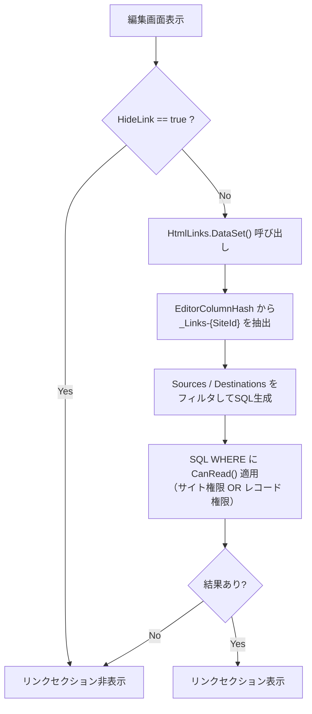
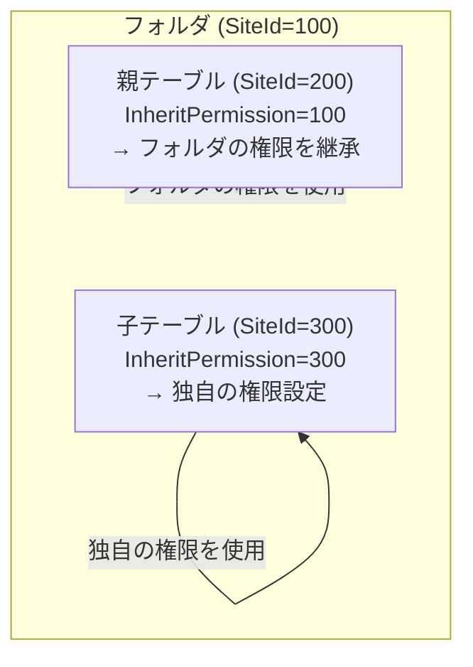
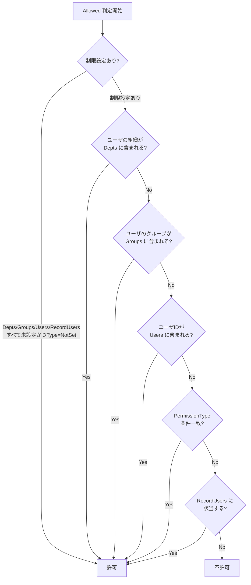
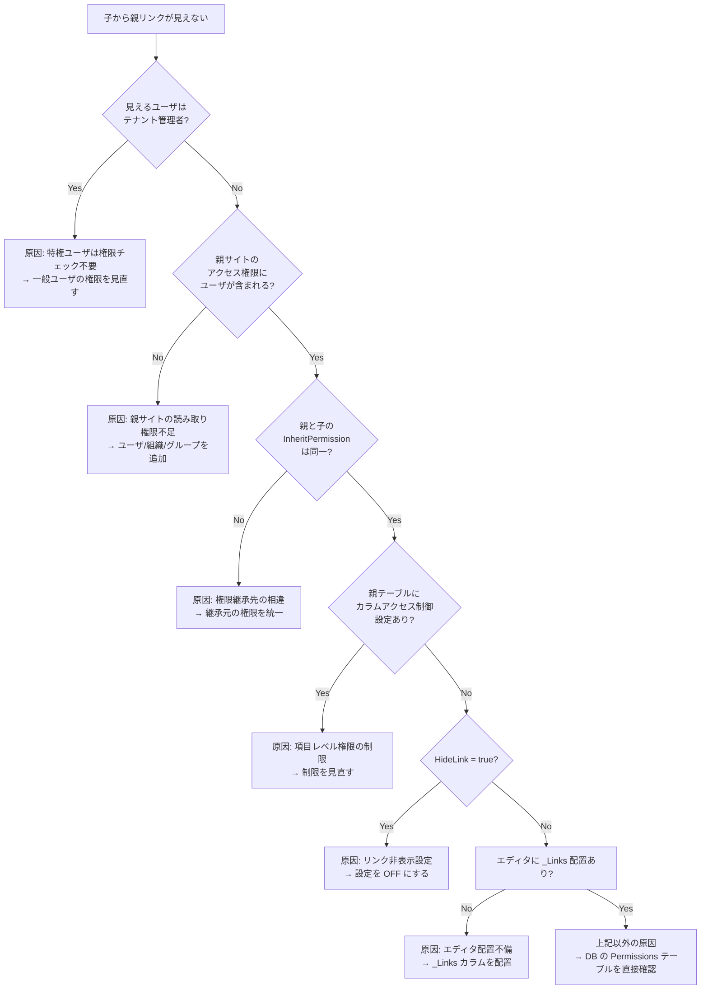

# 親子テーブルのリンク表示権限

親子関係を持つテーブルにおいて、子レコードから親レコードへのリンクが一部のユーザに表示されない問題の原因と対処方法を調査したドキュメントです。

<!-- START doctoc generated TOC please keep comment here to allow auto update -->
<!-- DON'T EDIT THIS SECTION, INSTEAD RE-RUN doctoc TO UPDATE -->

- [調査情報](#調査情報)
- [調査目的](#調査目的)
- [リンク表示の全体フロー](#リンク表示の全体フロー)
    - [リンクデータ取得の仕組み](#リンクデータ取得の仕組み)
- [原因 1: サイトレベルの読み取り権限の不一致](#原因-1-サイトレベルの読み取り権限の不一致)
    - [概要](#概要)
    - [CanRead SQL の動作](#canread-sql-の動作)
    - [CanReadSites SQL の詳細](#canreadsites-sql-の詳細)
    - [確認ポイント](#確認ポイント)
- [原因 2: 権限継承（InheritPermission）の相違](#原因-2-権限継承inheritpermissionの相違)
    - [概要](#概要-1)
    - [確認ポイント](#確認ポイント-1)
- [原因 3: テーブルのアクセス制御（項目レベル権限）](#原因-3-テーブルのアクセス制御項目レベル権限)
    - [概要](#概要-2)
    - [ColumnAccessControl の判定ロジック](#columnaccesscontrol-の判定ロジック)
    - [確認ポイント](#確認ポイント-2)
- [原因 4: エディタのカラム配置](#原因-4-エディタのカラム配置)
    - [概要](#概要-3)
    - [DataSet メソッドにおけるフィルタ](#dataset-メソッドにおけるフィルタ)
- [原因 5: HideLink 設定](#原因-5-hidelink-設定)
    - [概要](#概要-4)
    - [確認ポイント](#確認ポイント-3)
- [原因 6: 特権ユーザとの差異](#原因-6-特権ユーザとの差異)
    - [概要](#概要-5)
    - [確認ポイント](#確認ポイント-4)
- [確認手順チェックリスト](#確認手順チェックリスト)
- [結論](#結論)
- [関連ソースコード](#関連ソースコード)
- [関連ドキュメント](#関連ドキュメント)

<!-- END doctoc generated TOC please keep comment here to allow auto update -->

## 調査情報

| 調査日     | リポジトリ | ブランチ | タグ/バージョン    | コミット      | 備考     |
| ---------- | ---------- | -------- | ------------------ | ------------- | -------- |
| 2026-03-26 | Pleasanter | main     | Pleasanter_1.5.2.0 | `46471ef5f18` | 初回調査 |

## 調査目的

親子関係を持つテーブルにおいて、以下の症状が報告されている。

- 親レコードから子レコードへのリンクは全ユーザで表示される
- 子レコードから親レコードへのリンクは表示されるユーザと表示されないユーザがいる
- サイトアクセス権限は親子で同一に設定済み
- レコード制御（レコードレベルの権限設定）は未設定

この事象の原因となりうる箇所と確認ポイントを明確にする。

---

## リンク表示の全体フロー

プリザンターの編集画面におけるリンクセクションの表示は、以下の流れで処理される。



### リンクデータ取得の仕組み

`HtmlLinks.DataSet()` メソッド（`HtmlLinks.cs:227`）が中核となり、以下の手順でリンク先レコードを取得する。

1. **`EditorColumnHash`** から `_Links-{SiteId}` 形式のカラムを抽出してリンク対象サイトを特定
2. 現在のサイトの **`Sources`**（親方向）と **`Destinations`**（子方向）を走査
3. 各リンク先サイトに対して Issues / Results 別に SQL を生成
4. SQL の WHERE 句に **`CanRead()`** を適用してアクセス権をフィルタ
5. 取得結果が 0 件の場合、リンクセクションごと非表示になる

> **ポイント**: 取得結果が 0 件 → リンクセクション自体が表示されない。
> ユーザによってリンクが「見える/見えない」が分かれる場合、`CanRead()` フィルタが原因である可能性が高い。

---

## 原因 1: サイトレベルの読み取り権限の不一致

### 概要

最も一般的な原因は、**親サイトに対する読み取り権限が不足しているユーザがいる**ことである。

子レコードから親レコードへのリンク表示は、子サイトではなく**親サイトのアクセス権**によって制御される。ユーザが親サイトの読み取り権限を持っていない場合、親レコードは `CanRead()` フィルタで除外され、リンクセクションが表示されなくなる。

### CanRead SQL の動作

リンク先レコードの取得 SQL には以下のフィルタが適用される。

```csharp
// HtmlLinks.cs:314-326 (Issues の例)
var where = view.Where(
    context: context,
    ss: ss,
    where: Rds.IssuesWhere()
        .IssueId_In(sub: Targets(
            context: context,
            id: id,
            direction: direction))
        .CanRead(
            context: context,
            idColumnBracket: "\"Issues\".\"IssueId\"")
        .Sites_TenantId(context.TenantId),
    requestSearchCondition: false);
```

`CanRead()` 拡張メソッド（`Permissions.cs:257-277`）は以下の条件で WHERE 句を生成する。

```csharp
// Permissions.cs:257-277
public static SqlWhereCollection CanRead(
    this SqlWhereCollection where,
    Context context,
    string idColumnBracket,
    bool _using = true)
{
    return _using && !context.HasPrivilege
        ? where
            .Sites_TenantId(context.TenantId)
            .Add(or: new SqlWhereCollection()
                .Add(tableName: null, raw: Def.Sql.CanReadSites)
                .Add(tableName: null,
                    subLeft: CheckRecordPermission(
                        context: context,
                        idColumnBracket: idColumnBracket),
                    _operator: null))
        : where;
}
```

つまり `CanRead()` は以下の 2 条件を **OR** で評価する。

| 条件                 | 内容                                                     |
| -------------------- | -------------------------------------------------------- |
| `CanReadSites`       | ユーザがリンク先**サイト**に対して読み取り権限を持つか   |
| レコード権限チェック | ユーザがリンク先**レコード**に対する権限エントリを持つか |

### CanReadSites SQL の詳細

`CanReadSites` SQL（`CanReadSites.sql`）は `InheritPermission` を基準にして判定する。

```sql
-- Sqls/PostgreSQL/CanReadSites.sql（抜粋）
exists (
    select * from "Permissions"
    where "Permissions"."ReferenceId" = "InheritPermission"
      and "Permissions"."PermissionType" & 1 = 1
      and (
          -- ユーザの組織が権限を持つか
          exists (select * from "Depts" where ... and "Permissions"."DeptId" = "Depts"."DeptId")
          or
          -- ユーザが所属するグループが権限を持つか
          exists (select * from "Groups" inner join "GroupMembers" on ... where ...)
          or
          -- ユーザ個人が権限を持つか
          ("Permissions"."UserId" = @ipU and @ipU <> 0)
          or
          -- 全認証済みユーザに権限があるか (UserId = -1)
          ("Permissions"."UserId" = -1)
      )
)
```

> **重要**: `"Permissions"."ReferenceId" = "InheritPermission"` の部分が肝である。
> `InheritPermission` はサイトの権限継承先を示し、通常はサイト自身の `SiteId` と一致するが、
> フォルダ内のサイトでは親フォルダの `SiteId` を継承している場合がある。

### 確認ポイント

1. **親サイトのアクセス権限を直接確認する**
    - 親サイトの「サイトのアクセス制御」を開き、リンクが見えないユーザ（またはそのユーザが所属する組織・グループ）に「読み取り」権限が付与されているか確認する
2. **`InheritPermission` の値を確認する**
    - 親サイトがフォルダ内にある場合、権限は親フォルダから継承されている可能性がある
    - テーブルの管理 > アクセス制御タブにて「アクセス権の継承」が有効か確認する
    - 「サイトのアクセス制御を独立させる」を実行した場合、継承が切れて独自の権限設定になる

---

## 原因 2: 権限継承（InheritPermission）の相違

### 概要

親テーブルと子テーブルが同一フォルダ配下にあっても、一方のテーブルだけが「サイトのアクセス制御を独立」している場合、実質的な権限が異なる。



上記の場合、子テーブルの権限（SiteId=300）に追加されたユーザでも、親テーブルの権限はフォルダ（SiteId=100）から継承されるため、**フォルダの権限エントリに含まれないユーザは親レコードのリンクが見えない**。

### 確認ポイント

- 親テーブル・子テーブルそれぞれの「テーブルの管理 > アクセス制御」で**権限の継承先**が同じか確認する
- 「このサイト」と表示されている場合は独自権限、フォルダ名が表示されている場合は継承中

---

## 原因 3: テーブルのアクセス制御（項目レベル権限）

### 概要

テーブルの管理 > テーブルのアクセス制御で、特定カラム（項目）に対する読み取り制限が設定されている場合、一部のユーザにリンクが表示されなくなることがある。

`ReadColumnAccessControls` による制限は、リンクテーブルのカラム表示に影響する。

```csharp
// SiteSettings.cs のGetLinkTableColumns メソッド
public List<Column> GetLinkTableColumns(
    Context context, View view = null, bool checkPermission = false)
{
    return (view?.GridColumns ?? LinkColumns)
        .Select(columnName => GetColumn(context: context, columnName: columnName))
        .Where(column => column != null)
        .Where(column => !column.Joined)
        .AllowedColumns(
            context: context, ss: this, checkPermission: checkPermission)
        .Where(o => context.ContractSettings.Attachments()
            || o.ControlType != "Attachments")
        .ToList();
}
```

### ColumnAccessControl の判定ロジック

`ColumnAccessControl.Allowed()` メソッド（`ColumnAccessControl.cs:72-117`）は以下の順序で許可判定を行う。



### 確認ポイント

- 子テーブルの「テーブルの管理 > テーブルのアクセス制御」で、リンク元の分類項目（ClassA 等）に読み取り制限が設定されていないか確認する
- 親テーブル側のカラムに対するアクセス制御も確認する（リンクテーブルのカラム表示に影響するため）

---

## 原因 4: エディタのカラム配置

### 概要

`EditorColumnHash` はサイト設定に保存される静的な構成であり、ユーザごとに異なることはない。そのため、エディタ上にリンクカラム（`_Links-{SiteId}`）が配置されているかどうかはユーザ間で共通である。

ただし、以下のケースでは全ユーザに対してリンクセクションが表示されない。

- エディタのカラム配置から `_Links-{SiteId}` が除外されている
- リンク設定が正しく構成されていない

### DataSet メソッドにおけるフィルタ

```csharp
// HtmlLinks.cs:229-233
var targets = ss.EditorColumnHash.Values
    .SelectMany(o => o
        .Where(p => p.StartsWith("_Links-"))
        .Select(p => p.Split_2nd('-').ToLong()))
    .ToList();
```

この処理で `targets` リストが空の場合、すべての Sources / Destinations が対象となる。
`targets` にサイト ID が含まれる場合、そのサイト ID に一致するリンクのみが対象となる。

> **注意**: これはユーザ依存ではなく全ユーザ共通の動作であるため、
> 「一部のユーザだけリンクが見えない」という症状の直接的原因にはならない。

---

## 原因 5: HideLink 設定

### 概要

サイト設定に `HideLink` プロパティ（`SiteSettings.cs:240`）があり、これが `true` の場合はリンクセクション全体が非表示になる。

```csharp
// IssueUtilities.cs:1934 / ResultUtilities.cs:1829
if (ss.HideLink != true)
{
    hb.Div(id: "Links", css: "links", action: () => hb
        .Links(context, ss, ...));
}
```

この設定はサイト単位であり、全ユーザに影響する。一部のユーザだけに影響する原因ではないが、確認項目として含める。

### 確認ポイント

- 子テーブルの「テーブルの管理 > エディタ」タブにて「リンクを表示しない」にチェックが入っていないか確認する

---

## 原因 6: 特権ユーザとの差異

### 概要

`context.HasPrivilege` が `true` のユーザ（テナント管理者やサービス管理者）は、`CanRead()` の権限フィルタがスキップされる。

```csharp
// Permissions.cs:263
return _using && !context.HasPrivilege  // ← HasPrivilege=true ならフィルタ不適用
    ? where.Sites_TenantId(context.TenantId)
        .Add(or: new SqlWhereCollection()
            .Add(tableName: null, raw: Def.Sql.CanReadSites)
            .Add(tableName: null,
                subLeft: CheckRecordPermission(...),
                _operator: null))
    : where;
```

つまり、テナント管理者は権限設定に関係なくすべてのリンクが表示される。リンクが「見えるユーザ」がテナント管理者である場合、これが原因である可能性が高い。

### 確認ポイント

- リンクが見えるユーザがテナント管理者ではないか確認する
- 一般ユーザ同士で比較して差異があるかを切り分ける

---

## 確認手順チェックリスト

以下の順序で確認することを推奨する。

| #   | 確認項目                                 | 確認方法                                                                     |
| --- | ---------------------------------------- | ---------------------------------------------------------------------------- |
| 1   | 特権ユーザの切り分け                     | リンクが見えるユーザが管理者かどうか確認                                     |
| 2   | 親サイトのアクセス権限                   | 親サイトの「サイトのアクセス制御」でユーザ/組織/グループの読み取り権限を確認 |
| 3   | 権限の継承先                             | 親・子テーブルの「アクセス制御」タブで継承先が同一か確認                     |
| 4   | テーブルのアクセス制御（項目レベル権限） | 親テーブルのカラムに読み取り制限がないか確認                                 |
| 5   | HideLink 設定                            | 子テーブルの「エディタ」タブで「リンクを表示しない」が OFF か確認            |
| 6   | エディタのカラム配置                     | 子テーブルのエディタに `_Links-{SiteId}` が配置されているか確認              |



---

## 結論

子レコードから親レコードへのリンクが一部のユーザにしか表示されない場合、最も可能性が高い原因は以下の 2 つである。

1. **親サイトに対する読み取り権限の不足** — リンク表示時の `CanRead()` SQL フィルタは、リンク先（この場合は親サイト）の権限を評価する。サイトアクセス権限が「同じ」であっても、`InheritPermission`（権限の継承先）が異なる場合、実質的な権限が一致しない可能性がある。

2. **特権ユーザ（テナント管理者）との混同** — テナント管理者は `CanRead()` フィルタが完全にスキップされるため、権限設定に関係なくリンクが表示される。リンクが「見える」ユーザが管理者であった場合、権限設定の問題が見落とされる。

対処としては、上記のチェックリストに沿って、親サイトの権限設定・権限継承先・テーブルのアクセス制御を順に確認することを推奨する。

---

## 関連ソースコード

| ファイル                                                | 行番号  | 内容                             |
| ------------------------------------------------------- | ------- | -------------------------------- |
| `Libraries/HtmlParts/HtmlLinks.cs`                      | 28-49   | Links() メソッド（リンク描画）   |
| `Libraries/HtmlParts/HtmlLinks.cs`                      | 227-300 | DataSet() メソッド（データ取得） |
| `Libraries/HtmlParts/HtmlLinks.cs`                      | 302-350 | SelectIssues()（SQL 生成）       |
| `Libraries/HtmlParts/HtmlLinks.cs`                      | 454-470 | Targets()（リンク ID 取得）      |
| `Libraries/HtmlParts/HtmlLinks.cs`                      | 472-506 | Contains()（表示判定）           |
| `Libraries/Security/Permissions.cs`                     | 257-277 | CanRead()（権限フィルタ生成）    |
| `Libraries/Security/Permissions.cs`                     | 296-315 | CheckRecordPermission()          |
| `Libraries/Settings/SiteSettings.cs`                    | 240     | HideLink プロパティ              |
| `Libraries/Settings/ColumnAccessControl.cs`             | 72-117  | Allowed()（カラム権限判定）      |
| `App_Data/Definitions/Sqls/PostgreSQL/CanReadSites.sql` | -       | サイト読み取り権限 SQL           |

## 関連ドキュメント

- [ユーザアクセス権限・アクセス制御](001-ユーザアクセス権限・アクセス制御.md)
- [権限階層構造（User・Group・Dept）](002-権限階層構造.md)
