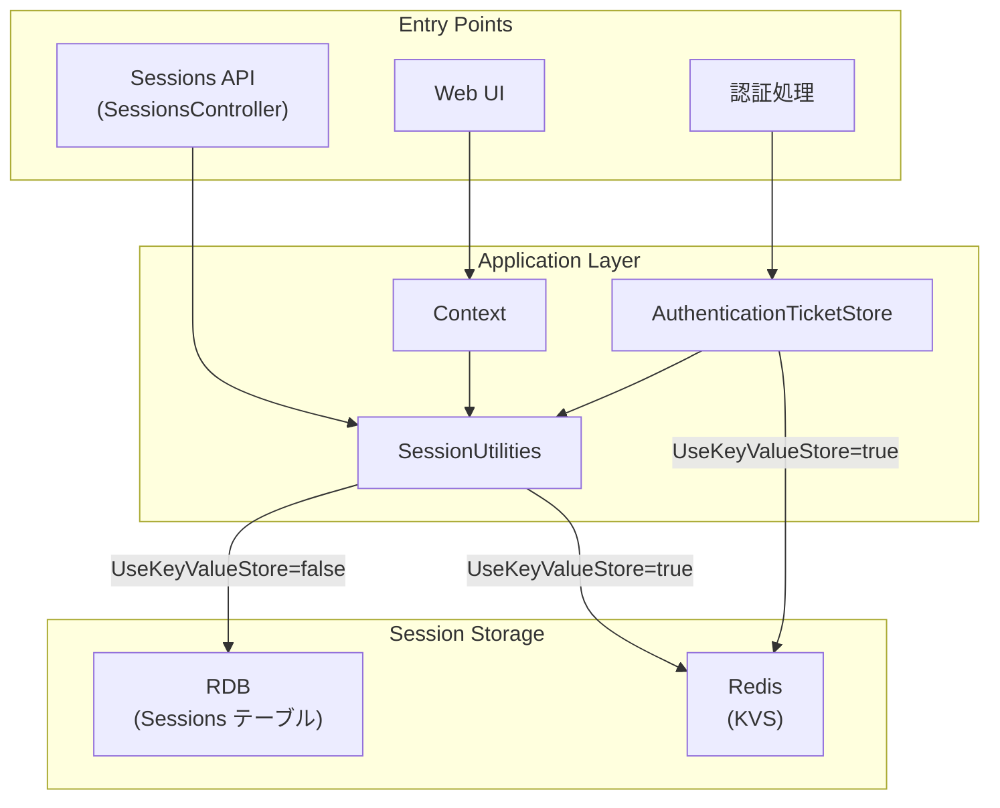
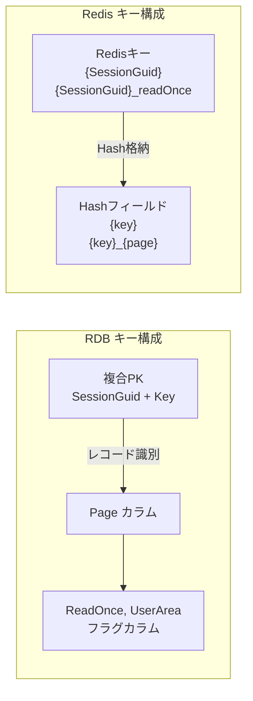
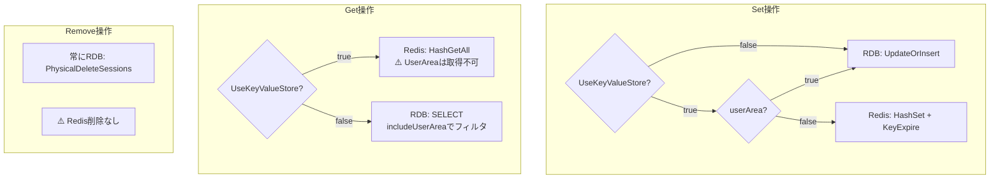
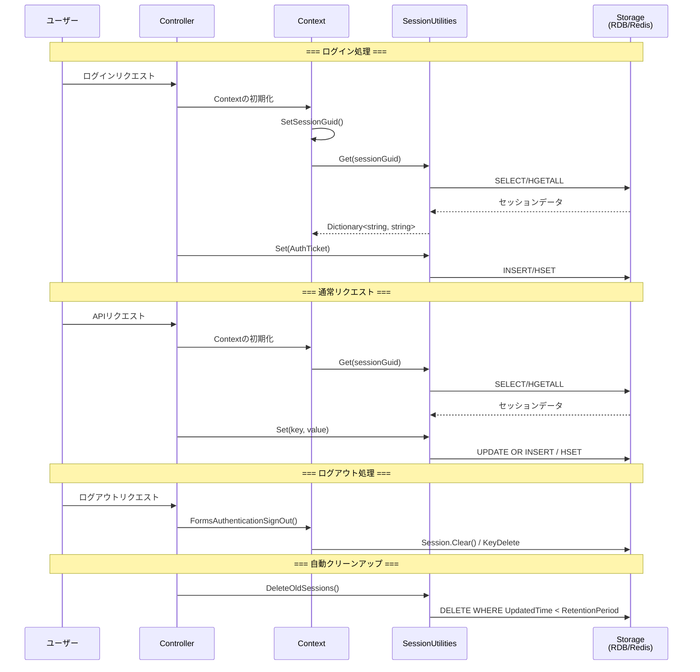
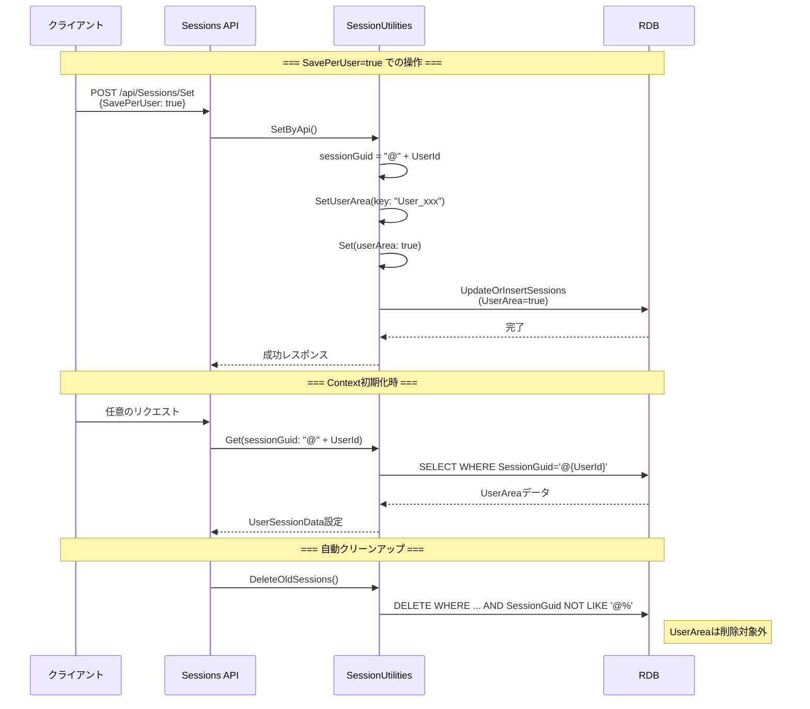
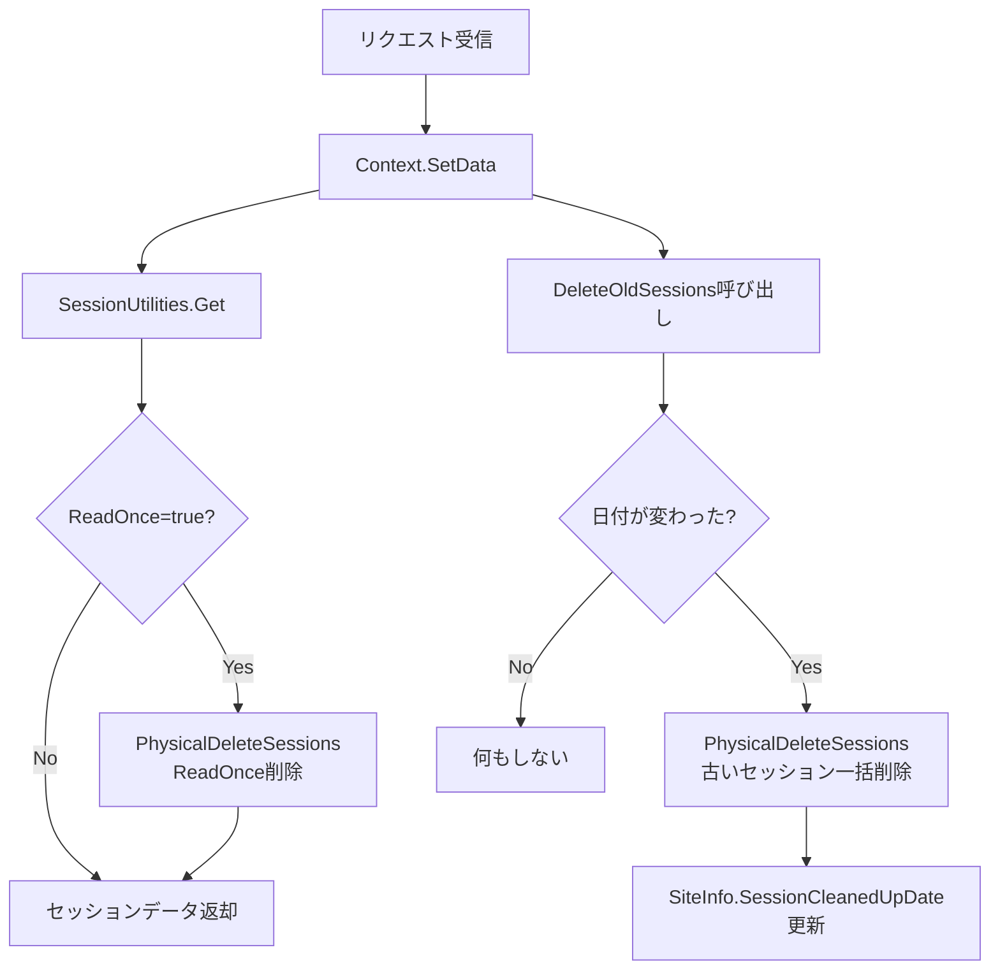
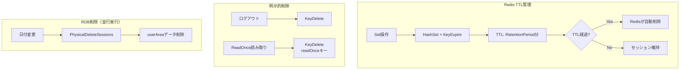
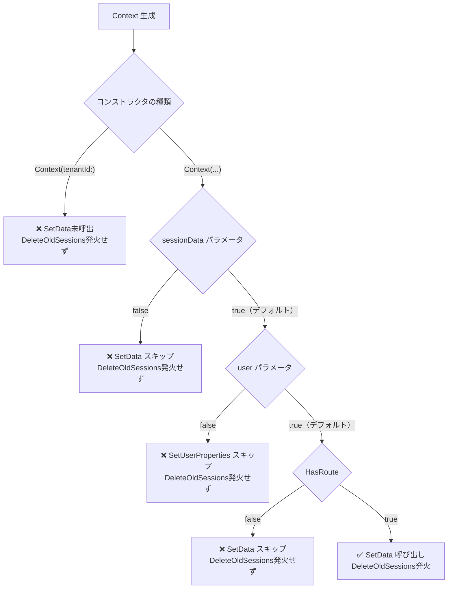
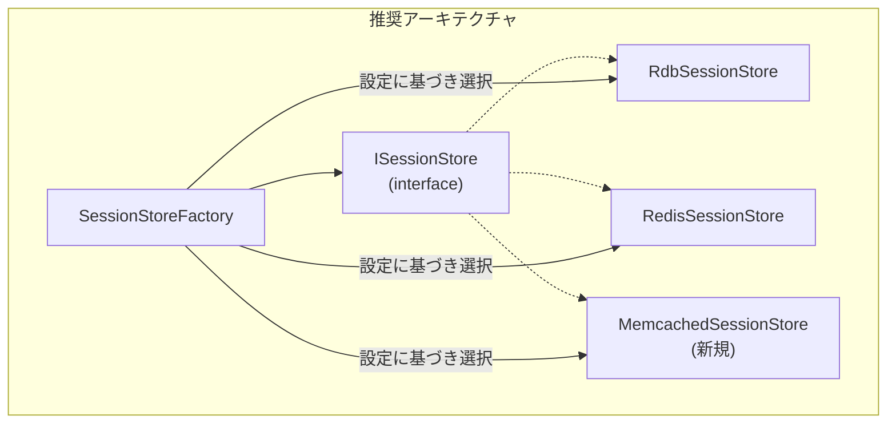

# Session 管理の実装

プリザンターにおけるセッション管理のCRUD操作タイミングと、KVS（Key-Value Store）の拡張可能性について調査した結果をまとめます。

<!-- START doctoc generated TOC please keep comment here to allow auto update -->
<!-- DON'T EDIT THIS SECTION, INSTEAD RE-RUN doctoc TO UPDATE -->

- [調査情報](#調査情報)
- [調査目的](#調査目的)
- [エグゼクティブサマリー](#エグゼクティブサマリー)
    - [結論](#結論)
    - [発見された問題点](#発見された問題点)
- [セッション管理の概要](#セッション管理の概要)
    - [アーキテクチャ概要](#アーキテクチャ概要)
    - [主要コンポーネント](#主要コンポーネント)
- [ストレージ構造](#ストレージ構造)
    - [RDB (Sessions テーブル)](#rdb-sessions-テーブル)
    - [Redis (KVS)](#redis-kvs)
    - [キー構成の比較](#キー構成の比較)
    - [キー構成の制約と影響](#キー構成の制約と影響)
- [RDBとKVSの実装差異](#rdbとkvsの実装差異)
    - [操作別の実装比較](#操作別の実装比較)
    - [Set操作の分岐](#set操作の分岐)
    - [Get操作の分岐](#get操作の分岐)
    - [Remove操作（個別キー削除）](#remove操作個別キー削除)
    - [実装差異の影響](#実装差異の影響)
    - [潜在的な問題点](#潜在的な問題点)
    - [推奨される改善点](#推奨される改善点)
- [セッションのCRUDタイミング](#セッションのcrudタイミング)
    - [Create（作成）](#create作成)
    - [Read（読み取り）](#read読み取り)
    - [Update（更新）](#update更新)
    - [Delete（削除）](#delete削除)
    - [CRUDフロー図](#crudフロー図)
- [UserAreaセッション](#userareaセッション)
    - [UserAreaの特徴](#userareaの特徴)
    - [UserArea CRUDタイミング](#userarea-crudタイミング)
    - [UserArea CRUDフロー図](#userarea-crudフロー図)
- [セッションライフサイクル管理](#セッションライフサイクル管理)
    - [RDB方式のライフサイクル](#rdb方式のライフサイクル)
    - [KVS（Redis）方式のライフサイクル](#kvsredis方式のライフサイクル)
    - [ライフサイクル管理の比較](#ライフサイクル管理の比較)
    - [潜在的な問題点](#潜在的な問題点-1)
- [DeleteOldSessionsの発火条件](#deleteoldsessionsの発火条件)
    - [発火する経路](#発火する経路)
    - [発火しない経路](#発火しない経路)
    - [バックグラウンドタスクでの挙動](#バックグラウンドタスクでの挙動)
    - [具体的な非発火箇所](#具体的な非発火箇所)
    - [発火条件のフローチャート](#発火条件のフローチャート)
    - [発火頻度のまとめ](#発火頻度のまとめ)
- [セッション削除操作のコール元詳細](#セッション削除操作のコール元詳細)
    - [SessionUtilities.Remove() の呼び出し元](#sessionutilitiesremove-の呼び出し元)
    - [SessionUtilities.Abandon() の呼び出し元](#sessionutilitiesabandon-の呼び出し元)
    - [CacheForRedisConnection.Clear/Remove() の呼び出し元](#cacheforredisconnectionclearremove-の呼び出し元)
- [KVS拡張可能性の調査](#kvs拡張可能性の調査)
    - [現状の実装](#現状の実装)
    - [拡張可能性の評価](#拡張可能性の評価)
    - [拡張時の推奨アプローチ](#拡張時の推奨アプローチ)
- [パラメータ設定](#パラメータ設定)
- [API経由のセッション操作](#api経由のセッション操作)
- [まとめ](#まとめ)
    - [調査結果](#調査結果)
    - [発見された問題点](#発見された問題点-1)
- [技術的詳細分析](#技術的詳細分析)
    - [KVSのアンダースコア解析問題](#kvsのアンダースコア解析問題)
    - [KVS Remove非対応によるデータ残留リスク](#kvs-remove非対応によるデータ残留リスク)
    - [KVS RemoveとTTLの共存設計](#kvs-removeとttlの共存設計)
    - [推奨事項](#推奨事項)

<!-- END doctoc generated TOC please keep comment here to allow auto update -->

## 調査情報

| 調査日     | リポジトリ               | ブランチ | タグ/バージョン    | コミット    | 備考 |
| ---------- | ------------------------ | -------- | ------------------ | ----------- | ---- |
| 2026-02-06 | Implem/Implem.Pleasanter | main     | Pleasanter_1.5.0.0 | `8c261c0a8` | -    |

## 調査目的

1. プリザンターにおけるセッション管理の全体像を把握する
2. セッションのCRUD（Create/Read/Update/Delete）操作が発生するタイミングをフロー化する
3. 現状Redisのみ対応しているKVSの拡張可能性を評価する

---

## エグゼクティブサマリー

### 結論

| 項目                   | 評価 | 概要                                                              |
| ---------------------- | ---- | ----------------------------------------------------------------- |
| **RDB/KVS二重構造**    | ✅   | RDB（デフォルト）とRedis（オプション）の2方式をサポート           |
| **KVS拡張可能性**      | ❌   | 低（Redisへの直接依存、インターフェース抽象化なし）               |
| **UserAreaのKVS対応**  | ❌   | 非対応（常にRDBに保存）                                           |
| **自動クリーンアップ** | ⚠️   | Webリクエスト時のみ発火（バックグラウンドタスクでは実行されない） |
| **Remove()のKVS対応**  | ❌   | 非対応（個別キー削除時、RDBのみ削除されRedisにデータが残る）      |

### 発見された問題点

1. **DeleteOldSessionsはバックグラウンドタスクで発火しない**
    - 通常のWebリクエストでのみ発火
    - ユーザーアクセスがない時間帯は古いセッションが蓄積

2. **Remove()がKVS非対応**
    - `SessionUtilities.Remove()` はRDBのみ削除
    - KVS使用時、Redisにデータが残留する可能性あり

3. **UserAreaのKVS取得問題**
    - KVS使用時でもUserAreaは常にRDBに保存
    - `Get()` でKVSから取得しようとすると空になる可能性

---

## セッション管理の概要

### アーキテクチャ概要

プリザンターのセッション管理は、以下の2つのストレージ方式をサポートしています：

1. **RDB方式（デフォルト）**: Sessionsテーブルにセッションデータを格納
2. **KVS方式（オプション）**: Redisにセッションデータを格納



### 主要コンポーネント

| コンポーネント              | ファイルパス                                      | 役割                                      |
| --------------------------- | ------------------------------------------------- | ----------------------------------------- |
| `SessionsController`        | `Controllers/Api/SessionsController.cs`           | Sessions API エンドポイント               |
| `SessionUtilities`          | `Models/Sessions/SessionUtilities.cs`             | セッション操作の中核ロジック              |
| `SessionModel`              | `Models/Sessions/SessionModel.cs`                 | セッションデータモデル                    |
| `CacheForRedisConnection`   | `Libraries/Redis/CacheForRedisConnection.cs`      | Redis接続管理                             |
| `AuthenticationTicketStore` | `Libraries/Security/AuthenticationTicketStore.cs` | 認証チケットのセッション格納              |
| `Context`                   | `Libraries/Requests/Context.cs`                   | リクエストコンテキスト（SessionGuid管理） |

---

## ストレージ構造

### RDB (Sessions テーブル)

Sessionsテーブルのスキーマ：

| カラム名    | 型            | PK  | 説明                     |
| ----------- | ------------- | --- | ------------------------ |
| SessionGuid | nvarchar(32)  | ✓   | セッション識別子         |
| Key         | nvarchar(256) | ✓   | セッションデータのキー   |
| Page        | nvarchar      |     | ページ固有データの識別子 |
| Value       | nvarchar(max) |     | セッションデータの値     |
| ReadOnce    | bit           |     | 読み取り後自動削除フラグ |
| UserArea    | bit           |     | ユーザー固有エリアフラグ |

**Sessions テーブルのデータ例:**

| SessionGuid (PK) | Key (PK)   | Page      | Value | ReadOnce | UserArea |
| ---------------- | ---------- | --------- | ----- | -------- | -------- |
| abc123def456     | ViewMode   |           | List  | false    | false    |
| abc123def456     | ViewMode   | Items/100 | Card  | false    | false    |
| abc123def456     | Message    |           | {...} | true     | false    |
| @1               | User_Theme |           | Dark  | false    | true     |
| @1               | User_View  | Items/200 | {...} | false    | true     |

### Redis (KVS)

Redisでのデータ構造：

```text
Key: {SessionGuid}
Type: Hash
Fields:
  - {key} または {key}_{page}: value

Key: {SessionGuid}_readOnce
Type: Hash
Fields:
  - {key} または {key}_{page}: value (読み取り後削除)
```

**有効期限：** `Parameters.Session.RetentionPeriod`（分単位、デフォルト1440分=24時間）

**Redis Hash のデータ例:**

| Redis Key             | TTL    | Hash Field         | Value | 備考                   |
| --------------------- | ------ | ------------------ | ----- | ---------------------- |
| abc123def456          | 1440分 | ViewMode           | List  | page未指定             |
| abc123def456          | 1440分 | ViewMode_Items/100 | Card  | page指定               |
| abc123def456_readOnce | 1440分 | Message            | {...} | 読み取り後キーごと削除 |

### キー構成の比較

| 項目                   | RDB                          | KVS (Redis)                         |
| ---------------------- | ---------------------------- | ----------------------------------- |
| **プライマリキー**     | `SessionGuid` + `Key` (複合) | Redisキー: `{SessionGuid}`          |
| **セッション識別**     | `SessionGuid` カラム         | Redisキー                           |
| **データキー**         | `Key` カラム                 | Hashフィールド（または一部）        |
| **ページ識別**         | `Page` カラム（独立）        | フィールド名に結合 `{key}_{page}`   |
| **ReadOnce識別**       | `ReadOnce` カラム（boolean） | キーに結合 `{SessionGuid}_readOnce` |
| **UserArea識別**       | `UserArea` カラム（boolean） | ❌ 非対応（RDBにフォールバック）    |
| **ユーザーセッション** | `@{UserId}` 形式             | ❌ RDBのみ                          |



### キー構成の制約と影響

1. **Page識別の差異**

    ```text
    RDB:   Key=ViewMode, Page=Items/100  → 別レコード
    Redis: HashField=ViewMode_Items/100  → アンダースコア結合
    ```

    ⚠️ キー名にアンダースコアを含む場合、Page解析が誤動作する可能性（詳細は[KVSのアンダースコア解析問題](#kvsのアンダースコア解析問題)を参照）

2. **ReadOnce管理の差異**

    ```text
    RDB:   同一レコード内でReadOnce=true/false管理
    Redis: 別キー（"_readOnce"サフィックス）で管理
    ```

    ⚠️ ReadOnce削除時、RDBは行単位、Redisはキー全体削除

3. **UserAreaの非対称性**

    ```csharp
    // Set時: userArea=true なら常にRDB
    if (Parameters.Session.UseKeyValueStore && !userArea) { /* Redis */ }
    else { /* RDB */ }

    // Get時: KVSモードでもuserAreaはRedisから取得できない
    if (Parameters.Session.UseKeyValueStore) {
        return iDatabase.HashGetAll(key);  // UserAreaデータは存在しない
    }
    ```

---

## RDBとKVSの実装差異

RDBとKVS（Redis）での実装差異を詳細に比較します。

### 操作別の実装比較

| 操作                      | RDB                                    | KVS (Redis)                            |
| ------------------------- | -------------------------------------- | -------------------------------------- |
| **Create/Update**         | `UpdateOrInsertSessions`               | `HashSet` + `KeyExpire`                |
| **Read**                  | `SELECT` (includeUserAreaフィルタあり) | `HashGetAll`                           |
| **Delete (個別キー)**     | `PhysicalDeleteSessions`               | **RDBのみ**（Redis削除なし）⚠️         |
| **Delete (全セッション)** | `PhysicalDeleteSessions`               | `KeyDelete` + `PhysicalDeleteSessions` |
| **UserArea**              | ✅ サポート                            | ❌ 非対応（常にRDB）                   |
| **ReadOnce**              | フラグ管理、Get時に削除                | 別キー `{sessionGuid}_readOnce` で管理 |
| **TTL/有効期限**          | なし（アプリで管理）                   | `KeyExpire`                            |
| **一括削除**              | `DeleteOldSessions` (1日1回)           | TTLで自動期限切れ                      |

### Set操作の分岐

```csharp
// SessionUtilities.SetRds() での分岐 (155行目)
if (Parameters.Session.UseKeyValueStore && !userArea)
{
    // Redis に保存
    iDatabase.HashSet(sessionGuid, hashEntrys);
    iDatabase.KeyExpire(sessionGuid, TimeSpan.FromMinutes(Parameters.Session.RetentionPeriod));
}
else
{
    // RDB に保存（userArea=true の場合は常にこちら）
    Repository.ExecuteNonQuery(...Rds.UpdateOrInsertSessions(...));
}
```

### Get操作の分岐

```csharp
// SessionUtilities.Get() での分岐 (35行目)
if (Parameters.Session.UseKeyValueStore)
{
    // Redis から取得（UserAreaは取得できない）
    return iDatabase.HashGetAll(key).ToDictionary(...);
}
// RDB から取得（includeUserAreaフィルタあり）
return Repository.ExecuteTable(...).ToDictionary(...);
```

### Remove操作（個別キー削除）

```csharp
// SessionUtilities.Remove() - RDBのみ
public static void Remove(Context context, string key, bool page, string sessionGuid = null)
{
    Repository.ExecuteNonQuery(
        context: context,
        statements: Rds.PhysicalDeleteSessions(  // 常にRDB
            where: Rds.SessionsWhere()
                .SessionGuid(sessionGuid ?? context.SessionGuid)
                .Key(key)
                .Page(context.Page, _using: page)));
}
// ⚠️ KVS (Redis) の削除処理はなし
```

### 実装差異の影響



### 潜在的な問題点

1. **Remove()のKVS非対応**
    - `Remove()` はRDBのみに対して削除を実行
    - KVS使用時、Redisにデータが残る可能性がある

2. **UserSessionDataのKVS取得問題**
    - KVS使用時、`Get(sessionGuid: "@" + UserId)` はRedisから取得を試みる
    - UserAreaはRDBにのみ保存されるため、Redisには存在しない
    - 結果: KVS使用時、UserSessionDataが正しく取得できない可能性

    ```csharp
    // Context.cs - KVS使用時の問題箇所
    UserSessionData = SessionUtilities.Get(
        context: this,
        includeUserArea: Controller == "sessions",
        sessionGuid: "@" + UserId);  // Redisにはこのキーは存在しない
    ```

3. **ReadOnceの実装差異**
    - RDB: 同じキーにReadOnceフラグを設定、Get時にWHERE句で削除
    - KVS: 別キー `{sessionGuid}_readOnce` で管理、Get後に `KeyDelete`

### 推奨される改善点

| 問題                     | 推奨対応                                            |
| ------------------------ | --------------------------------------------------- |
| Remove()のKVS非対応      | `CacheForRedisConnection.Remove()` を追加で呼び出し |
| UserSessionDataのKVS取得 | UserArea取得時は常にRDBから取得するよう分岐を追加   |
| 実装の一貫性             | インターフェース抽象化により、RDB/KVS操作を統一     |

---

## セッションのCRUDタイミング

### Create（作成）

セッションが作成されるタイミング：

| タイミング             | メソッド/処理                            | 説明                                       |
| ---------------------- | ---------------------------------------- | ------------------------------------------ |
| ユーザーログイン時     | `AuthenticationTicketStore.StoreAsync()` | 認証チケットをセッションに格納             |
| 初回リクエスト時       | `Context.SetSessionGuid()`               | SessionGuidが未設定の場合に新規生成        |
| セッションデータ設定時 | `SessionUtilities.Set()`                 | アプリケーションがセッションにデータを格納 |
| API経由でのセット時    | `SessionUtilities.SetByApi()`            | Sessions API経由でのセッション作成         |
| 開始時刻記録時         | `SessionUtilities.SetStartTime()`        | StartTime/LastAccessTimeの初期設定         |

### Read（読み取り）

セッションが読み取られるタイミング：

| タイミング               | メソッド/処理                               | 説明                                       |
| ------------------------ | ------------------------------------------- | ------------------------------------------ |
| リクエスト処理開始時     | `SessionUtilities.Get()`                    | コンテキスト初期化時にセッションデータ取得 |
| 認証チケット検証時       | `AuthenticationTicketStore.RetrieveAsync()` | 認証情報の復元                             |
| API経由での取得時        | `SessionUtilities.GetByApi()`               | Sessions API経由でのセッション取得         |
| ユーザーエリアデータ取得 | `SessionUtilities.GetUserArea()`            | ユーザー固有セッションデータの取得         |

**ReadOnce フラグについて：**

- ReadOnceが`true`のセッションデータは、読み取り後に自動削除される
- RDB方式: `PhysicalDeleteSessions`で削除
- KVS方式: 別キー（`{sessionGuid}_readOnce`）で管理し、読み取り後に削除

### Update（更新）

セッションが更新されるタイミング：

| タイミング             | メソッド/処理                            | 説明                 |
| ---------------------- | ---------------------------------------- | -------------------- |
| セッションデータ変更時 | `SessionUtilities.Set()` → `SetRds()`    | UpdateOrInsert操作   |
| 認証チケット更新時     | `AuthenticationTicketStore.RenewAsync()` | 認証情報の再格納     |
| 最終アクセス時刻更新時 | `SessionUtilities.SetLastAccessTime()`   | LastAccessTimeの更新 |

### Delete（削除）

セッションが削除されるタイミング：

| タイミング                     | メソッド/処理                             | 説明                                      |
| ------------------------------ | ----------------------------------------- | ----------------------------------------- |
| ログアウト時                   | `Context.FormsAuthenticationSignOut()`    | セッションのクリア                        |
| セッション破棄時               | `SessionUtilities.Abandon()`              | 全セッションデータの削除                  |
| 個別セッション削除時           | `SessionUtilities.Remove()`               | 特定キーのセッションデータ削除            |
| API経由での削除時              | `SessionUtilities.DeleteByApi()`          | Sessions API経由でのセッション削除        |
| 認証チケット削除時             | `AuthenticationTicketStore.RemoveAsync()` | 認証情報のセッションからの削除            |
| 古いセッションのクリーンアップ | `SessionUtilities.DeleteOldSessions()`    | RetentionPeriod経過後のセッション自動削除 |
| ReadOnceデータ読み取り後       | 自動削除                                  | 読み取り後に自動的に削除                  |

### CRUDフロー図



---

## UserAreaセッション

UserAreaセッションは、ユーザー固有のデータを永続化するための特別なセッション機能です。

### UserAreaの特徴

| 特徴                   | 説明                                                           |
| ---------------------- | -------------------------------------------------------------- |
| **識別子**             | SessionGuid = `@{UserId}` 形式（例: `@1`, `@123`）             |
| **キープレフィックス** | すべてのキーに `User_` プレフィックスが付与される              |
| **ストレージ**         | **常にRDBに保存**（KVS使用時でもRDBを使用）                    |
| **削除対象外**         | `DeleteOldSessions()` で `@` で始まるSessionGuidは除外される   |
| **用途**               | ユーザー設定、ビュー設定など、セッションを跨いで保持するデータ |

### UserArea CRUDタイミング

#### Create/Update（作成・更新）

| タイミング           | メソッド                                 | 説明                      |
| -------------------- | ---------------------------------------- | ------------------------- |
| Sessions API (Set)   | `SetByApi()` → `SetUserArea()` → `Set()` | `SavePerUser=true` の場合 |
| アプリケーション内部 | `SetUserArea()`                          | ユーザー固有データの保存  |

```csharp
// SessionUtilities.SetUserArea() の実装
Set(
    context: context,
    key: $"User_{key}",    // プレフィックス付与
    value: value,
    page: page,
    userArea: true,        // 常にtrue → RDBに保存
    sessionGuid: sessionGuid);
```

#### Read（読み取り）

| タイミング         | メソッド                                          | 説明                          |
| ------------------ | ------------------------------------------------- | ----------------------------- |
| Context初期化時    | `SessionUtilities.Get(sessionGuid: "@" + UserId)` | UserSessionDataとして読み込み |
| Sessions API (Get) | `GetByApi()` → `GetUserArea()`                    | `SavePerUser=true` の場合     |
| ビュー設定取得時   | `GetUserArea(useUserSessionData: true)`           | ユーザーごとのビュー設定      |

```csharp
// Context.cs での UserSessionData 初期化
UserSessionData = SessionUtilities.Get(
    context: this,
    includeUserArea: Controller == "sessions",
    sessionGuid: "@" + UserId);  // ユーザー固有セッション
```

#### Delete（削除）

| タイミング            | メソッド                             | 説明                      |
| --------------------- | ------------------------------------ | ------------------------- |
| Sessions API (Delete) | `DeleteByApi()` → `DeleteUserArea()` | `SavePerUser=true` の場合 |
| アプリケーション内部  | `DeleteUserArea()`                   | ユーザー固有データの削除  |

**重要**: `DeleteOldSessions()` ではUserAreaデータは削除されない（`@` で始まるSessionGuidを除外）。

```csharp
// DeleteOldSessions() の除外条件
.Add(raw: "( \"SessionGuid\" not like '@%' )")  // '@' で始まるGuidを除外
```

### UserArea CRUDフロー図



---

## セッションライフサイクル管理

### RDB方式のライフサイクル

RDB方式では、セッションは自動的には期限切れにならないため、アプリケーション側で「ついでに」削除処理が実行されます。

#### 1. ReadOnceセッションの削除（Get時）

`SessionUtilities.Get()` メソッド内で、セッション取得と同時に `ReadOnce=true` のセッションを削除します。

```csharp
// SessionUtilities.cs (77-81行目)
Rds.PhysicalDeleteSessions(
    where: Rds.SessionsWhere()
        .SessionGuid(sessionGuid ?? context.SessionGuid)
        .ReadOnce(true),
    _using: context.ApiRequestBody == null)  // API経由の場合は削除しない
```

**発動タイミング**: 毎リクエスト（ただしAPI経由の場合は除外）

#### 2. 古いセッションの一括削除（DeleteOldSessions）

`Context.SetData()` から呼び出される `SessionUtilities.DeleteOldSessions()` で、期限切れセッションを削除します。

```csharp
// SessionUtilities.cs (434-452行目)
public static void DeleteOldSessions(Context context)
{
    var before = SiteInfo.SessionCleanedUpDate.ToLocal(context: context).ToString("yyyy/MM/dd");
    var now = DateTime.Now.ToLocal(context: context).ToString("yyyy/MM/dd");
    if (before != now)  // 日付が変わった場合のみ実行
    {
        SiteInfo.SessionCleanedUpDate = DateTime.Now;
        Rds.ExecuteNonQuery(
            context: context,
            statements: Rds.PhysicalDeleteSessions(
                where: Rds.SessionsWhere()
                    .UpdatedTime(
                        DateTime.Now.AddMinutes(Parameters.Session.RetentionPeriod * -1),
                        _operator: "<")
                    .Add(raw: "( \"SessionGuid\" not like '@%' )")));  // '@'で始まるGuidは除外
    }
}
```

**発動タイミング**:

- 日付が変わった後の最初のリクエスト（1日1回）
- アプリケーション起動後の最初のリクエスト（`SiteInfo.SessionCleanedUpDate` が初期値の場合）

**除外対象**: `SessionGuid` が `@` で始まるもの（ユーザー固有セッション等）



### KVS（Redis）方式のライフサイクル

Redis方式では、セッションの有効期限管理にRedisのTTL（Time To Live）機能を活用します。

#### 1. TTL（有効期限）の設定

`SessionUtilities.SetRds()` でセッション書き込み時にTTLを設定します。

```csharp
// SessionUtilities.cs (155-165行目)
if (Parameters.Session.UseKeyValueStore && !userArea)
{
    sessionGuid += readOnce ? "_readOnce" : string.Empty;
    StackExchange.Redis.IDatabase iDatabase = ...;
    iDatabase.HashSet(sessionGuid, hashEntrys);
    iDatabase.KeyExpire(sessionGuid, TimeSpan.FromMinutes(Parameters.Session.RetentionPeriod));
}
```

**注意点**:

- TTLは**書き込み時のみ**設定される
- 読み取りではTTLは延長されない（スライディング期限ではない）
- `userArea=true` の場合はRDBに保存されるためTTLは設定されない

#### 2. ReadOnceセッションの削除

`SessionUtilities.Get()` でReadOnce用キー（`{sessionGuid}_readOnce`）を読み取り後に即座に削除します。

```csharp
// SessionUtilities.cs (45-54行目)
if (iDatabase.KeyExists(key + "_readOnce"))
{
    sessions = sessions.Concat(iDatabase.HashGetAll(key + "_readOnce")...);
    CacheForRedisConnection.Remove(key + "_readOnce");  // 即座に削除
}
```

#### 3. 明示的な削除

| 操作             | メソッド                                  | Redis操作   |
| ---------------- | ----------------------------------------- | ----------- |
| ログアウト       | `Context.FormsAuthenticationSignOut()`    | `KeyDelete` |
| セッション破棄   | `Context.SessionAbandon()`                | `KeyDelete` |
| 認証チケット削除 | `AuthenticationTicketStore.RemoveAsync()` | `KeyDelete` |

```csharp
// CacheForRedisConnection.cs
public static void Remove(string sessionGuid)
{
    StackExchange.Redis.IDatabase iDatabase = Connection.GetDatabase();
    iDatabase.KeyDelete(sessionGuid);
}
```

#### 4. 古いセッションの一括削除（注意点）

**重要**: KVS使用時でも `DeleteOldSessions()` はRDBに対してDELETE文を発行します。

```csharp
// DeleteOldSessions は常にRDBのSessionsテーブルに対して実行される
Rds.ExecuteNonQuery(context: context, statements: Rds.PhysicalDeleteSessions(...));
```

これは以下の理由によります：

- `userArea=true` のセッションはKVS使用時でもRDBに保存される
- 認証キー（`@AspNetCoreDataProtectionKeys`）はRDBに保存される



### ライフサイクル管理の比較

| 項目                       | RDB方式                    | KVS（Redis）方式                 |
| -------------------------- | -------------------------- | -------------------------------- |
| **期限切れ判定**           | アプリケーション側で判定   | RedisのTTL機能                   |
| **期限切れ削除タイミング** | 1日1回（日付変更時）       | TTL経過後すぐ（Redisが自動削除） |
| **ReadOnce削除**           | Get時に同時実行            | Get後に即座にKeyDelete           |
| **明示的削除**             | PhysicalDeleteSessions     | KeyDelete                        |
| **スライディング期限**     | なし（UpdatedTimeベース）  | なし（Set時のみTTL設定）         |
| **userAreaデータ**         | RDBに保存                  | RDBに保存（TTL対象外）           |
| **孤立データリスク**       | 低（1日1回クリーンアップ） | 中（userAreaはRDB依存）          |

### 潜在的な問題点

1. **RDB方式のクリーンアップ頻度**
    - 1日1回のみなので、高負荷環境ではセッション数が増大する可能性がある
    - 対策: `RetentionPeriod` を短めに設定、または別途バッチ処理を実装

2. **Redis方式のTTL非延長**
    - 読み取りではTTLが延長されない（アクティブなセッションも期限切れになる可能性）
    - 対策: アプリケーションで明示的に `Set()` を呼び出してTTLを延長

3. **userAreaのRDB依存**
    - KVS使用時でも `userArea=true` はRDBに保存されるため、完全なKVS移行は不可
    - 理由: ユーザー固有データは長期保存が前提のため

4. **DeleteOldSessionsの二重処理**
    - KVS使用時もRDBのクリーンアップが実行されるが、これは`userArea`データのため必要

---

## DeleteOldSessionsの発火条件

`DeleteOldSessions()` はすべてのリクエストで発火するわけではなく、特定の条件下でのみ実行されます。

### 発火する経路

`Context.SetData()` → `SessionUtilities.DeleteOldSessions()` の経路で発火します。

```csharp
// Context.cs (Set メソッド)
if (user) SetUserProperties(sessionStatus, setData);  // setData=true の場合のみ

// Context.cs (SetUserProperties メソッド)
if (HasRoute)
{
    if (setData) SetData();  // ここでDeleteOldSessionsが呼ばれる
    ...
}

// Context.cs (SetData メソッド)
private void SetData()
{
    SessionData = SessionUtilities.Get(context: this, ...);
    ...
    SessionUtilities.DeleteOldSessions(context: this);  // 発火ポイント
}
```

### 発火しない経路

以下の場合は `DeleteOldSessions()` が発火しません：

| 経路                                | 理由                                      | 用途                               |
| ----------------------------------- | ----------------------------------------- | ---------------------------------- |
| `new Context(tenantId: xxx)`        | `SetData()` を呼ばない                    | バックグラウンド処理、初期化処理   |
| `new Context(sessionData: false)`   | `setData=false` で `SetData()` をスキップ | 認証チケット処理、フィルター処理   |
| `new Context(request: false)`       | `setData` が渡されない                    | バックグラウンドサーバースクリプト |
| `SetUserProperties(setData: false)` | SwitchTenant時のネスト呼び出し            | テナント切り替え処理               |

### バックグラウンドタスクでの挙動

**重要**: バックグラウンドタスクでは `DeleteOldSessions()` は発火しません。

```csharp
// TimerBackground.cs (32-37行目)
var context = new Context(
    request: false,
    sessionStatus: false,
    sessionData: false,  // ← これでSetDataがスキップされる
    user: false,         // ← これでSetUserPropertiesもスキップされる
    item: false);

// BackgroundServerScriptUtilities.cs (205行目)
return new Context(tenantId: 0, request: false);  // tenantIdコンストラクタはSetDataを呼ばない
```

**影響**: ユーザーアクセスがない時間帯（深夜など）は、バックグラウンドタスクだけが動作していても古いセッションの削除は行われません。

### 具体的な非発火箇所

```csharp
// Startup.cs (84行目) - アプリケーション起動時
new Context(sessionData: false, ...)

// AuthenticationTicketStore.cs (46行目) - 認証チケット処理
new Context(sessionData: false, ...)

// AspNetCoreKeyManagementXmlRepository.cs (72行目) - キー管理
new Context(sessionData: false, ...)

// TimerBackground.cs (35行目) - バックグラウンドタイマー
new Context(sessionData: false, ...)

// HandleErrorExAttribute.cs (17行目) - エラーハンドリング
new Context(sessionData: false)

// CheckContextAttributes.cs (22行目) - コンテキストチェック
new Context(sessionData: false, ...)

// BackgroundServerScriptUtilities.cs (205行目)
new Context(tenantId: 0, request: false)

// ItemsInitializer.cs - 多数の初期化処理
new Context(tenantId: siteModel.TenantId)
```

### 発火条件のフローチャート



### 発火頻度のまとめ

| リクエスト種別          | 発火有無 | 理由                                               |
| ----------------------- | -------- | -------------------------------------------------- |
| 通常のWebリクエスト     | ✅       | `sessionData: true` がデフォルト                   |
| APIリクエスト(認証済み) | ✅       | 同上                                               |
| バックグラウンド処理    | ❌       | `sessionData: false` または tenantIdコンストラクタ |
| 認証・フィルター処理    | ❌       | `sessionData: false`                               |
| 初期化処理              | ❌       | tenantIdコンストラクタ                             |

つまり、**ユーザーが画面操作やAPI呼び出しを行った通常のリクエスト時のみ発火**します。

---

## セッション削除操作のコール元詳細

### SessionUtilities.Remove() の呼び出し元

| 呼び出し元                             | ファイル                                  | 用途                            |
| -------------------------------------- | ----------------------------------------- | ------------------------------- |
| `BinariesController` (catch/finally)   | `BinariesController.cs` (263, 352行)      | ファイルアップロード失敗/完了時 |
| `UserUtilities.SwitchUser` (失敗時)    | `UserUtilities.cs` (5018行)               | ユーザー切り替え失敗時          |
| `UserUtilities.ReturnOriginalUser`     | `UserUtilities.cs` (5051行)               | 元のユーザーに戻る時（RDBのみ） |
| `SessionExclusive`                     | `SessionExclusive.cs` (77行)              | 排他制御セッションの解放        |
| `BinaryUtilities`                      | `BinaryUtilities.cs` (711行)              | バイナリ一時セッションの削除    |
| `AspNetCoreKeyManagementXmlRepository` | `AspNetCoreKeyManagementXmlRepository.cs` | データ保護キーの期限切れ削除    |
| `AuthenticationTicketStore`            | `AuthenticationTicketStore.cs` (67行)     | 認証チケットの削除              |

⚠️ **注意**: `Remove()` は常にRDBに対してのみ削除を実行し、KVS（Redis）側は削除されません。

### SessionUtilities.Abandon() の呼び出し元

| 呼び出し元                | ファイル             | 用途         |
| ------------------------- | -------------------- | ------------ |
| `Authentications.SignOut` | `Authentications.cs` | ログアウト時 |

```csharp
// Authentications.cs - SignOut処理
public static void SignOut(Context context)
{
    SignOutLog(context: context);
    context.FormsAuthenticationSignOut();  // KVS: Clear / RDB: Session.Clear
    context.FederatedAuthenticationSessionAuthenticationModuleDeleteSessionTokenCookie();
    SessionUtilities.Abandon(context: context);  // RDB: PhysicalDeleteSessions
}
```

### CacheForRedisConnection.Clear/Remove() の呼び出し元

| 呼び出し元                                | ファイル                       | 用途                     |
| ----------------------------------------- | ------------------------------ | ------------------------ |
| `Context.FormsAuthenticationSignOut()`    | `Context.cs` (1189行)          | ログアウト時             |
| `Context.SessionAbandon()`                | `Context.cs` (1201行)          | セッション破棄時         |
| `AuthenticationTicketStore.RemoveAsync()` | `AuthenticationTicketStore.cs` | 認証チケット削除時       |
| `SessionUtilities.Get()` (ReadOnce)       | `SessionUtilities.cs` (53行)   | ReadOnceキーの読み取り後 |

---

## KVS拡張可能性の調査

### 現状の実装

現在のKVS実装は以下の特徴を持っています：

1. **直接的なRedis依存**

    ```csharp
    // CacheForRedisConnection.cs
    private static readonly Lazy<ConnectionMultiplexer> LazyConnection = new Lazy<ConnectionMultiplexer>(() =>
    {
        return ConnectionMultiplexer.Connect(Parameters.Kvs.ConnectionStringForSession, x => x.AllowAdmin = true);
    });
    ```

    - `StackExchange.Redis`ライブラリに直接依存
    - `ConnectionMultiplexer`がシングルトンで管理

2. **抽象化レイヤーの不在**
    - インターフェースや抽象クラスによる抽象化なし
    - 各所で直接`CacheForRedisConnection.Connection.GetDatabase()`を呼び出し

3. **条件分岐による切り替え**

    ```csharp
    // SessionUtilities.cs
    if (Parameters.Session.UseKeyValueStore)
    {
        // Redis処理
    }
    else
    {
        // RDB処理
    }
    ```

### 拡張可能性の評価

| 評価項目                 | 現状                            | 拡張性評価 |
| ------------------------ | ------------------------------- | ---------- |
| インターフェース抽象化   | なし（具象クラスへの直接参照）  | ❌ 低      |
| DI（依存性注入）         | なし（静的クラス使用）          | ❌ 低      |
| 設定によるプロバイダ切替 | なし（Redisのみハードコード）   | ❌ 低      |
| プラグイン機構           | なし                            | ❌ 低      |
| 処理の局所化             | SessionUtilitiesに集約          | ⚠️ 中      |
| パラメータ分離           | Kvs.json/Session.jsonで設定管理 | ✅ 高      |

### 拡張時の推奨アプローチ

他のKVS（Memcached、Azure Cache for Redis、DynamoDB等）をサポートする場合、以下の変更が必要です：



**必要な変更点：**

1. **インターフェースの定義**

    ```csharp
    public interface ISessionStore
    {
        Dictionary<string, string> Get(string sessionGuid, string page);
        void Set(string sessionGuid, string key, string value, TimeSpan expiry, bool readOnce);
        void Remove(string sessionGuid, string key = null);
        void Clear(string sessionGuid);
    }
    ```

2. **ファクトリパターンの導入**

    ```csharp
    public static class SessionStoreFactory
    {
        public static ISessionStore Create(string provider)
        {
            return provider switch
            {
                "Redis" => new RedisSessionStore(),
                "Memcached" => new MemcachedSessionStore(),
                _ => new RdbSessionStore()
            };
        }
    }
    ```

3. **設定ファイルの拡張**

    ```json
    // Kvs.json
    {
        "Provider": "Redis", // 新規追加: Redis, Memcached, etc.
        "ConnectionStringForSession": "...",
        "MemcachedServers": [] // 新規プロバイダ用設定
    }
    ```

4. **変更が必要なファイル**
    - `SessionUtilities.cs` - KVS呼び出し部分の抽象化
    - `CacheForRedisConnection.cs` - ISessionStore実装への変換
    - `AuthenticationTicketStore.cs` - KVS呼び出し部分の修正
    - `Context.cs` - セッション破棄処理の修正
    - 各モデル（`UserModel.cs`, `SiteModel.cs`等）- 直接Redis呼び出し部分の修正

---

## パラメータ設定

**Session.json:**

```json
{
    "RetentionPeriod": 1440, // セッション保持期間（分）
    "UseKeyValueStore": false // KVS使用フラグ
}
```

**Kvs.json:**

```json
{
    "ConnectionStringForSession": null // Redis接続文字列
}
```

---

## API経由のセッション操作

Sessions APIは以下のエンドポイントを提供：

| エンドポイント         | メソッド | 説明               |
| ---------------------- | -------- | ------------------ |
| `/api/Sessions/Get`    | POST     | セッション値の取得 |
| `/api/Sessions/Set`    | POST     | セッション値の設定 |
| `/api/Sessions/Delete` | POST     | セッション値の削除 |

**リクエストボディ（SessionApi）：**

```json
{
    "SessionKey": "キー名",
    "SessionValue": "値", // Setのみ必須
    "SavePerUser": false // true: ユーザー単位で保存
}
```

**SavePerUserの動作：**

- `true`: SessionGuidを`@{UserId}`形式で保存（ユーザー固有）
- `false`: 通常のSessionGuidで保存（セッション固有）

---

## まとめ

### 調査結果

1. **セッション管理の二重構造**
    - RDB方式（デフォルト）とKVS方式（Redis）の2つをサポート
    - `Parameters.Session.UseKeyValueStore`で切り替え

2. **CRUDのライフサイクル**
    - Create: ログイン時、初回リクエスト時、データ設定時
    - Read: リクエスト時、認証時
    - Update: データ変更時、認証更新時
    - Delete: ログアウト時、明示的削除時、自動クリーンアップ時

3. **DeleteOldSessionsの発火条件**
    - 通常のWebリクエスト時のみ発火
    - バックグラウンドタスクでは発火しない
    - ユーザーアクセスがない時間帯は古いセッションが蓄積

4. **KVS拡張性の制限**
    - 現状はRedisへの直接依存
    - インターフェース抽象化なし
    - 拡張には構造的な変更が必要

### 発見された問題点

| 問題                         | 影響度 | 概要                                               |
| ---------------------------- | ------ | -------------------------------------------------- |
| KVSアンダースコア解析問題    | 中     | キー名にアンダースコアを含む場合、Page解析が誤動作 |
| Remove()のKVS非対応          | 中     | 個別キー削除時、Redisにデータが残留                |
| DeleteOldSessionsのBG非発火  | 中     | ユーザーアクセスがない時間帯は古いセッションが蓄積 |
| UserSessionDataのKVS取得問題 | 中     | KVS使用時、UserAreaデータが取得できない可能性      |
| ReadOnceの実装差異           | 低     | RDBとKVSで削除単位が異なる                         |

---

## 技術的詳細分析

### KVSのアンダースコア解析問題

KVS（Redis）モードでは、セッションデータの保存・取得時に`_`（アンダースコア）を区切り文字として使用しています。この設計により、キー名にアンダースコアを含む場合に解析が誤動作する可能性があります。

#### 問題の原因

**Set操作（159行目）:**

```csharp
string fieldName = pageName.IsNullOrEmpty() ? $"{key}" : $"{key}_{pageName}";
```

- Page未指定: `{key}`
- Page指定: `{key}_{pageName}`（アンダースコアで結合）

**Get操作（40-44行目）:**

```csharp
var sessions = iDatabase.HashGetAll(key)
    .Where(dataRow =>
        dataRow.Name.ToString().Split('_').Count() == 1 ||  // アンダースコアなし=Page未指定
        (context.Page == null && sessionGuid == null) ||
        dataRow.Name.ToString().Split('_')[1] == context.Page)  // [1]がPage
    .ToDictionary(
        dataRow => dataRow.Name.ToString().Split('_')[0],  // [0]がKey
        dataRow => dataRow.Value.ToString());
```

`Split('_')[0]`でキー名、`Split('_')[1]`でPage名を取得する実装のため、キー名自体にアンダースコアが含まれている場合、誤った位置で分割されます。

#### 問題パターンの具体例

| ケース | Set時Key     | Set時Page   | Redis HashField        | Get時Split結果                   | 取得Key | 取得Page         | 正しいKey    | 結果          |
| ------ | ------------ | ----------- | ---------------------- | -------------------------------- | ------- | ---------------- | ------------ | ------------- |
| 1      | `ViewMode`   | (なし)      | `ViewMode`             | `["ViewMode"]`                   | ✅      | -                | `ViewMode`   | ✅ 正常       |
| 2      | `ViewMode`   | `Items/100` | `ViewMode_Items/100`   | `["ViewMode", "Items/100"]`      | ✅      | ✅               | `ViewMode`   | ✅ 正常       |
| 3      | `User_Theme` | (なし)      | `User_Theme`           | `["User", "Theme"]`              | ❌      | ❌ "Theme"と誤認 | `User_Theme` | ❌ **誤動作** |
| 4      | `User_Theme` | `Items/100` | `User_Theme_Items/100` | `["User", "Theme", "Items/100"]` | ❌      | ❌ "Theme"と誤認 | `User_Theme` | ❌ **誤動作** |
| 5      | `My_Key`     | `Page_123`  | `My_Key_Page_123`      | `["My", "Key", "Page", "123"]`   | ❌      | ❌ "Key"と誤認   | `My_Key`     | ❌ **誤動作** |

#### 問題の影響範囲

この問題は**実際の運用では影響が限定的**です。理由:

1. **Sessions APIは常にUserArea経由**

    ```csharp
    // SessionUtilities.SetByApi() - 354行目
    SetUserArea(
        context: context,
        key: api.SessionKey,  // ユーザー指定のキー
        value: api.SessionValue,
        page: false,
        sessionGuid: sessionGuid);
    ```

    APIを通じて設定されるセッションデータは常に`SetUserArea()`を使用します。

2. **SetUserAreaは常にRDBを使用**

    ```csharp
    // SessionUtilities.SetUserArea() - 283行目
    Set(
        context: context,
        key: $"User_{key}",  // User_プレフィックスを追加
        value: value,
        page: page,
        userArea: true,      // 常にtrue → RDBを使用
        sessionGuid: sessionGuid);
    ```

    `userArea: true`が設定されるため、`UseKeyValueStore=true`でも常にRDBに保存されます。

3. **内部キーはアンダースコアを含まない**

    現在のPleasanter実装で使用されている内部セッションキー:
    - `ViewMode`、`MonitorChangesColumns`、`Message`など
    - いずれもアンダースコアを含まない命名規則

#### 結論

| 項目               | リスク | 理由                                         |
| ------------------ | ------ | -------------------------------------------- |
| Sessions API経由   | なし   | 常に`SetUserArea()`→RDBを使用                |
| 内部セッション管理 | 低     | アンダースコアを含むキー名が使用されていない |
| 将来の拡張時       | 中     | 新規キー追加時に問題発生の可能性             |

**設計上の改善案:**

この問題を根本的に解決するには、以下のいずれかの対応が考えられます：

1. **区切り文字の変更**: アンダースコアではなく、キー名に含まれにくい文字（`|`、`:::`など）を使用
2. **最後のアンダースコアで分割**: `Split('_')`の代わりに`LastIndexOf('_')`を使用
3. **JSON構造化**: フィールド名を`{"key":"ViewMode","page":"Items/100"}`のようなJSON形式にする

現状では意図的な設計かバグかは判断が難しいですが、`SetUserArea()`でRDBへのフォールバックが行われていることから、問題を認識した上で回避策が講じられている可能性があります。

### KVS Remove非対応によるデータ残留リスク

`SessionUtilities.Remove()`はRDBのみを対象としており、KVS（Redis）側のデータは削除されません。この設計による具体的なリスクを評価します。

#### 現在の実装状況

**Remove()の実装（248-257行目）:**

```csharp
public static void Remove(Context context, string key, bool page, string sessionGuid = null)
{
    Repository.ExecuteNonQuery(
        context: context,
        statements: Rds.PhysicalDeleteSessions(
            where: Rds.SessionsWhere()
                .SessionGuid(sessionGuid ?? context.SessionGuid)
                .Key(key)
                .Page(context.Page, _using: page)));
    // ⚠️ KVS削除処理なし
}
```

KVS側のデータはTTL（`Parameters.Session.RetentionPeriod`、デフォルト1440分=24時間）により自動削除されますが、明示的な削除タイミングでは残留します。

#### Remove()が呼び出されるシナリオ

| 呼び出し箇所                           | キー名                 | 目的                           | KVS使用時の影響   |
| -------------------------------------- | ---------------------- | ------------------------------ | ----------------- |
| `AuthenticationTicketStore`            | `AuthenticationTicket` | 認証チケット削除               | ✅ 個別対応あり   |
| `UserUtilities.ReturnOriginalUser`     | `SwitchLoginId`        | ログイン切り替え解除           | ✅ 個別対応あり   |
| `UserUtilities.SwitchUser`             | `SwitchLoginId`        | 切り替え失敗時のクリーンアップ | ⚠️ 残留リスクあり |
| `SessionExclusive.Clear`               | `TableExclusive_*`等   | 排他制御ロック解放             | ⚠️ 残留リスクあり |
| `BinaryUtilities`                      | `TempFile_{guid}`      | 一時ファイル管理               | ⚠️ 残留リスクあり |
| `BinariesController`                   | セッションGUID         | アップロードエラー時           | ⚠️ 残留リスクあり |
| `AspNetCoreKeyManagementXmlRepository` | XMLリポジトリキー      | 暗号化キー管理                 | ⚠️ 残留リスクあり |

#### 個別対応が行われているケース

**1. AuthenticationTicketStore.RemoveAsync():**

```csharp
public Task RemoveAsync(string key)
{
    SessionUtilities.Remove(
        context: GetContext(),
        key: sessionKey,
        page: false,
        sessionGuid: key);
    if (Parameters.Session.UseKeyValueStore)
    {
        // ✅ KVS削除処理が追加されている
        Implem.Pleasanter.Libraries.Redis.CacheForRedisConnection.Clear(key);
    }
    return Task.CompletedTask;
}
```

**2. UserUtilities.ReturnOriginalUser():**

```csharp
if (Parameters.Session.UseKeyValueStore)
{
    var originalSessionGuid = context.SessionGuid;
    var iDatabase = CacheForRedisConnection.Connection.GetDatabase();
    // ✅ 直接Redis HashDeleteを呼び出し
    iDatabase.HashDelete(originalSessionGuid, "SwitchLoginId");
    Context.SetSessionData("SessionGuid", originalSessionGuid);
}
else
{
    SessionUtilities.Remove(...);
}
```

#### 個別対応がないケース（残留リスクあり）

**1. SessionExclusive（排他制御）:**

```csharp
private void Clear()
{
    if (LockObj == null || LockObj.UpdatedTime == DateTime.MinValue) return;
    LockObj.UpdatedTime = DateTime.MinValue;
    SessionUtilities.Remove(  // ❌ RDBのみ削除
        context: Context,
        key: Key,
        page: false,
        sessionGuid: SessionExclusiveGuid);
    // KVS削除なし → ロック情報がRedisに残留する可能性
}
```

**影響:**

- 排他制御ロック情報がRedisに24時間残留
- 実害は限定的（次回取得時に上書きされる）
- ただし、古いロック情報が誤って参照される可能性がゼロではない

**2. BinaryUtilities（一時ファイル管理）:**

```csharp
private static void RemoveTempFileSession(Context context, string guid)
{
    SessionUtilities.Remove(  // ❌ RDBのみ削除
        context: context,
        key: GetTempFileSessionKey(guid),  // "TempFile_{guid}"
        page: false);
    // KVS削除なし → 一時ファイルセッションがRedisに残留
}
```

**影響:**

- 一時ファイル関連のセッションデータがRedisに残留
- ファイル自体は別途削除されるため、データ不整合は限定的
- メモリ使用量の微増

**3. UserUtilities.SwitchUser（切り替え失敗時）:**

```csharp
else
{
    SessionUtilities.Remove(  // ❌ RDBのみ削除
        context: context,
        key: "SwitchLoginId",
        page: false);
    return new ResponseCollection(context: context)
        .Message(Messages.InvalidRequest(context: context))
        .ToJson();
}
```

**影響:**

- ログイン切り替え失敗時、`SwitchLoginId`がRedisに残留
- 正常系の`ReturnOriginalUser()`ではKVS削除が行われる
- 異常系でのみ残留するため、セキュリティリスクは低い

#### リスク評価まとめ

| リスク分類         | 評価 | 理由                                                                   |
| ------------------ | ---- | ---------------------------------------------------------------------- |
| **セキュリティ**   | 低   | 認証チケットはKVS削除対応済み。残留データは24時間で自動削除            |
| **データ整合性**   | 低   | 残留データは古いものとして扱われ、次回Set時に上書き                    |
| **メモリリソース** | 低   | 残留データはTTLで自動削除。大量蓄積は発生しにくい                      |
| **機能的影響**     | 中   | 排他制御の古いロック情報が残る可能性。通常は問題ないが注意が必要       |
| **運用・デバッグ** | 中   | RDBとRedisでデータ状態が不一致になり、トラブルシュート時に混乱の可能性 |

#### 具体的なリスクシナリオ

##### シナリオ1: 排他制御の古いロック参照

```text
1. ユーザーAがテーブル更新開始（ロック取得）
2. SessionExclusive.Lock() でRedisにロック情報保存
3. 更新完了、SessionExclusive.Clear() でRDBからロック削除
4. Redisにはロック情報が残留（24時間）
5. 別のプロセスがRedisからデータ取得時、古いロック情報を参照する可能性
```

**発生確率:** 低（通常は新しいデータで上書きされる）
**影響度:** 低（ロック取得ロジックにより回避される）

##### シナリオ2: 一時ファイルセッションの蓄積

```text
1. 大量のファイルアップロード処理
2. 各処理でTempFileセッション作成
3. 処理完了時、RDBからは削除されるがRedisには残留
4. Redis上に24時間分の古いセッションが蓄積
```

**発生確率:** 中（ファイルアップロードが頻繁な環境で発生）
**影響度:** 低（メモリ使用量の微増のみ）

##### シナリオ3: RDB/Redis不整合によるトラブルシュート困難

```text
1. 障害発生時、RDBとRedisの状態を比較
2. 削除されたはずのセッションがRedisに存在
3. どちらが正しい状態か判断が困難
4. デバッグ工数の増加
```

**発生確率:** 中（障害調査時に顕在化）
**影響度:** 中（運用コスト増加）

#### 推奨される対策

**短期対策（影響軽減）:**

1. `Parameters.Session.RetentionPeriod`を適切に設定（短すぎない範囲で）
2. 運用ドキュメントにRDB/Redisの不整合可能性を明記

**中期対策（個別対応の拡大）:**

既に認証チケットやSwitchLoginIdで個別対応が行われているパターンに倣い、他の呼び出し箇所にもKVS削除処理を追加：

```csharp
// SessionExclusive.Clear() への追加例
private void Clear()
{
    if (LockObj == null || LockObj.UpdatedTime == DateTime.MinValue) return;
    LockObj.UpdatedTime = DateTime.MinValue;
    SessionUtilities.Remove(
        context: Context,
        key: Key,
        page: false,
        sessionGuid: SessionExclusiveGuid);

    // 追加: KVS削除
    if (Parameters.Session.UseKeyValueStore)
    {
        var iDatabase = CacheForRedisConnection.Connection.GetDatabase();
        iDatabase.HashDelete(SessionExclusiveGuid, Key);
    }
}
```

**長期対策（設計改善）:**

`SessionUtilities.Remove()`自体にKVS削除ロジックを組み込み：

```csharp
public static void Remove(Context context, string key, bool page, string sessionGuid = null)
{
    var targetSessionGuid = sessionGuid ?? context.SessionGuid;

    // RDB削除
    Repository.ExecuteNonQuery(
        context: context,
        statements: Rds.PhysicalDeleteSessions(...));

    // KVS削除（追加）
    if (Parameters.Session.UseKeyValueStore)
    {
        var iDatabase = CacheForRedisConnection.Connection.GetDatabase();
        string fieldName = page && context.Page != null
            ? $"{key}_{context.Page}"
            : key;
        iDatabase.HashDelete(targetSessionGuid, fieldName);
    }
}
```

### KVS RemoveとTTLの共存設計

KVSにRemove機能を実装する際、既存のTTL（Time To Live）メカニズムとの共存方法を検討します。

#### Redisの基本動作

| 操作           | Redisコマンド | 対象           | TTLへの影響                  |
| -------------- | ------------- | -------------- | ---------------------------- |
| **HashSet**    | HSET          | 個別フィールド | 影響なし（キーが存在すれば） |
| **HashDelete** | HDEL          | 個別フィールド | **影響なし**（TTL維持）      |
| **KeyExpire**  | EXPIRE        | キー全体       | TTLを設定/更新               |
| **KeyDelete**  | DEL           | キー全体       | キーごとTTL削除              |

**重要**: `HashDelete`（HDEL）は個別フィールドを削除しますが、Redis キー自体のTTLには影響しません。これにより、TTLとRemoveは自然に共存できます。

#### 共存パターンの比較

| パターン                 | 実装方法                          | TTL動作        | メリット                 | デメリット                       |
| ------------------------ | --------------------------------- | -------------- | ------------------------ | -------------------------------- |
| **1. HDELのみ（推奨）**  | フィールド削除のみ                | 維持           | シンプル、既存動作と一貫 | 空Hashが残る可能性               |
| **2. HDEL + TTL更新**    | フィールド削除後にEXPIRE          | リフレッシュ   | アクセス時間として更新   | 削除操作で延命は意図しない可能性 |
| **3. HDEL + 空チェック** | フィールド削除後、空ならDEL       | 削除時にクリア | クリーンな状態維持       | 追加のHLEN呼び出しが必要         |
| **4. 条件付きスキップ**  | TTL残り時間が短い場合は削除しない | 維持           | 無駄な削除を回避         | 削除の即時性が失われる           |

#### 推奨実装: パターン1（HDELのみ）

最もシンプルで、既存のTTLメカニズムを活かした実装です。

```csharp
public static void Remove(Context context, string key, bool page, string sessionGuid = null)
{
    var targetSessionGuid = sessionGuid ?? context.SessionGuid;

    // RDB削除
    Repository.ExecuteNonQuery(
        context: context,
        statements: Rds.PhysicalDeleteSessions(
            where: Rds.SessionsWhere()
                .SessionGuid(targetSessionGuid)
                .Key(key)
                .Page(context.Page, _using: page)));

    // KVS削除（追加）
    if (Parameters.Session.UseKeyValueStore)
    {
        var iDatabase = CacheForRedisConnection.Connection.GetDatabase();
        string fieldName = page && context.Page != null
            ? $"{key}_{context.Page}"
            : key;

        // HDELはTTLに影響しない - 既存のTTLはそのまま維持される
        iDatabase.HashDelete(targetSessionGuid, fieldName);

        // readOnceキーも削除（存在する場合）
        iDatabase.HashDelete($"{targetSessionGuid}_readOnce", fieldName);
    }
}
```

**動作説明:**

```text
Before Remove:
  Redis Key: abc123def456
  TTL: 1200分残り
  Hash Fields: { ViewMode: "List", FilterSettings: "..." }

After Remove(key: "ViewMode"):
  Redis Key: abc123def456
  TTL: 1200分残り（変更なし）
  Hash Fields: { FilterSettings: "..." }
```

#### 代替実装: パターン3（HDEL + 空チェック）

Hash内に他のフィールドがなくなった場合、キー自体を削除してクリーンな状態を維持します。

```csharp
public static void Remove(Context context, string key, bool page, string sessionGuid = null)
{
    var targetSessionGuid = sessionGuid ?? context.SessionGuid;

    // RDB削除
    Repository.ExecuteNonQuery(
        context: context,
        statements: Rds.PhysicalDeleteSessions(...));

    // KVS削除
    if (Parameters.Session.UseKeyValueStore)
    {
        var iDatabase = CacheForRedisConnection.Connection.GetDatabase();
        string fieldName = page && context.Page != null
            ? $"{key}_{context.Page}"
            : key;

        // フィールド削除
        iDatabase.HashDelete(targetSessionGuid, fieldName);

        // Hashが空になったかチェック
        long remainingFields = iDatabase.HashLength(targetSessionGuid);
        if (remainingFields == 0)
        {
            // 空Hashは削除（TTLも一緒に削除される）
            iDatabase.KeyDelete(targetSessionGuid);
        }
        // else: TTLはそのまま維持
    }
}
```

**トレードオフ:**

- ✅ 空のHashキーが残らない
- ❌ 追加のRedis呼び出し（HLEN）が発生
- ❌ 最後のフィールド削除時にTTLによる自動削除の恩恵を受けられない

#### ReadOnceとの整合性

現在のReadOnce実装では、Get時に別キー（`{sessionGuid}_readOnce`）全体を削除しています。Remove実装時は、通常セッションとReadOnceセッションの両方を考慮する必要があります。

```csharp
// 現在のReadOnce削除（Get後）
iDatabase.KeyDelete(key);  // readOnceキー全体を削除

// Remove時のReadOnce対応（フィールド単位）
iDatabase.HashDelete($"{targetSessionGuid}_readOnce", fieldName);
```

#### TTL更新タイミングの考慮

現在の実装では、`Set`操作時に毎回`KeyExpire`を呼び出してTTLを更新しています。`Remove`操作時にTTLを更新するかどうかは設計判断です。

| 方針                       | 実装           | 考え方                       |
| -------------------------- | -------------- | ---------------------------- |
| **TTL更新なし（推奨）**    | HDELのみ       | 削除はアクティビティではない |
| **TTL更新あり**            | HDEL + EXPIRE  | 削除もセッション活動と見なす |
| **最終アクセス時刻で判断** | 条件付きEXPIRE | 複雑だが柔軟                 |

**推奨**: 削除操作でTTLを更新しない方針が適切です。削除はセッション延命のトリガーとすべきではありません。

#### まとめ

| 項目                   | 推奨                                         |
| ---------------------- | -------------------------------------------- |
| **基本実装**           | `HDEL`（HashDelete）のみ使用                 |
| **TTL更新**            | 不要（削除操作でTTLを延長しない）            |
| **空Hashの扱い**       | TTLにより自動削除を待つ（追加処理不要）      |
| **ReadOnce対応**       | 通常キーとreadOnceキー両方のフィールドを削除 |
| **既存動作との互換性** | 完全に維持（TTLメカニズムに影響なし）        |

### 推奨事項

KVSの拡張を行う場合は、以下を検討：

1. `ISessionStore`インターフェースの導入
2. 既存のRedis実装をインターフェース実装にリファクタリング
3. ファクトリパターンによるプロバイダ選択機構の導入
4. 設定ファイルの拡張（プロバイダ種別の追加）

現状の実装は、Redis特有の機能（Hash型、TTL設定など）を直接利用しているため、他のKVSへの移行時はこれらの機能差異の吸収が課題となります。
