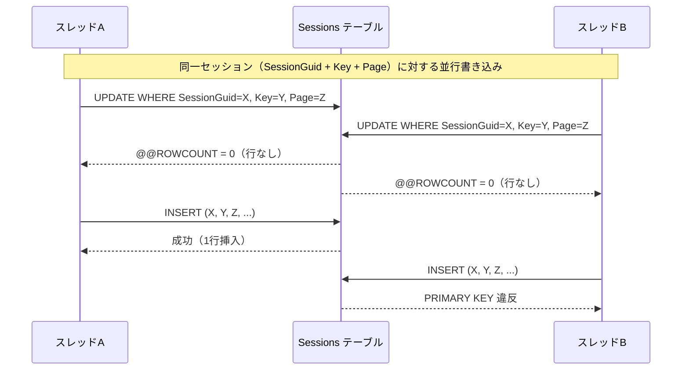
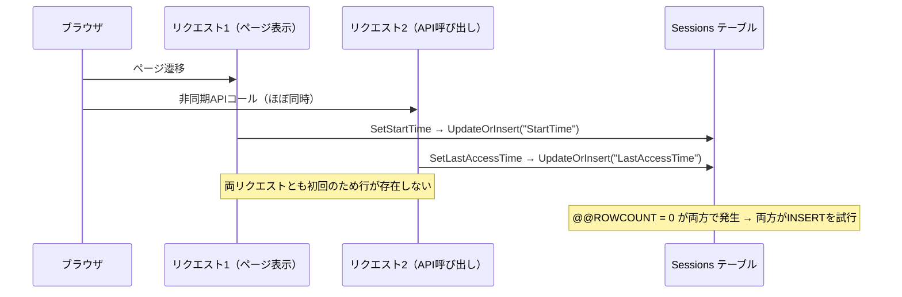
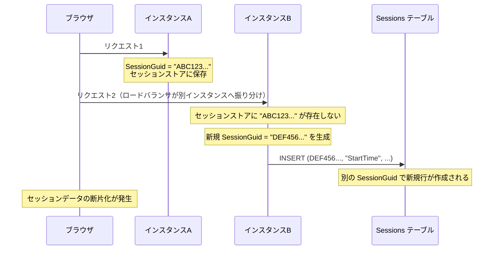

# Sessions テーブル PRIMARY KEY 違反

Sessions テーブルへのデータ挿入時に発生する PRIMARY KEY 違反（重複キーエラー）の原因を調査し、発生メカニズムと対策を整理します。

<!-- START doctoc generated TOC please keep comment here to allow auto update -->
<!-- DON'T EDIT THIS SECTION, INSTEAD RE-RUN doctoc TO UPDATE -->

- [調査情報](#調査情報)
- [調査目的](#調査目的)
- [Sessions テーブルの構造](#sessions-テーブルの構造)
    - [主キー構成](#主キー構成)
- [主キー各カラムの値生成ロジック](#主キー各カラムの値生成ロジック)
    - [SessionGuid の生成](#sessionguid-の生成)
    - [Key の生成](#key-の生成)
    - [Page の生成](#page-の生成)
- [UpdateOrInsert パターンの実装](#updateorinsert-パターンの実装)
    - [SetRds メソッド](#setrds-メソッド)
    - [SQL 生成パターン（データベース別）](#sql-生成パターンデータベース別)
- [レースコンディションの発生メカニズム](#レースコンディションの発生メカニズム)
    - [結論: PRIMARY KEY 違反は発生し得る](#結論-primary-key-違反は発生し得る)
    - [発生シーケンス](#発生シーケンス)
    - [発生条件](#発生条件)
    - [脆弱な時間窓](#脆弱な時間窓)
- [発生しやすい具体的シナリオ](#発生しやすい具体的シナリオ)
    - [新規セッション確立時](#新規セッション確立時)
    - [主要な呼び出し箇所](#主要な呼び出し箇所)
- [データベース別の影響度](#データベース別の影響度)
- [PaaS マルチインスタンス環境での考慮事項](#paas-マルチインスタンス環境での考慮事項)
    - [GUID 衝突の可能性](#guid-衝突の可能性)
    - [PaaS マルチインスタンスで実際に起きる問題](#paas-マルチインスタンスで実際に起きる問題)
    - [耐衝突性のある構成](#耐衝突性のある構成)
- [対策案](#対策案)
    - [短期対策: トランザクション + リトライ](#短期対策-トランザクション--リトライ)
    - [中期対策: データベースネイティブのUPSERT構文の採用](#中期対策-データベースネイティブのupsert構文の採用)
    - [長期対策: KVS の活用](#長期対策-kvs-の活用)
- [結論](#結論)
- [関連ドキュメント](#関連ドキュメント)

<!-- END doctoc generated TOC please keep comment here to allow auto update -->

## 調査情報

| 調査日       | リポジトリ | ブランチ | タグ/バージョン | コミット    | 備考     |
| ------------ | ---------- | -------- | --------------- | ----------- | -------- |
| 2026年3月6日 | Pleasanter | main     |                 | `34f162a43` | 初回調査 |

## 調査目的

Sessions テーブルへのデータ挿入時に以下のエラーログが出力される事象について、発生の可否と原因を明らかにする。

```text
PRIMARY KEY 違反。オブジェクト 'dbo.Sessions' には重複するキーを挿入できません。
```

---

## Sessions テーブルの構造

### 主キー構成

Sessions テーブルは以下の 3 カラムによる複合主キーを持つ。

| カラム        | 型            | PK  | 説明             |
| ------------- | ------------- | --- | ---------------- |
| `SessionGuid` | nvarchar(32)  | 1   | セッション識別子 |
| `Key`         | nvarchar(256) | 2   | セッションキー   |
| `Page`        | nvarchar(32)  | 3   | ページ名         |
| `Value`       | nvarchar(max) |     | セッション値     |
| `ReadOnce`    | bit           |     | 1回読み取り削除  |
| `UserArea`    | bit           |     | ユーザーエリア   |
| `Creator`     | int           |     | 作成者           |
| `Updator`     | int           |     | 更新者           |
| `CreatedTime` | datetime      |     | 作成日時         |
| `UpdatedTime` | datetime      |     | 更新日時         |

---

## 主キー各カラムの値生成ロジック

Sessions テーブルの主キーは `(SessionGuid, Key, Page)` の 3 カラムで構成される。各カラムの値は以下のように生成される。

### SessionGuid の生成

**ファイル**:

- `Implem.Libraries/Utilities/Strings.cs`（行番号: 33-39）
- `Implem.Pleasanter/Libraries/Requests/Context.cs`（行番号: 48, 303-322）

SessionGuid は `Strings.NewGuid()` で生成される。内部実装は以下の通り。

```csharp
public static string NewGuid()
{
    return Guid.NewGuid()
        .ToString()
        .Replace("-", string.Empty)
        .ToUpper();
}
```

生成される値はハイフンなしの大文字 32 文字の GUID（例: `"A1B2C3D4E5F6789012345678ABCDEF01"`）である。

Context のインスタンス生成時にデフォルト値として `Strings.NewGuid()` が実行され、`SetSessionGuid()` で ASP.NET Core のセッションストアと同期される。

```csharp
// Context.cs 行番号: 48
public string SessionGuid { get; set; } = Strings.NewGuid();

// Context.cs 行番号: 303-322
private void SetSessionGuid()
{
    var sessionGuid = GetSessionData<string>("SessionGuid");
    if (!string.IsNullOrWhiteSpace(sessionGuid))
    {
        SessionGuid = sessionGuid;  // 既存セッションから復元
    }
    else
    {
        SetSessionData("SessionGuid", SessionGuid);  // 新規の場合はセッションに保存
    }
}
```

ただし、以下の特殊な SessionGuid が使用される場合がある。

| SessionGuid                          | 設定箇所                                  | 用途                          |
| ------------------------------------ | ----------------------------------------- | ----------------------------- |
| `Strings.NewGuid()` の結果           | `Context.cs`（デフォルト）                | 通常のブラウザセッション      |
| `"@" + context.UserId`               | `SessionUtilities.SetByApi()`、`Views.cs` | ユーザ単位保存（SavePerUser） |
| `"SessionExclusive"`                 | `SessionExclusive.cs`                     | テーブル排他制御用            |
| `"@AspNetCoreDataProtectionKeys"`    | `AspNetCoreKeyManagementXmlRepository.cs` | ASP.NET Core データ保護キー   |
| `Strings.NewGuid()` の別インスタンス | `AuthenticationTicketStore.StoreAsync()`  | 認証チケット保存用            |

### Key の生成

Key カラムには**アプリケーションコードが設定する論理名（文字列リテラル）** が格納される。GUID や UUID ではなく、用途を示す固定文字列である。

主要な Key 値と設定箇所を以下に示す。

| Key                                | 設定箇所                                                  | 設定タイミング             |
| ---------------------------------- | --------------------------------------------------------- | -------------------------- |
| `"StartTime"`                      | `SessionUtilities.SetStartTime()`                         | セッション開始時           |
| `"LastAccessTime"`                 | `SessionUtilities.SetLastAccessTime()`                    | 毎リクエスト（アクセス時） |
| `"AuthenticationTicket"`           | `AuthenticationTicketStore.StoreAsync()` / `RenewAsync()` | ログイン時/チケット更新時  |
| `"View"`                           | `Views.SetSession()`                                      | ビュー設定の保存時         |
| `"ViewMode"`                       | `ViewModes`                                               | ビューモード切り替え時     |
| `"Message"`                        | `SessionUtilities.Set(Context, Message)`                  | メッセージ表示時           |
| `"ExceptionSiteId"`                | `HandleErrorExAttribute`                                  | 例外発生時                 |
| `"Language"`                       | `Context.cs`                                              | 言語設定時                 |
| `"Responsive"`                     | `ResourcesController`                                     | レスポンシブモード切替時   |
| `"User_{任意のキー}"`              | `SessionUtilities.SetUserArea()`（Sessions API 経由）     | ユーザ定義セッション保存時 |
| `"MonitorChangesColumns"`          | `SiteModel`                                               | サイト設定編集時           |
| `"TitleColumns"`                   | `SiteModel`                                               | サイト設定編集時           |
| `"Export"`                         | `SiteModel`                                               | サイト設定編集時           |
| `"DisableSiteCreatorPermission"`   | `SiteModel`                                               | サイト設定編集時           |
| `"TableExclusive_SiteId={SiteId}"` | `TableExclusive`（`SessionExclusive` の派生クラス）       | テーブル排他制御時         |
| DataProtection の friendlyName     | `AspNetCoreKeyManagementXmlRepository.StoreElement()`     | ASP.NET Core 鍵管理        |

Sessions API を通じてユーザが任意のキーを保存する場合、Key には `"User_"` プレフィックスが自動付与される（`SessionUtilities.SetUserArea()` の処理による）。

### Page の生成

**ファイル**: `Implem.Pleasanter/Libraries/Requests/Context.cs`（行番号: 365-386）

Page カラムは `context.Page` の値が格納されるが、`SetRds()` の `page` パラメータが `false` の場合は空文字列 `""` が設定される。

```csharp
string pageName = page
    ? context.Page ?? string.Empty
    : string.Empty;
```

`context.Page` はコントローラの種類に応じて以下のように構築される。

| コントローラ | Page の値                                                           | 例                     |
| ------------ | ------------------------------------------------------------------- | ---------------------- |
| `items`      | `"{controller}/{SiteId}"` または `"{controller}/{SiteId}/trashbox"` | `"items/12345"`        |
| `groups`     | `"{controller}"`                                                    | `"groups"`             |
| `users`      | `"{controller}/{Id}"` または `"{controller}"`                       | `"users/7"`, `"users"` |
| その他       | `"{controller}"`                                                    | `"tenants"`            |

多くの呼び出しは `page: false` で行われるため、Page は空文字列となる。`page: true` が使用されるのはビュー設定やサイト設定など、ページ固有のデータを保存する場合に限られる。

---

## UpdateOrInsert パターンの実装

Sessions テーブルへの書き込みは `SessionUtilities.SetRds()` を経由し、`Rds.UpdateOrInsertSessions()` を使用する。

### SetRds メソッド

**ファイル**: `Implem.Pleasanter/Models/Sessions/SessionUtilities.cs`（行番号: 140-192）

```csharp
private static void SetRds(
    Context context,
    string key,
    string value,
    bool readOnce,
    bool page,
    bool userArea,
    string sessionGuid = null)
{
    if (value != null)
    {
        string pageName = page
            ? context.Page ?? string.Empty
            : string.Empty;
        sessionGuid = sessionGuid ?? context.SessionGuid;
        if (Parameters.Session.UseKeyValueStore && !userArea)
        {
            // Redis に保存（省略）
        }
        else
        {
            Repository.ExecuteNonQuery(
            context: context,
            statements: Rds.UpdateOrInsertSessions(
                param: Rds.SessionsParam()
                    .SessionGuid(sessionGuid)
                    .Key(key)
                    .Page(pageName)
                    .Value(value)
                    .ReadOnce(readOnce)
                    .UserArea(userArea),
                where: Rds.SessionsWhere()
                    .SessionGuid(sessionGuid)
                    .Key(key)
                    .Page(context.Page ?? string.Empty, _using: page)));
        }
    }
    else
    {
        Remove(context: context, key: key, page: page);
    }
}
```

注目すべき点は `Repository.ExecuteNonQuery()` の呼び出しで `transactional: false`（デフォルト値）のまま実行されていることである。

### SQL 生成パターン（データベース別）

`UpdateOrInsert` は UPDATE の結果に応じて INSERT にフォールバックするパターンで実装されているが、データベースごとに SQL の構成が異なる。

#### SQL Server

**ファイル**: `Rds/Implem.SqlServer/SqlServerCommandText.cs`（行番号: 60-79）

```sql
UPDATE "Sessions"
  SET "Updator"=@U, "UpdatedTime"=GETUTCDATE(),
      "Value"=@Value, "ReadOnce"=@ReadOnce, "UserArea"=@UserArea
  WHERE "SessionGuid"=@SessionGuid AND "Key"=@Key AND "Page"=@Page

IF @@ROWCOUNT = 0
  INSERT INTO "Sessions"
    ("Creator","Updator","SessionGuid","Key","Page","Value","ReadOnce","UserArea")
  VALUES
    (@U, @U, @SessionGuid, @Key, @Page, @Value, @ReadOnce, @UserArea)
```

SQL Server では `UPDATE` + `IF @@ROWCOUNT = 0 INSERT` パターンで実装される。UPDATE と INSERT は単一バッチとして送信されるが、**トランザクションでは保護されていない**。

#### PostgreSQL

**ファイル**: `Rds/Implem.PostgreSql/PostgreSqlCommandText.cs`（行番号: 64-91）

```sql
WITH CTE1 AS (
  UPDATE "Sessions"
    SET "Updator"=@U, "UpdatedTime"=now() at time zone 'UTC',
        "Value"=@Value, "ReadOnce"=@ReadOnce, "UserArea"=@UserArea
    WHERE "SessionGuid"=@SessionGuid AND "Key"=@Key AND "Page"=@Page
    RETURNING 0
)
INSERT INTO "Sessions"
  ("Creator","Updator","SessionGuid","Key","Page","Value","ReadOnce","UserArea")
SELECT @U, @U, @SessionGuid, @Key, @Page, @Value, @ReadOnce, @UserArea
WHERE NOT EXISTS(SELECT * FROM CTE1)
```

PostgreSQL では CTE を用いて UPDATE と INSERT を単一の文として結合する。MVCC により UPDATE で行ロックを取得するが、行が存在しない場合は**ロックが発生しないため、同じ脆弱性がある**。

#### MySQL

**ファイル**: `Rds/Implem.MySql/MySqlCommandText.cs`（行番号: 71-90）

```sql
UPDATE `Sessions` SET ...
  WHERE `SessionGuid`=@SessionGuid AND `Key`=@Key AND `Page`=@Page;

INSERT INTO `Sessions` (`Creator`,`Updator`,`SessionGuid`,`Key`,`Page`,...)
  SELECT ... FROM (SELECT ...) AS tmp
  WHERE NOT EXISTS (SELECT 1 FROM `Sessions`
    WHERE `SessionGuid`=@SessionGuid AND `Key`=@Key AND `Page`=@Page)
```

MySQL では UPDATE と INSERT が完全に分離された 2 つの文として実行される。

---

## レースコンディションの発生メカニズム

### 結論: PRIMARY KEY 違反は発生し得る

UpdateOrInsert パターンは**アトミックではない**ため、同一キーに対する並行書き込みで PRIMARY KEY 違反が発生する。

### 発生シーケンス



### 発生条件

以下の条件がすべて揃ったときに発生する。

| 条件                   | 説明                                                                 |
| ---------------------- | -------------------------------------------------------------------- |
| 同一キーの並行書き込み | 同じ `(SessionGuid, Key, Page)` に対して複数スレッドが同時に書き込む |
| 行が未存在             | 対象の行が Sessions テーブルにまだ存在しない（UPDATE が空振りする）  |
| トランザクション未使用 | `transactional: false`（デフォルト値）のまま呼び出されている         |
| ロック不在             | UPDATE 対象行が存在しない場合、行ロックが取得されずギャップが生じる  |

### 脆弱な時間窓

```mermaid
flowchart LR
    A[UPDATE実行] --> B{@@ROWCOUNT > 0?}
    B -->|Yes| C[終了: 更新成功]
    B -->|No| D["脆弱な時間窓"]
    D --> E[INSERT実行]
    E --> F{成功?}
    F -->|Yes| G[終了: 挿入成功]
    F -->|No| H[PRIMARY KEY 違反]

    style D fill:#fee,stroke:#f00,stroke-width:2px
```

UPDATE が 0 行を返してから INSERT を実行するまでの間が「脆弱な時間窓」である。この間に別のスレッドが同じキーで INSERT を完了すると、後続の INSERT は PRIMARY KEY 違反を引き起こす。

---

## 発生しやすい具体的シナリオ

### 新規セッション確立時

ユーザがログイン直後にページを素早く開くと、セッション関連のデータが初めて挿入される。



### 主要な呼び出し箇所

SessionUtilities.Set が呼び出される箇所は多岐にわたる。以下は代表的な呼び出し元である。

| 呼び出し元                               | キー                     | 発生タイミング     |
| ---------------------------------------- | ------------------------ | ------------------ |
| `SessionUtilities.SetStartTime()`        | `StartTime`              | セッション開始時   |
| `SessionUtilities.SetLastAccessTime()`   | `LastAccessTime`         | 毎リクエスト       |
| `AuthenticationTicketStore.StoreAsync()` | `AuthenticationTicket`   | ログイン時         |
| `AuthenticationTicketStore.RenewAsync()` | `AuthenticationTicket`   | 認証チケット更新時 |
| `ViewModes`                              | `View`                   | ビュー切り替え時   |
| `HandleErrorExAttribute`                 | `Message`                | エラー発生時       |
| `SiteModel`                              | セッションプロパティ各種 | サイト設定編集時   |

特に `SetLastAccessTime()` は Context の `SessionRequestInterval()` から呼び出され、セッション情報を取得するたびに実行される可能性がある。

---

## データベース別の影響度

| データベース | UpdateOrInsert パターン         | 影響度 | 理由                                             |
| ------------ | ------------------------------- | ------ | ------------------------------------------------ |
| SQL Server   | `IF @@ROWCOUNT = 0 INSERT`      | 高     | 単一バッチだがトランザクション保護なし           |
| PostgreSQL   | `CTE + WHERE NOT EXISTS`        | 中     | 単一文だが行未存在時はロックなし                 |
| MySQL        | UPDATE + INSERT の 2 文分離実行 | 高     | 完全に分離された文のため、より広い脆弱性窓を持つ |

---

## PaaS マルチインスタンス環境での考慮事項

PaaS 環境でアプリケーションインスタンスを複製・並列化した場合の
SessionGuid 衝突リスクと対策について整理する。

### GUID 衝突の可能性

`Guid.NewGuid()`（.NET の v4 UUID）は 122 ビットの暗号論的乱数で構成される。
衝突確率は約 2^-61/ペアであり、
仮に 10 億セッションを生成しても衝突確率は約 10^-19 である。

PaaS でインスタンスを複製した場合でも、
各プロセスの `Guid.NewGuid()` は OS レベルの CSPRNG
（暗号論的擬似乱数生成器）を独立にシードするため、
**インスタンス複製が原因で GUID が衝突することは実質的にない**。

### PaaS マルチインスタンスで実際に起きる問題

GUID 衝突よりも深刻な問題は、ASP.NET Core セッションストアの構成にある。

**ファイル**: `Implem.Pleasanter/Startup.cs`（行番号: 99）

```csharp
services.AddDistributedMemoryCache();  // インメモリ（プロセス内）
services.AddSession(options =>
{
    options.IdleTimeout =
        TimeSpan.FromMinutes(Parameters.Session.RetentionPeriod);
});
```

`AddDistributedMemoryCache()` はプロセス内メモリに限定される。
複数インスタンス間で ASP.NET Core セッション状態は共有されない。

その結果、以下の問題が発生する。



この構成では GUID 衝突ではなく**セッションの断片化**が起きる。
リクエストごとに異なる SessionGuid が使用されるため、
セッションデータの一貫性が失われる。

### 耐衝突性のある構成

PaaS マルチインスタンス環境に対応するには、
以下の 2 つのレイヤーの両方を適切に構成する必要がある。

#### 1. ASP.NET Core セッションストアの分散化

ASP.NET Core のセッション状態をインスタンス間で共有するため、
分散キャッシュに切り替える。

```csharp
// 現在の実装（インメモリ: 単一インスタンスのみ有効）
services.AddDistributedMemoryCache();

// 改善案: Redis を分散キャッシュとして使用
services.AddStackExchangeRedisCache(options =>
{
    options.Configuration = "redis-connection-string";
});
```

これにより、どのインスタンスがリクエストを処理しても
同一の SessionGuid が復元される。

#### 2. Sessions テーブルの書き込みをアトミック化

セッションストアを分散化しても、本ドキュメントで分析した
UpdateOrInsert のレースコンディションは依然として残る。
UPSERT 構文への置き換え（中期対策）が必要である。

#### 3. KVS（Redis）の活用

`Parameters.Session.UseKeyValueStore = true` とすれば、
Sessions テーブルへの書き込みと ASP.NET Core セッションの
両方を Redis で処理できる。
Redis の `HashSet` はアトミックであるため、
マルチインスタンス環境でもレースコンディションは発生しない。

| 対策                               | セッション共有 | PK 違反回避 | 備考                               |
| ---------------------------------- | -------------- | ----------- | ---------------------------------- |
| スティッキーセッション             | 不要           | 不十分      | インスタンス障害時にセッション喪失 |
| 分散キャッシュ + 現行 SQL          | 共有可         | 不十分      | UpdateOrInsert のレースは残る      |
| 分散キャッシュ + UPSERT            | 共有可         | 回避可      | DB ごとに SQL 実装の変更が必要     |
| `UseKeyValueStore = true`（Redis） | 共有可         | 回避可      | UserArea は RDB のまま残る点に注意 |

---

## 対策案

### 短期対策: トランザクション + リトライ

`SetRds()` で `transactional: true` を指定し、PRIMARY KEY 違反発生時にはリトライする。

```csharp
// 現在の実装（transactional: false がデフォルト）
Repository.ExecuteNonQuery(
    context: context,
    statements: Rds.UpdateOrInsertSessions(...));

// 改善案
Repository.ExecuteNonQuery(
    context: context,
    transactional: true,  // トランザクションを有効化
    statements: Rds.UpdateOrInsertSessions(...));
```

ただし、`READ COMMITTED`（SQL Server のデフォルト分離レベル）ではレースコンディション自体は回避できない。エラーハンドリング（try-catch + リトライ）が追加で必要となる。

### 中期対策: データベースネイティブのUPSERT構文の採用

各データベースが提供するアトミックな UPSERT 構文に置き換える。

| データベース | 推奨構文                               | 特徴                      |
| ------------ | -------------------------------------- | ------------------------- |
| SQL Server   | `MERGE ... WHEN MATCHED / NOT MATCHED` | 単一文でアトミック        |
| PostgreSQL   | `INSERT ... ON CONFLICT DO UPDATE`     | 主キー/ユニーク制約ベース |
| MySQL        | `INSERT ... ON DUPLICATE KEY UPDATE`   | 主キー/ユニーク制約ベース |

PostgreSQL での例:

```sql
INSERT INTO "Sessions"
  ("Creator","Updator","SessionGuid","Key","Page","Value","ReadOnce","UserArea")
VALUES
  (@U, @U, @SessionGuid, @Key, @Page, @Value, @ReadOnce, @UserArea)
ON CONFLICT ("SessionGuid", "Key", "Page")
DO UPDATE SET
  "Updator" = @U,
  "UpdatedTime" = now() at time zone 'UTC',
  "Value" = @Value,
  "ReadOnce" = @ReadOnce,
  "UserArea" = @UserArea;
```

### 長期対策: KVS の活用

`Parameters.Session.UseKeyValueStore = true` とし、Redis を使用する。
Redis の `HashSet` はアトミックな操作であり、PRIMARY KEY 違反は原理的に発生しない。
ただし、UserArea データは常に RDB に保存されるため、UserArea に対しては引き続きこの問題が残る。

---

## 結論

| 項目                       | 内容                                                                                                      |
| -------------------------- | --------------------------------------------------------------------------------------------------------- |
| PRIMARY KEY 違反の発生可否 | 発生し得る                                                                                                |
| 原因                       | `UpdateOrInsert` パターンがアトミックでないため、同一キーへの並行書き込みでレースコンディションが発生する |
| 発生しやすいシナリオ       | 新規セッション確立直後の並行リクエスト（ページ表示と非同期 API コールの同時実行等）                       |
| 影響範囲                   | SQL Server / PostgreSQL / MySQL すべてで発生し得る                                                        |
| エラーの影響               | セッションデータの保存に失敗するが、次回リクエストで再試行されるため致命的ではない                        |
| 推奨対策                   | データベースネイティブの UPSERT 構文（`MERGE` / `ON CONFLICT` / `ON DUPLICATE KEY UPDATE`）への置き換え   |

---

## 関連ドキュメント

- [Sessions API セッション有効期間](001-セッション有効期間.md)
- [Session 管理の実装](002-セッション管理.md)
- [Upsert API 実装](../03-データ操作・API/001-Upsert-API.md)（同様のレースコンディションの分析）
