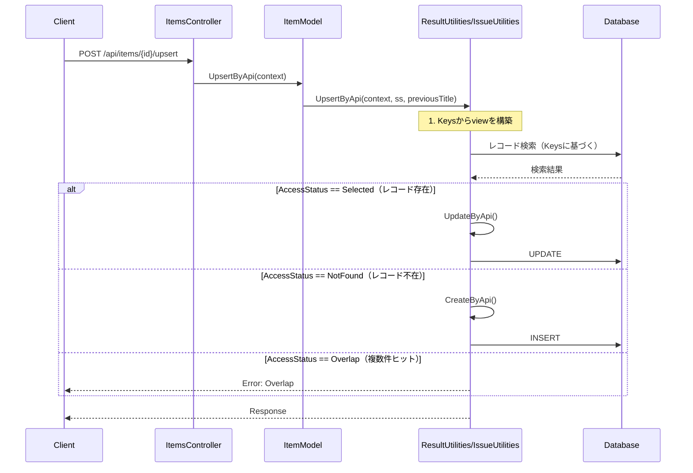
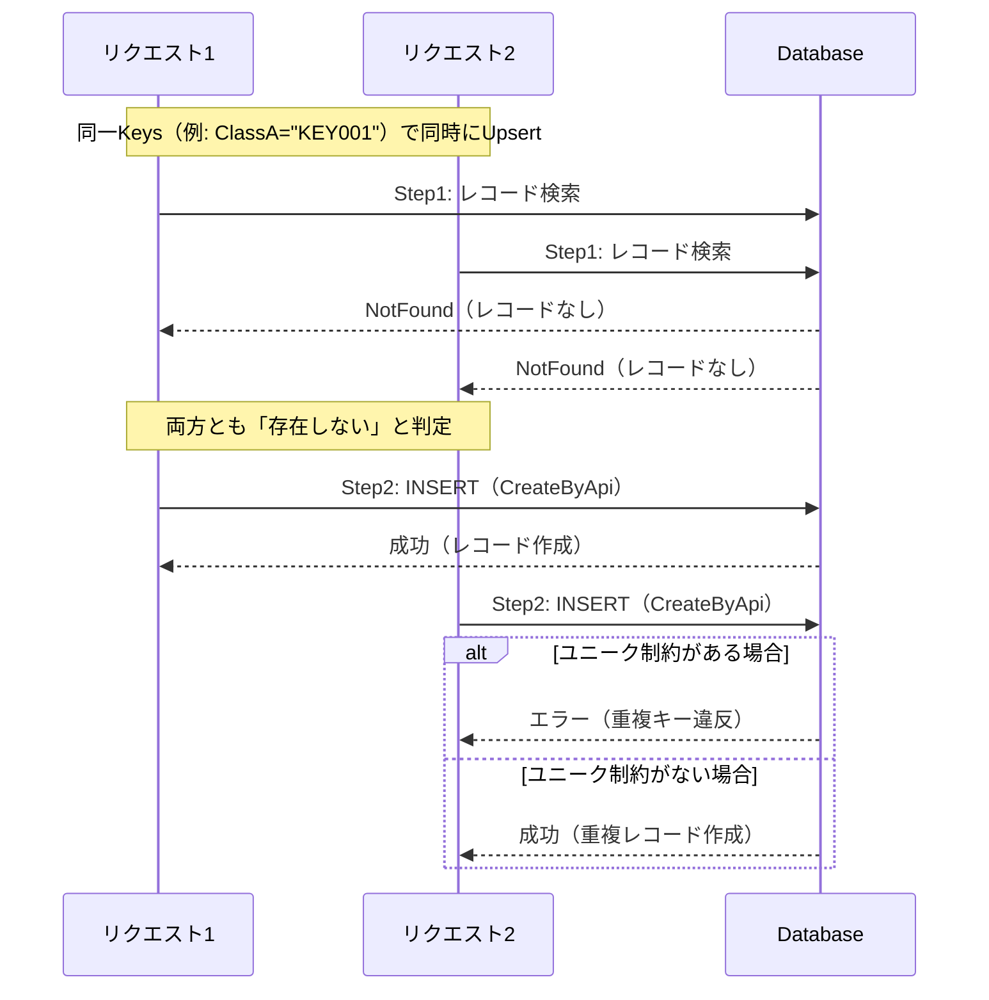

# Upsert API 実装

このドキュメントでは、プリザンター本体の Upsert API 実装について調査した内容をまとめます。

<!-- START doctoc generated TOC please keep comment here to allow auto update -->
<!-- DON'T EDIT THIS SECTION, INSTEAD RE-RUN doctoc TO UPDATE -->

- [調査情報](#調査情報)
- [調査目的](#調査目的)
- [エンドポイント](#エンドポイント)
- [実装箇所](#実装箇所)
    - [コントローラー](#コントローラー)
    - [ビジネスロジック](#ビジネスロジック)
- [処理フロー](#処理フロー)
- [実装の詳細（ResultUtilities.UpsertByApi）](#実装の詳細resultutilitiesupsertbyapi)
- [レースコンディションの発生メカニズム](#レースコンディションの発生メカニズム)
    - [問題の概要](#問題の概要)
    - [競合シナリオ](#競合シナリオ)
    - [発生条件](#発生条件)
    - [発生結果](#発生結果)
- [対策](#対策)
    - [プリザンター側での対策（未実装）](#プリザンター側での対策未実装)
    - [クライアント側での対策](#クライアント側での対策)
- [注意事項](#注意事項)
- [関連リンク](#関連リンク)

<!-- END doctoc generated TOC please keep comment here to allow auto update -->

## 調査情報

| 調査日     | リポジトリ | ブランチ | タグ/バージョン | コミット                                 | 備考     |
| ---------- | ---------- | -------- | --------------- | ---------------------------------------- | -------- |
| 2026-02-03 | Pleasanter | main     |                 | 調査時点の最新（コミットハッシュ未取得） | 初回調査 |

## 調査目的

同一Keysで短期間に連続してUpsertを発行した場合のレースコンディション問題について、プリザンター側の実装を調査する。

---

## エンドポイント

| エンドポイント                    | 説明                             |
| --------------------------------- | -------------------------------- |
| `POST /api/items/{id}/Upsert`     | 単一レコードの作成または更新     |
| `POST /api/items/{id}/BulkUpsert` | 複数レコードの一括作成または更新 |

---

## 実装箇所

### コントローラー

**ファイル**: `Implem.Pleasanter/Controllers/Api/ItemsController.cs`

```csharp
[HttpPost("{id}/Upsert")]
public ContentResult Upsert(long id)
{
    var body = default(string);
    using (var reader = new StreamReader(Request.Body)) body = reader.ReadToEnd();
    var context = new Context(
        sessionStatus: User?.Identity?.IsAuthenticated == true,
        sessionData: User?.Identity?.IsAuthenticated == true,
        apiRequestBody: body,
        contentType: Request.ContentType,
        api: true);
    var log = new SysLogModel(context: context);
    var result = context.Authenticated
        ? new ItemModel(context: context, referenceId: id).UpsertByApi(context: context)
        : ApiResults.Unauthorized(context: context);
    log.Finish(context: context, responseSize: result.Content.Length);
    return result.ToHttpResponse(request: Request);
}
```

### ビジネスロジック

**ファイル**: `Implem.Pleasanter/Models/Results/ResultUtilities.cs`（ResultテーブルのUpsert）
**ファイル**: `Implem.Pleasanter/Models/Issues/IssueUtilities.cs`（IssueテーブルのUpsert）

---

## 処理フロー



---

## 実装の詳細（ResultUtilities.UpsertByApi）

```csharp
public static ContentResultInheritance UpsertByApi(
    Context context,
    SiteSettings ss,
    string previousTitle)
{
    // 1. リクエストのバリデーション
    if (!Mime.ValidateOnApi(contentType: context.ContentType))
    {
        return ApiResults.BadRequest(context: context);
    }

    var api = context.RequestDataString.Deserialize<Api>();
    var resultApiModel = context.RequestDataString.Deserialize<ResultApiModel>();

    if (api?.Keys?.Any() != true || resultApiModel == null)
    {
        return ApiResults.Error(
            context: context,
            errorData: new ErrorData(type: Error.Types.InvalidJsonData));
    }

    // 2. Keysのバリデーション
    var (isValid, missingKeys) = ValidateJsonKeys(jsonString: context.RequestDataString, ss: ss);
    if (!isValid)
    {
        return ApiResults.Error(
            context: context,
            errorData: new ErrorData(
                type: Error.Types.InvalidUpsertKey,
                data: $"({string.Join(", ", missingKeys)})"));
    }

    // 3. Keysに基づいてviewを構築
    var view = api.View ?? new View();
    foreach (var columnName in api.Keys)
    {
        var objectValue = resultApiModel.ObjectValue(columnName: columnName);
        if (objectValue == null) continue;

        var column = ss.GetColumn(context: context, columnName: columnName);

        view.AddColumnFilterHash(
            context: context,
            ss: ss,
            column: column,
            objectValue: objectValue);
        view.AddColumnFilterSearchTypes(
            columnName: columnName,
            searchType: Column.SearchTypes.ExactMatch);
    }

    // 4. レコードを検索（★ここで存在確認）
    var resultModel = new ResultModel(
        context: context,
        ss: ss,
        resultId: 0,
        view: view,
        resultApiModel: resultApiModel);

    // 5. AccessStatusに基づいて処理を分岐（★ロックなし）
    switch (resultModel.AccessStatus)
    {
        case Databases.AccessStatuses.Selected:
            // 存在する → 更新
            return UpdateByApi(
                context: context,
                ss: ss,
                resultId: resultModel.ResultId,
                previousTitle: previousTitle);

        case Databases.AccessStatuses.NotFound:
            // 存在しない → 作成
            return CreateByApi(context: context, ss: ss);

        case Databases.AccessStatuses.Overlap:
            // 複数件ヒット → エラー
            return ApiResults.Get(ApiResponses.Overlap(context: context));

        default:
            return ApiResults.Get(ApiResponses.NotFound(context: context));
    }
}
```

---

## レースコンディションの発生メカニズム

### 問題の概要

Upsert処理は以下の2ステップで構成されています：

1. **Step 1**: Keysに基づいてレコードを検索（存在確認）
2. **Step 2**: 検索結果に基づいてCreate（INSERT）またはUpdate（UPDATE）を実行

**この2ステップの間にロック（排他制御）が存在しない**ため、同一Keysで短期間に複数のリクエストが発行された場合、以下のような競合が発生します。

### 競合シナリオ



### 発生条件

| 条件             | 説明                                                            |
| ---------------- | --------------------------------------------------------------- |
| 同一Keys         | 複数のリクエストが同じKeysと値の組み合わせを使用                |
| 短期間に連続発行 | Step1（検索）とStep2（更新/作成）の間に別のリクエストが割り込む |
| 初回作成時       | 特に「レコードが存在しない」状態からの初回作成時に発生しやすい  |

### 発生結果

| 結果               | 条件                         | 説明                                       |
| ------------------ | ---------------------------- | ------------------------------------------ |
| 重複キー違反エラー | Keysにユニーク制約がある場合 | 2件目のINSERTが失敗                        |
| 重複レコード作成   | Keysにユニーク制約がない場合 | 同一Keysで複数レコードが作成される         |
| 更新の競合         | 既存レコードへの同時更新     | 後勝ちで更新される（データ不整合の可能性） |

---

## 対策

### プリザンター側での対策（未実装）

理想的には以下のいずれかの対策がプリザンター側で実装されるべきです：

1. **悲観的ロック**: 検索時に行ロック（SELECT FOR UPDATE）を取得
2. **楽観的ロック**: バージョン番号やタイムスタンプによる競合検出
3. **MERGE/UPSERT文**: データベースのネイティブUPSERT機能を使用

### クライアント側での対策

クライアント側では以下の対策を検討してください：

#### 1. アプリケーション設計での回避

```csharp
// 同一Keysに対する並列呼び出しを避ける設計
// 例: キューを使用した逐次処理
var queue = new ConcurrentQueue<UpsertRequest>();
// 単一のワーカーが順次処理
```

#### 2. セマフォによる排他制御

```csharp
// Keysごとにセマフォを管理
private static readonly ConcurrentDictionary<string, SemaphoreSlim> _locks = new();

public async Task<ApiResponse<UpsertRecordResponse>> UpsertWithLockAsync(
    long siteId,
    UpsertRecordRequest request,
    CancellationToken cancellationToken = default)
{
    // Keysと値からロックキーを生成
    var lockKey = GenerateLockKey(siteId, request.Keys, request);
    var semaphore = _locks.GetOrAdd(lockKey, _ => new SemaphoreSlim(1, 1));

    await semaphore.WaitAsync(cancellationToken);
    try
    {
        return await client.UpsertRecordAsync(siteId, request, cancellationToken: cancellationToken);
    }
    finally
    {
        semaphore.Release();
    }
}
```

#### 3. リトライ機構

```csharp
// 競合エラー発生時のリトライ
public async Task<ApiResponse<UpsertRecordResponse>> UpsertWithRetryAsync(
    long siteId,
    UpsertRecordRequest request,
    int maxRetries = 3,
    CancellationToken cancellationToken = default)
{
    for (int i = 0; i < maxRetries; i++)
    {
        var response = await client.UpsertRecordAsync(siteId, request, cancellationToken: cancellationToken);

        if (response.IsSuccess || !IsConflictError(response))
        {
            return response;
        }

        // 指数バックオフ
        await Task.Delay(TimeSpan.FromMilliseconds(100 * Math.Pow(2, i)), cancellationToken);
    }

    throw new InvalidOperationException("Upsert failed after retries due to conflicts");
}
```

---

## 注意事項

- クライアント側でのロックは**同一プロセス内でのみ有効**です
- 複数プロセス/複数サーバーからの並列呼び出しには対応できません
- 分散環境での排他制御が必要な場合は、分散ロック（Redis等）の導入を検討してください

---

## 関連リンク

- [レコード作成・更新 - items/{siteId}/upsert](../wiki/01-テーブル操作-08-テーブル-作成・更新.md)
- [レコード一括作成・更新 - items/{siteId}/bulkupsert](../wiki/01-テーブル操作-09-テーブル-一括作成・更新.md)
