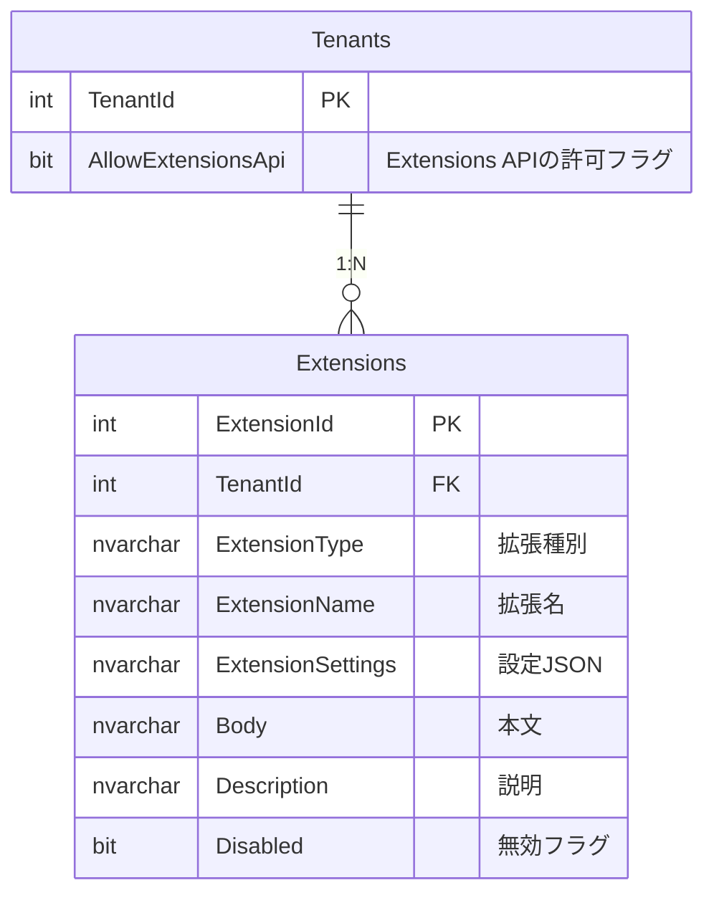
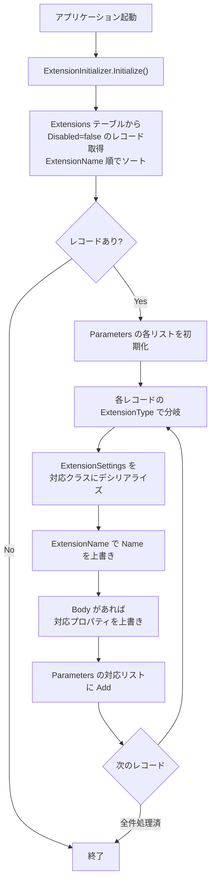

# Extensions テーブルの使用法

Extensions テーブルは、プリザンターの拡張機能（拡張フィールド・拡張スクリプト・拡張SQL等）を
データベースで管理するためのテーブルである。
従来 JSON ファイルで管理していた拡張設定を DB 管理に移行し、API 経由での CRUD 操作を可能にする。

<!-- START doctoc generated TOC please keep comment here to allow auto update -->
<!-- DON'T EDIT THIS SECTION, INSTEAD RE-RUN doctoc TO UPDATE -->

- [調査情報](#調査情報)
- [調査目的](#調査目的)
- [テーブル構造](#テーブル構造)
    - [カラム定義](#カラム定義)
    - [ER 図](#er-図)
- [ExtensionType 一覧と挙動](#extensiontype-一覧と挙動)
    - [対応する ExtensionType 一覧](#対応する-extensiontype-一覧)
- [ExtensionSettings の詳細](#extensionsettings-の詳細)
    - [共通設定（ExtendedBase）](#共通設定extendedbase)
    - [Fields 固有設定（ExtendedField）](#fields-固有設定extendedfield)
    - [ServerScript 固有設定（ExtendedServerScript）](#serverscript-固有設定extendedserverscript)
    - [Sql 固有設定（ExtendedSql）](#sql-固有設定extendedsql)
    - [Script 固有設定（ExtendedScript）](#script-固有設定extendedscript)
    - [Style 固有設定（ExtendedStyle）](#style-固有設定extendedstyle)
    - [Html 固有設定（ExtendedHtml）](#html-固有設定extendedhtml)
    - [NavigationMenu 固有設定（ExtendedNavigationMenu）](#navigationmenu-固有設定extendednavigationmenu)
    - [Plugin 固有設定（ExtendedPlugin）](#plugin-固有設定extendedplugin)
    - [CustomApps（ユーザーテンプレート）](#customappsユーザーテンプレート)
- [初期化の仕組み](#初期化の仕組み)
    - [ExtensionInitializer の処理フロー](#extensioninitializer-の処理フロー)
    - [Body カラムと ExtensionSettings の関係](#body-カラムと-extensionsettings-の関係)
- [Extensions API](#extensions-api)
    - [前提条件](#前提条件)
    - [API エンドポイント](#api-エンドポイント)
    - [リクエスト/レスポンス例](#リクエストレスポンス例)
    - [ExtensionSettings のバリデーション](#extensionsettings-のバリデーション)
    - [拡張 SQL の API 実行](#拡張-sql-の-api-実行)
- [具体的な設定例](#具体的な設定例)
    - [例1: 特定サイトに JavaScript を追加](#例1-特定サイトに-javascript-を追加)
    - [例2: 全サイト共通の CSS スタイル](#例2-全サイト共通の-css-スタイル)
    - [例3: 特定ユーザー向けサーバースクリプト](#例3-特定ユーザー向けサーバースクリプト)
    - [例4: API 実行可能な拡張 SQL](#例4-api-実行可能な拡張-sql)
    - [例5: 特定部署を除外した HTML 差し込み](#例5-特定部署を除外した-html-差し込み)
- [ファイルベースの拡張設定との関係](#ファイルベースの拡張設定との関係)
- [結論](#結論)
- [関連ソースコード](#関連ソースコード)

<!-- END doctoc generated TOC please keep comment here to allow auto update -->

## 調査情報

| 調査日        | リポジトリ | ブランチ           | タグ/バージョン | コミット    | 備考     |
| ------------- | ---------- | ------------------ | --------------- | ----------- | -------- |
| 2026年2月13日 | Pleasanter | Pleasanter_1.5.1.0 |                 | `34f162a43` | 初回調査 |

## 調査目的

- Extensions テーブルの構造と各カラムの役割を明らかにする
- `ExtensionType` ごとに設定すべき値と対応する挙動を整理する
- API 経由での CRUD 操作方法を明らかにする

---

## テーブル構造

### カラム定義

Extensions テーブルは CodeDefiner によって以下のカラムで自動生成される。

| カラム名          | 型            | 制約               | 説明                                          |
| ----------------- | ------------- | ------------------ | --------------------------------------------- |
| ExtensionId       | int           | PK, IDENTITY       | 拡張機能ID（自動採番）                        |
| TenantId          | int           | デフォルト: 0      | テナントID                                    |
| ExtensionType     | nvarchar(128) |                    | 拡張機能種別（後述）                          |
| ExtensionName     | nvarchar(256) | インデックス, LIKE | 拡張機能名                                    |
| ExtensionSettings | nvarchar(max) |                    | 拡張機能設定（JSON 形式）                     |
| Body              | nvarchar(max) | NULL 許容          | 内容（スクリプト本文・SQL 本文・HTML 本文等） |
| Description       | nvarchar(max) | NULL 許容          | 説明                                          |
| Disabled          | bit           | デフォルト: 0      | 無効フラグ（`true` で無効化）                 |
| Ver               | int           |                    | バージョン（共通カラム）                      |
| Comments          | nvarchar(max) |                    | コメント（共通カラム）                        |
| Creator           | int           |                    | 作成者（共通カラム）                          |
| Updator           | int           |                    | 更新者（共通カラム）                          |
| CreatedTime       | datetime      |                    | 作成日時（共通カラム）                        |
| UpdatedTime       | datetime      |                    | 更新日時（共通カラム）                        |

**ファイル**: `Implem.Pleasanter/App_Data/Definitions/Definition_Column/Extensions_*.json`

### ER 図



---

## ExtensionType 一覧と挙動

`ExtensionType` カラムに設定する値により、拡張機能の種類が決定される。
アプリケーション起動時に `ExtensionInitializer.Initialize()` が呼ばれ、
`Disabled = false` のレコードが読み込まれて `Parameters` の各リストに追加される。

**ファイル**: `Implem.Pleasanter/Libraries/Initializers/ExtensionInitializer.cs`

### 対応する ExtensionType 一覧

| ExtensionType    | 対応パラメータ                       | 説明                                     |
| ---------------- | ------------------------------------ | ---------------------------------------- |
| `Fields`         | `Parameters.ExtendedFields`          | 拡張フィールド（カスタム項目の追加）     |
| `Html`           | `Parameters.ExtendedHtmls`           | 拡張HTML（画面への HTML 差し込み）       |
| `NavigationMenu` | `Parameters.ExtendedNavigationMenus` | 拡張ナビゲーションメニュー               |
| `Script`         | `Parameters.ExtendedScripts`         | 拡張スクリプト（クライアント JS）        |
| `ServerScript`   | `Parameters.ExtendedServerScripts`   | 拡張サーバースクリプト                   |
| `Sql`            | `Parameters.ExtendedSqls`            | 拡張SQL                                  |
| `Style`          | `Parameters.ExtendedStyles`          | 拡張スタイル（CSS）                      |
| `Plugin`         | `Parameters.ExtendedPlugins`         | 拡張プラグイン                           |
| `CustomApps`     | （テンプレート用途）                 | ユーザーテンプレート（サイトパッケージ） |

---

## ExtensionSettings の詳細

`ExtensionSettings` カラムには各 `ExtensionType` に応じた JSON を格納する。すべての種別で共通のベース設定（`ExtendedBase`）を持つ。

### 共通設定（ExtendedBase）

**ファイル**: `Implem.ParameterAccessor/Parts/ExtendedBase.cs`

| プロパティ    | 型             | 説明                                           |
| ------------- | -------------- | ---------------------------------------------- |
| Name          | string         | 拡張名（ExtensionName で上書きされる）         |
| SpecifyByName | bool           | `true` の場合、Name 指定で一致するもののみ適用 |
| Path          | string         | パス                                           |
| Description   | string         | 説明                                           |
| Disabled      | bool           | 無効フラグ                                     |
| DeptIdList    | List\<int\>    | 適用対象の部署IDリスト（空 = 全部署）          |
| GroupIdList   | List\<int\>    | 適用対象のグループIDリスト（空 = 全グループ）  |
| UserIdList    | List\<int\>    | 適用対象のユーザーIDリスト（空 = 全ユーザー）  |
| SiteIdList    | List\<long\>   | 適用対象のサイトIDリスト（空 = 全サイト）      |
| IdList        | List\<long\>   | 適用対象のレコードIDリスト（空 = 全レコード）  |
| Controllers   | List\<string\> | 適用コントローラー（空 = 全コントローラー）    |
| Actions       | List\<string\> | 適用アクション（空 = 全アクション）            |
| ColumnList    | List\<string\> | 適用カラムリスト（空 = 全カラム）              |

> **フィルタリングの仕組み**: `ExtensionUtilities.ExtensionWhere<T>()` メソッドで
> 上記リストと現在のコンテキスト（ユーザーID、サイトID 等）を照合し、
> 条件に合致する拡張のみが適用される。
> リストが空の場合は「条件なし（全適用）」として扱われる。
> 否定条件は値の先頭に `-` を付ける（例: `-5` は ID=5 を除外）。

### Fields 固有設定（ExtendedField）

**ファイル**: `Implem.ParameterAccessor/Parts/ExtendedField.cs`

| プロパティ             | 型       | 説明                           |
| ---------------------- | -------- | ------------------------------ |
| FieldType              | string   | フィールドタイプ               |
| TypeName               | string   | DB型名（デフォルト: nvarchar） |
| LabelText              | string   | ラベルテキスト                 |
| ChoicesText            | string   | 選択肢テキスト                 |
| DefaultInput           | string   | デフォルト入力値               |
| EditorFormat           | string   | エディタフォーマット           |
| ControlType            | string   | コントロールタイプ             |
| ValidateRequired       | bool?    | 必須バリデーション             |
| ValidateNumber         | bool?    | 数値バリデーション             |
| ValidateDate           | bool?    | 日付バリデーション             |
| ValidateEmail          | bool?    | メールバリデーション           |
| MaxLength              | decimal? | 最大長                         |
| ValidateMaxLength      | int?     | 最大文字数バリデーション       |
| DecimalPlaces          | int?     | 小数桁数                       |
| Nullable               | bool?    | NULL 許容                      |
| Unit                   | string   | 単位                           |
| Min                    | decimal? | 最小値                         |
| Max                    | decimal? | 最大値                         |
| Step                   | decimal? | ステップ                       |
| AutoPostBack           | bool?    | 自動ポストバック               |
| FieldCss               | string   | フィールド CSS クラス          |
| ControlCss             | string   | コントロール CSS クラス        |
| CheckFilterControlType | int?     | チェックフィルタータイプ       |
| DateTimeStep           | int?     | 日時ステップ                   |
| After                  | string   | 後に配置するカラム名           |
| SqlParam               | bool     | SQL パラメータとして使用       |

### ServerScript 固有設定（ExtendedServerScript）

**ファイル**: `Implem.ParameterAccessor/Parts/ExtendedServerScript.cs`

| プロパティ              | 型     | 説明                                    |
| ----------------------- | ------ | --------------------------------------- |
| WhenloadingSiteSettings | bool?  | サイト設定読込時に実行                  |
| WhenViewProcessing      | bool?  | ビュー処理時に実行                      |
| WhenloadingRecord       | bool?  | レコード読込時に実行                    |
| BeforeFormula           | bool?  | 計算式の前に実行                        |
| AfterFormula            | bool?  | 計算式の後に実行                        |
| BeforeCreate            | bool?  | 作成前に実行                            |
| AfterCreate             | bool?  | 作成後に実行                            |
| BeforeUpdate            | bool?  | 更新前に実行                            |
| AfterUpdate             | bool?  | 更新後に実行                            |
| BeforeDelete            | bool?  | 削除前に実行                            |
| BeforeBulkDelete        | bool?  | 一括削除前に実行                        |
| AfterDelete             | bool?  | 削除後に実行                            |
| AfterBulkDelete         | bool?  | 一括削除後に実行                        |
| BeforeOpeningPage       | bool?  | ページ表示前に実行                      |
| BeforeOpeningRow        | bool?  | 行表示前に実行                          |
| Shared                  | bool?  | 共有スクリプトとして登録                |
| Functionalize           | bool?  | 関数化                                  |
| TryCatch                | bool?  | try-catch でラップ                      |
| Body                    | string | スクリプト本文（Body カラムで上書き可） |

### Sql 固有設定（ExtendedSql）

**ファイル**: `Implem.ParameterAccessor/Parts/ExtendedSql.cs`

| プロパティ                         | 型     | 説明                                                     |
| ---------------------------------- | ------ | -------------------------------------------------------- |
| Api                                | bool   | API 経由での実行を許可                                   |
| DbUser                             | string | DB 接続ユーザー（`Owner` で OwnerConnectionString 使用） |
| Html                               | bool   | HTML 出力用                                              |
| OnCreating / OnCreated             | bool   | レコード作成時に実行                                     |
| OnUpdating / OnUpdated             | bool   | レコード更新時に実行                                     |
| OnUpdatingByGrid / OnUpdatedByGrid | bool   | グリッド更新時に実行                                     |
| OnDeleting / OnDeleted             | bool   | レコード削除時に実行                                     |
| OnBulkUpdating / OnBulkUpdated     | bool   | 一括更新時に実行                                         |
| OnBulkDeleting / OnBulkDeleted     | bool   | 一括削除時に実行                                         |
| OnImporting / OnImported           | bool   | インポート時に実行                                       |
| OnSelectingColumn                  | bool   | SELECT カラム選択時に実行                                |
| OnSelectingWhere                   | bool   | WHERE 句構築時に実行                                     |
| OnSelectingOrderBy                 | bool   | ORDER BY 句構築時に実行                                  |
| OnUseSecondaryAuthentication       | bool   | 二次認証使用時に実行                                     |
| CommandText                        | string | SQL 本文（Body カラムで上書き可）                        |

> **プレースホルダ**: `CommandText` 内で `{{SiteId}}`, `{{Id}}`, `{{Timestamp}}` が使用可能。実行時に現在のコンテキスト値で自動置換される。

### Script 固有設定（ExtendedScript）

**ファイル**: `Implem.ParameterAccessor/Parts/ExtendedScript.cs`

| プロパティ | 型     | 説明                                     |
| ---------- | ------ | ---------------------------------------- |
| Script     | string | JavaScript 本文（Body カラムで上書き可） |

### Style 固有設定（ExtendedStyle）

**ファイル**: `Implem.ParameterAccessor/Parts/ExtendedStyle.cs`

| プロパティ | 型     | 説明                              |
| ---------- | ------ | --------------------------------- |
| Style      | string | CSS 本文（Body カラムで上書き可） |

### Html 固有設定（ExtendedHtml）

**ファイル**: `Implem.ParameterAccessor/Parts/ExtendedHtml.cs`

| プロパティ | 型                                           | 説明                |
| ---------- | -------------------------------------------- | ------------------- |
| Language   | string                                       | 言語コード          |
| Html       | Dictionary\<string, List\<DisplayElement\>\> | HTML コンテンツ辞書 |

> `Body` カラムに値がある場合、`ExtensionInitializer` 内で `Html` ディクショナリが自動生成される。

### NavigationMenu 固有設定（ExtendedNavigationMenu）

**ファイル**: `Implem.ParameterAccessor/Parts/ExtendedNavigationMenu.cs`

| プロパティ      | 型                     | 説明                 |
| --------------- | ---------------------- | -------------------- |
| TargetId        | string                 | ターゲット要素ID     |
| Action          | string                 | アクション           |
| NavigationMenus | List\<NavigationMenu\> | メニュー項目のリスト |

### Plugin 固有設定（ExtendedPlugin）

**ファイル**: `Implem.ParameterAccessor/Parts/ExtendedPlugin.cs`

| プロパティ  | 型          | 説明                    |
| ----------- | ----------- | ----------------------- |
| PluginType  | PluginTypes | プラグイン種別（`Pdf`） |
| LibraryPath | string      | ライブラリパス          |

### CustomApps（ユーザーテンプレート）

`CustomApps` は `ExtensionInitializer` では処理されない特殊な種別で、サイトパッケージ（テンプレート）の保存に使用される。`ExtensionSettings` にサイトパッケージの JSON が格納される。

**ファイル**: `Implem.Pleasanter/Models/Sites/SiteUtilities.cs`（行番号: 2880, 3042）

---

## 初期化の仕組み

### ExtensionInitializer の処理フロー



### Body カラムと ExtensionSettings の関係

`Body` カラムの値が存在する場合、`ExtensionSettings` 内の対応プロパティを上書きする。

| ExtensionType  | Body の使われ方                              |
| -------------- | -------------------------------------------- |
| Script         | `ExtendedScript.Script` を上書き             |
| ServerScript   | `ExtendedServerScript.Body` を上書き         |
| Sql            | `ExtendedSql.CommandText` を上書き           |
| Style          | `ExtendedStyle.Style` を上書き               |
| Html           | `ExtendedHtml.Html` ディクショナリを自動構築 |
| Fields         | 使用しない                                   |
| NavigationMenu | 使用しない                                   |
| Plugin         | 使用しない                                   |

---

## Extensions API

### 前提条件

Extensions API を使用するには以下の条件を満たす必要がある。

| 条件               | 設定箇所            | 説明                                                   |
| ------------------ | ------------------- | ------------------------------------------------------ |
| AllowExtensionsApi | Tenants テーブル    | テナント管理画面で「Extensions APIを許可する」を有効化 |
| API キー認証       | ユーザー設定        | API キーによる認証が必要                               |
| HasPrivilege       | ユーザー権限        | 特権ユーザーである必要がある                           |
| 環境制限           | ExtensionValidators | 環境 1, 2（開発・テスト環境相当）では使用不可          |

**ファイル**: `Implem.Pleasanter/Controllers/Api/ExtensionsController.cs`

`context.AllowExtensionsApi` は Tenants テーブルの `AllowExtensionsApi` カラム（bit 型）から読み込まれ、`Context.SetTenantProperties()` で設定される。

**ファイル**: `Implem.Pleasanter/Libraries/Requests/Context.cs`

### API エンドポイント

ベース URL: `/api/extensions`

| 操作     | メソッド | エンドポイント                | 説明                               |
| -------- | -------- | ----------------------------- | ---------------------------------- |
| 取得     | POST     | `/api/extensions/get`         | 全件取得（ビュー条件でフィルタ可） |
| 個別取得 | POST     | `/api/extensions/{id}/get`    | 指定 ID の拡張機能を取得           |
| 作成     | POST     | `/api/extensions/create`      | 拡張機能を新規作成                 |
| 更新     | POST     | `/api/extensions/{id}/update` | 指定 ID の拡張機能を更新           |
| 削除     | POST     | `/api/extensions/{id}/delete` | 指定 ID の拡張機能を削除           |

### リクエスト/レスポンス例

#### 取得（全件）

```json
// POST /api/extensions/get
// リクエストボディ
{
    "ApiVersion": 1.1,
    "ApiKey": "your-api-key"
}
```

```json
// レスポンス
{
    "StatusCode": 200,
    "Response": {
        "Data": [
            {
                "ExtensionId": 1,
                "TenantId": 1,
                "ExtensionType": "Script",
                "ExtensionName": "MyScript",
                "ExtensionSettings": "{\"SiteIdList\":[12345]}",
                "Body": "console.log('Hello');",
                "Description": "テスト用スクリプト",
                "Disabled": false
            }
        ]
    }
}
```

#### 作成

```json
// POST /api/extensions/create
{
    "ApiVersion": 1.1,
    "ApiKey": "your-api-key",
    "ExtensionType": "Script",
    "ExtensionName": "MyCustomScript",
    "ExtensionSettings": {
        "SiteIdList": [12345],
        "Actions": ["Edit"]
    },
    "Body": "$(document).ready(function() { console.log('loaded'); });",
    "Description": "カスタムスクリプトの例",
    "Disabled": false
}
```

#### 更新

```json
// POST /api/extensions/1/update
{
    "ApiVersion": 1.1,
    "ApiKey": "your-api-key",
    "Body": "$(document).ready(function() { console.log('updated'); });",
    "Disabled": false
}
```

#### 削除

```json
// POST /api/extensions/1/delete
{
    "ApiVersion": 1.1,
    "ApiKey": "your-api-key"
}
```

### ExtensionSettings のバリデーション

API でレコード作成・更新時、`ExtensionType` に応じた `ExtensionSettings` の
デシリアライズチェックが行われる（`ExtensionApiModel.OnDeserialized`）。
不正な JSON が指定された場合は `BadRequest` が返される。

**ファイル**: `Implem.Pleasanter/Models/Extensions/ExtensionApiModel.cs`（行番号: 63-97）

### 拡張 SQL の API 実行

`ExtensionType = "Sql"` で `ExtensionSettings` の `Api = true` に設定された拡張 SQL は、専用 API エンドポイント `/api/extended/sql` から実行できる。

```json
// POST /api/extended/sql
{
    "ApiVersion": 1.1,
    "ApiKey": "your-api-key",
    "Name": "MySqlExtension",
    "Params": {
        "param1": "value1"
    }
}
```

この API は `ExtensionUtilities.Sql()` で処理される。`Name` で一致する拡張 SQL を検索し、`ExtensionWhere` のフィルタリング条件（SiteIdList、UserIdList 等）を通過した拡張のみ実行される。

**ファイル**: `Implem.Pleasanter/Models/Extensions/ExtensionUtilities.cs`（行番号: 33-62）

---

## 具体的な設定例

### 例1: 特定サイトに JavaScript を追加

```json
// ExtensionType: "Script"
// ExtensionName: "SiteSpecificScript"
// ExtensionSettings:
{
    "SiteIdList": [12345, 67890],
    "Actions": ["Edit", "New"]
}
// Body: (JavaScript コード)
```

**挙動**: サイトID 12345, 67890 の編集画面・新規作成画面でのみ JavaScript が読み込まれる。

### 例2: 全サイト共通の CSS スタイル

```json
// ExtensionType: "Style"
// ExtensionName: "GlobalStyle"
// ExtensionSettings:
{}
// Body: (CSS コード)
```

**挙動**: `ExtensionSettings` が空（条件なし）のため、全サイト・全画面で CSS が適用される。

### 例3: 特定ユーザー向けサーバースクリプト

```json
// ExtensionType: "ServerScript"
// ExtensionName: "AdminOnlyScript"
// ExtensionSettings:
{
    "UserIdList": [1, 2],
    "BeforeCreate": true,
    "BeforeUpdate": true
}
// Body: (サーバースクリプトコード)
```

**挙動**: ユーザーID 1, 2 のみ、レコード作成前・更新前にサーバースクリプトが実行される。

### 例4: API 実行可能な拡張 SQL

```json
// ExtensionType: "Sql"
// ExtensionName: "GetCustomData"
// ExtensionSettings:
{
    "Api": true,
    "SiteIdList": [12345]
}
// Body: "SELECT * FROM Items WHERE SiteId = {{SiteId}} AND ItemId = @param1"
```

**挙動**: `/api/extended/sql` エンドポイントから `Name: "GetCustomData"` で呼び出し可能。
`{{SiteId}}` はコンテキストのサイトIDで自動置換、`@param1` は `Params` で渡す。

### 例5: 特定部署を除外した HTML 差し込み

```json
// ExtensionType: "Html"
// ExtensionName: "NoticeHtml"
// ExtensionSettings:
{
    "DeptIdList": ["-3"],
    "Language": "ja"
}
// Body: "<div class='notice'>お知らせ: メンテナンス予定</div>"
```

**挙動**: 部署ID 3 **以外**の全部署に対して、日本語環境で HTML が差し込まれる（否定条件は `-` プレフィックス）。

---

## ファイルベースの拡張設定との関係

Extensions テーブルのレコードは、
`App_Data/Parameters/ExtendedXxx/` ディレクトリに配置する JSON ファイルと
**同じ `Parameters.ExtendedXxx` リストに追加**される。
つまり、ファイルベースの設定と DB ベースの設定は共存する。

| 管理方法                  | 設定場所                                 | 登録タイミング                               |
| ------------------------- | ---------------------------------------- | -------------------------------------------- |
| ファイル                  | `App_Data/Parameters/ExtendedXxx/*.json` | アプリ起動時に自動読込                       |
| DB（Extensions テーブル） | Extensions テーブル                      | アプリ起動時に `ExtensionInitializer` で読込 |

> **注意**: 両方に同名の拡張が存在する場合、リストにはそれぞれ追加されるため意図しない重複適用に注意が必要。

---

## 結論

| 項目                 | 内容                                                                                       |
| -------------------- | ------------------------------------------------------------------------------------------ |
| テーブルの目的       | 拡張機能（スクリプト・SQL・スタイル等）を DB で管理し、API 操作を可能にする                |
| ExtensionType        | Fields, Html, NavigationMenu, Script, ServerScript, Sql, Style, Plugin, CustomApps の 9 種 |
| ExtensionSettings    | 各タイプに応じた JSON。共通の `ExtendedBase` プロパティでフィルタ条件を指定                |
| Body カラム          | Script/ServerScript/Sql/Style/Html では本文を格納し、ExtensionSettings の値を上書き        |
| フィルタリング       | SiteIdList, UserIdList, DeptIdList, GroupIdList 等で適用対象を制御（空 = 全適用）          |
| API 操作             | `/api/extensions` で CRUD 操作が可能。AllowExtensionsApi と特権ユーザーが必須              |
| 拡張 SQL の API 実行 | `Api: true` 設定の拡張 SQL は `/api/extended/sql` で直接実行可能                           |
| ファイルとの共存     | `App_Data/Parameters/ExtendedXxx/` のファイル設定と Extensions テーブルは併用される        |

---

## 関連ソースコード

| ファイル                                                           | 説明                            |
| ------------------------------------------------------------------ | ------------------------------- |
| `Implem.Pleasanter/Libraries/Initializers/ExtensionInitializer.cs` | Extensions テーブル読込・初期化 |
| `Implem.Pleasanter/Models/Extensions/ExtensionModel.cs`            | Extensions モデル               |
| `Implem.Pleasanter/Models/Extensions/ExtensionApiModel.cs`         | API 用モデル・バリデーション    |
| `Implem.Pleasanter/Models/Extensions/ExtensionUtilities.cs`        | API 処理・条件フィルタリング    |
| `Implem.Pleasanter/Models/Extensions/ExtensionValidators.cs`       | 権限・環境バリデーション        |
| `Implem.Pleasanter/Controllers/Api/ExtensionsController.cs`        | Extensions API コントローラー   |
| `Implem.ParameterAccessor/Parts/ExtendedBase.cs`                   | 共通ベースクラス                |
| `Implem.ParameterAccessor/Parts/ExtendedField.cs`                  | 拡張フィールド定義              |
| `Implem.ParameterAccessor/Parts/ExtendedSql.cs`                    | 拡張 SQL 定義                   |
| `Implem.ParameterAccessor/Parts/ExtendedServerScript.cs`           | 拡張サーバースクリプト定義      |
| `Implem.Pleasanter/Models/Sites/SiteUtilities.cs`                  | CustomApps（テンプレート）処理  |
| `Implem.Pleasanter/Libraries/Requests/Context.cs`                  | AllowExtensionsApi の読込       |
