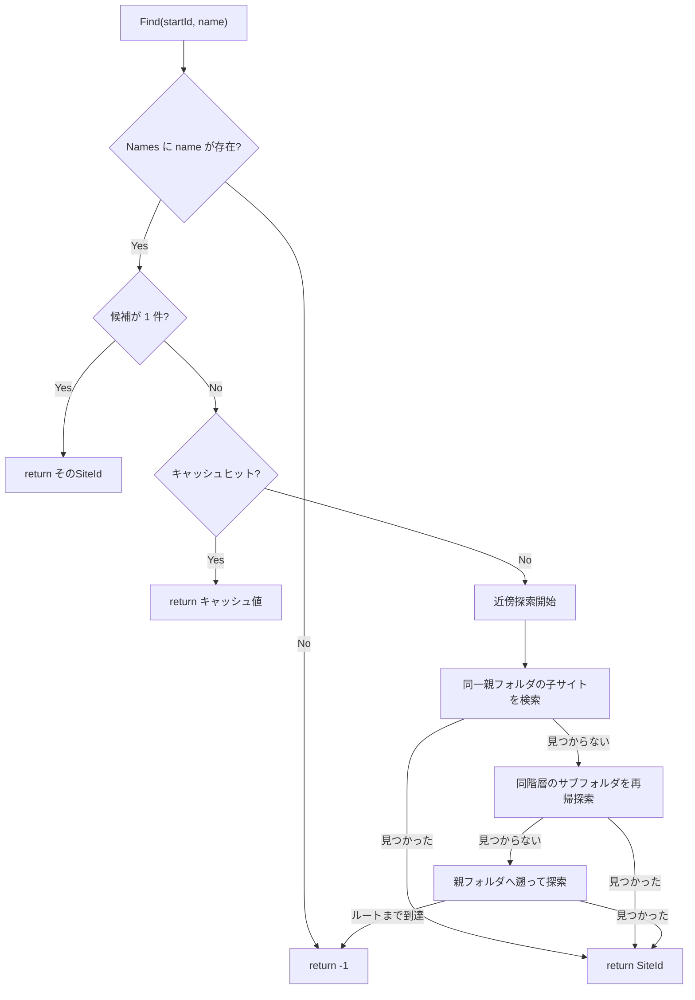
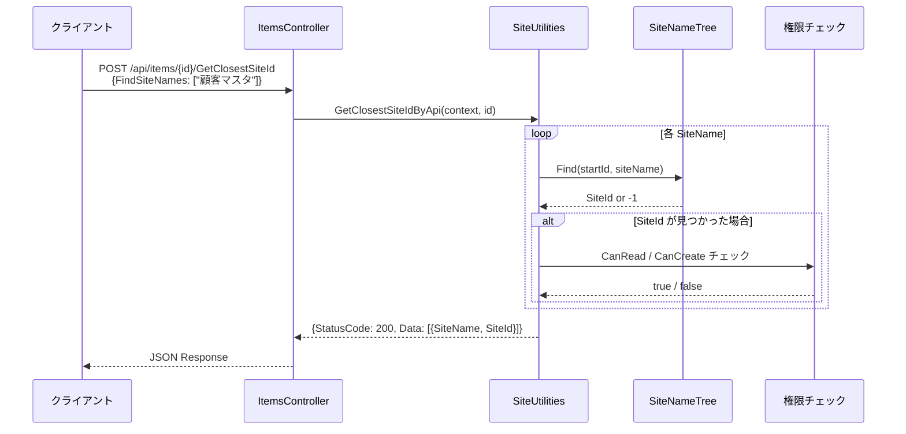
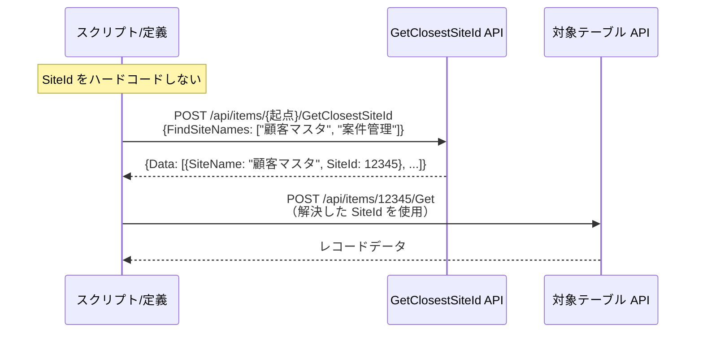

# SiteName 名前解決と GetClosestSiteId API

Sites テーブルの `SiteName` カラムを利用した名前ベースのサイト識別と、
`GetClosestSiteId` API による SiteId 解決の仕組みを調査する。
環境間でスクリプトや API 呼び出し定義を移植する際に
SiteId のハードコードを避ける方法を明らかにする。

<!-- START doctoc generated TOC please keep comment here to allow auto update -->
<!-- DON'T EDIT THIS SECTION, INSTEAD RE-RUN doctoc TO UPDATE -->

- [調査情報](#調査情報)
- [調査目的](#調査目的)
- [SiteName カラムの定義](#sitename-カラムの定義)
    - [カラム定義](#カラム定義)
    - [SiteName と Title の違い](#sitename-と-title-の違い)
    - [SiteName の設定画面](#sitename-の設定画面)
- [SiteNameTree による名前解決](#sitenametree-による名前解決)
    - [概要](#概要)
    - [データ構造](#データ構造)
    - [構築タイミング](#構築タイミング)
    - [Find アルゴリズム](#find-アルゴリズム)
- [GetClosestSiteId API](#getclosestsiteid-api)
    - [エンドポイント](#エンドポイント)
    - [リクエストボディ](#リクエストボディ)
    - [レスポンス](#レスポンス)
    - [実装](#実装)
    - [処理フロー](#処理フロー)
- [サーバースクリプトからの利用](#サーバースクリプトからの利用)
    - [GetClosestSite メソッド](#getclosestsite-メソッド)
    - [JavaScript API からの利用](#javascript-api-からの利用)
- [IntegratedSites での SiteName 利用](#integratedsites-での-sitename-利用)
- [SitePackage（インポート/エクスポート）での SiteName](#sitepackageインポートエクスポートでの-sitename)
    - [エクスポート時](#エクスポート時)
    - [インポート時](#インポート時)
- [環境間移植のための運用パターン](#環境間移植のための運用パターン)
    - [パターン: SiteName + GetClosestSiteId で SiteId を動的解決](#パターン-sitename--getclosestsiteid-で-siteid-を動的解決)
    - [運用手順](#運用手順)
    - [サーバースクリプトでの運用例](#サーバースクリプトでの運用例)
- [注意事項](#注意事項)
    - [SiteName に一意制約がない](#sitename-に一意制約がない)
    - [SiteName の最大長](#sitename-の最大長)
    - [API の起点サイト](#api-の起点サイト)
    - [SiteName 未設定のサイト](#sitename-未設定のサイト)
- [結論](#結論)
- [関連ソースコード](#関連ソースコード)
- [関連ドキュメント](#関連ドキュメント)

<!-- END doctoc generated TOC please keep comment here to allow auto update -->

## 調査情報

| 調査日        | リポジトリ | ブランチ           | タグ/バージョン | コミット    | 備考 |
| ------------- | ---------- | ------------------ | --------------- | ----------- | ---- |
| 2026年2月24日 | Pleasanter | Pleasanter_1.5.1.0 | -               | `34f162a43` | -    |

## 調査目的

システム連携用のサーバースクリプトや API 呼び出し定義では、
操作対象のサイトを `SiteId`（数値）で指定する必要がある。
しかし `SiteId` は環境ごとに異なるため、
定義を他環境に移植するたびに書き換えが発生する。
Sites テーブルに存在する `SiteName` カラムと
`GetClosestSiteId` API を使って、
名前ベースでサイトを特定する方法を調査する。

---

## SiteName カラムの定義

### カラム定義

**ファイル**: `Implem.Pleasanter/App_Data/Definitions/Definition_Column/Sites_SiteName.json`

| 属性      | 値             | 説明                                         |
| --------- | -------------- | -------------------------------------------- |
| カラム名  | `SiteName`     | Sites テーブルのカラム                       |
| 型        | `nvarchar(32)` | 最大 32 文字                                 |
| Nullable  | `1`            | NULL 許容（既定値は空文字列）                |
| 一意制約  | なし           | 同一テナント内で同じ名前を持つサイト作成可能 |
| 必須制約  | なし           | 空のまま運用するサイトが大半                 |
| ラベル    | サイト名       | UI 上の表示名                                |
| MaxLength | 32             | クライアント側バリデーションでも適用         |

### SiteName と Title の違い

| 属性       | SiteName                                      | Title                            |
| ---------- | --------------------------------------------- | -------------------------------- |
| 目的       | プログラム的な識別名                          | 人間向けの表示名                 |
| 最大長     | 32 文字                                       | 1024 文字                        |
| 一意制約   | なし                                          | なし                             |
| 表示箇所   | サイト設定画面                                | サイトメニュー・パンくずリスト等 |
| API/SS利用 | `GetClosestSiteId` / `IntegratedSites` で使用 | 表示用途                         |
| Wiki       | 全サイト種別で入力可能                        | Wiki 以外のサイトで入力可能      |

### SiteName の設定画面

**ファイル**: `Implem.Pleasanter/Models/Sites/SiteUtilities.cs`（行番号: 5531-5538）

```csharp
.FieldTextBox(
    controlId: "Sites_SiteName",
    fieldCss: "field-normal",
    labelText: Displays.Sites_SiteName(context: context),
    text: siteModel.SiteName,
    validateMaxLength: ss.GetColumn(
        context: context,
        columnName: "SiteName")
            ?.ValidateMaxLength ?? 0)
```

`SiteName` は全サイト種別（Issues / Results / Wikis / Dashboards / フォルダ）で入力できるテキストボックスとして表示される。`_using` 条件は付与されていない。

---

## SiteNameTree による名前解決

### 概要

`SiteNameTree` はテナント内の全サイトの階層構造と名前をキャッシュし、起点サイトからの近傍探索でサイト名を SiteId に解決するクラスである。

**ファイル**: `Implem.Pleasanter/Libraries/Server/SiteNameTree.cs`

### データ構造

```csharp
public class SiteNameTree
{
    public readonly List<SiteNameTreeItem> Items;   // ソート済みノード一覧（バイナリサーチ対応）
    public readonly Dictionary<string, List<long>> Names;  // SiteName → SiteId[] マップ
    public readonly List<(string name, long triggerId, long nameId, long ticks)> Caches;  // LRU キャッシュ（上限 1024）
}
```

### 構築タイミング

**ファイル**: `Implem.Pleasanter/Libraries/Server/SiteInfo.cs`（行番号: 524-535）

`TenantCache` の `Sites` ディクショナリが更新されるたびに `SiteNameTree` が再構築される。

```csharp
private static void SetSites(TenantCache tenantCache, EnumerableRowCollection<DataRow> dataRows)
{
    var sites = new Dictionary<long, DataRow>();
    tenantCache.Sites?.ForEach(data => sites.Add(data.Key, data.Value));
    foreach (var dataRow in dataRows)
    {
        sites.AddOrUpdate(dataRow.Long("SiteId"), dataRow);
    }
    tenantCache.Sites = sites;
    tenantCache.SiteNameTree = new SiteNameTree(sites);  // 再構築
}
```

構築時、各サイトの `SiteName` と `SiteId` の対応が `Names` ディクショナリに格納される。`SiteName` が空（未設定）のサイトもノードとしては登録されるが、名前解決の対象にはならない。

### Find アルゴリズム

**ファイル**: `Implem.Pleasanter/Libraries/Server/SiteNameTree.cs`（行番号: 42-67）

```csharp
public long Find(long startId, string name)
{
    if (Names.ContainsKey(name) == false) return -1;    // 名前が存在しない
    var nameIdList = Names[name];
    if (nameIdList.Count == 1) return nameIdList[0];    // 一意なら即返却
    // 複数候補がある場合は近傍探索
    var cacheNode = FindCaches(name: name, triggerId: startId);
    if (cacheNode.name != null) { /* キャッシュヒット */ }
    var triggerNode = SearchItem(startId: startId);
    if (triggerNode == null) return -1;
    var foundNode = FindSameLevel(
        nameIdList: nameIdList,
        folderId: triggerNode.ParentId,
        id: triggerNode.Id,
        isUp: false);
    // キャッシュに保存（上限 1024 件、LRU 方式で古いものを削除）
    Caches.Add(new(name, startId, foundNode?.Id ?? -1, DateTime.UtcNow.Ticks));
    return foundNode?.Id ?? -1;
}
```

探索の優先順位:



同名サイトが複数ある場合、起点サイトから**最も近い階層**にあるサイトが選ばれる。同一階層内では起点サイト自身が最優先される。

---

## GetClosestSiteId API

### エンドポイント

| 項目     | 値                                    |
| -------- | ------------------------------------- |
| メソッド | `POST`                                |
| URL      | `/api/items/{id}/GetClosestSiteId`    |
| 認証     | API キー認証                          |
| `{id}`   | 起点サイトの SiteId（近傍探索の起点） |

### リクエストボディ

```json
{
    "ApiKey": "your-api-key",
    "FindSiteNames": ["顧客マスタ", "案件管理"]
}
```

`FindSiteNames` は `SiteApiModel` にのみ存在するプロパティで、この API 専用。

### レスポンス

```json
{
    "StatusCode": 200,
    "SiteId": 12345,
    "Data": [
        { "SiteName": "顧客マスタ", "SiteId": 67890 },
        { "SiteName": "案件管理", "SiteId": 67891 }
    ]
}
```

見つからなかった場合や権限がない場合は `SiteId: -1` が返る。

### 実装

**ファイル**: `Implem.Pleasanter/Models/Sites/SiteUtilities.cs`（行番号: 18920-18975）

```csharp
public static ContentResultInheritance GetClosestSiteIdByApi(Context context, long id)
{
    var findSiteNames = context.RequestDataString
        .Deserialize<SiteApiModel>()?.FindSiteNames;
    if (findSiteNames == null)
        return ApiResults.BadRequest(context: context);
    var tenantCache = SiteInfo.TenantCaches[context.TenantId];
    foreach (var siteName in findSiteNames)
    {
        var foundId = tenantCache.SiteNameTree.Find(startId: id, name: siteName);
        if (foundId != -1)
        {
            // 見つかったサイトの読み取り権限チェック
            var findSs = SiteSettingsUtilities.Get(
                context: context, siteId: foundId, referenceId: foundId);
            var findCanRead = context.CanRead(ss: findSs, site: true)
                || context.CanCreate(ss: findSs, site: true);
            if (findCanRead == false) foundId = -1;
        }
        resultCollection.Add(new { SiteName = siteName, SiteId = foundId });
    }
    // ...
}
```

### 処理フロー



---

## サーバースクリプトからの利用

### GetClosestSite メソッド

**ファイル**: `Implem.Pleasanter/Libraries/ServerScripts/ServerScriptUtilities.cs`（行番号: 1424-1457）

サーバースクリプト内から `context.GetClosestSite(id, siteName)` で利用できる。

```csharp
public static ServerScriptModelApiModel GetClosestSite(
    Context context, long? id = null, string siteName = null)
{
    if (siteName.IsNullOrEmpty()) return null;
    var startId = id ?? context.SiteId;  // id 省略時は現在のサイトが起点
    // 起点サイトの権限チェック
    var startCanRead = context.CanRead(ss: startSs, site: true)
        || context.CanCreate(ss: startSs, site: true);
    if (startCanRead == false) return null;
    // 名前解決
    var findId = tenantCache.SiteNameTree.Find(startId: startId, name: siteName);
    if (findId == -1) return null;
    // 見つかったサイトの権限チェック
    var findCanRead = context.CanRead(ss: findSs, site: true)
        || context.CanCreate(ss: findSs, site: true);
    if (findCanRead == false) return null;
    return GetSite(context: context, id: findId, apiRequestBody: string.Empty)
        .FirstOrDefault();
}
```

#### サーバースクリプトでの使用例

```javascript
// 現在のサイトを起点に「顧客マスタ」を探す
const site = context.GetClosestSite(null, '顧客マスタ');
if (site) {
    const siteId = site.SiteId;
    // siteId を使った API 呼び出し等
}
```

### JavaScript API からの利用

**ファイル**: `Implem.PleasanterFrontend/wwwroot/src/scripts/generals/_api.js`（行番号: 153-155）

```javascript
$p.apiGetClosestSiteId = function (args) {
    return $p.apiExec($p.apiUrl(args.id, 'getclosestsiteid'), args);
};
```

---

## IntegratedSites での SiteName 利用

クロス集計（統合サイト）の設定でも `SiteName` による名前解決が使われている。

**ファイル**: `Implem.Pleasanter/Libraries/Settings/SiteSettings.cs`（行番号: 5276-5298）

```csharp
public List<long> GetIntegratedSites(Context context)
{
    var sites = new List<long>() { SiteId };
    IntegratedSites?.ForEach(site =>
    {
        var dataRows = SiteInfo.Sites(context: context).Values;
        dataRows
            .Where(dataRow =>
                dataRow.String("SiteName") == site        // SiteName で一致
                || dataRow.String("SiteGroupName") == site)  // SiteGroupName でも一致
            .ForEach(dataRow =>
            {
                sites.Add(dataRow.Long("SiteId"));
            });
        if (!isName && site.ToLong() > 0)
        {
            sites.Add(site.ToLong());   // 名前で見つからなければ数値として解釈
        }
    });
    return sites;
}
```

`IntegratedSites` に文字列を指定した場合の解決順序:

1. `SiteName` が一致するサイトを全テナントキャッシュから検索
2. `SiteGroupName` が一致するサイトを全テナントキャッシュから検索
3. 名前で見つからなければ、数値として `SiteId` を直接解釈

`GetClosestSiteId` API（近傍探索）とは異なり、全テナントキャッシュをフラットに走査する点に注意。

---

## SitePackage（インポート/エクスポート）での SiteName

### エクスポート時

**ファイル**: `Implem.Pleasanter/Libraries/SitePackages/PackageSiteModel.cs`（行番号: 57-85）

`SiteName` は `SiteModel` からそのまま文字列としてエクスポートされる。

### インポート時

**ファイル**: `Implem.Pleasanter/Libraries/SitePackages/Utilities.cs`（行番号: 169-281）

SiteId のマッピングは全て数値ベースで行われ、`SiteName` は元の値がそのままコピーされる。

```csharp
Rds.InsertSites(param: Rds.SitesParam()
    .SiteId(packageSiteModel.SavedSiteId)    // 新しい SiteId（自動採番）
    .SiteName(packageSiteModel.SiteName)     // 元の SiteName をそのまま使用
    // ...
```

つまり、エクスポート元で `SiteName` を設定しておけば、インポート先でも同じ `SiteName` で参照できる。

---

## 環境間移植のための運用パターン

### パターン: SiteName + GetClosestSiteId で SiteId を動的解決

API 呼び出し定義やスクリプトで SiteId をハードコードする代わりに、`SiteName` で事前に解決する。



### 運用手順

1. 各サイトのサイト設定画面で「サイト名」に一意な識別名を設定する
2. スクリプトや API 定義では `GetClosestSiteId` API を最初に呼び出して SiteId を解決する
3. 解決した SiteId を後続の API 呼び出しで使用する

### サーバースクリプトでの運用例

```javascript
// サーバースクリプト内で SiteName から SiteId を解決して API 呼び出し
const targetSite = context.GetClosestSite(null, '顧客マスタ');
if (targetSite) {
    const results = context.ApiGet(
        targetSite.SiteId,
        JSON.stringify({
            View: {
                ColumnFilterHash: {
                    ClassA: model.ClassA,
                },
            },
        })
    );
    if (results && results.Data && results.Data.length > 0) {
        model.ClassB = results.Data[0].ClassB;
    }
}
```

この形式であれば、SiteId が異なる別環境にスクリプトをそのまま移植できる。

---

## 注意事項

### SiteName に一意制約がない

`SiteName` にはデータベースレベルでもアプリケーションレベルでも一意制約が存在しない。同一テナント内で同名のサイトが作成可能であり、その場合は `SiteNameTree` の近傍探索により起点サイトから最も近いサイトが選ばれる。

運用上の対策:

| 対策             | 説明                                                          |
| ---------------- | ------------------------------------------------------------- |
| 命名規則の制定   | テナント内で `SiteName` が重複しないよう命名規則を設ける      |
| プレフィックス   | `SYS_顧客マスタ` のように用途を示すプレフィックスを付与する   |
| サイトパッケージ | エクスポート/インポートで SiteName が保持されることを利用する |

### SiteName の最大長

`nvarchar(32)` のため最大 32 文字。識別名としては十分だが、長い名前は使えない。

### API の起点サイト

`GetClosestSiteId` API の URL パスに指定する `{id}` は探索の起点となるサイトの SiteId であり、実際に操作するサイトではない。テナントのルートフォルダの SiteId を指定すれば、テナント全体から探索される。

### SiteName 未設定のサイト

`SiteName` が空（未設定）のサイトは名前解決の対象にならない。`SiteNameTree` のノードとしては登録されるが、`Names` ディクショナリにはエントリが追加されない。

---

## 結論

| 項目                   | 結論                                                                                                   |
| ---------------------- | ------------------------------------------------------------------------------------------------------ |
| SiteName の用途        | プログラム的なサイト識別名。Title（表示名）とは別フィールド                                            |
| 一意制約               | なし。運用ルールで重複を避ける必要がある                                                               |
| GetClosestSiteId API   | `SiteName` から `SiteId` を解決する公式 API が存在する                                                 |
| サーバースクリプト対応 | `context.GetClosestSite(id, siteName)` で利用可能                                                      |
| JavaScript API         | `$p.apiGetClosestSiteId` で利用可能                                                                    |
| 環境間移植             | SiteName を設定しておけば、GetClosestSiteId で SiteId を動的解決でき、スクリプトの環境依存を排除できる |
| SitePackage            | エクスポート/インポートで SiteName はそのままコピーされるため、インポート先でもそのまま利用可能        |
| IntegratedSites        | クロス集計の統合サイト設定でも SiteName / SiteGroupName による名前解決が可能                           |

## 関連ソースコード

| ファイル                                                             | 説明                                    |
| -------------------------------------------------------------------- | --------------------------------------- |
| `Implem.Pleasanter/Libraries/Server/SiteNameTree.cs`                 | SiteName による近傍探索アルゴリズム     |
| `Implem.Pleasanter/Libraries/Server/SiteInfo.cs`                     | TenantCache / SiteNameTree の構築       |
| `Implem.Pleasanter/Libraries/Server/TenantCache.cs`                  | テナントキャッシュ（SiteNameTree 保持） |
| `Implem.Pleasanter/Models/Sites/SiteUtilities.cs`                    | GetClosestSiteIdByApi 実装              |
| `Implem.Pleasanter/Models/Sites/SiteApiModel.cs`                     | FindSiteNames プロパティ定義            |
| `Implem.Pleasanter/Controllers/Api/ItemsController.cs`               | GetClosestSiteId エンドポイント         |
| `Implem.Pleasanter/Libraries/ServerScripts/ServerScriptUtilities.cs` | サーバースクリプト用 GetClosestSite     |
| `Implem.PleasanterFrontend/wwwroot/src/scripts/generals/_api.js`     | JavaScript API ラッパー                 |
| `Implem.Pleasanter/Libraries/Settings/SiteSettings.cs`               | IntegratedSites での SiteName 解決      |
| `Implem.Pleasanter/Libraries/SitePackages/PackageSiteModel.cs`       | SitePackage エクスポートモデル          |
| `Implem.Pleasanter/Libraries/SitePackages/Utilities.cs`              | SitePackage インポート処理              |

## 関連ドキュメント

- [Upsert API 実装](001-Upsert-API.md)
- [拡張SQL 実行権限・外部DB接続](003-拡張SQL・外部DB接続.md)
- [ServerScript 実装](../05-基盤・ツール/006-ServerScript実装.md)
