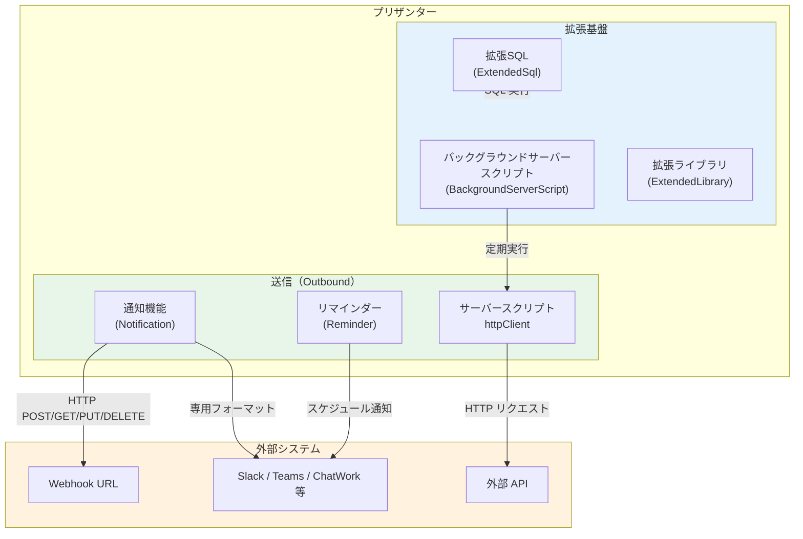
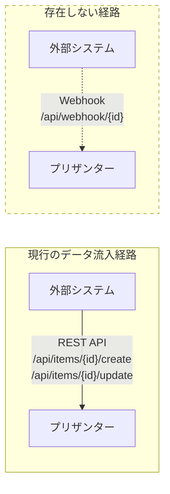
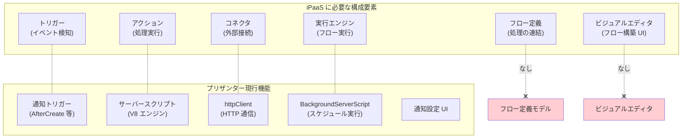
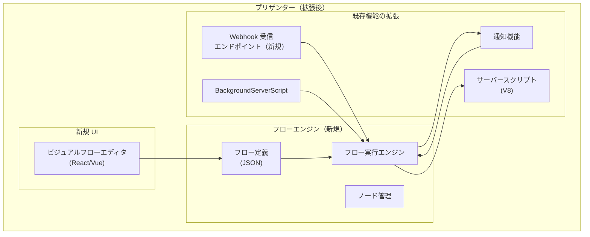
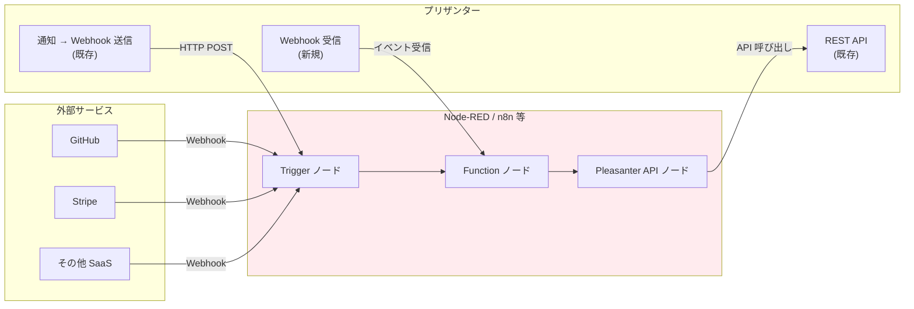
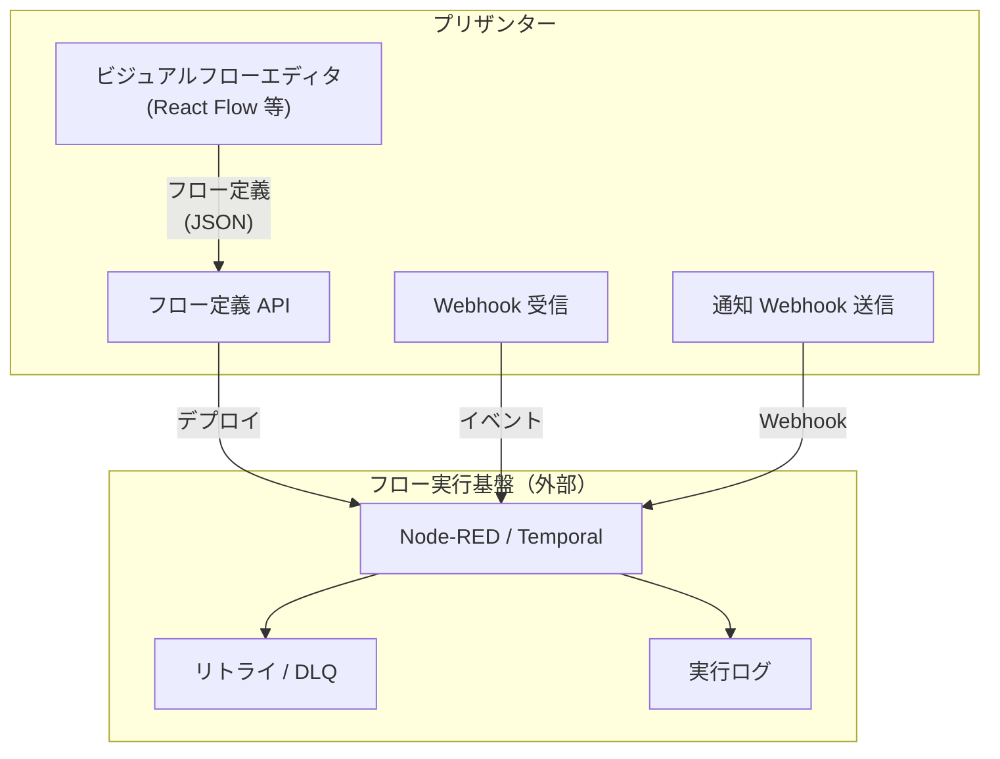
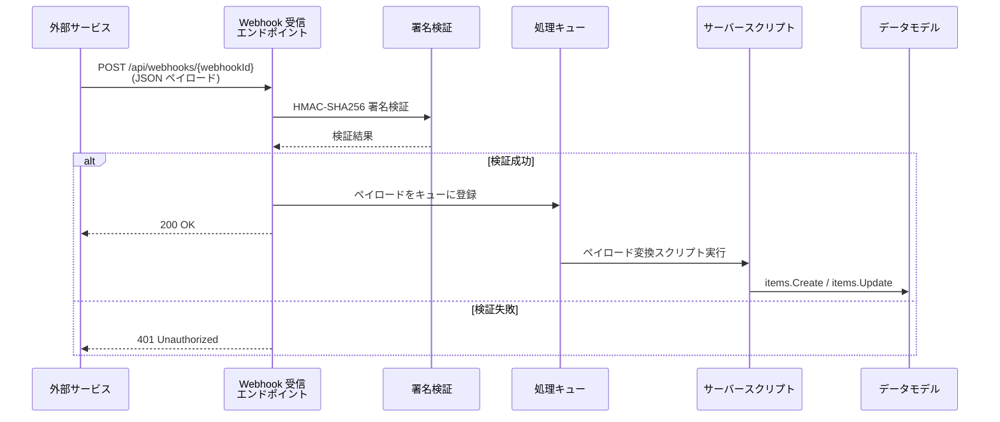

# Webhook・iPaaS 連携の実現可能性調査

プリザンターの Webhook（送信・受信）機能の現状と、iPaaS（Node-RED 的な UI を持つ統合自動化基盤）を構築する際の実現可能性・課題を調査する。

<!-- START doctoc generated TOC please keep comment here to allow auto update -->
<!-- DON'T EDIT THIS SECTION, INSTEAD RE-RUN doctoc TO UPDATE -->

- [調査情報](#調査情報)
- [調査目的](#調査目的)
- [前提: iPaaS / Node-RED とは](#前提-ipaas--node-red-とは)
    - [iPaaS の定義](#ipaas-の定義)
    - [Node-RED の特徴](#node-red-の特徴)
- [現行プリザンターの Webhook 関連機能](#現行プリザンターの-webhook-関連機能)
    - [全体アーキテクチャ](#全体アーキテクチャ)
    - [1. 通知機能（Notification） - Outbound Webhook](#1-通知機能notification---outbound-webhook)
    - [2. サーバースクリプト httpClient - 汎用 HTTP 通信](#2-サーバースクリプト-httpclient---汎用-http-通信)
    - [3. サーバースクリプトからの通知送信](#3-サーバースクリプトからの通知送信)
    - [4. リマインダー（Reminder） - 時間ベースの通知](#4-リマインダーreminder---時間ベースの通知)
    - [5. バックグラウンドサーバースクリプト](#5-バックグラウンドサーバースクリプト)
- [Webhook 受信（Inbound）の現状](#webhook-受信inboundの現状)
    - [調査結果: 受信エンドポイントは存在しない](#調査結果-受信エンドポイントは存在しない)
- [iPaaS / Node-RED 的機能の実現可能性](#ipaas--node-red-的機能の実現可能性)
    - [必要な構成要素と現行機能の対応](#必要な構成要素と現行機能の対応)
    - [各構成要素の対応状況](#各構成要素の対応状況)
- [技術的な実装アプローチ](#技術的な実装アプローチ)
    - [アプローチ 1: プリザンター内部に組み込む](#アプローチ-1-プリザンター内部に組み込む)
    - [アプローチ 2: 外部 iPaaS / Node-RED と連携する](#アプローチ-2-外部-ipaas--node-red-と連携する)
    - [アプローチ 3: プリザンター上にフローエディタ UI を構築し外部エンジンと連携する](#アプローチ-3-プリザンター上にフローエディタ-ui-を構築し外部エンジンと連携する)
- [Webhook 受信エンドポイントの設計案](#webhook-受信エンドポイントの設計案)
    - [エンドポイント設計](#エンドポイント設計)
    - [処理フロー](#処理フロー)
    - [Webhook 定義モデル（案）](#webhook-定義モデル案)
- [既存拡張ポイントの活用](#既存拡張ポイントの活用)
    - [拡張ライブラリ（ExtendedLibrary）](#拡張ライブラリextendedlibrary)
    - [拡張 API（ExtendedController）](#拡張-apiextendedcontroller)
    - [バックグラウンドサービス基盤](#バックグラウンドサービス基盤)
- [フローエディタ UI の技術選定](#フローエディタ-ui-の技術選定)
    - [プリザンター UI との統合上の考慮事項](#プリザンター-ui-との統合上の考慮事項)
- [送信 Webhook の改善点](#送信-webhook-の改善点)
- [結論](#結論)
- [関連ソースコード](#関連ソースコード)
- [関連ドキュメント](#関連ドキュメント)

<!-- END doctoc generated TOC please keep comment here to allow auto update -->

## 調査情報

| 調査日        | リポジトリ | ブランチ           | タグ/バージョン    | コミット    | 備考 |
| ------------- | ---------- | ------------------ | ------------------ | ----------- | ---- |
| 2026年2月26日 | Pleasanter | Pleasanter_1.5.1.0 | Pleasanter_1.5.1.0 | `34f162a43` | -    |

## 調査目的

- プリザンターの Webhook 送信（Outbound）機能の仕組みを把握する
- Webhook 受信（Inbound）機能の有無を確認する
- iPaaS / Node-RED のようなビジュアルフロービルダーをプリザンター上に構築できるか、技術的な実現可能性と課題を明らかにする

---

## 前提: iPaaS / Node-RED とは

### iPaaS の定義

iPaaS（Integration Platform as a Service）は、複数のシステムやサービスを接続し、データの受け渡しやワークフローの自動化を行う統合基盤である。

| 要素                  | 説明                                                 |
| --------------------- | ---------------------------------------------------- |
| トリガー（Trigger）   | 外部イベントや時間条件でフローを開始する             |
| アクション（Action）  | API 呼び出し・データ変換・条件分岐などの処理単位     |
| フロー（Flow）        | トリガーとアクションをつなげた一連の処理パイプライン |
| コネクタ（Connector） | 外部サービスとの接続を抽象化するアダプタ             |
| ビジュアルエディタ    | フローを GUI 上でドラッグ＆ドロップで構築する UI     |

### Node-RED の特徴

Node-RED はフローベースのビジュアルプログラミングツールで、以下の特徴を持つ。

| 特徴               | 内容                                                             |
| ------------------ | ---------------------------------------------------------------- |
| ノードベース UI    | 入力・処理・出力をノードとしてキャンバスに配置しワイヤで接続する |
| イベント駆動       | HTTP リクエスト、MQTT、タイマー等をトリガーにフローを実行する    |
| JavaScript 関数    | Function ノードで任意の JavaScript を記述できる                  |
| ノードライブラリ   | npm パッケージとしてコネクタやノードを追加できる                 |
| フローの JSON 定義 | フローは JSON 形式で保存・エクスポート・インポートできる         |

---

## 現行プリザンターの Webhook 関連機能

### 全体アーキテクチャ



### 1. 通知機能（Notification） - Outbound Webhook

通知機能は、レコード操作（作成・更新・削除等）をトリガーとして外部サービスへ通知を送信する仕組みである。

**ファイル**: `Implem.Pleasanter/Libraries/Settings/Notification.cs`

#### 通知タイプ一覧

```csharp
public enum Types : int
{
    Mail = 1,
    Slack = 2,
    ChatWork = 3,
    Line = 4,
    LineGroup = 5,
    Teams = 6,
    RocketChat = 7,
    InCircle = 8,
    HttpClient = 9,     // 汎用 Webhook
    LineWorks = 10
}
```

`HttpClient`（Type = 9）が汎用の Webhook 送信機能に該当する。

#### トリガーイベント

| プロパティ        | トリガータイミング |
| ----------------- | ------------------ |
| `AfterCreate`     | レコード作成後     |
| `AfterUpdate`     | レコード更新後     |
| `AfterDelete`     | レコード削除後     |
| `AfterCopy`       | レコードコピー後   |
| `AfterBulkUpdate` | 一括更新後         |
| `AfterBulkDelete` | 一括削除後         |
| `AfterImport`     | インポート後       |

#### 条件付き通知

| プロパティ              | 説明                                               |
| ----------------------- | -------------------------------------------------- |
| `BeforeCondition`       | 操作前の状態がビューの条件に合致する場合に通知する |
| `AfterCondition`        | 操作後の状態がビューの条件に合致する場合に通知する |
| `Expression`            | 条件の結合方式（`Or` / `And`）                     |
| `MonitorChangesColumns` | 指定カラムの変更時のみ通知する                     |

#### HttpClient 型通知の送信処理

**ファイル**: `Implem.Pleasanter/Libraries/Settings/Notification.cs`

```csharp
case Types.HttpClient:
    if (Parameters.Notification.HttpClient)
    {
        new HttpClient(
            _context: context,
            _text: body)
        {
            MethodType = MethodType,
            Encoding = Encoding,
            MediaType = MediaType,
            Headers = Headers
        }
        .Send(Address);
    }
    break;
```

#### HttpClient ラッパークラス

**ファイル**: `Implem.Pleasanter/Libraries/DataSources/HttpClient.cs`

| プロパティ   | 説明                                 | デフォルト値       |
| ------------ | ------------------------------------ | ------------------ |
| `MethodType` | HTTP メソッド（GET/POST/PUT/DELETE） | `Post`             |
| `Encoding`   | 文字エンコーディング                 | `UTF-8`            |
| `MediaType`  | Content-Type                         | `application/json` |
| `Headers`    | カスタムヘッダー（JSON 辞書）        | なし               |

送信は `Task.Run` で非同期に行われ、エラーは `SysLogModel` に記録される。リトライ機能は実装されていない。

#### 低レベル HTTP クライアント

**ファイル**: `Implem.Pleasanter/Libraries/DataSources/NotificationHttpClient.cs`

```csharp
public void NotifyString(string url, string content, HttpMethod method,
    IDictionary<string, string> headers = null)
{
    // HttpRequestMessage を生成しヘッダーとコンテンツを設定
    request.Content = new StringContent(content, Encoding, ContentType);
    var response = _httpClient.Send(request);
    response.EnsureSuccessStatusCode();
}
```

静的な `System.Net.Http.HttpClient` インスタンスを共有し、コネクションプーリングを活用する。

### 2. サーバースクリプト httpClient - 汎用 HTTP 通信

サーバースクリプト内で任意の HTTP リクエストを送信できるホストオブジェクトが用意されている。

**ファイル**: `Implem.Pleasanter/Libraries/ServerScripts/ServerScriptModelHttpClient.cs`

```javascript
// サーバースクリプトでの使用例
httpClient.RequestUri = 'https://api.example.com/webhook';
httpClient.Content = JSON.stringify({ key: 'value' });
httpClient.MediaType = 'application/json';
httpClient.RequestHeaders = { Authorization: 'Bearer token123' };
let response = httpClient.Post();
```

| プロパティ/メソッド | 説明                                         |
| ------------------- | -------------------------------------------- |
| `RequestUri`        | リクエスト先 URL                             |
| `Content`           | リクエストボディ                             |
| `MediaType`         | Content-Type（デフォルト: application/json） |
| `Encoding`          | 文字エンコーディング（デフォルト: utf-8）    |
| `RequestHeaders`    | カスタムヘッダー（Dictionary）               |
| `Get()`             | GET リクエスト送信                           |
| `Post()`            | POST リクエスト送信                          |
| `Put()`             | PUT リクエスト送信                           |
| `Patch()`           | PATCH リクエスト送信                         |
| `Delete()`          | DELETE リクエスト送信                        |
| `IsSuccess`         | レスポンスが成功か                           |
| `IsTimeOut`         | タイムアウトしたか                           |
| `ResponseHeaders`   | レスポンスヘッダー                           |

タイムアウトは `Parameters.Script.ServerScriptHttpClientTimeOut`（デフォルト: 100秒）で制御される。

### 3. サーバースクリプトからの通知送信

**ファイル**: `Implem.Pleasanter/Libraries/ServerScripts/ServerScriptModelNotificationModel.cs`

サーバースクリプトから通知を動的に生成・送信できる。

```javascript
// サーバースクリプトでの使用例
let n = notification.New();
n.Type = 9; // HttpClient
n.Address = 'https://webhook.example.com/endpoint';
n.Title = 'レコード更新通知';
n.Body = JSON.stringify({ recordId: model.ResultId, status: model.Status });
n.Send();
```

### 4. リマインダー（Reminder） - 時間ベースの通知

**ファイル**: `Implem.Pleasanter/Libraries/Settings/Reminder.cs`

リマインダーは時間ベースで通知を送信する仕組みである。通知機能とは異なり、`HttpClient` タイプは含まれていない。

| リマインダータイプ | 通知先          |
| ------------------ | --------------- |
| Mail               | メール          |
| Slack              | Slack           |
| ChatWork           | ChatWork        |
| Line / LineGroup   | LINE            |
| Teams              | Microsoft Teams |
| RocketChat         | Rocket.Chat     |
| InCircle           | InCircle        |
| LineWorks          | LINE WORKS      |

### 5. バックグラウンドサーバースクリプト

**ファイル**: `Implem.Pleasanter/Libraries/Settings/BackgroundServerScript.cs`

スケジュールに基づいてサーバースクリプトを定期実行する機能。Quartz.NET ベースのジョブスケジューラで動作する。

**ファイル**: `Implem.Pleasanter/Libraries/BackgroundServices/BackgroundServerScriptJob.cs`

| スケジュールタイプ | 説明                       |
| ------------------ | -------------------------- |
| `Hourly`           | 毎時指定の分に実行         |
| `Daily`            | 毎日指定の時刻に実行       |
| `Weekly`           | 毎週指定の曜日・時刻に実行 |
| `Monthly`          | 毎月指定の日・時刻に実行   |
| `OnlyOnce`         | 指定の日時に一度だけ実行   |

バックグラウンドサーバースクリプト内で `httpClient` を使用すれば、スケジュール駆動の Webhook 送信が可能である。

---

## Webhook 受信（Inbound）の現状

### 調査結果: 受信エンドポイントは存在しない

プリザンターには**Webhook 受信用の専用エンドポイントは存在しない**。外部からプリザンターにデータを送信するには、既存の REST API を使用する必要がある。



#### 既存 API コントローラ一覧

| コントローラ                | 主なエンドポイント                         | Webhook 受信用途 |
| --------------------------- | ------------------------------------------ | :--------------: |
| `ItemsController`           | Get / Create / Update / Upsert / Delete 等 |     代替可能     |
| `DeptsController`           | 部署 CRUD                                  |        -         |
| `UsersController`           | ユーザー CRUD                              |        -         |
| `GroupsController`          | グループ CRUD                              |        -         |
| `ExtensionsController`      | 拡張テーブル操作                           |        -         |
| `BinariesController`        | ファイル操作                               |        -         |
| `SessionsController`        | セッション操作                             |        -         |
| `BackgroundTasksController` | バックグラウンドタスク                     |        -         |
| `ExtendedController`        | 拡張 API                                   |     拡張可能     |

#### REST API と Webhook 受信の違い

| 観点               | REST API（現行）               | Webhook 受信（未実装）              |
| ------------------ | ------------------------------ | ----------------------------------- |
| 認証               | API キー必須                   | HMAC 署名検証やトークン検証が一般的 |
| ペイロード形式     | プリザンター固有の JSON 形式   | 送信元サービスの固有形式            |
| データマッピング   | クライアント側で変換が必要     | サーバー側でペイロードを変換する    |
| トリガー           | クライアントの能動的な呼び出し | 外部サービスからのプッシュ通知      |
| エラーハンドリング | クライアント側でリトライ制御   | サーバー側でリトライ/DLQ を管理する |

---

## iPaaS / Node-RED 的機能の実現可能性

### 必要な構成要素と現行機能の対応



### 各構成要素の対応状況

| 構成要素             | 現行対応状況 | 説明                                                                      |
| -------------------- | :----------: | ------------------------------------------------------------------------- |
| トリガー（Outbound） |     対応     | 通知機能のイベントトリガー（AfterCreate / AfterUpdate 等）が利用可能      |
| トリガー（Inbound）  |    未対応    | 外部サービスからの Webhook 受信エンドポイントが存在しない                 |
| トリガー（Timer）    |     対応     | BackgroundServerScript / Reminder によるスケジュール実行が可能            |
| アクション           |   部分対応   | サーバースクリプトで JavaScript による処理記述が可能                      |
| コネクタ             |   部分対応   | httpClient で汎用 HTTP 通信が可能だが、サービス固有のコネクタはない       |
| フロー定義           |    未対応    | 複数のアクションを連結するフロー定義モデルが存在しない                    |
| ビジュアルエディタ   |    未対応    | フローを GUI で構築する UI が存在しない                                   |
| 実行エンジン         |   部分対応   | V8 エンジン + Quartz.NET スケジューラは存在するがフロー実行には対応しない |
| エラーハンドリング   |   部分対応   | SysLogModel へのログ記録はあるがリトライ/DLQ 機能はない                   |

---

## 技術的な実装アプローチ

### アプローチ 1: プリザンター内部に組み込む

プリザンター本体を拡張して iPaaS 機能を組み込む方式。



#### 必要な改修箇所

| 改修箇所                   | 内容                                                     | 規模 |
| -------------------------- | -------------------------------------------------------- | :--: |
| Webhook 受信エンドポイント | 外部サービスからの POST を受け付けるコントローラーを追加 |  小  |
| ペイロード変換             | 受信した JSON を内部データモデルにマッピングする仕組み   |  中  |
| フロー定義モデル           | ノード・エッジ・条件分岐等のフロー構造を表すデータモデル |  大  |
| フロー実行エンジン         | フロー定義に基づいてノードを順次/並列実行するランタイム  |  大  |
| ビジュアルエディタ UI      | ドラッグ＆ドロップでフローを構築するフロントエンド       |  大  |
| フロー永続化               | フロー定義の保存・バージョン管理・テナント分離           |  中  |
| エラーハンドリング         | リトライ・タイムアウト・デッドレターキュー               |  中  |
| ログ・監視                 | フロー実行履歴・ノード別実行結果の記録                   |  中  |

#### 利点と課題

| 観点 | 内容                                                             |
| ---- | ---------------------------------------------------------------- |
| 利点 | プリザンターの認証・権限モデルをそのまま利用できる               |
| 利点 | SiteSettings ベースの設定 UI に統合できる                        |
| 利点 | サーバースクリプト（V8）をフローノードとして再利用できる         |
| 課題 | プリザンター本体への改修が大規模になる                           |
| 課題 | ビジュアルエディタの開発コストが高い                             |
| 課題 | フローエンジンの信頼性（リトライ・冪等性・順序保証）の実装が複雑 |
| 課題 | プリザンター本体のアップデートとの互換性維持が困難               |

### アプローチ 2: 外部 iPaaS / Node-RED と連携する

プリザンターに最小限の Webhook 受信機能を追加し、フロー制御は外部の iPaaS / Node-RED に委譲する方式。



#### 必要な改修箇所

| 改修箇所                         | 内容                                                     | 規模 |
| -------------------------------- | -------------------------------------------------------- | :--: |
| Webhook 受信エンドポイント       | 外部サービスからの POST を受け付けるコントローラーを追加 |  小  |
| Webhook 署名検証                 | HMAC-SHA256 等の署名検証ミドルウェア                     |  小  |
| 通知 Webhook のリトライ/ログ強化 | 送信失敗時のリトライとログ記録を追加                     |  小  |
| サーバースクリプト連携トリガー   | Webhook 受信をサーバースクリプト実行のトリガーにする     |  中  |

#### 利点と課題

| 観点 | 内容                                                                |
| ---- | ------------------------------------------------------------------- |
| 利点 | Node-RED / n8n 等の成熟したフローエンジンと UI をそのまま利用できる |
| 利点 | プリザンター本体への改修が最小限で済む                              |
| 利点 | 外部 iPaaS 側のコネクタエコシステムを活用できる                     |
| 利点 | フローエンジンの信頼性（リトライ・DLQ 等）が既に実装されている      |
| 課題 | Node-RED / n8n 等の別サービスの運用・管理が必要                     |
| 課題 | プリザンターの権限モデルとの統合が限定的                            |
| 課題 | API キーの管理や通信経路のセキュリティ確保が必要                    |

### アプローチ 3: プリザンター上にフローエディタ UI を構築し外部エンジンと連携する

ビジュアルエディタ UI はプリザンター上に構築するが、フロー実行は外部エンジン（Node-RED / Temporal 等）に委譲するハイブリッド方式。



---

## Webhook 受信エンドポイントの設計案

いずれのアプローチでも Webhook 受信エンドポイントの追加が共通して必要になる。以下に設計案を示す。

### エンドポイント設計

```
POST /api/webhooks/{webhookId}
```

| パラメータ  | 説明                                                             |
| ----------- | ---------------------------------------------------------------- |
| `webhookId` | Webhook 定義の一意識別子（GUID）                                 |
| リクエスト  | Content-Type: application/json; 送信元サービスの JSON ペイロード |
| レスポンス  | 200 OK（受信成功）/ 401 Unauthorized / 400 Bad Request           |

### 処理フロー



### Webhook 定義モデル（案）

| フィールド      | 型       | 説明                               |
| --------------- | -------- | ---------------------------------- |
| `WebhookId`     | GUID     | 一意識別子（URL に埋め込む）       |
| `Name`          | string   | Webhook の表示名                   |
| `SiteId`        | long     | 対象サイト                         |
| `Secret`        | string   | HMAC 署名検証用シークレット        |
| `MappingScript` | string   | ペイロード変換用サーバースクリプト |
| `Enabled`       | bool     | 有効/無効                          |
| `CreatedAt`     | DateTime | 作成日時                           |

---

## 既存拡張ポイントの活用

### 拡張ライブラリ（ExtendedLibrary）

**ファイル**: `Implem.ParameterAccessor/Parts/ExtendedPlugin.cs`

現行の拡張ライブラリは `PluginTypes.Pdf` のみ対応しているが、プラグインの読み込み基盤自体は汎用的に設計されている。Webhook 受信やフローエンジンを拡張ライブラリとして実装できる可能性がある。

### 拡張 API（ExtendedController）

`ExtendedController` は拡張 API のエンドポイントを提供する。Webhook 受信エンドポイントを `ExtendedController` の仕組みを参考に実装できる。

### バックグラウンドサービス基盤

Quartz.NET ベースのジョブスケジューラが既に稼働しており、以下のバックグラウンドサービスが登録されている。

| サービス                    | 説明                             |
| --------------------------- | -------------------------------- |
| `CustomQuartzHostedService` | Quartz.NET スケジューラホスト    |
| `ReminderBackgroundTimer`   | リマインダー定期実行（60秒間隔） |
| `BackgroundServerScriptJob` | サーバースクリプト定期実行       |
| `DeleteTrashBoxTimer`       | ゴミ箱クリーンアップ             |
| `DeleteTemporaryFilesTimer` | 一時ファイルクリーンアップ       |
| `DeleteSysLogsTimer`        | システムログクリーンアップ       |

フローエンジンのバックグラウンド処理も同じ Quartz.NET 基盤に追加できる。

---

## フローエディタ UI の技術選定

Node-RED のようなビジュアルフローエディタを構築する場合、以下のライブラリが候補となる。

| ライブラリ        | 特徴                                                   | ライセンス |
| ----------------- | ------------------------------------------------------ | ---------- |
| React Flow        | React ベースのノードエディタ。カスタムノード対応が柔軟 | MIT        |
| Rete.js           | フレームワーク非依存のノードエディタ。プラグイン拡張型 | MIT        |
| Flume             | React ベース。ノードタイプ定義が宣言的で型安全         | MIT        |
| Drawflow          | 軽量。バニラ JS / Vue 対応                             | MIT        |
| Node-RED エディタ | Node-RED のエディタコンポーネントを埋め込み利用する    | Apache-2.0 |

### プリザンター UI との統合上の考慮事項

| 考慮事項              | 説明                                                               |
| --------------------- | ------------------------------------------------------------------ |
| jQuery との共存       | プリザンターは jQuery ベースのため、React/Vue 系は部分的に導入する |
| SiteSettings への保存 | フロー定義 JSON を SiteSettings 内に保存する方式が自然             |
| 権限制御              | フロー編集権限をサイト管理者権限に紐付ける                         |
| テナント分離          | フロー定義はテナント単位で分離する                                 |
| モバイル対応          | ノードエディタはデスクトップ前提の UI になる                       |

---

## 送信 Webhook の改善点

現行の送信 Webhook（通知 HttpClient）を iPaaS 連携で活用するにあたり、以下の改善が望まれる。

| 改善項目               | 現状                            | 改善案                                      |
| ---------------------- | ------------------------------- | ------------------------------------------- |
| リトライ               | なし（Fire-and-Forget）         | 指数バックオフによる自動リトライ            |
| 送信ログ               | エラー時のみ SysLogModel に記録 | 送信成否・レスポンスコードの履歴記録        |
| 署名付与               | なし                            | HMAC-SHA256 署名ヘッダーの付与              |
| ペイロードカスタマイズ | 通知テキストベース              | JSON テンプレートによる自由なペイロード構成 |
| レート制限             | なし                            | 宛先 URL ごとのレート制限                   |
| タイムアウト設定       | 固定（100秒）                   | 通知定義ごとのタイムアウト設定              |
| デッドレターキュー     | なし                            | 送信失敗ペイロードの保存と再送機能          |

---

## 結論

| 項目                     | 結論                                                                                                                |
| ------------------------ | ------------------------------------------------------------------------------------------------------------------- |
| Webhook 送信（Outbound） | 通知機能の `HttpClient` タイプおよびサーバースクリプトの `httpClient` で実現済み                                    |
| Webhook 受信（Inbound）  | 専用エンドポイントは存在しない。REST API で代替可能だがペイロード変換は呼び出し側の責務になる                       |
| iPaaS 機能の実現可能性   | 技術的には可能だが、フロー定義モデル・フロー実行エンジン・ビジュアルエディタ UI の3つが大きな新規開発要素になる     |
| 推奨アプローチ           | アプローチ 2（外部 Node-RED / n8n 連携）が最も現実的。プリザンター側は Webhook 受信エンドポイントの追加のみで済む   |
| Node-RED 的 UI の構築    | React Flow 等のライブラリで技術的には可能だが、プリザンター本体の jQuery ベース UI との統合と開発コストが課題になる |
| 既存拡張ポイントの活用   | BackgroundServerScript・拡張ライブラリ・ExtendedController の仕組みを参考にできる                                   |
| 送信 Webhook の改善      | リトライ・署名付与・送信ログ・ペイロードカスタマイズの改善が iPaaS 連携で重要になる                                 |

---

## 関連ソースコード

| ファイル                                                                          | 説明                                   |
| --------------------------------------------------------------------------------- | -------------------------------------- |
| `Implem.Pleasanter/Libraries/Settings/Notification.cs`                            | 通知定義・タイプ・送信ロジック         |
| `Implem.Pleasanter/Libraries/DataSources/HttpClient.cs`                           | 通知用 HTTP クライアントラッパー       |
| `Implem.Pleasanter/Libraries/DataSources/NotificationHttpClient.cs`               | 低レベル HTTP 送信クライアント         |
| `Implem.Pleasanter/Libraries/ServerScripts/ServerScriptModelHttpClient.cs`        | サーバースクリプト用 HTTP クライアント |
| `Implem.Pleasanter/Libraries/ServerScripts/ServerScriptModelNotificationModel.cs` | サーバースクリプト用通知モデル         |
| `Implem.Pleasanter/Libraries/Settings/BackgroundServerScript.cs`                  | バックグラウンドサーバースクリプト定義 |
| `Implem.Pleasanter/Libraries/BackgroundServices/BackgroundServerScriptJob.cs`     | バックグラウンドスクリプト実行ジョブ   |
| `Implem.Pleasanter/Libraries/Settings/Reminder.cs`                                | リマインダー定義                       |
| `Implem.Pleasanter/Libraries/DataSources/NotificationUtilities.cs`                | 通知条件フィルタリング                 |
| `Implem.Pleasanter/Controllers/Api/ItemsController.cs`                            | REST API エンドポイント                |

## 関連ドキュメント

- [ServerScript 実装](../05-基盤・ツール/006-ServerScript実装.md)
- [拡張ライブラリ（ExtendedLibrary）の仕様と使い方](../05-基盤・ツール/002-拡張ライブラリ.md)
- [拡張SQL 実行権限・外部DB接続](003-拡張SQL・外部DB接続.md)
