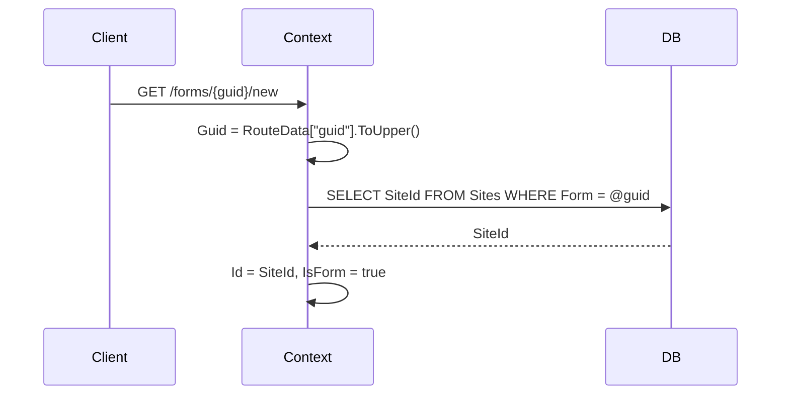
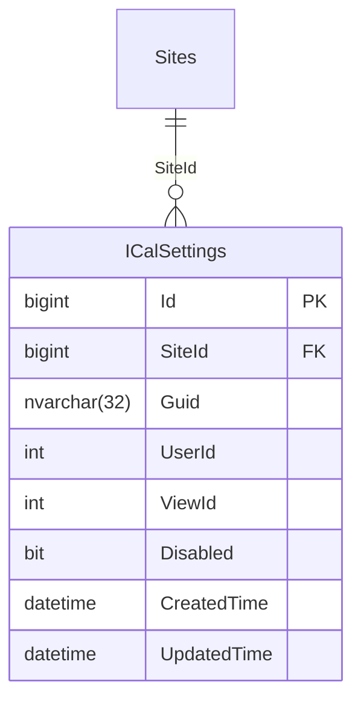
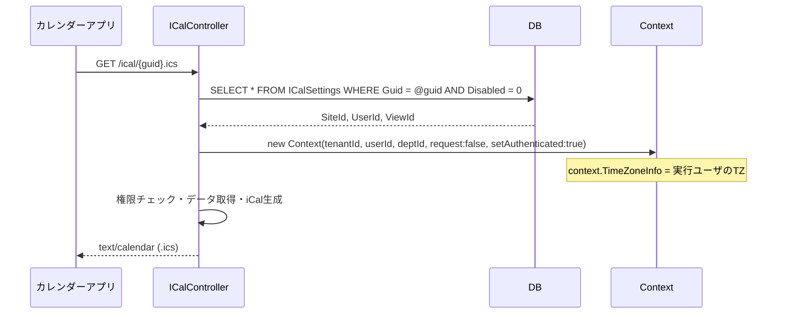
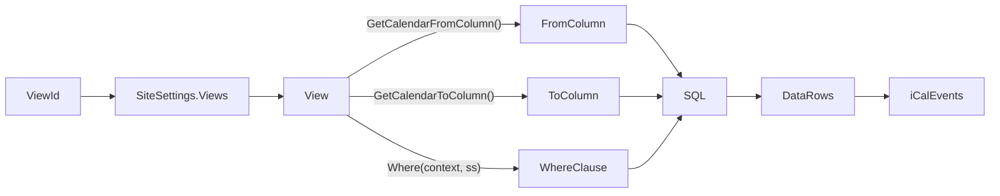
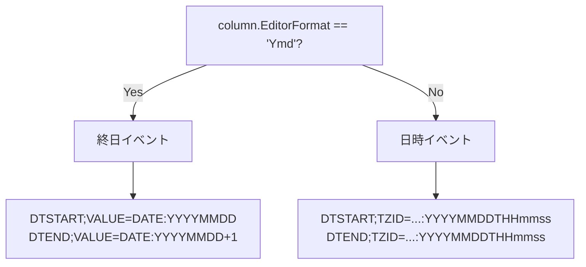
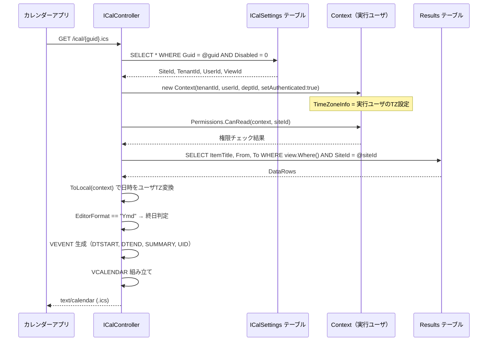

# iCal インターフェース設計

Pleasanter へ iCal（iCalendar / RFC 5545）フィード機能を追加する際の実装設計を調査する。
フォーム機能を参考にした推測不能 URL、実行ユーザ指定、ユーザタイムゾーン対応、
ビュー・フィルタ適用、複数設定の管理方法を整理する。

<!-- START doctoc generated TOC please keep comment here to allow auto update -->
<!-- DON'T EDIT THIS SECTION, INSTEAD RE-RUN doctoc TO UPDATE -->

- [調査情報](#調査情報)
- [調査目的](#調査目的)
- [前提: フォーム機能の URL 設計](#前提-フォーム機能の-url-設計)
    - [Sites.Form カラムの役割](#sitesform-カラムの役割)
    - [GUID 生成方法](#guid-生成方法)
    - [Context による SiteId 解決フロー](#context-による-siteid-解決フロー)
- [iCal インターフェースの設計方針](#ical-インターフェースの設計方針)
    - [URL 設計](#url-設計)
    - [複数設定の管理](#複数設定の管理)
- [DB 設計案](#db-設計案)
    - [案 A: 専用テーブル（推奨）](#案-a-専用テーブル推奨)
    - [案 B: SiteSettings JSON 埋め込み](#案-b-sitesettings-json-埋め込み)
    - [案の比較](#案の比較)
- [実行ユーザの指定と Context 構築](#実行ユーザの指定と-context-構築)
    - [既存パターン: BackgroundServerScriptJob](#既存パターン-backgroundserverscriptjob)
    - [iCal 用の Context 構築方針](#ical-用の-context-構築方針)
    - [閲覧権限チェック](#閲覧権限チェック)
- [タイムゾーン処理](#タイムゾーン処理)
    - [ユーザタイムゾーンの取得](#ユーザタイムゾーンの取得)
    - [終日イベント（all-day）判定](#終日イベントall-day判定)
    - [iCal 出力時の日時フォーマット](#ical-出力時の日時フォーマット)
- [ビュー・フィルタの適用](#ビューフィルタの適用)
    - [View の選択](#view-の選択)
    - [カレンダー列（開始・終了）の取得](#カレンダー列開始終了の取得)
    - [データ取得フロー](#データ取得フロー)
- [Controller・ルーティング設計](#controllerルーティング設計)
    - [エンドポイント](#エンドポイント)
    - [ルーティング設定](#ルーティング設定)
    - [Controller 実装方針](#controller-実装方針)
- [iCal 出力フォーマット](#ical-出力フォーマット)
    - [RFC 5545 最低限の構成](#rfc-5545-最低限の構成)
    - [VTIMEZONE コンポーネント](#vtimezone-コンポーネント)
    - [終日 vs 日時イベントの VEVENT 差分](#終日-vs-日時イベントの-vevent-差分)
- [管理画面の設計](#管理画面の設計)
    - [ICalSetting の設定項目](#icalsetting-の設定項目)
    - [複数設定リスト管理のパターン](#複数設定リスト管理のパターン)
- [全体処理フロー](#全体処理フロー)
- [実装上の注意点](#実装上の注意点)
- [結論](#結論)
- [関連ソースコード](#関連ソースコード)
- [関連ドキュメント](#関連ドキュメント)

<!-- END doctoc generated TOC please keep comment here to allow auto update -->

## 調査情報

| 調査日        | リポジトリ | ブランチ           | タグ/バージョン | コミット    | 備考     |
| ------------- | ---------- | ------------------ | --------------- | ----------- | -------- |
| 2026年2月25日 | Pleasanter | Pleasanter_1.5.1.0 | -               | `34f162a43` | 初回調査 |

## 調査目的

プリザンターのサイト単位で iCal フィードを公開するための実装方式を調査する。
要件は以下の通り。

| 要件                   | 内容                                                         |
| ---------------------- | ------------------------------------------------------------ |
| サイト単位             | 1 つのサイトに紐付いた iCal フィードを提供する               |
| 推測不能 URL           | フォーム機能を参考に GUID ベースの URL にする                |
| 実行ユーザの指定       | フィードを生成する際に使うユーザを設定ごとに指定する         |
| タイムゾーン           | 実行ユーザのタイムゾーンに従い日時を変換・終日判定を行う     |
| ビュー・フィルタの適用 | 保存済みビューを選択し、そのフィルタ条件でレコードを絞る     |
| 複数設定               | 1 サイトに複数の iCal 設定（ビュー×ユーザ の組合せ）を持てる |

---

## 前提: フォーム機能の URL 設計

フォーム機能は「推測不能 URL」の先行実装であるため、その設計を詳しく調査した。

### Sites.Form カラムの役割

`Sites` テーブルには `Form` カラム（`nvarchar`）が存在し、
フォーム機能が有効なサイトに対して **32 文字の UUID（ハイフンなし）** を格納する。

**ファイル**: `Implem.Pleasanter/Models/Sites/SiteModel.cs`（行番号: 61）

```csharp
public string Form = string.Empty;
```

**ファイル**: `Implem.Pleasanter/Libraries/DataSources/Rds.cs`（抜粋）

```csharp
public static SitesWhereCollection Form(
    ...
    columnBrackets: new string[] { "\"Form\"" },
    ...
```

フォームが有効なサイトの URL は以下の形式になる。

```text
/forms/{guid}/new
// 例: /forms/F47AC10B58CC4372A5670E02B2C3D479/new
```

### GUID 生成方法

GUID はブラウザ側（JS）でフォーム有効化チェックボックスを ON にした時点で生成される。

**ファイル**: `Implem.PleasanterFrontend/wwwroot/src/scripts/generals/sitesettings.js`（行番号: 375-391）

```javascript
$p.toggleSitesForm = function (checkbox) {
    if (isChecked) {
        const guid = $p.createGuid();
        // guid = crypto.randomUUID().replace(/-/g, '').toUpperCase();  // 32文字・大文字
        $p.set($formGuid, guid);
        $p.set($formUrl, `${absoluteApplicationRootUri}/forms/${guid}/new`.toLowerCase());
    } else {
        $p.set($formGuid, '');
    }
};
```

**ファイル**: `Implem.PleasanterFrontend/wwwroot/src/scripts/generals/util.js`

```javascript
$p.createGuid = function () {
    // crypto.randomUUID() (HTTPS) または Math.random() フォールバック
    return crypto.randomUUID().replace(/-/g, '').toUpperCase();
};
```

### Context による SiteId 解決フロー

HTTP リクエスト `GET /forms/{guid}/...` を受信したとき、`Context` クラスがルートパラメータ `guid` を取得し、
`Sites.Form = @guid` をキーに DB を検索して `SiteId` を確定する。

**ファイル**: `Implem.Pleasanter/Libraries/Requests/Context.cs`（行番号: 644-758）

```csharp
// Controller == "forms" または "formbinaries" の場合
returnWhere = Rds.SitesWhere()
    .Or(or: Rds.SitesWhere().Form(Guid).SiteId(sub: selectSub));
```



---

## iCal インターフェースの設計方針

### URL 設計

フォーム機能と同様に GUID ベースの URL を採用する。

```text
GET /ical/{guid}.ics
```

- `{guid}` = 32 文字の UUID（ハイフンなし・大文字）
- `.ics` = iCalendar ファイルの標準拡張子（カレンダーアプリが自動認識）
- 認証不要（GUID が秘密情報として機能）

### 複数設定の管理

フォーム機能では `Sites.Form` カラム 1 本（= 1 GUID / サイト）だが、
iCal では **ビュー × 実行ユーザ の組合せで複数設定** が必要なため、
GUID を 1 対多で管理する別の仕組みが必要となる。

---

## DB 設計案

### 案 A: 専用テーブル（推奨）

`ICalSettings` テーブルを新設し、設定ごとに 1 行持つ。



| カラム        | 型             | 説明                                        |
| ------------- | -------------- | ------------------------------------------- |
| `Id`          | `bigint`       | 主キー（自動採番）                          |
| `SiteId`      | `bigint`       | 対象サイトの SiteId（FK: Sites.SiteId）     |
| `Guid`        | `nvarchar(32)` | 推測不能 UUID（ユニークインデックス）       |
| `UserId`      | `int`          | フィード生成時に使う実行ユーザの UserId     |
| `ViewId`      | `int`          | 適用するビューの Id（0 = デフォルトビュー） |
| `Disabled`    | `bit`          | 無効フラグ                                  |
| `CreatedTime` | `datetime`     | 作成日時                                    |
| `UpdatedTime` | `datetime`     | 更新日時                                    |

- `Guid` にユニーク制約を付け、`GET /ical/{guid}.ics` の受信時に `WHERE Guid = @guid` で高速検索できる。
- `ViewId = 0` またはビューが削除済みの場合はデフォルトビュー（フィルタなし）で動作させる。

### 案 B: SiteSettings JSON 埋め込み

`SiteSettings.ICalSettings` として `SettingList<ICalSetting>` を JSON に格納する。

```csharp
// SiteSettings.cs に追加
public SettingList<ICalSetting> ICalSettings;

// ICalSetting.cs（新規）
public class ICalSetting : ISettingListItem
{
    public int Id { get; set; }
    public string Guid;
    public int UserId;
    public int ViewId;
    public bool? Disabled;
}
```

- URL 受信時に GUID を解決するには `Sites.SiteSettings` を全行デシリアライズするか、
  JSON パス検索（DB 依存）が必要となる。
- CodeDefiner によるカラム追加不要だが、GUID ルックアップが非効率。

### 案の比較

| 観点             | 案 A（専用テーブル）           | 案 B（SiteSettings JSON）  |
| ---------------- | ------------------------------ | -------------------------- |
| GUID 検索効率    | インデックスで O(1)            | 全行 JSON スキャン         |
| DB スキーマ変更  | 新テーブル追加（CodeDefiner）  | なし                       |
| CRUD 実装        | 既存モデルパターンに準拠       | SettingList 操作で可       |
| RDB 依存         | なし（PostgreSQL・MySQL 共通） | JSON パス検索は方言差あり  |
| 他機能との一貫性 | Binaries テーブルと同様の発想  | Reminders 設定と同様の発想 |
| 推奨度           | **高**                         | 低                         |

---

## 実行ユーザの指定と Context 構築

### 既存パターン: BackgroundServerScriptJob

バックグラウンドサーバースクリプトは特定ユーザを実行者として `Context` を構築している。
この実装パターンが iCal フィード生成に転用できる。

**ファイル**: `Implem.Pleasanter/Libraries/BackgroundServices/BackgroundServerScriptJob.cs`（行番号: 103-119）

```csharp
private Context CreateContext(int tenantId, int userId)
{
    var user = SiteInfo.User(
        context: new Context(tenantId: tenantId, request: false),
        userId: userId);
    var context = new Context(
        tenantId: tenantId,
        userId: userId,
        deptId: user.DeptId,
        request: false,
        setAuthenticated: true);
    context.SetTenantProperties(force: true);
    return context;
}
```

### iCal 用の Context 構築方針

iCal リクエストを受信したとき、専用テーブルの `UserId` を使って上記パターンで `Context` を構築する。



### 閲覧権限チェック

`Context` 構築後、実行ユーザが対象サイトを閲覧できるかを確認する。

```csharp
// Permissions.CanRead(context, siteId) で確認
if (!Permissions.CanRead(context: context, siteId: siteId))
{
    // 403 または空の iCal を返却
}
```

**ファイル**: `Implem.Pleasanter/Libraries/Security/Permissions.cs`（行番号: 358-365）

```csharp
public static bool CanRead(Context context, long siteId)
{
    // 権限テーブルを参照して閲覧可否を返す
}
```

---

## タイムゾーン処理

### ユーザタイムゾーンの取得

`Context` オブジェクトが実行ユーザの設定から `TimeZoneInfo` を保持している。

```csharp
// DB 格納値（サーバーローカル TZ 基準）をユーザ TZ に変換
DateTime localDateTime = dbDateTime.ToLocal(context: context);
// ユーザ TZ から UTC に変換
DateTime utcDateTime = TimeZoneInfo.ConvertTimeToUtc(localDateTime, context.TimeZoneInfo);
```

| 変換方向           | メソッド                                                  |
| ------------------ | --------------------------------------------------------- |
| DB 値 → ユーザ表示 | `dateTime.ToLocal(context)`                               |
| ユーザ入力 → DB 値 | `dateTime.ToUniversal(context)`                           |
| ユーザ TZ → UTC    | `TimeZoneInfo.ConvertTimeToUtc(dt, context.TimeZoneInfo)` |

詳細は [012-タイムゾーン全体設計](../05-基盤・ツール/012-タイムゾーン全体設計.md) を参照。

### 終日イベント（all-day）判定

カラムの `EditorFormat` が `"Ymd"`（日付のみ）の場合は時刻を持たないため、
iCal において `DATE` 型（終日）として扱う。

**ファイル**: `Implem.Pleasanter/Libraries/HtmlParts/HtmlCalendar.cs`（行番号: 725）

```csharp
time: (from?.EditorFormat == "Ymdhm"
    ? dataRow.DateTime("From").ToLocal(context: context).ToString("HH:mm") + " "
    : null),
```

| `EditorFormat` | iCal の型               | DTSTART 形式例                                     |
| -------------- | ----------------------- | -------------------------------------------------- |
| `Ymd`          | `DATE`（終日）          | `DTSTART;VALUE=DATE:20260301`                      |
| `Ymdhm`        | `DATE-TIME`（日時）     | `DTSTART;TZID=Tokyo Standard Time:20260301T090000` |
| `Ymdhms`       | `DATE-TIME`（日時・秒） | `DTSTART;TZID=Tokyo Standard Time:20260301T090000` |

### iCal 出力時の日時フォーマット

iCal の `DATE-TIME` は UTC（`Z` サフィックス）または `TZID` 付きローカル時刻で表現する。
ユーザタイムゾーンを保持したい場合は `TZID` 方式が望ましい。

```text
DTSTART;TZID=Tokyo Standard Time:20260301T090000
DTEND;TZID=Tokyo Standard Time:20260301T100000
```

終日の場合（`EditorFormat == "Ymd"`）:

```text
DTSTART;VALUE=DATE:20260301
DTEND;VALUE=DATE:20260302
```

> 終日イベントの `DTEND` は **当日の翌日** を指定する（RFC 5545 の規定）。
> これは Pleasanter の `AddDifferenceOfDates` ロジック（`Ymd` カラムの +1 日ルール）と整合する。
> 詳細は [014-タイムゾーン混在時の日付フィールド問題](../05-基盤・ツール/014-タイムゾーン混在時の日付フィールド問題.md) を参照。

---

## ビュー・フィルタの適用

### View の選択

`SiteSettings.Views` に保存されているビュー一覧から `ViewId` で選択する。

**ファイル**: `Implem.Pleasanter/Libraries/Settings/SiteSettings.cs`（行番号: 196）

```csharp
public List<View> Views;
```

```csharp
// ViewId == 0 または該当ビューが存在しない場合はデフォルトビュー
var view = ss.Views?.FirstOrDefault(o => o.Id == viewId)
    ?? new View(context: context, ss: ss);
```

### カレンダー列（開始・終了）の取得

`View.CalendarFromTo` は `"FromColumnName-ToColumnName"` の形式で格納されており、
開始・終了カラム名をそれぞれ取得できる。

**ファイル**: `Implem.Pleasanter/Libraries/Settings/View.cs`（行番号: 200-208）

```csharp
public string GetCalendarFromColumn(SiteSettings ss)
{
    return GetCalendarFromTo(ss).Split_1st('-');
}
public string GetCalendarToColumn(SiteSettings ss)
{
    return GetCalendarFromTo(ss).Split_2nd('-');
}
```

### データ取得フロー

**ファイル**: `Implem.Pleasanter/Models/Results/ResultUtilities.cs`（行番号: 8644-8720）

```csharp
// view.Where() がビュー保存済みフィルタ条件を SQL WHERE 句に変換する
where = view.Where(context: context, ss: ss, where: where);
var param = view.Param(context: context, ss: ss);
```



---

## Controller・ルーティング設計

### エンドポイント

```text
GET /ical/{guid}.ics
```

- `[AllowAnonymous]` 属性を付与（GUID が認証トークンとして機能）
- `Content-Type: text/calendar; charset=utf-8`
- `Content-Disposition: attachment; filename="calendar.ics"` を推奨（ブラウザダウンロード対策）

### ルーティング設定

**ファイル**: `Implem.Pleasanter/Startup.cs`（ルーティング登録箇所）

フォーム機能と同様のパターンでルートを追加する。

```csharp
endpoints.MapControllerRoute(
    name: "ICal",
    pattern: "ical/{guid}.ics",
    defaults: new { Controller = "ICal", Action = "Get" },
    constraints: new { Guid = "[A-Fa-f0-9]{32}" }
);
```

### Controller 実装方針

```csharp
[AllowAnonymous]
public class ICalController : Controller
{
    [HttpGet]
    public IActionResult Get(string guid)
    {
        // 1. ICalSettings テーブルを guid で検索
        var setting = ICalSettingsRepository.GetByGuid(guid);
        if (setting == null || setting.Disabled) return NotFound();

        // 2. 実行ユーザ Context を構築
        var context = CreateContext(
            tenantId: setting.TenantId,
            userId: setting.UserId);

        // 3. 閲覧権限チェック
        var ss = SiteSettingsUtilities.GetSiteSettings(context, setting.SiteId);
        if (!Permissions.CanRead(context: context, siteId: setting.SiteId))
            return Forbid();

        // 4. ビュー取得・データ取得・iCal 生成
        var icsContent = ICalUtilities.Generate(context, ss, setting.ViewId);

        return File(
            Encoding.UTF8.GetBytes(icsContent),
            "text/calendar; charset=utf-8",
            "calendar.ics");
    }
}
```

---

## iCal 出力フォーマット

### RFC 5545 最低限の構成

```text
BEGIN:VCALENDAR
VERSION:2.0
PRODID:-//VehicleVision//Pleasanter iCal//JA
CALSCALE:GREGORIAN
METHOD:PUBLISH
X-WR-TIMEZONE:Asia/Tokyo
BEGIN:VTIMEZONE
  ...（VTIMEZONEコンポーネント）
END:VTIMEZONE
BEGIN:VEVENT
  DTSTART;TZID=Tokyo Standard Time:20260301T090000
  DTEND;TZID=Tokyo Standard Time:20260301T100000
  SUMMARY:タスク名
  UID:pleasanter-{SiteId}-{Id}@example.com
  DTSTAMP:20260225T024100Z
END:VEVENT
...
END:VCALENDAR
```

### VTIMEZONE コンポーネント

実行ユーザの `TimeZoneInfo` から VTIMEZONE を動的生成するか、
.NET の `TimeZoneInfo` から iCal 用に変換するライブラリ（Ical.Net 等）を使用する。

### 終日 vs 日時イベントの VEVENT 差分



---

## 管理画面の設計

### ICalSetting の設定項目

| 項目            | 型     | 説明                                         |
| --------------- | ------ | -------------------------------------------- |
| タイトル        | string | 管理用の名称（管理画面表示用）               |
| 実行ユーザ      | UserId | フィード生成に使うユーザ（権限・TZ に影響）  |
| ビュー          | ViewId | 適用するビュー（フィルタ条件）               |
| 無効            | bool   | フィードを無効化するフラグ                   |
| URL（自動生成） | string | `/ical/{guid}.ics`（読み取り専用・コピー可） |

### 複数設定リスト管理のパターン

フォーム機能（単一設定）では `Sites.Form` カラム 1 本で管理しているが、
iCal は複数設定が必要なため、`Reminders` 設定と同様の **SettingList パターン** を管理 UI に適用する。

**ファイル**: `Implem.Pleasanter/Libraries/Settings/SettingList.cs`

```csharp
public class SettingList<T> : List<T> where T : ISettingListItem
{
    // MoveUpOrDown / Copy / Delete など共通操作
}
```

管理画面の操作フロー（Reminders と同様）:

1. 「新規追加」→ ランダム GUID を自動生成
2. 実行ユーザ・ビューを選択
3. 「保存」→ `ICalSettings` テーブルに INSERT/UPDATE
4. URL をクリップボードコピーしてカレンダーアプリに登録

---

## 全体処理フロー



---

## 実装上の注意点

| 注意点               | 詳細                                                                          |
| -------------------- | ----------------------------------------------------------------------------- |
| GUID の秘密性        | GUID が流出すると誰でもフィードにアクセス可能。管理画面での再生成機能が必要   |
| 実行ユーザの権限剥奪 | 実行ユーザが無効化・削除された場合、フィードは 403 または空カレンダーを返す   |
| ビュー削除時の挙動   | `ViewId` のビューが削除された場合、デフォルトビュー（全件）にフォールバック   |
| タイムゾーン変更     | 実行ユーザがタイムゾーン設定を変更すると、同一 GUID でも日時が変化する        |
| 終日イベントの DTEND | RFC 5545 仕様では終日 DTEND は翌日（当日+1日）。DB 値の +1 日処理が必要       |
| キャッシュ           | iCal クライアントのポーリング負荷を考慮し、HTTP `Cache-Control` を設定する    |
| CodeDefiner 対応     | 案 A（専用テーブル）を採用する場合は CodeDefiner の定義ファイルへの追加が必要 |
| テナント ID の取得   | `ICalSettings` テーブルに `TenantId` を持たせるか、`SiteId` から逆引きする    |

---

## 結論

| 要件             | 実装アプローチ                                                          |
| ---------------- | ----------------------------------------------------------------------- |
| 推測不能 URL     | `ICalSettings.Guid`（32文字UUID）を使い `/ical/{guid}.ics` とする       |
| 複数設定         | 専用テーブル `ICalSettings`（SiteId 1 対多）で管理                      |
| 実行ユーザ指定   | `BackgroundServerScriptJob.CreateContext()` と同パターンで Context 構築 |
| 閲覧権限チェック | `Permissions.CanRead(context, siteId)` で実行ユーザの閲覧権限を検証     |
| タイムゾーン     | `context.TimeZoneInfo` から変換；`EditorFormat == "Ymd"` で終日判定     |
| ビュー・フィルタ | `SiteSettings.Views` から ViewId でビューを取得し `view.Where()` を適用 |
| DB 設計          | 専用テーブル案（GUID 検索効率・RDB 非依存）を推奨                       |

---

## 関連ソースコード

| ファイル                                                                      | 関連内容                                |
| ----------------------------------------------------------------------------- | --------------------------------------- |
| `Implem.Pleasanter/Controllers/FormsController.cs`                            | フォーム機能 Controller（URL 参考）     |
| `Implem.Pleasanter/Libraries/Requests/Context.cs`                             | GUID → SiteId 解決・ユーザ Context 構築 |
| `Implem.Pleasanter/Libraries/Settings/SiteSettings.cs`                        | Views・各種 SettingList の格納          |
| `Implem.Pleasanter/Libraries/Settings/View.cs`                                | ビュー選択・CalendarFromTo 取得         |
| `Implem.Pleasanter/Libraries/Settings/SettingList.cs`                         | SettingList の CRUD 操作                |
| `Implem.Pleasanter/Libraries/Settings/Reminder.cs`                            | 複数設定リストの実装参考例              |
| `Implem.Pleasanter/Libraries/HtmlParts/HtmlCalendar.cs`                       | EditorFormat による終日判定             |
| `Implem.Pleasanter/Libraries/ViewModes/CalendarElement.cs`                    | カレンダーデータ構造                    |
| `Implem.Pleasanter/Libraries/Security/Permissions.cs`                         | CanRead による権限チェック              |
| `Implem.Pleasanter/Libraries/BackgroundServices/BackgroundServerScriptJob.cs` | 特定ユーザ Context 構築パターン         |
| `Implem.Pleasanter/Models/Results/ResultUtilities.cs`                         | CalendarDataRows（データ取得 SQL）      |
| `Implem.PleasanterFrontend/wwwroot/src/scripts/generals/sitesettings.js`      | GUID 生成・フォーム URL 設定            |
| `Implem.PleasanterFrontend/wwwroot/src/scripts/generals/util.js`              | `$p.createGuid()` 実装                  |

---

## 関連ドキュメント

- [012-タイムゾーン全体設計](../05-基盤・ツール/012-タイムゾーン全体設計.md)
- [013-ServerScript タイムゾーン要注意事項](../05-基盤・ツール/013-ServerScriptタイムゾーン要注意事項.md)
- [014-タイムゾーン混在時の日付フィールド問題](../05-基盤・ツール/014-タイムゾーン混在時の日付フィールド問題.md)
- [004-API 専用ユーザ実装調査](../01-認証・権限/004-API専用ユーザ実装調査.md)
