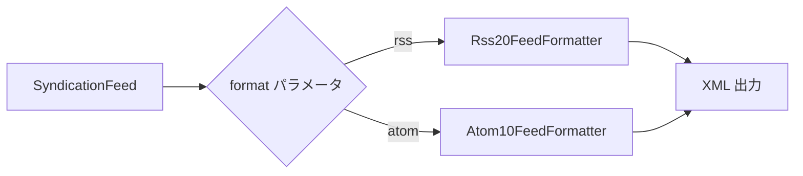
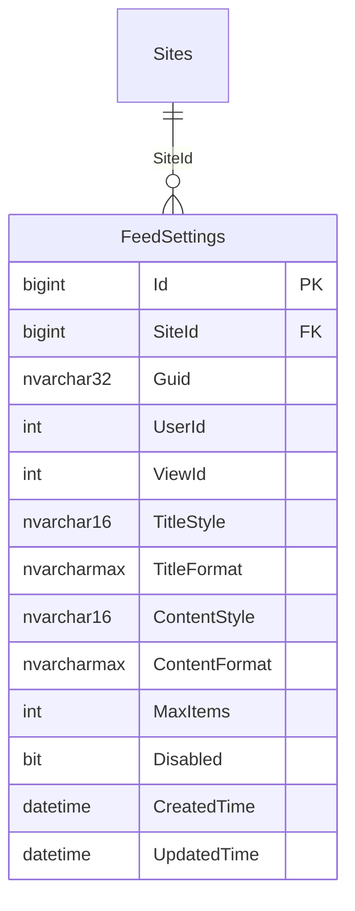
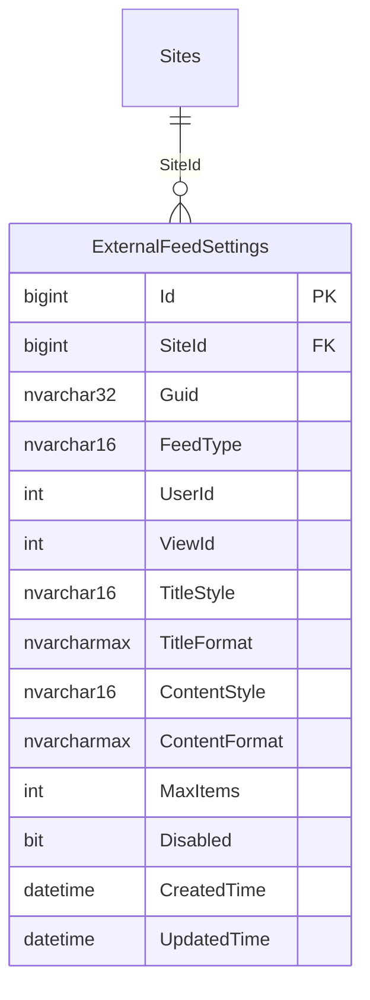
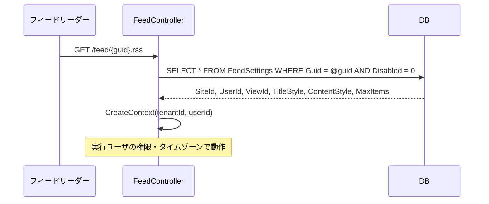
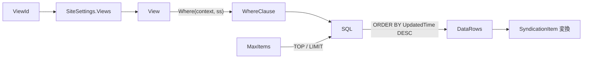
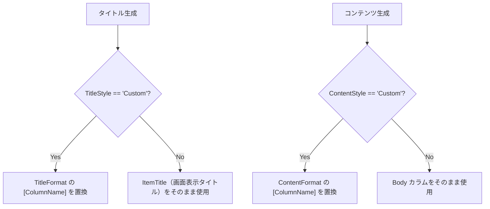
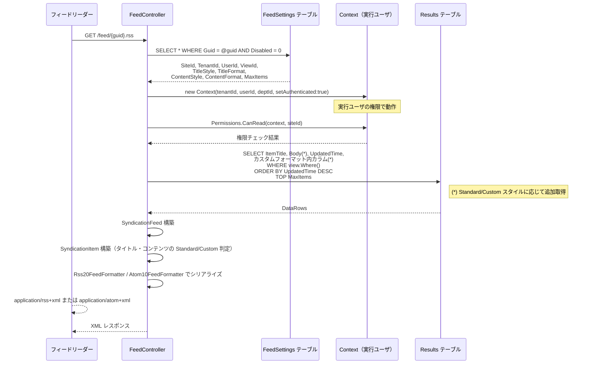

# RSS・Atom フィード設計

Pleasanter へ RSS 2.0 / Atom 1.0 フィード機能を追加する際の実装設計を調査する。
iCal インターフェース設計を参考に、GUID ベースの推測不能 URL、実行ユーザ指定、
ビュー・フィルタ適用、フィードアイテムのカスタムフォーマットを整理する。

<!-- START doctoc generated TOC please keep comment here to allow auto update -->
<!-- DON'T EDIT THIS SECTION, INSTEAD RE-RUN doctoc TO UPDATE -->

- [調査情報](#調査情報)
- [調査目的](#調査目的)
- [前提: iCal インターフェース設計との共通点](#前提-ical-インターフェース設計との共通点)
- [RSS 2.0 と Atom 1.0 の仕様概要](#rss-20-と-atom-10-の仕様概要)
    - [RSS 2.0](#rss-20)
    - [Atom 1.0（RFC 4287）](#atom-10rfc-4287)
    - [RSS 2.0 と Atom 1.0 の比較](#rss-20-と-atom-10-の比較)
- [.NET におけるフィード生成ライブラリ](#net-におけるフィード生成ライブラリ)
    - [System.ServiceModel.Syndication](#systemservicemodelsyndication)
    - [使用例](#使用例)
- [URL 設計](#url-設計)
    - [エンドポイント](#エンドポイント)
    - [代替案: クエリパラメータ方式](#代替案-クエリパラメータ方式)
    - [複数設定の管理](#複数設定の管理)
- [DB 設計](#db-設計)
    - [方針](#方針)
    - [FeedSettings テーブル](#feedsettings-テーブル)
    - [iCal との統合テーブル案](#ical-との統合テーブル案)
- [実行ユーザの指定と Context 構築](#実行ユーザの指定と-context-構築)
- [フィードアイテムへのマッピング](#フィードアイテムへのマッピング)
    - [レコードとフィードエントリの対応](#レコードとフィードエントリの対応)
    - [データ取得 SQL](#データ取得-sql)
    - [データ取得フロー](#データ取得フロー)
- [フィードのタイトル・コンテンツスタイル](#フィードのタイトルコンテンツスタイル)
    - [標準スタイル](#標準スタイル)
    - [カスタムスタイル](#カスタムスタイル)
    - [プレースホルダ置換の仕組み](#プレースホルダ置換の仕組み)
    - [スタイル判定フロー](#スタイル判定フロー)
    - [カスタムスタイル使用時のデータ取得](#カスタムスタイル使用時のデータ取得)
- [Controller・ルーティング設計](#controllerルーティング設計)
    - [エンドポイント](#エンドポイント-1)
    - [ルーティング設定](#ルーティング設定)
    - [Controller 実装方針](#controller-実装方針)
- [SyndicationFeed の構築](#syndicationfeed-の構築)
    - [フィードメタデータ](#フィードメタデータ)
    - [エントリ構築](#エントリ構築)
- [管理画面の設計](#管理画面の設計)
    - [FeedSetting の設定項目](#feedsetting-の設定項目)
    - [サイト設定タブの追加](#サイト設定タブの追加)
    - [複数設定リスト管理のパターン](#複数設定リスト管理のパターン)
- [全体処理フロー](#全体処理フロー)
- [キャッシュ制御](#キャッシュ制御)
    - [HTTP キャッシュヘッダ](#http-キャッシュヘッダ)
    - [条件付きリクエスト対応](#条件付きリクエスト対応)
- [iCal 設計との差異](#ical-設計との差異)
- [実装上の注意点](#実装上の注意点)
- [結論](#結論)
- [関連ソースコード](#関連ソースコード)
- [関連ドキュメント](#関連ドキュメント)

<!-- END doctoc generated TOC please keep comment here to allow auto update -->

## 調査情報

| 調査日        | リポジトリ | ブランチ           | タグ/バージョン | コミット    | 備考     |
| ------------- | ---------- | ------------------ | --------------- | ----------- | -------- |
| 2026年2月26日 | Pleasanter | Pleasanter_1.5.1.0 | -               | `34f162a43` | 初回調査 |

## 調査目的

iCal インターフェース設計と同様の設計方針で、プリザンターのサイト単位に
RSS 2.0 / Atom 1.0 フィードを公開するための実装方式を調査する。
要件は以下の通り。

| 要件                   | 内容                                                                                    |
| ---------------------- | --------------------------------------------------------------------------------------- |
| サイト単位             | 1 つのサイトに紐付いたフィードを提供する                                                |
| 推測不能 URL           | iCal と同様に GUID ベースの URL にする                                                  |
| フォーマット選択       | RSS 2.0 と Atom 1.0 の両方をサポートする                                                |
| 実行ユーザの指定       | フィードを生成する際に使うユーザを設定ごとに指定する                                    |
| ビュー・フィルタの適用 | 保存済みビューを選択し、そのフィルタ条件でレコードを絞る                                |
| 複数設定               | 1 サイトに複数のフィード設定（ビュー×ユーザ の組合せ）を持てる                          |
| TITLE スタイル         | 標準（画面表示タイトル）またはカスタム（`[カラム名]` プレースホルダ形式のテンプレート） |
| CONTENT スタイル       | 標準（Body カラム）またはカスタム（`[カラム名]` プレースホルダ形式のテンプレート）      |
| 件数制限               | フィードに含めるアイテム数の上限を設定可能にする                                        |

---

## 前提: iCal インターフェース設計との共通点

iCal インターフェース設計で調査済みの以下の要素は、RSS・Atom フィードでも共通して適用できる。
本ドキュメントでは差分を中心に記述する。

| 共通要素                 | 参照先                                                                      |
| ------------------------ | --------------------------------------------------------------------------- |
| GUID ベース URL 設計     | [006-iCal インターフェース設計](006-iCalインターフェース設計.md) - URL 設計 |
| 実行ユーザ Context 構築  | 同上 - 実行ユーザの指定と Context 構築                                      |
| 閲覧権限チェック         | 同上 - 閲覧権限チェック                                                     |
| ビュー・フィルタの適用   | 同上 - ビュー・フィルタの適用                                               |
| テンプレート置換の仕組み | 同上 - VEVENT の SUMMARY・DESCRIPTION スタイル                              |
| DB 設計の案比較          | 同上 - DB 設計案（専用テーブル vs SiteSettings JSON）                       |

---

## RSS 2.0 と Atom 1.0 の仕様概要

### RSS 2.0

RSS 2.0 は XML ベースのフィード配信形式であり、`<channel>` 要素の中に `<item>` 要素を並べる構造を取る。

```xml
<?xml version="1.0" encoding="UTF-8" ?>
<rss version="2.0">
  <channel>
    <title>サイト名</title>
    <link>https://example.com/items/123</link>
    <description>サイトの説明</description>
    <language>ja</language>
    <lastBuildDate>Thu, 26 Feb 2026 12:00:00 +0900</lastBuildDate>
    <item>
      <title>レコードタイトル</title>
      <link>https://example.com/items/456/edit</link>
      <description>レコードの内容</description>
      <pubDate>Wed, 25 Feb 2026 09:00:00 +0900</pubDate>
      <guid isPermaLink="false">pleasanter-123-456</guid>
    </item>
  </channel>
</rss>
```

| 要素              | 必須 | 説明                                                                           |
| ----------------- | :--: | ------------------------------------------------------------------------------ |
| `<channel>`       | Yes  | フィード全体のコンテナ                                                         |
| `<title>`         | Yes  | フィードのタイトル                                                             |
| `<link>`          | Yes  | フィードに対応する Web ページの URL                                            |
| `<description>`   | Yes  | フィードの説明                                                                 |
| `<language>`      |  No  | 言語コード（`ja` 等）                                                          |
| `<lastBuildDate>` |  No  | フィードの最終更新日時（RFC 822 形式）                                         |
| `<item>`          |  No  | 個々のエントリ（`<title>` `<link>` `<description>` のいずれか 1 つ以上が必要） |
| `<guid>`          |  No  | エントリの一意識別子（`isPermaLink="false"` で非 URL 識別子を指定可能）        |
| `<pubDate>`       |  No  | エントリの公開日時（RFC 822 形式）                                             |

### Atom 1.0（RFC 4287）

Atom 1.0 は RSS 2.0 の曖昧さを解消した標準化フォーマットであり、`<feed>` 要素の中に `<entry>` 要素を並べる。

```xml
<?xml version="1.0" encoding="UTF-8" ?>
<feed xmlns="http://www.w3.org/2005/Atom">
  <title>サイト名</title>
  <link href="https://example.com/items/123" />
  <link rel="self" href="https://example.com/feed/GUID" />
  <id>urn:pleasanter:site:123</id>
  <updated>2026-02-26T12:00:00+09:00</updated>
  <author>
    <name>実行ユーザ名</name>
  </author>
  <entry>
    <title>レコードタイトル</title>
    <link href="https://example.com/items/456/edit" />
    <id>urn:pleasanter:item:123:456</id>
    <updated>2026-02-25T09:00:00+09:00</updated>
    <summary>レコードの内容</summary>
  </entry>
</feed>
```

| 要素              | 必須 | 説明                                                     |
| ----------------- | :--: | -------------------------------------------------------- |
| `<feed>`          | Yes  | フィード全体のコンテナ（名前空間付き）                   |
| `<title>`         | Yes  | フィードのタイトル                                       |
| `<id>`            | Yes  | フィードの一意識別子（URN 形式推奨）                     |
| `<updated>`       | Yes  | フィードの最終更新日時（RFC 3339 形式）                  |
| `<link>`          |  No  | 関連 URL（`rel="self"` でフィード自身の URL を指定可能） |
| `<author>`        | (\*) | フィードの作成者（エントリに無い場合は必須）             |
| `<entry>`         |  No  | 個々のエントリ                                           |
| entry `<title>`   | Yes  | エントリのタイトル                                       |
| entry `<id>`      | Yes  | エントリの一意識別子                                     |
| entry `<updated>` | Yes  | エントリの最終更新日時（RFC 3339 形式）                  |

### RSS 2.0 と Atom 1.0 の比較

| 観点           | RSS 2.0               | Atom 1.0（RFC 4287）          |
| -------------- | --------------------- | ----------------------------- |
| 標準化         | 事実上の標準          | IETF 標準（RFC 4287）         |
| 日時形式       | RFC 822               | RFC 3339（ISO 8601 互換）     |
| エントリ識別子 | `<guid>`（任意）      | `<id>`（必須）                |
| 更新日時       | `<pubDate>`（任意）   | `<updated>`（必須）           |
| コンテンツ型   | プレーンテキスト前提  | `type` 属性で HTML 等指定可   |
| Content-Type   | `application/rss+xml` | `application/atom+xml`        |
| 名前空間       | なし                  | `http://www.w3.org/2005/Atom` |

---

## .NET におけるフィード生成ライブラリ

### System.ServiceModel.Syndication

.NET には `System.ServiceModel.Syndication` NuGet パッケージが提供されており、
RSS 2.0 / Atom 1.0 の両方のフォーマッタを備えている。
Pleasanter の `net10.0` ターゲットで追加パッケージとして利用可能である。

```xml
<PackageReference Include="System.ServiceModel.Syndication" Version="10.0.3" />
```

| クラス                | 役割                                                 |
| --------------------- | ---------------------------------------------------- |
| `SyndicationFeed`     | フィード全体（タイトル・説明・エントリの集合）を表す |
| `SyndicationItem`     | 個々のフィードエントリを表す                         |
| `Rss20FeedFormatter`  | `SyndicationFeed` を RSS 2.0 XML にシリアライズする  |
| `Atom10FeedFormatter` | `SyndicationFeed` を Atom 1.0 XML にシリアライズする |

### 使用例

```csharp
using System.ServiceModel.Syndication;
using System.Xml;

var feed = new SyndicationFeed(
    title: "サイト名",
    description: "サイトの説明",
    feedAlternateLink: new Uri("https://example.com/items/123"));

feed.Language = "ja";
feed.LastUpdatedTime = DateTimeOffset.Now;

var items = new List<SyndicationItem>
{
    new SyndicationItem(
        title: "レコードタイトル",
        content: "レコードの内容",
        itemAlternateLink: new Uri("https://example.com/items/456/edit"),
        id: "pleasanter-123-456",
        lastUpdatedTime: DateTimeOffset.Now)
};
feed.Items = items;

// RSS 2.0 出力
using var sw = new StringWriter();
using (var writer = XmlWriter.Create(sw, new XmlWriterSettings { Indent = true }))
{
    new Rss20FeedFormatter(feed).WriteTo(writer);
}
var rssXml = sw.ToString();
```

RSS と Atom を切り替えるには `Rss20FeedFormatter` と `Atom10FeedFormatter` を差し替えるだけでよい。
フィードデータの構築は共通化できるため、フォーマット選択は出力段階のみの分岐となる。



---

## URL 設計

### エンドポイント

iCal と同様に GUID ベースの URL を採用する。
フォーマット（RSS / Atom）はパスの拡張子で区別する。

```text
GET /feed/{guid}.rss     # RSS 2.0
GET /feed/{guid}.atom    # Atom 1.0
```

- `{guid}` = 32 文字の UUID（ハイフンなし・大文字）
- 認証不要（GUID が秘密情報として機能）
- 拡張子でフォーマットを決定する

| 拡張子  | フォーマット | Content-Type           |
| ------- | ------------ | ---------------------- |
| `.rss`  | RSS 2.0      | `application/rss+xml`  |
| `.atom` | Atom 1.0     | `application/atom+xml` |

### 代替案: クエリパラメータ方式

拡張子の代わりにクエリパラメータでフォーマットを指定する方式も考えられる。

```text
GET /feed/{guid}?format=rss
GET /feed/{guid}?format=atom
```

ただし、フィードリーダーの多くは URL をそのまま識別子として扱うため、
拡張子方式の方が一般的であり、フィードリーダーの互換性が高い。

### 複数設定の管理

iCal と同様に、1 サイトに対して複数のフィード設定を持てるようにする。
GUID は設定ごとに一意であり、ビュー・実行ユーザ・フォーマットスタイルの組合せごとに発行する。

---

## DB 設計

### 方針

iCal インターフェース設計と同様に、**専用テーブル方式**（案 A）を推奨する。
理由は GUID による高速検索が必要なためであり、詳細な比較は
[006-iCal インターフェース設計 - DB 設計案](006-iCalインターフェース設計.md#db-設計案) を参照。

### FeedSettings テーブル



| カラム          | 型              | 説明                                                              |
| --------------- | --------------- | ----------------------------------------------------------------- |
| `Id`            | `bigint`        | 主キー（自動採番）                                                |
| `SiteId`        | `bigint`        | 対象サイトの SiteId（FK: Sites.SiteId）                           |
| `Guid`          | `nvarchar(32)`  | 推測不能 UUID（ユニークインデックス）                             |
| `UserId`        | `int`           | フィード生成時に使う実行ユーザの UserId                           |
| `ViewId`        | `int`           | 適用するビューの Id（0 = デフォルトビュー）                       |
| `TitleStyle`    | `nvarchar(16)`  | `Standard`（画面表示タイトル）または `Custom`（テンプレート形式） |
| `TitleFormat`   | `nvarchar(max)` | カスタムタイトルテンプレート（例: `[Title] ([ClassA])`）          |
| `ContentStyle`  | `nvarchar(16)`  | `Standard`（Body カラム）または `Custom`（テンプレート形式）      |
| `ContentFormat` | `nvarchar(max)` | カスタムコンテンツテンプレート（例: `[Body]\n担当: [Manager]`）   |
| `MaxItems`      | `int`           | フィードに含める最大アイテム数（0 = 無制限）                      |
| `Disabled`      | `bit`           | 無効フラグ                                                        |
| `CreatedTime`   | `datetime`      | 作成日時                                                          |
| `UpdatedTime`   | `datetime`      | 更新日時                                                          |

- `Guid` にユニーク制約を付け、`WHERE Guid = @guid` で O(1) 検索を実現する。
- `ViewId = 0` またはビューが削除済みの場合はデフォルトビュー（フィルタなし）で動作させる。
- `MaxItems` のデフォルト値は `50` 程度を推奨する。

### iCal との統合テーブル案

iCal と RSS・Atom のフィード設定は構造が類似しているため、1 つの統合テーブルにする案も考えられる。



| FeedType 値 | 出力形式  | Content-Type           | 備考               |
| ----------- | --------- | ---------------------- | ------------------ |
| `ICal`      | iCalendar | `text/calendar`        | VCALENDAR + VEVENT |
| `Rss`       | RSS 2.0   | `application/rss+xml`  | channel + item     |
| `Atom`      | Atom 1.0  | `application/atom+xml` | feed + entry       |

統合テーブル方式の利点と欠点:

| 観点             | 統合テーブル                           | 分離テーブル（iCal + Feed）           |
| ---------------- | -------------------------------------- | ------------------------------------- |
| テーブル数       | 1 テーブル                             | 2 テーブル                            |
| カラム構成       | iCal 固有カラムが NULL 許容になる      | 各テーブルに必要なカラムのみ配置      |
| GUID 検索        | 1 テーブルで全フィードタイプを検索可能 | FeedType 別に検索先を分ける必要がある |
| 拡張性           | FeedType を追加するだけで新形式に対応  | 新形式ごとにテーブル追加が必要        |
| CodeDefiner 対応 | 1 テーブル分の定義追加                 | テーブル数分の定義追加                |

本ドキュメントでは分離テーブル方式（`FeedSettings`）で設計するが、
実装時に iCal と統合する判断も可能である。

---

## 実行ユーザの指定と Context 構築

iCal インターフェース設計と同一の方式を適用する。

**ファイル**: `Implem.Pleasanter/Libraries/BackgroundServices/BackgroundServerScriptJob.cs`（行番号: 103-119）

```csharp
private Context CreateContext(int tenantId, int userId)
{
    var user = SiteInfo.User(
        context: new Context(tenantId: tenantId, request: false),
        userId: userId);
    var context = new Context(
        tenantId: tenantId,
        userId: userId,
        deptId: user.DeptId,
        request: false,
        setAuthenticated: true);
    context.SetTenantProperties(force: true);
    return context;
}
```



---

## フィードアイテムへのマッピング

### レコードとフィードエントリの対応

プリザンターのレコード（Issues / Results）をフィードエントリにマッピングする。

| レコードのフィールド    | RSS 2.0 要素    | Atom 1.0 要素       | 取得元                                 |
| ----------------------- | --------------- | ------------------- | -------------------------------------- |
| タイトル（ItemTitle）   | `<title>`       | `<title>`           | `Items.Title` JOIN                     |
| 内容（Body）            | `<description>` | `<summary>`         | `Results.Body` / `Issues.Body`         |
| レコード URL            | `<link>`        | `<link href="...">` | `{ApplicationRootUri}/items/{Id}/edit` |
| 一意識別子              | `<guid>`        | `<id>`              | `pleasanter-{SiteId}-{Id}`             |
| 更新日時（UpdatedTime） | `<pubDate>`     | `<updated>`         | レコードの `UpdatedTime`               |
| 作成日時（CreatedTime） | -               | `<published>`       | レコードの `CreatedTime`（Atom のみ）  |
| 更新者（Updator）       | `<author>`      | `<author><name>`    | `Users.Name` JOIN                      |

### データ取得 SQL

ビューのフィルタ条件を適用してレコードを取得する。
iCal ではカレンダー列（From / To）を取得したが、
フィードでは `UpdatedTime` を基準に降順ソートし、`MaxItems` で件数を制限する。

```csharp
// ビューのフィルタ条件を適用
where = view.Where(context: context, ss: ss, where: where);

// UpdatedTime 降順でソート（最新のレコードが先頭）
orderBy = new SqlOrderByCollection()
    .Add(columnBracket: "\"UpdatedTime\"", orderType: SqlOrderBy.Types.desc);

// MaxItems で件数制限
top = setting.MaxItems > 0 ? setting.MaxItems : 0;
```

### データ取得フロー



---

## フィードのタイトル・コンテンツスタイル

iCal の SUMMARY・DESCRIPTION スタイルと同様に、
フィードアイテムのタイトルとコンテンツに **標準** と **カスタム** の 2 パターンを設定できるようにする。

### 標準スタイル

| フィールド | 出力値                        | 取得元                              |
| ---------- | ----------------------------- | ----------------------------------- |
| タイトル   | 画面表示タイトル（ItemTitle） | `Items.Title` を JOIN で取得する値  |
| コンテンツ | 内容（Body）                  | `Results.Body` または `Issues.Body` |

### カスタムスタイル

iCal と同様に `[カラム名]` プレースホルダ形式のテンプレート文字列で指定する。

| フィールド | 設定例                                            | 説明                                            |
| ---------- | ------------------------------------------------- | ----------------------------------------------- |
| タイトル   | `[Title] ([Manager])`                             | SearchFormat と同様の `[ColumnName]` 形式で指定 |
| コンテンツ | `[Body]\n担当: [Manager]\n期限: [CompletionTime]` | GridDesign と同様の `[ColumnName]` 形式で指定   |

### プレースホルダ置換の仕組み

`TdCustomValue`（`ResultUtilities.cs`）と同じ仕組みを使う。
`SiteSettings.IncludedColumns(format)` でテンプレートに含まれるカラム名一覧を抽出し、
各カラムの値を文字列置換する。

**ファイル**: `Implem.Pleasanter/Models/Results/ResultUtilities.cs`（行番号: 1210-1310）

```csharp
ss.IncludedColumns(format).ForEach(column =>
{
    var value = GetColumnValue(context, ss, column, resultModel);
    format = format.Replace("[" + column.ColumnName + "]", value);
});
```

**ファイル**: `Implem.Pleasanter/Libraries/Settings/SiteSettings.cs`（行番号: 4426-4447）

```csharp
public List<Column> IncludedColumns(string value, bool labelText = false)
{
    // "[ColumnName]" パターンにマッチするカラム名を抽出して Column オブジェクトを返す
}
```

### スタイル判定フロー



### カスタムスタイル使用時のデータ取得

`TitleFormat`・`ContentFormat` に含まれるカラム名を
`SiteSettings.IncludedColumns()` で抽出し、データ取得 SQL に追加して一括取得する。

```csharp
var extraColumns = ss.IncludedColumns(setting.TitleFormat ?? "")
    .Concat(ss.IncludedColumns(setting.ContentFormat ?? ""))
    .Distinct();
foreach (var col in extraColumns)
{
    column.ResultsColumn(columnName: col.ColumnName, _as: col.ColumnName);
}
```

---

## Controller・ルーティング設計

### エンドポイント

```text
GET /feed/{guid}.rss     # RSS 2.0
GET /feed/{guid}.atom    # Atom 1.0
```

- `[AllowAnonymous]` 属性を付与（GUID が認証トークンとして機能）
- Content-Type はフォーマットに応じて `application/rss+xml` または `application/atom+xml`

### ルーティング設定

**ファイル**: `Implem.Pleasanter/Startup.cs`（ルーティング登録箇所）

```csharp
// RSS フィード
endpoints.MapControllerRoute(
    name: "FeedRss",
    pattern: "feed/{guid}.rss",
    defaults: new { Controller = "Feed", Action = "Rss" },
    constraints: new { Guid = "[A-Fa-f0-9]{32}" }
);

// Atom フィード
endpoints.MapControllerRoute(
    name: "FeedAtom",
    pattern: "feed/{guid}.atom",
    defaults: new { Controller = "Feed", Action = "Atom" },
    constraints: new { Guid = "[A-Fa-f0-9]{32}" }
);
```

既存のルート定義（`Startup.cs` 行番号: 461-545）よりも前に配置し、
`{controller}/{action}` パターンとの競合を回避する。

### Controller 実装方針

```csharp
[AllowAnonymous]
public class FeedController : Controller
{
    [HttpGet]
    public IActionResult Rss(string guid)
    {
        return GenerateFeed(guid, FeedFormat.Rss);
    }

    [HttpGet]
    public IActionResult Atom(string guid)
    {
        return GenerateFeed(guid, FeedFormat.Atom);
    }

    private IActionResult GenerateFeed(string guid, FeedFormat format)
    {
        // 1. FeedSettings テーブルを guid で検索
        var setting = FeedSettingsRepository.GetByGuid(guid);
        if (setting == null || setting.Disabled) return NotFound();

        // 2. 実行ユーザ Context を構築
        var context = CreateContext(
            tenantId: setting.TenantId,
            userId: setting.UserId);

        // 3. 閲覧権限チェック
        var ss = SiteSettingsUtilities.GetByGuid(context, setting.SiteId);
        if (!Permissions.CanRead(context: context, siteId: setting.SiteId))
            return Forbid();

        // 4. ビュー取得・データ取得
        var view = ss.Views?.FirstOrDefault(o => o.Id == setting.ViewId)
            ?? new View(context: context, ss: ss);
        var dataRows = GetDataRows(context, ss, view, setting);

        // 5. SyndicationFeed 構築
        var feed = BuildSyndicationFeed(context, ss, setting, dataRows);

        // 6. フォーマットに応じた出力
        return FormatFeed(feed, format);
    }

    private IActionResult FormatFeed(SyndicationFeed feed, FeedFormat format)
    {
        using var sw = new StringWriter();
        using (var writer = XmlWriter.Create(sw, new XmlWriterSettings { Indent = true }))
        {
            switch (format)
            {
                case FeedFormat.Rss:
                    new Rss20FeedFormatter(feed).WriteTo(writer);
                    break;
                case FeedFormat.Atom:
                    new Atom10FeedFormatter(feed).WriteTo(writer);
                    break;
            }
        }
        var contentType = format == FeedFormat.Rss
            ? "application/rss+xml; charset=utf-8"
            : "application/atom+xml; charset=utf-8";
        return Content(sw.ToString(), contentType);
    }
}

public enum FeedFormat { Rss, Atom }
```

---

## SyndicationFeed の構築

### フィードメタデータ

`SyndicationFeed` オブジェクトにサイト情報をマッピングする。

```csharp
private SyndicationFeed BuildSyndicationFeed(
    Context context,
    SiteSettings ss,
    FeedSetting setting,
    IEnumerable<DataRow> dataRows)
{
    var siteUrl = new Uri($"{context.ApplicationRootUri()}/items/{ss.SiteId}");
    var feedUrl = new Uri($"{context.ApplicationRootUri()}/feed/{setting.Guid}");

    var feed = new SyndicationFeed(
        title: ss.Title,
        description: ss.Body,
        feedAlternateLink: siteUrl);

    feed.Language = context.Language;
    feed.LastUpdatedTime = DateTimeOffset.Now;

    // Atom の self リンク
    feed.Links.Add(SyndicationLink.CreateSelfLink(feedUrl));

    // エントリ構築
    feed.Items = dataRows.Select(row => BuildSyndicationItem(context, ss, setting, row));

    return feed;
}
```

### エントリ構築

```csharp
private SyndicationItem BuildSyndicationItem(
    Context context,
    SiteSettings ss,
    FeedSetting setting,
    DataRow row)
{
    var id = row.Long("Id");
    var siteId = row.Long("SiteId");
    var itemUrl = new Uri($"{context.ApplicationRootUri()}/items/{id}/edit");
    var updatedTime = row.DateTime("UpdatedTime").ToLocal(context);

    // タイトル生成
    var title = setting.TitleStyle == "Custom"
        ? ReplaceTemplate(context, ss, setting.TitleFormat, row)
        : row.String("ItemTitle");

    // コンテンツ生成
    var content = setting.ContentStyle == "Custom"
        ? ReplaceTemplate(context, ss, setting.ContentFormat, row)
        : row.String("Body");

    var item = new SyndicationItem(
        title: title,
        content: content,
        itemAlternateLink: itemUrl,
        id: $"pleasanter-{siteId}-{id}",
        lastUpdatedTime: new DateTimeOffset(updatedTime));

    return item;
}
```

---

## 管理画面の設計

### FeedSetting の設定項目

| 項目                   | 型     | 説明                                                      |
| ---------------------- | ------ | --------------------------------------------------------- |
| タイトル               | string | 管理用の名称（管理画面表示用）                            |
| 実行ユーザ             | UserId | フィード生成に使うユーザ（権限に影響）                    |
| ビュー                 | ViewId | 適用するビュー（フィルタ条件）                            |
| タイトルスタイル       | enum   | `Standard`（ItemTitle）または `Custom`                    |
| タイトルフォーマット   | string | カスタム時のテンプレート（例: `[Title] ([ClassA])`）      |
| コンテンツスタイル     | enum   | `Standard`（Body）または `Custom`                         |
| コンテンツフォーマット | string | カスタム時のテンプレート（例: `[Body]\n担当: [Manager]`） |
| 最大件数               | int    | フィードに含めるアイテム数の上限（デフォルト: 50）        |
| 無効                   | bool   | フィードを無効化するフラグ                                |
| RSS URL（自動生成）    | string | `/feed/{guid}.rss`（読み取り専用・コピー可）              |
| Atom URL（自動生成）   | string | `/feed/{guid}.atom`（読み取り専用・コピー可）             |

### サイト設定タブの追加

既存のサイト設定画面に「フィード」タブを追加する。

**ファイル**: `Implem.Pleasanter/Models/Sites/SiteUtilities.cs`（行番号: 3887-4113）

```csharp
// 既存タブ一覧（抜粋）
// #NotificationsSettingsEditor
// #RemindersSettingsEditor
// #ExportsSettingsEditor
// ↓ 追加
// #FeedSettingsEditor
```

### 複数設定リスト管理のパターン

iCal と同様に、`Reminders` 設定と同パターンの **SettingList パターン** を管理 UI に適用する。

管理画面の操作フロー:

1. 「新規追加」で設定を追加し、ランダム GUID を自動生成する
2. 実行ユーザ・ビューを選択する
3. タイトルスタイル（Standard / Custom）を選択し、Custom の場合はフォーマット文字列を入力する
4. コンテンツスタイル（Standard / Custom）を選択し、Custom の場合はフォーマット文字列を入力する
5. 最大件数を指定する
6. 「保存」で `FeedSettings` テーブルに INSERT/UPDATE する
7. RSS URL / Atom URL をクリップボードコピーしてフィードリーダーに登録する

---

## 全体処理フロー



---

## キャッシュ制御

フィードリーダーは定期的にポーリングするため、レスポンスヘッダでキャッシュを制御する。

### HTTP キャッシュヘッダ

```csharp
Response.Headers.Add("Cache-Control", "public, max-age=300");  // 5分
Response.Headers.Add("ETag", $"\"{feedHash}\"");
```

| ヘッダ          | 推奨値                 | 説明                                                 |
| --------------- | ---------------------- | ---------------------------------------------------- |
| `Cache-Control` | `public, max-age=300`  | 5 分間のキャッシュ（フィードの更新頻度に応じて調整） |
| `ETag`          | フィード内容のハッシュ | コンテンツが変更されていない場合は 304 を返す        |
| `Last-Modified` | 最新 UpdatedTime       | 条件付きリクエスト（`If-Modified-Since`）に対応する  |

### 条件付きリクエスト対応

```csharp
var lastModified = dataRows.Max(row => row.DateTime("UpdatedTime"));
var ifModifiedSince = Request.Headers["If-Modified-Since"];
if (ifModifiedSince != StringValues.Empty)
{
    if (DateTimeOffset.TryParse(ifModifiedSince, out var since)
        && lastModified <= since.DateTime)
    {
        return StatusCode(304);  // Not Modified
    }
}
```

---

## iCal 設計との差異

iCal インターフェース設計と RSS・Atom フィード設計の主な差異を整理する。

| 観点                   | iCal                                      | RSS・Atom                                      |
| ---------------------- | ----------------------------------------- | ---------------------------------------------- |
| 出力形式               | RFC 5545 テキスト形式                     | XML 形式                                       |
| Content-Type           | `text/calendar`                           | `application/rss+xml` / `application/atom+xml` |
| エントリ単位           | カレンダーイベント（VEVENT）              | ニュース/更新エントリ（item / entry）          |
| 日時の役割             | イベントの開始・終了（DTSTART / DTEND）   | レコードの更新日時（pubDate / updated）        |
| 終日判定               | EditorFormat による DATE / DATE-TIME 分岐 | 不要（日時は一律 RFC 822 / RFC 3339）          |
| タイムゾーン処理       | VTIMEZONE コンポーネント・TZID 指定が必要 | UTC またはオフセット付き日時で十分             |
| ソート基準             | カレンダー日付範囲でフィルタ              | UpdatedTime 降順                               |
| 件数制限               | カレンダー日付範囲で暗黙的に制限          | MaxItems パラメータで明示的に制限              |
| ライブラリ             | 自前生成または Ical.Net                   | System.ServiceModel.Syndication                |
| SummaryFormat 相当     | VEVENT の SUMMARY                         | item の title / entry の title                 |
| DescriptionFormat 相当 | VEVENT の DESCRIPTION                     | item の description / entry の summary         |
| URL 拡張子             | `.ics`                                    | `.rss` / `.atom`                               |

---

## 実装上の注意点

| 注意点                   | 詳細                                                                                      |
| ------------------------ | ----------------------------------------------------------------------------------------- |
| GUID の秘密性            | GUID が流出すると誰でもフィードにアクセス可能。管理画面での再生成機能が必要               |
| 実行ユーザの権限剥奪     | 実行ユーザが無効化・削除された場合、フィードは 403 または空フィードを返す                 |
| ビュー削除時の挙動       | `ViewId` のビューが削除された場合、デフォルトビュー（全件）にフォールバック               |
| HTML タグの除去          | Body や GridDesign 系カラムは HTML を含む場合があり、コンテンツ出力前に除去を推奨         |
| 文字エンコーディング     | XML 出力は UTF-8 を使用する。`XmlWriterSettings.Encoding` に `UTF8` を明示する            |
| MaxItems のデフォルト値  | 未設定時は `50` 程度を推奨。0 または未指定の場合は全件取得となるためパフォーマンスに注意  |
| CodeDefiner 対応         | 専用テーブルを採用する場合は CodeDefiner の定義ファイルへの追加が必要                     |
| テナント ID の取得       | `FeedSettings` テーブルに `TenantId` を持たせるか、`SiteId` から逆引きする                |
| フィードリーダーの互換性 | RSS 2.0 は広く対応しているが、Atom 1.0 は一部のリーダーで未対応の場合がある               |
| ポーリング負荷           | Cache-Control / ETag / If-Modified-Since で不要なレスポンス生成を削減する                 |
| Wiki サイトの除外        | `ReferenceType == "Wikis"` のサイトはレコード一覧の概念が異なるため、フィード対象外を推奨 |
| NuGet パッケージ追加     | `System.ServiceModel.Syndication` を csproj に追加する必要がある                          |

---

## 結論

| 要件               | 実装アプローチ                                                                       |
| ------------------ | ------------------------------------------------------------------------------------ |
| 推測不能 URL       | `FeedSettings.Guid`（32文字UUID）を使い `/feed/{guid}.rss` / `.atom` とする          |
| フォーマット選択   | URL 拡張子で RSS 2.0 / Atom 1.0 を切り替え。`SyndicationFeed` で共通化               |
| 複数設定           | 専用テーブル `FeedSettings`（SiteId 1 対多）で管理                                   |
| 実行ユーザ指定     | `BackgroundServerScriptJob.CreateContext()` と同パターンで Context 構築              |
| 閲覧権限チェック   | `Permissions.CanRead(context, siteId)` で実行ユーザの閲覧権限を検証                  |
| ビュー・フィルタ   | `SiteSettings.Views` から ViewId でビューを取得し `view.Where()` を適用              |
| DB 設計            | 専用テーブル案（GUID 検索効率・RDB 非依存）を推奨                                    |
| タイトルスタイル   | Standard: `ItemTitle`（画面表示タイトル）/ Custom: `[ColumnName]` テンプレート置換   |
| コンテンツスタイル | Standard: `Body` カラム / Custom: `[ColumnName]` テンプレート置換（GridDesign 方式） |
| 件数制限           | `MaxItems` パラメータで明示的にフィードアイテム数を制限                              |
| ライブラリ         | `System.ServiceModel.Syndication`（.NET 標準パッケージ）を使用                       |
| キャッシュ         | `Cache-Control` / `ETag` / `If-Modified-Since` で不要なレスポンス生成を削減          |
| iCal との関係      | 設計方針を共通化。統合テーブル案も選択肢だが、本設計では分離テーブル方式を採用       |

---

## 関連ソースコード

| ファイル                                                                      | 関連内容                                        |
| ----------------------------------------------------------------------------- | ----------------------------------------------- |
| `Implem.Pleasanter/Implem.Pleasanter.csproj`                                  | ターゲットフレームワーク（net10.0）・NuGet 参照 |
| `Implem.Pleasanter/Startup.cs`                                                | ルーティング登録（行番号: 461-545）             |
| `Implem.Pleasanter/Controllers/FormsController.cs`                            | フォーム機能 Controller（URL 設計参考）         |
| `Implem.Pleasanter/Libraries/Requests/Context.cs`                             | GUID → SiteId 解決・ユーザ Context 構築         |
| `Implem.Pleasanter/Libraries/Settings/SiteSettings.cs`                        | Views・SettingList・IncludedColumns の格納      |
| `Implem.Pleasanter/Libraries/Settings/View.cs`                                | ビュー選択・フィルタ条件                        |
| `Implem.Pleasanter/Libraries/Settings/SettingList.cs`                         | SettingList の CRUD 操作                        |
| `Implem.Pleasanter/Libraries/Settings/Notification.cs`                        | 通知テンプレートの参考実装                      |
| `Implem.Pleasanter/Libraries/Settings/Reminder.cs`                            | 複数設定リストの実装参考例                      |
| `Implem.Pleasanter/Libraries/Security/Permissions.cs`                         | CanRead による権限チェック                      |
| `Implem.Pleasanter/Libraries/BackgroundServices/BackgroundServerScriptJob.cs` | 特定ユーザ Context 構築パターン                 |
| `Implem.Pleasanter/Models/Results/ResultUtilities.cs`                         | TdCustomValue（プレースホルダ置換ロジック）     |
| `Implem.Pleasanter/Models/Sites/SiteUtilities.cs`                             | サイト設定画面のタブ構成                        |

---

## 関連ドキュメント

- [006-iCal インターフェース設計](006-iCalインターフェース設計.md)
- [006-Webhook・iPaaS 連携の実現可能性調査](006-Webhook・iPaaS連携の実現可能性調査.md)
- [004-通知カスタムフォーマット・プレースホルダの仕組み](../04-UI・画面/004-通知カスタムフォーマット・プレースホルダ.md)
