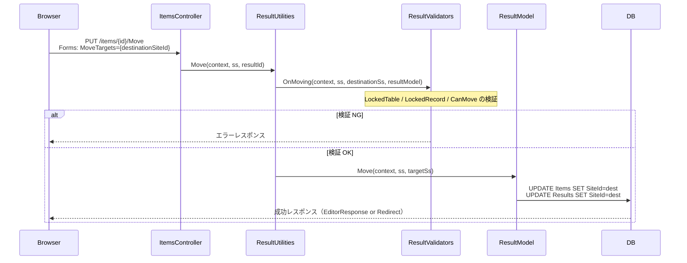

# 項目移動の API・スクリプト・サーバースクリプト対応

プリザンター本体に備わっている「項目の移動」機能について、Web API・スクリプト（`$p.api*`）・サーバースクリプト（`items.*`）からの利用可否と実装方針を調査した。

<!-- START doctoc generated TOC please keep comment here to allow auto update -->
<!-- DON'T EDIT THIS SECTION, INSTEAD RE-RUN doctoc TO UPDATE -->

- [調査情報](#調査情報)
- [調査目的](#調査目的)
- [本体機能の概要](#本体機能の概要)
    - [対象テーブル](#対象テーブル)
    - [移動の種類](#移動の種類)
    - [移動先の設定](#移動先の設定)
    - [処理フロー（Move）](#処理フローmove)
    - [権限要件](#権限要件)
- [Web API (`/api/items/`) の対応状況](#web-api-apiitems-の対応状況)
    - [現状](#現状)
    - [実装方針](#実装方針)
- [スクリプト (`$p.api*`) の対応状況](#スクリプト-papi-の対応状況)
    - [現状](#現状-1)
    - [実装方針](#実装方針-1)
- [サーバースクリプト (`items.*`) の対応状況](#サーバースクリプト-items-の対応状況)
    - [現状](#現状-2)
    - [実装方針](#実装方針-2)
- [改修対象ファイル一覧](#改修対象ファイル一覧)
- [結論](#結論)
- [注意事項](#注意事項)
- [関連ソースコード](#関連ソースコード)

<!-- END doctoc generated TOC please keep comment here to allow auto update -->

## 調査情報

| 調査日     | リポジトリ | ブランチ | タグ/バージョン | コミット  | 備考     |
| ---------- | ---------- | -------- | --------------- | --------- | -------- |
| 2026-02-27 | Pleasanter | main     |                 | `34f162a` | 初回調査 |

## 調査目的

プリザンター本体には「項目の移動」機能が実装されており、UI から Issues・Results レコードを別サイトへ移動できる。この機能を Web API・スクリプト（`$p.api*`）・サーバースクリプト（`items.*`）から呼び出せるか調査し、対応状況と実装方針を整理する。

---

## 本体機能の概要

### 対象テーブル

| テーブル | 対応 |
| -------- | :--: |
| Issues   |  Y   |
| Results  |  Y   |
| Wikis    |  N   |

Wikis は移動機能に対応していない（`ItemModel.Move` で `Messages.ResponseNotFound` を返す）。

### 移動の種類

| 操作     | 説明                                           | UI 起点  |
| -------- | ---------------------------------------------- | -------- |
| Move     | 単一レコードを別サイトへ移動（編集画面から）   | 編集画面 |
| BulkMove | チェックした複数レコードを一括移動（一覧から） | 一覧画面 |

### 移動先の設定

サイト設定（`SiteSettings.MoveTargets: List<long>`）に移動可能なサイト ID 一覧を登録する。
UI では `MoveTargets` ドロップダウンで選択した値が `context.Forms.Long("MoveTargets")` として渡される。

### 処理フロー（Move）



### 権限要件

`Permissions.CanMove` で判定する。

```csharp
// Implem.Pleasanter/Libraries/Security/Permissions.cs:580
public static bool CanMove(Context context, SiteSettings source, SiteSettings destination)
{
    return context.CanUpdate(ss: source)
        && context.CanUpdate(ss: destination);
}
```

移動元・移動先の**両方**に `Update` 権限が必要。

---

## Web API (`/api/items/`) の対応状況

### 現状

`Implem.Pleasanter/Controllers/Api/ItemsController.cs` に Move・BulkMove に対応するエンドポイントは存在しない。

| エンドポイント                  | 実装状況 |
| ------------------------------- | :------: |
| `POST /api/items/{id}/Move`     |  未実装  |
| `POST /api/items/{id}/BulkMove` |  未実装  |

### 実装方針

#### 1. `Api` クラスへのフィールド追加

**ファイル**: `Implem.Pleasanter/Libraries/Requests/Api.cs`

Move 操作の移動先サイト ID を受け取るフィールドを追加する。

```csharp
public long? InheritPermission { get; set; }  // 既存フィールド（例）
public long MoveTargetId { get; set; }         // 新規追加
```

#### 2. `ResultUtilities`・`IssueUtilities` に `MoveByApi` を追加

Delete の `ByApi` 実装（`ResultUtilities.DeleteByApi`）を参考に `MoveByApi` を追加する。

```csharp
// Implem.Pleasanter/Models/Results/ResultUtilities.cs（追加例）
public static ContentResultInheritance MoveByApi(
    Context context,
    SiteSettings ss,
    long resultId)
{
    if (!Mime.ValidateOnApi(contentType: context.ContentType))
    {
        return ApiResults.BadRequest(context: context);
    }
    var api = context.RequestDataString.Deserialize<Api>();
    var siteId = api?.MoveTargetId ?? 0;
    if (siteId == 0)
    {
        return ApiResults.Error(context: context,
            errorData: new ErrorData(type: Error.Types.InvalidJsonData));
    }
    if (context.ContractSettings.ItemsLimit(context: context, siteId: siteId))
    {
        return ApiResults.Error(context: context,
            errorData: new ErrorData(type: Error.Types.ItemsLimit));
    }
    var resultModel = new ResultModel(
        context: context,
        ss: ss,
        resultId: resultId,
        methodType: BaseModel.MethodTypes.Edit);
    if (resultModel.AccessStatus != Databases.AccessStatuses.Selected)
    {
        return ApiResults.Get(ApiResponses.NotFound(context: context));
    }
    var destinationSs = SiteSettingsUtilities.Get(context: context, siteId: siteId);
    var invalid = ResultValidators.OnMoving(
        context: context,
        ss: ss,
        destinationSs: destinationSs,
        resultModel: resultModel);
    switch (invalid.Type)
    {
        case Error.Types.None: break;
        default: return ApiResults.Error(context: context, errorData: invalid);
    }
    var targetSs = SiteSettingsUtilities.Get(context: context, siteId: siteId);
    var errorData = resultModel.Move(context: context, ss: ss, targetSs: targetSs);
    switch (errorData.Type)
    {
        case Error.Types.None:
            return ApiResults.Success(
                id: resultModel.ResultId,
                limitPerDate: context.ContractSettings.ApiLimit(),
                limitRemaining: context.ContractSettings.ApiLimit() - ss.ApiCount,
                message: Displays.Moved(context: context,
                    data: resultModel.Title.MessageDisplay(context: context)));
        case Error.Types.Duplicated:
            return ApiResults.Error(context: context, errorData: errorData);
        default:
            return ApiResults.Error(context: context, errorData: errorData);
    }
}
```

#### 3. `ItemModel` に `MoveByApi` を追加

**ファイル**: `Implem.Pleasanter/Models/Items/ItemModel.cs`

```csharp
public ContentResultInheritance MoveByApi(Context context)
{
    SetSite(context: context, initSiteSettings: true);
    switch (ReferenceType)
    {
        case "Issues":
            return IssueUtilities.MoveByApi(
                context: context,
                ss: Site.SiteSettings,
                issueId: ReferenceId);
        case "Results":
            return ResultUtilities.MoveByApi(
                context: context,
                ss: Site.SiteSettings,
                resultId: ReferenceId);
        default:
            return ApiResults.Get(ApiResponses.NotFound(context: context));
    }
}
```

#### 4. `Api/ItemsController.cs` にエンドポイントを追加

**ファイル**: `Implem.Pleasanter/Controllers/Api/ItemsController.cs`

```csharp
[HttpPost("{id}/Move")]
public ContentResult Move(long id)
{
    var body = default(string);
    using (var reader = new StreamReader(Request.Body)) body = reader.ReadToEnd();
    var context = new Context(
        sessionStatus: User?.Identity?.IsAuthenticated == true,
        sessionData: User?.Identity?.IsAuthenticated == true,
        apiRequestBody: body,
        contentType: Request.ContentType,
        api: true);
    var log = new SysLogModel(context: context);
    var result = context.Authenticated
        ? new ItemModel(context: context, referenceId: id).MoveByApi(context: context)
        : ApiResults.Unauthorized(context: context);
    log.Finish(context: context, responseSize: result.Content.Length);
    return result.ToHttpResponse(request: Request);
}
```

#### API リクエスト例

```json
{
    "ApiVersion": 1.1,
    "ApiKey": "xxxxxxxxxxxxxxxx",
    "MoveTargetId": 123456
}
```

---

## スクリプト (`$p.api*`) の対応状況

### 現状

`Implem.PleasanterFrontend/wwwroot/src/scripts/generals/_api.js` に `$p.apiMove` 関数は定義されていない。

| 関数             | 実装状況 |
| ---------------- | :------: |
| `$p.apiMove`     |  未実装  |
| `$p.apiBulkMove` |  未実装  |

UI 上の移動操作は `$p.move` 関数が担っているが、これは通常コントローラー（`/items/{id}/Move`）へのフォーム送信であり、Web API エンドポイント（`/api/items/{id}/Move`）は対象外。

### 実装方針

Web API に Move エンドポイントが追加された後、`_api.js` に以下を追加する。

**ファイル**: `Implem.PleasanterFrontend/wwwroot/src/scripts/generals/_api.js`

```javascript
$p.apiMove = function (args) {
    return $p.apiExec($p.apiUrl(args.id, 'move'), args);
};
```

#### 使用例

```javascript
// レコード 12345 をサイト 67890 へ移動
$p.apiMove({
    id: 12345,
    data: {
        ApiVersion: 1.1,
        ApiKey: $p.apiKey(),
        MoveTargetId: 67890,
    },
    done: function (data) {
        console.log('Moved:', data);
    },
});
```

---

## サーバースクリプト (`items.*`) の対応状況

### 現状

`Implem.Pleasanter/Libraries/ServerScripts/ServerScriptModelApiItems.cs` に Move 関連のメソッドは存在しない。

| メソッド           | 実装状況 |
| ------------------ | :------: |
| `items.Move()`     |  未実装  |
| `items.BulkMove()` |  未実装  |

### 実装方針

`Delete` や `BulkDelete` の ServerScript 実装（`ServerScriptUtilities.Delete` / `BulkDelete`）と同じパターンで追加する。

#### 1. `ServerScriptUtilities.cs` に `Move` を追加

**ファイル**: `Implem.Pleasanter/Libraries/ServerScripts/ServerScriptUtilities.cs`

```csharp
public static bool Move(Context context, long id, long destinationSiteId)
{
    var apiContext = CreateContext(
        context: context,
        controller: "Items",
        action: "Move",
        id: id,
        apiRequestBody: $"{{\"MoveTargetId\":{destinationSiteId}}}");
    return new ItemModel(
        context: apiContext,
        referenceId: id)
            .MoveByServerScript(context: apiContext);
}
```

#### 2. `ItemModel` に `MoveByServerScript` を追加

**ファイル**: `Implem.Pleasanter/Models/Items/ItemModel.cs`

```csharp
public bool MoveByServerScript(Context context)
{
    SetSite(context: context, initSiteSettings: true);
    switch (ReferenceType)
    {
        case "Issues":
            return IssueUtilities.MoveByServerScript(
                context: context,
                ss: Site.SiteSettings,
                issueId: ReferenceId);
        case "Results":
            return ResultUtilities.MoveByServerScript(
                context: context,
                ss: Site.SiteSettings,
                resultId: ReferenceId);
        default:
            return false;
    }
}
```

#### 3. `ResultUtilities`・`IssueUtilities` に `MoveByServerScript` を追加

`DeleteByServerScript`（`ResultUtilities.cs:5596`）を参考に実装する。

```csharp
// Implem.Pleasanter/Models/Results/ResultUtilities.cs（追加例）
public static bool MoveByServerScript(
    Context context,
    SiteSettings ss,
    long resultId)
{
    var api = context.RequestDataString.Deserialize<Api>();
    var siteId = api?.MoveTargetId ?? 0;
    if (siteId == 0) return false;

    var resultModel = new ResultModel(
        context: context,
        ss: ss,
        resultId: resultId,
        methodType: BaseModel.MethodTypes.Edit);
    if (resultModel.AccessStatus != Databases.AccessStatuses.Selected) return false;

    var destinationSs = SiteSettingsUtilities.Get(context: context, siteId: siteId);
    var invalid = ResultValidators.OnMoving(
        context: context,
        ss: ss,
        destinationSs: destinationSs,
        resultModel: resultModel);
    if (invalid.Type != Error.Types.None) return false;

    var errorData = resultModel.Move(context: context, ss: ss, targetSs: destinationSs);
    return errorData.Type == Error.Types.None;
}
```

#### 4. `ServerScriptModelApiItems.cs` に `Move` メソッドを追加

**ファイル**: `Implem.Pleasanter/Libraries/ServerScripts/ServerScriptModelApiItems.cs`

```csharp
public bool Move(object id, object destinationSiteId)
{
    if (OnTesting)
    {
        return false;
    }
    return ServerScriptUtilities.Move(
        context: Context,
        id: id.ToLong(),
        destinationSiteId: destinationSiteId.ToLong());
}
```

#### サーバースクリプト使用例

```javascript
// レコード 12345 をサイト 67890 へ移動
var result = items.Move(12345, 67890);
if (result) {
    model.SetMessage('移動しました');
} else {
    model.SetErrorMessage('移動に失敗しました');
}
```

---

## 改修対象ファイル一覧

| ファイル                                                                 | 変更内容                                       |
| ------------------------------------------------------------------------ | ---------------------------------------------- |
| `Implem.Pleasanter/Libraries/Requests/Api.cs`                            | `MoveTargetId` フィールド追加                  |
| `Implem.Pleasanter/Controllers/Api/ItemsController.cs`                   | `Move` エンドポイント追加                      |
| `Implem.Pleasanter/Models/Items/ItemModel.cs`                            | `MoveByApi`・`MoveByServerScript` メソッド追加 |
| `Implem.Pleasanter/Models/Results/ResultUtilities.cs`                    | `MoveByApi`・`MoveByServerScript` メソッド追加 |
| `Implem.Pleasanter/Models/Issues/IssueUtilities.cs`                      | `MoveByApi`・`MoveByServerScript` メソッド追加 |
| `Implem.Pleasanter/Libraries/ServerScripts/ServerScriptUtilities.cs`     | `Move` メソッド追加                            |
| `Implem.Pleasanter/Libraries/ServerScripts/ServerScriptModelApiItems.cs` | `Move` メソッド追加                            |
| `Implem.PleasanterFrontend/wwwroot/src/scripts/generals/_api.js`         | `$p.apiMove` 関数追加                          |

---

## 結論

| 機能                    |  現状  | 実装に必要な主要変更点                                                                                         |
| ----------------------- | :----: | -------------------------------------------------------------------------------------------------------------- |
| Web API (`/api/items/`) | 未実装 | `Api.MoveTargetId` 追加、`ItemsController`・`ItemModel`・各 Utilities に `MoveByApi` 追加                      |
| スクリプト (`$p.api*`)  | 未実装 | Web API 実装後に `_api.js` へ `$p.apiMove` 追加                                                                |
| サーバースクリプト      | 未実装 | `ServerScriptUtilities`・`ServerScriptModelApiItems` に `Move` 追加、各 Utilities に `MoveByServerScript` 追加 |

いずれも `Delete` / `BulkDelete` の既存 API パターンに倣った実装で対応可能であり、実装量は少ない。ただし、`Api` クラスへのフィールド追加は CodeDefiner での自動生成対象外のため手動管理となる点に注意が必要。

## 注意事項

- 移動先は `SiteSettings.MoveTargets` に登録されたサイト ID のみを許可するか、API では任意の宛先を受け付けるかを
  設計段階で決定する必要がある。本体 UI は `MoveTargets` の中からのみ選択できる制約があるが、
  API では検証の方針を明示的に定める必要がある。
- `ResultValidators.OnMoving` は `LockedTable` / `LockedRecord` / `CanMove` の 3 点を検証するが、
  API 専用のバリデーションコード（`Validators.ValidateApi`）は既存の `OnMoving` に含まれていないため、
  `DeleteByApi` の `OnDeleting` の実装（`api: true` フラグで `ValidateApi` を呼び出す）と同様に
  `OnMoving` に `api` フラグを追加することが望ましい。
- BulkMove の API 対応は単一 Move よりも複雑（`RecordSelector` による選択レコードの特定が必要）であるため、本ドキュメントでは単一 Move の実装方針を優先的に整理した。

## 関連ソースコード

| ファイル                                                                 | 行番号    | 内容                                    |
| ------------------------------------------------------------------------ | --------- | --------------------------------------- |
| `Implem.Pleasanter/Controllers/ItemsController.cs`                       | 792–849   | Move / BulkMove 通常コントローラー定義  |
| `Implem.Pleasanter/Models/Items/ItemModel.cs`                            | 2534–2574 | Move / BulkMove ディスパッチ            |
| `Implem.Pleasanter/Models/Results/ResultUtilities.cs`                    | 5436–5510 | ResultUtilities.Move 実装               |
| `Implem.Pleasanter/Models/Results/ResultUtilities.cs`                    | 5545–5634 | ResultUtilities.DeleteByApi（参考実装） |
| `Implem.Pleasanter/Models/Results/ResultModel.cs`                        | 2157–2194 | ResultModel.Move（DB 更新）             |
| `Implem.Pleasanter/Models/Results/ResultValidators.cs`                   | 740–790   | ResultValidators.OnMoving               |
| `Implem.Pleasanter/Libraries/Security/Permissions.cs`                    | 580–584   | Permissions.CanMove                     |
| `Implem.Pleasanter/Libraries/Settings/SiteSettings.cs`                   | 186       | SiteSettings.MoveTargets フィールド     |
| `Implem.Pleasanter/Libraries/HtmlParts/HtmlMoves.cs`                     | 9–41      | 移動ダイアログ UI 生成                  |
| `Implem.PleasanterFrontend/wwwroot/src/scripts/generals/move.js`         | 1–8       | `$p.moveTargets` / `$p.move` 関数       |
| `Implem.PleasanterFrontend/wwwroot/src/scripts/generals/_api.js`         | 1–155     | `$p.api*` 関数群（参考実装）            |
| `Implem.Pleasanter/Libraries/ServerScripts/ServerScriptModelApiItems.cs` | 196–217   | `Delete` / `BulkDelete`（参考実装）     |
| `Implem.Pleasanter/Libraries/ServerScripts/ServerScriptUtilities.cs`     | 1519–1531 | `BulkDelete`（参考実装）                |
