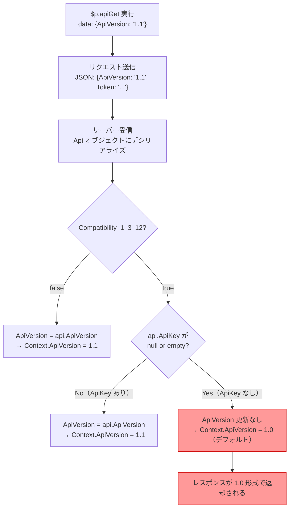

# $p.apiGet の ApiVersion 指定が無効になる原因

このドキュメントでは、`$p.apiGet` でリクエストボディに `ApiVersion: '1.1'` を指定しても反映されない現象の原因を調査した結果をまとめます。

<!-- START doctoc generated TOC please keep comment here to allow auto update -->
<!-- DON'T EDIT THIS SECTION, INSTEAD RE-RUN doctoc TO UPDATE -->

- [調査情報](#調査情報)
- [調査目的](#調査目的)
- [再現手順](#再現手順)
- [クライアント側の送信処理](#クライアント側の送信処理)
- [サーバー側の ApiVersion 判定ロジック](#サーバー側の-apiversion-判定ロジック)
    - [リクエストのデシリアライズ](#リクエストのデシリアライズ)
    - [SetApiVersion メソッド](#setapiversion-メソッド)
- [原因](#原因)
- [ApiVersion がレスポンスに与える影響](#apiversion-がレスポンスに与える影響)
- [認証方式と ApiVersion 反映の関係](#認証方式と-apiversion-反映の関係)
- [回避策](#回避策)
    - [1. `Compatibility_1_3_12` を `false` に設定する](#1-compatibility_1_3_12-を-false-に設定する)
    - [2. `Api.json` の `Version` を `1.1` に設定する](#2-apijson-の-version-を-11-に設定する)
    - [3. ApiKey を含めてリクエストする](#3-apikey-を含めてリクエストする)
- [結論](#結論)
- [関連ソースコード](#関連ソースコード)

<!-- END doctoc generated TOC please keep comment here to allow auto update -->

## 調査情報

| 調査日     | リポジトリ | ブランチ | タグ/バージョン    | コミット    | 備考     |
| ---------- | ---------- | -------- | ------------------ | ----------- | -------- |
| 2026-03-02 | Pleasanter | main     | Pleasanter_1.5.1.0 | `34f162a43` | 初回調査 |

## 調査目的

以下のスクリプトを実行したとき、`ApiVersion: '1.1'` の指定が有効にならない原因を特定する。

```javascript
$p.apiGet({
    id: 3953544,
    data: { ApiVersion: '1.1' },
    done: function (data) {
        console.log(data);
    },
});
```

発生条件:

| パラメータ                           | 値     |
| ------------------------------------ | ------ |
| `Api.json` の `Version`              | `1.0`  |
| `Api.json` の `Compatibility_1_3_12` | `true` |

---

## 再現手順

1. `App_Data/Parameters/Api.json` を以下のように設定する

    ```json
    {
        "Version": 1.0,
        "Enabled": true,
        "PageSize": 200,
        "LimitPerSite": 0,
        "Compatibility_1_3_12": true
    }
    ```

2. ブラウザのスクリプトで `$p.apiGet` を実行する

    ```javascript
    $p.apiGet({
        id: 3953544,
        data: { ApiVersion: '1.1' },
        done: function (data) {
            console.log(data);
        },
    });
    ```

3. レスポンスの `ApiVersion` が `1.0` のままとなり、レスポンス形式も 1.0 形式（個別プロパティ展開）のままとなる

---

## クライアント側の送信処理

`$p.apiGet` は `$p.apiExec` を呼び出し、`args.data` をそのまま JSON で POST する。

**ファイル**: `Implem.PleasanterFrontend/wwwroot/src/scripts/generals/_api.js`（行番号: 13-14, 64-86）

```javascript
$p.apiGet = function (args) {
    return $p.apiExec($p.apiUrl(args.id, 'get'), args);
};

$p.apiExec = function (url, args) {
    // ...省略...
    var data = args.data !== undefined ? args.data : {};
    if ($('#Token').length === 1) {
        data.Token = $('#Token').val();
    }
    var ajaxSetings = {
        type: 'post',
        url: url,
        cache: false,
        data: JSON.stringify(data),
        dataType: 'json',
    };
    if (/(?:^|\/)api\//.test(url)) {
        ajaxSetings.contentType = 'application/json';
    }
    return $.ajax(ajaxSetings).done(args.done).fail(args.fail).always(args.always);
};
```

この実装により、サーバーには以下の JSON ボディが送信される。

```json
{
    "ApiVersion": "1.1",
    "Token": "（CSRFトークン）"
}
```

`$p.apiGet` はセッション認証（Cookie）+ CSRF トークンで認証するため、`ApiKey` はリクエストに含まれない。

---

## サーバー側の ApiVersion 判定ロジック

### リクエストのデシリアライズ

リクエストボディは `Api` クラスにデシリアライズされる。

**ファイル**: `Implem.Pleasanter/Libraries/Requests/Api.cs`

```csharp
public class Api
{
    public decimal ApiVersion { get; set; } = Parameters.Api.Version;
    public string ApiKey { get; set; }
    public View View { get; set; }
    public List<string> Keys { get; set; }
    public int Offset { get; set; }
    public int PageSize { get; set; }
    public Sqls.TableTypes TableType { get; set; }
    public string Token { get; set; }
}
```

`$p.apiGet` のリクエストの場合、デシリアライズ結果は以下のようになる。

| プロパティ   | 値                        |
| ------------ | ------------------------- |
| `ApiVersion` | `1.1`（リクエスト指定値） |
| `ApiKey`     | `null`（未送信のため）    |
| `Token`      | CSRFトークン文字列        |

### SetApiVersion メソッド

`Context.SetUserProperties` メソッド内でリクエストの `Api` オブジェクトから `ApiVersion` を取り出す処理が行われる。

**ファイル**: `Implem.Pleasanter/Libraries/Requests/Context.cs`（行番号: 396-450）

```csharp
private void SetUserProperties(bool sessionStatus, bool setData)
{
    if (HasRoute)
    {
        if (setData) SetData();
        var jsonDeserializedRequestApi = RequestDataString.Deserialize<Api>();
        // ...省略...
        SetApiVersion(api: jsonDeserializedRequestApi);
        // ...省略...
    }
}

private void SetApiVersion(Api api)
{
    if (Parameters.Api.Compatibility_1_3_12)
    {
        if (api?.ApiKey.IsNullOrEmpty() == false)  // ← ApiKeyが存在する場合のみ
        {
            ApiVersion = api.ApiVersion;
        }
        // ApiKeyがnullの場合、ApiVersionは更新されない
    }
    else
    {
        ApiVersion = api?.ApiVersion ?? ApiVersion;  // ← ApiKeyの有無に関係なく更新
    }
}
```

---

## 原因

`Compatibility_1_3_12 = true` のとき、`SetApiVersion` メソッドは
**ApiKey が存在する場合にのみ**リクエストの `ApiVersion` を
`Context.ApiVersion` に反映する。

`$p.apiGet` はセッション認証で動作するため ApiKey を送信しない。
そのため、リクエストに `ApiVersion: '1.1'` を指定しても条件が満たされず、
`Context.ApiVersion` はデフォルト値（`Parameters.Api.Version` = `1.0`）のまま維持される。



---

## ApiVersion がレスポンスに与える影響

`ApiVersion` はレスポンスのシリアライズ形式を切り替える。
`_BaseApiModel` の `OnSerializing` / `OnDeserialized` メソッドで、
`ApiVersion < 1.100` のとき個別プロパティ（`ClassA`, `ClassB`, ...）に展開し、
`ApiVersion >= 1.100` のときは `ClassHash` / `NumHash` 等の辞書形式で返す。

**ファイル**: `Implem.Pleasanter/Models/Shared/_BaseApiModel.cs`（行番号: 814-822, 1584-1592）

```csharp
[OnSerializing]
void OnSerializing(StreamingContext context)
{
    if (ApiVersion < 1.100M)
    {
        // ClassA, ClassB, ... NumA, NumB, ... 等の個別プロパティに展開
        if (ClassHash.ContainsKey("ClassA")) ClassA = Class(columnName: "ClassA");
        // ...（ClassB〜ClassZ, NumA〜NumZ, DateA〜DateZ, ...）
    }
}

[OnDeserialized]
void OnDeserialized(StreamingContext context)
{
    if (ApiVersion < 1.100M)
    {
        // 個別プロパティからHashに変換
        if (ClassA != null) Class(columnName: "ClassA", value: ClassA); ClassA = null;
        // ...
    }
}
```

つまり、`ApiVersion` がリクエストから正しく反映されないと、レスポンスのデータ構造が意図した形式にならない。

---

## 認証方式と ApiVersion 反映の関係

| 認証方式                        | ApiKey送信 | Compatibility_1_3_12=true   | Compatibility_1_3_12=false |
| ------------------------------- | ---------- | --------------------------- | -------------------------- |
| APIキー認証（外部クライアント） | あり       | ApiVersion 反映される       | ApiVersion 反映される      |
| セッション認証（`$p.apiGet`等） | なし       | **ApiVersion 反映されない** | ApiVersion 反映される      |

---

## 回避策

### 1. `Compatibility_1_3_12` を `false` に設定する

`Api.json` の `Compatibility_1_3_12` を `false` にすれば、ApiKey の有無に関係なくリクエストの `ApiVersion` が反映される。ただし、この設定変更は他の互換性動作にも影響する可能性があるため、テスト環境での事前検証を推奨する。

```json
{
    "Version": 1.1,
    "Compatibility_1_3_12": false
}
```

### 2. `Api.json` の `Version` を `1.1` に設定する

`Api.json` の `Version` を `1.1` に変更すれば、デフォルトの `ApiVersion` が `1.1` になる。
`$p.apiGet` で `ApiVersion` を指定する必要がなくなる。
ただし、この変更はすべての API レスポンスに影響するため、
既存の API 連携に影響がないか確認が必要。

```json
{
    "Version": 1.1,
    "Compatibility_1_3_12": true
}
```

### 3. ApiKey を含めてリクエストする

`$p.apiGet` のリクエストに `ApiKey` を含めることで、`Compatibility_1_3_12 = true` の場合でも `ApiVersion` が反映される。ただし、セッション認証済みの画面上でAPIキーを埋め込むことはセキュリティ上推奨されない。

```javascript
$p.apiGet({
    id: 3953544,
    data: { ApiVersion: '1.1', ApiKey: '（APIキー）' },
    done: function (data) {
        console.log(data);
    },
});
```

---

## 結論

| 項目       | 内容                                                                                                                                                     |
| ---------- | -------------------------------------------------------------------------------------------------------------------------------------------------------- |
| 原因       | `Compatibility_1_3_12 = true` のとき、`SetApiVersion` メソッドが ApiKey の存在を前提として ApiVersion を反映する実装になっている                         |
| 影響範囲   | `$p.apiGet` / `$p.apiUpdate` / `$p.apiCreate` 等、セッション認証で動作するすべてのスクリプト API ラッパー                                                |
| 該当コード | `Implem.Pleasanter/Libraries/Requests/Context.cs` の `SetApiVersion` メソッド（行番号: 436-450）                                                         |
| 推奨回避策 | `Compatibility_1_3_12` を `false` に変更するか、`Api.json` の `Version` を `1.1` に設定する                                                              |
| 根本対策   | Pleasanter 本体の `SetApiVersion` メソッドで、`Compatibility_1_3_12 = true` の場合でも ApiKey がなくてもリクエストの `ApiVersion` を反映するよう修正する |

---

## 関連ソースコード

| ファイル                                                         | 説明                                                        |
| ---------------------------------------------------------------- | ----------------------------------------------------------- |
| `Implem.PleasanterFrontend/wwwroot/src/scripts/generals/_api.js` | `$p.apiGet` / `$p.apiExec` の実装                           |
| `Implem.Pleasanter/Libraries/Requests/Api.cs`                    | API リクエストモデル                                        |
| `Implem.Pleasanter/Libraries/Requests/Context.cs`                | `SetApiVersion` メソッド（行番号: 436-450）                 |
| `Implem.Pleasanter/Models/Shared/_BaseApiModel.cs`               | `OnSerializing` / `OnDeserialized`（ApiVersion による分岐） |
| `Implem.ParameterAccessor/Parts/Api.cs`                          | `Api.json` パラメータ定義                                   |
| `Implem.Pleasanter/App_Data/Parameters/Api.json`                 | API パラメータ設定ファイル                                  |
