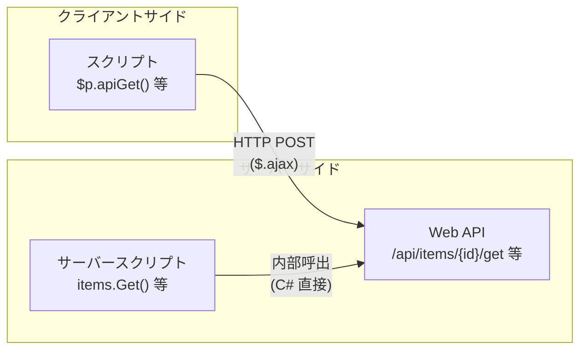

# API ラッパー実装状況

プリザンターの Web API に対するスクリプト（`$p.api*`）およびサーバースクリプト（`items.*` 等）のラッパー実装状況を調査し、有無・機能差違を整理する。

<!-- START doctoc generated TOC please keep comment here to allow auto update -->
<!-- DON'T EDIT THIS SECTION, INSTEAD RE-RUN doctoc TO UPDATE -->

- [調査情報](#調査情報)
- [調査目的](#調査目的)
- [概要](#概要)
- [Web API エンドポイント一覧](#web-api-エンドポイント一覧)
    - [Items API](#items-api)
    - [Site API](#site-api)
    - [Users API](#users-api)
    - [Depts API](#depts-api)
    - [Groups API](#groups-api)
    - [Sessions API](#sessions-api)
    - [Binaries API](#binaries-api)
    - [Extensions API](#extensions-api)
    - [OutgoingMails API](#outgoingmails-api)
    - [その他の API](#その他の-api)
- [ラッパー実装状況の比較](#ラッパー実装状況の比較)
    - [Items API ラッパー](#items-api-ラッパー)
    - [Site API ラッパー](#site-api-ラッパー)
    - [Users API ラッパー](#users-api-ラッパー)
    - [Depts API ラッパー](#depts-api-ラッパー)
    - [Groups API ラッパー](#groups-api-ラッパー)
    - [Sessions API ラッパー](#sessions-api-ラッパー)
    - [Binaries API ラッパー](#binaries-api-ラッパー)
    - [Extensions API ラッパー](#extensions-api-ラッパー)
    - [OutgoingMails API ラッパー](#outgoingmails-api-ラッパー)
    - [Extended SQL API ラッパー](#extended-sql-api-ラッパー)
- [サーバースクリプト固有の機能](#サーバースクリプト固有の機能)
    - [items オブジェクトの追加メソッド](#items-オブジェクトの追加メソッド)
    - [groups オブジェクトの追加メソッド](#groups-オブジェクトの追加メソッド)
    - [depts オブジェクトの追加メソッド](#depts-オブジェクトの追加メソッド)
    - [extendedSql オブジェクト](#extendedsql-オブジェクト)
    - [その他のサーバースクリプト専用オブジェクト](#その他のサーバースクリプト専用オブジェクト)
- [カバレッジ全体像](#カバレッジ全体像)
- [主な差違と注意点](#主な差違と注意点)
    - [スクリプトにあってサーバースクリプトにない機能](#スクリプトにあってサーバースクリプトにない機能)
    - [サーバースクリプトにあってスクリプトにない機能](#サーバースクリプトにあってスクリプトにない機能)
    - [どちらにも提供されていない機能](#どちらにも提供されていない機能)
- [関連ソースコード](#関連ソースコード)
- [結論](#結論)

<!-- END doctoc generated TOC please keep comment here to allow auto update -->

## 調査情報

| 調査日     | リポジトリ | ブランチ | タグ/バージョン    | コミット    | 備考     |
| ---------- | ---------- | -------- | ------------------ | ----------- | -------- |
| 2026-02-26 | Pleasanter | main     | Pleasanter_1.5.1.0 | `34f162a43` | 初回調査 |

## 調査目的

プリザンターでは Web API（`/api/...`）を提供しており、スクリプト（クライアントサイド JS）とサーバースクリプト（ClearScript V8）にそれぞれラッパーが用意されている。

- スクリプト: `$p.apiUpdate(args)` のように `$p.api*` 関数として提供
- サーバースクリプト: `items.Update(id, model)` のようにホストオブジェクトのメソッドとして提供

これらのラッパーの実装状況（有無）と機能差違を明らかにし、開発時の参照資料とする。

---

## 概要

Web API・スクリプト・サーバースクリプトの 3 層は以下の関係にある。

- スクリプト: ブラウザ上で動作し、`$.ajax` で Web API を HTTP 呼出する薄いラッパー
- サーバースクリプト: ClearScript V8 エンジン上で動作し、C# のホストオブジェクト経由で内部的に API と同等の処理を実行する

---

## Web API エンドポイント一覧

### Items API

| エンドポイント               | HTTP メソッド | 説明                       |
| ---------------------------- | ------------- | -------------------------- |
| `/api/items/{id}/Get`        | POST          | レコード取得               |
| `/api/items/{id}/Create`     | POST          | レコード作成               |
| `/api/items/{id}/Update`     | POST          | レコード更新               |
| `/api/items/{id}/Upsert`     | POST          | レコード作成または更新     |
| `/api/items/{id}/Delete`     | POST          | レコード削除               |
| `/api/items/{id}/BulkDelete` | POST          | レコード一括削除           |
| `/api/items/{id}/BulkUpsert` | POST          | レコード一括作成または更新 |
| `/api/items/{id}/Import`     | POST          | データインポート           |
| `/api/items/{id}/Export`     | POST          | データエクスポート         |

### Site API

| エンドポイント                         | HTTP メソッド | 説明                   |
| -------------------------------------- | ------------- | ---------------------- |
| `/api/items/{id}/GetSite`              | POST          | サイト情報取得         |
| `/api/items/{id}/CreateSite`           | POST          | サイト作成             |
| `/api/items/{id}/UpdateSite`           | POST          | サイト更新             |
| `/api/items/{id}/DeleteSite`           | POST          | サイト削除             |
| `/api/items/{id}/CopySitePackage`      | POST          | サイトパッケージコピー |
| `/api/items/{id}/SynchronizeSummaries` | POST          | サマリ同期             |
| `/api/items/{id}/UpdateSiteSettings`   | POST          | サイト設定更新         |
| `/api/items/{id}/GetClosestSiteId`     | POST          | 最近接サイト ID 取得   |

### Users API

| エンドポイント           | HTTP メソッド | 説明             |
| ------------------------ | ------------- | ---------------- |
| `/api/users/Get`         | POST          | ユーザ一覧取得   |
| `/api/users/{id}/Get`    | POST          | ユーザ取得       |
| `/api/users/Create`      | POST          | ユーザ作成       |
| `/api/users/{id}/Update` | POST          | ユーザ更新       |
| `/api/users/{id}/Delete` | POST          | ユーザ削除       |
| `/api/users/Import`      | POST          | ユーザインポート |

### Depts API

| エンドポイント           | HTTP メソッド | 説明           |
| ------------------------ | ------------- | -------------- |
| `/api/depts/Get`         | POST          | 部署一覧取得   |
| `/api/depts/{id}/Get`    | POST          | 部署取得       |
| `/api/depts/Create`      | POST          | 部署作成       |
| `/api/depts/{id}/Update` | POST          | 部署更新       |
| `/api/depts/{id}/Delete` | POST          | 部署削除       |
| `/api/depts/Import`      | POST          | 部署インポート |

### Groups API

| エンドポイント            | HTTP メソッド | 説明               |
| ------------------------- | ------------- | ------------------ |
| `/api/groups/Get`         | POST          | グループ一覧取得   |
| `/api/groups/{id}/Get`    | POST          | グループ取得       |
| `/api/groups/Create`      | POST          | グループ作成       |
| `/api/groups/{id}/Update` | POST          | グループ更新       |
| `/api/groups/{id}/Delete` | POST          | グループ削除       |
| `/api/groups/Import`      | POST          | グループインポート |

### Sessions API

| エンドポイント         | HTTP メソッド | 説明             |
| ---------------------- | ------------- | ---------------- |
| `/api/sessions/Get`    | POST          | セッション値取得 |
| `/api/sessions/Set`    | POST          | セッション値設定 |
| `/api/sessions/Delete` | POST          | セッション値削除 |

### Binaries API

| エンドポイント                   | HTTP メソッド | 説明                   |
| -------------------------------- | ------------- | ---------------------- |
| `/api/binaries/{guid}/Get`       | POST          | バイナリ取得           |
| `/api/binaries/{guid}/GetStream` | POST          | バイナリストリーム取得 |
| `/api/binaries/Upload`           | POST          | バイナリアップロード   |

### Extensions API

| エンドポイント                | HTTP メソッド | 説明               |
| ----------------------------- | ------------- | ------------------ |
| `/api/extensions/Get`         | POST          | 拡張データ取得     |
| `/api/extensions/{id}/Get`    | POST          | 拡張データ個別取得 |
| `/api/extensions/Create`      | POST          | 拡張データ作成     |
| `/api/extensions/{id}/Update` | POST          | 拡張データ更新     |
| `/api/extensions/{id}/Delete` | POST          | 拡張データ削除     |

### OutgoingMails API

| エンドポイント                       | HTTP メソッド | 説明       |
| ------------------------------------ | ------------- | ---------- |
| `/api/items/{id}/OutgoingMails/Send` | POST          | メール送信 |

### その他の API

| エンドポイント                              | HTTP メソッド | 説明                   |
| ------------------------------------------- | ------------- | ---------------------- |
| `/api/extended/Sql`                         | POST          | 拡張 SQL 実行          |
| `/api/backgroundtasks/RebuildSearchIndexes` | POST          | 検索インデックス再構築 |

---

## ラッパー実装状況の比較

### Items API ラッパー

| Web API    | スクリプト ($p.\*)       | サーバースクリプト (items.\*) | 備考                                                                |
| ---------- | ------------------------ | ----------------------------- | ------------------------------------------------------------------- |
| Get        | `$p.apiGet(args)`        | `items.Get(id, view?)`        | サーバースクリプトは View フィルタをサポート                        |
| Create     | `$p.apiCreate(args)`     | `items.Create(id, model)`     |                                                                     |
| Update     | `$p.apiUpdate(args)`     | `items.Update(id, model)`     |                                                                     |
| Upsert     | `$p.apiUpsert(args)`     | `items.Upsert(id, model)`     |                                                                     |
| Delete     | `$p.apiDelete(args)`     | `items.Delete(id)`            |                                                                     |
| BulkDelete | `$p.apiBulkDelete(args)` | `items.BulkDelete(id, json)`  | スクリプト版はグリッド選択状態を自動処理                            |
| BulkUpsert | なし                     | なし                          | Web API のみ提供                                                    |
| Import     | なし                     | なし                          | Web API のみ提供（サーバースクリプトは `$ps.file.Import` で代替可） |
| Export     | なし                     | なし                          | Web API のみ提供（サーバースクリプトは `$ps.file.Export` で代替可） |

### Site API ラッパー

| Web API              | スクリプト ($p.\*)             | サーバースクリプト (items.\*)         | 備考                                                                          |
| -------------------- | ------------------------------ | ------------------------------------- | ----------------------------------------------------------------------------- |
| GetSite              | `$p.apiGetSite(args)`          | `items.GetSite(id)`                   | サーバースクリプトには追加の検索メソッドあり（後述）                          |
| CreateSite           | `$p.apiCreateSite(args)`       | `items.Create(id, model)`             | サーバースクリプトは `items.NewSite(refType)` でモデル生成後に `items.Create` |
| UpdateSite           | `$p.apiUpdateSite(args)`       | `items.Update(id, model)`             |                                                                               |
| DeleteSite           | `$p.apiDeleteSite(args)`       | `items.Delete(id)`                    |                                                                               |
| CopySitePackage      | `$p.apiCopySitePackage(args)`  | なし                                  | サーバースクリプト未提供                                                      |
| SynchronizeSummaries | なし                           | なし                                  | Web API のみ提供                                                              |
| UpdateSiteSettings   | なし                           | なし                                  | Web API のみ提供                                                              |
| GetClosestSiteId     | `$p.apiGetClosestSiteId(args)` | `items.GetClosestSite(siteName, id?)` |                                                                               |

### Users API ラッパー

| Web API | スクリプト ($p.\*)        | サーバースクリプト (users.\*) | 備考                                   |
| ------- | ------------------------- | ----------------------------- | -------------------------------------- |
| Get     | `$p.apiUsersGet(args)`    | `users.Get(id)`               | サーバースクリプトは単一ユーザ取得のみ |
| Create  | `$p.apiUsersCreate(args)` | なし                          | サーバースクリプト未提供               |
| Update  | `$p.apiUsersUpdate(args)` | なし                          | サーバースクリプト未提供               |
| Delete  | `$p.apiUsersDelete(args)` | なし                          | サーバースクリプト未提供               |
| Import  | なし                      | なし                          | Web API のみ提供                       |

### Depts API ラッパー

| Web API | スクリプト ($p.\*)     | サーバースクリプト (depts.\*) | 備考                                     |
| ------- | ---------------------- | ----------------------------- | ---------------------------------------- |
| Get     | `$p.apiDeptsGet(args)` | `depts.Get(id)`               | サーバースクリプトは単一部署取得のみ     |
| Create  | なし                   | なし                          | スクリプト・サーバースクリプトとも未提供 |
| Update  | なし                   | なし                          | スクリプト・サーバースクリプトとも未提供 |
| Delete  | なし                   | なし                          | スクリプト・サーバースクリプトとも未提供 |
| Import  | なし                   | なし                          | Web API のみ提供                         |

### Groups API ラッパー

| Web API | スクリプト ($p.\*)         | サーバースクリプト (groups.\*) | 備考                                                                             |
| ------- | -------------------------- | ------------------------------ | -------------------------------------------------------------------------------- |
| Get     | `$p.apiGroupsGet(args)`    | `groups.Get(id)`               | サーバースクリプトは単一グループ取得のみ（メンバー・子グループ取得メソッドあり） |
| Create  | `$p.apiGroupsCreate(args)` | なし                           | サーバースクリプト未提供                                                         |
| Update  | `$p.apiGroupsUpdate(args)` | `groups.Update(id, model)`     |                                                                                  |
| Delete  | `$p.apiGroupsDelete(args)` | なし                           | サーバースクリプト未提供                                                         |
| Import  | なし                       | なし                           | Web API のみ提供                                                                 |

### Sessions API ラッパー

| Web API | スクリプト ($p.\*) | サーバースクリプト | 備考             |
| ------- | ------------------ | ------------------ | ---------------- |
| Get     | なし               | なし               | Web API のみ提供 |
| Set     | なし               | なし               | Web API のみ提供 |
| Delete  | なし               | なし               | Web API のみ提供 |

### Binaries API ラッパー

| Web API   | スクリプト ($p.\*) | サーバースクリプト | 備考             |
| --------- | ------------------ | ------------------ | ---------------- |
| Get       | なし               | なし               | Web API のみ提供 |
| GetStream | なし               | なし               | Web API のみ提供 |
| Upload    | なし               | なし               | Web API のみ提供 |

### Extensions API ラッパー

| Web API | スクリプト ($p.\*) | サーバースクリプト | 備考             |
| ------- | ------------------ | ------------------ | ---------------- |
| Get     | なし               | なし               | Web API のみ提供 |
| Create  | なし               | なし               | Web API のみ提供 |
| Update  | なし               | なし               | Web API のみ提供 |
| Delete  | なし               | なし               | Web API のみ提供 |

### OutgoingMails API ラッパー

| Web API | スクリプト ($p.\*)     | サーバースクリプト    | 備考                                                       |
| ------- | ---------------------- | --------------------- | ---------------------------------------------------------- |
| Send    | `$p.apiSendMail(args)` | `notification.Send()` | サーバースクリプトは `notification` オブジェクト経由で送信 |

### Extended SQL API ラッパー

| Web API | スクリプト ($p.\*) | サーバースクリプト (extendedSql.\*)   | 備考                                      |
| ------- | ------------------ | ------------------------------------- | ----------------------------------------- |
| Sql     | なし               | `extendedSql.ExecuteDataSet(name)` 等 | サーバースクリプトは 5 種のメソッドを提供 |

---

## サーバースクリプト固有の機能

サーバースクリプトには Web API に対応するラッパーだけでなく、Web API には存在しない独自の機能が多数提供されている。

### items オブジェクトの追加メソッド

| メソッド                                   | 戻り値                        | 説明                           |
| ------------------------------------------ | ----------------------------- | ------------------------------ |
| `items.GetSiteByTitle(title)`              | `ServerScriptModelApiModel[]` | タイトルによるサイト検索       |
| `items.GetSiteByName(siteName)`            | `ServerScriptModelApiModel[]` | SiteName によるサイト検索      |
| `items.GetSiteByGroupName(siteGroupName)`  | `ServerScriptModelApiModel[]` | SiteGroupName によるサイト検索 |
| `items.GetClosestSite(siteName, id?)`      | `ServerScriptModelApiModel`   | 最近接サイト検索               |
| `items.New()` / `items.NewIssue()`         | `ServerScriptModelApiModel`   | Issue モデル生成               |
| `items.NewResult()`                        | `ServerScriptModelApiModel`   | Result モデル生成              |
| `items.NewSite(referenceType)`             | `ServerScriptModelApiModel`   | Site モデル生成                |
| `items.Sum(siteId, columnName, view?)`     | `decimal`                     | 合計値の集計                   |
| `items.Average(siteId, columnName, view?)` | `decimal`                     | 平均値の集計                   |
| `items.Max(siteId, columnName, view?)`     | `decimal`                     | 最大値の集計                   |
| `items.Min(siteId, columnName, view?)`     | `decimal`                     | 最小値の集計                   |
| `items.Count(siteId, view?)`               | `long`                        | レコード数の集計               |
| `items.MaxDate(siteId, columnName, view?)` | `DateTime`                    | 最大日付の集計                 |
| `items.MinDate(siteId, columnName, view?)` | `DateTime`                    | 最小日付の集計                 |

### groups オブジェクトの追加メソッド

`groups.Get(id)` で取得した `ServerScriptModelGroupModel` には以下のメソッドが利用可能。

| メソッド            | 戻り値                                    | 説明                       |
| ------------------- | ----------------------------------------- | -------------------------- |
| `GetMembers()`      | `List<ServerScriptModelGroupMemberModel>` | メンバー一覧取得           |
| `ContainsDept(id)`  | `bool`                                    | 指定部署が所属しているか   |
| `ContainsUser(id)`  | `bool`                                    | 指定ユーザが所属しているか |
| `GetChildren()`     | `List<ServerScriptModelGroupModel>`       | 子グループ一覧取得         |
| `ContainsChild(id)` | `bool`                                    | 指定グループが子グループか |

### depts オブジェクトの追加メソッド

`depts.Get(id)` で取得した `ServerScriptModelDeptModel` には以下のメソッドが利用可能。

| メソッド       | 戻り値                             | 説明               |
| -------------- | ---------------------------------- | ------------------ |
| `GetMembers()` | `List<ServerScriptModelUserModel>` | 所属ユーザ一覧取得 |

### extendedSql オブジェクト

| メソッド                                     | 戻り値    | 説明                   |
| -------------------------------------------- | --------- | ---------------------- |
| `extendedSql.ExecuteDataSet(name, params?)`  | `dynamic` | データセット全体を返却 |
| `extendedSql.ExecuteTable(name, params?)`    | `dynamic` | 最初のテーブルを返却   |
| `extendedSql.ExecuteRow(name, params?)`      | `dynamic` | 最初の行を返却         |
| `extendedSql.ExecuteScalar(name, params?)`   | `object`  | 最初の値を返却         |
| `extendedSql.ExecuteNonQuery(name, params?)` | `void`    | 更新系 SQL を実行      |

### その他のサーバースクリプト専用オブジェクト

| オブジェクト   | 主な機能                           | 説明                                      |
| -------------- | ---------------------------------- | ----------------------------------------- |
| `context`      | リクエスト情報・ログ・リダイレクト | ユーザ情報、サイト情報、メッセージ追加等  |
| `model`        | 現在のレコード操作                 | 拡張カラムの読み書き、状態確認            |
| `columns`      | カラム設定操作                     | ラベル変更、表示/非表示、必須設定等       |
| `saved`        | 変更前の値参照                     | 変更前のレコードスナップショット          |
| `view`         | ビュー操作                         | フィルタ・ソート・検索条件の操作          |
| `siteSettings` | サイト設定参照                     | デフォルトビュー ID、セクション情報       |
| `grid`         | グリッド操作                       | 選択行の ID 取得等                        |
| `notification` | 通知操作                           | メール・通知の作成と送信                  |
| `httpClient`   | HTTP 通信                          | GET/POST/PUT/PATCH/DELETE リクエスト      |
| `$ps.file`     | ファイル操作                       | ファイル読み書き・インポート/エクスポート |
| `csv`          | CSV 操作                           | CSV データの処理                          |
| `logs`         | ログ出力                           | Info/Warning/Error 等のログ記録           |
| `hidden`       | 隠しフィールド                     | 隠しフィールド値の格納                    |
| `elements`     | UI 要素操作                        | HTML/UI 要素の操作                        |
| `utilities`    | ユーティリティ                     | 日付操作、Base64 エンコード等             |

---

## カバレッジ全体像

以下の表は、Web API の各エンドポイントに対するスクリプト・サーバースクリプトのカバレッジを示す。

| カテゴリ              | Web API 数 | スクリプト対応数 | サーバースクリプト対応数 |
| --------------------- | ---------- | ---------------- | ------------------------ |
| Items（レコード操作） | 9          | 6                | 6                        |
| Site（サイト操作）    | 8          | 6                | 5                        |
| Users                 | 5          | 4                | 1                        |
| Depts                 | 5          | 1                | 1                        |
| Groups                | 5          | 4                | 2                        |
| Sessions              | 3          | 0                | 0                        |
| Binaries              | 3          | 0                | 0                        |
| Extensions            | 4          | 0                | 0                        |
| OutgoingMails         | 1          | 1                | 1                        |
| Extended SQL          | 1          | 0                | 5                        |
| その他                | 1          | 0                | 0                        |
| **合計**              | **45**     | **22**           | **21**                   |

---

## 主な差違と注意点

### スクリプトにあってサーバースクリプトにない機能

| 機能                          | スクリプト              | サーバースクリプト | 補足                                                           |
| ----------------------------- | ----------------------- | ------------------ | -------------------------------------------------------------- |
| Users の Create/Update/Delete | あり                    | なし               | サーバースクリプトからユーザの作成・更新・削除は不可           |
| Groups の Create/Delete       | あり                    | なし               | サーバースクリプトではグループの作成・削除は不可（更新のみ可） |
| CopySitePackage               | `$p.apiCopySitePackage` | なし               | サイトパッケージのコピーはスクリプトのみ                       |

### サーバースクリプトにあってスクリプトにない機能

| 機能                                  | スクリプト | サーバースクリプト                                 | 補足                                           |
| ------------------------------------- | ---------- | -------------------------------------------------- | ---------------------------------------------- |
| 集計メソッド（Sum/Avg/Max/Min/Count） | なし       | `items.Sum` 等 7 種                                | Get して自前集計は可能だが、専用メソッドはなし |
| サイト名検索                          | なし       | `items.GetSiteByName` 等 4 種                      | スクリプトは ID 指定のみ                       |
| モデルファクトリ                      | なし       | `items.New` / `NewIssue` / `NewResult` / `NewSite` | スクリプトは JSON を直接構築                   |
| Groups のメンバー・子グループ取得     | なし       | `GetMembers` / `GetChildren` 等                    | スクリプトからはグループ内部構造にアクセス不可 |
| Depts のメンバー取得                  | なし       | `GetMembers`                                       | スクリプトからは部署メンバーにアクセス不可     |
| 拡張 SQL 実行                         | なし       | `extendedSql.*` 5 種                               | スクリプトから拡張 SQL は実行不可              |
| HTTP 通信                             | なし       | `httpClient.*` 5 種                                | スクリプトは `$.ajax` で直接実行可能           |
| ファイル操作                          | なし       | `$ps.file.*`                                       | サーバー上のファイル読み書き                   |
| 通知オブジェクト                      | なし       | `notification.New/Get/Send`                        | スクリプトは `$p.apiSendMail` で送信のみ可     |

### どちらにも提供されていない機能

| Web API                          | 補足                                                                   |
| -------------------------------- | ---------------------------------------------------------------------- |
| BulkUpsert                       | 一括 Upsert は Web API のみ                                            |
| Import / Export                  | Web API のみ（サーバースクリプトは `$ps.file.Import/Export` で代替可） |
| SynchronizeSummaries             | サマリ同期は Web API のみ                                              |
| UpdateSiteSettings               | サイト設定更新は Web API のみ                                          |
| Sessions（Get/Set/Delete）       | セッション操作は Web API のみ                                          |
| Binaries（Get/GetStream/Upload） | バイナリ操作は Web API のみ                                            |
| Extensions（CRUD）               | 拡張テーブル操作は Web API のみ                                        |
| BackgroundTasks                  | 検索インデックス再構築は Web API のみ                                  |

---

## 関連ソースコード

| ファイル                                                                     | 説明                                         |
| ---------------------------------------------------------------------------- | -------------------------------------------- |
| `Implem.Pleasanter/Controllers/Api/ItemsController.cs`                       | Items API コントローラー                     |
| `Implem.Pleasanter/Controllers/Api/UsersController.cs`                       | Users API コントローラー                     |
| `Implem.Pleasanter/Controllers/Api/DeptsController.cs`                       | Depts API コントローラー                     |
| `Implem.Pleasanter/Controllers/Api/GroupsController.cs`                      | Groups API コントローラー                    |
| `Implem.Pleasanter/Controllers/Api/SessionsController.cs`                    | Sessions API コントローラー                  |
| `Implem.Pleasanter/Controllers/Api/BinariesController.cs`                    | Binaries API コントローラー                  |
| `Implem.Pleasanter/Controllers/Api/ExtensionsController.cs`                  | Extensions API コントローラー                |
| `Implem.Pleasanter/Controllers/Api/OutgoingMailsController.cs`               | OutgoingMails API コントローラー             |
| `Implem.Pleasanter/Controllers/Api/ExtendedController.cs`                    | Extended SQL API コントローラー              |
| `Implem.PleasanterFrontend/wwwroot/src/scripts/generals/_api.js`             | スクリプト API ラッパー                      |
| `Implem.Pleasanter/Libraries/ServerScripts/ServerScriptModelApiItems.cs`     | サーバースクリプト items オブジェクト        |
| `Implem.Pleasanter/Libraries/ServerScripts/ServerScriptModelUsers.cs`        | サーバースクリプト users オブジェクト        |
| `Implem.Pleasanter/Libraries/ServerScripts/ServerScriptModelGroups.cs`       | サーバースクリプト groups オブジェクト       |
| `Implem.Pleasanter/Libraries/ServerScripts/ServerScriptModelDepts.cs`        | サーバースクリプト depts オブジェクト        |
| `Implem.Pleasanter/Libraries/ServerScripts/ServerScriptModelNotification.cs` | サーバースクリプト notification オブジェクト |
| `Implem.Pleasanter/Libraries/ServerScripts/ServerScriptModelExtendedSql.cs`  | サーバースクリプト extendedSql オブジェクト  |
| `Implem.Pleasanter/Libraries/ServerScripts/ServerScriptModelHttpClient.cs`   | サーバースクリプト httpClient オブジェクト   |

---

## 結論

| 観点                           | 結論                                                                                                                                                              |
| ------------------------------ | ----------------------------------------------------------------------------------------------------------------------------------------------------------------- |
| Web API の総数                 | 45 エンドポイント（Items/Site/Users/Depts/Groups/Sessions/Binaries/Extensions/OutgoingMails/Extended/BackgroundTasks）                                            |
| スクリプトのカバレッジ         | 22/45（約 49%）。Items・Site・Users・Groups の基本 CRUD をカバー。Depts は Get のみ                                                                               |
| サーバースクリプトのカバレッジ | 21/45（約 47%）。Items の CRUD + 集計、Site の検索・CRUD をカバー。Users/Depts/Groups は参照中心                                                                  |
| 共通して未対応の領域           | Sessions、Binaries、Extensions の操作はスクリプト・サーバースクリプトのどちらからもラッパーが提供されていない                                                     |
| スクリプトの優位点             | Users/Groups の CUD 操作、CopySitePackage のラッパーがある                                                                                                        |
| サーバースクリプトの優位点     | 集計メソッド（7 種）、サイト名検索（4 種）、モデルファクトリ（4 種）、拡張 SQL（5 種）、HTTP 通信、ファイル操作、通知オブジェクト等、Web API にない独自機能が豊富 |
| ラッパー未提供時の対応         | スクリプトは `$p.apiExec(url, args)` で任意の API を直接呼出可能。サーバースクリプトは `httpClient` で Web API を HTTP 呼出可能                                   |
