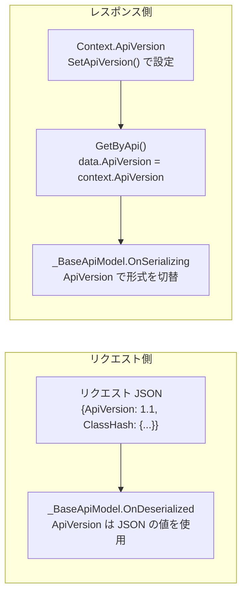

# ApiKey なし ApiVersion 反映の実装安全性調査

このドキュメントでは、`Compatibility_1_3_12 = true` の環境で `SetApiVersion` メソッドの ApiKey 条件を除去し、ApiKey なしでも `ApiVersion` を反映するよう変更した場合に実装上の問題がないかを調査した結果をまとめます。

<!-- START doctoc generated TOC please keep comment here to allow auto update -->
<!-- DON'T EDIT THIS SECTION, INSTEAD RE-RUN doctoc TO UPDATE -->

- [調査情報](#調査情報)
- [調査目的](#調査目的)
- [前提: Compatibility_1_3_12 導入の経緯](#前提-compatibility_1_3_12-導入の経緯)
- [調査対象: 提案される変更](#調査対象-提案される変更)
    - [現在の実装](#現在の実装)
    - [提案される変更](#提案される変更)
- [ApiVersion の使用箇所の全数調査](#apiversion-の使用箇所の全数調査)
    - [1. Context.ApiVersion の設定箇所](#1-contextapiversion-の設定箇所)
    - [2. Context.ApiVersion の参照箇所](#2-contextapiversion-の参照箇所)
    - [3. \_BaseApiModel.ApiVersion の使用箇所](#3-_baseapimodelapiversion-の使用箇所)
    - [4. Compatibility_1_3_12 の使用箇所](#4-compatibility_1_3_12-の使用箇所)
- [リクエストパターン別の影響分析](#リクエストパターン別の影響分析)
    - [リクエストのデシリアライズの仕組み](#リクエストのデシリアライズの仕組み)
    - [パターン1: フォームリクエスト（非API）](#パターン1-フォームリクエスト非api)
    - [パターン2: API リクエスト（ApiKey あり・ApiVersion 指定あり）](#パターン2-api-リクエストapikey-ありapiversion-指定あり)
    - [パターン3: API リクエスト（ApiKey あり・ApiVersion 未指定）](#パターン3-api-リクエストapikey-ありapiversion-未指定)
    - [パターン4: セッション認証 API（ApiKey なし・ApiVersion 指定あり）](#パターン4-セッション認証-apiapikey-なしapiversion-指定あり)
    - [パターン5: セッション認証 API（ApiKey なし・ApiVersion 未指定）](#パターン5-セッション認証-apiapikey-なしapiversion-未指定)
- [ApiVersion の影響範囲の確認](#apiversion-の影響範囲の確認)
    - [レスポンスのシリアライズ形式の切り替えのみ](#レスポンスのシリアライズ形式の切り替えのみ)
    - [リクエストのデシリアライズ（入力側）](#リクエストのデシリアライズ入力側)
- [潜在的リスクの検討](#潜在的リスクの検討)
    - [リスク1: ApiVersion 未指定時にデフォルト値が変わる可能性](#リスク1-apiversion-未指定時にデフォルト値が変わる可能性)
    - [リスク2: フォームリクエストで意図しない ApiVersion が設定される可能性](#リスク2-フォームリクエストで意図しない-apiversion-が設定される可能性)
    - [リスク3: 悪意のあるリクエストで ApiVersion を操作される可能性](#リスク3-悪意のあるリクエストで-apiversion-を操作される可能性)
    - [リスク4: Compatibility_1_3_12 を前提としたカスタムコードへの影響](#リスク4-compatibility_1_3_12-を前提としたカスタムコードへの影響)
- [結論](#結論)
- [関連ドキュメント](#関連ドキュメント)
- [関連ソースコード](#関連ソースコード)
- [関連コミット](#関連コミット)

<!-- END doctoc generated TOC please keep comment here to allow auto update -->

## 調査情報

| 調査日     | リポジトリ | ブランチ | タグ/バージョン    | コミット    | 備考     |
| ---------- | ---------- | -------- | ------------------ | ----------- | -------- |
| 2026-03-02 | Pleasanter | main     | Pleasanter_1.5.1.0 | `34f162a43` | 初回調査 |

## 調査目的

前回の調査（[011-$p.apiGetのApiVersion指定が無効になる原因](011-$p.apiGetのApiVersion指定が無効になる原因.md)）で、
`Compatibility_1_3_12 = true` のとき ApiKey なしのリクエストでは
`ApiVersion` がリクエストから反映されないことが判明した。

本調査では、この制約を取り除いて「ApiKey なしでも `ApiVersion` を反映する」
実装に変更した場合に、既存の動作に悪影響がないかを検証する。

---

## 前提: Compatibility_1_3_12 導入の経緯

`Compatibility_1_3_12` はコミット `372d0103b`（2022-07-01）で導入された。
コミット内のコードコメントに以下の記載がある。

```csharp
// ApiKeyを指定しない場合にAPIバージョンがセットできない不具合のある状態で
// 開発されたコードの動きを変えないよう 1.3.12 互換で動作させる
```

また、同日のリリースノート（コミット `63b363271`）にも以下の記載がある。

> APIキーを指定しないリクエストでApiVersionが正しくセットされない問題を解消。

つまり、開発元はこの動作を**不具合**（バグ）として認識しており、
`Compatibility_1_3_12` は不具合のある状態で開発された既存システムとの
後方互換性を維持するためのフラグである。

---

## 調査対象: 提案される変更

### 現在の実装

**ファイル**: `Implem.Pleasanter/Libraries/Requests/Context.cs`（行番号: 436-450）

```csharp
private void SetApiVersion(Api api)
{
    if (Parameters.Api.Compatibility_1_3_12)
    {
        if (api?.ApiKey.IsNullOrEmpty() == false) // ApiKey必須
        {
            ApiVersion = api.ApiVersion;
        }
    }
    else
    {
        ApiVersion = api?.ApiVersion ?? ApiVersion;
    }
}
```

### 提案される変更

ApiKey の有無に関係なく、リクエストの `ApiVersion` を反映する。

```csharp
private void SetApiVersion(Api api)
{
    ApiVersion = api?.ApiVersion ?? ApiVersion;
}
```

または、`Compatibility_1_3_12` フラグを維持しつつ ApiKey 条件のみ除去する。

```csharp
private void SetApiVersion(Api api)
{
    if (Parameters.Api.Compatibility_1_3_12)
    {
        if (api != null) // ApiKey条件を除去
        {
            ApiVersion = api.ApiVersion;
        }
    }
    else
    {
        ApiVersion = api?.ApiVersion ?? ApiVersion;
    }
}
```

---

## ApiVersion の使用箇所の全数調査

`ApiVersion` がコードベース内でどこで使用されているかを全数調査した。

### 1. Context.ApiVersion の設定箇所

| 箇所                                             | 説明                                    |
| ------------------------------------------------ | --------------------------------------- |
| `Context.cs` プロパティ初期化（行 112）          | `Parameters.Api.Version` で初期化       |
| `Context.SetApiVersion()` メソッド（行 436-450） | リクエストの `Api` オブジェクトから設定 |

### 2. Context.ApiVersion の参照箇所

全モデルの `GetByApi` メソッドで `context.ApiVersion` がレスポンスオブジェクトの
`ApiVersion` プロパティに転写される。

| モデル                             | 行番号 |
| ---------------------------------- | ------ |
| `IssueModel.GetByApi`              | 921    |
| `ResultModel.GetByApi`             | 775    |
| `WikiModel.GetByApi`               | 343    |
| `DashboardModel.GetByApi`          | 348    |
| `SiteModel.GetByApi`               | 2263   |
| `UserModel.GetByApi`               | 1722   |
| `DeptModel.GetByApi`               | 536    |
| `GroupModel.GetByApi`              | 604    |
| `TenantModel.GetByApi`             | 506    |
| `RegistrationModel.GetByApi`       | 381    |
| `ExtensionModel.GetByApi`          | 282    |
| `SysLogModel.GetByApi`             | 1404   |
| `ServerScriptModel` コンストラクタ | 132    |

### 3. \_BaseApiModel.ApiVersion の使用箇所

`_BaseApiModel` の `OnSerializing` / `OnDeserialized` メソッドで、
レスポンス/リクエストのシリアライズ形式を切り替えるために使用される。

| メソッド         | 行番号 | 条件                  | 動作                         |
| ---------------- | ------ | --------------------- | ---------------------------- |
| `OnSerializing`  | 817    | `ApiVersion < 1.100M` | Hash → 個別プロパティに展開  |
| `OnDeserialized` | 1587   | `ApiVersion < 1.100M` | 個別プロパティ → Hash に変換 |

### 4. Compatibility_1_3_12 の使用箇所

`Compatibility_1_3_12` は `SetApiVersion` メソッド内の**1箇所のみ**で使用されている。
他の処理には一切影響しない。

---

## リクエストパターン別の影響分析

### リクエストのデシリアライズの仕組み

`SetUserProperties` メソッドで、`RequestDataString` を
`Api` クラスにデシリアライズする。

```csharp
var jsonDeserializedRequestApi = RequestDataString.Deserialize<Api>();
SetApiVersion(api: jsonDeserializedRequestApi);
```

`RequestDataString` の値は以下のルールで決まる。

```csharp
public string RequestDataString {
    get => !string.IsNullOrEmpty(ApiRequestBody)
        ? ApiRequestBody  // APIリクエスト → JSONボディ
        : FormString;     // フォームリクエスト → フォームデータ
}
```

### パターン1: フォームリクエスト（非API）

通常の画面操作（フォーム送信）の場合。

| 項目                        | 値                                                    |
| --------------------------- | ----------------------------------------------------- |
| `ApiRequestBody`            | `null`（未設定）                                      |
| `FormString`                | URL エンコードされたフォームデータ                    |
| `RequestDataString`         | フォームデータ文字列                                  |
| `Deserialize<Api>()` の結果 | `null`（JSON でないため例外 → catch で `default(T)`） |
| `api`                       | `null`                                                |

変更後の動作: `api` が `null` のため `ApiVersion` は更新されない。
**現行と同じ。問題なし。**

### パターン2: API リクエスト（ApiKey あり・ApiVersion 指定あり）

外部クライアントからの API リクエスト。

```json
{ "ApiKey": "xxx", "ApiVersion": 1.1 }
```

| 項目             | 値      |
| ---------------- | ------- |
| `api.ApiKey`     | `"xxx"` |
| `api.ApiVersion` | `1.1`   |

変更後の動作: `api.ApiVersion`（1.1）が `Context.ApiVersion` に設定される。
**現行と同じ。問題なし。**

### パターン3: API リクエスト（ApiKey あり・ApiVersion 未指定）

`ApiVersion` を明示しない外部 API リクエスト。

```json
{ "ApiKey": "xxx" }
```

| 項目             | 値                                                         |
| ---------------- | ---------------------------------------------------------- |
| `api.ApiKey`     | `"xxx"`                                                    |
| `api.ApiVersion` | `Parameters.Api.Version`（`Api` クラスのプロパティ初期値） |

`Api` クラスの定義:

```csharp
public decimal ApiVersion { get; set; } = Parameters.Api.Version;
```

JSON に `ApiVersion` が含まれない場合、Newtonsoft.Json はプロパティ初期値を維持する。
よって `api.ApiVersion = Parameters.Api.Version` となり、
`Context.ApiVersion` も同じ値に設定される。
**現行と同じ。問題なし。**

### パターン4: セッション認証 API（ApiKey なし・ApiVersion 指定あり）

`$p.apiGet` でユーザが明示的に `ApiVersion` を指定した場合。

```json
{ "ApiVersion": 1.1, "Token": "..." }
```

| 項目             | 値                        |
| ---------------- | ------------------------- |
| `api.ApiKey`     | `null`                    |
| `api.ApiVersion` | `1.1`（リクエスト指定値） |

変更後の動作: `api.ApiVersion`（1.1）が `Context.ApiVersion` に設定される。
**現行では無視されるが、変更後は正しく反映される。これが意図した修正。**

### パターン5: セッション認証 API（ApiKey なし・ApiVersion 未指定）

`$p.apiGet` で `ApiVersion` を指定しない通常の呼び出し。

```javascript
$p.apiGet({
    id: 12345,
    done: function (data) {
        console.log(data);
    },
});
```

```json
{ "Token": "..." }
```

| 項目             | 値                                                         |
| ---------------- | ---------------------------------------------------------- |
| `api.ApiKey`     | `null`                                                     |
| `api.ApiVersion` | `Parameters.Api.Version`（`Api` クラスのプロパティ初期値） |

変更後の動作: `Context.ApiVersion = Parameters.Api.Version`
（プロパティ初期値と同じ値）。
**現行と同じ。問題なし。**

---

## ApiVersion の影響範囲の確認

`ApiVersion` が影響する処理は以下に限定される。

### レスポンスのシリアライズ形式の切り替えのみ

`ApiVersion` の値に基づいて分岐する処理は
`_BaseApiModel.OnSerializing` / `OnDeserialized` の**2箇所のみ**である。

```csharp
if (ApiVersion < 1.100M)
{
    // 旧形式: 個別プロパティ（ClassA, NumA, ...）に展開
}
// else: 新形式: Hash（ClassHash, NumHash, ...）をそのまま使用
```

`ApiVersion` は以下の処理には一切関与しない。

| 処理カテゴリ     | 影響 |
| ---------------- | ---- |
| 認証・認可       | なし |
| データアクセス   | なし |
| バリデーション   | なし |
| ビジネスロジック | なし |
| セキュリティ     | なし |

### リクエストのデシリアライズ（入力側）

Create / Update API のリクエストボディは各モデルの API モデル
（例: `IssueApiModel`）にデシリアライズされる。

```csharp
var issueApiModel = context.RequestDataString
    .Deserialize<IssueApiModel>();
```

この `IssueApiModel` は `_BaseApiModel` を継承しており、
`OnDeserialized` で `ApiVersion` に基づいて入力データを変換する。
この `ApiVersion` はリクエスト JSON 自体に含まれる値であり、
`Context.ApiVersion` とは独立している。



よって、`Context.ApiVersion` の変更はレスポンス形式にのみ影響し、
リクエストの解釈には影響しない。

---

## 潜在的リスクの検討

### リスク1: ApiVersion 未指定時にデフォルト値が変わる可能性

`Api` クラスのプロパティ初期値と `Context.ApiVersion` のプロパティ初期値は
同一（`Parameters.Api.Version`）であるため、JSON に `ApiVersion` が未指定の場合、
変更前後で値は変わらない。

```csharp
// Api.cs
public decimal ApiVersion { get; set; } = Parameters.Api.Version;

// Context.cs
public decimal ApiVersion { get; set; } = Parameters.Api.Version;
```

**リスクなし。**

### リスク2: フォームリクエストで意図しない ApiVersion が設定される可能性

フォームリクエスト（画面操作）の場合、`RequestDataString` は
URL エンコードされたフォームデータであり、JSON ではない。
`Deserialize<Api>()` は例外をキャッチして `null` を返すため、
`api` は常に `null` となり `ApiVersion` は更新されない。

**リスクなし。**

### リスク3: 悪意のあるリクエストで ApiVersion を操作される可能性

`ApiVersion` はレスポンスのシリアライズ形式（個別プロパティ vs Hash）の
切り替えにのみ使用される。認証・認可・データアクセスには影響しない。

仮に攻撃者が `ApiVersion` を任意の値に設定したとしても、
レスポンスのデータ構造が変わるだけで、返却されるデータの内容自体は変わらない。
また、攻撃者がレスポンス形式を変えることで有利になるシナリオは存在しない。

**セキュリティリスクなし。**

### リスク4: Compatibility_1_3_12 を前提としたカスタムコードへの影響

`Compatibility_1_3_12 = true` で運用しているシステムでは、
`$p.apiGet` 等のセッション認証 API が常に `Parameters.Api.Version`
のレスポンス形式で返却されることを前提としたカスタムスクリプトが
存在する可能性がある。

ただし、変更後も `ApiVersion` を明示的に指定しなければ
レスポンス形式は変わらないため、**既存のカスタムスクリプトには影響しない**。
影響が生じるのは、ユーザが意図的に `data: { ApiVersion: '1.1' }` を
指定した場合のみであり、これは望ましい動作変更である。

**実質的なリスクなし。**

---

## 結論

| 項目               | 結論                                                        |
| ------------------ | ----------------------------------------------------------- |
| 実装上の問題       | **なし**                                                    |
| 影響範囲           | レスポンスのシリアライズ形式の切り替えのみ                  |
| セキュリティ       | `ApiVersion` は認証・認可に関与しないため問題なし           |
| 既存コードへの影響 | `ApiVersion` 未指定時のデフォルト値は変わらないため影響なし |
| フォームリクエスト | `api` が `null` になるため影響なし                          |
| 互換性フラグの意図 | 開発元が不具合として認識している動作の互換性維持            |
| 推奨               | ApiKey 条件を除去して `ApiVersion` を常に反映する変更は安全 |

`Compatibility_1_3_12` の導入コミット自体が
「ApiKey なしで ApiVersion が設定できない**不具合**」と明記しており、
この条件を除去することは不具合の修正に該当する。
全パターンの影響分析の結果、既存動作への悪影響は確認されなかった。

---

## 関連ドキュメント

| ドキュメント                                                                                      | 説明             |
| ------------------------------------------------------------------------------------------------- | ---------------- |
| [011-$p.apiGetのApiVersion指定が無効になる原因](011-$p.apiGetのApiVersion指定が無効になる原因.md) | 原因調査（前回） |

## 関連ソースコード

| ファイル                                               | 説明                                     |
| ------------------------------------------------------ | ---------------------------------------- |
| `Implem.Pleasanter/Libraries/Requests/Context.cs`      | `SetApiVersion` メソッド（行 436-450）   |
| `Implem.Pleasanter/Libraries/Requests/Api.cs`          | API リクエストモデル                     |
| `Implem.Pleasanter/Models/Shared/_BaseApiModel.cs`     | シリアライズ形式切替（行 817, 1587）     |
| `Implem.Libraries/Utilities/Jsons.cs`                  | デシリアライズ処理（例外時 `null` 返却） |
| `Implem.Pleasanter/Controllers/Api/ItemsController.cs` | API コントローラー                       |

## 関連コミット

| コミット    | 日付       | 内容                                         |
| ----------- | ---------- | -------------------------------------------- |
| `372d0103b` | 2022-07-01 | `Compatibility_1_3_12` パラメータ追加        |
| `63b363271` | 2022-07-03 | ApiVersion 既定値 1.1 変更・バグ修正リリース |
