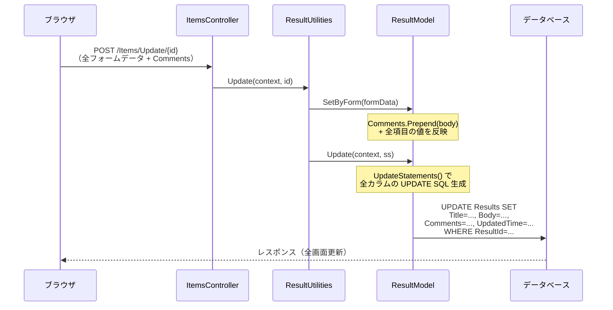
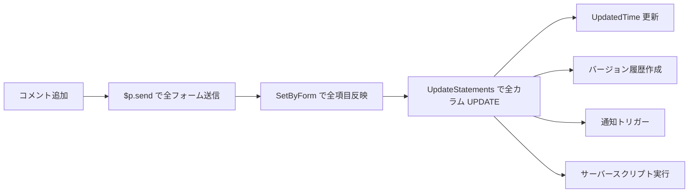
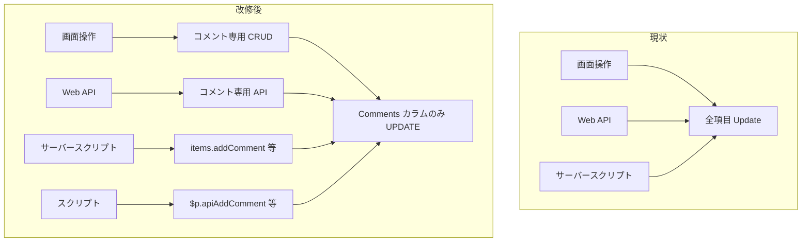
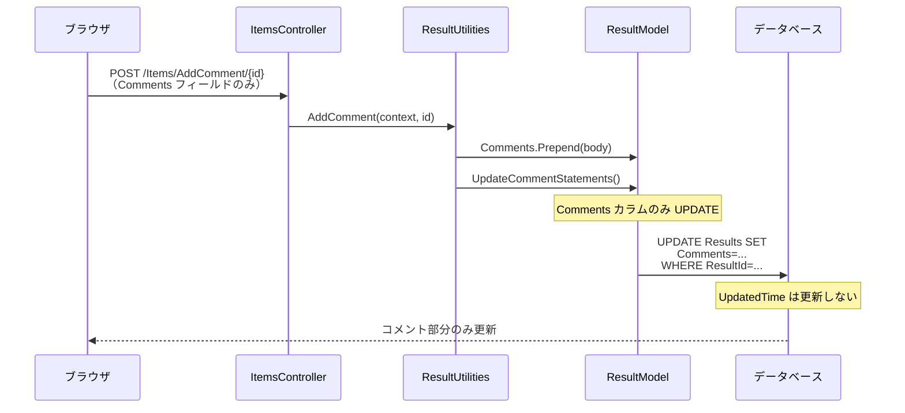
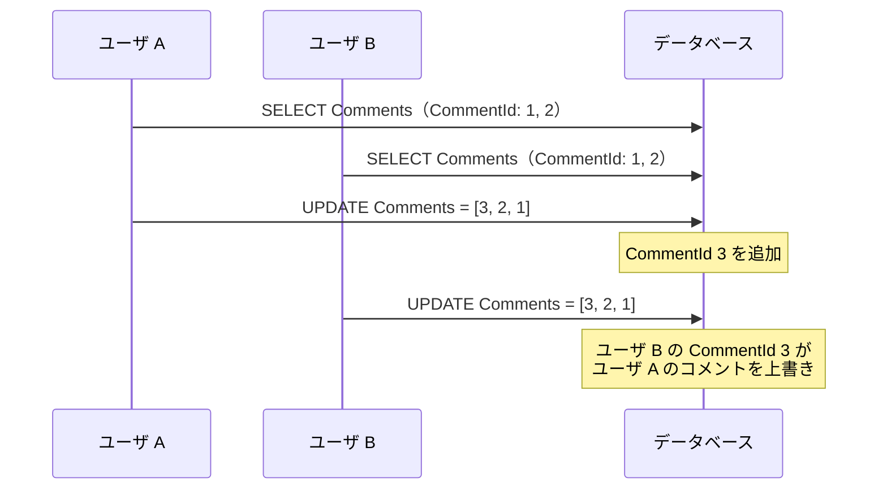

# コメント単独 CRUD 実現可能性調査

プリザンターのコメント操作が他項目の更新に巻き込まれる現状を分析し、コメントのみの単独 CRUD を実現する方法を調査する。

<!-- START doctoc generated TOC please keep comment here to allow auto update -->
<!-- DON'T EDIT THIS SECTION, INSTEAD RE-RUN doctoc TO UPDATE -->

- [調査情報](#調査情報)
- [調査目的](#調査目的)
- [現状のコメントデータモデル](#現状のコメントデータモデル)
    - [Comment クラス](#comment-クラス)
    - [Comments クラス](#comments-クラス)
    - [データベース格納形式](#データベース格納形式)
- [現状のコメント CRUD フロー](#現状のコメント-crud-フロー)
    - [コメント追加（Create）](#コメント追加create)
    - [コメント編集（Update）](#コメント編集update)
    - [コメント削除（Delete）](#コメント削除delete)
    - [コメント読み取り（Read）](#コメント読み取りread)
- [現状の問題点](#現状の問題点)
    - [全項目が更新に巻き込まれる](#全項目が更新に巻き込まれる)
    - [API でのコメント操作の制約](#api-でのコメント操作の制約)
    - [サーバースクリプトでのコメント操作の制約](#サーバースクリプトでのコメント操作の制約)
- [コメント単独 CRUD の実現方針](#コメント単独-crud-の実現方針)
    - [方針概要](#方針概要)
    - [1. データベース層の改修](#1-データベース層の改修)
    - [2. コントローラ層の改修](#2-コントローラ層の改修)
    - [3. フロントエンド（画面操作）の改修](#3-フロントエンド画面操作の改修)
    - [4. サーバースクリプト API の改修](#4-サーバースクリプト-api-の改修)
    - [5. クライアントスクリプト（$p 関数）の改修](#5-クライアントスクリプトp-関数の改修)
- [改修箇所の詳細](#改修箇所の詳細)
    - [CodeDefiner による自動生成への影響](#codedefiner-による自動生成への影響)
    - [権限チェック](#権限チェック)
    - [排他制御](#排他制御)
- [将来的な拡張: コメント専用テーブル](#将来的な拡張-コメント専用テーブル)
    - [テーブル設計案](#テーブル設計案)
- [改修の影響範囲](#改修の影響範囲)
    - [通知への影響](#通知への影響)
    - [履歴への影響](#履歴への影響)
    - [監査ログへの影響](#監査ログへの影響)
- [結論](#結論)
- [関連ソースコード](#関連ソースコード)

<!-- END doctoc generated TOC please keep comment here to allow auto update -->

## 調査情報

| 調査日       | リポジトリ | ブランチ | タグ/バージョン    | コミット    | 備考     |
| ------------ | ---------- | -------- | ------------------ | ----------- | -------- |
| 2026年3月3日 | Pleasanter | main     | Pleasanter_1.5.1.0 | `34f162a43` | 初回調査 |

## 調査目的

現在のプリザンターでは、コメントの追加・編集・削除がレコード全体の更新処理と一体化しており、コメントのみの単独操作ができない。これにより以下の問題が発生する。

- コメント追加時に他項目の UpdatedTime が更新され、変更検知が正しく機能しない
- コメントのみの操作に対して不要なバリデーション・通知・履歴バージョンが発生する
- API やサーバースクリプトからコメントだけを操作する手段がない

画面・API・サーバースクリプト・スクリプトのそれぞれでコメント単独 CRUD を実現する方法と改修方針を調査する。

---

## 現状のコメントデータモデル

### Comment クラス

**ファイル**: `Implem.Pleasanter/Libraries/DataTypes/Comment.cs`

```csharp
public class Comment
{
    public int CommentId;
    public DateTime CreatedTime;
    public DateTime? UpdatedTime;
    public int Creator;
    public int? Updator;
    public string Body;
    [NonSerialized]
    public bool Created;
    [NonSerialized]
    public bool Updated;
}
```

| プロパティ  | 型        | 説明                                       |
| ----------- | --------- | ------------------------------------------ |
| CommentId   | int       | コメントごとの連番（コレクション内で一意） |
| CreatedTime | DateTime  | 作成日時                                   |
| UpdatedTime | DateTime? | 編集日時（未編集時は null）                |
| Creator     | int       | 作成者の UserId                            |
| Updator     | int?      | 編集者の UserId                            |
| Body        | string    | コメント本文（Markdown）                   |
| Created     | bool      | 新規追加フラグ（非シリアライズ）           |
| Updated     | bool      | 編集済みフラグ（非シリアライズ）           |

### Comments クラス

**ファイル**: `Implem.Pleasanter/Libraries/DataTypes/Comments.cs`

`List<Comment>` を継承したコレクションクラスで、以下の主要メソッドを持つ。

| メソッド                    | 行番号  | 説明                                       |
| --------------------------- | ------- | ------------------------------------------ |
| Prepend()                   | 190-208 | 新規コメントをリスト先頭に挿入             |
| Update()                    | 223-227 | CommentId で既存コメントを検索し本文を更新 |
| ToJson()                    | 234-237 | JSON 配列文字列にシリアライズ              |
| ClearAndSplitPrepend()      | 295-320 | フォーム送信時のコメント解析・挿入         |
| ClearAndSplitPrependByApi() | 281-293 | API 送信時のコメント挿入                   |
| CommentId()                 | 239-249 | 新規 CommentId を既存最大値 + 1 で生成     |

### データベース格納形式

コメントは `Results` / `Issues` / `Wikis` テーブルの `Comments` カラム（nvarchar(max)）に JSON 配列として格納される。

```json
[
    {
        "CommentId": 2,
        "CreatedTime": "2026-03-01T10:00:00",
        "Creator": 1,
        "Body": "新しいコメント"
    },
    {
        "CommentId": 1,
        "CreatedTime": "2026-02-28T09:00:00",
        "UpdatedTime": "2026-03-01T11:00:00",
        "Creator": 1,
        "Updator": 2,
        "Body": "編集されたコメント"
    }
]
```

---

## 現状のコメント CRUD フロー

### コメント追加（Create）



**ファイル**: `Implem.Pleasanter/Models/Results/ResultModel.cs`（SetByForm メソッド）

コメントの新規追加は `Comments.Prepend()` で行われるが、同時にフォーム上の全項目が `SetByForm` で反映される。

### コメント編集（Update）

**ファイル**: `Implem.Pleasanter/Models/Results/ResultModel.cs`（SetByForm メソッド）

フォームデータのキーが `Comment[0-9]+` パターンに一致する場合、該当コメントの本文が更新される。

```csharp
if (key.RegexExists("Comment[0-9]+"))
{
    Comments.Update(
        context: context,
        ss: ss,
        commentId: key.Substring("Comment".Length).ToInt(),
        body: value);
}
```

編集権限は `Comment.CanEdit()` で判定される。自分が作成したコメントのみ編集可能。

```csharp
private bool CanEdit(Context context, SiteSettings ss, bool allowEditing, bool readOnly)
{
    return allowEditing && !readOnly && Creator == context.UserId;
}
```

### コメント削除（Delete）

**ファイル**: `Implem.Pleasanter/Controllers/ItemsController.cs`（行番号: 871-879）

```csharp
[HttpDelete]
public string DeleteComment(long id)
{
    var context = new Context();
    var log = new SysLogModel(context: context);
    var json = new ItemModel(context: context, referenceId: id)
        .DeleteComment(context: context);
    log.Finish(context: context, responseSize: json.Length);
    return json;
}
```

DeleteComment は専用アクションとして存在するが、内部では `SetByForm` + `Update()` を呼び出し、レコード全体を更新する。

**ファイル**: `Implem.Pleasanter/Models/Results/ResultModel.cs`（SetByForm メソッド）

```csharp
if (context.Action == "deletecomment")
{
    DeleteCommentId = formData.Get("ControlId")?
        .Split(',')
        ._2nd()
        .ToInt() ?? 0;
    Comments.RemoveAll(o => o.CommentId == DeleteCommentId);
}
```

### コメント読み取り（Read）

コメントはレコードの一部として取得される。API の Get レスポンスに Comments が含まれる。個別コメントの取得 API は存在しない。

---

## 現状の問題点

### 全項目が更新に巻き込まれる



| 問題                       | 説明                                                                                   |
| -------------------------- | -------------------------------------------------------------------------------------- |
| UpdatedTime の更新         | コメントのみの操作でもレコードの UpdatedTime が更新される                              |
| 不要な履歴バージョン       | AutoVerUpType.Always 設定時、コメント追加ごとに履歴バージョンが作成される              |
| 楽観的排他制御の衝突       | コメント追加時に UpdatedTime の一致チェックが行われ、他ユーザの編集と競合する          |
| 全フォームデータの送信     | `$p.send()` がフォーム上の全項目を送信するため、未保存の他項目変更が意図せず反映される |
| 通知の誤発火               | コメント追加時に MonitorChangesColumns の変更監視が全項目に対して実行される            |
| サーバースクリプトの全実行 | コメント操作で Before/After Update のサーバースクリプトが全て実行される                |

### API でのコメント操作の制約

| 制約                           | 説明                                                        |
| ------------------------------ | ----------------------------------------------------------- |
| コメント追加は Update API のみ | `/api/items/{id}/update` でのみコメント追加が可能           |
| 全項目の送信が必要             | Comments 以外の項目も送信対象になる                         |
| コメント編集の API がない      | 既存コメントの本文を変更する API エンドポイントが存在しない |
| コメント削除の API がない      | コメントを個別に削除する API エンドポイントが存在しない     |
| コメント ID の指定不可         | API では CommentId を指定した個別操作ができない             |

### サーバースクリプトでのコメント操作の制約

**ファイル**: `Implem.Pleasanter/Libraries/ServerScripts/ServerScriptUtilities.cs`（行番号: 859-867, 944-952）

サーバースクリプトでは `model.Comments` に値を設定すると `Comments.Prepend()` が呼ばれ、新規コメントの追加のみが可能。

```csharp
// IssueModel の場合
setter: value => issueModel.Comments.Prepend(
    context: context,
    ss: ss,
    body: value),
```

| 制約                    | 説明                                                                  |
| ----------------------- | --------------------------------------------------------------------- |
| 追加のみ                | `model.Comments = "本文"` で新規追加のみ可能                          |
| 既存コメントの編集不可  | CommentId を指定した編集手段がない                                    |
| 既存コメントの削除不可  | CommentId を指定した削除手段がない                                    |
| コメント一覧の取得      | `model.Comments` で JSON 文字列として取得可能                         |
| ToJsonString で null 化 | ServerScriptModelApiModel.ToJsonString() で Comments が null 化される |

**ファイル**: `Implem.Pleasanter/Libraries/ServerScripts/ServerScriptModelApiModel.cs`（行番号: 439, 447, 456, 465）

```csharp
apiModel.Comments = null;
```

`items.Get()` で取得したモデルの Comments が null に設定されるため、サーバースクリプトからコメントの読み取りも制限される。

---

## コメント単独 CRUD の実現方針

### 方針概要

コメント操作を他項目の更新から分離し、コメント専用の CRUD エンドポイント・サーバースクリプト API・クライアントスクリプト関数を追加する。



---

### 1. データベース層の改修

コメント単独更新用の SQL 文を生成するメソッドを追加する。

#### 改修対象ファイル

| ファイル                        | 改修内容                                 |
| ------------------------------- | ---------------------------------------- |
| `Models/Results/ResultModel.cs` | `UpdateCommentStatements()` メソッド追加 |
| `Models/Issues/IssueModel.cs`   | `UpdateCommentStatements()` メソッド追加 |
| `Models/Wikis/WikiModel.cs`     | `UpdateCommentStatements()` メソッド追加 |
| `Libraries/DataSources/Rds.cs`  | コメント単独更新パラメータ生成の追加     |

#### UpdateCommentStatements の設計

```csharp
// Comments カラムのみを更新する SQL 文を生成
private List<SqlStatement> UpdateCommentStatements(
    Context context,
    SiteSettings ss)
{
    var statements = new List<SqlStatement>();
    statements.Add(Rds.UpdateResults(
        verUp: false,  // コメント操作ではバージョンアップしない
        where: Rds.ResultsWhereDefault(
            context: context,
            resultModel: this),
        param: Rds.ResultsParam()
            .Comments(Comments.ToJson())
            // UpdatedTime は更新しない
    ));
    return statements;
}
```

**UpdatedTime を更新しない**点がポイント。コメント操作はレコードの実質的な変更ではないため、楽観的排他制御のタイムスタンプを変更しない。

---

### 2. コントローラ層の改修

#### 追加 API エンドポイント

| メソッド | エンドポイント                  | 説明             |
| -------- | ------------------------------- | ---------------- |
| POST     | `/api/items/{id}/addcomment`    | コメント追加     |
| PUT      | `/api/items/{id}/updatecomment` | コメント編集     |
| DELETE   | `/api/items/{id}/deletecomment` | コメント削除     |
| POST     | `/api/items/{id}/getcomments`   | コメント一覧取得 |

#### リクエスト・レスポンス設計

**コメント追加リクエスト**:

```json
{
    "ApiVersion": 1.1,
    "ApiKey": "xxx",
    "Body": "コメント本文"
}
```

**コメント編集リクエスト**:

```json
{
    "ApiVersion": 1.1,
    "ApiKey": "xxx",
    "CommentId": 3,
    "Body": "編集後の本文"
}
```

**コメント削除リクエスト**:

```json
{
    "ApiVersion": 1.1,
    "ApiKey": "xxx",
    "CommentId": 3
}
```

**コメント取得レスポンス**:

```json
{
    "StatusCode": 200,
    "Response": {
        "Comments": [
            {
                "CommentId": 2,
                "CreatedTime": "2026-03-01T10:00:00",
                "Creator": 1,
                "CreatorName": "管理者",
                "Body": "コメント本文"
            }
        ]
    }
}
```

#### 改修対象ファイル

| ファイル                             | 改修内容                         |
| ------------------------------------ | -------------------------------- |
| `Controllers/Api/ItemsController.cs` | API エンドポイント追加           |
| `Controllers/Api_ItemsController.cs` | 互換ルート追加                   |
| `Controllers/ItemsController.cs`     | 画面用アクション追加             |
| `Models/Items/ItemModel.cs`          | コメント操作ルーティング追加     |
| `Models/Results/ResultUtilities.cs`  | コメント CRUD ユーティリティ追加 |
| `Models/Issues/IssueUtilities.cs`    | コメント CRUD ユーティリティ追加 |
| `Models/Wikis/WikiUtilities.cs`      | コメント CRUD ユーティリティ追加 |

---

### 3. フロントエンド（画面操作）の改修

#### 現状の送信方式

**ファイル**: `Implem.PleasanterFrontend/wwwroot/src/scripts/generals/_form.js`（行番号: 52-114）

`$p.send()` はフォーム上の全フィールドを `$p.getData()` で収集して送信する。コメント操作でも全フィールドが送信される。

#### 改修方針

コメント追加・編集・削除時に専用のリクエストを送信し、他フィールドを含めないようにする。

| 改修対象           | 改修内容                                               |
| ------------------ | ------------------------------------------------------ |
| HtmlComments.cs    | コメント送信ボタンの DataAction を専用アクションに変更 |
| \_form.js          | コメント専用送信関数の追加                             |
| ResponseComment.cs | コメント単独レスポンスの構築                           |

#### 画面操作の改修イメージ



---

### 4. サーバースクリプト API の改修

#### 追加 API

| メソッド                                   | 説明             |
| ------------------------------------------ | ---------------- |
| `items.AddComment(id, body)`               | コメント追加     |
| `items.UpdateComment(id, commentId, body)` | コメント編集     |
| `items.DeleteComment(id, commentId)`       | コメント削除     |
| `items.GetComments(id)`                    | コメント一覧取得 |

#### 改修対象ファイル

| ファイル                                               | 改修内容                            |
| ------------------------------------------------------ | ----------------------------------- |
| `Libraries/ServerScripts/ServerScriptModelApiItems.cs` | コメント操作メソッド追加            |
| `Libraries/ServerScripts/ServerScriptUtilities.cs`     | コメント操作ユーティリティ追加      |
| `Libraries/ServerScripts/ServerScriptModelApiModel.cs` | Comments の null 化を条件付きに変更 |

#### 使用例

```javascript
// サーバースクリプトでのコメント操作
// コメント追加
items.AddComment(recordId, '新しいコメント');

// コメント一覧取得
let comments = items.GetComments(recordId);
// [{ CommentId: 1, Body: "...", Creator: 1, CreatedTime: "..." }, ...]

// コメント編集
items.UpdateComment(recordId, 1, '編集後の本文');

// コメント削除
items.DeleteComment(recordId, 1);
```

---

### 5. クライアントスクリプト（$p 関数）の改修

#### 追加関数

| 関数名                                                 | 説明                          |
| ------------------------------------------------------ | ----------------------------- |
| `$p.apiAddComment(id, body, done, fail)`               | コメント追加 API 呼び出し     |
| `$p.apiUpdateComment(id, commentId, body, done, fail)` | コメント編集 API 呼び出し     |
| `$p.apiDeleteComment(id, commentId, done, fail)`       | コメント削除 API 呼び出し     |
| `$p.apiGetComments(id, done, fail)`                    | コメント一覧取得 API 呼び出し |

#### 改修対象ファイル

| ファイル                                                          | 改修内容             |
| ----------------------------------------------------------------- | -------------------- |
| `Implem.PleasanterFrontend/wwwroot/src/scripts/generals/_api.js`  | コメント操作関数追加 |
| `Implem.PleasanterFrontend/wwwroot/src/scripts/generals/_init.js` | $p への関数登録      |

#### 使用例

```javascript
// クライアントスクリプトでのコメント操作
// コメント追加
$p.apiAddComment($p.id(), '新しいコメント', function (data) {
    console.log('追加完了', data);
});

// コメント一覧取得
$p.apiGetComments($p.id(), function (data) {
    data.Response.Comments.forEach(function (c) {
        console.log(c.CommentId, c.Body);
    });
});

// コメント編集
$p.apiUpdateComment($p.id(), 1, '編集後', function (data) {
    console.log('編集完了');
});

// コメント削除
$p.apiDeleteComment($p.id(), 1, function (data) {
    console.log('削除完了');
});
```

---

## 改修箇所の詳細

### CodeDefiner による自動生成への影響

プリザンターのモデルコードは `Implem.Pleasanter.CodeDefiner` で自動生成される。以下のファイルは CodeDefiner の出力対象であり、手動修正が上書きされるリスクがある。

| ファイル                     | 自動生成 | 対応方針                              |
| ---------------------------- | :------: | ------------------------------------- |
| ResultModel.cs               |  部分的  | 自動生成外の partial クラスに追加する |
| IssueModel.cs                |  部分的  | 自動生成外の partial クラスに追加する |
| WikiModel.cs                 |  部分的  | 自動生成外の partial クラスに追加する |
| ResultUtilities.cs           |  部分的  | 自動生成外のメソッドとして追加する    |
| IssueUtilities.cs            |  部分的  | 自動生成外のメソッドとして追加する    |
| ItemsController.cs           |  部分的  | 自動生成外のアクションとして追加する  |
| ServerScriptModelApiItems.cs |    No    | 直接修正可能                          |
| ServerScriptUtilities.cs     |    No    | 直接修正可能                          |
| \_api.js                     |    No    | 直接修正可能                          |
| HtmlComments.cs              |    No    | 直接修正可能                          |
| ResponseComment.cs           |    No    | 直接修正可能                          |

### 権限チェック

コメント操作に必要な権限チェックを整理する。

| 操作         | 権限条件                                                               |
| ------------ | ---------------------------------------------------------------------- |
| コメント追加 | レコードの Update 権限                                                 |
| コメント編集 | レコードの Update 権限 + コメントの Creator が自分                     |
| コメント削除 | レコードの Update 権限 + コメントの Creator が自分（管理者は全削除可） |
| コメント取得 | レコードの Read 権限                                                   |

### 排他制御

コメント単独更新では UpdatedTime による楽観的排他制御を適用しない。代わりにコメント間の競合を以下の方法で回避する。

| 方式                   | 説明                                                                      |
| ---------------------- | ------------------------------------------------------------------------- |
| CommentId による一意性 | 追加時に既存最大 CommentId + 1 を採番するため、同時追加でも ID 衝突しない |
| 存在チェック           | 編集・削除時に対象 CommentId の存在を確認する                             |
| トランザクション分離   | Comments カラムの読み取り・更新をトランザクション内で行う                 |

ただし、同時に複数ユーザがコメントを追加した場合、後から UPDATE した方が先の追加分を含まない可能性がある（Last Write Wins）。これを防ぐには以下の対策が必要。



**対策**: UPDATE 文で既存の Comments カラム値を読み取り、JSON マージする方法。または、コメントを別テーブルに分離する方法（後述）。

---

## 将来的な拡張: コメント専用テーブル

現在の JSON 配列格納方式では、同時書き込みの競合が根本的に解決できない。将来的にはコメントを専用テーブルに分離することで、行レベルの排他制御が可能になる。

### テーブル設計案

```sql
CREATE TABLE Comments (
    CommentId     BIGINT IDENTITY(1,1) PRIMARY KEY,
    ReferenceId   BIGINT NOT NULL,       -- レコードID（ResultId/IssueId）
    ReferenceType NVARCHAR(32) NOT NULL,  -- "Results" / "Issues" / "Wikis"
    Creator       INT NOT NULL,
    Updator       INT NULL,
    Body          NVARCHAR(MAX) NOT NULL,
    CreatedTime   DATETIME NOT NULL,
    UpdatedTime   DATETIME NULL,
    FOREIGN KEY (Creator) REFERENCES Users(UserId)
);

CREATE INDEX IX_Comments_ReferenceId
    ON Comments (ReferenceType, ReferenceId, CreatedTime DESC);
```

この方式では以下のメリットがある。

| メリット         | 説明                                          |
| ---------------- | --------------------------------------------- |
| 行レベル排他制御 | INSERT/UPDATE/DELETE が個別行に対して行われる |
| パフォーマンス   | JSON パース不要、インデックス検索可能         |
| ページネーション | OFFSET/FETCH でコメントのページ分割が可能     |
| 同時書き込み安全 | 複数ユーザの同時コメント追加が競合しない      |

ただし、既存の JSON 格納方式からのマイグレーションが必要であり、大規模な改修となる。本調査では JSON 格納方式のままでの改修を主軸とする。

---

## 改修の影響範囲

### 通知への影響

コメント単独操作では、通知の MonitorChangesColumns に「Comments」が含まれている場合のみ通知を発火させる。他項目の変更は検知しない。

### 履歴への影響

コメント単独操作では履歴バージョンを作成しない（`verUp: false`）。ただし、コメントの変更は Comments カラムの値に反映されるため、次回のレコード更新時に履歴に含まれる。

### 監査ログへの影響

コメント操作も SysLog に記録する。Action 名は `addcomment` / `updatecomment` / `deletecomment` / `getcomments` とする。

---

## 結論

| 項目                   | 評価   | 説明                                                                       |
| ---------------------- | ------ | -------------------------------------------------------------------------- |
| 実現可能性             | 可能   | 既存のデータモデル（JSON 配列格納）のままでコメント単独 CRUD を追加できる  |
| API 追加               | 可能   | 4 エンドポイント（Add/Update/Delete/Get）の追加で対応可能                  |
| サーバースクリプト追加 | 可能   | items.AddComment 等の 4 メソッドを追加で対応可能                           |
| スクリプト追加         | 可能   | $p.apiAddComment 等の 4 関数を追加で対応可能                               |
| 画面操作の分離         | 可能   | $p.send を専用送信に変更し、Comments カラムのみ更新する方式で対応可能      |
| 排他制御               | 注意   | JSON 配列の Last Write Wins 問題があり、同時追加時にコメント消失リスクあり |
| CodeDefiner 影響       | 注意   | 自動生成対象ファイルは partial クラス分離が必要                            |
| 改修規模               | 中規模 | Controller/Model/Utilities/ServerScript/Frontend の横断的改修が必要        |

コメント単独 CRUD は現行アーキテクチャのままで実現可能である。JSON 配列格納方式での同時書き込み問題は、トランザクション内での読み取り・マージ・更新で軽減できるが、根本解決にはコメント専用テーブルへの移行が望ましい。

---

## 関連ソースコード

| ファイル                                                                 | 説明                         |
| ------------------------------------------------------------------------ | ---------------------------- |
| `Implem.Pleasanter/Libraries/DataTypes/Comment.cs`                       | Comment エンティティ         |
| `Implem.Pleasanter/Libraries/DataTypes/Comments.cs`                      | Comments コレクション        |
| `Implem.Pleasanter/Models/Shared/_BaseModel.cs`                          | Comments_Updated() 定義      |
| `Implem.Pleasanter/Models/Results/ResultModel.cs`                        | SetByForm / UpdateStatements |
| `Implem.Pleasanter/Models/Issues/IssueModel.cs`                          | SetByForm / UpdateStatements |
| `Implem.Pleasanter/Controllers/ItemsController.cs`                       | DeleteComment アクション     |
| `Implem.Pleasanter/Controllers/Api/ItemsController.cs`                   | API エンドポイント           |
| `Implem.Pleasanter/Libraries/HtmlParts/HtmlComments.cs`                  | コメント HTML 生成           |
| `Implem.Pleasanter/Libraries/Responses/ResponseComment.cs`               | コメントレスポンス構築       |
| `Implem.Pleasanter/Libraries/ServerScripts/ServerScriptModelApiItems.cs` | サーバースクリプト API       |
| `Implem.Pleasanter/Libraries/ServerScripts/ServerScriptUtilities.cs`     | サーバースクリプト処理       |
| `Implem.Pleasanter/Libraries/ServerScripts/ServerScriptModelApiModel.cs` | Comments null 化処理         |
| `Implem.PleasanterFrontend/wwwroot/src/scripts/generals/_form.js`        | $p.send 実装                 |
| `Implem.PleasanterFrontend/wwwroot/src/scripts/generals/_api.js`         | $p.api\* 実装                |
