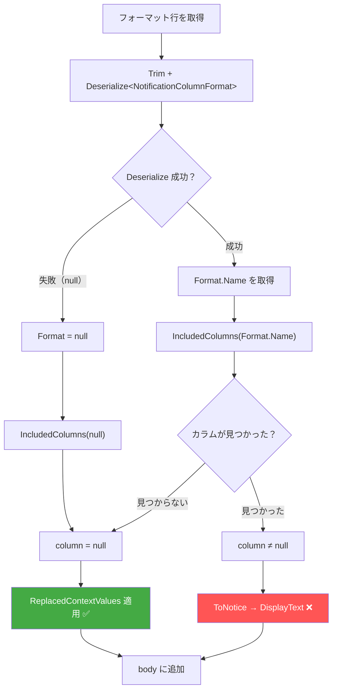
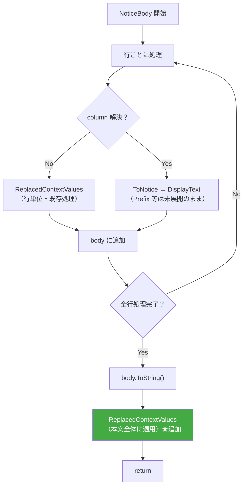
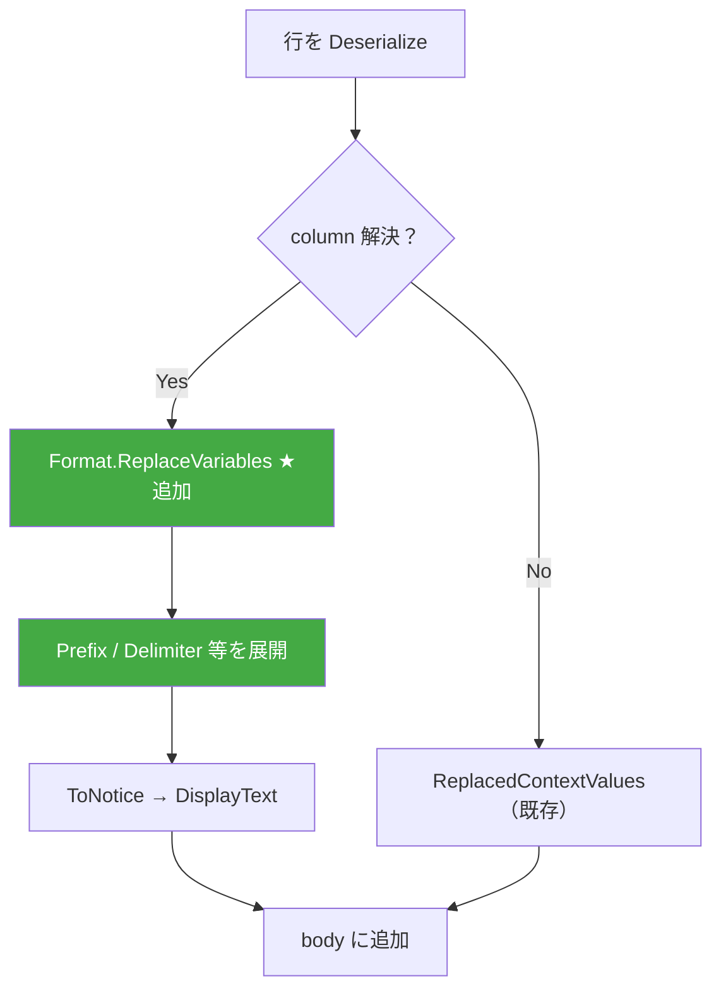

# 通知コンテキスト変数 `{}` の展開不具合調査

通知機能でコンテキスト変数（`{Url}`, `{UserName}` 等）が正常に展開されないケースの原因を調査する。

<!-- START doctoc generated TOC please keep comment here to allow auto update -->
<!-- DON'T EDIT THIS SECTION, INSTEAD RE-RUN doctoc TO UPDATE -->

- [調査情報](#調査情報)
- [調査目的](#調査目的)
- [前提知識](#前提知識)
- [コンテキスト変数の展開フロー](#コンテキスト変数の展開フロー)
    - [展開対象の変数](#展開対象の変数)
    - [展開が行われる箇所](#展開が行われる箇所)
    - [展開処理の実装](#展開処理の実装)
- [展開が失敗するケース](#展開が失敗するケース)
    - [ケース 1: カラム分岐に入った行のフィールド値](#ケース-1-カラム分岐に入った行のフィールド値)
    - [ケース 2: `{}` リテラル（空ブレース）の意図しない通過](#ケース-2--リテラル空ブレースの意図しない通過)
    - [ケース 3: 連鎖置換による意図しない二重展開](#ケース-3-連鎖置換による意図しない二重展開)
    - [ケース 4: 置換値が null または空文字列](#ケース-4-置換値が-null-または空文字列)
    - [ケース 5: JSON 行とコンテキスト変数の同一行混在](#ケース-5-json-行とコンテキスト変数の同一行混在)
    - [ケース 6: 通知 Prefix フィールド内のコンテキスト変数](#ケース-6-通知-prefix-フィールド内のコンテキスト変数)
- [NoticeBody のコンテキスト変数展開フロー詳細](#noticebody-のコンテキスト変数展開フロー詳細)
    - [Deserialize の成否パターン](#deserialize-の成否パターン)
- [string.Format との相互作用](#stringformat-との相互作用)
    - [Strings.Params メソッド](#stringsparams-メソッド)
    - [Displays.Get メソッドでの使用](#displaysget-メソッドでの使用)
    - [通知タイトルでの string.Format 使用箇所](#通知タイトルでの-stringformat-使用箇所)
    - [FormatException のリスク](#formatexception-のリスク)
- [結論](#結論)
- [修正案](#修正案)
    - [問題の整理](#問題の整理)
    - [修正案 A: NoticeBody 出力全体の後処理展開（推奨）](#修正案-a-noticebody-出力全体の後処理展開推奨)
    - [修正案 B: NotificationColumnFormat フィールドの個別展開](#修正案-b-notificationcolumnformat-フィールドの個別展開)
    - [修正案 C: JSON 抽出パーサーによる行分離](#修正案-c-json-抽出パーサーによる行分離)
    - [修正案の比較](#修正案の比較)
    - [推奨](#推奨)
- [関連ソースコード](#関連ソースコード)
- [関連ドキュメント](#関連ドキュメント)

<!-- END doctoc generated TOC please keep comment here to allow auto update -->

## 調査情報

| 調査日        | リポジトリ | ブランチ           | タグ/バージョン | コミット     | 備考     |
| ------------- | ---------- | ------------------ | --------------- | ------------ | -------- |
| 2026年2月18日 | Pleasanter | Pleasanter_1.5.1.0 |                 | `34f162a439` | 初回調査 |

## 調査目的

通知のカスタムフォーマットや件名において、`{Url}`, `{UserName}` 等のコンテキスト変数（波括弧形式）が正常に展開されないケースを特定し、その原因を明らかにする。特に `{}` が連続した場合や、JSON 行との混在時の挙動を調査する。

## 前提知識

本ドキュメントの理解には [004-通知カスタムフォーマット・プレースホルダ](004-通知カスタムフォーマット・プレースホルダ.md) の内容を前提とする。

---

## コンテキスト変数の展開フロー

### 展開対象の変数

`ReplacedContextValues` メソッドで展開される変数は以下の 4 つのみ。

| 変数            | 置換値                     |
| --------------- | -------------------------- |
| `{Url}`         | レコード編集画面の絶対 URL |
| `{LoginId}`     | 操作ユーザのログイン ID    |
| `{UserName}`    | 操作ユーザの表示名         |
| `{MailAddress}` | 操作ユーザのメールアドレス |

### 展開が行われる箇所

| 箇所                           | 呼び出し経路                                               | 展開 |
| ------------------------------ | ---------------------------------------------------------- | ---- |
| 件名（Subject）                | `ReplacedDisplayValues` → `ReplacedContextValues`          | ✅   |
| 本文（NoticeBody: 非カラム行） | `NoticeBody` → `ReplacedContextValues` (column == null 時) | ✅   |
| 本文（NoticeBody: カラム行）   | `NoticeBody` → `ToNotice` → `DisplayText`                  | ❌   |
| プロセス通知 Subject           | `ReplacedDisplayValues` → `ReplacedContextValues`          | ✅   |
| プロセス通知 Body              | `ReplacedDisplayValues` → `ReplacedContextValues`          | ✅   |
| 通知 Prefix                    | `Notification.Send` で `Prefix + title` として直接結合     | ❌   |
| 宛先アドレス                   | `IncludedColumns` → `ReplacedAddress`                      | ❌   |

### 展開処理の実装

**ファイル**: `Implem.Pleasanter/Models/Results/ResultModel.cs`（行番号: 3825-3841）

```csharp
private string ReplacedContextValues(Context context, string value)
{
    var url = Locations.ItemEditAbsoluteUri(context: context, id: ResultId);
    var mailAddress = MailAddressUtilities.Get(
        context: context, userId: context.UserId);
    value = value
        .Replace("{Url}", url)
        .Replace("{LoginId}", context.User.LoginId)
        .Replace("{UserName}", context.User.Name)
        .Replace("{MailAddress}", mailAddress);
    return value;
}
```

---

## 展開が失敗するケース

### ケース 1: カラム分岐に入った行のフィールド値

**問題レベル: 高（実用的に遭遇しやすい）**

`NoticeBody` の処理では、`NotificationColumnFormat` の JSON 行が
正常にデシリアライズされ、`IncludedColumns` でカラムが見つかった場合、
カラム分岐（`else` ブロック）に入る。
この分岐内では `ReplacedContextValues` は **呼び出されない**。

そのため、JSON フィールド値（`Prefix`, `Delimiter` 等）に
コンテキスト変数を記述しても展開されない。

**再現例**:

```json
{ "Name": "[Title]", "Prefix": "{Url} — ", "Always": true }
```

**期待される出力**:

```text
https://example.com/items/123 — タイトル : 値
```

**実際の出力**:

```text
{Url} — タイトル : 値
```

**原因の詳細**:

```mermaid
flowchart TD
    A["行: {\"Name\":\"[Title]\",\"Prefix\":\"{Url} — \"}"] --> B["Deserialize 成功"]
    B --> C["data.Format.Name = '[Title]'"]
    C --> D["IncludedColumns('[Title]')"]
    D --> E["Title カラム発見"]
    E --> F["カラム分岐に入る"]
    F --> G["Title.ToNotice(..., data.Format)"]
    G --> H["DisplayText 内で Header(column)"]
    H --> I["Prefix + LabelText + Delimiter"]
    I --> J["{Url} — タイトル : 値\n"]
    J --> K["{Url} はリテラルのまま出力"]

    style K fill:#f55,color:#fff
```

**影響を受けるフィールド**:

`NotificationColumnFormat` の以下のフィールドにコンテキスト変数を記述した場合、
すべて展開されない。

- `Prefix`
- `Delimiter`
- `Allow`
- `StartBracket` / `EndBracket`
- `DeletePrefixSymbol` / `DeleteSuffixSymbol`
- `AddPrefixSymbol` / `AddSuffixSymbol`

### ケース 2: `{}` リテラル（空ブレース）の意図しない通過

**問題レベル: 低（ユーザの記述ミスに起因）**

`{}` は JSON として有効な空オブジェクトであり、
`Deserialize<NotificationColumnFormat>` が成功する。
結果として `NotificationColumnFormat` のインスタンスが生成されるが、
全フィールドが `null` のため `Name` も `null` となり、
`IncludedColumns(null)` は空リストを返す。

結局 `ReplacedContextValues` ブランチに入るが、
`{}` はどのコンテキスト変数パターン（`{Url}`, `{LoginId}` 等）にも
一致しないため、リテラル `{}` がそのまま出力される。

**再現例（カスタムフォーマット行）**:

```text
{}
```

**出力**: `{}` がそのまま通知本文に表示される

**`{}{}` 連続の場合**:

Newtonsoft.Json 13.0.4 では `DeserializeObject` が
内部で `CheckAdditionalContent = true` を設定する。
`{}{}` は 1 つ目の `{}` パース後に追加コンテンツ `{}` を検出し、
`JsonSerializationException` → catch → `null` を返す。
したがって `ReplacedContextValues` ブランチには入るが、
やはりどのパターンにもマッチしないためリテラル `{}{}` が出力される。

### ケース 3: 連鎖置換による意図しない二重展開

**問題レベル: 極低（理論上のリスク）**

`ReplacedContextValues` は `string.Replace` を
チェーンで呼び出している。

```csharp
value = value
    .Replace("{Url}", url)         // ① url が value に挿入される
    .Replace("{LoginId}", loginId) // ② ①の結果に対して実行
    .Replace("{UserName}", name)   // ③ ②の結果に対して実行
    .Replace("{MailAddress}", mail); // ④
```

① で挿入された `url` の文字列中に `{UserName}` が
含まれている場合（例: クエリパラメータ）、
③ の `.Replace("{UserName}", name)` で再置換される。

**具体例**:

```text
元の文字列: {Url} by {UserName}
url = "https://example.com/items/1?{UserName}=test"  ← 理論上の例

① 後: "https://example.com/items/1?{UserName}=test by {UserName}"
③ 後: "https://example.com/items/1?管理者=test by 管理者"
        ↑ URL 内まで置換される
```

実際にはプリザンターが生成する URL に
コンテキスト変数名が含まれることはないため、
発生する可能性は極めて低い。

### ケース 4: 置換値が null または空文字列

**問題レベル: 中（特定条件で発生しうる）**

`ReplacedContextValues` で置換に使われる値が `null` の場合、
`string.Replace(oldValue, null)` は .NET では
`oldValue` を空文字列に置換する（削除と同義）。

**発生条件**:

| 変数            | null となる条件                                                |
| --------------- | -------------------------------------------------------------- |
| `{Url}`         | `Locations.ItemEditAbsoluteUri` が null を返す場合（通常ない） |
| `{LoginId}`     | `context.User.LoginId` が null（ユーザ未設定）                 |
| `{UserName}`    | `context.User.Name` が null（ユーザ名未設定）                  |
| `{MailAddress}` | `MailAddressUtilities.Get` が null（メール未設定）             |

**影響**: 変数が「展開されない」のではなく「空文字列に置換される」ため、
通知本文からコンテキスト変数が消えたように見える。

### ケース 5: JSON 行とコンテキスト変数の同一行混在

**問題レベル: 中（カスタムフォーマットの記述ミスに起因）**

カスタムフォーマットの 1 行に JSON カラム定義と
コンテキスト変数を混在させた場合、
Newtonsoft.Json 13.0.4 の `CheckAdditionalContent` により
デシリアライズが失敗し、`ReplacedContextValues` ブランチに入る。
この場合、コンテキスト変数は展開されるが、
**JSON カラム定義はリテラル文字列として出力される**。

**再現例**:

```text
{"Name":"[Title]"}{Url}
```

**Newtonsoft.Json 13.0.4 での挙動**:

1. `Deserialize` → `CheckAdditionalContent` で
   `{Url}` 追加コンテンツ検出 → 例外 → `null`
2. `data.Format?.Name` → `null` → `column` = `null`
3. `ReplacedContextValues(context, '{"Name":"[Title]"}{Url}')`:
    - `.Replace("{Url}", url)` → `{"Name":"[Title]"}https://...`
4. **出力**: `{"Name":"[Title]"}https://example.com/items/123`

JSON 文字列がリテラルとして出力され、`[Title]` は展開されない。

**Newtonsoft.Json 12.x 以前での挙動（参考）**:

12.x 以前では `CheckAdditionalContent` がデフォルトで無効のため：

1. `Deserialize` → 最初の `{}` のみパース成功
   → `Format.Name = "[Title]"` → カラム解決
2. `{Url}` 部分は**完全に無視**される
3. Title の値のみ出力 → `{Url}` が展開されない

### ケース 6: 通知 Prefix フィールド内のコンテキスト変数

**問題レベル: 低（Prefix にコンテキスト変数を記述する用途は稀）**

`Notification.Send` メソッドで `Prefix` は
`ReplacedContextValues` を通さずに直接タイトルに結合される。

```csharp
// Mail の場合
new OutgoingMailModel()
{
    Title = new Title(Prefix + title),  // ← Prefix は未展開
    Body = body,
    ...
};
// Slack 等の場合
_text: $"*{Prefix}{title}*\n{body}",  // ← C# 文字列補間（安全）
```

`Prefix` に `{Url}` 等を記述しても展開されない。

---

## NoticeBody のコンテキスト変数展開フロー詳細

以下は `NoticeBody` メソッドにおける各行の処理フローと、
コンテキスト変数が展開されるか否かの判定ロジックである。



### Deserialize の成否パターン

| 入力例                                | 有効な JSON？        | Deserialize 結果       | 分岐先                                        |
| ------------------------------------- | -------------------- | ---------------------- | --------------------------------------------- |
| `{Url}`                               | ❌（キー未引用）     | 例外 → `null`          | ReplacedContextValues ✅                      |
| `{UserName}<{MailAddress}>`           | ❌                   | 例外 → `null`          | ReplacedContextValues ✅                      |
| `{Url}{UserName}`                     | ❌                   | 例外 → `null`          | ReplacedContextValues ✅                      |
| `{}`                                  | ✅（空オブジェクト） | 成功（全 null）        | ReplacedContextValues（マッチなし）⚠️         |
| `{}{}`                                | ❌（追加コンテンツ） | 例外 → `null`          | ReplacedContextValues（マッチなし）⚠️         |
| `{"Name":"[Title]"}`                  | ✅                   | 成功（Name="[Title]"） | カラム分岐                                    |
| `{"Name":"[Title]"}{Url}`             | ❌（13.0.4）         | 例外 → `null`          | ReplacedContextValues ✅（JSON リテラル混入） |
| `{"Name":"[Title]","Prefix":"{Url}"}` | ✅                   | 成功（Prefix="{Url}"） | カラム分岐（Prefix 未展開）❌                 |
| 空文字列                              | ❌                   | 例外 → `null`          | ReplacedContextValues（空行出力）✅           |

---

## string.Format との相互作用

### Strings.Params メソッド

**ファイル**: `Implem.Pleasanter/Implem.Libraries/Utilities/Strings.cs`（行番号: 93-97）

```csharp
public static string Params(this string format, params object[] args)
{
    return args.Any()
        ? string.Format(format, args)
        : string.Empty;
}
```

### Displays.Get メソッドでの使用

**ファイル**: `Implem.Pleasanter/Libraries/Responses/Displays.cs`（行番号: 46-59）

```csharp
public static string Get(string id, string language, params string[] data)
{
    var screen = id;
    var kay = id + "_" + language;
    if (DisplayHash.ContainsKey(kay))
        screen = DisplayHash[kay];
    else if (DisplayHash.ContainsKey(id))
        screen = DisplayHash[id];
    return data?.Any() == true
        ? screen.Params(data)   // ← string.Format が使用される
        : screen;
}
```

### 通知タイトルでの string.Format 使用箇所

Subject 未設定時、通知タイトルは `Displays.Created/Updated/Deleted` で生成される。

```csharp
// Notice メソッド内
title: notification.Subject.IsNullOrEmpty()
    ? Displays.Created(context: context,
        data: Title.DisplayValue).ToString()
    : ReplacedDisplayValues(context, ss,
        notification.Subject.Replace(
            "[NotificationTrigger]",
            Displays.CreatedWord(context: context)))
```

表示定義の文字列:

| キー    | 日本語                     | 英語                        |
| ------- | -------------------------- | --------------------------- |
| Created | `" {0} " を作成しました。` | `" {0} " has been created.` |
| Updated | `" {0} " を更新しました。` | `" {0} " has been updated.` |
| Deleted | `" {0} " を削除しました。` | `" {0} " has been deleted.` |

`{0}` に `Title.DisplayValue` が代入される。
`string.Format` は format 文字列のみを解析し、
置換値（args）内の `{` `}` は再解析しないため、
レコードタイトルに `{}` 文字が含まれていても安全に動作する。

### FormatException のリスク

`string.Format` は format 文字列内に不正なフォーマット指定子
（例: `{Url}`、`{abc}`）がある場合に `FormatException` を発生させる。

**影響を受けるコード**:

1. **表示定義のカスタマイズ**: `Created.json` 等の表示定義を
   カスタマイズして `{Url}` 等を直接記述した場合
2. **`Attachments.ToNotice`**: 添付ファイル名に特殊文字は
   影響しない（args 側のため安全）

```csharp
// ToNoticeExtensions.cs（添付ファイル）
body.Append("  {0} - {1}\n".Params(
    Displays.Add(context: context),
    attachment.Name));  // ← attachment.Name に {} があっても安全
```

**通常の運用では `FormatException` は発生しない。**
表示定義ファイルはプリザンターが管理する固定文字列であり、
format 文字列として正しい構文（`{0}` 等）のみ含んでいる。

---

## 結論

| ケース                              | 発生条件                               | 影響度 | 原因                                                 |
| ----------------------------------- | -------------------------------------- | ------ | ---------------------------------------------------- |
| JSON フィールド内の変数             | `Prefix` 等に `{Url}` を記述           | 高     | カラム分岐で `ReplacedContextValues` が呼ばれない    |
| 置換値が null/空                    | ユーザ情報やメールが未設定             | 中     | `string.Replace(old, null)` が空文字列置換になる     |
| JSON とコンテキスト変数の同一行混在 | `{"Name":"[Title]"}{Url}` のような記述 | 中     | JSON デシリアライズとの干渉（バージョン依存あり）    |
| `{}` リテラル                       | 空ブレースを記述                       | 低     | 有効な JSON として解析されるがどの変数にも非マッチ   |
| 通知 Prefix 内の変数                | Prefix に `{Url}` を記述               | 低     | `Send` メソッドが `ReplacedContextValues` を呼ばない |
| 連鎖置換                            | URL 値内にコンテキスト変数名が含まれる | 極低   | `string.Replace` のチェーン実行                      |

**最も実用的な問題は「カラム分岐に入った行の JSON フィールド値内の
コンテキスト変数が展開されない」点である。**
これは `NoticeBody` の設計上、カラムが見つかった行に対しては
`ReplacedContextValues` を呼び出さないことが根本原因。

---

## 修正案

### 問題の整理

「JSON とコンテキスト変数の同一行混在」に関連する問題は 2 つある。

| #   | 問題                                | 入力例                                   | 現在の出力                            |
| --- | ----------------------------------- | ---------------------------------------- | ------------------------------------- |
| P1  | JSON フィールド内のコンテキスト変数 | `{"Name":"[Title]","Prefix":"{Url} — "}` | `{Url} — タイトル : 値`               |
| P2  | JSON の後ろにコンテキスト変数を結合 | `{"Name":"[Title]"}{Url}`                | `{"Name":"[Title]"}https://...`（※1） |

※1 Newtonsoft.Json 13.0.4 の場合。12.x 以前では `{Url}` が完全に無視される。

**P1** は `NoticeBody` のカラム分岐で `ReplacedContextValues` が
呼ばれないことが原因であり、コード修正で対処可能。

**P2** は 1 行に JSON オブジェクトと平文を混在させる記法自体が
現在のフォーマット仕様で想定されていないため、
**P1 の修正により `Prefix` フィールド経由で正しく記述できるようにする**ことが
本質的な解決策となる。

### 修正案 A: NoticeBody 出力全体の後処理展開（推奨）

**概要**: `NoticeBody` の返却値全体に `ReplacedContextValues` を適用する。

**変更ファイル**:

| ファイル                | 変更種別         | 概要                     |
| ----------------------- | ---------------- | ------------------------ |
| `Model_Notice_Body.txt` | テンプレート修正 | `return` 文の変更（1行） |

> [!NOTE]
> `NoticeBody` は CodeDefiner で自動生成されるため、
> テンプレートの修正後に CodeDefiner の再実行が必要。
> `ResultModel.cs`・`IssueModel.cs` 等に反映される。

**変更内容**:

```csharp
// Before
return body.ToString();

// After
return ReplacedContextValues(
    context: context,
    value: body.ToString());
```

**処理フロー（修正後）**:



**各ケースへの効果**:

| ケース | 入力例                                   | 修正後の出力                                         | 解決 |
| ------ | ---------------------------------------- | ---------------------------------------------------- | ---- |
| P1     | `{"Name":"[Title]","Prefix":"{Url} — "}` | `https://example.com/items/123 — タイトル : 値`      | ✅   |
| P2     | `{"Name":"[Title]"}{Url}`                | `{"Name":"[Title]"}https://...`（JSON リテラル残留） | ⚠️   |

P2 は Deserialize 失敗 → `column == null` → 行単位の `ReplacedContextValues` で
`{Url}` は展開済みのため、後処理での二重展開は発生しない。
ただし JSON リテラルの漏出は解消されない（フォーマット仕様外の記法のため）。

**メリット**:

- 変更が 1 行のみで影響範囲が最小
- P1（JSON フィールド内の変数）を完全に解決
- `column == null` ブランチで既に展開済みの行に対する
  二重適用は無害（置換対象が残らないため）

**デメリット**:

- カラム値（ユーザーが入力したレコードデータ）に
  `{Url}` 等のリテラル文字列が含まれている場合、意図せず展開される
- 実用上、項目値にコンテキスト変数名を入力するケースは極めて稀

### 修正案 B: NotificationColumnFormat フィールドの個別展開

**概要**: `NotificationColumnFormat` に変数展開メソッドを追加し、
カラム分岐に入る前にフォーマットフィールドのみを展開する。

**変更ファイル**:

| ファイル                      | 変更種別         | 概要                         |
| ----------------------------- | ---------------- | ---------------------------- |
| `NotificationColumnFormat.cs` | メソッド追加     | `ReplaceVariables` メソッド  |
| `Model_Notice_Body.txt`       | テンプレート修正 | カラム分岐前に呼び出しを追加 |

**変更内容 1 — `NotificationColumnFormat.cs`**:

```csharp
/// <summary>
/// 文字列フィールドに対して変数展開を適用する。
/// </summary>
public void ReplaceVariables(System.Func<string, string> replacer)
{
    if (replacer == null) return;
    Prefix = Prefix != null ? replacer(Prefix) : null;
    Delimiter = Delimiter != null ? replacer(Delimiter) : null;
    Allow = Allow != null ? replacer(Allow) : null;
    StartBracket = StartBracket != null
        ? replacer(StartBracket) : null;
    EndBracket = EndBracket != null
        ? replacer(EndBracket) : null;
    DeletePrefixSymbol = DeletePrefixSymbol != null
        ? replacer(DeletePrefixSymbol) : null;
    DeleteSuffixSymbol = DeleteSuffixSymbol != null
        ? replacer(DeleteSuffixSymbol) : null;
    AddPrefixSymbol = AddPrefixSymbol != null
        ? replacer(AddPrefixSymbol) : null;
    AddSuffixSymbol = AddSuffixSymbol != null
        ? replacer(AddSuffixSymbol) : null;
}
```

**変更内容 2 — `Model_Notice_Body.txt`（else ブランチ）**:

```csharp
else
{
    // ★ 追加: フォーマットフィールド内のコンテキスト変数を展開
    data.Format?.ReplaceVariables(
        v => ReplacedContextValues(
            context: context, value: v));
    switch (column.Name)
    {
        // ... 既存の case 文
    }
}
```

**処理フロー（修正後）**:



**各ケースへの効果**:

| ケース | 入力例                                   | 修正後の出力                                         | 解決 |
| ------ | ---------------------------------------- | ---------------------------------------------------- | ---- |
| P1     | `{"Name":"[Title]","Prefix":"{Url} — "}` | `https://example.com/items/123 — タイトル : 値`      | ✅   |
| P2     | `{"Name":"[Title]"}{Url}`                | `{"Name":"[Title]"}https://...`（JSON リテラル残留） | ❌   |

**メリット**:

- 展開対象がフォーマットフィールドのみに限定され、
  ユーザーが入力したカラム値には一切影響しない
- 副作用のリスクがゼロ

**デメリット**:

- 変更箇所が 2 ファイルにまたがる
- P2（同一行混在）は解決しない
  （ただし P1 の修正により `Prefix` フィールドで正しく記述可能になるため、
  P2 の記法自体が不要になる）

### 修正案 C: JSON 抽出パーサーによる行分離

**概要**: 各行に対して先頭の JSON オブジェクトを正規表現で抽出し、
後続テキストを分離して個別に処理する。

**変更ファイル**:

| ファイル                | 変更種別         | 概要                     |
| ----------------------- | ---------------- | ------------------------ |
| `Model_Notice_Body.txt` | テンプレート修正 | 行パーサーロジックの追加 |

**変更内容**:

```csharp
.ForEach(data =>
{
    // ★ 追加: JSON 部分と後続テキストを分離
    string jsonPart = data.Line;
    string trailingText = null;
    if (data.Format == null && data.Line.StartsWith("{"))
    {
        var depth = 0;
        var inString = false;
        var escape = false;
        for (var i = 0; i < data.Line.Length; i++)
        {
            var c = data.Line[i];
            if (escape) { escape = false; continue; }
            if (c == '\\' && inString) { escape = true; continue; }
            if (c == '"') { inString = !inString; continue; }
            if (!inString)
            {
                if (c == '{') depth++;
                else if (c == '}')
                {
                    depth--;
                    if (depth == 0 && i + 1 < data.Line.Length)
                    {
                        jsonPart = data.Line.Substring(0, i + 1);
                        trailingText = data.Line.Substring(i + 1);
                        // JSON 部分を再デシリアライズ
                        data = new
                        {
                            Line = jsonPart,
                            Format = jsonPart
                                .Deserialize<NotificationColumnFormat>()
                        };
                        break;
                    }
                }
            }
        }
    }

    var column = ss.IncludedColumns(data.Format?.Name)
        ?.FirstOrDefault();
    if (column == null)
    {
        body.Append(ReplacedContextValues(
            context: context, value: data.Line));
        body.Append("\n");
    }
    else
    {
        // ... 既存の switch 文
    }

    // ★ 追加: 後続テキストのコンテキスト変数を展開
    if (trailingText != null)
    {
        body.Append(ReplacedContextValues(
            context: context, value: trailingText));
    }
});
```

**各ケースへの効果**:

| ケース | 入力例                                   | 修正後の出力                                   | 解決 |
| ------ | ---------------------------------------- | ---------------------------------------------- | ---- |
| P1     | `{"Name":"[Title]","Prefix":"{Url} — "}` | `{Url} — タイトル : 値`（Prefix 未展開のまま） | ❌   |
| P2     | `{"Name":"[Title]"}{Url}`                | `タイトル : 値https://example.com/items/123`   | ✅   |

> [!WARNING]
> 修正案 C 単体では P1 を解決しない。
> P1 の解決には修正案 A または B との併用が必要。

**メリット**:

- P2（同一行混在）を正確に処理できる唯一の方法
- JSON 部分とテキスト部分を分離するため、両方を正しく処理可能

**デメリット**:

- ブレースのネスト解析ロジックが複雑で、バグ混入リスクがある
- テンプレートの変更量が大きく、CodeDefiner 再生成の影響範囲が広い
- P1 を解決するには修正案 A または B の併用が必須

### 修正案の比較

| 観点             | A（後処理展開） | B（フィールド展開） | C（行分離パーサー） |
| ---------------- | --------------- | ------------------- | ------------------- |
| P1 解決          | ✅              | ✅                  | ❌（単体）          |
| P2 解決          | ⚠️ 部分的       | ❌                  | ✅                  |
| 変更量           | 極小（1行）     | 小（2ファイル）     | 大                  |
| 副作用リスク     | 低（※2）        | なし                | 中                  |
| CodeDefiner 変更 | テンプレート    | テンプレート + CS   | テンプレート        |
| 保守性           | 高              | 高                  | 低                  |

※2 カラム値に `{Url}` 等のリテラルが含まれる場合のみ

### 推奨

**修正案 B を推奨する。** 理由は以下のとおり。

1. **副作用リスクがゼロ**:
   展開対象が `NotificationColumnFormat` のフィールドのみに限定され、
   ユーザーが入力したカラム値に影響しない

2. **P1 の解決により P2 が不要になる**:
   `Prefix` フィールドでコンテキスト変数を記述できるようになるため、
   `{"Name":"[Title]"}{Url}` のような混在記法自体が不要となる。
   正しい記法は以下のとおり:

    ```json
    { "Name": "[Title]", "Prefix": "{Url}\n" }
    ```

3. **変更量が適度**:
   `NotificationColumnFormat.cs` へのメソッド追加と
   CodeDefiner テンプレートの 1 行追加のみ

**修正案 A は次善策として有効。**
変更が 1 行のみで済むため、迅速な対応が必要な場合に適している。
副作用リスクは実用上無視できるレベルだが、
厳密な制御が求められる場合は B を選択すべき。

**修正案 C は P2 の完全対応が必要な場合のみ検討。**
複雑さに対して得られる効果が限定的であり、
B で P1 を解決すれば P2 の記法自体が不要になるため、
通常は不要と判断する。

---

## 関連ソースコード

| ファイル                                                                       | 概要                                            |
| ------------------------------------------------------------------------------ | ----------------------------------------------- |
| `Implem.Pleasanter/Models/Results/ResultModel.cs`                              | `ReplacedContextValues`・`NoticeBody`・`Notice` |
| `Implem.Pleasanter/Libraries/Settings/Notification.cs`                         | `Send`・`GetFormat`・`GetDefaultFormat`         |
| `Implem.Pleasanter/Libraries/Settings/NotificationColumnFormat.cs`             | `DisplayText`・`Header`（Prefix 使用箇所）      |
| `Implem.Pleasanter/Libraries/Extensions/ToNoticeExtensions.cs`                 | 各型の `ToNotice` 拡張メソッド                  |
| `Implem.Pleasanter/Libraries/Settings/SiteSettings.cs`                         | `IncludedColumns`                               |
| `Implem.Libraries/Utilities/Jsons.cs`                                          | `Deserialize<T>` (Newtonsoft.Json ラッパ)       |
| `Implem.Libraries/Utilities/Strings.cs`                                        | `Params` (`string.Format` ラッパ)               |
| `Implem.Pleasanter/Libraries/Responses/Displays.cs`                            | `Get`・`Created`・`Updated`・`Deleted`          |
| `Implem.Pleasanter/App_Data/Definitions/Definition_Code/Model_Notice_Body.txt` | CodeDefiner テンプレート（NoticeBody）          |

## 関連ドキュメント

- [004-通知カスタムフォーマット・プレースホルダ](004-通知カスタムフォーマット・プレースホルダ.md)
