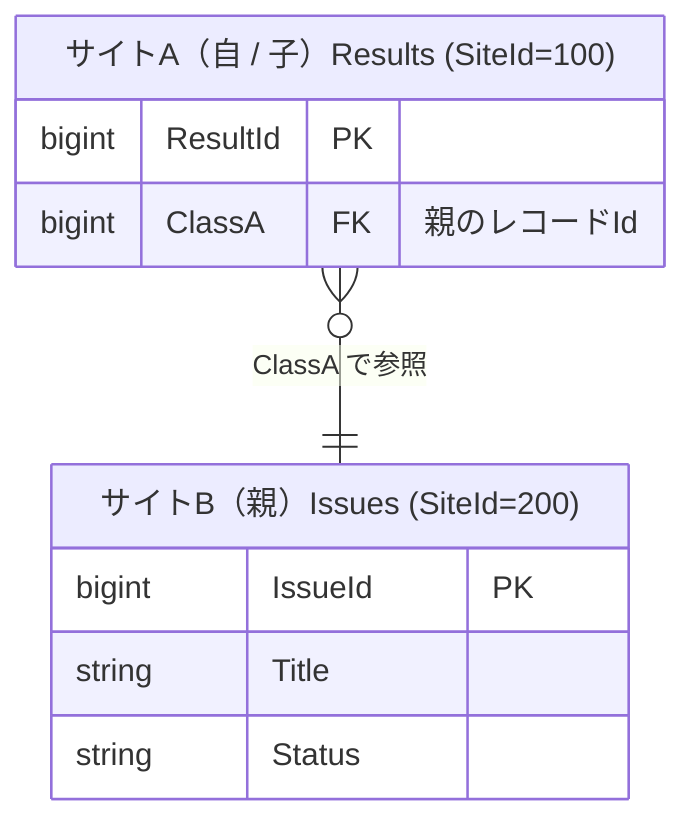
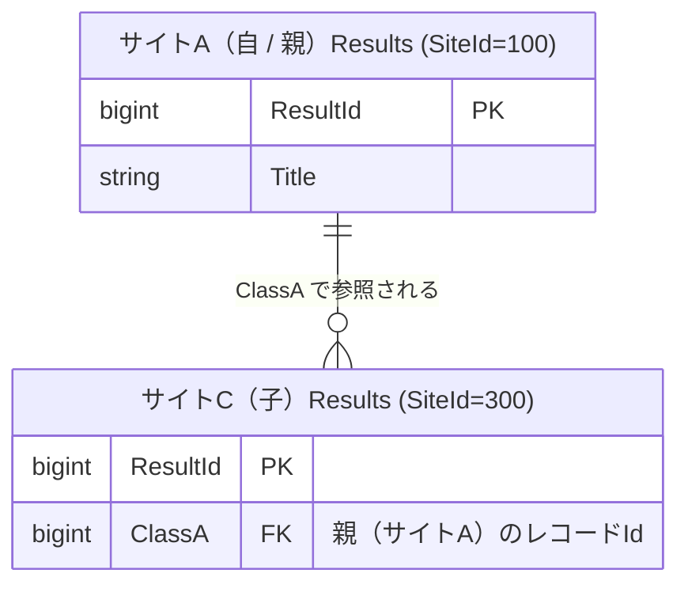
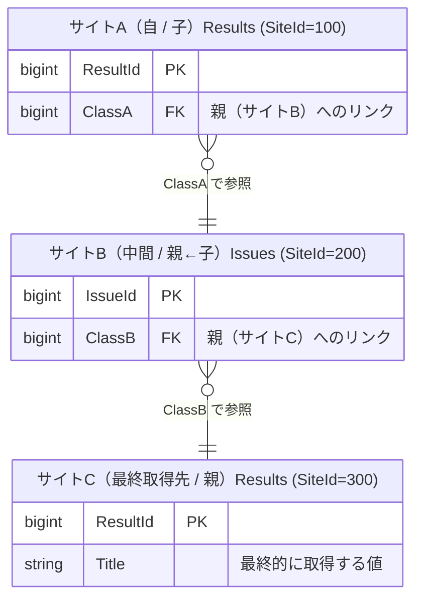
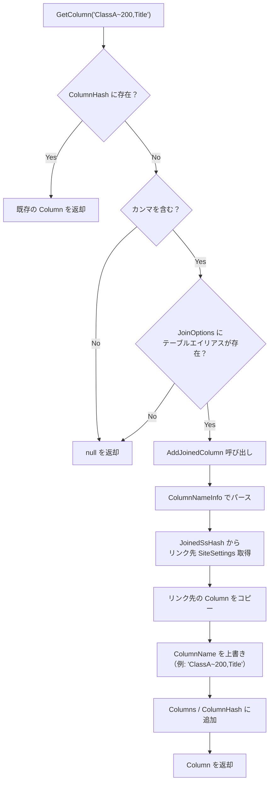
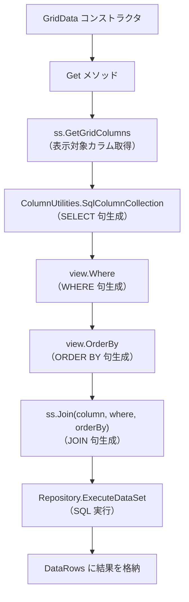
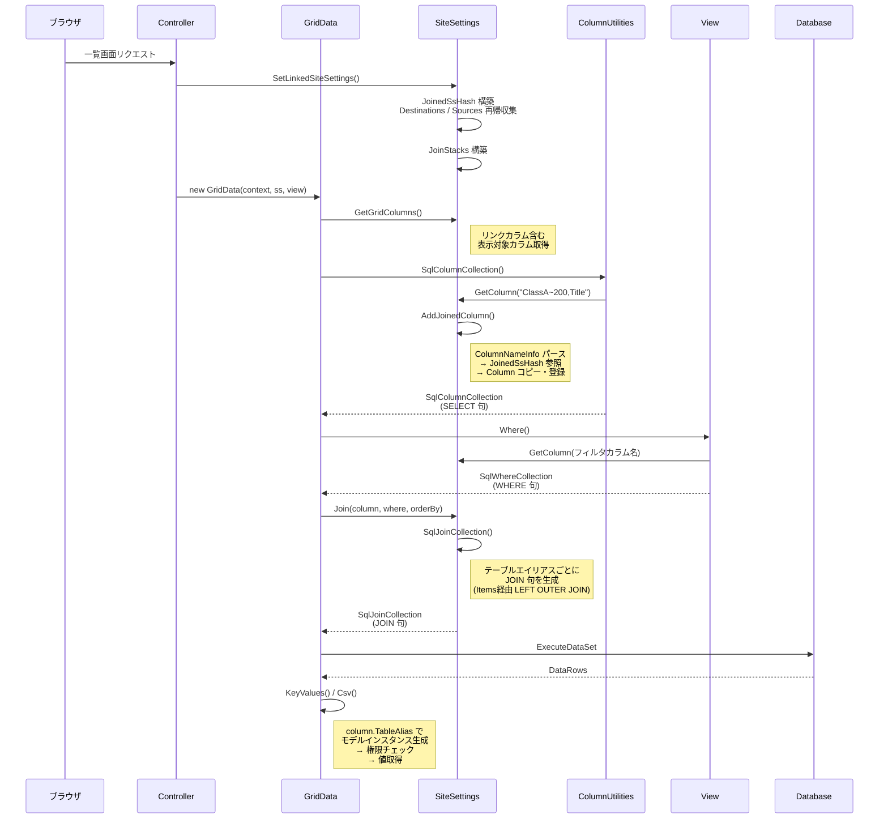

# リンクカラム形式の View モデル・SQL 生成

プリザンターにおけるリンクカラム形式（チルダ構文 `ClassA~1234,ClassB`）が
View モデルでどのように使用され、SQL JOIN 句がどのように生成されるかを調査する。

<!-- START doctoc generated TOC please keep comment here to allow auto update -->
<!-- DON'T EDIT THIS SECTION, INSTEAD RE-RUN doctoc TO UPDATE -->

- [調査情報](#調査情報)
- [調査目的](#調査目的)
- [前提知識](#前提知識)
    - [テーブル間リンクの基本構造](#テーブル間リンクの基本構造)
- [リンクカラム形式（チルダ構文）の命名規則](#リンクカラム形式チルダ構文の命名規則)
    - [構文](#構文)
    - [`~`（チルダ 1 つ）と `~~`（チルダ 2 つ）の違い](#チルダ-1-つと-チルダ-2-つの違い)
- [コア構造: ColumnNameInfo クラス](#コア構造-columnnameinfo-クラス)
    - [パース処理（`Set` メソッド）](#パース処理set-メソッド)
    - [SiteId の抽出（`ColumnUtilities.GetSiteIdByTableAlias`）](#siteid-の抽出columnutilitiesgetsiteidbytablealias)
    - [経路検証（`Exists` メソッド）](#経路検証exists-メソッド)
- [リンク構造の管理](#リンク構造の管理)
    - [テーブル間リンク定義クラス](#テーブル間リンク定義クラス)
    - [JoinedSsHash](#joinedsshash)
    - [JoinStack クラス](#joinstack-クラス)
    - [JoinStack.TableName() — テーブルエイリアスの生成](#joinstacktablename--テーブルエイリアスの生成)
    - [JoinOptions() — UI 表示用ラベルの生成](#joinoptions--ui-表示用ラベルの生成)
- [GetColumn でのリンクカラム解決](#getcolumn-でのリンクカラム解決)
    - [AddJoinedColumn の詳細](#addjoinedcolumn-の詳細)
- [Column クラスのリンクカラム関連プロパティ](#column-クラスのリンクカラム関連プロパティ)
    - [TableName() メソッド](#tablename-メソッド)
    - [SqlColumnWithUpdatedTimeCollection()](#sqlcolumnwithupdatedtimecollection)
- [SQL JOIN 句の生成](#sql-join-句の生成)
    - [エントリポイント: SiteSettings.Join()](#エントリポイント-sitesettingsjoin)
    - [テーブルエイリアスから JOIN 句への変換](#テーブルエイリアスから-join-句への変換)
    - [核心: テーブルエイリアス 1 つ分の JOIN 生成](#核心-テーブルエイリアス-1-つ分の-join-生成)
    - [親テーブル方向（Destinations）の JOIN 生成](#親テーブル方向destinationsの-join-生成)
    - [子テーブル方向（Sources）の JOIN 生成](#子テーブル方向sourcesの-join-生成)
    - [親テーブル方向 vs 子テーブル方向 JOIN 条件の比較](#親テーブル方向-vs-子テーブル方向-join-条件の比較)
    - [多段リンクの JOIN 生成](#多段リンクの-join-生成)
    - [ItemJoin — 自テーブルの Items 結合](#itemjoin--自テーブルの-items-結合)
    - [SqlJoinCollection.BuildCommandText — SQL テキスト生成](#sqljoincollectionbuildcommandtext--sql-テキスト生成)
- [View モデルでのリンクカラムの使われ方](#view-モデルでのリンクカラムの使われ方)
    - [GridData — 一覧画面のデータ取得](#griddata--一覧画面のデータ取得)
- [View.Where でのリンクカラムフィルタ](#viewwhere-でのリンクカラムフィルタ)
- [全体の処理フロー](#全体の処理フロー)
- [まとめ](#まとめ)
- [関連ソースコード](#関連ソースコード)
- [関連ドキュメント](#関連ドキュメント)

<!-- END doctoc generated TOC please keep comment here to allow auto update -->

## 調査情報

| 調査日        | リポジトリ | ブランチ           | タグ/バージョン | コミット     | 備考     |
| ------------- | ---------- | ------------------ | --------------- | ------------ | -------- |
| 2026年2月18日 | Pleasanter | Pleasanter_1.5.1.0 |                 | `34f162a439` | 初回調査 |

## 調査目的

リンクカラム形式（チルダ構文）の内部構造を把握し、
以下を明らかにする。

1. チルダ構文のパース処理と `ColumnNameInfo` の役割
2. `JoinStack` / `JoinedSsHash` によるリンク先テーブルの管理
3. View モデル（`GridData` 等）でのリンクカラムの使われ方
4. SQL JOIN 句の生成ロジック（`SiteSettings.SqlJoinCollection`）

---

## 前提知識

### テーブル間リンクの基本構造

プリザンターでは、あるテーブルの分類カラム（ClassA, ClassB 等）に
別テーブルの SiteId を `[[SiteId]]` 形式で設定することで
テーブル間リンクが確立される。

```text
[サイトA: Results (SiteId=100)]
  └─ ClassA: [[200]]  ← サイトBへのリンク

[サイトB: Issues (SiteId=200)]
  └─ レコード群
```

この時、サイト A の一覧画面でサイト B のカラムを表示するには
**リンクカラム形式**（チルダ構文）を使う。

---

## リンクカラム形式（チルダ構文）の命名規則

### 構文

```text
{テーブルエイリアス},{カラム名}
```

テーブルエイリアスは以下の形式。

| 方向           | パターン               | 例                      |
| -------------- | ---------------------- | ----------------------- |
| 親テーブル方向 | `{カラム名}~{SiteId}`  | `ClassA~200`            |
| 子テーブル方向 | `{カラム名}~~{SiteId}` | `ClassA~~100`           |
| 多段           | `{1段目}-{2段目}`      | `ClassA~200-ClassB~300` |

**具体例**:

| ColumnName                    | 意味                                                      |
| ----------------------------- | --------------------------------------------------------- |
| `ClassA~200,Title`            | ClassA 経由で SiteId=200 の Title を取得                  |
| `ClassA~200,Status`           | ClassA 経由で SiteId=200 の Status を取得                 |
| `ClassA~~100,ClassB`          | ClassA 子テーブル方向リンクで SiteId=100 の ClassB を取得 |
| `ClassA~200-ClassB~300,Title` | 2 段階親テーブル方向リンクを辿って Title を取得           |

### `~`（チルダ 1 つ）と `~~`（チルダ 2 つ）の違い

| 記法 | 方向           | JOIN 条件                                         |
| ---- | -------------- | ------------------------------------------------- |
| `~`  | 親テーブル方向 | 自テーブルの ClassA 値 → Items.ReferenceId        |
| `~~` | 子テーブル方向 | 相手テーブルの ClassA 値 → 自テーブルの Id カラム |

#### 親テーブル参照（Destinations / `~`）の ER 図

自テーブル（子）の分類カラムに親テーブルの SiteId を設定するパターン。
子テーブル側が外部キーを保持する。



- チルダ構文: `ClassA~200,Title`
- 意味: 自テーブル（サイト A）の `ClassA` 値で親テーブル（サイト B）のレコードを特定し、`Title` を取得

#### 子テーブル参照（Sources / `~~`）の ER 図

子テーブルの分類カラムが自テーブル（親）を参照しているパターン。
子テーブル側が外部キーを保持する（逆引き参照）。



- チルダ構文: `ClassA~~300,Title`
- 意味: 子テーブル（サイト C）の `ClassA` が自テーブル（サイト A）のレコードを指しており、その `Title` を取得
- 親テーブル参照との違い: **外部キーの所有者が同じ** — いずれも子テーブルが FK を持つが、親テーブル参照では自テーブルが子、子テーブル参照では相手テーブルが子

#### 多段リンクの ER 図

複数のリンクを `-` で連鎖させるパターン。



- チルダ構文: `ClassA~200-ClassB~300,Title`
- 意味: サイト A → サイト B → サイト C と 2 段階辿って `Title` を取得

#### 多段リンクにおける方向の制約

多段リンクでは、**パス内で親テーブル方向（`~`）と子テーブル方向（`~~`）を混在させることはできない**。

`SiteSettings.SiteSettingsList` の再帰呼び出しで、親方向は親方向のみ・子方向は子方向のみを
再帰的に探索する設計になっているため。

```csharp
// 親方向の再帰: 親方向のみ探索し、子方向は探索しない
ss.SetLinkedSiteSettings(
    ...
    destinations: true,
    sources: false,
    ...);

// 子方向の再帰: 子方向のみ探索し、親方向は探索しない
ss.SetLinkedSiteSettings(
    ...
    destinations: false,
    sources: true,
    ...);
```

**参照**: `Implem.Pleasanter/Libraries/Settings/SiteSettings.cs`（`SiteSettingsList` メソッド内の再帰呼び出し）

| パス例                                       | 方向     | 可否 |
| -------------------------------------------- | -------- | ---- |
| `ClassA~200-ClassB~300`（親方向 → 親方向）   | 同一方向 | 可   |
| `ClassA~~100-ClassB~~200`（子方向 → 子方向） | 同一方向 | 可   |
| `ClassA~200-ClassB~~300`（親方向 → 子方向）  | 方向混在 | 不可 |
| `ClassA~~100-ClassB~200`（子方向 → 親方向）  | 方向混在 | 不可 |

#### 循環参照と深さ制限

##### 循環防止の仕組み

`SiteSettingsList` の再帰探索では、**`previously` リスト**（訪問済みサイト ID のリスト）が
唯一の循環防止メカニズムとして機能する。

```csharp
// 訪問済みサイトを除外
.Where(dataRow => previously?.Contains(dataRow.Long("SiteId")) != true)
```

**参照**: `Implem.Pleasanter/Libraries/Settings/SiteSettings.cs`（`SiteSettingsList` メソッド）

各サイトを処理するたびに `previously.Add(ss.SiteId)` で訪問済みに追加されるため、
同一パス上で同じサイトに戻る循環（A → B → A）は発生しない。

##### 明示的な深さ制限は存在しない

ソースコードを調査した結果、**再帰の深さを制限するカウンタやパラメータは存在しない**。
`Parameters.General` に `LinkDepth` や `MaxJoinDepth` のような設定項目はない。

深さの制約は以下の 2 つの間接的な仕組みのみで実現されている。

| 仕組み                   | 効果                                                   |
| ------------------------ | ------------------------------------------------------ |
| `previously` リスト      | 訪問済みサイトを除外。有限なサイト集合が終了条件になる |
| 方向の固定（前述の制約） | 親方向・子方向を混在できないため、到達可能サイトが限定 |

つまり深さの上限は「同一方向に辿れるリンク先サイトの数」と等しい。

##### `EnableExpandLinkPath` による挙動の違い

`previously` リストの扱いは `enableExpandLinkPath` 設定によって変わる。

```csharp
if (enableExpandLinkPath == true)
{
    previously = previously.Copy();   // ★ コピーして渡す（各分岐が独自の訪問履歴を持つ）
}
// false の場合: 同一リストの参照を共有（兄弟ノード間で影響し合う）
previously.Add(ss.SiteId);
```

| 設定                           | `previously` の扱い    | 効果                                            |
| ------------------------------ | ---------------------- | ----------------------------------------------- |
| `enableExpandLinkPath = false` | 同一リスト参照を共有   | あるサイトへの経路は **1 本のみ**。探索が最小限 |
| `enableExpandLinkPath = true`  | コピーして各分岐に渡す | 同じサイトに **異なる経路** からアクセス可能    |

`enableExpandLinkPath` の有効条件（AND 条件で両方 `true` が必要）:

```csharp
enableExpandLinkPath = enableExpandLinkPath
    ?? (Parameters.General.EnableExpandLinkPath == true
        && EnableExpandLinkPath == true);  // グローバル設定 AND サイト設定
```

**参照**: `Implem.Pleasanter/Libraries/Settings/SiteSettings.cs`（`SetLinkedSiteSettings` メソッド）,
`Implem.ParameterAccessor/Parts/General.cs`（`EnableExpandLinkPath` プロパティ）

デフォルトは `false`（`App_Data/Parameters/General.json`）。

##### チルダ構文で循環参照・深さ制限を突破できるか

**結論: できない。**

チルダ構文のテーブルエイリアスは手動で自由に記述できるが、以下のバリデーションチェーンにより
`SiteSettingsList` が生成した経路以外は拒否される。

```text
GetColumn(columnName)
  → columnName にカンマが含まれるか？
  → JoinOptions() に TableAlias が存在するか？  ← ★ ここで拒否
  → AddJoinedColumn()
    → ColumnNameInfo.Exists() で経路の妥当性を検証
```

`JoinOptions()` は `SiteSettingsList` の再帰で構築された `Destinations` / `Sources`
ツリーから生成されるため、 `previously` で排除された循環パスは `JoinOptions` に含まれない。

| シナリオ                               | 結果                                                        |
| -------------------------------------- | ----------------------------------------------------------- |
| A → B → A（同一サイトへの循環）        | `previously` で B → A の探索がスキップされ、パス未生成      |
| 手動で `ClassA~200-ClassB~100` と記述  | `JoinOptions` に存在しなければ `GetColumn` が `null` を返す |
| `enableExpandLinkPath = true` での循環 | 同一パス上の循環は `previously` で防止。別パスは可          |

---

## コア構造: ColumnNameInfo クラス

**ファイル**: `Implem.Pleasanter/Libraries/Settings/ColumnNameInfo.cs`

チルダ構文のカラム名をパースし、構成要素に分解するクラス。

```csharp
public class ColumnNameInfo
{
    public string ColumnName;   // 元のカラム名（例: "ClassA~200,Title"）
    public string Name;         // 実際のカラム名（例: "Title"）
    public string TableAlias;   // テーブルエイリアス（例: "ClassA~200"）
    public long SiteId;         // リンク先 SiteId（例: 200）
    public bool Joined;         // 結合カラムかどうか
}
```

### パース処理（`Set` メソッド）

```csharp
private void Set(string columnName)
{
    ColumnName = columnName;
    if (columnName.Contains(","))
    {
        Name = columnName.Split(',').Skip(1).Join(string.Empty);
        TableAlias = columnName.Split_1st();
        SiteId = ColumnUtilities.GetSiteIdByTableAlias(TableAlias);
        Joined = true;
    }
    else
    {
        Name = columnName;
    }
}
```

**ポイント**:

- **カンマ区切り**: カンマの有無で結合カラムかどうかを判定
- **`Split_1st()`**: カンマ前のテーブルエイリアス部分を取得
- **`GetSiteIdByTableAlias`**: テーブルエイリアスから SiteId を抽出

### SiteId の抽出（`ColumnUtilities.GetSiteIdByTableAlias`）

```csharp
public static long GetSiteIdByTableAlias(string tableAlias)
{
    return tableAlias.Split('-').Last().Split('~').Last().ToLong();
}
```

テーブルエイリアスの**最後のセグメントの `~` 以降**を SiteId として取得する。

| テーブルエイリアス      | Split('-').Last() | Split('~').Last() | SiteId |
| ----------------------- | ----------------- | ----------------- | ------ |
| `ClassA~200`            | `ClassA~200`      | `200`             | 200    |
| `ClassA~200-ClassB~300` | `ClassB~300`      | `300`             | 300    |
| `ClassA~~100`           | `ClassA~~100`     | `100`             | 100    |

### 経路検証（`Exists` メソッド）

```csharp
public bool Exists(SiteSettings ss,
    Dictionary<long, SiteSettings> joinedSsHash)
{
    if (!ss.ColumnDefinitionHash.ContainsKey(Name)) return false;
    if (!joinedSsHash.ContainsKey(SiteId)) return false;
    foreach (var part in TableAlias.Split('-'))
    {
        var columnName = part.Split('~').First();
        var siteId = part.Split('~').Skip(1).Join(string.Empty);
        if (!siteId.All(char.IsDigit)) return false;
        var currentSs = joinedSsHash.Get(siteId.ToLong());
        if (currentSs == null) return false;
        if (!currentSs.ColumnDefinitionHash.ContainsKey(columnName))
            return false;
    }
    return true;
}
```

テーブルエイリアスの各セグメント（`-` 区切り）について、
参照されるカラムが対応する `SiteSettings` に存在するかを検証する。

---

## リンク構造の管理

### テーブル間リンク定義クラス

**ファイル**: `Implem.Pleasanter/Libraries/Settings/Link.cs`

テーブル間リンクの定義を保持する。

```csharp
public class Link
{
    public string ColumnName;   // リンク元カラム名（例: "ClassA"）
    public long SiteId;         // リンク先 SiteId
    public Lookups Lookups;     // 参照先カラムを自動コピーする設定
    // ...

    public string LinkedTableName()
    {
        return $"{ColumnName}~{SiteId}";
    }
}
```

`LinkedTableName()` はテーブルエイリアスの 1 セグメント分を生成する。

### JoinedSsHash

**ファイル**: `Implem.Pleasanter/Libraries/Settings/SiteSettings.cs`

```csharp
public Dictionary<long, SiteSettings> JoinedSsHash;
```

リンク先テーブルの `SiteSettings` を SiteId で引ける辞書。
`SetLinkedSiteSettings` で初期化され、
親テーブル方向（Destinations）・子テーブル方向（Sources）の両方向のリンク先を再帰的に収集する。

```csharp
public void SetLinkedSiteSettings(
    Context context,
    Dictionary<long, SiteSettings> joinedSsHash = null,
    bool destinations = true,
    bool sources = true, ...)
{
    if (joinedSsHash == null)
    {
        joinedSsHash = new Dictionary<long, SiteSettings>()
        {
            { SiteId, this }  // 自分自身を登録
        };
    }
    JoinedSsHash = joinedSsHash;
    // Destinations / Sources を再帰的に構築
    Destinations = SiteSettingsList(context, "Destinations", ...);
    Sources = SiteSettingsList(context, "Sources", ...);
}
```

### JoinStack クラス

**ファイル**: `Implem.Pleasanter/Libraries/Settings/JoinStack.cs`

リンクの経路（パス）を表現するリンクリスト構造。

```csharp
public class JoinStack
{
    public string Title;           // リンク先テーブルのタイトル
    public long DestinationId;     // 親テーブルの SiteId
    public long SourceId;          // 子テーブルの SiteId
    public string ColumnName;      // リンクカラム名（例: "ClassA"）
    public string Direction;       // "Destinations" or "Sources"
    public JoinStack Next;         // 次のリンク（多段リンク用）
}
```

### JoinStack.TableName() — テーブルエイリアスの生成

```csharp
public string TableName()
{
    switch (Direction)
    {
        case "Destinations":
            return Stacks(this.ToSingleList(), reverce: true)
                .Select(o => $"{o.ColumnName}~{o.DestinationId}")
                .Join("-");
        case "Sources":
            return Stacks(this.ToSingleList(), reverce: true)
                .Select(o => $"{o.ColumnName}~~{o.SourceId}")
                .Join("-");
        default:
            return null;
    }
}
```

**生成例（親テーブル方向）**:

```text
JoinStack: { ColumnName="ClassA", DestinationId=200, Next=null }
→ "ClassA~200"

JoinStack: { ColumnName="ClassA", DestinationId=200,
    Next={ ColumnName="ClassB", DestinationId=300 } }
→ "ClassA~200-ClassB~300"
```

**生成例（子テーブル方向）**:

```text
JoinStack: { ColumnName="ClassA", SourceId=100 }
→ "ClassA~~100"
```

### JoinOptions() — UI 表示用ラベルの生成

**ファイル**: `Implem.Pleasanter/Libraries/Settings/SiteSettings.cs`

```csharp
public Dictionary<string, string> JoinOptions(...)
{
    // Key: テーブルエイリアス
    // Value: 表示名
    ss.JoinStacks.ForEach(joinStack =>
        hash.AddIfNotConainsKey(
            joinStack.TableName(),
            joinStack.DisplayName(currentTitle: Title)));
    // 再帰的に Destinations / Sources を辿る
}
```

`JoinStack.DisplayName()` は以下のような表示名を生成する。

| 方向           | 出力例                            |
| -------------- | --------------------------------- |
| 親テーブル方向 | `[サイトB] -< サイトA`            |
| 子テーブル方向 | `サイトA -< [サイトB]`            |
| 多段親方向     | `[サイトC] -< サイトB -< サイトA` |

---

## GetColumn でのリンクカラム解決

**ファイル**: `Implem.Pleasanter/Libraries/Settings/SiteSettings.cs`

```csharp
public Column GetColumn(Context context, string columnName)
{
    var column = ColumnHash.Get(columnName);
    if (column == null
        && columnName?.Contains(',') == true
        && JoinOptions().ContainsKey(columnName.Split_1st()) == true)
    {
        column = AddJoinedColumn(
            context: context,
            columnName: columnName);
        return column;
    }
    if (column?.SiteSettings?.ColumnDefinitionHash
        ?.ContainsKey(column?.Name ?? string.Empty) != true)
    {
        return null;
    }
    return column;
}
```

**処理フロー**:



### AddJoinedColumn の詳細

```csharp
private Column AddJoinedColumn(Context context, string columnName)
{
    var columnNameInfo = new ColumnNameInfo(columnName);
    var ss = JoinedSsHash.Get(columnNameInfo.SiteId);
    if (!columnNameInfo.Exists(ss: ss, joinedSsHash: JoinedSsHash))
    {
        return null;
    }
    var columnDefinition = ss?.ColumnDefinitionHash
        .Get(columnNameInfo.Name);
    if (columnDefinition != null)
    {
        var column = ss.ColumnHash.Get(columnNameInfo.Name);
        if (column != null)
        {
            var type = column.Type;
            column = column.Copy();
            column.ColumnName = columnName;  // ★ "ClassA~200,Title" に上書き
            UpdateColumn(context, ss, columnDefinition, column, columnNameInfo);
            column.ChoiceHash = ss.ColumnHash
                .Get(columnNameInfo.Name)
                .ChoiceHash
                ?.ToDictionary(o => o.Key, o => o.Value);
            column.Type = type;
            Columns.Add(column);
            ColumnHash.Add(columnName, column);
        }
        return column;
    }
    return null;
}
```

**重要ポイント**:

- リンク先 `SiteSettings` の `ColumnHash` から元のカラム定義をコピー
- `ColumnName` をチルダ構文の完全な名前に上書き
- コピーしたカラムを自テーブルの `Columns` / `ColumnHash` に追加
- 以降の参照では `ColumnHash` から直接取得可能

---

## Column クラスのリンクカラム関連プロパティ

**ファイル**: `Implem.Pleasanter/Libraries/Settings/Column.cs`

| プロパティ     | 型             | 説明                               |
| -------------- | -------------- | ---------------------------------- |
| `ColumnName`   | `string`       | 完全修飾名（`ClassA~200,Title`）   |
| `Name`         | `string`       | カラム名部分のみ（`Title`）        |
| `TableAlias`   | `string`       | テーブルエイリアス（`ClassA~200`） |
| `SiteId`       | `long`         | リンク先 SiteId                    |
| `Joined`       | `bool`         | `true` = 結合カラム                |
| `SiteSettings` | `SiteSettings` | リンク先テーブルの SiteSettings    |

### TableName() メソッド

```csharp
public string TableName()
{
    return Strings.CoalesceEmpty(
        TableAlias, JoinTableName, SiteSettings?.ReferenceType);
}
```

結合カラムの場合は `TableAlias`（例: `ClassA~200`）を返し、
通常カラムの場合は `ReferenceType`（例: `Results`）を返す。

### SqlColumnWithUpdatedTimeCollection()

SQL SELECT 句用のカラム定義を生成する。

```csharp
public SqlColumnCollection SqlColumnWithUpdatedTimeCollection()
{
    var sql = new SqlColumnCollection();
    var tableName = Strings.CoalesceEmpty(
        JoinTableName, SiteSettings.ReferenceType);
    SqlColumnCollection(sql: sql, tableName: tableName);
    sql.Add(
        columnBracket: "\"UpdatedTime\"",
        tableName: Joined ? TableAlias : tableName,
        columnName: "UpdatedTime",
        _as: Joined ? TableAlias + ",UpdatedTime" : null);
    return sql;
}

private void SqlColumnCollection(
    SqlColumnCollection sql, string tableName)
{
    SelectColumns(
        sql: sql,
        tableName: tableName,
        columnName: Name,
        path: Joined ? TableAlias : tableName,
        _as: Joined ? ColumnName : null);
}
```

**ポイント**:

- `Joined == true` の場合、`_as` にチルダ構文のカラム名を設定
  → SQL の `AS` 句で `"ClassA~200,Title"` として結果セットに含まれる
- テーブル参照は `TableAlias`（= `ClassA~200`）を使用
  → SQL JOIN で定義されたエイリアスと一致させる

---

## SQL JOIN 句の生成

### エントリポイント: SiteSettings.Join()

**ファイル**: `Implem.Pleasanter/Libraries/Settings/SiteSettings.cs`

```csharp
public SqlJoinCollection Join(Context context, params IJoin[] join)
{
    return SqlJoinCollection(
        context: context,
        tableNames: join
            .Where(o => o != null)
            .SelectMany(o => o.JoinTableNames())
            .Distinct()
            .ToList());
}
```

**引数の `IJoin[]`**: `SqlColumnCollection`, `SqlWhereCollection`,
`SqlOrderByCollection` が `IJoin` を実装しており、
各要素から必要なテーブルエイリアス名を収集する。

### テーブルエイリアスから JOIN 句への変換

```csharp
public SqlJoinCollection SqlJoinCollection(
    Context context, List<string> tableNames)
{
    var join = new SqlJoinCollection(tableNames
        .Where(o => o != null)
        .Distinct()
        .OrderBy(o => o.Length)      // ★ 短い順に処理（親→子の順序保証）
        .SelectMany(o => SqlJoinCollection(
            context: context, tableAlias: o))
        .GroupBy(o => o.JoinExpression)
        .Select(o => o.First())      // ★ 同一 JOIN 式の重複排除
        .ToArray());
    join.ItemJoin(
        tableName: ReferenceType,
        tableType: TableType);       // ★ Items テーブルとの結合
    return join;
}
```

### 核心: テーブルエイリアス 1 つ分の JOIN 生成

```csharp
private SqlJoinCollection SqlJoinCollection(
    Context context, string tableAlias)
{
    var join = new SqlJoinCollection();
    var left = new List<string>();
    var leftTableName = ReferenceType;
    var leftAlias = ReferenceType;
    var path = new List<string>();
    foreach (var part in tableAlias.Split('-'))
    {
        var siteId = part.Split('~').Last().ToLong();
        var currentSs = JoinedSsHash.Get(siteId);
        var tableName = currentSs?.ReferenceType;
        var name = part.Split_1st('~').RegexFirst("[A-Za-z0-9]+");
        var column = currentSs?.GetColumn(
            context: context, columnName: name);
        if (column == null) continue;
        path.Add(part);
        var alias = path.Join("-");
        if (!tableName.IsNullOrEmpty() && !name.IsNullOrEmpty())
        {
            if (alias.Contains("~~"))
            {
                // ★ 子テーブル方向（Sources）の JOIN
                // ...
            }
            else
            {
                // ★ 親テーブル方向（Destinations）の JOIN
                // ...
            }
            left.Add(part);
            leftTableName = tableName;
            leftAlias = alias;
        }
    }
    return join;
}
```

### 親テーブル方向（Destinations）の JOIN 生成

`ClassA~200` の場合（`~~` を含まない）:

```csharp
// ステップ 1: Items テーブルとの結合
join.Add(
    tableName: "\"Items\"",
    joinType: SqlJoin.JoinTypes.LeftOuter,
    joinExpression:
        $"{TryCast('Results', 'ClassA', column.TypeName, 'bigint')}"
        + $"=\"ClassA~200_Items\".\"ReferenceId\""
        + $" and \"ClassA~200_Items\".\"SiteId\"=200",
    _as: "ClassA~200_Items");

// ステップ 2: 実テーブルとの結合
join.Add(new SqlJoin(
    tableBracket: "\"Issues\"",
    joinType: SqlJoin.JoinTypes.LeftOuter,
    joinExpression:
        $"\"ClassA~200_Items\".\"ReferenceId\""
        + $"=\"ClassA~200\".\"IssueId\"",
    _as: "ClassA~200"));
```

**生成される SQL**:

```sql
-- ステップ 1: Items 経由で ReferenceId を解決
LEFT OUTER JOIN "Items" AS "ClassA~200_Items"
  ON TRY_CAST("Results"."ClassA" AS bigint)
     = "ClassA~200_Items"."ReferenceId"
  AND "ClassA~200_Items"."SiteId" = 200

-- ステップ 2: 実データテーブルとの結合
LEFT OUTER JOIN "Issues" AS "ClassA~200"
  ON "ClassA~200_Items"."ReferenceId"
     = "ClassA~200"."IssueId"
```

### 子テーブル方向（Sources）の JOIN 生成

`ClassA~~100` の場合（`~~` を含む）:

```csharp
// ステップ 1: 実テーブルとの結合
join.Add(new SqlJoin(
    tableBracket: "\"Results\"",
    joinType: SqlJoin.JoinTypes.LeftOuter,
    joinExpression:
        $"\"Results\".\"ResultId\""
        + $"={TryCast('ClassA~~100', 'ClassA', column.TypeName, 'bigint')}"
        + $" and \"ClassA~~100\".\"SiteId\"=100",
    _as: "ClassA~~100"));

// ステップ 2: Items テーブルとの結合
join.Add(
    tableName: "\"Items\"",
    joinType: SqlJoin.JoinTypes.LeftOuter,
    joinExpression:
        $"\"ClassA~~100\".\"ResultId\""
        + $"=\"ClassA~~100_Items\".\"ReferenceId\"",
    _as: "ClassA~~100_Items");
```

**生成される SQL**:

```sql
-- ステップ 1: 子テーブルから逆引き
LEFT OUTER JOIN "Results" AS "ClassA~~100"
  ON "Results"."ResultId"
     = TRY_CAST("ClassA~~100"."ClassA" AS bigint)
  AND "ClassA~~100"."SiteId" = 100

-- ステップ 2: Items テーブル
LEFT OUTER JOIN "Items" AS "ClassA~~100_Items"
  ON "ClassA~~100"."ResultId"
     = "ClassA~~100_Items"."ReferenceId"
```

### 親テーブル方向 vs 子テーブル方向 JOIN 条件の比較

| 方向           | 結合条件の方向                        | 意味                                   |
| -------------- | ------------------------------------- | -------------------------------------- |
| 親テーブル方向 | 自テーブル.ClassA → Items.ReferenceId | 自レコードが保持する ID で相手を参照   |
| 子テーブル方向 | 相手テーブル.ClassA → 自テーブル.Id   | 相手レコードが保持する ID で自分を参照 |

### 多段リンクの JOIN 生成

`ClassA~200-ClassB~300` の場合:

```text
foreach ループ:
  part="ClassA~200" → alias="ClassA~200"
    → Items JOIN + Issues JOIN (leftAlias="Results" → "ClassA~200")
  part="ClassB~300" → alias="ClassA~200-ClassB~300"
    → Items JOIN + Results JOIN (leftAlias="ClassA~200" → "ClassA~200-ClassB~300")
```

```sql
-- 1段目
LEFT OUTER JOIN "Items" AS "ClassA~200_Items"
  ON TRY_CAST("Results"."ClassA" AS bigint)
     = "ClassA~200_Items"."ReferenceId"
  AND "ClassA~200_Items"."SiteId" = 200

LEFT OUTER JOIN "Issues" AS "ClassA~200"
  ON "ClassA~200_Items"."ReferenceId" = "ClassA~200"."IssueId"

-- 2段目
LEFT OUTER JOIN "Items" AS "ClassA~200-ClassB~300_Items"
  ON TRY_CAST("ClassA~200"."ClassB" AS bigint)
     = "ClassA~200-ClassB~300_Items"."ReferenceId"
  AND "ClassA~200-ClassB~300_Items"."SiteId" = 300

LEFT OUTER JOIN "Results" AS "ClassA~200-ClassB~300"
  ON "ClassA~200-ClassB~300_Items"."ReferenceId"
     = "ClassA~200-ClassB~300"."ResultId"
```

### ItemJoin — 自テーブルの Items 結合

```csharp
public static SqlJoinCollection ItemJoin(
    this SqlJoinCollection join,
    Sqls.TableTypes tableType,
    string tableName)
{
    return join.Add(
        tableName: $"\"Items\"",
        joinType: SqlJoin.JoinTypes.Inner,
        joinExpression:
            $"\"{tableName}\".\"{Rds.IdColumn(tableName)}\""
            + $"=\"{tableName}_Items\".\"ReferenceId\""
            + $" and \"{tableName}\".\"SiteId\""
            + $"=\"{tableName}_Items\".\"SiteId\"",
        _as: tableName + "_Items");
}
```

自テーブル自体も `Items` テーブルと `INNER JOIN` される。
これはサイトパーティション（`SiteId` フィルタ）と
`Items.Title` の参照に必要。

### SqlJoinCollection.BuildCommandText — SQL テキスト生成

```csharp
public void BuildCommandText(StringBuilder commandText)
{
    ForEach(sqlFrom =>
    {
        if (sqlFrom.JoinExpression != null)
        {
            switch (sqlFrom.JoinType)
            {
                case SqlJoin.JoinTypes.LeftOuter:
                    commandText.Append("left outer join ");
                    break;
                // ...
            }
        }
        commandText.Append(sqlFrom.TableBracket, " ");
        if (!sqlFrom.As.IsNullOrEmpty())
        {
            commandText.Append("as \"", sqlFrom.As, "\" ");
        }
        if (sqlFrom.JoinExpression != null)
        {
            commandText.Append("on ", sqlFrom.JoinExpression, " ");
        }
    });
}
```

---

## View モデルでのリンクカラムの使われ方

### GridData — 一覧画面のデータ取得

**ファイル**: `Implem.Pleasanter/Libraries/Models/GridData.cs`

#### データ取得フロー



```csharp
private void Get(Context context, SiteSettings ss, View view, ...)
{
    var gridColumns = ss.GetGridColumns(
        context: context, view: view, includedColumns: true);
    column = column ?? ColumnUtilities.SqlColumnCollection(
        context: context, ss: ss, view: view, columns: gridColumns);
    where = view.Where(context: context, ss: ss, where: where);
    var orderBy = view.OrderBy(context: context, ss: ss);
    join = join ?? ss.Join(
        context: context,
        join: new IJoin[] { column, where, orderBy });
    // SQL 実行
}
```

**重要ポイント**:

- `ss.Join()` の引数に `column`, `where`, `orderBy` を全て渡す
- これらから参照される全テーブルエイリアスが収集され、JOIN 句が生成される
- WHERE 句で結合テーブルのカラムをフィルタしている場合も自動的に JOIN が追加される

#### KeyValues — API レスポンス用データ変換

```csharp
public List<Dictionary<string, object>> KeyValues(
    Context context, SiteSettings ss, View view)
{
    foreach (var column in columns)
    {
        var key = column.TableName();
        switch (column.SiteSettings?.ReferenceType)
        {
            case "Issues":
                var issueModel = issues.Get(key);
                if (issueModel == null)
                {
                    issueModel = new IssueModel(
                        context: context,
                        ss: column.SiteSettings,
                        dataRow: dataRow,
                        tableAlias: column.TableAlias);  // ★
                    issues.Add(key, issueModel);
                }
                // 権限チェック
                if (column.ColumnName.Contains("~")
                    && !Permissions.CanRead(context, siteId, id))
                {
                    continue;  // ★ 読取権限なければスキップ
                }
                break;
        }
    }
}
```

**リンクカラムの処理パターン**:

1. **`column.TableName()`** でキーを生成（= `TableAlias`）
2. 同じテーブルエイリアスのカラムはモデルインスタンスを**再利用**
3. **`tableAlias` を指定してモデル生成**
   → DataRow から `"ClassA~200,Title"` 等のカラム名でデータを読み取る
4. **`column.ColumnName.Contains("~")` で結合カラム判定**
   → リンク先レコードの読取権限チェック

#### ColumnUtilities.AddDefaultColumns — 暗黙的カラム追加

```csharp
private static void AddDefaultColumns(
    Context context, SiteSettings ss,
    SiteSettings currentSs, string tableAlias,
    List<Column> columns)
{
    // Id カラム
    columns.Add(GetColumn(context, ss, tableAlias, idColumn));
    // SiteId カラム
    columns.Add(GetColumn(context, ss, tableAlias, "SiteId"));
    // Title カラム（リンク先のタイトル解決用）
    currentSs.Links
        .Where(link => link.SiteId > 0)
        .Where(link => columns.Any(p =>
            (tableAlias.IsNullOrEmpty() ? "" : tableAlias + ",")
            + link.ColumnName == p?.ColumnName))
        .ForEach(link =>
            columns.Add(GetColumn(
                context: context,
                ss: ss,
                tableAlias: (tableAlias.IsNullOrEmpty()
                    ? "" : tableAlias + "-")
                    + link.LinkedTableName(),
                columnName: "Title")));
}
```

**リンク先のさらにリンク先の Title も自動追加される。**
例えば `ClassA~200` テーブルに `ClassB~300` へのリンクがあり、
`ClassA~200,ClassB` が表示対象の場合、
`ClassA~200-ClassB~300,Title` が暗黙的に追加される。

#### Csv / Json エクスポート

CSV・JSON エクスポートでも同じパターンで
`tableAlias` 付きモデル生成 → 各カラム値取得が行われる。

---

## View.Where でのリンクカラムフィルタ

**ファイル**: `Implem.Pleasanter/Libraries/Settings/View.cs`

```csharp
private void SetColumnsWhere(
    Context context, SiteSettings ss,
    SqlWhereCollection where,
    Dictionary<string, string> columnFilterHash, ...)
{
    columnFilterHash?
        .Select(data => new
        {
            Column = ss.GetColumn(
                context: context,
                columnName: data.Key),  // ★ リンクカラムも解決
            // ...
        })
        .Where(o => o.Column != null || ...)
        .ForEach(data => { ... });
}
```

フィルタの `columnFilterHash` のキーにリンクカラム名
（例: `ClassA~200,Status`）が設定されている場合、
`GetColumn` でカラムが解決され、WHERE 句に条件が追加される。

この WHERE 句は `IJoin` インターフェースを実装しており、
参照するテーブルエイリアス名が `JoinTableNames()` で返される。
そのため、`ss.Join()` で自動的に対応する JOIN 句が生成される。

---

## 全体の処理フロー



---

## まとめ

| 観点                 | 内容                                                                               |
| -------------------- | ---------------------------------------------------------------------------------- |
| カラム名の構造       | `{テーブルエイリアス},{カラム名}` — カンマ区切りで結合を表現                       |
| テーブルエイリアス   | `{リンクカラム}~{SiteId}` を `-` で連結した経路表現                                |
| パース               | `ColumnNameInfo` がカンマで分割、`GetSiteIdByTableAlias` で SiteId 抽出            |
| SiteSettings 管理    | `JoinedSsHash`（SiteId → SS 辞書）、`JoinStacks`（経路のリンクリスト）             |
| カラム解決           | `GetColumn` → カンマ含む場合 `AddJoinedColumn` → リンク先 SS からコピー            |
| SQL JOIN 生成        | テーブルエイリアスを `-` で分割し、セグメントごとに Items + 実テーブルの 2 段 JOIN |
| 親 vs 子テーブル方向 | `~`（親方向）: 自値 → Items、`~~`（子方向）: 相手値 → 自 Id                        |
| View モデル          | `TableAlias` でモデルインスタンスをグルーピング、権限チェック付き                  |
| WHERE でのフィルタ   | `GetColumn` でリンクカラム解決 → JOIN は自動追加                                   |

---

## 関連ソースコード

| ファイル                                                      | 概要                                           |
| ------------------------------------------------------------- | ---------------------------------------------- |
| `Implem.Pleasanter/Libraries/Settings/ColumnNameInfo.cs`      | チルダ構文パーサー                             |
| `Implem.Pleasanter/Libraries/Settings/Column.cs`              | カラム定義（TableAlias, Joined, TableName()）  |
| `Implem.Pleasanter/Libraries/Settings/ColumnUtilities.cs`     | SqlColumnCollection 生成、デフォルトカラム追加 |
| `Implem.Pleasanter/Libraries/Settings/SiteSettings.cs`        | GetColumn, AddJoinedColumn, Join, JoinedSsHash |
| `Implem.Pleasanter/Libraries/Settings/JoinStack.cs`           | リンク経路のリンクリスト、TableName() 生成     |
| `Implem.Pleasanter/Libraries/Settings/Link.cs`                | テーブル間リンク定義、LinkedTableName()        |
| `Implem.Pleasanter/Libraries/Settings/View.cs`                | Where, SetColumnsWhere（フィルタ条件生成）     |
| `Implem.Pleasanter/Libraries/Models/GridData.cs`              | 一覧データ取得、KeyValues, Csv, Json           |
| `Implem.Libraries/DataSources/SqlServer/SqlJoin.cs`           | JOIN 句の定義                                  |
| `Implem.Libraries/DataSources/SqlServer/SqlJoinCollection.cs` | JOIN 句コレクション、BuildCommandText          |
| `Implem.Pleasanter/Models/Items/ItemUtilities.cs`             | ItemJoin（自テーブルの Items 結合）            |

## 関連ドキュメント

- [004-通知カスタムフォーマット・プレースホルダ](004-通知カスタムフォーマット・プレースホルダ.md)
