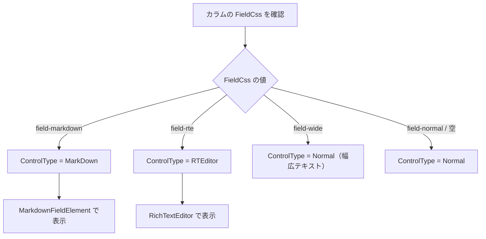

# Markdown 実装

プリザンターにおける Markdown の実装を網羅的に調査した結果をまとめる。サーバーサイド（C#）とクライアントサイド（TypeScript/JavaScript）の両面から、使用ライブラリ・変換フロー・セキュリティ対策・設定項目を整理する。

<!-- START doctoc generated TOC please keep comment here to allow auto update -->
<!-- DON'T EDIT THIS SECTION, INSTEAD RE-RUN doctoc TO UPDATE -->

- [調査情報](#調査情報)
- [調査目的](#調査目的)
- [アーキテクチャ概要](#アーキテクチャ概要)
- [使用ライブラリ](#使用ライブラリ)
    - [クライアントサイド](#クライアントサイド)
    - [サーバーサイド](#サーバーサイド)
- [主要クラス・ファイル一覧](#主要クラスファイル一覧)
    - [サーバーサイド（C# — HTML 構造の生成）](#サーバーサイドc--html-構造の生成)
    - [クライアントサイド（TypeScript — Markdown 変換の実処理）](#クライアントサイドtypescript--markdown-変換の実処理)
- [Markdown 変換フロー](#markdown-変換フロー)
    - [サーバーサイド：HTML 構造の生成](#サーバーサイドhtml-構造の生成)
    - [クライアントサイド：Markdown から HTML への変換](#クライアントサイドmarkdown-から-html-への変換)
- [`[md]` プレフィックスの仕組み](#md-プレフィックスの仕組み)
- [サポート構文](#サポート構文)
    - [`[md]` モード（Markdown フルレンダリング）](#md-モードmarkdown-フルレンダリング)
    - [Notes モード（`[md]` プレフィックスなし）](#notes-モードmd-プレフィックスなし)
    - [特殊リンク処理](#特殊リンク処理)
- [サニタイズ / セキュリティ対策](#サニタイズ--セキュリティ対策)
    - [クライアントサイド](#クライアントサイド-1)
    - [サーバーサイド](#サーバーサイド-1)
- [Markdown が使われる場面](#markdown-が使われる場面)
    - [フィールド / 画面での使用箇所](#フィールド--画面での使用箇所)
    - [ControlType のフロー](#controltype-のフロー)
- [設定項目](#設定項目)
    - [Column クラスの Markdown 関連設定](#column-クラスの-markdown-関連設定)
    - [ViewerSwitchingTypes（ビューア切替モード）](#viewerswitchingtypesビューア切替モード)
    - [data 属性によるクライアント設定](#data-属性によるクライアント設定)
- [コードブロックのシンタックスハイライト](#コードブロックのシンタックスハイライト)
- [画像アップロード](#画像アップロード)
- [結論](#結論)
- [関連ソースコード](#関連ソースコード)

<!-- END doctoc generated TOC please keep comment here to allow auto update -->

## 調査情報

| 調査日        | リポジトリ | ブランチ | タグ/バージョン    | コミット   | 備考     |
| ------------- | ---------- | -------- | ------------------ | ---------- | -------- |
| 2026年2月23日 | Pleasanter | main     | Pleasanter_1.5.1.0 | `34f162a4` | 初回調査 |

## 調査目的

プリザンター上で Markdown がどのように処理されるかを把握し、以下を明確にする。

- Markdown 変換に使用されるライブラリ（サーバー・クライアント双方）
- 変換フローとアーキテクチャ
- サポート構文と非サポート構文
- サニタイズ・セキュリティ対策
- カスタマイズ可能な設定項目

---

## アーキテクチャ概要

プリザンターの Markdown 処理は**クライアントサイド中心**のアーキテクチャである。

```mermaid
sequenceDiagram
    participant Server as サーバーサイド (C#)
    participant Browser as ブラウザ
    participant WC as markdown-field<br>(Web Component)
    participant Marked as marked.js
    participant DOMPurify as DOMPurify

    Server->>Browser: HTML レスポンス<br>（&lt;markdown-field&gt; + &lt;textarea&gt;）
    Browser->>WC: Custom Element 初期化
    WC->>WC: テキスト値を取得
    WC->>Marked: Markdown パース
    Marked-->>WC: HTML 文字列
    WC->>DOMPurify: サニタイズ
    DOMPurify-->>WC: 安全な HTML
    WC->>Browser: innerHTML にセット（プレビュー表示）
```

**重要な特徴**:

- サーバーサイドには Markdig 等の Markdown パーサーライブラリは**含まれていない**
- サーバーは `<markdown-field>` カスタム HTML タグと `<textarea>` を生成するのみ
- Markdown → HTML 変換はすべて**クライアントサイド**（ブラウザ上）で実行される

---

## 使用ライブラリ

### クライアントサイド

| ライブラリ       | 用途                                   | インポート元                               |
| ---------------- | -------------------------------------- | ------------------------------------------ |
| **marked**       | Markdown → HTML 変換                   | `import { Marked } from 'marked'`          |
| **DOMPurify**    | HTML サニタイズ（XSS 対策）            | `import DOMPurify from 'dompurify'`        |
| **highlight.js** | コードブロックのシンタックスハイライト | `import hljs from 'highlight.js'`          |
| **mermaid**      | Mermaid 図のレンダリング（Extension）  | `wwwroot/Extensions/mermaid-11.9.0.min.js` |

### サーバーサイド

**Markdown 変換ライブラリは使用していない。**

`Implem.Pleasanter.csproj` の NuGet パッケージに Markdig やその他の Markdown パーサーは含まれていない。サーバーサイドは HTML 構造の生成のみを担当する。

---

## 主要クラス・ファイル一覧

### サーバーサイド（C# — HTML 構造の生成）

| クラス / メソッド            | ファイルパス                                            | 役割                                                                    |
| ---------------------------- | ------------------------------------------------------- | ----------------------------------------------------------------------- |
| `HtmlTags.MarkdownField()`   | `Implem.Pleasanter/Libraries/HtmlParts/HtmlTags.cs`     | `<markdown-field>` カスタムタグを出力                                   |
| `HtmlControls.MarkDown()`    | `Implem.Pleasanter/Libraries/HtmlParts/HtmlControls.cs` | Markdown フィールドの `<textarea>` と属性を組み立て                     |
| `HtmlFields.FieldMarkDown()` | `Implem.Pleasanter/Libraries/HtmlParts/HtmlFields.cs`   | ラベル付き Markdown フィールドをレンダリング                            |
| `HtmlComments`               | `Implem.Pleasanter/Libraries/HtmlParts/HtmlComments.cs` | コメント欄の Markdown フィールド生成                                    |
| `HtmlGuides`                 | `Implem.Pleasanter/Libraries/HtmlParts/HtmlGuides.cs`   | ガイド（説明文）の Markdown 表示                                        |
| `Column`                     | `Implem.Pleasanter/Libraries/Settings/Column.cs`        | `FieldCss`, `ControlType`, `ViewerSwitchingType`, `AllowImage` 等の設定 |
| 各モデル `*Utilities.cs`     | `Implem.Pleasanter/Models/*/`                           | Body フィールドの `ControlType` を `"MarkDown"` に設定                  |

### クライアントサイド（TypeScript — Markdown 変換の実処理）

| クラス / ファイル      | パス                                                                                     | 役割                                                                                  |
| ---------------------- | ---------------------------------------------------------------------------------------- | ------------------------------------------------------------------------------------- |
| `MarkdownFieldElement` | `Implem.PleasanterFrontend/wwwroot/src/scripts/modules/markdownField/markdownField.ts`   | **中核**: Web Component として `<markdown-field>` を定義し、Markdown 変換・表示を担当 |
| `markdownField.scss`   | `Implem.PleasanterFrontend/wwwroot/src/scripts/modules/markdownField/markdownField.scss` | Markdown フィールドのスタイル定義                                                     |

---

## Markdown 変換フロー

### サーバーサイド：HTML 構造の生成

サーバーサイドでは、Markdown の変換は行わず、HTML の骨格を生成する。

**ファイル**: `Implem.Pleasanter/Libraries/HtmlParts/HtmlTags.cs`（行番号: 834-848）

```csharp
public static HtmlBuilder MarkdownField(
    this HtmlBuilder hb,
    HtmlAttributes attributes = null,
    string text = null,
    bool _using = true,
    Action action = null)
{
    return _using
        ? hb.Append(
            tag: "markdown-field",
            attributes: (attributes ?? new HtmlAttributes()),
            action: action)
        : hb;
}
```

`HtmlControls.MarkDown()` メソッドが `MarkdownField()` を呼び出し、内部に `<textarea>` を配置する。

**ファイル**: `Implem.Pleasanter/Libraries/HtmlParts/HtmlControls.cs`（行番号: 273-340）

```csharp
public static HtmlBuilder MarkDown(
    this HtmlBuilder hb,
    Context context,
    SiteSettings ss,
    string controlId = null,
    string controlCss = null,
    string text = null,
    // ... 省略
    Action action = null)
{
    // ...
    hb.MarkdownField(
        action: () => {
            action?.Invoke();
            hb.TextArea(
                // ...
                attributes: new HtmlAttributes()
                    .Id(controlId)
                    .Name(controlId)
                    .Class(Css.Class("control-markdown" + ...))
                    .DataViewerType(viewerTypesValue)
                    .DataComment(comment)
                    .DataReadOnly(readOnly)
                    // ...
            );
        }
    );
    return hb;
}
```

生成される HTML の基本構造:

```html
<markdown-field>
    <textarea id="Body" class="control-markdown upload-image" data-viewer-type="auto" data-enablelightbox="1">
    (Markdownテキスト)
  </textarea
    >
</markdown-field>
```

### クライアントサイド：Markdown から HTML への変換

`MarkdownFieldElement` クラスが Web Component として `<markdown-field>` を定義し、以下の処理を行う。

**ファイル**: `Implem.PleasanterFrontend/wwwroot/src/scripts/modules/markdownField/markdownField.ts`

#### 1. marked.js の初期化（行番号: 155-168）

```typescript
private viewerMarked? = new Marked({
    gfm: true,
    breaks: true,
    renderer: {
        html: token => this.escapeHtml(token.text),
        link: token => this.mdRenderLink(token),
        image: token => this.mdRenderImage(token),
        code: token => this.mdRenderCode(token)
    }
});
```

- **GFM（GitHub Flavored Markdown）** が有効
- **改行の自動変換**（`breaks: true`）が有効
- `html` レンダラーは HTML タグをエスケープ（生 HTML は無効化）
- カスタムレンダラーでリンク・画像・コードブロックの出力をカスタマイズ

#### 2. 表示モード切替と `[md]` プレフィックス（行番号: 305-322）

```typescript
public showViewer() {
    if (this.controller.value || this.isReadonly || this.isComment) {
        let md = this.controller.value;
        md = this.encodeCustomSchemeLink(md);
        if (md.indexOf('[md]') === 0) {
            md = md.split('\n').slice(1).join('\n');
            md = String(this.viewerMarked!.parse(md));
        } else {
            const tokens = this.viewerMarked?.lexer(this.escapeMarkdown(md));
            md = tokens!.map(token => this.notesRender(token)).join('');
            md = `<div class="notes">${md}<br></div>`;
        }
        md = this.createCustomSchemeLink(md);
        md = md.replace(/&amp;#(\d+);/g, '&#$1;');
        md = DOMPurify.sanitize(md, {
            ADD_ATTR: ['target']
        });
        this.viewerElem!.innerHTML = md;
        this.finalizeViewerDom();
    }
}
```

**2 つのレンダリングモード**:

| モード                         | 条件                       | 処理                                                                      |
| ------------------------------ | -------------------------- | ------------------------------------------------------------------------- |
| **Markdown モード**            | テキストが `[md]` で始まる | 2行目以降を `marked.parse()` で完全な Markdown として変換                 |
| **Notes モード**（デフォルト） | `[md]` プレフィックスなし  | Markdown 構文をエスケープした上で簡易レンダリング（リンク・画像のみ処理） |

---

## `[md]` プレフィックスの仕組み

プリザンターでは、テキストフィールドの先頭に `[md]` と記述することで、Markdown のフルレンダリングが有効になる。

| 入力テキスト                       | レンダリング結果                       |
| ---------------------------------- | -------------------------------------- |
| `通常のテキスト`                   | プレーンテキスト表示（リンクのみ処理） |
| `[md]`<br>`# 見出し`<br>`**太字**` | Markdown として変換・表示              |

`[md]` がない場合は「Notes モード」となり、Markdown 構文文字（`#`, `*`, `_`, `` ` `` 等）はエスケープされるため、Markdown として解釈されない。

---

## サポート構文

### `[md]` モード（Markdown フルレンダリング）

`marked.js` の GFM モードが有効なため、以下の構文がサポートされる。

| 構文                              | サポート | 備考                                          |
| --------------------------------- | :------: | --------------------------------------------- |
| 見出し (`#`, `##`, ...)           |   Yes    |                                               |
| 太字・斜体 (`**`, `*`, `__`, `_`) |   Yes    |                                               |
| 取り消し線 (`~~`)                 |   Yes    | GFM                                           |
| リンク (`[text](url)`)            |   Yes    | カスタムレンダラーで処理                      |
| 画像 (``)              |   Yes    | サムネイル表示（`?thumbnail=1`）              |
| コードブロック (` ``` `)          |   Yes    | highlight.js によるシンタックスハイライト付き |
| インラインコード (`` ` ``)        |   Yes    |                                               |
| 箇条書き（番号なし）              |   Yes    |                                               |
| 箇条書き（番号付き）              |   Yes    |                                               |
| テーブル                          |   Yes    | GFM                                           |
| 引用 (`>`)                        |   Yes    |                                               |
| 水平線 (`---`)                    |   Yes    |                                               |
| タスクリスト (`- [ ]`, `- [x]`)   |   Yes    | GFM                                           |
| 改行（通常の改行）                |   Yes    | `breaks: true` 設定により                     |
| **生の HTML**                     |  **No**  | `html` レンダラーでエスケープ                 |

### Notes モード（`[md]` プレフィックスなし）

| 構文                        | サポート | 備考                                  |
| --------------------------- | :------: | ------------------------------------- |
| リンク (`[text](url)`)      |   Yes    |                                       |
| 画像 (``)        |   Yes    |                                       |
| UNC パス (`\\server\share`) |   Yes    | `file://` リンクに変換                |
| Notes リンク (`notes://`)   |   Yes    | IBM Notes プロトコル                  |
| その他の Markdown 構文      |  **No**  | `escapeMarkdown()` でエスケープされる |

### 特殊リンク処理

`MarkdownFieldElement` は以下の特殊なリンク形式を処理する。

| リンク形式                       | 処理                                        |
| -------------------------------- | ------------------------------------------- |
| UNC パス (`\\server\share\path`) | `file://` スキームに変換して `<a>` タグ生成 |
| Notes リンク (`notes://xxx`)     | そのまま `<a>` タグ生成                     |
| 通常の URL                       | 標準的な `<a href="...">` を生成            |

---

## サニタイズ / セキュリティ対策

### クライアントサイド

プリザンターの Markdown 処理には**多層のセキュリティ対策**がある。

#### 1. HTML タグの無効化（marked.js レンダラー）

```typescript
renderer: {
    html: token => this.escapeHtml(token.text),
}
```

`marked.js` の `html` レンダラーをオーバーライドし、HTML タグは `escapeHtml()` でエスケープされる。これにより Markdown 内の生 HTML（`<script>` 等）は無害化される。

#### 2. `escapeHtml()` によるエスケープ

```typescript
private escapeHtml(str: string): string {
    return str
        .replace(/&/g, '&amp;')
        .replace(/</g, '&lt;')
        .replace(/>/g, '&gt;')
        .replace(/"/g, '&quot;')
        .replace(/'/g, '&apos;');
}
```

#### 3. DOMPurify による最終サニタイズ

```typescript
md = DOMPurify.sanitize(md, {
    ADD_ATTR: ['target'],
});
```

`marked.js` の出力に対して `DOMPurify.sanitize()` を適用。`target` 属性のみ追加許可。

#### 4. Notes モードの `escapeMarkdown()`

Notes モード（`[md]` なし）では、Markdown 構文文字を事前にエスケープすることで、意図しない HTML 変換を防止する。

#### 5. `finalizeViewerDom()` による後処理

コードブロック内のリンクをテキストノードに置換し、コードブロック内でリンクが有効にならないようにする。

### サーバーサイド

| 対策                         | 内容                                                                          |
| ---------------------------- | ----------------------------------------------------------------------------- |
| X-XSS-Protection ヘッダー    | `Startup.cs` で `X-Xss-Protection: 1; mode=block` を設定                      |
| サーバー側 Markdown 変換なし | サーバーは Markdown を HTML に変換しないため、サーバー側での XSS リスクは低い |

---

## Markdown が使われる場面

### フィールド / 画面での使用箇所

| 使用箇所                 | 説明                                               | ControlType                                        |
| ------------------------ | -------------------------------------------------- | -------------------------------------------------- |
| **Body フィールド**      | Issues / Results / Wiki のメインテキスト           | `FieldCss == "field-markdown"` の場合 `"MarkDown"` |
| **Description 型カラム** | カスタムの説明フィールド                           | `FieldCss` の設定次第                              |
| **コメント欄**           | レコードのコメント入力                             | `control-markdown` クラス                          |
| **ガイド（説明文）**     | `GridGuide` / `EditorGuide` / `CalendarGuide` 等   | `HtmlGuides` で Markdown フィールドとして表示      |
| **サイト設定の各種説明** | `AddressBook`, `MailToDefault`, `MailCcDefault` 等 | `FieldMarkDown()` で表示                           |
| **TitleBody**            | タイトルと本文の複合表示                           | `ControlType` が `"MarkDown"` or `"RTEditor"`      |
| **ダッシュボード**       | ダッシュボードのカスタムコンテンツ                 | `.MarkDown()` で表示                               |

### ControlType のフロー

エディタタイプの決定ロジック:



---

## 設定項目

### Column クラスの Markdown 関連設定

**ファイル**: `Implem.Pleasanter/Libraries/Settings/Column.cs`

| プロパティ            | 型                      | 説明                                                                        |
| --------------------- | ----------------------- | --------------------------------------------------------------------------- |
| `FieldCss`            | `string`                | `"field-markdown"` で Markdown モード、`"field-rte"` でリッチテキストモード |
| `ControlType`         | `string`                | `"MarkDown"` / `"RTEditor"` / `"Normal"` 等                                 |
| `ViewerSwitchingType` | `ViewerSwitchingTypes?` | ビューア切替の動作モード                                                    |
| `AllowImage`          | `bool?`                 | 画像アップロードの許可                                                      |

### ViewerSwitchingTypes（ビューア切替モード）

**ファイル**: `Implem.Pleasanter/Libraries/Settings/Column.cs`（行番号: 31-35）

```csharp
public enum ViewerSwitchingTypes
{
    Auto = 1,
    Manual = 2,
    Disabled = 3
}
```

| 値         | 動作                                                       |
| ---------- | ---------------------------------------------------------- |
| `Auto`     | エディタからフォーカスが外れると自動でプレビュー表示に切替 |
| `Manual`   | ビューア切替ボタンをクリックして手動で切替                 |
| `Disabled` | プレビュー表示を無効化し、常にエディタ表示                 |

### data 属性によるクライアント設定

サーバーが `<textarea>` に付与する data 属性:

| data 属性                  | 説明                                                      |
| -------------------------- | --------------------------------------------------------- |
| `data-viewer-type`         | `"auto"` / `"manual"` / `"disabled"` — ビューア切替モード |
| `data-readonly`            | 読み取り専用フラグ                                        |
| `data-comment`             | コメント欄フラグ                                          |
| `data-camera-disabled`     | カメラ（写真撮影）の無効化                                |
| `data-enablelightbox`      | 画像のライトボックス表示の有効/無効                       |
| `data-validate-max-length` | 最大文字数バリデーション                                  |
| `data-validate-required`   | 必須入力バリデーション                                    |
| `data-validate-regex`      | 正規表現バリデーション                                    |

---

## コードブロックのシンタックスハイライト

`markdownField.ts` の `mdRenderCode()` メソッドで highlight.js を使用。

```typescript
private mdRenderCode = (token: Tokens.Code) => {
    const lang = (token.lang || '').trim();
    let highlighted: string;
    if (lang && hljs.getLanguage(lang)) {
        highlighted = hljs.highlight(token.text, { language: lang }).value;
    } else {
        highlighted = hljs.highlightAuto(token.text).value;
    }
    // コピーボタン付きのコードブロック HTML を生成
};
```

- 言語指定があれば指定言語でハイライト
- 言語指定がなければ自動検出（`highlightAuto`）
- コピーボタンが付与される

---

## 画像アップロード

Markdown フィールドでは、以下の方法で画像を挿入できる。

| 方法                   | 説明                                                          |
| ---------------------- | ------------------------------------------------------------- |
| ファイル選択ボタン     | ファイルダイアログから画像選択                                |
| クリップボード貼り付け | `Ctrl+V` で画像を直接貼り付け                                 |
| カメラ撮影             | モバイルカメラで撮影（`EnableMobileCamera` パラメータで制御） |

許可される画像形式:

```typescript
static ALLOWED_IMAGE_TYPES = ['image/jpeg', 'image/png', 'image/gif', 'image/webp', 'image/bmp'];
```

画像は `binaries/uploadimage` または `formbinaries/uploadimage` エンドポイントにアップロードされ、Markdown の `` 形式でテキストに挿入される。

表示時には URL に `?thumbnail=1` パラメータが付与され、サムネイル画像が表示される。

---

## 結論

| 項目                     | 内容                                                                    |
| ------------------------ | ----------------------------------------------------------------------- |
| アーキテクチャ           | **クライアントサイドレンダリング**（サーバーは HTML 構造のみ生成）      |
| Markdown パーサー        | **marked.js**（クライアントサイド）                                     |
| サニタイズ               | **DOMPurify** + HTML タグエスケープ + `escapeMarkdown()`                |
| コードハイライト         | **highlight.js**                                                        |
| UI コンポーネント        | **`<markdown-field>` Web Component**（Custom Elements）                 |
| サーバーサイドライブラリ | なし（Markdig 等は未使用）                                              |
| デフォルトモード         | Notes モード（`[md]` プレフィックスで Markdown フルレンダリング有効化） |
| GFM サポート             | あり（テーブル、取消線、タスクリスト対応）                              |
| 生 HTML サポート         | なし（セキュリティのためエスケープ）                                    |
| 画像サポート             | あり（アップロード・貼り付け・カメラ撮影対応、`AllowImage` 設定で制御） |
| ビューア切替             | Auto / Manual / Disabled の 3 モード                                    |

---

## 関連ソースコード

| ファイル                                                                                 | 説明                                                          |
| ---------------------------------------------------------------------------------------- | ------------------------------------------------------------- |
| `Implem.PleasanterFrontend/wwwroot/src/scripts/modules/markdownField/markdownField.ts`   | Markdown Web Component（中核コード）                          |
| `Implem.PleasanterFrontend/wwwroot/src/scripts/modules/markdownField/markdownField.scss` | スタイル定義                                                  |
| `Implem.Pleasanter/Libraries/HtmlParts/HtmlControls.cs`                                  | サーバーサイドの Markdown コントロール生成                    |
| `Implem.Pleasanter/Libraries/HtmlParts/HtmlTags.cs`                                      | `<markdown-field>` タグ出力                                   |
| `Implem.Pleasanter/Libraries/HtmlParts/HtmlFields.cs`                                    | `FieldMarkDown()` フィールド生成                              |
| `Implem.Pleasanter/Libraries/HtmlParts/HtmlComments.cs`                                  | コメント欄の Markdown                                         |
| `Implem.Pleasanter/Libraries/HtmlParts/HtmlGuides.cs`                                    | ガイド表示の Markdown                                         |
| `Implem.Pleasanter/Libraries/Settings/Column.cs`                                         | カラム設定（`ViewerSwitchingType`, `AllowImage`, `FieldCss`） |
| `Implem.Pleasanter/Implem.Pleasanter.csproj`                                             | NuGet 依存関係（Markdown ライブラリなし）                     |
| `Implem.Pleasanter/Startup.cs`                                                           | X-XSS-Protection ヘッダー設定                                 |
