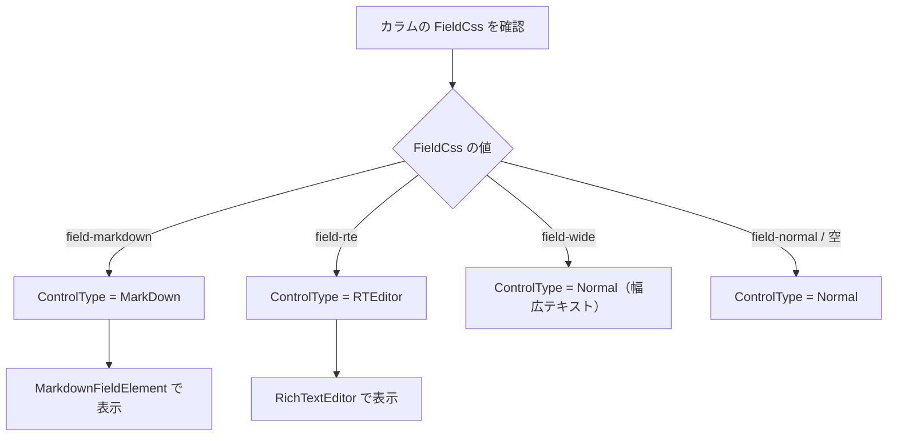

# Markdown 実装

プリザンターにおける Markdown の実装を網羅的に調査した結果をまとめる。サーバーサイド（C#）とクライアントサイド（TypeScript/JavaScript）の両面から、使用ライブラリ・変換フロー・セキュリティ対策・設定項目を整理する。

<!-- START doctoc generated TOC please keep comment here to allow auto update -->
<!-- DON'T EDIT THIS SECTION, INSTEAD RE-RUN doctoc TO UPDATE -->

- [調査情報](#調査情報)
- [調査目的](#調査目的)
- [アーキテクチャ概要](#アーキテクチャ概要)
- [使用ライブラリ](#使用ライブラリ)
    - [クライアントサイド](#クライアントサイド)
    - [サーバーサイド](#サーバーサイド)
- [主要クラス・ファイル一覧](#主要クラスファイル一覧)
    - [サーバーサイド（C# — HTML 構造の生成）](#サーバーサイドc--html-構造の生成)
    - [クライアントサイド（TypeScript — Markdown 変換の実処理）](#クライアントサイドtypescript--markdown-変換の実処理)
- [Markdown 変換フロー](#markdown-変換フロー)
    - [サーバーサイド：HTML 構造の生成](#サーバーサイドhtml-構造の生成)
    - [クライアントサイド：Markdown から HTML への変換](#クライアントサイドmarkdown-から-html-への変換)
- [`[md]` プレフィックスの仕組み](#md-プレフィックスの仕組み)
- [サポート構文](#サポート構文)
    - [`[md]` モード（Markdown フルレンダリング）](#md-モードmarkdown-フルレンダリング)
    - [Notes モード（`[md]` プレフィックスなし）](#notes-モードmd-プレフィックスなし)
    - [特殊リンク処理](#特殊リンク処理)
- [サニタイズ / セキュリティ対策](#サニタイズ--セキュリティ対策)
    - [クライアントサイド](#クライアントサイド-1)
    - [サーバーサイド](#サーバーサイド-1)
- [Markdown が使われる場面](#markdown-が使われる場面)
    - [フィールド / 画面での使用箇所](#フィールド--画面での使用箇所)
    - [ControlType のフロー](#controltype-のフロー)
- [設定項目](#設定項目)
    - [Column クラスの Markdown 関連設定](#column-クラスの-markdown-関連設定)
    - [ViewerSwitchingTypes（ビューア切替モード）](#viewerswitchingtypesビューア切替モード)
    - [data 属性によるクライアント設定](#data-属性によるクライアント設定)
- [コードブロックのシンタックスハイライト](#コードブロックのシンタックスハイライト)
    - [ライブラリ情報](#ライブラリ情報)
    - [インポート方式と対応言語](#インポート方式と対応言語)
    - [レンダリングフロー](#レンダリングフロー)
    - [生成される HTML 構造](#生成される-html-構造)
    - [コードコピー機能](#コードコピー機能)
    - [スタイル定義](#スタイル定義)
    - [Notes モードでの扱い](#notes-モードでの扱い)
- [画像アップロード](#画像アップロード)
- [Markdown 機能比較（別ドキュメント）](#markdown-機能比較別ドキュメント)
- [Mermaid.js 対応の詳細調査](#mermaidjs-対応の詳細調査)
    - [Mermaid.js の配置場所](#mermaidjs-の配置場所)
    - [Mermaid.js の実際の利用箇所](#mermaidjs-の実際の利用箇所)
    - [サーバーサイドの Mermaid テキスト生成](#サーバーサイドの-mermaid-テキスト生成)
    - [PleasanterExtensions パラメータ](#pleasanterextensions-パラメータ)
    - [Markdown フィールドとの関係](#markdown-フィールドとの関係)
    - [アーキテクチャ図](#アーキテクチャ図)
    - [結論（Mermaid 対応）](#結論mermaid-対応)
- [結論](#結論)
- [関連ソースコード](#関連ソースコード)

<!-- END doctoc generated TOC please keep comment here to allow auto update -->

## 調査情報

| 調査日        | リポジトリ | ブランチ | タグ/バージョン    | コミット   | 備考     |
| ------------- | ---------- | -------- | ------------------ | ---------- | -------- |
| 2026年2月23日 | Pleasanter | main     | Pleasanter_1.5.1.0 | `34f162a4` | 初回調査 |

## 調査目的

プリザンター上で Markdown がどのように処理されるかを把握し、以下を明確にする。

- Markdown 変換に使用されるライブラリ（サーバー・クライアント双方）
- 変換フローとアーキテクチャ
- サポート構文と非サポート構文
- サニタイズ・セキュリティ対策
- カスタマイズ可能な設定項目

---

## アーキテクチャ概要

プリザンターの Markdown 処理は**クライアントサイド中心**のアーキテクチャである。

```mermaid
sequenceDiagram
    participant Server as サーバーサイド (C#)
    participant Browser as ブラウザ
    participant WC as markdown-field<br>(Web Component)
    participant Marked as marked.js
    participant DOMPurify as DOMPurify

    Server->>Browser: HTML レスポンス<br>（&lt;markdown-field&gt; + &lt;textarea&gt;）
    Browser->>WC: Custom Element 初期化
    WC->>WC: テキスト値を取得
    WC->>Marked: Markdown パース
    Marked-->>WC: HTML 文字列
    WC->>DOMPurify: サニタイズ
    DOMPurify-->>WC: 安全な HTML
    WC->>Browser: innerHTML にセット（プレビュー表示）
```

**重要な特徴**:

- サーバーサイドには Markdig 等の Markdown パーサーライブラリは**含まれていない**
- サーバーは `<markdown-field>` カスタム HTML タグと `<textarea>` を生成するのみ
- Markdown → HTML 変換はすべて**クライアントサイド**（ブラウザ上）で実行される

---

## 使用ライブラリ

### クライアントサイド

| ライブラリ       | 用途                                   | インポート元                        |
| ---------------- | -------------------------------------- | ----------------------------------- |
| **marked**       | Markdown → HTML 変換                   | `import { Marked } from 'marked'`   |
| **DOMPurify**    | HTML サニタイズ（XSS 対策）            | `import DOMPurify from 'dompurify'` |
| **highlight.js** | コードブロックのシンタックスハイライト | `import hljs from 'highlight.js'`   |

> **補足**: `wwwroot/Extensions/mermaid-11.9.0.min.js`（Mermaid.js v11.9.0）が配置されているが、
> これは Site Visualizer（サイト設定可視化ツール）の ER 図描画専用であり、
> Markdown フィールドの `markdownField.ts` からは参照・使用されていない。
> 詳細は「[Mermaid.js 対応の詳細調査](#mermaidjs-対応の詳細調査)」を参照。

### サーバーサイド

**Markdown 変換ライブラリは使用していない。**

`Implem.Pleasanter.csproj` の NuGet パッケージに Markdig やその他の Markdown パーサーは含まれていない。サーバーサイドは HTML 構造の生成のみを担当する。

---

## 主要クラス・ファイル一覧

### サーバーサイド（C# — HTML 構造の生成）

| クラス / メソッド            | ファイルパス                                            | 役割                                                                    |
| ---------------------------- | ------------------------------------------------------- | ----------------------------------------------------------------------- |
| `HtmlTags.MarkdownField()`   | `Implem.Pleasanter/Libraries/HtmlParts/HtmlTags.cs`     | `<markdown-field>` カスタムタグを出力                                   |
| `HtmlControls.MarkDown()`    | `Implem.Pleasanter/Libraries/HtmlParts/HtmlControls.cs` | Markdown フィールドの `<textarea>` と属性を組み立て                     |
| `HtmlFields.FieldMarkDown()` | `Implem.Pleasanter/Libraries/HtmlParts/HtmlFields.cs`   | ラベル付き Markdown フィールドをレンダリング                            |
| `HtmlComments`               | `Implem.Pleasanter/Libraries/HtmlParts/HtmlComments.cs` | コメント欄の Markdown フィールド生成                                    |
| `HtmlGuides`                 | `Implem.Pleasanter/Libraries/HtmlParts/HtmlGuides.cs`   | ガイド（説明文）の Markdown 表示                                        |
| `Column`                     | `Implem.Pleasanter/Libraries/Settings/Column.cs`        | `FieldCss`, `ControlType`, `ViewerSwitchingType`, `AllowImage` 等の設定 |
| 各モデル `*Utilities.cs`     | `Implem.Pleasanter/Models/*/`                           | Body フィールドの `ControlType` を `"MarkDown"` に設定                  |

### クライアントサイド（TypeScript — Markdown 変換の実処理）

| クラス / ファイル      | パス                                                                                     | 役割                                                                                  |
| ---------------------- | ---------------------------------------------------------------------------------------- | ------------------------------------------------------------------------------------- |
| `MarkdownFieldElement` | `Implem.PleasanterFrontend/wwwroot/src/scripts/modules/markdownField/markdownField.ts`   | **中核**: Web Component として `<markdown-field>` を定義し、Markdown 変換・表示を担当 |
| `markdownField.scss`   | `Implem.PleasanterFrontend/wwwroot/src/scripts/modules/markdownField/markdownField.scss` | Markdown フィールドのスタイル定義                                                     |

---

## Markdown 変換フロー

### サーバーサイド：HTML 構造の生成

サーバーサイドでは、Markdown の変換は行わず、HTML の骨格を生成する。

**ファイル**: `Implem.Pleasanter/Libraries/HtmlParts/HtmlTags.cs`（行番号: 834-848）

```csharp
public static HtmlBuilder MarkdownField(
    this HtmlBuilder hb,
    HtmlAttributes attributes = null,
    string text = null,
    bool _using = true,
    Action action = null)
{
    return _using
        ? hb.Append(
            tag: "markdown-field",
            attributes: (attributes ?? new HtmlAttributes()),
            action: action)
        : hb;
}
```

`HtmlControls.MarkDown()` メソッドが `MarkdownField()` を呼び出し、内部に `<textarea>` を配置する。

**ファイル**: `Implem.Pleasanter/Libraries/HtmlParts/HtmlControls.cs`（行番号: 273-340）

```csharp
public static HtmlBuilder MarkDown(
    this HtmlBuilder hb,
    Context context,
    SiteSettings ss,
    string controlId = null,
    string controlCss = null,
    string text = null,
    // ... 省略
    Action action = null)
{
    // ...
    hb.MarkdownField(
        action: () => {
            action?.Invoke();
            hb.TextArea(
                // ...
                attributes: new HtmlAttributes()
                    .Id(controlId)
                    .Name(controlId)
                    .Class(Css.Class("control-markdown" + ...))
                    .DataViewerType(viewerTypesValue)
                    .DataComment(comment)
                    .DataReadOnly(readOnly)
                    // ...
            );
        }
    );
    return hb;
}
```

生成される HTML の基本構造:

```html
<markdown-field>
    <textarea id="Body" class="control-markdown upload-image" data-viewer-type="auto" data-enablelightbox="1">
    (Markdownテキスト)
  </textarea
    >
</markdown-field>
```

### クライアントサイド：Markdown から HTML への変換

`MarkdownFieldElement` クラスが Web Component として `<markdown-field>` を定義し、以下の処理を行う。

**ファイル**: `Implem.PleasanterFrontend/wwwroot/src/scripts/modules/markdownField/markdownField.ts`

#### 1. marked.js の初期化（行番号: 155-168）

```typescript
private viewerMarked? = new Marked({
    gfm: true,
    breaks: true,
    renderer: {
        html: token => this.escapeHtml(token.text),
        link: token => this.mdRenderLink(token),
        image: token => this.mdRenderImage(token),
        code: token => this.mdRenderCode(token)
    }
});
```

- **GFM（GitHub Flavored Markdown）** が有効
- **改行の自動変換**（`breaks: true`）が有効
- `html` レンダラーは HTML タグをエスケープ（生 HTML は無効化）
- カスタムレンダラーでリンク・画像・コードブロックの出力をカスタマイズ

#### 2. 表示モード切替と `[md]` プレフィックス（行番号: 305-322）

```typescript
public showViewer() {
    if (this.controller.value || this.isReadonly || this.isComment) {
        let md = this.controller.value;
        md = this.encodeCustomSchemeLink(md);
        if (md.indexOf('[md]') === 0) {
            md = md.split('\n').slice(1).join('\n');
            md = String(this.viewerMarked!.parse(md));
        } else {
            const tokens = this.viewerMarked?.lexer(this.escapeMarkdown(md));
            md = tokens!.map(token => this.notesRender(token)).join('');
            md = `<div class="notes">${md}<br></div>`;
        }
        md = this.createCustomSchemeLink(md);
        md = md.replace(/&amp;#(\d+);/g, '&#$1;');
        md = DOMPurify.sanitize(md, {
            ADD_ATTR: ['target']
        });
        this.viewerElem!.innerHTML = md;
        this.finalizeViewerDom();
    }
}
```

**2 つのレンダリングモード**:

| モード                         | 条件                       | 処理                                                                      |
| ------------------------------ | -------------------------- | ------------------------------------------------------------------------- |
| **Markdown モード**            | テキストが `[md]` で始まる | 2行目以降を `marked.parse()` で完全な Markdown として変換                 |
| **Notes モード**（デフォルト） | `[md]` プレフィックスなし  | Markdown 構文をエスケープした上で簡易レンダリング（リンク・画像のみ処理） |

---

## `[md]` プレフィックスの仕組み

プリザンターでは、テキストフィールドの先頭に `[md]` と記述することで、Markdown のフルレンダリングが有効になる。

| 入力テキスト                       | レンダリング結果                       |
| ---------------------------------- | -------------------------------------- |
| `通常のテキスト`                   | プレーンテキスト表示（リンクのみ処理） |
| `[md]`<br>`# 見出し`<br>`**太字**` | Markdown として変換・表示              |

`[md]` がない場合は「Notes モード」となり、Markdown 構文文字（`#`, `*`, `_`, `` ` `` 等）はエスケープされるため、Markdown として解釈されない。

---

## サポート構文

### `[md]` モード（Markdown フルレンダリング）

`marked.js` の GFM モードが有効なため、以下の構文がサポートされる。

| 構文                              | サポート | 備考                                          |
| --------------------------------- | :------: | --------------------------------------------- |
| 見出し (`#`, `##`, ...)           |   Yes    |                                               |
| 太字・斜体 (`**`, `*`, `__`, `_`) |   Yes    |                                               |
| 取り消し線 (`~~`)                 |   Yes    | GFM                                           |
| リンク (`[text](url)`)            |   Yes    | カスタムレンダラーで処理                      |
| 画像 (``)              |   Yes    | サムネイル表示（`?thumbnail=1`）              |
| コードブロック (` ``` `)          |   Yes    | highlight.js によるシンタックスハイライト付き |
| インラインコード (`` ` ``)        |   Yes    |                                               |
| 箇条書き（番号なし）              |   Yes    |                                               |
| 箇条書き（番号付き）              |   Yes    |                                               |
| テーブル                          |   Yes    | GFM                                           |
| 引用 (`>`)                        |   Yes    |                                               |
| 水平線 (`---`)                    |   Yes    |                                               |
| タスクリスト (`- [ ]`, `- [x]`)   |   Yes    | GFM                                           |
| 改行（通常の改行）                |   Yes    | `breaks: true` 設定により                     |
| **生の HTML**                     |  **No**  | `html` レンダラーでエスケープ                 |

### Notes モード（`[md]` プレフィックスなし）

| 構文                        | サポート | 備考                                  |
| --------------------------- | :------: | ------------------------------------- |
| リンク (`[text](url)`)      |   Yes    |                                       |
| 画像 (``)        |   Yes    |                                       |
| UNC パス (`\\server\share`) |   Yes    | `file://` リンクに変換                |
| Notes リンク (`notes://`)   |   Yes    | IBM Notes プロトコル                  |
| その他の Markdown 構文      |  **No**  | `escapeMarkdown()` でエスケープされる |

### 特殊リンク処理

`MarkdownFieldElement` は以下の特殊なリンク形式を処理する。

| リンク形式                       | 処理                                        |
| -------------------------------- | ------------------------------------------- |
| UNC パス (`\\server\share\path`) | `file://` スキームに変換して `<a>` タグ生成 |
| Notes リンク (`notes://xxx`)     | そのまま `<a>` タグ生成                     |
| 通常の URL                       | 標準的な `<a href="...">` を生成            |

---

## サニタイズ / セキュリティ対策

### クライアントサイド

プリザンターの Markdown 処理には**多層のセキュリティ対策**がある。

#### 1. HTML タグの無効化（marked.js レンダラー）

```typescript
renderer: {
    html: token => this.escapeHtml(token.text),
}
```

`marked.js` の `html` レンダラーをオーバーライドし、HTML タグは `escapeHtml()` でエスケープされる。これにより Markdown 内の生 HTML（`<script>` 等）は無害化される。

#### 2. `escapeHtml()` によるエスケープ

```typescript
private escapeHtml(str: string): string {
    return str
        .replace(/&/g, '&amp;')
        .replace(/</g, '&lt;')
        .replace(/>/g, '&gt;')
        .replace(/"/g, '&quot;')
        .replace(/'/g, '&apos;');
}
```

#### 3. DOMPurify による最終サニタイズ

```typescript
md = DOMPurify.sanitize(md, {
    ADD_ATTR: ['target'],
});
```

`marked.js` の出力に対して `DOMPurify.sanitize()` を適用。`target` 属性のみ追加許可。

#### 4. Notes モードの `escapeMarkdown()`

Notes モード（`[md]` なし）では、Markdown 構文文字を事前にエスケープすることで、意図しない HTML 変換を防止する。

#### 5. `finalizeViewerDom()` による後処理

コードブロック内のリンクをテキストノードに置換し、コードブロック内でリンクが有効にならないようにする。

### サーバーサイド

| 対策                         | 内容                                                                          |
| ---------------------------- | ----------------------------------------------------------------------------- |
| X-XSS-Protection ヘッダー    | `Startup.cs` で `X-Xss-Protection: 1; mode=block` を設定                      |
| サーバー側 Markdown 変換なし | サーバーは Markdown を HTML に変換しないため、サーバー側での XSS リスクは低い |

---

## Markdown が使われる場面

### フィールド / 画面での使用箇所

| 使用箇所                 | 説明                                               | ControlType                                        |
| ------------------------ | -------------------------------------------------- | -------------------------------------------------- |
| **Body フィールド**      | Issues / Results / Wiki のメインテキスト           | `FieldCss == "field-markdown"` の場合 `"MarkDown"` |
| **Description 型カラム** | カスタムの説明フィールド                           | `FieldCss` の設定次第                              |
| **コメント欄**           | レコードのコメント入力                             | `control-markdown` クラス                          |
| **ガイド（説明文）**     | `GridGuide` / `EditorGuide` / `CalendarGuide` 等   | `HtmlGuides` で Markdown フィールドとして表示      |
| **サイト設定の各種説明** | `AddressBook`, `MailToDefault`, `MailCcDefault` 等 | `FieldMarkDown()` で表示                           |
| **TitleBody**            | タイトルと本文の複合表示                           | `ControlType` が `"MarkDown"` or `"RTEditor"`      |
| **ダッシュボード**       | ダッシュボードのカスタムコンテンツ                 | `.MarkDown()` で表示                               |

### ControlType のフロー

エディタタイプの決定ロジック:


```mermaid
flowchart TD
    A[カラムの FieldCss を確認] --> B{FieldCss の値}
    B -->|field-markdown| C[ControlType = MarkDown]
    B -->|field-rte| D[ControlType = RTEditor]
    B -->|field-wide| E[ControlType = Normal（幅広テキスト）]
    B -->|field-normal / 空| F[ControlType = Normal]
    C --> G[MarkdownFieldElement で表示]
    D --> H[RichTextEditor で表示]
```

---

## 設定項目

### Column クラスの Markdown 関連設定

**ファイル**: `Implem.Pleasanter/Libraries/Settings/Column.cs`

| プロパティ            | 型                      | 説明                                                                        |
| --------------------- | ----------------------- | --------------------------------------------------------------------------- |
| `FieldCss`            | `string`                | `"field-markdown"` で Markdown モード、`"field-rte"` でリッチテキストモード |
| `ControlType`         | `string`                | `"MarkDown"` / `"RTEditor"` / `"Normal"` 等                                 |
| `ViewerSwitchingType` | `ViewerSwitchingTypes?` | ビューア切替の動作モード                                                    |
| `AllowImage`          | `bool?`                 | 画像アップロードの許可                                                      |

### ViewerSwitchingTypes（ビューア切替モード）

**ファイル**: `Implem.Pleasanter/Libraries/Settings/Column.cs`（行番号: 31-35）

```csharp
public enum ViewerSwitchingTypes
{
    Auto = 1,
    Manual = 2,
    Disabled = 3
}
```

| 値         | 動作                                                       |
| ---------- | ---------------------------------------------------------- |
| `Auto`     | エディタからフォーカスが外れると自動でプレビュー表示に切替 |
| `Manual`   | ビューア切替ボタンをクリックして手動で切替                 |
| `Disabled` | プレビュー表示を無効化し、常にエディタ表示                 |

### data 属性によるクライアント設定

サーバーが `<textarea>` に付与する data 属性:

| data 属性                  | 説明                                                      |
| -------------------------- | --------------------------------------------------------- |
| `data-viewer-type`         | `"auto"` / `"manual"` / `"disabled"` — ビューア切替モード |
| `data-readonly`            | 読み取り専用フラグ                                        |
| `data-comment`             | コメント欄フラグ                                          |
| `data-camera-disabled`     | カメラ（写真撮影）の無効化                                |
| `data-enablelightbox`      | 画像のライトボックス表示の有効/無効                       |
| `data-validate-max-length` | 最大文字数バリデーション                                  |
| `data-validate-required`   | 必須入力バリデーション                                    |
| `data-validate-regex`      | 正規表現バリデーション                                    |

---

## コードブロックのシンタックスハイライト

### ライブラリ情報

| 項目         | 内容                                                                  |
| ------------ | --------------------------------------------------------------------- |
| ライブラリ   | highlight.js                                                          |
| バージョン   | ^11.11.1（`package.json` の dependencies）                            |
| インポート   | `import hljs from 'highlight.js'`                                     |
| テーマ       | `highlight.js/styles/github-dark.css`（Vite の `?inline` で読み込み） |
| バンドル方式 | Vite でバンドル（`node_modules` は `vendor` チャンクに分離）          |

### インポート方式と対応言語

```typescript
// markdownField.ts
import hljs from 'highlight.js';
import highlightStyle from 'highlight.js/styles/github-dark.css?inline';
```

`import hljs from 'highlight.js'` は highlight.js v11 の**デフォルトエクスポート**を使用している。
highlight.js v11 では、デフォルトインポートは **common subset（一般的な約 40 言語）** を含む。
全言語（約 190 言語）をバンドルする場合は
`import hljs from 'highlight.js/lib/core'` + 個別登録が必要だが、プリザンターはそのパターンを使用していない。

#### common subset に含まれる主要言語

highlight.js v11 の common subset には以下の言語が含まれる
（完全なリストは [highlight.js公式ドキュメント](https://highlightjs.org/download) を参照）:

| カテゴリ     | 言語                                                                     |
| ------------ | ------------------------------------------------------------------------ |
| Web          | JavaScript, TypeScript, HTML/XML, CSS, JSON, YAML                        |
| サーバー     | C#, Java, Python, Ruby, Go, Rust, PHP, Kotlin, Swift                     |
| システム     | C, C++, Objective-C                                                      |
| スクリプト   | Bash/Shell, PowerShell, Perl                                             |
| データベース | SQL                                                                      |
| マークアップ | Markdown, LaTeX                                                          |
| その他       | Diff, Makefile, TOML, INI, Dockerfile, GraphQL, Wasm, R, Lua, SCSS, Less |

> **注意**: `mermaid` は highlight.js の対応言語に含まれないため、
> ` ```mermaid ` コードブロックは `highlightAuto` による自動推定が適用される。

### レンダリングフロー

`marked.js` のカスタムレンダラー `mdRenderCode()` がコードブロックの
HTML 生成を担当する:

```typescript
private mdRenderCode = (token: Tokens.Code) => {
    const lang = (token.lang || '').trim();
    let highlighted: string;
    // 1. 言語指定あり & highlight.js が対応 → 指定言語でハイライト
    if (lang && hljs.getLanguage(lang)) {
        highlighted = hljs.highlight(token.text, { language: lang }).value;
    // 2. 言語未指定 or 非対応言語 → 自動検出
    } else {
        highlighted = hljs.highlightAuto(token.text).value;
    }
    // 3. コピーボタン付きのコードブロック HTML を生成
    return `<div class="md-code-block">
                <button class="md-code-copy">
                    <span class="md-btn-icon material-symbols-outlined">content_copy</span>
                    <pre class="md-code-copy-item" name="copy_data">${this.escapeHtml(token.text)}</pre>
                </button>
                <div class="md-code-copied">Copied!</div>
                <pre><code class="hljs ${lang ? `language-${lang}` : ''}">${highlighted}</code></pre>
            </div>`;
};
```

#### 処理の分岐

```text
コードブロック検出（marked.js が token.lang を解析）
  │
  ├─ lang あり & hljs.getLanguage(lang) が truthy
  │   → hljs.highlight(text, { language: lang }) で明示的ハイライト
  │
  └─ lang なし or hljs.getLanguage(lang) が falsy
      → hljs.highlightAuto(text) で自動推定ハイライト
```

| 条件                      | API                    | 動作                                             |
| ------------------------- | ---------------------- | ------------------------------------------------ |
| 言語指定あり & 対応言語   | `hljs.highlight()`     | 指定言語の文法でハイライト                       |
| 言語指定あり & 非対応言語 | `hljs.highlightAuto()` | common subset 全言語からヒューリスティックに推定 |
| 言語指定なし              | `hljs.highlightAuto()` | 同上                                             |

> **`highlightAuto` の注意点**: 自動検出はコードの内容からスコアリングで言語を推定するため、
> 短いコードや特徴の少ないコードでは誤検出する可能性がある。
> GitHub では言語未指定時にハイライトを行わないが、プリザンターは常に自動推定を試みる。

### 生成される HTML 構造

```html
<div class="md-code-block">
    <!-- コピーボタン（右上に配置） -->
    <button class="md-code-copy">
        <span class="md-btn-icon material-symbols-outlined">content_copy</span>
        <!-- コピー用の生テキスト（非表示） -->
        <pre class="md-code-copy-item" name="copy_data">
            （エスケープされた元のコードテキスト）
        </pre>
    </button>
    <!-- コピー完了メッセージ（通常非表示） -->
    <div class="md-code-copied">Copied!</div>
    <!-- ハイライト済みコードブロック -->
    <pre><code class="hljs language-javascript">
        （highlight.js によりハイライトされた HTML）
    </code></pre>
</div>
```

### コードコピー機能

コードブロックにはコピーボタンが付属しており、`Clipboard API` を使用してコードをクリップボードにコピーする。

```typescript
private copyCodeBlock = (event: Event) => {
    const path = event.composedPath();
    if ((path[0] as HTMLElement).classList.contains('md-code-copy')) {
        event.stopPropagation();
        const buttonNode = path[0] as HTMLImageElement;
        const wrap = buttonNode.closest('.md-code-block');
        // コピー用テキストは escapeHtml() された状態で格納されており、
        // decodeURIComponent で復元してからクリップボードに書き込む
        const code = decodeURIComponent(
            buttonNode.querySelector('.md-code-copy-item')?.textContent || ''
        );
        navigator.clipboard.writeText(code);
        // 1.5秒間「Copied!」表示
        wrap?.classList.add('is-copied');
        setTimeout(() => wrap?.classList.remove('is-copied'), 1500);
    }
};
```

| 動作               | 実装                                                         |
| ------------------ | ------------------------------------------------------------ |
| コピー対象テキスト | `escapeHtml()` されたテキストを `decodeURIComponent` で復元  |
| コピー API         | `navigator.clipboard.writeText()`                            |
| コピー完了表示     | `.is-copied` クラス付与で「Copied!」を 1.5 秒表示            |
| イベント伝播       | `event.stopPropagation()` でビューアのクリックイベントを阻止 |
| トリガー           | `onViewerClick` 内で `copyCodeBlock()` を呼び出し            |

### スタイル定義

#### highlight.js テーマ（github-dark.css）

```typescript
// markdownField.ts の initStyle()
private initStyle() {
    if (MarkdownFieldElement.isStyleAppended) return;
    const style = document.createElement('style');
    style.textContent = styleCode + highlightStyle;  // SCSS + highlight.js CSS を結合
    document.head.appendChild(style);
    MarkdownFieldElement.isStyleAppended = true;
}
```

テーマの CSS は Vite の `?inline` サフィックスにより文字列としてインポートされ、
`<style>` タグとして `<head>` に 1 回だけ挿入される（`isStyleAppended` フラグで重複防止）。

#### コードブロックのカスタムスタイル（style.scss + markdownField.scss）

**style.scss** ではコードブロック全体のスタイルを定義:

```scss
.md {
    code {
        padding: 2px 4px;
        font-family: inherit;
        background-color: var(--base-dark-layer);
        border-radius: 4px;
    }
    pre {
        margin: 0;
        color: var(--nonColor16);
        white-space: pre;
        background: var(--nonColor02);
        border-radius: 4px;
        > code.hljs {
            padding: 1.2em 1em;
            font-family: Consolas, 'Courier New', monospace;
            font-size: 1.2em;
            border-radius: 0;
            // スクロールバーのカスタマイズ...
        }
    }
}
```

**markdownField.scss** ではコピーボタンの配置・表示を制御:

```scss
.md-code-block {
    position: relative;
    float: none;
    margin: 1em 0;

    .md-code-copy {
        position: absolute; // 右上に絶対配置
        top: 0;
        right: 0;
        z-index: 1;
        // Material Symbols フォントアイコン使用
    }

    .md-code-copied {
        display: none; // 通常は非表示
    }

    &.is-copied {
        .md-code-copy {
            display: none;
        } // コピー後はボタンを隠す
        .md-code-copied {
            display: block;
        } // 「Copied!」を表示
    }
}
```

### Notes モードでの扱い

Notes モード（`[md]` プレフィックスなし）では、コードブロックは `notesRender()` の
`default` ケースに該当し、`token.raw`（生のテキスト）がそのまま返される。
**highlight.js によるハイライトは行われない。**

```typescript
private notesRender = (token: Token): string => {
    switch (token.type) {
        case 'link':  return this.mdRenderLink(token as Tokens.Link);
        case 'image': return this.mdRenderImage(token as Tokens.Image);
        // ... (text, paragraph, space, br, escape)
        default:
            return token.raw;  // コードブロックはここに該当
    }
};
```

---

## 画像アップロード

Markdown フィールドでは、以下の方法で画像を挿入できる。

| 方法                   | 説明                                                          |
| ---------------------- | ------------------------------------------------------------- |
| ファイル選択ボタン     | ファイルダイアログから画像選択                                |
| クリップボード貼り付け | `Ctrl+V` で画像を直接貼り付け                                 |
| カメラ撮影             | モバイルカメラで撮影（`EnableMobileCamera` パラメータで制御） |

許可される画像形式:

```typescript
static ALLOWED_IMAGE_TYPES = ['image/jpeg', 'image/png', 'image/gif', 'image/webp', 'image/bmp'];
```

画像は `binaries/uploadimage` または `formbinaries/uploadimage` エンドポイントにアップロードされ、Markdown の `` 形式でテキストに挿入される。

表示時には URL に `?thumbnail=1` パラメータが付与され、サムネイル画像が表示される。

---

## Markdown 機能比較（別ドキュメント）

GitHub・Qiita・Zenn・はてなブログ・GitLab など、各サービスの Markdown 実装との詳細な機能比較は別ドキュメントに分離した。

**→ [010-Markdown機能比較.md](010-Markdown機能比較.md)**

移行時の注意点・拡張構文の差異・サニタイズ方式の比較なども上記ドキュメントにまとめている。

---

## Mermaid.js 対応の詳細調査

プリザンターの `wwwroot/Extensions/` ディレクトリには `mermaid-11.9.0.min.js` が配置されている。このライブラリが Markdown フィールドで利用可能かどうかを詳しく調査した。

### Mermaid.js の配置場所

```text
Implem.Pleasanter/
└── wwwroot/
    └── Extensions/
        ├── mermaid-11.9.0.min.js   ← Mermaid.js v11.9.0（minified）
        └── smt-json-to-table.html  ← Site Visualizer の HTML
```

`wwwroot/Extensions/` は `Startup.cs` の `app.UseStaticFiles()` により静的ファイルとして公開される。
しかし、通常のプリザンター画面に**自動注入する仕組みは存在しない**。
「ExtensionScript」のような拡張スクリプト自動注入の機能は C# コードにも `.cshtml` にも実装されていない。

### Mermaid.js の実際の利用箇所

Mermaid.js が読み込まれるのは **Site Visualizer（サイト設定可視化ツール）の 1 ページのみ**である。

#### Site Visualizer とは

Site Visualizer は、プリザンターのサイト設定（テーブル定義・リンク構成）を**ER 図として可視化**する管理機能である。

| 項目           | 内容                                                                                   |
| -------------- | -------------------------------------------------------------------------------------- |
| アクセス URL   | `/items/{id}/VisualizeSettings?viewer=html`                                            |
| ルーティング   | `ItemsController.VisualizeSettings()` → `SiteManagement.Utilities.VisualizeSettings()` |
| HTML ファイル  | `wwwroot/Extensions/smt-json-to-table.html`                                            |
| ライセンス制御 | `Parameters.PleasanterExtensions?.SiteVisualizer?.Disabled` で無効化可能               |

#### mermaid.js の読み込み（smt-json-to-table.html 内）

```html
<!-- Site Visualizer HTML内でのみ読み込み -->
<script {{nonce}} src="{{ApplicationPath}}Extensions/mermaid-11.9.0.min.js"></script>
```

#### mermaid.js の初期化・描画（smt-json-to-table.html 内の JavaScript）

```javascript
// ER図のレンダリング
if (erTables.length) {
    mermaid.initialize({ startOnLoad: false });
    mermaid
        .render('erDiagramSvg', mermaidText)
        .then(({ svg }) => {
            renderArea.innerHTML = svg;
            this.fitToContainer();
        })
        .catch((e) => {
            renderArea.innerHTML = `<span style="color:red;">${t('erd_mermaid_error', e.message)}</span>`;
        });
}
```

#### Mermaid テキストの生成（クライアントサイド）

`smt-json-to-table.html` 内の JavaScript が、サイト設定 JSON データから Mermaid の `erDiagram` テキストを動的生成する:

```javascript
toMermaid(tables) {
    let lines = ['erDiagram'];
    tables.forEach(table => {
        lines.push(`    TBL_${table.SiteId}["${table.Title}(${table.SiteId})"] {`);
        // PK/FK カラムを列挙
        lines.push(`    }`);
    });
    tables.forEach(table => {
        // FK リレーションを Mermaid ER 記法で出力
        lines.push(`    TBL_${parentSiteId} |o--o{ TBL_${table.SiteId} : ""`);
    });
    return lines.join('\n');
}
```

### サーバーサイドの Mermaid テキスト生成

`Json2MermaidConvertor` クラスが、サイト設定データを `.mmd`（Mermaid）ファイルとしてエクスポートする機能を提供する。

#### Json2MermaidConvertor.cs

```csharp
// Implem.Pleasanter/Libraries/SiteManagement/Json2MermaidConvertor.cs
internal class Json2MermaidConvertor
{
    internal static (string mermaidText, bool flowControl) Convert(SettingsJsonConverter dump)
    {
        if (dump?.ERDiagrams?.Tables == null) return (null, false);
        var stringBuilder = new System.Text.StringBuilder();
        stringBuilder.Append("erDiagram\n");
        foreach (var table in dump.ERDiagrams.Tables)
        {
            stringBuilder.Append(ConvertTable(table));  // テーブル定義
        }
        foreach (var table in dump.ERDiagrams.Tables)
        {
            stringBuilder.Append(ConvertRelation(table));  // リレーション定義
        }
        return (stringBuilder.ToString(), true);
    }
}
```

#### エクスポート処理（SiteManagement/Utilities.cs）

```csharp
// ExportType=mermaid の場合
else if (exportType == "mermaid")
{
    var (mermaidText, flowControl) = Json2MermaidConvertor.Convert(dump);
    if (flowControl)
    {
        var mem = new MemoryStream(mermaidText.ToBytes(), false);
        return new ResponseFile(
            fileContent: mem,
            fileDownloadName: ExportUtilities.FileName(
                context: context,
                title: "VisualizeSettings",
                extension: "mmd"),  // .mmd 拡張子でダウンロード
            contentType: "application/zip");
    }
}
```

Site Visualizer は 3 種類のエクスポート形式をサポートする:

| エクスポート形式 | 出力                                     |
| ---------------- | ---------------------------------------- |
| `json`           | サイト設定 JSON ファイル                 |
| `xlsx`           | Excel/ZIP ファイル                       |
| `mermaid`        | `.mmd` ファイル（Mermaid ER 図テキスト） |

### PleasanterExtensions パラメータ

```csharp
// Implem.ParameterAccessor/Parts/PleasanterExtensions.cs
public class PleasanterExtensions
{
    public class SiteVisualizerData
    {
        public bool Disabled { get; set; } = false;       // 機能の無効化
        public int ErdLinkDepth { get; set; } = 10;       // ER図のリンク探索深度
        public int ErdLinkLimit { get; set; } = 60;       // ER図のリンク数上限
    }
    public SiteVisualizerData SiteVisualizer = new();
}
```

### Markdown フィールドとの関係

Mermaid.js は Markdown フィールド（`<markdown-field>` Web Component）とは**完全に独立**している。

| 観点                                | 状況                                                                                       |
| ----------------------------------- | ------------------------------------------------------------------------------------------ |
| `markdownField.ts` での参照         | **なし** — mermaid に関する import / require / 参照は一切存在しない                        |
| `marked.js` の拡張設定              | **なし** — Mermaid コードブロック用のカスタムレンダラーは未定義                            |
| Markdown 内での ` ```mermaid ` 記述 | 通常のコードブロックとして表示される（フェンスドコードブロック + 言語名 "mermaid"）        |
| highlight.js での扱い               | mermaid は highlight.js の対応言語に含まれないため、`highlightAuto` で近似言語が推定される |
| DOMPurify の影響                    | 仮に Mermaid が SVG を生成しても、DOMPurify でサニタイズされる可能性がある                 |

### アーキテクチャ図

````text
┌──────────────────────────────────────────────────────────────┐
│  通常のプリザンター画面                                      │
│  ┌───────────────────────────┐                               │
│  │ <markdown-field>          │  marked.js + DOMPurify        │
│  │ Markdown → HTML 変換      │  ※ mermaid.js は読み込まれない │
│  │ ```mermaid → コードブロック │                               │
│  └───────────────────────────┘                               │
├──────────────────────────────────────────────────────────────┤
│  Site Visualizer（/items/{id}/VisualizeSettings?viewer=html）│
│  ┌───────────────────────────────────────────┐               │
│  │ smt-json-to-table.html                    │               │
│  │ ┌────────────────┐  ┌───────────────────┐ │               │
│  │ │ JSON データ     │→│ mermaid.render()  │ │               │
│  │ │ (ER Diagrams)   │  │ → SVG ER 図描画  │ │               │
│  │ └────────────────┘  └───────────────────┘ │               │
│  └───────────────────────────────────────────┘               │
│  ※ mermaid-11.9.0.min.js はこのページのみで読み込み         │
├──────────────────────────────────────────────────────────────┤
│  API エクスポート（ExportType=mermaid）                       │
│  Json2MermaidConvertor → .mmd ファイルダウンロード           │
│  ※ サーバーサイドで Mermaid テキスト生成のみ（描画なし）     │
└──────────────────────────────────────────────────────────────┘
````

### 結論（Mermaid 対応）

- **Markdown フィールドでは Mermaid 図は描画されない**。コードブロックに `mermaid` 言語を指定しても、テキストとして表示されるのみ
- `mermaid-11.9.0.min.js` は **Site Visualizer（サイト設定可視化）の ER 図描画専用**で配置されている
- `Json2MermaidConvertor` は **サイト設定の ER 図を `.mmd` ファイルとしてエクスポート**するためのサーバーサイドコンバーター
- Markdown フィールドで Mermaid 対応を実現するには、`markdownField.ts` に Mermaid 拡張を追加し、`marked.js` のカスタムレンダラーで `mermaid` 言語のコードブロックを処理する実装が必要になる

---

## 結論

| 項目                     | 内容                                                                    |
| ------------------------ | ----------------------------------------------------------------------- |
| アーキテクチャ           | **クライアントサイドレンダリング**（サーバーは HTML 構造のみ生成）      |
| Markdown パーサー        | **marked.js**（クライアントサイド）                                     |
| サニタイズ               | **DOMPurify** + HTML タグエスケープ + `escapeMarkdown()`                |
| コードハイライト         | **highlight.js**                                                        |
| UI コンポーネント        | **`<markdown-field>` Web Component**（Custom Elements）                 |
| サーバーサイドライブラリ | なし（Markdig 等は未使用）                                              |
| デフォルトモード         | Notes モード（`[md]` プレフィックスで Markdown フルレンダリング有効化） |
| GFM サポート             | あり（テーブル、取消線、タスクリスト対応）                              |
| 生 HTML サポート         | なし（セキュリティのためエスケープ）                                    |
| 画像サポート             | あり（アップロード・貼り付け・カメラ撮影対応、`AllowImage` 設定で制御） |
| ビューア切替             | Auto / Manual / Disabled の 3 モード                                    |
| Mermaid 対応             | **Markdown フィールドでは非対応**（Site Visualizer の ER 図描画専用）   |

---

## 関連ソースコード

| ファイル                                                                                 | 説明                                                          |
| ---------------------------------------------------------------------------------------- | ------------------------------------------------------------- |
| `Implem.PleasanterFrontend/wwwroot/src/scripts/modules/markdownField/markdownField.ts`   | Markdown Web Component（中核コード）                          |
| `Implem.PleasanterFrontend/wwwroot/src/scripts/modules/markdownField/markdownField.scss` | スタイル定義                                                  |
| `Implem.Pleasanter/Libraries/HtmlParts/HtmlControls.cs`                                  | サーバーサイドの Markdown コントロール生成                    |
| `Implem.Pleasanter/Libraries/HtmlParts/HtmlTags.cs`                                      | `<markdown-field>` タグ出力                                   |
| `Implem.Pleasanter/Libraries/HtmlParts/HtmlFields.cs`                                    | `FieldMarkDown()` フィールド生成                              |
| `Implem.Pleasanter/Libraries/HtmlParts/HtmlComments.cs`                                  | コメント欄の Markdown                                         |
| `Implem.Pleasanter/Libraries/HtmlParts/HtmlGuides.cs`                                    | ガイド表示の Markdown                                         |
| `Implem.Pleasanter/Libraries/Settings/Column.cs`                                         | カラム設定（`ViewerSwitchingType`, `AllowImage`, `FieldCss`） |
| `Implem.Pleasanter/Implem.Pleasanter.csproj`                                             | NuGet 依存関係（Markdown ライブラリなし）                     |
| `Implem.Pleasanter/Startup.cs`                                                           | X-XSS-Protection ヘッダー設定                                 |
| `Implem.Pleasanter/wwwroot/Extensions/mermaid-11.9.0.min.js`                             | Mermaid.js ライブラリ（Site Visualizer 専用）                 |
| `Implem.Pleasanter/wwwroot/Extensions/smt-json-to-table.html`                            | Site Visualizer HTML（Mermaid ER 図描画）                     |
| `Implem.Pleasanter/Libraries/SiteManagement/Json2MermaidConvertor.cs`                    | サイト設定 → Mermaid ER 図テキスト変換                        |
| `Implem.Pleasanter/Libraries/SiteManagement/Utilities.cs`                                | Site Visualizer のエントリポイント                            |
| `Implem.ParameterAccessor/Parts/PleasanterExtensions.cs`                                 | Site Visualizer パラメータ設定                                |
