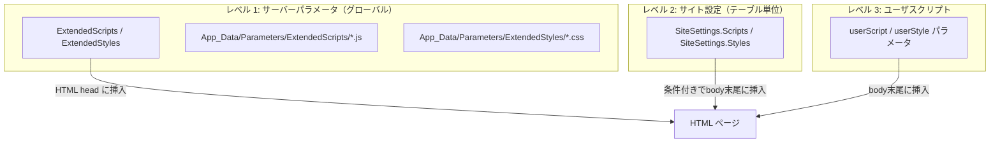
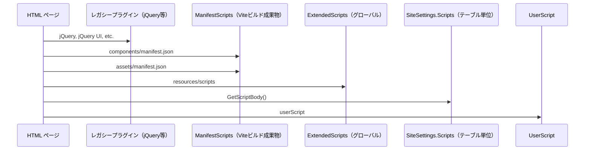
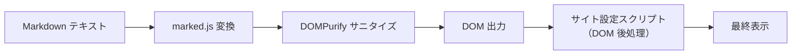
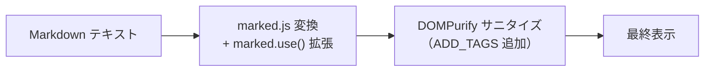

# Markdown 拡張手法

プリザンターの Markdown レンダリングを拡張するための手法について調査する。marked.js v17 の拡張 API、プリザンターのビルドパイプライン、スクリプト/スタイル注入メカニズム、DOMPurify 制約、プラグインインターフェースを整理し、実用的な拡張アプローチを難易度・リスク順に提示する。

<!-- START doctoc generated TOC please keep comment here to allow auto update -->
<!-- DON'T EDIT THIS SECTION, INSTEAD RE-RUN doctoc TO UPDATE -->

- [調査情報](#調査情報)
- [調査目的](#調査目的)
- [marked.js v17 拡張 API](#markedjs-v17-拡張-api)
    - [バージョン情報](#バージョン情報)
    - [インポート方式](#インポート方式)
    - [marked v17 が提供する拡張 API](#marked-v17-が提供する拡張-api)
    - [`marked.use()` の詳細](#markeduse-の詳細)
    - [カスタムトークン（`extensions`）の仕組み](#カスタムトークンextensionsの仕組み)
    - [プリザンターでの現在の利用範囲](#プリザンターでの現在の利用範囲)
- [プリザンターのフロントエンドビルドパイプライン](#プリザンターのフロントエンドビルドパイプライン)
    - [ビルドシステム構成](#ビルドシステム構成)
    - [設定ファイル一覧](#設定ファイル一覧)
    - [入出力パス](#入出力パス)
    - [エントリーポイント](#エントリーポイント)
    - [出力ファイル構成](#出力ファイル構成)
    - [マニフェストによるスクリプト読み込み](#マニフェストによるスクリプト読み込み)
- [ユーザスクリプト/スタイル注入メカニズム](#ユーザスクリプトスタイル注入メカニズム)
    - [層構成](#層構成)
    - [レベル 1: ExtendedScripts / ExtendedStyles（グローバル）](#レベル-1-extendedscripts--extendedstylesグローバル)
    - [レベル 2: SiteSettings（テーブル単位）](#レベル-2-sitesettingsテーブル単位)
    - [レベル 3: ユーザスクリプト](#レベル-3-ユーザスクリプト)
    - [HTML への出力順序](#html-への出力順序)
- [DOMPurify の制約](#dompurify-の制約)
    - [現在の設定](#現在の設定)
    - [制約の影響](#制約の影響)
    - [DOMPurify カスタマイズのオプション](#dompurify-カスタマイズのオプション)
- [RichTextEditor の DOMPurify 使用](#richtexteditor-の-dompurify-使用)
- [プラグイン / フックインターフェース](#プラグイン--フックインターフェース)
    - [既存のプラグインインターフェース](#既存のプラグインインターフェース)
    - [アプリケーションインターフェース](#アプリケーションインターフェース)
    - [Markdown 拡張向けプラグインインターフェース](#markdown-拡張向けプラグインインターフェース)
- [Web Components（Custom Elements）構造](#web-componentscustom-elements構造)
    - [MarkdownFieldElement の実装方式](#markdownfieldelement-の実装方式)
    - [他の Custom Elements の構成比較](#他の-custom-elements-の構成比較)
- [既存の marked 拡張パッケージ](#既存の-marked-拡張パッケージ)
    - [package.json の調査結果](#packagejson-の調査結果)
- [実用的な Markdown 拡張アプローチ](#実用的な-markdown-拡張アプローチ)
    - [アプローチ 1: サイト設定スクリプトによる DOM 後処理（難易度: 低）](#アプローチ-1-サイト設定スクリプトによる-dom-後処理難易度-低)
    - [アプローチ 2: ExtendedScripts によるグローバル DOM 後処理（難易度: 低）](#アプローチ-2-extendedscripts-によるグローバル-dom-後処理難易度-低)
    - [アプローチ 3: フロントエンドビルドのフォーク（marked.use() 活用）（難易度: 中）](#アプローチ-3-フロントエンドビルドのフォークmarkeduse-活用難易度-中)
    - [アプローチ 4: components ディレクトリへの独立モジュール追加（難易度: 中）](#アプローチ-4-components-ディレクトリへの独立モジュール追加難易度-中)
    - [アプローチ 5: renderer.html のエスケープ解除とカスタム HTML 記法（難易度: 中-高）](#アプローチ-5-rendererhtml-のエスケープ解除とカスタム-html-記法難易度-中-高)
- [拡張アプローチの比較](#拡張アプローチの比較)
- [結論](#結論)
- [関連ソースコード](#関連ソースコード)

<!-- END doctoc generated TOC please keep comment here to allow auto update -->

## 調査情報

| 調査日        | リポジトリ | ブランチ | タグ/バージョン    | コミット   | 備考     |
| ------------- | ---------- | -------- | ------------------ | ---------- | -------- |
| 2026年2月23日 | Pleasanter | main     | Pleasanter_1.5.1.0 | `34f162a4` | 初回調査 |

## 調査目的

プリザンター上の Markdown フィールドのレンダリングを拡張（例: Mermaid ダイアグラム、数式、カスタム記法など）するための技術的手段を網羅的に調査し、各手法の実現性・難易度・リスクを明確にする。

---

## marked.js v17 拡張 API

### バージョン情報

| 項目       | 値                                                     |
| ---------- | ------------------------------------------------------ |
| パッケージ | `marked`                                               |
| バージョン | `^17.0.1`                                              |
| 定義元     | `package.json`（`Implem.PleasanterFrontend/wwwroot/`） |

### インポート方式

プリザンターでは `Marked` クラスをインスタンスベースで使用している。

**ファイル**: `Implem.PleasanterFrontend/wwwroot/src/scripts/modules/markdownField/markdownField.ts`（行番号: 1, 6, 151-163）

```typescript
import { Marked } from 'marked';
import type { Tokens, Token } from 'marked';

// インスタンス生成時にオプションを指定
private viewerMarked? = new Marked({
    gfm: true,
    breaks: true,
    renderer: {
        html: token => this.escapeHtml(token.text),
        link: token => this.mdRenderLink(token),
        image: token => this.mdRenderImage(token),
        code: token => this.mdRenderCode(token)
    }
});
```

### marked v17 が提供する拡張 API

marked v17 (v12+) では以下の拡張ポイントが利用可能である。

| API                     | 説明                                                   | プリザンターでの使用                  |
| ----------------------- | ------------------------------------------------------ | ------------------------------------- |
| `new Marked(options)`   | インスタンス生成時のオプション指定                     | **使用中**                            |
| `marked.use(extension)` | 拡張を適用する主要メソッド                             | 未使用                                |
| `renderer`              | 既存トークンの HTML 出力をカスタマイズ                 | **使用中**（html, link, image, code） |
| `tokenizer`             | 既存のトークン化ルールを上書き                         | 未使用                                |
| `walkTokens`            | パース後のトークンツリーを走査・変換                   | 未使用                                |
| `extensions`            | カスタムトークン（ブロック/インライン）を追加          | 未使用                                |
| `hooks`                 | `preprocess`, `postprocess`, `processAllTokens` フック | 未使用                                |

### `marked.use()` の詳細

`marked.use()` は `MarkedExtension` オブジェクトを受け取り、既存の設定にマージする。複数回呼び出し可能で、あとから呼ばれた拡張が優先される。

```typescript
// marked.use() の型定義（marked v17）
interface MarkedExtension {
    async?: boolean;
    breaks?: boolean;
    gfm?: boolean;
    pedantic?: boolean;
    renderer?: RendererObject;
    tokenizer?: TokenizerObject;
    walkTokens?: (token: Token) => void | Promise<void>;
    extensions?: MarkedExtension[]; // カスタムトークン定義
    hooks?: {
        preprocess?: (markdown: string) => string;
        postprocess?: (html: string) => string;
        processAllTokens?: (tokens: Token[]) => Token[];
    };
}
```

### カスタムトークン（`extensions`）の仕組み

`extensions` プロパティでカスタムブロック/インライン要素を定義できる。

```typescript
// カスタム拡張の構造例
const myExtension: MarkedExtension = {
    extensions: [
        {
            name: 'myCustomBlock',
            level: 'block', // 'block' | 'inline'
            start(src: string) {
                // トークン開始位置の検出
                return src.match(/:::/)?.index;
            },
            tokenizer(src: string) {
                // トークン化ルール
                const match = src.match(/^:::([\s\S]+?):::/);
                if (match) {
                    return {
                        type: 'myCustomBlock',
                        raw: match[0],
                        text: match[1].trim(),
                    };
                }
            },
            renderer(token) {
                // HTML レンダリング
                return `<div class="custom">${token.text}</div>`;
            },
        },
    ],
};

// 適用
const marked = new Marked();
marked.use(myExtension);
```

### プリザンターでの現在の利用範囲

| カスタマイズ項目 | 実装内容                                                    |
| ---------------- | ----------------------------------------------------------- |
| `renderer.html`  | HTML タグをエスケープ（XSS 対策）                           |
| `renderer.link`  | UNC パス・Notes リンクを `data-href` 属性で処理             |
| `renderer.image` | `?thumbnail=1` パラメータ付加、`<figure>` タグでラップ      |
| `renderer.code`  | highlight.js によるシンタックスハイライト＋コピーボタン生成 |

---

## プリザンターのフロントエンドビルドパイプライン

### ビルドシステム構成

| 項目           | 値                  |
| -------------- | ------------------- |
| ビルドツール   | Vite 7.x            |
| 言語           | TypeScript 5.x      |
| バンドラー     | Rollup（Vite 内蔵） |
| CSS            | Sass（SCSS）        |
| パッケージ管理 | npm                 |

### 設定ファイル一覧

| ファイル                     | 用途                                 |
| ---------------------------- | ------------------------------------ |
| `vite.config.ts`             | 本番ビルド（スクリプト＋スタイル）   |
| `vite.config.dev.scripts.ts` | 開発用スクリプト watch ビルド        |
| `vite.config.dev.styles.ts`  | 開発用スタイル watch ビルド          |
| `vita.config.shared.ts`      | 共通設定（入出力パス、エイリアス等） |

### 入出力パス

**ファイル**: `Implem.PleasanterFrontend/wwwroot/vita.config.shared.ts`

```typescript
const inputDir = './src';
const outputDir = '../../Implem.Pleasanter/wwwroot/assets';
```

| 方向 | パス                                             |
| ---- | ------------------------------------------------ |
| 入力 | `Implem.PleasanterFrontend/wwwroot/src/scripts/` |
| 入力 | `Implem.PleasanterFrontend/wwwroot/src/styles/`  |
| 出力 | `Implem.Pleasanter/wwwroot/assets/`              |

### エントリーポイント

`getEntries()` 関数により、`src/scripts/` 直下の `.ts` ファイルがすべてエントリーポイントとなる。

| エントリー   | 内容                                                      |
| ------------ | --------------------------------------------------------- |
| `app.ts`     | `generals/` をインポート                                  |
| `modules.ts` | `modules/index.ts` 経由で各カスタムエレメントをインポート |

`modules/index.ts` は以下をインポートしている。

```typescript
import './datefield.ts';
import './displaynone.ts';
import './codeEditor/codeEditor.ts';
import './markdownField/markdownField.ts';
import './richTextEditor/richTextEditor.ts';
import './uiCarousel/uiCarousel.ts';
import './editorColumns/initialize.ts';
import './preventHrefJump.ts';
```

### 出力ファイル構成

| 出力             | ルール                |
| ---------------- | --------------------- |
| エントリー JS    | `js/[name]_[hash].js` |
| ベンダーチャンク | `js/vendor_[hash].js` |
| CSS              | `css/[name].min.css`  |
| マニフェスト     | `manifest.json`       |

### マニフェストによるスクリプト読み込み

サーバーサイドの `ManifestLoader` が `manifest.json` を読み込み、
`isEntry: true` のファイルを `<script>` タグとして HTML に出力する。
ES Module の `import` 依存も処理される。

**ファイル**: `Implem.Pleasanter/Libraries/Manifests/ManifestLoader.cs`

```csharp
// manifest.json の isEntry: true のエントリーを抽出
// CSS エントリーは除外（css/ で始まるもの）
// imports がある場合は type="module" crossorigin で出力
```

**ファイル**: `Implem.Pleasanter/Libraries/HtmlParts/HtmlScripts.cs`（行番号: 103-112）

```csharp
.ManifestScripts(ManifestLoader.Load(
    Path.Combine(Environments.CurrentDirectoryPath, "wwwroot", "assets", "manifest.json")
), "assets", context)
```

---

## ユーザスクリプト/スタイル注入メカニズム

プリザンターには**3 層**のスクリプト/スタイル注入メカニズムが存在する。

### 層構成



### レベル 1: ExtendedScripts / ExtendedStyles（グローバル）

**定義場所**: `Implem.ParameterAccessor/Parameters.cs`

```csharp
public static List<ExtendedScript> ExtendedScripts;
public static List<ExtendedStyle> ExtendedStyles;
```

**配置場所**: `App_Data/Parameters/ExtendedScripts/` および `App_Data/Parameters/ExtendedStyles/`

**ファイル**: `Implem.ParameterAccessor/Parts/ExtendedBase.cs`

```csharp
public class ExtendedBase
{
    public string Name;
    public bool SpecifyByName;
    public string Path;
    public string Description;
    public bool Disabled;
    public List<int> DeptIdList;
    public List<int> GroupIdList;
    public List<int> UserIdList;
    public List<long> SiteIdList;
    public List<long> IdList;
    public List<string> Controllers;
    public List<string> Actions;
    public List<string> ColumnList;
}
```

| フィルタ条件  | 説明                                          |
| ------------- | --------------------------------------------- |
| `SiteIdList`  | 特定サイトID のみで有効化                     |
| `IdList`      | 特定レコード ID のみで有効化                  |
| `Controllers` | 特定コントローラー（Items, Sites 等）で有効化 |
| `Actions`     | 特定アクション（index, edit, new 等）で有効化 |
| `DeptIdList`  | 特定部署のユーザのみで有効化                  |
| `GroupIdList` | 特定グループのユーザのみで有効化              |
| `UserIdList`  | 特定ユーザのみで有効化                        |
| `Disabled`    | 無効化フラグ                                  |

### レベル 2: SiteSettings（テーブル単位）

**ファイル**: `Implem.Pleasanter/Libraries/Settings/SiteSettings.cs`（行番号: 206-216）

```csharp
public SettingList<Style> Styles;
public bool? StylesAllDisabled;
public SettingList<Script> Scripts;
public bool? ScriptsAllDisabled;
public SettingList<Html> Htmls;
public bool? HtmlsAllDisabled;
```

**ファイル**: `Implem.Pleasanter/Libraries/Settings/Script.cs`

```csharp
public class Script : ISettingListItem
{
    public int Id { get; set; }
    public string Title;
    public string Body;        // JavaScript コード本体
    public bool? All;          // 全画面で有効
    public bool? New;          // 新規作成画面で有効
    public bool? Edit;         // 編集画面で有効
    public bool? Index;        // 一覧画面で有効
    public bool? Disabled;     // 無効化フラグ
    // ... Calendar, Crosstab, Gantt, etc.
}
```

`GetScriptBody()` メソッドが画面種別に応じたフィルタリングを行う。

### レベル 3: ユーザスクリプト

`HtmlScripts.Scripts()` メソッドの `userScript` パラメータとして渡されるスクリプト。

### HTML への出力順序

**ファイル**: `Implem.Pleasanter/Libraries/HtmlParts/HtmlScripts.cs`



---

## DOMPurify の制約

### 現在の設定

**ファイル**: `Implem.PleasanterFrontend/wwwroot/src/scripts/modules/markdownField/markdownField.ts`（行番号: 319-321）

```typescript
md = DOMPurify.sanitize(md, {
    ADD_ATTR: ['target'],
});
```

### 制約の影響

| 制約事項                    | 影響                                                            |
| --------------------------- | --------------------------------------------------------------- |
| `ADD_ATTR: ['target']` のみ | `target` 属性のみ追加許可。カスタム `data-*` 属性は許可されない |
| カスタムタグの除外          | DOMPurify はデフォルトで未知の HTML タグを除去する              |
| `<script>` タグの除去       | スクリプト注入は不可（セキュリティ上期待される動作）            |
| `<style>` タグの除去        | インラインスタイルブロックは除去される                          |
| `<iframe>` の除去           | 外部コンテンツの埋め込み不可                                    |
| SVG の一部制限              | DOMPurify v3 のデフォルトでは一部 SVG 属性が除去される          |

### DOMPurify カスタマイズのオプション

DOMPurify 自体は豊富なカスタマイズオプションを提供するが、**現在のプリザンターのコードではハードコーディングされており**、外部から設定を変更する仕組みは存在しない。

| DOMPurify オプション      | 説明                       | 現在の使用                  |
| ------------------------- | -------------------------- | --------------------------- |
| `ADD_TAGS`                | 許可するカスタムタグを追加 | 未使用                      |
| `ADD_ATTR`                | 許可するカスタム属性を追加 | `target` のみ               |
| `ALLOW_DATA_ATTR`         | `data-*` 属性を許可        | 未使用（デフォルト `true`） |
| `ADD_URI_SAFE_ATTR`       | URI 安全属性を追加         | 未使用                      |
| `CUSTOM_ELEMENT_HANDLING` | カスタム要素の許可制御     | 未使用                      |

> **注意**: DOMPurify v3 はデフォルトで `data-*` 属性を許可する（`ALLOW_DATA_ATTR: true`）。ただし、カスタムタグそのものは `ADD_TAGS` で明示的に許可しない限り除去される。

---

## RichTextEditor の DOMPurify 使用

参考として、`richTextEditor.ts` では DOMPurify を**オプションなし**で使用している。

**ファイル**: `Implem.PleasanterFrontend/wwwroot/src/scripts/modules/richTextEditor/richTextEditor.ts`（行番号: 161）

```typescript
this.viewerContainer.innerHTML = DOMPurify.sanitize(this.controller.value);
```

---

## プラグイン / フックインターフェース

### 既存のプラグインインターフェース

**ファイル**: `Implem.Plugins/`

| インターフェース | 用途                   | Markdown 拡張との関連 |
| ---------------- | ---------------------- | --------------------- |
| `IPdfPlugin`     | PDF 生成プラグイン     | **関連なし**          |
| `IPdfPluginHost` | PDF プラグインのホスト | **関連なし**          |

### アプリケーションインターフェース

**ファイル**: `Implem.Pleasanter/Interfaces/`

| インターフェース   | 用途                     | Markdown 拡張との関連 |
| ------------------ | ------------------------ | --------------------- |
| `IConvertable`     | 変換可能インターフェース | **関連なし**          |
| `IExportModel`     | エクスポート用モデル     | **関連なし**          |
| `ISettingListItem` | 設定リスト項目           | Script, Style が実装  |

### Markdown 拡張向けプラグインインターフェース

**存在しない**。Markdown レンダリングに対するプラグイン機構やフック機構は、サーバーサイド・クライアントサイドともに提供されていない。

---

## Web Components（Custom Elements）構造

### MarkdownFieldElement の実装方式

**ファイル**: `Implem.PleasanterFrontend/wwwroot/src/scripts/modules/markdownField/markdownField.ts`（行番号: 14, 550）

```typescript
class MarkdownFieldElement extends HTMLElement {
    // Shadow DOM は使用していない（Light DOM）
    // ...
}
customElements.define('markdown-field', MarkdownFieldElement);
```

| 特性             | 値                                                  |
| ---------------- | --------------------------------------------------- |
| DOM モード       | **Light DOM**（Shadow DOM 不使用）                  |
| スタイル注入方式 | `<style>` タグを `document.head` に追加             |
| 再定義可能性     | `customElements.define()` は同一タグで 2 回呼べない |
| 外部アクセス     | Light DOM のため、外部 JS から `querySelector` 可能 |

### 他の Custom Elements の構成比較

| コンポーネント | タグ名           | Shadow DOM |
| -------------- | ---------------- | ---------- |
| MarkdownField  | `markdown-field` | **なし**   |
| RichTextEditor | `rt-editor`      | **なし**   |
| CodeEditor     | `code-editor`    | **あり**   |
| DateField      | `date-field`     | **あり**   |
| UICarousel     | `ui-carousel`    | **なし**   |

---

## 既存の marked 拡張パッケージ

### package.json の調査結果

`package.json` の `dependencies` および `devDependencies` に `marked-*` 系の拡張パッケージは**含まれていない**。

フロントエンドソースコード内に `marked.use()` や `MarkedExtension` の使用箇所も**存在しない**。

---

## 実用的な Markdown 拡張アプローチ

以下、難易度の低い順に拡張アプローチを整理する。

### アプローチ 1: サイト設定スクリプトによる DOM 後処理（難易度: 低）

Markdown のレンダリング結果（HTML）に対してスクリプトで後処理を行う。

#### 概要



#### 実装方法

1. サイト管理 → スクリプトタブでスクリプトを追加
2. Markdown ビューアの表示後にコードブロックの内容を検出・変換

```javascript
// 例: コードブロックで mermaid を検出して変換
document.querySelectorAll('markdown-field .md-viewer pre code.language-mermaid').forEach((el) => {
    const code = el.textContent;
    const div = document.createElement('div');
    div.className = 'mermaid';
    div.textContent = code;
    el.closest('.md-code-block').replaceWith(div);
});
// mermaid.js を別途読み込んで初期化
```

#### 制約と注意点

| 制約                         | 影響                                                                                                |
| ---------------------------- | --------------------------------------------------------------------------------------------------- |
| DOMPurify 後の DOM 操作      | サニタイズ済みの安全な HTML に対する操作のため、XSS リスクに注意                                    |
| MutationObserver 必要        | ビューア切替時に再処理が必要                                                                        |
| パフォーマンス懸念           | 外部ライブラリの動的読み込みが必要                                                                  |
| スクリプト管理の分散         | サイトごとに個別管理が必要                                                                          |
| `renderer.html` のエスケープ | `<div class="mermaid">` のような HTML を Markdown に埋め込んでも `renderer.html` でエスケープされる |

#### 評価

| 項目     | 評価  |
| -------- | ----- |
| 難易度   | ★☆☆☆☆ |
| リスク   | ★★☆☆☆ |
| 柔軟性   | ★★★☆☆ |
| 保守性   | ★★☆☆☆ |
| 本体改修 | 不要  |

---

### アプローチ 2: ExtendedScripts によるグローバル DOM 後処理（難易度: 低）

アプローチ 1 と同じ手法を `ExtendedScripts` で全サイトに適用する。

#### 実装方法

`App_Data/Parameters/ExtendedScripts/` に JavaScript ファイルを配置して、JSON 設定でフィルタ条件を指定する。

#### アプローチ 1 との違い

| 項目           | サイト設定スクリプト | ExtendedScripts         |
| -------------- | -------------------- | ----------------------- |
| 適用範囲       | テーブル単位         | 全サイト / フィルタ指定 |
| 管理場所       | DB（SiteSettings）   | ファイルシステム        |
| デプロイ方法   | UI 操作              | ファイル配置 + 再起動   |
| バージョン管理 | 困難                 | Git 管理可能            |

#### 評価

| 項目     | 評価  |
| -------- | ----- |
| 難易度   | ★☆☆☆☆ |
| リスク   | ★★☆☆☆ |
| 柔軟性   | ★★★☆☆ |
| 保守性   | ★★★☆☆ |
| 本体改修 | 不要  |

---

### アプローチ 3: フロントエンドビルドのフォーク（marked.use() 活用）（難易度: 中）

`Implem.PleasanterFrontend` のソースコードをフォークし、`markdownField.ts` で `marked.use()` を使用して拡張を組み込む。

#### 概要



#### 実装方法

1. `markdownField.ts` の `Marked` インスタンスに `use()` で拡張を追加
2. DOMPurify の設定を拡張（`ADD_TAGS`, `ADD_ATTR`）
3. Vite でビルドし、成果物を `Implem.Pleasanter/wwwroot/assets/` に配置

```typescript
// markdownField.ts への変更例
import markedAlert from 'marked-alert';

private viewerMarked? = new Marked({
    gfm: true,
    breaks: true,
    renderer: {
        html: token => this.escapeHtml(token.text),
        link: token => this.mdRenderLink(token),
        image: token => this.mdRenderImage(token),
        code: token => this.mdRenderCode(token)
    }
});

constructor() {
    super();
    this.viewerMarked?.use(markedAlert());  // 拡張適用
    // ...
}
```

#### DOMPurify 設定の変更

```typescript
// 変更前
md = DOMPurify.sanitize(md, { ADD_ATTR: ['target'] });

// 変更後（カスタムタグを許可）
md = DOMPurify.sanitize(md, {
    ADD_ATTR: ['target'],
    ADD_TAGS: ['mermaid-diagram'], // 必要に応じて
});
```

#### ビルドと配置

```bash
cd Implem.PleasanterFrontend/wwwroot
npm install
npm run build
# 成果物は自動的に ../../Implem.Pleasanter/wwwroot/assets/ に出力される
```

#### 制約と注意点

| 制約                     | 影響                                                              |
| ------------------------ | ----------------------------------------------------------------- |
| 本体アップデートとの競合 | `markdownField.ts` の変更がアップデートで上書きされる             |
| ビルド環境の維持         | Node.js / npm 環境の管理が必要                                    |
| DOMPurify 設定の同期     | 拡張で生成した HTML タグが DOMPurify で除去されないよう設定が必要 |
| ハッシュ付きファイル名   | ビルドごとにファイル名が変わるため、manifest.json で管理される    |

#### 評価

| 項目     | 評価                 |
| -------- | -------------------- |
| 難易度   | ★★★☆☆                |
| リスク   | ★★★☆☆                |
| 柔軟性   | ★★★★★                |
| 保守性   | ★★☆☆☆                |
| 本体改修 | **必要**（フォーク） |

---

### アプローチ 4: components ディレクトリへの独立モジュール追加（難易度: 中）

Vite ビルドの成果物を `wwwroot/components/` に配置し、`ManifestLoader` で読み込ませる。

#### 概要

`HtmlScripts.cs` は 2 つの manifest.json を読み込む。

```csharp
// HtmlScripts.cs 行番号 103-112
.ManifestScripts(ManifestLoader.Load(
    Path.Combine(Environments.CurrentDirectoryPath, "wwwroot", "components", "manifest.json")
), "components", context)
.ManifestScripts(ManifestLoader.Load(
    Path.Combine(Environments.CurrentDirectoryPath, "wwwroot", "assets", "manifest.json")
), "assets", context)
```

#### 実装方法

1. 独立した Vite プロジェクトで Markdown 拡張スクリプトをビルド
2. `manifest.json` 互換の出力を生成
3. `wwwroot/components/` に配置

#### 制約と注意点

| 制約                              | 影響                                              |
| --------------------------------- | ------------------------------------------------- |
| `components/manifest.json` の形式 | ManifestLoader の期待する形式に合わせる必要がある |
| 読み込み順序                      | components は assets より先に読み込まれる         |
| MarkdownField への介入が制限的    | Custom Element の登録前に介入する方法が限られる   |

#### 評価

| 項目     | 評価                     |
| -------- | ------------------------ |
| 難易度   | ★★★☆☆                    |
| リスク   | ★★★☆☆                    |
| 柔軟性   | ★★★☆☆                    |
| 保守性   | ★★★☆☆                    |
| 本体改修 | 不要（ファイル配置のみ） |

---

### アプローチ 5: renderer.html のエスケープ解除とカスタム HTML 記法（難易度: 中-高）

現在の `renderer.html` は全 HTML をエスケープしているため、Markdown 中に直接 HTML を記述しても無視される。この挙動を変更する。

#### 現在の実装

```typescript
renderer: {
    html: token => this.escapeHtml(token.text),  // 全エスケープ
}
```

#### 変更案

```typescript
renderer: {
    html: token => {
        // 許可リストに基づく選択的なHTML許可
        const allowed = /<(div|span|details|summary|mark|kbd|abbr)[^>]*>/i;
        if (allowed.test(token.text)) {
            return token.text;  // 許可タグはそのまま通す
        }
        return this.escapeHtml(token.text);
    },
}
```

#### 制約と注意点

| 制約                   | 影響                                                  |
| ---------------------- | ----------------------------------------------------- |
| XSS リスク増大         | HTML を部分的に許可するため、セキュリティリスクが高い |
| DOMPurify との二重防御 | DOMPurify でも除去されるため、ADD_TAGS も必要         |
| 本体フォーク必須       | markdownField.ts の改修が必要                         |

#### 評価

| 項目     | 評価                 |
| -------- | -------------------- |
| 難易度   | ★★★★☆                |
| リスク   | ★★★★☆                |
| 柔軟性   | ★★★★☆                |
| 保守性   | ★★☆☆☆                |
| 本体改修 | **必要**（フォーク） |

---

## 拡張アプローチの比較

| #   | アプローチ                          | 難易度 | リスク | 本体改修 | 適用例                                 |
| --- | ----------------------------------- | ------ | ------ | -------- | -------------------------------------- |
| 1   | サイト設定スクリプト（DOM 後処理）  | ★☆☆☆☆  | ★★☆☆☆  | 不要     | Mermaid、KaTeX（コードブロック後処理） |
| 2   | ExtendedScripts（グローバル後処理） | ★☆☆☆☆  | ★★☆☆☆  | 不要     | 全サイト共通の拡張                     |
| 3   | フォーク＋ marked.use()             | ★★★☆☆  | ★★★☆☆  | 必要     | カスタム Markdown 記法                 |
| 4   | components 独立モジュール           | ★★★☆☆  | ★★★☆☆  | 不要     | 独立した後処理モジュール               |
| 5   | renderer.html エスケープ解除        | ★★★★☆  | ★★★★☆  | 必要     | 直接 HTML 埋め込み                     |

---

## 結論

| 観点                       | 結論                                                                                                                 |
| -------------------------- | -------------------------------------------------------------------------------------------------------------------- |
| marked.js v17 拡張 API     | `use()`, `extensions`, `tokenizer`, `renderer`, `walkTokens`, `hooks` を完備。プリザンターでは `renderer` のみ使用中 |
| ビルドパイプライン         | Vite 7.x で `Implem.Pleasanter/wwwroot/assets/` に出力。manifest.json で管理                                         |
| スクリプト注入             | 3 層（ExtendedScripts / SiteSettings.Scripts / userScript）で可能。外部 JS の注入手段あり                            |
| DOMPurify 制約             | `ADD_ATTR: ['target']` のみ。カスタムタグは `ADD_TAGS` なしでは除去される。外部設定変更手段なし                      |
| プラグインインターフェース | Markdown 拡張向けのプラグイン機構は**存在しない**。PDF プラグインのみ                                                |
| Custom Elements            | Light DOM（Shadow DOM 不使用）のため外部からの DOM 操作は可能                                                        |
| 推奨アプローチ             | **アプローチ 1 / 2**（DOM 後処理）が最も低リスク。**アプローチ 3**（marked.use()）は最も柔軟だが本体フォークが必要   |
| 主要制約                   | `renderer.html` による全 HTML エスケープ、DOMPurify のハードコード設定、プラグイン機構の不在                         |

---

## 関連ソースコード

| ファイルパス                                                                           | 説明                               |
| -------------------------------------------------------------------------------------- | ---------------------------------- |
| `Implem.PleasanterFrontend/wwwroot/src/scripts/modules/markdownField/markdownField.ts` | Markdown フィールド Custom Element |
| `Implem.PleasanterFrontend/wwwroot/package.json`                                       | フロントエンド依存パッケージ       |
| `Implem.PleasanterFrontend/wwwroot/vite.config.ts`                                     | Vite 本番ビルド設定                |
| `Implem.PleasanterFrontend/wwwroot/vita.config.shared.ts`                              | Vite 共通設定                      |
| `Implem.Pleasanter/Libraries/HtmlParts/HtmlScripts.cs`                                 | スクリプト HTML 出力               |
| `Implem.Pleasanter/Libraries/HtmlParts/HtmlStyles.cs`                                  | スタイル HTML 出力                 |
| `Implem.Pleasanter/Libraries/Manifests/ManifestLoader.cs`                              | manifest.json 読み込み             |
| `Implem.Pleasanter/Libraries/Settings/SiteSettings.cs`                                 | サイト設定（Scripts / Styles）     |
| `Implem.Pleasanter/Libraries/Settings/Script.cs`                                       | スクリプト設定モデル               |
| `Implem.Pleasanter/Libraries/Settings/Style.cs`                                        | スタイル設定モデル                 |
| `Implem.ParameterAccessor/Parts/ExtendedBase.cs`                                       | ExtendedScript/Style 基底クラス    |
| `Implem.ParameterAccessor/Parts/ExtendedScript.cs`                                     | ExtendedScript 定義                |
| `Implem.ParameterAccessor/Parts/ExtendedStyle.cs`                                      | ExtendedStyle 定義                 |
| `Implem.ParameterAccessor/Parameters.cs`                                               | パラメータ定義                     |
| `Implem.Plugins/IPdfPlugin.cs`                                                         | PDF プラグインインターフェース     |
| `Implem.Pleasanter/App_Data/Parameters/ExtendedScripts/`                               | 拡張スクリプト配置ディレクトリ     |
| `Implem.Pleasanter/App_Data/Parameters/ExtendedStyles/`                                | 拡張スタイル配置ディレクトリ       |
