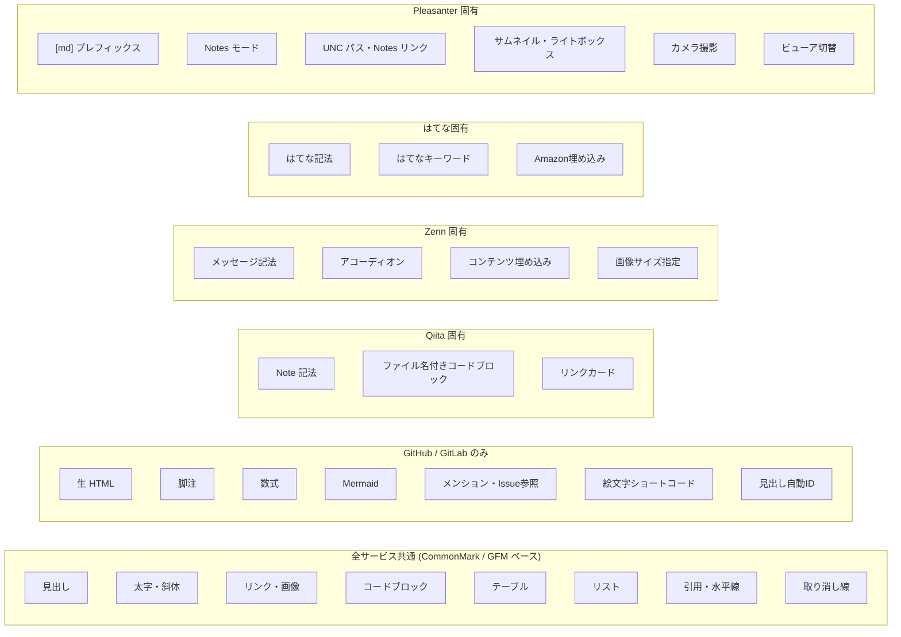

# Markdown 機能比較

プリザンターの `[md]` モードと、GitHub・Qiita・Zenn・はてなブログなど日本でよく使われるサービスの Markdown 実装を比較する。サービス間での Markdown コンテンツ移行時の差異把握を目的とする。

<!-- START doctoc generated TOC please keep comment here to allow auto update -->
<!-- DON'T EDIT THIS SECTION, INSTEAD RE-RUN doctoc TO UPDATE -->

- [調査情報](#調査情報)
- [調査目的](#調査目的)
- [比較対象サービス](#比較対象サービス)
- [基本構文の比較](#基本構文の比較)
    - [CommonMark / GFM 共通構文](#commonmark--gfm-共通構文)
- [改行の挙動（重要な差異）](#改行の挙動重要な差異)
- [生の HTML サポート](#生の-html-サポート)
- [拡張構文の比較](#拡張構文の比較)
    - [数式（LaTeX / KaTeX / MathJax）](#数式latex--katex--mathjax)
    - [ダイアグラム（Mermaid 等）](#ダイアグラムmermaid-等)
    - [脚注・注釈](#脚注注釈)
    - [アラート / 注意書き / メッセージ](#アラート--注意書き--メッセージ)
    - [目次・見出しアンカー](#目次見出しアンカー)
    - [絵文字・メンション](#絵文字メンション)
    - [プラットフォーム固有参照](#プラットフォーム固有参照)
- [各サービスの独自拡張](#各サービスの独自拡張)
    - [Pleasanter 固有](#pleasanter-固有)
    - [Qiita 固有](#qiita-固有)
    - [Zenn 固有](#zenn-固有)
    - [はてなブログ固有](#はてなブログ固有)
    - [GitLab 固有](#gitlab-固有)
- [シンタックスハイライトの比較](#シンタックスハイライトの比較)
- [画像・メディアの比較](#画像メディアの比較)
- [サニタイズ方式の比較](#サニタイズ方式の比較)
- [移行時の注意点](#移行時の注意点)
    - [Pleasanter への移行](#pleasanter-への移行)
    - [Pleasanter からの移行](#pleasanter-からの移行)
    - [共通の移行チェックリスト](#共通の移行チェックリスト)
- [機能差分の概念図](#機能差分の概念図)
- [結論](#結論)
- [関連ドキュメント](#関連ドキュメント)

<!-- END doctoc generated TOC please keep comment here to allow auto update -->

## 調査情報

| 調査日        | リポジトリ | ブランチ | タグ/バージョン    | コミット   | 備考                         |
| ------------- | ---------- | -------- | ------------------ | ---------- | ---------------------------- |
| 2026年2月23日 | Pleasanter | main     | Pleasanter_1.5.1.0 | `34f162a4` | 008-Markdown実装.md から分離 |

## 調査目的

- プリザンターの Markdown と各サービスの Markdown 実装の差異を整理する
- サービス間で Markdown コンテンツを移行する際の注意点を明確にする
- 各サービスの独自拡張機能を一覧化し、代替手段を把握する

---

## 比較対象サービス

| サービス         | パーサー / ベース仕様              | レンダリング       | 備考                       |
| ---------------- | ---------------------------------- | ------------------ | -------------------------- |
| **Pleasanter**   | marked.js v17（GFM モード）        | クライアントサイド | `[md]` プレフィックス必須  |
| **GitHub**       | cmark-gfm 派生（独自実装）         | サーバーサイド     | GFM 仕様の本家             |
| **Qiita**        | 独自パーサー（CommonMark ベース）  | サーバーサイド     | Qiita 独自拡張あり         |
| **Zenn**         | markdown-it ベース（独自拡張）     | サーバーサイド     | Zenn 独自記法あり          |
| **はてなブログ** | はてな記法 + Markdown モード       | サーバーサイド     | はてな記法との共存         |
| **GitLab**       | CommonMark（cmark-gfm + 独自拡張） | サーバーサイド     | GFM 互換 + GitLab 独自拡張 |

---

## 基本構文の比較

### CommonMark / GFM 共通構文

| 構文                            | Pleasanter | GitHub | Qiita | Zenn | はてな | GitLab |
| ------------------------------- | :--------: | :----: | :---: | :--: | :----: | :----: |
| ATX 見出し (`#`, `##`, ...)     |    Yes     |  Yes   |  Yes  | Yes  |  Yes   |  Yes   |
| Setext 見出し (`===`, `---`)    |    Yes     |  Yes   |  Yes  | Yes  |  Yes   |  Yes   |
| 太字 (`**`, `__`)               |    Yes     |  Yes   |  Yes  | Yes  |  Yes   |  Yes   |
| 斜体 (`*`, `_`)                 |    Yes     |  Yes   |  Yes  | Yes  |  Yes   |  Yes   |
| 取り消し線 (`~~`)               |    Yes     |  Yes   |  Yes  | Yes  |  Yes   |  Yes   |
| インラインコード (`` ` ``)      |    Yes     |  Yes   |  Yes  | Yes  |  Yes   |  Yes   |
| フェンスドコードブロック        |    Yes     |  Yes   |  Yes  | Yes  |  Yes   |  Yes   |
| インデントコードブロック        |    Yes     |  Yes   |  Yes  | Yes  |  Yes   |  Yes   |
| 引用 (`>`)                      |    Yes     |  Yes   |  Yes  | Yes  |  Yes   |  Yes   |
| 箇条書き（番号なし）            |    Yes     |  Yes   |  Yes  | Yes  |  Yes   |  Yes   |
| 箇条書き（番号付き）            |    Yes     |  Yes   |  Yes  | Yes  |  Yes   |  Yes   |
| テーブル                        |    Yes     |  Yes   |  Yes  | Yes  |  Yes   |  Yes   |
| 水平線 (`---`, `***`, `___`)    |    Yes     |  Yes   |  Yes  | Yes  |  Yes   |  Yes   |
| タスクリスト (`- [ ]`, `- [x]`) |    Yes     |  Yes   |  Yes  | Yes  |   No   |  Yes   |
| リンク (`[text](url)`)          |    Yes     |  Yes   |  Yes  | Yes  |  Yes   |  Yes   |
| リンク参照定義                  |    Yes     |  Yes   |  Yes  | Yes  |  Yes   |  Yes   |
| 画像 (``)            |    Yes     |  Yes   |  Yes  | Yes  |  Yes   |  Yes   |
| バックスラッシュエスケープ      |    Yes     |  Yes   |  Yes  | Yes  |  Yes   |  Yes   |
| HTML エンティティ参照           |    Yes     |  Yes   |  Yes  | Yes  |  Yes   |  Yes   |

> **補足**: 基本構文についてはすべてのサービスでほぼ同等にサポートされている。差異が発生するのは主に改行の挙動・生 HTML・独自拡張構文である。

---

## 改行の挙動（重要な差異）

| 挙動                                   | Pleasanter |       GitHub       |   Qiita    |    Zenn    |   はてな   |       GitLab       |
| -------------------------------------- | :--------: | :----------------: | :--------: | :--------: | :--------: | :----------------: |
| 通常の改行（ソフトブレーク）           | **`<br>`** | スペースとして表示 | **`<br>`** | **`<br>`** | **`<br>`** | スペースとして表示 |
| 末尾2スペース + 改行（ハードブレーク） |   `<br>`   |       `<br>`       |   `<br>`   |   `<br>`   |   `<br>`   |       `<br>`       |
| バックスラッシュ + 改行                |   `<br>`   |       `<br>`       |   `<br>`   |   `<br>`   |   `<br>`   |       `<br>`       |

> **注意**: Pleasanter・Qiita・Zenn・はてなは単一改行を `<br>` に変換する（`breaks: true` 相当）。GitHub・GitLab は CommonMark 仕様どおり、単一改行はスペースとして表示される。サービス間でコンテンツを移行する際、改行の表示が変わる可能性がある。

---

## 生の HTML サポート

| 構文                                     |  Pleasanter  |    GitHub    |   Qiita    |    Zenn    |   はてな   |    GitLab    |
| ---------------------------------------- | :----------: | :----------: | :--------: | :--------: | :--------: | :----------: |
| インライン HTML (`<del>`, `<sup>` 等)    |    **No**    |     Yes      |  一部対応  |  一部対応  |  一部対応  |     Yes      |
| ブロックレベル HTML (`<div>`, `<table>`) |    **No**    |     Yes      |  一部対応  |   **No**   |  一部対応  |     Yes      |
| 危険なタグのフィルタリング               | 全エスケープ | 特定タグのみ | サニタイズ | サニタイズ | サニタイズ | 特定タグのみ |
| HTML コメント (`<!-- -->`)               |    **No**    |     Yes      |    Yes     |    Yes     |    Yes     |     Yes      |

| サービス       | 生 HTML の扱い                                                                     |
| -------------- | ---------------------------------------------------------------------------------- |
| **Pleasanter** | `html` レンダラーで**全ての HTML タグをエスケープ**。生 HTML は一切使用不可        |
| **GitHub**     | 多くの HTML タグを許可。`<script>`, `<style>` 等の危険なタグのみフィルタリング     |
| **Qiita**      | ホワイトリスト方式でサニタイズ。`<details>`, `<summary>` 等の一部タグは利用可能    |
| **Zenn**       | 厳格なサニタイズ。独自記法での代替を推奨                                           |
| **はてな**     | はてな記法モードでは HTML 記述可能。Markdown モードでも一部タグは利用可能          |
| **GitLab**     | GitHub と同様に多くの HTML タグを許可。`<script>` 等の危険なタグのみフィルタリング |

> **影響**: GitHub で `<details><summary>` による折りたたみ、`<sup>` による上付き文字、`<kbd>` によるキーボード表示などを使用している Markdown は、プリザンターではそのまま文字列として表示される。

---

## 拡張構文の比較

### 数式（LaTeX / KaTeX / MathJax）

| 構文                   | Pleasanter | GitHub  | Qiita  |  Zenn  | はてな | GitLab |
| ---------------------- | :--------: | :-----: | :----: | :----: | :----: | :----: |
| インライン数式 `$...$` |   **No**   |   Yes   |  Yes   |  Yes   | **No** |  Yes   |
| ブロック数式 `$$...$$` |   **No**   |   Yes   |  Yes   |  Yes   | **No** |  Yes   |
| `\(...\)` / `\[...\]`  |   **No**   |   Yes   | **No** | **No** | **No** |  Yes   |
| レンダリングエンジン   |     —      | MathJax | KaTeX  | KaTeX  |   —    | KaTeX  |

> **補足**: はてなブログでは、はてな記法（`[tex:...]`）で数式を記述可能。Markdown モードでの LaTeX 記法は非対応。

### ダイアグラム（Mermaid 等）

| 構文                                     | Pleasanter | GitHub | Qiita  |  Zenn  | はてな | GitLab |
| ---------------------------------------- | :--------: | :----: | :----: | :----: | :----: | :----: |
| Mermaid（` ```mermaid ` コードブロック） |   **No**   |  Yes   | **No** | **No** | **No** |  Yes   |
| PlantUML                                 |   **No**   | **No** | **No** | **No** | **No** |  Yes   |

> **補足**: Pleasanter には `mermaid-11.9.0.min.js` が配置されているが、
> これは Site Visualizer（ER 図描画）専用であり、
> Markdown フィールドでは利用されない。
> 詳細は [008-Markdown実装.md](008-Markdown実装.md) の
> 「Mermaid.js 対応の詳細調査」セクションを参照。

### 脚注・注釈

| 構文          | Pleasanter | GitHub | Qiita |  Zenn  | はてな | GitLab |
| ------------- | :--------: | :----: | :---: | :----: | :----: | :----: |
| 脚注 (`[^1]`) |   **No**   |  Yes   |  Yes  | **No** | **No** |  Yes   |

### アラート / 注意書き / メッセージ

| 構文                               | Pleasanter | GitHub | Qiita  |  Zenn  | はてな | GitLab |
| ---------------------------------- | :--------: | :----: | :----: | :----: | :----: | :----: |
| GitHub アラート（`> [!NOTE]` 等）  |   **No**   |  Yes   | **No** | **No** | **No** | **No** |
| Zenn メッセージ（`:::message` 等） |   **No**   | **No** | **No** |  Yes   | **No** | **No** |
| Qiita Note 記法（`:::note` 等）    |   **No**   | **No** |  Yes   | **No** | **No** | **No** |

### 目次・見出しアンカー

| 構文                 | Pleasanter | GitHub | Qiita |  Zenn  | はてな | GitLab |
| -------------------- | :--------: | :----: | :---: | :----: | :----: | :----: |
| 見出しの自動 ID 生成 |   **No**   |  Yes   |  Yes  | **No** |  Yes   |  Yes   |
| 目次の自動生成       |   **No**   |  Yes   |  Yes  | **No** | **No** |  Yes   |

### 絵文字・メンション

| 構文                              | Pleasanter | GitHub | Qiita |  Zenn  | はてな | GitLab |
| --------------------------------- | :--------: | :----: | :---: | :----: | :----: | :----: |
| 絵文字ショートコード（`:smile:`） |   **No**   |  Yes   |  Yes  | **No** | **No** |  Yes   |
| ユーザーメンション（`@user`）     |   **No**   |  Yes   |  Yes  | **No** | **No** |  Yes   |

### プラットフォーム固有参照

| 構文                     | Pleasanter | GitHub | Qiita  |  Zenn  | はてな | GitLab |
| ------------------------ | :--------: | :----: | :----: | :----: | :----: | :----: |
| SHA 参照（`a5c3785ed8`） |   **No**   |  Yes   | **No** | **No** | **No** |  Yes   |
| Issue/PR 参照（`#123`）  |   **No**   |  Yes   | **No** | **No** | **No** |  Yes   |

---

## 各サービスの独自拡張

### Pleasanter 固有

| 構文                                 | 説明                                                           |
| ------------------------------------ | -------------------------------------------------------------- |
| `[md]` プレフィックス                | 1行目に `[md]` がないと Markdown として解釈されない            |
| Notes モード（デフォルト）           | `[md]` なしの場合、リンクと画像のみ処理し他の構文はエスケープ  |
| UNC パス自動リンク                   | `\\server\share\path` を `file://` リンクに変換                |
| IBM Notes リンク                     | `notes://` プロトコルをそのままリンク化                        |
| 画像サムネイル・ライトボックス       | `?thumbnail=1` パラメータ付与 + 画像クリックでモーダル拡大表示 |
| カメラ撮影                           | モバイルカメラでの撮影・挿入                                   |
| ビューア切替（Auto/Manual/Disabled） | エディタ ↔ プレビューの表示モード切替                          |
| `target="_blank"` リンク             | `AnchorTargetBlank` 設定で外部リンクを新しいタブで開く         |

### Qiita 固有

| 構文                         | 記法例                            | 説明                               |
| ---------------------------- | --------------------------------- | ---------------------------------- |
| コードブロック（ファイル名） | ` ```ruby:app.rb `                | コードブロックにファイル名を表示   |
| Note 記法                    | `:::note warn` ~ `:::`            | 警告・情報・注意の装飾付きブロック |
| リンクカード                 | URL を単独行に記載                | OGP 情報付きのカード表示           |
| 数式（KaTeX）                | `$...$` / `$$...$$`               | KaTeX によるレンダリング           |
| 絵文字                       | `:emoji:`                         | GitHub 互換の絵文字ショートコード  |
| メンション                   | `@username`                       | Qiita ユーザーへのメンション       |
| 目次                         | 見出しから自動生成                | サイドバーに目次表示               |
| 折りたたみ                   | `<details><summary>` （HTMLタグ） | 折りたたみセクション               |

### Zenn 固有

| 構文                | 記法例                                    | 説明                             |
| ------------------- | ----------------------------------------- | -------------------------------- |
| メッセージ          | `:::message` ~ `:::`                      | 情報・警告の装飾付きブロック     |
| アコーディオン      | `:::details タイトル` ~ `:::`             | 折りたたみセクション（独自記法） |
| コンテンツ埋め込み  | `@[tweet](URL)` / `@[youtube](ID)` 等     | Twitter・YouTube 等の埋め込み    |
| リンクカード        | URL を単独行に記載                        | OGP 情報付きのカード表示         |
| 数式（KaTeX）       | `$...$` / `$$...$$`                       | KaTeX によるレンダリング         |
| 画像サイズ指定      | ``                       | 画像の幅指定                     |
| 画像キャプション    | `*キャプション*`（画像直後の斜体）        | 画像にキャプション付与           |
| diff コードブロック | ` ```diff ` 内で `+` / `-` プレフィックス | 差分表示のハイライト             |

### はてなブログ固有

| 構文                       | 記法例                  | 説明                                             |
| -------------------------- | ----------------------- | ------------------------------------------------ |
| はてな記法との共存         | —                       | Markdown モードでもはてな記法の一部が利用可能    |
| はてなキーワードリンク     | `[keyword]`             | はてなキーワードへの自動リンク                   |
| はてなブックマークカウント | `[bookmark:URL]`        | ブックマーク数の表示                             |
| Amazon 商品紹介            | `[asin:ASIN:detail]`    | Amazon 商品の埋め込み表示                        |
| カテゴリ                   | `[category:カテゴリ名]` | 記事カテゴリの表示                               |
| 目次                       | `[:contents]`           | 見出しから目次を自動生成                         |
| 脚注                       | `(( 脚注テキスト ))`    | はてな記法の脚注（Markdown標準の脚注とは異なる） |
| tex 記法                   | `[tex:数式]`            | はてな記法による数式表示                         |

### GitLab 固有

| 構文                   | 記法例                 | 説明                         |
| ---------------------- | ---------------------- | ---------------------------- |
| Mermaid                | ` ```mermaid `         | Mermaid ダイアグラムの描画   |
| PlantUML               | ` ```plantuml `        | PlantUML ダイアグラムの描画  |
| 数式（KaTeX）          | `$...$` / `$$...$$`    | KaTeX によるレンダリング     |
| マルチライン引用       | `>>>` ~ `>>>`          | 複数行にまたがる引用ブロック |
| フロントマター（YAML） | `---` ヘッダー         | メタデータの記述             |
| Issue/MR/Snippet 参照  | `#123`, `!123`, `$123` | GitLab 内オブジェクトの参照  |
| ラベル参照             | `~"bug"`               | GitLab ラベルの参照          |
| Epic 参照              | `&123`                 | GitLab Epic の参照           |
| Wiki リンク            | `[[page]]`             | GitLab Wiki ページへのリンク |
| 目次                   | `[[_TOC_]]`            | 目次の自動生成               |

---

## シンタックスハイライトの比較

| 項目               | Pleasanter                  | GitHub          | Qiita          | Zenn           | はてな              | GitLab         |
| ------------------ | --------------------------- | --------------- | -------------- | -------------- | ------------------- | -------------- |
| ハイライトエンジン | highlight.js                | Linguist ベース | Rouge / 独自   | Prism.js       | highlight.js / 独自 | Rouge          |
| 対応言語数         | common subset（約40言語）   | 数百言語        | 多数           | 多数           | 多数                | 多数           |
| 言語未指定時       | `highlightAuto`（自動検出） | ハイライトなし  | ハイライトなし | ハイライトなし | ハイライトなし      | ハイライトなし |
| テーマ             | `github-dark`               | GitHub 独自     | 独自           | 独自           | 独自                | 独自           |
| コピーボタン       | あり                        | あり            | あり           | あり           | なし                | あり           |
| ファイル名表示     | **No**                      | **No**          | Yes            | **No**         | **No**              | **No**         |
| diff ハイライト    | **No**                      | Yes             | Yes            | Yes            | **No**              | Yes            |

---

## 画像・メディアの比較

| 機能                   | Pleasanter | GitHub | Qiita  |  Zenn  | はてな | GitLab |
| ---------------------- | :--------: | :----: | :----: | :----: | :----: | :----: |
| 画像アップロード       |    Yes     |  Yes   |  Yes   |  Yes   |  Yes   |  Yes   |
| クリップボード貼り付け |    Yes     |  Yes   |  Yes   |  Yes   | **No** |  Yes   |
| カメラ撮影             |    Yes     | **No** | **No** | **No** | **No** | **No** |
| 画像サイズ指定         |   **No**   | **No** | **No** |  Yes   | **No** | **No** |
| サムネイル自動生成     |    Yes     | **No** | **No** | **No** | **No** | **No** |
| ライトボックス表示     |    Yes     | **No** | **No** | **No** | **No** | **No** |
| 動画埋め込み           |   **No**   | **No** | **No** |  Yes   |  Yes   | **No** |
| 外部コンテンツ埋め込み |   **No**   | **No** | **No** |  Yes   |  Yes   | **No** |

> **補足**: Pleasanter のカメラ撮影機能・サムネイル自動生成・ライトボックス表示は、業務アプリケーションとしての独自機能であり、他のサービスにはない特徴である。

---

## サニタイズ方式の比較

| 項目                 | Pleasanter                         | GitHub                   | Qiita                    | Zenn             | はてな                   | GitLab                   |
| -------------------- | ---------------------------------- | ------------------------ | ------------------------ | ---------------- | ------------------------ | ------------------------ |
| レンダリング場所     | クライアントサイド                 | サーバーサイド           | サーバーサイド           | サーバーサイド   | サーバーサイド           | サーバーサイド           |
| サニタイズライブラリ | DOMPurify                          | 独自実装                 | 独自サニタイザー         | 独自サニタイザー | 独自サニタイザー         | 独自実装                 |
| HTML タグの扱い      | 全エスケープ                       | ホワイトリスト方式       | ホワイトリスト方式       | 厳格なフィルタ   | ホワイトリスト方式       | ホワイトリスト方式       |
| `<script>` タグ      | エスケープ                         | 除去                     | 除去                     | 除去             | 除去                     | 除去                     |
| XSS 対策の特徴       | 多層防御（エスケープ + DOMPurify） | サーバーサイドでフィルタ | サーバーサイドでフィルタ | 厳格なサニタイズ | サーバーサイドでフィルタ | サーバーサイドでフィルタ |

---

## 移行時の注意点

### Pleasanter への移行

| 移行元 | 主な注意点                                                                                              |
| ------ | ------------------------------------------------------------------------------------------------------- |
| GitHub | `[md]` プレフィックスの追加が必要。生 HTML（`<details>`, `<sup>` 等）は使用不可。脚注・アラートは非対応 |
| Qiita  | `[md]` プレフィックスの追加が必要。Note 記法（`:::note`）は非対応。ファイル名付きコードブロックは非対応 |
| Zenn   | `[md]` プレフィックスの追加が必要。メッセージ記法・アコーディオン・コンテンツ埋め込みは非対応           |
| はてな | `[md]` プレフィックスの追加が必要。はてな記法は非対応。Markdown モードのコンテンツはほぼ移行可能        |
| GitLab | `[md]` プレフィックスの追加が必要。Mermaid・PlantUML・数式は非対応。Wiki リンク記法は非対応             |

### Pleasanter からの移行

| 移行先 | 主な注意点                                                                                      |
| ------ | ----------------------------------------------------------------------------------------------- |
| GitHub | `[md]` プレフィックスの削除が必要。改行の表示が変わる可能性あり。UNC パス・Notes リンクは非対応 |
| Qiita  | `[md]` プレフィックスの削除が必要。改行の挙動は同等。UNC パス・Notes リンクは非対応             |
| Zenn   | `[md]` プレフィックスの削除が必要。改行の挙動は同等。UNC パス・Notes リンクは非対応             |
| はてな | `[md]` プレフィックスの削除が必要。改行の挙動は同等。UNC パス・Notes リンクは非対応             |
| GitLab | `[md]` プレフィックスの削除が必要。改行の表示が変わる可能性あり。UNC パス・Notes リンクは非対応 |

### 共通の移行チェックリスト

- [ ] `[md]` プレフィックスの追加/削除
- [ ] 改行の表示確認（`breaks: true` の有無）
- [ ] 生 HTML タグの使用箇所を確認し、代替構文に変換
- [ ] サービス固有の拡張構文を標準 Markdown に変換
- [ ] 画像パスの確認・調整（`?thumbnail=1` 等）
- [ ] 数式・ダイアグラムの代替手段を検討
- [ ] 絵文字ショートコードを Unicode 絵文字に変換

---

## 機能差分の概念図



---

## 結論

| 観点               | 内容                                                                                                                                       |
| ------------------ | ------------------------------------------------------------------------------------------------------------------------------------------ |
| 基本構文           | CommonMark / GFM ベースの基本構文は全サービスでほぼ同等にサポートされている                                                                |
| 最大の差異         | Pleasanter は `[md]` プレフィックスが必須かつ生 HTML が完全に無効化される点が他サービスと最も異なる                                        |
| 改行の挙動         | Pleasanter・Qiita・Zenn・はてなは単一改行を `<br>` 変換。GitHub・GitLab は CommonMark 準拠                                                 |
| 拡張構文           | 各サービスが独自の拡張構文を持つため、サービス間の移行時には構文の変換が必要                                                               |
| 数式・ダイアグラム | Pleasanter では非対応。対応が必要な場合は marked.js の拡張（別ドキュメント [009-Markdown拡張手法.md](009-Markdown拡張手法.md) 参照）が必要 |
| Pleasanter の強み  | 業務アプリとしての独自機能（カメラ撮影・UNC パス・ライトボックス・ビューア切替）が充実                                                     |
| サニタイズ         | Pleasanter は全 HTML エスケープ + DOMPurify の多層防御で最も厳格。セキュリティ面では優位                                                   |
| 移行の容易さ       | 基本構文のみ使用していれば移行は容易。独自拡張を多用している場合は変換コストが発生する                                                     |

---

## 関連ドキュメント

| ドキュメント                                       | 説明                                                         |
| -------------------------------------------------- | ------------------------------------------------------------ |
| [008-Markdown実装.md](008-Markdown実装.md)         | プリザンターの Markdown 実装詳細（変換フロー・ライブラリ等） |
| [009-Markdown拡張手法.md](009-Markdown拡張手法.md) | marked.js v17 の拡張 API・拡張アプローチ                     |
