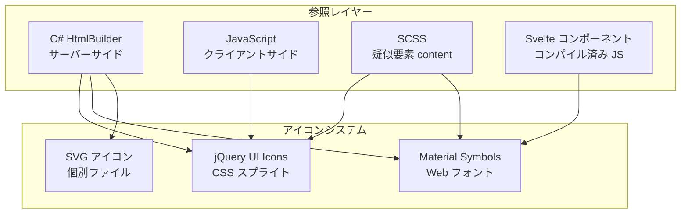
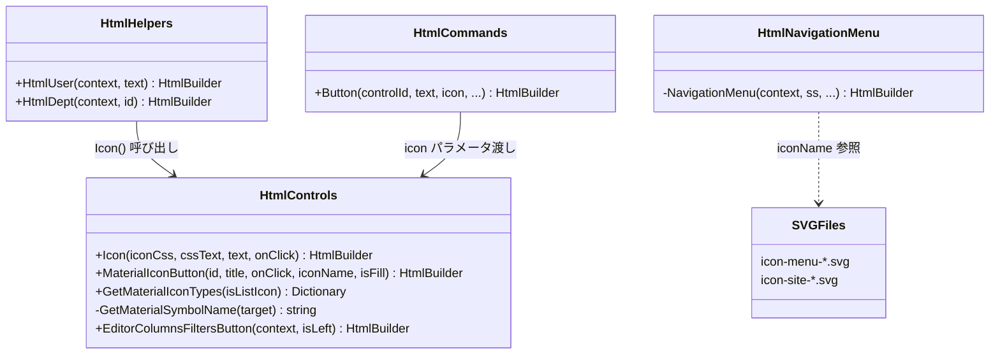

# アイコンシステム

プリザンターで使用されているアイコンシステム（jQuery UI Icons・Google Material Symbols・SVG アイコン）の種類・使用方法・インフラ構成を調査した。

<!-- START doctoc generated TOC please keep comment here to allow auto update -->
<!-- DON'T EDIT THIS SECTION, INSTEAD RE-RUN doctoc TO UPDATE -->

- [調査情報](#調査情報)
- [調査目的](#調査目的)
- [アイコンシステムの全体像](#アイコンシステムの全体像)
- [jQuery UI Icons](#jquery-ui-icons)
    - [概要](#概要)
    - [使用統計](#使用統計)
    - [C# ヘルパーメソッド](#c-ヘルパーメソッド)
- [Google Material Symbols](#google-material-symbols)
    - [概要](#概要-1)
    - [フォントファイル](#フォントファイル)
    - [`@font-face` 定義](#font-face-定義)
    - [使用アイコン一覧](#使用アイコン一覧)
    - [SCSS スタイリングの特徴](#scss-スタイリングの特徴)
- [SVG アイコン](#svg-アイコン)
    - [概要](#概要-2)
    - [ファイル一覧](#ファイル一覧)
    - [C# での参照方式](#c-での参照方式)
- [アイコン設定パラメータ](#アイコン設定パラメータ)
    - [`Parameters.General.HideCurrentUserIcon`](#parametersgeneralhidecurrentusericon)
    - [`DashboardPart.Icon`](#dashboardparticon)
    - [`Process.Icon`](#processicon)
    - [`Binaries_Icon` 定義](#binaries_icon-定義)
- [アイコンインフラ構成](#アイコンインフラ構成)
    - [ファイル配置図](#ファイル配置図)
    - [C# ヘルパーメソッド関係図](#c-ヘルパーメソッド関係図)
- [Font Awesome について](#font-awesome-について)
- [CodeDefiner によるアイコン関連コード生成](#codedefiner-によるアイコン関連コード生成)
- [jQuery UI Icons から Material Symbols へのマッピング提案](#jquery-ui-icons-から-material-symbols-へのマッピング提案)
    - [レトロフィット時の影響範囲](#レトロフィット時の影響範囲)
- [結論](#結論)
- [関連ソースコード](#関連ソースコード)

<!-- END doctoc generated TOC please keep comment here to allow auto update -->

## 調査情報

| 調査日     | リポジトリ | ブランチ           | タグ/バージョン    | コミット   | 備考     |
| ---------- | ---------- | ------------------ | ------------------ | ---------- | -------- |
| 2026-02-24 | Pleasanter | Pleasanter_1.5.1.0 | Pleasanter_1.5.1.0 | `34f162a4` | 初回調査 |

## 調査目的

プリザンターの UI で使用されているアイコンシステムの全体像を把握し、以下を明確にする。

- 使用されているアイコンライブラリの種類と役割分担
- アイコンの参照方法（C# サーバーサイド / JavaScript クライアントサイド / SCSS）
- アイコン関連のヘルパーメソッドとインフラ構成
- 各アイコンの使用箇所と使用頻度

---

## アイコンシステムの全体像

プリザンターでは **3 種類**のアイコンシステムが使用されている。

| アイコンシステム        | 用途                               | 参照方式                 | 配置場所                    |
| ----------------------- | ---------------------------------- | ------------------------ | --------------------------- |
| jQuery UI Icons         | ボタン・ツールバーアイコン         | CSS スプライト           | `PleasanterFrontend`        |
| Google Material Symbols | 新 UI コンポーネント               | Web フォント（リガチャ） | `PleasanterFrontend`        |
| SVG アイコン            | ナビゲーションメニュー・サイト種別 | インライン SVG / `` | `Implem.Pleasanter/wwwroot` |



---

## jQuery UI Icons

### 概要

jQuery UI 1.13.2 が提供する CSS スプライトベースのアイコンシステム。プリザンターのレガシー UI で最も広く使われている。

| 項目         | 値                                                                  |
| ------------ | ------------------------------------------------------------------- |
| バージョン   | jQuery UI 1.13.2（2023-01-20）                                      |
| アイコン方式 | CSS スプライト（PNG 画像 256×240px）                                |
| CSS クラス   | `ui-icon ui-icon-{name}` の 2 クラス構成                            |
| スプライト数 | 約 97 ファイル（カラーバリエーション違い）                          |
| 配置パス     | `PleasanterFrontend/wwwroot/src/clone/assets/images/ui-icons_*.png` |
| JS ファイル  | `PleasanterFrontend/wwwroot/src/plugins/jquery-ui.min.js`           |

### 使用統計

#### C# コード内の使用（612 参照、51 種類）

| アイコン名                     | 参照数 | 主な用途             |
| ------------------------------ | :----: | -------------------- |
| `ui-icon-circle-check`         |   85   | 確認・完了ボタン     |
| `ui-icon-disk`                 |   71   | 保存ボタン           |
| `ui-icon-cancel`               |   68   | キャンセルボタン     |
| `ui-icon-gear`                 |   49   | 設定ボタン           |
| `ui-icon-circle-triangle-s`    |   37   | 下方向ナビゲーション |
| `ui-icon-trash`                |   37   | 削除ボタン           |
| `ui-icon-circle-triangle-n`    |   35   | 上方向ナビゲーション |
| `ui-icon-circle-triangle-e`    |   28   | 右方向ナビゲーション |
| `ui-icon-circle-triangle-w`    |   28   | 左方向ナビゲーション |
| `ui-icon-copy`                 |   24   | コピーボタン         |
| `ui-icon-search`               |   16   | 検索ボタン           |
| `ui-icon-person`               |   14   | ユーザー関連         |
| `ui-icon-arrowreturnthick-1-w` |   11   | 戻るボタン           |
| `ui-icon-pencil`               |   10   | 編集ボタン           |
| `ui-icon-plus`                 |   9    | 追加ボタン           |
| `ui-icon-refresh`              |   8    | 更新ボタン           |
| その他 35 種類                 |  112   | 各種操作             |

#### C# で使用される全 jQuery UI アイコン一覧（51 種類）

| #   | アイコン名                                                |
| --- | --------------------------------------------------------- |
| 1   | `ui-icon-arrowreturnthick-1-e`                            |
| 2   | `ui-icon-arrowreturnthick-1-n`                            |
| 3   | `ui-icon-arrowreturnthick-1-w`                            |
| 4   | `ui-icon-arrowthickstop-1-n`                              |
| 5   | `ui-icon-arrowthickstop-1-s`                              |
| 6   | `ui-icon-calendar`                                        |
| 7   | `ui-icon-cancel`                                          |
| 8   | `ui-icon-check`                                           |
| 9   | `ui-icon-circle-arrow-n`                                  |
| 10  | `ui-icon-circle-arrow-w`                                  |
| 11  | `ui-icon-circle-check`                                    |
| 12  | `ui-icon-circle-close`                                    |
| 13  | `ui-icon-circle-triangle-e`                               |
| 14  | `ui-icon-circle-triangle-n`                               |
| 15  | `ui-icon-circle-triangle-s`                               |
| 16  | `ui-icon-circle-triangle-w`                               |
| 17  | `ui-icon-circle-zoomin`                                   |
| 18  | `ui-icon-clock`                                           |
| 19  | `ui-icon-close`                                           |
| 20  | `ui-icon-closethick`                                      |
| 21  | `ui-icon-contact`                                         |
| 22  | `ui-icon-copy`                                            |
| 23  | `ui-icon-disk`                                            |
| 24  | `ui-icon-extlink`                                         |
| 25  | `ui-icon-folder-open`                                     |
| 26  | `ui-icon-gear`                                            |
| 27  | `ui-icon-image`                                           |
| 28  | `ui-icon-info`                                            |
| 29  | `ui-icon-key`                                             |
| 30  | `ui-icon-link`                                            |
| 31  | `ui-icon-mail-closed`                                     |
| 32  | `ui-icon-minusthick`                                      |
| 33  | `ui-icon-notice`                                          |
| 34  | `ui-icon-pencil`                                          |
| 35  | `ui-icon-person`                                          |
| 36  | `ui-icon-play`                                            |
| 37  | `ui-icon-plus`                                            |
| 38  | `ui-icon-plusthick`                                       |
| 39  | `ui-icon-power`                                           |
| 40  | `ui-icon-refresh`                                         |
| 41  | `ui-icon-search`                                          |
| 42  | `ui-icon-seek-next`                                       |
| 43  | `ui-icon-seek-prev`                                       |
| 44  | `ui-icon-transferthick-e-w`                               |
| 45  | `ui-icon-trash`                                           |
| 46  | `ui-icon-triangle-1-e`                                    |
| 47  | `ui-icon-triangle-1-n`                                    |
| 48  | `ui-icon-triangle-1-s`                                    |
| 49  | `ui-icon-unlocked`                                        |
| 50  | `ui-icon-video`                                           |
| 51  | `ui-icon-Crosstab`（※大文字始まり、カスタム定義の可能性） |

#### JavaScript コード内の使用（15 参照、8 種類）

| アイコン名             | 参照数 | 使用ファイル                                          |
| ---------------------- | :----: | ----------------------------------------------------- |
| `ui-icon-pencil`       |   3    | `calendar.js`, `calendarevents.js`, `kambanevents.js` |
| `ui-icon-triangle-1-s` |   2    | `expand.js`, `jqueryui.js`                            |
| `ui-icon-circle-close` |   2    | `attachments.js`                                      |
| `ui-icon-trash`        |   2    | `attachments.js`                                      |
| `ui-icon-triangle-1-e` |   2    | `expand.js`                                           |
| `ui-icon-close`        |   2    | `basket.js`, `message.js`                             |
| `ui-icon-triangle-1-`  |   1    | `jqueryui.js`（動的生成）                             |

#### SCSS コード内の使用（37 参照、10 種類）

| アイコン名                  | 参照数 | 主な使用ファイル                                      |
| --------------------------- | :----: | ----------------------------------------------------- |
| `ui-icon-circle-triangle-w` |   15   | `style-responsive.scss`（レスポンシブ対応）           |
| `ui-icon-person`            |   8    | `legacy-responsive.scss`, `style.scss`                |
| `ui-icon-pencil`            |   3    | `legacy-responsive.scss`, `style-responsive.scss`     |
| `ui-icon-info`              |   3    | `legacy.scss`, `style-responsive.scss`                |
| `ui-icon-link`              |   2    | `style-responsive.scss`, `style.scss`                 |
| `ui-icon-clock`             |   2    | `legacy-responsive.scss`                              |
| `ui-icon-close`             |   1    | `style-responsive.scss`                               |
| `ui-icon-search`            |   1    | `style-responsive.scss`                               |
| `ui-icon-triangle-1-e`      |   1    | `style.scss`                                          |
| `ui-icon-white`             |   1    | `legacy.scss`（カラーバリエーション用カスタムクラス） |

### C# ヘルパーメソッド

jQuery UI アイコンは、主に以下の C# ヘルパーメソッドを通じてレンダリングされる。

#### `HtmlControls.Icon()` メソッド

**ファイル**: `Implem.Pleasanter/Libraries/HtmlParts/HtmlControls.cs`（行番号: 803-823）

```csharp
public static HtmlBuilder Icon(
    this HtmlBuilder hb,
    string iconCss = null,
    string cssText = null,
    string text = null,
    string onClick = null,
    bool _using = true)
{
    return _using
        ? hb
            .Span(
                css: "ui-icon " + iconCss,  // "ui-icon" ベースクラス + アイコン固有クラス
                attributes: new HtmlAttributes()
                    .OnClick(onClick))
            .Span(
                css: cssText,
                _using: text != string.Empty,
                action: () => hb
                    .Text(text: text))
        : hb;
}
```

#### `HtmlCommands.Button()` メソッド

**ファイル**: `Implem.Pleasanter/Libraries/HtmlParts/HtmlCommands.cs`（行番号: 626-640）

`icon` パラメータを通じてボタンにアイコンを付与する。
各 `*Utilities.cs`（`SiteUtilities.cs`、`TenantUtilities.cs`、`UserUtilities.cs` 等）から
`icon: "ui-icon-disk"` のように呼び出される。

#### `HtmlHelpers` ユーティリティ

**ファイル**: `Implem.Pleasanter/Libraries/HtmlParts/HtmlHelpers.cs`（行番号: 6-33）

```csharp
// ユーザーアイコン表示
public static HtmlBuilder HtmlUser(this HtmlBuilder hb, Context context, string text)
{
    return hb.P(css: "user", action: () => hb
        .Icon(iconCss: "ui-icon-person", text: text));
}

// 部署アイコン表示
public static HtmlBuilder HtmlDept(this HtmlBuilder hb, Context context, int id)
{
    return hb.P(css: "dept", action: () => hb
        .Icon(iconCss: "ui-icon-contact", text: SiteInfo.Dept(...).Name));
}
```

---

## Google Material Symbols

### 概要

Google Material Symbols Sharp を中心とした Web フォントベースのアイコンシステム。新しい UI コンポーネント（Svelte ベース）やエディタ列設定で採用されている。

| 項目           | 値                                                                  |
| -------------- | ------------------------------------------------------------------- |
| バリエーション | Outlined / Rounded / Sharp の 3 種                                  |
| 主に使用       | **Sharp** バリエーション                                            |
| アイコン方式   | Web フォントのリガチャ（テキストとしてアイコン名を記述）            |
| フォント形式   | woff2                                                               |
| 配置パス       | `PleasanterFrontend/wwwroot/src/plugins/material-symbols/`          |
| CSS 定義       | `PleasanterFrontend/wwwroot/src/plugins/material-symbols/index.css` |

### フォントファイル

| ファイル                          | バリエーション |
| --------------------------------- | -------------- |
| `material-symbols-outlined.woff2` | Outlined       |
| `material-symbols-rounded.woff2`  | Rounded        |
| `material-symbols-sharp.woff2`    | Sharp          |

### `@font-face` 定義

**ファイル**: `PleasanterFrontend/wwwroot/src/plugins/material-symbols/index.css`

```css
@font-face {
    font-family: 'Material Symbols Sharp';
    font-style: normal;
    font-weight: 100 700;
    font-display: block;
    src: url('./material-symbols-sharp.woff2') format('woff2');
}
.material-symbols-sharp {
    font-family: 'Material Symbols Sharp';
    font-weight: normal;
    font-style: normal;
    font-size: 24px;
    /* ... */
}
```

CSS の読み込みは `HtmlStyles.cs`（行番号: 120）で行われる。

```csharp
"assets/plugins/material-symbols/index.css"
```

CDN は使用せず、すべてローカルファイルから配信される。

### 使用アイコン一覧

Material Symbols は **3 つの参照方式**で使用される。

#### 1. C# `MaterialIconButton()` メソッド経由

**ファイル**: `Implem.Pleasanter/Libraries/HtmlParts/HtmlControls.cs`（行番号: 1149-1173）

```csharp
public static HtmlBuilder MaterialIconButton(
    this HtmlBuilder hb,
    string id = null,
    string title = null,
    string onClick = null,
    string action = null,
    string method = null,
    string iconName = null,
    bool isFill = true,
    bool _using = true)
{
    var css = $"material-symbols-sharp{(isFill ? " is-fill" : "")}";
    return hb.Button(
        attributes: new HtmlAttributes()
            .Id(id)
            .Title(title)
            .Class("button-icon ui-button ui-corner-all ui-widget applied")
            .OnClick(onClick)
            .DataAction(action)
            .DataMethod(method),
        action: () => hb
            .Span(
                css: css,
                action: () => hb.Text(text: iconName)));
}
```

C# から使用されるアイコン名:

| アイコン名             | 使用箇所                  |
| ---------------------- | ------------------------- |
| `keyboard_arrow_up`    | エディタ列 上移動ボタン   |
| `keyboard_arrow_down`  | エディタ列 下移動ボタン   |
| `keyboard_arrow_left`  | エディタ列 有効化ボタン   |
| `keyboard_arrow_right` | エディタ列 無効化ボタン   |
| `settings`             | エディタ列 詳細設定ボタン |
| `reset_settings`       | エディタ列 リセットボタン |

#### 2. C# `GetMaterialIconTypes()` マッピング

**ファイル**: `Implem.Pleasanter/Libraries/HtmlParts/HtmlControls.cs`（行番号: 1175-1210）

エディタ列の種別に応じた Material アイコンの自動マッピング。

```csharp
public static IReadOnlyDictionary<string, string> GetMaterialIconTypes(bool isListIcon = false)
{
    var iconTypesMap = new Dictionary<string, string>
    {
        ["basic"] = "apps",
        ["class"] = "text_fields",
        ["num"] = "timer_10",
        ["date"] = "calendar_month",
        ["description"] = "edit_note",
        ["check"] = "check",
        ["attachments"] = "attach_file",
    };
    if (isListIcon)
    {
        iconTypesMap["_Links-"] = "add_link";
        iconTypesMap["_Section-"] = "h_mobiledata";
    }
    return iconTypesMap;
}
```

#### 3. C# ダッシュボードのクイックアクセス

**ファイル**: `Implem.Pleasanter/Models/Dashboards/DashboardUtilities.cs`（行番号: 1734-1768）

サイト種別に応じたデフォルトアイコン:

| サイト種別     | デフォルトアイコン | CSS クラス                  |
| -------------- | ------------------ | --------------------------- |
| フォルダ       | `folder`           | `material-symbols-outlined` |
| ダッシュボード | `dashboard`        | `material-symbols-outlined` |
| Wiki           | `text_snippet`     | `material-symbols-outlined` |
| テーブル       | `table`            | `material-symbols-outlined` |
| その他         | `language`         | `material-symbols-outlined` |

`DashboardPart.Icon` プロパティでユーザーがカスタムアイコン名を指定可能。

#### 4. SCSS 疑似要素の `content` プロパティ

**ファイル**: `PleasanterFrontend/wwwroot/src/styles/style.scss` 他

| アイコン名           | 使用ファイル / 行番号     | 用途               |
| -------------------- | ------------------------- | ------------------ |
| `arrow_drop_up`      | `style.scss` L556         | ドロップ矢印（上） |
| `arrow_drop_down`    | `style.scss` L567         | ドロップ矢印（下） |
| `check`              | `style.scss` L797         | チェックマーク     |
| `link`               | `style.scss` L1169, L2389 | リンクアイコン     |
| `add_link`           | `style.scss` L1177        | リンク追加         |
| `expand_circle_down` | `style.scss` L1271        | 展開（下）         |
| `expand_circle_up`   | `style.scss` L1278        | 展開（上）         |
| `sync_saved_locally` | `style.scss` L1924        | 同期・保存状態     |
| `unfold_less`        | `legacy.scss` L4052       | 折りたたみ         |
| `unfold_more`        | `legacy.scss` L4059       | 展開               |

#### 5. Svelte コンポーネント（コンパイル済み）

**ファイル**: `Implem.Pleasanter/wwwroot/components/components_DR0K6XV1.js`

Svelte でビルドされたコンポーネント内で `material-symbols-sharp` クラスを使用。

| アイコン名          | 参照数 | 用途         |
| ------------------- | :----: | ------------ |
| `delete`            |   3    | 削除         |
| `drag_indicator`    |   3    | ドラッグ操作 |
| `place_item`        |   3    | 配置操作     |
| `settings`          |   2    | 設定         |
| `close`             |   2    | 閉じる       |
| `edit_square`       |   1    | 編集         |
| `lists`             |   1    | リスト表示   |
| `filter_alt`        |   1    | フィルタ     |
| `filter_alt_off`    |   1    | フィルタ解除 |
| `progress_activity` |   1    | 進捗表示     |
| `person`            |   1    | ユーザー     |
| `imagesmode`        |   1    | 画像モード   |
| `add_a_photo`       |   1    | 写真追加     |
| `schedule`          |   1    | スケジュール |
| `variable_remove`   |   1    | 変数削除     |
| `edit`              |   1    | 編集         |
| `cancel`            |   1    | キャンセル   |
| `arrow_drop_up`     |   1    | 矢印（上）   |
| `arrow_drop_down`   |   1    | 矢印（下）   |
| `zoom_in`           |   1    | ズームイン   |

#### その他の C# 直接参照

| 参照箇所                     | CSS クラス                  | 用途                 |
| ---------------------------- | --------------------------- | -------------------- |
| `HtmlComments.cs` L148       | `material-symbols-outlined` | コメント操作ボタン   |
| `HtmlControls.cs` L242       | `material-symbols-outlined` | パスワード表示切替   |
| `HtmlRecommendGuides.cs` L35 | `material-symbols-sharp`    | おすすめガイドボタン |
| `SiteUtilities.cs` L4744     | `material-symbols-outlined` | サイト種別アイコン   |

### SCSS スタイリングの特徴

**ファイル**: `PleasanterFrontend/wwwroot/src/styles/style.scss`

Material Symbols Sharp の SCSS 適用箇所は複数あり、`font-family: 'Material Symbols Sharp'` が
6 箇所で指定されている（L439, L537, L613, L781, L1138, L1255）。

`font-variation-settings: 'FILL' 1` で塗りつぶしアイコンを表現し、C# 側では `is-fill` CSS クラスで制御する。

---

## SVG アイコン

### 概要

ナビゲーションメニューとサイト種別表示に使用される 11 個の SVG ファイル。

| 項目       | 値                                                   |
| ---------- | ---------------------------------------------------- |
| 配置パス   | `Implem.Pleasanter/wwwroot/images/`                  |
| ファイル数 | 11                                                   |
| 参照方式   | C# コードで `iconName` パラメータとして指定          |
| 用途分類   | メニューアイコン（6 種）、サイト種別アイコン（5 種） |

### ファイル一覧

#### メニューアイコン（ナビゲーションバー）

| ファイル名                | 使用箇所             |
| ------------------------- | -------------------- |
| `icon-menu-new.svg`       | 「新規」メニュー     |
| `icon-menu-view-mode.svg` | 「表示」メニュー     |
| `icon-menu-settings.svg`  | 「管理」メニュー     |
| `icon-menu-help.svg`      | 「ヘルプ」メニュー   |
| `icon-menu-account.svg`   | 「ユーザーメニュー」 |
| `icon-menu-custom.svg`    | カスタムメニュー項目 |

#### サイト種別アイコン（サイト作成・ダッシュボード）

| ファイル名                 | サイト種別       |
| -------------------------- | ---------------- |
| `icon-site-sites.svg`      | フォルダ         |
| `icon-site-issues.svg`     | 期限付きテーブル |
| `icon-site-results.svg`    | 記録テーブル     |
| `icon-site-wikis.svg`      | Wiki             |
| `icon-site-dashboards.svg` | ダッシュボード   |

### C# での参照方式

**ファイル**: `Implem.Pleasanter/Libraries/HtmlParts/HtmlNavigationMenu.cs`（行番号: 196-332）

```csharp
switch (menu.ContainerId)
{
    case "NewMenuContainer":
        iconName = "icon-menu-new.svg";
        displayText = Displays.New(context: context);
        goto case "MenuContainer";
    case "ViewModeMenuContainer":
        iconName = "icon-menu-view-mode.svg";
        // ...
}
```

---

## アイコン設定パラメータ

### `Parameters.General.HideCurrentUserIcon`

| 項目         | 値                                               |
| ------------ | ------------------------------------------------ |
| 定義         | `ParameterAccessor/Parts/General.cs` L122        |
| デフォルト   | `false`                                          |
| 設定ファイル | `App_Data/Parameters/General.json` L102          |
| 用途         | ユーザーアイコン表示の制御                       |
| 参照箇所     | `HtmlFields.cs` L671, `TenantUtilities.cs` L2106 |

### `DashboardPart.Icon`

| 項目 | 値                                                       |
| ---- | -------------------------------------------------------- |
| 定義 | `Models/Dashboards/DashboardPart.cs` L19                 |
| 型   | `string`                                                 |
| 用途 | ダッシュボードのクイックアクセスにカスタムアイコンを設定 |

### `Process.Icon`

| 項目 | 値                                             |
| ---- | ---------------------------------------------- |
| 定義 | `Libraries/Settings/Process.cs` L56, L91, L144 |
| 型   | `string`                                       |
| 用途 | プロセスボタンにアイコンを設定                 |

### `Binaries_Icon` 定義

**ファイル**: `App_Data/Definitions/Definition_Column/Binaries_Icon.json`

```json
{
    "Id": "Binaries_Icon",
    "ModelName": "Binary",
    "TableName": "Binaries",
    "ColumnName": "Icon",
    "LabelText": "アイコン",
    "TypeName": "image"
}
```

バイナリテーブルの `Icon` カラム。ユーザーアバター画像等の格納に使用される。

---

## アイコンインフラ構成

### ファイル配置図

```text
Implem.Pleasanter/
├── wwwroot/
│   ├── images/
│   │   ├── icon-menu-*.svg          # メニューSVGアイコン（6個）
│   │   └── icon-site-*.svg          # サイト種別SVGアイコン（5個）
│   ├── favicon.ico                  # ファビコン
│   └── components/
│       └── components_DR0K6XV1.js   # Svelteコンパイル済み（Material Symbols使用）
│
Implem.PleasanterFrontend/
└── wwwroot/src/
    ├── plugins/
    │   ├── jquery-ui.min.js         # jQuery UI 1.13.2
    │   └── material-symbols/
    │       ├── index.css            # @font-face定義（3バリエーション）
    │       ├── material-symbols-outlined.woff2
    │       ├── material-symbols-rounded.woff2
    │       └── material-symbols-sharp.woff2
    ├── clone/assets/images/
    │   ├── ui-icons_*.png           # jQueryUIスプライトシート（約97個）
    │   └── editorColumns/
    │       └── popup-*.svg          # エディタ列説明用イラスト（33個）
    └── styles/
        ├── style.scss               # Material Symbols Sharp 参照（6箇所）
        ├── style-responsive.scss    # ui-icon-* レスポンシブ対応
        ├── legacy.scss              # Material Symbols Sharp 参照（1箇所）
        └── legacy-responsive.scss   # ui-icon-* レガシーレスポンシブ対応
```

### C# ヘルパーメソッド関係図



---

## Font Awesome について

Font Awesome は**使用されていない**。コードベース内に `fa-` クラスや Font Awesome CDN 参照は存在しない。
grep で検出される `[0-9A-Fa-f]` パターンは `mermaid.js` 等のライブラリ内の正規表現であり、
Font Awesome とは無関係である。

---

## CodeDefiner によるアイコン関連コード生成

CodeDefiner にはアイコン関連のコード自動生成処理は**確認されなかった**。アイコンの参照はすべて手動でコーディングされている。

---

## jQuery UI Icons から Material Symbols へのマッピング提案

jQuery UI Icons を Google Material Symbols (Sharp) へレトロフィットする際の対応表。

| #   | jQuery UI アイコン             | Material Symbols 候補   | 備考                       |
| --- | ------------------------------ | ----------------------- | -------------------------- |
| 1   | `ui-icon-arrowreturnthick-1-e` | `redo`                  | やり直し                   |
| 2   | `ui-icon-arrowreturnthick-1-n` | `publish`               | 上方向戻り                 |
| 3   | `ui-icon-arrowreturnthick-1-w` | `undo`                  | 元に戻す                   |
| 4   | `ui-icon-arrowthickstop-1-n`   | `vertical_align_top`    | 先頭へ移動                 |
| 5   | `ui-icon-arrowthickstop-1-s`   | `vertical_align_bottom` | 末尾へ移動                 |
| 6   | `ui-icon-calendar`             | `calendar_month`        | カレンダー                 |
| 7   | `ui-icon-cancel`               | `cancel`                | キャンセル                 |
| 8   | `ui-icon-check`                | `check`                 | チェック                   |
| 9   | `ui-icon-circle-arrow-n`       | `arrow_circle_up`       | 上方向矢印                 |
| 10  | `ui-icon-circle-arrow-w`       | `arrow_circle_left`     | 左方向矢印                 |
| 11  | `ui-icon-circle-check`         | `check_circle`          | 確認・完了                 |
| 12  | `ui-icon-circle-close`         | `cancel`                | 丸閉じ                     |
| 13  | `ui-icon-circle-triangle-e`    | `arrow_circle_right`    | 右ナビゲーション           |
| 14  | `ui-icon-circle-triangle-n`    | `arrow_circle_up`       | 上ナビゲーション           |
| 15  | `ui-icon-circle-triangle-s`    | `arrow_circle_down`     | 下ナビゲーション           |
| 16  | `ui-icon-circle-triangle-w`    | `arrow_circle_left`     | 左ナビゲーション           |
| 17  | `ui-icon-circle-zoomin`        | `zoom_in`               | ズームイン                 |
| 18  | `ui-icon-clock`                | `schedule`              | 時計                       |
| 19  | `ui-icon-close`                | `close`                 | 閉じる                     |
| 20  | `ui-icon-closethick`           | `close`                 | 閉じる（太字）             |
| 21  | `ui-icon-contact`              | `badge`                 | 連絡先・部署               |
| 22  | `ui-icon-copy`                 | `content_copy`          | コピー                     |
| 23  | `ui-icon-disk`                 | `save`                  | 保存                       |
| 24  | `ui-icon-extlink`              | `open_in_new`           | 外部リンク                 |
| 25  | `ui-icon-folder-open`          | `folder_open`           | フォルダ                   |
| 26  | `ui-icon-gear`                 | `settings`              | 設定                       |
| 27  | `ui-icon-image`                | `image`                 | 画像                       |
| 28  | `ui-icon-info`                 | `info`                  | 情報                       |
| 29  | `ui-icon-key`                  | `key`                   | 鍵                         |
| 30  | `ui-icon-link`                 | `link`                  | リンク                     |
| 31  | `ui-icon-mail-closed`          | `mail`                  | メール                     |
| 32  | `ui-icon-minusthick`           | `remove`                | マイナス                   |
| 33  | `ui-icon-notice`               | `warning`               | 警告                       |
| 34  | `ui-icon-pencil`               | `edit`                  | 編集                       |
| 35  | `ui-icon-person`               | `person`                | ユーザー                   |
| 36  | `ui-icon-play`                 | `play_arrow`            | 再生                       |
| 37  | `ui-icon-plus`                 | `add`                   | 追加                       |
| 38  | `ui-icon-plusthick`            | `add`                   | 追加（太字）               |
| 39  | `ui-icon-power`                | `power_settings_new`    | 電源・ログアウト           |
| 40  | `ui-icon-refresh`              | `refresh`               | 更新                       |
| 41  | `ui-icon-search`               | `search`                | 検索                       |
| 42  | `ui-icon-seek-next`            | `skip_next`             | 次へ                       |
| 43  | `ui-icon-seek-prev`            | `skip_previous`         | 前へ                       |
| 44  | `ui-icon-transferthick-e-w`    | `swap_horiz`            | 左右入替                   |
| 45  | `ui-icon-trash`                | `delete`                | 削除                       |
| 46  | `ui-icon-triangle-1-e`         | `arrow_right`           | 右三角                     |
| 47  | `ui-icon-triangle-1-n`         | `arrow_drop_up`         | 上三角                     |
| 48  | `ui-icon-triangle-1-s`         | `arrow_drop_down`       | 下三角                     |
| 49  | `ui-icon-unlocked`             | `lock_open`             | 解錠                       |
| 50  | `ui-icon-video`                | `videocam`              | 動画                       |
| 51  | `ui-icon-Crosstab`             | `pivot_table_chart`     | クロス集計（カスタム定義） |

### レトロフィット時の影響範囲

| 変更対象               | 影響ファイル数 | 影響参照数 | 備考                                                         |
| ---------------------- | :------------: | :--------: | ------------------------------------------------------------ |
| C# サーバーサイド      |      多数      |    612     | `*Utilities.cs` が大部分。`HtmlControls.Icon()` の改修が中心 |
| JavaScript             |       6        |     15     | `attachments.js`, `expand.js` 等。クラス名の文字列置換       |
| SCSS                   |       4        |     37     | `style.scss`, `style-responsive.scss`, `legacy*.scss`        |
| レンダリング方式の変更 |       —        |     —      | CSS スプライト → Web フォントリガチャへの変更が必要          |

`HtmlControls.Icon()` メソッドを Material Symbols 対応に改修すれば、C# 側の大部分は集約的に対応可能。
ただし SCSS のスタイル調整（`font-family` / `font-size` / `vertical-align` 等）が別途必要。

---

## 結論

| 項目               | 内容                                                                                 |
| ------------------ | ------------------------------------------------------------------------------------ |
| アイコンシステム数 | 3 種類（jQuery UI Icons / Material Symbols / SVG）                                   |
| jQuery UI Icons    | レガシー UI の主要アイコン。C# 612 参照・JS 15 参照・SCSS 37 参照・51 種類のアイコン |
| Material Symbols   | 新 UI コンポーネント向け。Sharp が主力、Outlined も一部使用                          |
| SVG アイコン       | ナビゲーションメニューとサイト種別に限定使用（11 個）                                |
| Font Awesome       | 未使用                                                                               |
| CDN                | 未使用（すべてローカルファイル配信）                                                 |
| C# ヘルパー        | `HtmlControls.Icon()`（jQuery UI）・`MaterialIconButton()`（Material）               |
| 移行状況           | jQuery UI Icons が依然主力だが、新機能では Material Symbols を採用する傾向           |
| カスタマイズ       | `DashboardPart.Icon`・`Process.Icon` でユーザー定義アイコンが可能                    |

---

## 関連ソースコード

| ファイル                                                                   | 内容                                      |
| -------------------------------------------------------------------------- | ----------------------------------------- |
| `Implem.Pleasanter/Libraries/HtmlParts/HtmlControls.cs`                    | `Icon()`, `MaterialIconButton()` メソッド |
| `Implem.Pleasanter/Libraries/HtmlParts/HtmlCommands.cs`                    | `Button()` メソッド（`icon` パラメータ）  |
| `Implem.Pleasanter/Libraries/HtmlParts/HtmlHelpers.cs`                     | `HtmlUser()`, `HtmlDept()` ユーティリティ |
| `Implem.Pleasanter/Libraries/HtmlParts/HtmlNavigationMenu.cs`              | SVG アイコン参照                          |
| `Implem.Pleasanter/Libraries/HtmlParts/HtmlStyles.cs`                      | Material Symbols CSS 読み込み             |
| `Implem.Pleasanter/Models/Sites/SiteUtilities.cs`                          | 最多アイコン参照ファイル                  |
| `Implem.Pleasanter/Models/Dashboards/DashboardUtilities.cs`                | クイックアクセスアイコンマッピング        |
| `Implem.PleasanterFrontend/wwwroot/src/plugins/material-symbols/index.css` | `@font-face` 定義                         |
| `Implem.PleasanterFrontend/wwwroot/src/styles/style.scss`                  | Material Symbols SCSS スタイル            |
| `Implem.PleasanterFrontend/wwwroot/src/styles/legacy.scss`                 | レガシースタイル（Material Symbols 含む） |
