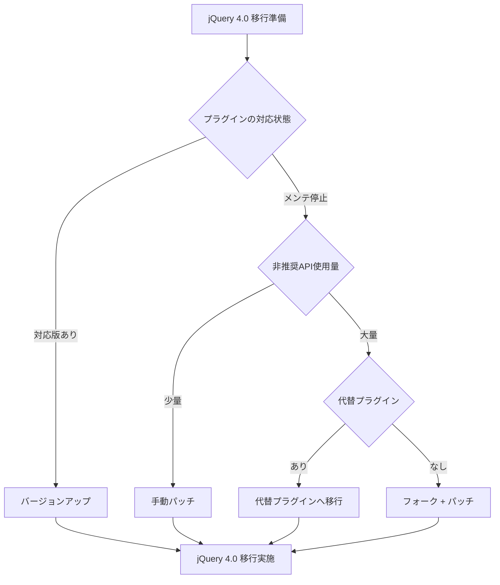

# jQuery 4.0 プラグイン互換性調査

プリザンターが同梱する jQuery プラグインについて、jQuery 4.0 で削除される非推奨 API の使用状況を調査し、互換性リスクと推奨対応をまとめる。

<!-- START doctoc generated TOC please keep comment here to allow auto update -->
<!-- DON'T EDIT THIS SECTION, INSTEAD RE-RUN doctoc TO UPDATE -->

- [調査情報](#調査情報)
- [調査目的](#調査目的)
- [調査対象](#調査対象)
    - [対象プラグイン一覧](#対象プラグイン一覧)
    - [jQuery 4.0 で削除される非推奨 API](#jquery-40-で削除される非推奨-api)
- [調査結果](#調査結果)
    - [1. jQuery UI v1.13.2](#1-jquery-ui-v1132)
    - [2. jQuery Validate v1.21.0](#2-jquery-validate-v1210)
    - [3. jquery.datetimepicker（xdsoft）](#3-jquerydatetimepickerxdsoft)
    - [4. jQuery File Upload（blueimp）](#4-jquery-file-uploadblueimp)
    - [5. jQuery MultiSelect（Eric Hynds）](#5-jquery-multiselecteric-hynds)
    - [6. Lightbox v2.11.4](#6-lightbox-v2114)
- [リスクサマリ](#リスクサマリ)
    - [プラグイン別リスク一覧](#プラグイン別リスク一覧)
    - [非推奨 API 別使用状況](#非推奨-api-別使用状況)
- [推奨対応方針](#推奨対応方針)
    - [優先度別アクションプラン](#優先度別アクションプラン)
    - [具体的アクション](#具体的アクション)
    - [一時的な互換策](#一時的な互換策)
- [結論](#結論)

<!-- END doctoc generated TOC please keep comment here to allow auto update -->

## 調査情報

| 調査日        | リポジトリ | ブランチ | タグ/バージョン    | コミット   | 備考                                    |
| ------------- | ---------- | -------- | ------------------ | ---------- | --------------------------------------- |
| 2026年2月24日 | Pleasanter | main     | Pleasanter_1.5.1.0 | `34f162a4` | jQuery 3.6.0 同梱バージョンを対象に調査 |

## 調査目的

プリザンターは jQuery 3.6.0 を使用しており、jQuery 4.0 へのアップグレードを検討するにあたり、
同梱するサードパーティ製 jQuery プラグインが jQuery 4.0 で動作するかを事前に評価する必要がある。
本調査では各プラグインにおける非推奨 API の使用状況を網羅的に調査し、
アップグレード時のリスクと対応方針を明確にする。

関連ドキュメント: [jQuery 4.0 アップグレード影響調査](012-jQuery4アップグレード影響調査.md)（プリザンター本体コードの調査）

---

## 調査対象

### 対象プラグイン一覧

プラグインファイルは `Implem.PleasanterFrontend/wwwroot/src/plugins/` に格納されている。

| #   | プラグイン            | バージョン         | ファイル                                                         | 形態     |
| --- | --------------------- | ------------------ | ---------------------------------------------------------------- | -------- |
| 1   | jQuery UI             | v1.13.2            | `jquery-ui.min.js`                                               | 圧縮済み |
| 2   | jQuery Validate       | v1.21.0            | `jquery.validate.min.js`                                         | 圧縮済み |
| 3   | jquery.datetimepicker | 不明（xdsoft）     | `jquery.datetimepicker/jquery.datetimepicker.full.min.js`        | 圧縮済み |
| 4   | jQuery File Upload    | 不明（blueimp）    | `jquery-file-upload/*.js` （8ファイル + vendor）                 | 非圧縮   |
| 5   | jQuery MultiSelect    | 不明（eric hynds） | `jquery.multiselect.min.js` / `jquery.multiselect.filter.min.js` | 圧縮済み |
| 6   | Lightbox              | v2.11.4            | `lightbox.min.js`                                                | 圧縮済み |

### jQuery 4.0 で削除される非推奨 API

以下の API が jQuery 4.0 で削除予定であり、検索対象とした。

| カテゴリ       | 削除 API         | 代替手段                         |
| -------------- | ---------------- | -------------------------------- |
| 型判定         | `$.type()`       | `typeof` / `instanceof`          |
| 型判定         | `$.isArray()`    | `Array.isArray()`                |
| 型判定         | `$.isFunction()` | `typeof x === 'function'`        |
| 型判定         | `$.isNumeric()`  | 自前実装                         |
| 型判定         | `$.isWindow()`   | 自前実装                         |
| 文字列         | `$.trim()`       | `String.prototype.trim()`        |
| JSON           | `$.parseJSON()`  | `JSON.parse()`                   |
| 日時           | `$.now()`        | `Date.now()`                     |
| ユーティリティ | `$.camelCase()`  | 自前実装                         |
| ユーティリティ | `$.nodeName()`   | `element.nodeName.toLowerCase()` |
| CSS            | `$.cssNumber`    | 内部 API                         |
| CSS            | `$.cssProps`     | 内部 API                         |
| イベント       | `event.which`    | `event.key` / `event.code`       |
| イベント       | `event.fixHooks` | `jQuery.event.addProp()`         |

> **注意**: 圧縮済みファイルでは jQuery がエイリアス変数に代入されている場合がある（jQuery UI → `V`、jQuery Validate → `a`、datetimepicker → `L` など）。検索時にはエイリアスも考慮した。

---

## 調査結果

### 1. jQuery UI v1.13.2

**ファイル**: `jquery-ui.min.js`

| 非推奨 API         | 検出数 | 備考                                |
| ------------------ | ------ | ----------------------------------- |
| `event.which`      | 3      | キーボード/マウスイベント判定に使用 |
| その他の非推奨 API | 0      | `$.isFunction`, `$.type` 等は未使用 |

**分析**:

- jQuery UI 1.13.x は jQuery 3.6 以降で動作するよう設計されており、`$.isFunction()` 等の代わりにネイティブの `typeof` や `Array.isArray()` を使用するよう既にリファクタリングされている
- `event.which` は jQuery 4.0 で正規化が削除されるが、`KeyboardEvent.which` / `MouseEvent.which` はブラウザのネイティブ API として存在しており、直ちに動作しなくなるわけではない
- ただし jQuery UI 1.13.2 は公式には jQuery 4.0 をサポートしていない

**jQuery 4.0 互換バージョン**: jQuery UI **1.14.x**（2024年リリース）が jQuery 4.0 を公式サポート

**リスク**: 中（jQuery UI 1.14.x へのアップデートで解消可能）

---

### 2. jQuery Validate v1.21.0

**ファイル**: `jquery.validate.min.js`

| 非推奨 API         | 検出数 | 備考                                               |
| ------------------ | ------ | -------------------------------------------------- |
| `event.which`      | 1      | `onkeyup` ハンドラ内でキー判定に使用               |
| その他の非推奨 API | 0      | `Array.isArray()` を使用済み（モダナイズ対応済み） |

**分析**:

- v1.21.0 では `$.isArray()` → `Array.isArray()`、`$.trim()` → ネイティブ `trim()` への移行が完了している
- `event.which` の使用は 1 箇所のみで、ブラウザネイティブの `KeyboardEvent.which` として動作するため実質影響なし

**jQuery 4.0 互換バージョン**: v1.21.0 で概ね互換。公式に jQuery 4.0 対応が明記された最新版の確認を推奨

**リスク**: 低

---

### 3. jquery.datetimepicker（xdsoft）

**ファイル**: `jquery.datetimepicker/jquery.datetimepicker.full.min.js`

> このファイルには DateFormatter、datetimepickerFactory、jQuery Mousewheel v3.1.12 が同梱されている。jQuery エイリアスは `L`。

| 非推奨 API       | 検出数 | 用途                               |
| ---------------- | ------ | ---------------------------------- |
| `$.isFunction()` | **15** | コールバック関数の存在チェック全般 |
| `$.isArray()`    | **10** | 配列引数のバリデーション           |
| `$.trim()`       | **5**  | 入力値のトリミング                 |
| `$.type()`       | **3**  | 型判定による分岐ロジック           |
| `event.which`    | 2      | マウスホイール・キーボードイベント |
| `event.fixHooks` | **2**  | mousewheel イベントの正規化パッチ  |
| **合計**         | **37** |                                    |

**分析**:

- **最もリスクの高いプラグイン**。jQuery 4.0 で削除される API を 37 箇所で使用
- `$.isFunction()` の 15 箇所はすべてコールバックオプション（`onShow`, `onClose`, `onSelectDate` 等）の
  呼び出し前チェックに使用されており、jQuery 4.0 では `TypeError` が発生する
- `event.fixHooks` は jQuery 3.3 で非推奨化されたイベント正規化の低レベル API であり、mousewheel プラグイン部分で使用。jQuery 4.0 では完全に削除される
- このプラグインは **開発が停止** している（GitHub: xdan/datetimepicker - 長期間メンテナンスなし）
- jQuery 4.0 対応バージョンは存在しない

**jQuery 4.0 互換バージョン**: **存在しない**

**リスク**: **高（最大リスク）**

**推奨対応**:

1. フォークして非推奨 API を手動パッチ（37 箇所）
2. 代替プラグインへの移行を検討（例: Flatpickr、Tempus Dominus 等）
3. jQuery Migrate プラグインを一時的に導入して互換性を維持

---

### 4. jQuery File Upload（blueimp）

**ディレクトリ**: `jquery-file-upload/`

| ファイル                        | 非推奨 API    | 検出数 |
| ------------------------------- | ------------- | ------ |
| `jquery.fileupload.js`          | `$.type()`    | 9      |
| `jquery.fileupload.js`          | `$.isArray()` | 2      |
| `jquery.fileupload-validate.js` | `$.type()`    | 2      |
| `jquery.fileupload-process.js`  | `$.type()`    | 1      |
| `jquery.fileupload-image.js`    | `$.type()`    | 1      |
| `jquery.fileupload-audio.js`    | `$.type()`    | 1      |
| `jquery.fileupload-video.js`    | `$.type()`    | 1      |
| `jquery.fileupload-ui.js`       | `$.isArray()` | 1      |
| `jquery.iframe-transport.js`    | `$.isArray()` | 1      |
| `vendor/jquery.ui.widget.js`    | なし          | 0      |
| **合計**                        |               | **19** |

**分析**:

- `$.type()` が 14 箇所、`$.isArray()` が 4 箇所で使用されており、jQuery 4.0 では動作しない
- `$.type()` は主にオプション値の型判定（`$.type(option) === 'string'` 等）に使用されている
- blueimp/jQuery-File-Upload の GitHub リポジトリはアーカイブ済み（2023年12月）
- 最終バージョン v10.32.0 でも同様の非推奨 API が残っている可能性がある

**jQuery 4.0 互換バージョン**: **確認できず**（リポジトリがアーカイブ済み）

**リスク**: **高**

**推奨対応**:

1. フォークして `$.type()` → `typeof` / カスタム関数、`$.isArray()` → `Array.isArray()` に置換（計 19 箇所、非圧縮ファイルのため修正は容易）
2. 長期的にはモダンなファイルアップロードライブラリへの移行を検討

---

### 5. jQuery MultiSelect（Eric Hynds）

**ファイル**: `jquery.multiselect.min.js` / `jquery.multiselect.filter.min.js`

| ファイル                           | 非推奨 API    | 検出数 | 用途                                                |
| ---------------------------------- | ------------- | ------ | --------------------------------------------------- |
| `jquery.multiselect.min.js`        | `event.which` | 11     | キーボードナビゲーション（矢印キー、Enter、Esc 等） |
| `jquery.multiselect.filter.min.js` | `event.which` | 4      | フィルタ入力のキーダウンハンドラ                    |
| **合計**                           |               | **15** |                                                     |

**分析**:

- 使用している非推奨 API は `event.which` のみ
- `event.which` はブラウザのネイティブ `KeyboardEvent.which` プロパティとして存在するため、jQuery 4.0 が正規化を削除しても直ちに動作しなくなる可能性は低い
- ただし jQuery 4.0 では `event.which` の正規化（`event.charCode` / `event.keyCode` からの合成）が行われなくなるため、古いブラウザでの互換性に影響がある
- このプラグインもメンテナンスが停止している

**jQuery 4.0 互換バージョン**: **確認できず**

**リスク**: 中（`event.which` のみのため影響は限定的）

**推奨対応**:

1. `event.which` → `event.key` / `event.code` への段階的移行
2. 最近のブラウザのみをサポート対象とする場合、そのままでも動作する可能性が高い

---

### 6. Lightbox v2.11.4

**ファイル**: `lightbox.min.js`

| 非推奨 API         | 検出数 | 用途                                       |
| ------------------ | ------ | ------------------------------------------ |
| `event.which`      | 3      | キーボードイベント（Esc / 矢印キー）の判定 |
| その他の非推奨 API | 0      |                                            |

**分析**:

- `event.which` のみの使用で、MultiSelect と同様にネイティブ API として存在するため実質的な影響は小さい
- Lightbox2 は GitHub で継続的にメンテナンスされている

**jQuery 4.0 互換バージョン**: 最新版で jQuery 4.0 対応が期待できるが、明確な宣言は未確認

**リスク**: 低

---

## リスクサマリ

### プラグイン別リスク一覧

| #   | プラグイン            | バージョン | 非推奨 API 合計 | リスク | jQuery 4.0 対応版 | メンテナンス状態 |
| --- | --------------------- | ---------- | --------------- | ------ | ----------------- | ---------------- |
| 1   | jQuery UI             | v1.13.2    | 3               | 中     | v1.14.x で対応    | 活発             |
| 2   | jQuery Validate       | v1.21.0    | 1               | 低     | ほぼ互換          | 活発             |
| 3   | jquery.datetimepicker | 不明       | **37**          | **高** | **なし**          | 停止             |
| 4   | jQuery File Upload    | 不明       | **19**          | **高** | **なし**          | アーカイブ       |
| 5   | jQuery MultiSelect    | 不明       | 15              | 中     | **なし**          | 停止             |
| 6   | Lightbox              | v2.11.4    | 3               | 低     | 未確認            | 活発             |
|     | **合計**              |            | **78**          |        |                   |                  |

### 非推奨 API 別使用状況

| 非推奨 API       | jQuery UI | Validate | datetimepicker | File Upload | MultiSelect | Lightbox | **合計** |
| ---------------- | --------- | -------- | -------------- | ----------- | ----------- | -------- | -------- |
| `$.type()`       | 0         | 0        | 3              | 15          | 0           | 0        | **18**   |
| `$.isFunction()` | 0         | 0        | 15             | 0           | 0           | 0        | **15**   |
| `$.isArray()`    | 0         | 0        | 10             | 4           | 0           | 0        | **14**   |
| `$.trim()`       | 0         | 0        | 5              | 0           | 0           | 0        | **5**    |
| `event.which`    | 3         | 1        | 2              | 0           | 15          | 3        | **24**   |
| `event.fixHooks` | 0         | 0        | 2              | 0           | 0           | 0        | **2**    |
| `$.parseJSON()`  | 0         | 0        | 0              | 0           | 0           | 0        | 0        |
| `$.now()`        | 0         | 0        | 0              | 0           | 0           | 0        | 0        |
| `$.isNumeric()`  | 0         | 0        | 0              | 0           | 0           | 0        | 0        |
| `$.isWindow()`   | 0         | 0        | 0              | 0           | 0           | 0        | 0        |
| **合計**         | **3**     | **1**    | **37**         | **19**      | **15**      | **3**    | **78**   |

---

## 推奨対応方針

### 優先度別アクションプラン

### 具体的アクション

| 優先度 | プラグイン            | 推奨アクション                                                    | 工数目安 |
| ------ | --------------------- | ----------------------------------------------------------------- | -------- |
| **P0** | jquery.datetimepicker | 代替プラグインへの移行（Flatpickr 等）またはフォーク+37箇所パッチ | 大       |
| **P0** | jQuery File Upload    | フォークして 19 箇所パッチ（非圧縮のため修正容易）                | 中       |
| **P1** | jQuery UI             | v1.14.x へアップデート                                            | 小       |
| **P2** | jQuery MultiSelect    | `event.which` → `event.key` へパッチ（15箇所）                    | 小〜中   |
| **P3** | Lightbox              | 最新版へアップデート確認                                          | 小       |
| **P3** | jQuery Validate       | 最新版で jQuery 4.0 互換を確認                                    | 小       |

### 一時的な互換策

jQuery 4.0 移行を段階的に進める場合、**jQuery Migrate 4.0** プラグインを一時的に導入することで、削除された API のポリフィルを提供できる。

**推奨の使い方**:

- jQuery Migrate は主に**プラグイン向け**の互換策として導入する
- 本体コード（`generals/`）の影響箇所（11+ `.css()` 数値渡し、3 `event.which`、 1 `.bind()`）は直接修正が容易なため、Migrate に頼らず先に修正する
- プラグインのパッチ・代替移行が完了した時点で Migrate を除去する

これは恒久的な解決策ではなく、最終的には各プラグインの修正・置換が必要。

---

## 結論

| 項目                | 結果                                                                     |
| ------------------- | ------------------------------------------------------------------------ |
| 調査対象            | 6 プラグイン（15 ファイル）                                              |
| 非推奨 API 使用合計 | **78 箇所**                                                              |
| 高リスクプラグイン  | jquery.datetimepicker（37箇所）、jQuery File Upload（19箇所）            |
| 中リスクプラグイン  | jQuery UI（対応版あり）、jQuery MultiSelect（`event.which` のみ）        |
| 低リスクプラグイン  | jQuery Validate、Lightbox                                                |
| 最大のブロッカー    | jquery.datetimepicker — メンテ停止・対応版なし・使用量最多               |
| 推奨アプローチ      | jQuery UI は v1.14.x へアップデート、その他は個別パッチまたは代替移行    |
| jQuery Migrate      | プラグイン向けの一時互換策として最小限の導入を推奨。本体コードは直接修正 |

jQuery 4.0 移行において、プラグインの互換性がプリザンター本体コードのリファクタリング以上に
大きなブロッカーとなる可能性が高い。特に **jquery.datetimepicker** と **jQuery File Upload** は
開発が停止しており、プリザンター側でフォーク・パッチを維持するか、
代替ライブラリへ移行する判断が必要である。
