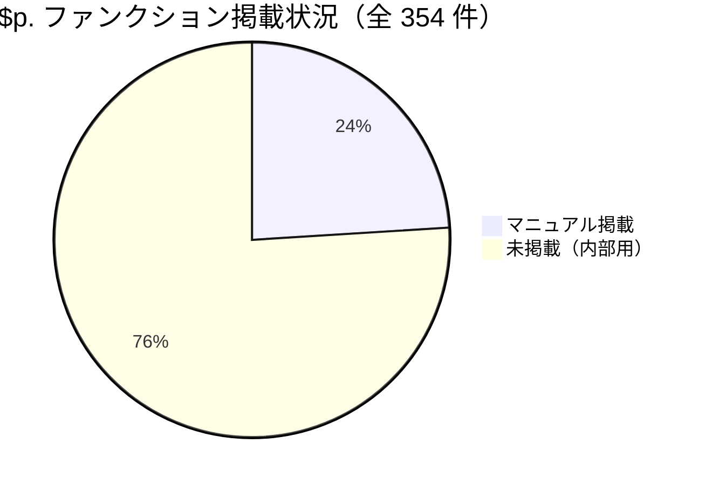
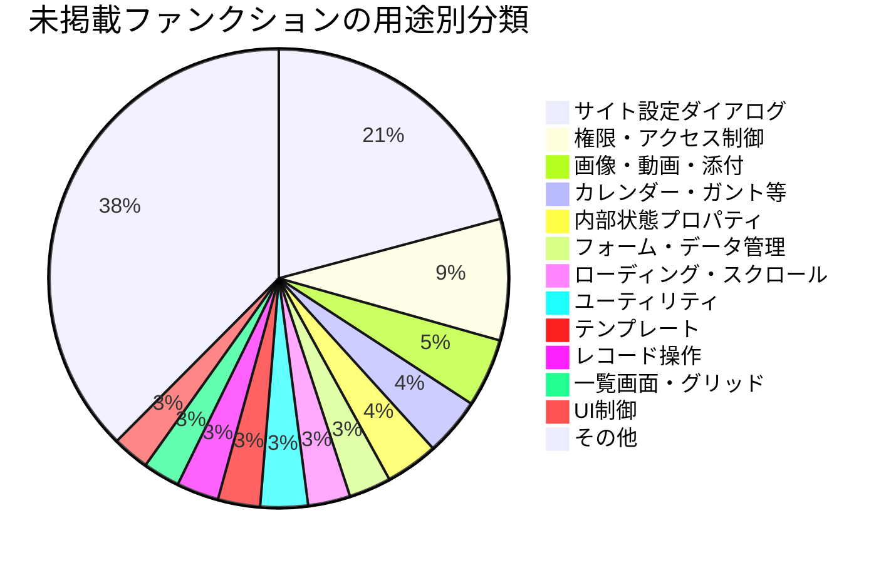

# $p ファンクション未掲載一覧

プリザンターのマニュアルサイトに掲載されている `$p.` ファンクションとソースコード上の定義を相互参照し、マニュアル未掲載のファンクションを洗い出した調査結果。

<!-- START doctoc generated TOC please keep comment here to allow auto update -->
<!-- DON'T EDIT THIS SECTION, INSTEAD RE-RUN doctoc TO UPDATE -->

- [調査情報](#調査情報)
- [調査目的](#調査目的)
- [調査方法](#調査方法)
    - [1. ソースコードからの抽出](#1-ソースコードからの抽出)
    - [2. マニュアル掲載ファンクションの特定](#2-マニュアル掲載ファンクションの特定)
    - [3. 差分分析](#3-差分分析)
- [マニュアル掲載済みファンクション一覧](#マニュアル掲載済みファンクション一覧)
    - [コンテキスト情報取得](#コンテキスト情報取得)
    - [DOM操作・値操作](#dom操作値操作)
    - [送信・通信](#送信通信)
    - [メッセージ](#メッセージ)
    - [一覧画面操作](#一覧画面操作)
    - [イベント](#イベント)
    - [ナビゲーション](#ナビゲーション)
    - [日付ユーティリティ](#日付ユーティリティ)
    - [ダイアログ](#ダイアログ)
    - [バリデーション](#バリデーション)
    - [API](#api)
    - [その他](#その他)
- [マニュアル未掲載ファンクション一覧](#マニュアル未掲載ファンクション一覧)
    - [内部イベントディスパッチ（8 件）](#内部イベントディスパッチ8-件)
    - [AJAX・通信関連（6 件）](#ajax通信関連6-件)
    - [フォーム・データ管理（8 件）](#フォームデータ管理8-件)
    - [ローディング・スクロール（8 件）](#ローディングスクロール8-件)
    - [一覧画面・グリッド操作（7 件）](#一覧画面グリッド操作7-件)
    - [ナビゲーション・ページ遷移（5 件）](#ナビゲーションページ遷移5-件)
    - [ダイアログ管理（3 件）](#ダイアログ管理3-件)
    - [サイト設定ダイアログ（52 件）](#サイト設定ダイアログ52-件)
    - [サイト設定確認ダイアログ（4 件）](#サイト設定確認ダイアログ4-件)
    - [権限管理（15 件）](#権限管理15-件)
    - [アクセス制御（8 件）](#アクセス制御8-件)
    - [ダッシュボード（6 件）](#ダッシュボード6-件)
    - [カレンダー・ガント・タイムシリーズ（10 件）](#カレンダーガントタイムシリーズ10-件)
    - [アナリティクス（1 件）](#アナリティクス1-件)
    - [レコード操作（7 件）](#レコード操作7-件)
    - [メール・通知（4 件）](#メール通知4-件)
    - [インポート・エクスポート（8 件）](#インポートエクスポート8-件)
    - [多言語ラベル（3 件）](#多言語ラベル3-件)
    - [テンプレート（7 件）](#テンプレート7-件)
    - [関連カラム（5 件）](#関連カラム5-件)
    - [カラム操作（6 件）](#カラム操作6-件)
    - [UI制御・レスポンシブ（7 件）](#ui制御レスポンシブ7-件)
    - [サイドメニュー（2 件）](#サイドメニュー2-件)
    - [アナウンスメント（1 件）](#アナウンスメント1-件)
    - [フィルタ・ビュー設定（5 件）](#フィルタビュー設定5-件)
    - [数値・日付範囲ダイアログ（8 件）](#数値日付範囲ダイアログ8-件)
    - [グループ管理（5 件）](#グループ管理5-件)
    - [画像・動画・添付ファイル（12 件）](#画像動画添付ファイル12-件)
    - [サイトメニュー（3 件）](#サイトメニュー3-件)
    - [バスケット（1 件）](#バスケット1-件)
    - [クリップボード・QRコード（2 件）](#クリップボードqrコード2-件)
    - [プロセス実行（2 件）](#プロセス実行2-件)
    - [パスワード（2 件）](#パスワード2-件)
    - [ユーティリティ（9 件）](#ユーティリティ9-件)
    - [内部状態プロパティ（9 件）](#内部状態プロパティ9-件)
- [分析結果](#分析結果)
    - [全体像](#全体像)
    - [未掲載ファンクションの分類](#未掲載ファンクションの分類)
    - [ユーザスクリプトから活用可能な未掲載ファンクション](#ユーザスクリプトから活用可能な未掲載ファンクション)
- [結論](#結論)
- [注意事項](#注意事項)
- [関連ソースコード](#関連ソースコード)
- [関連リンク](#関連リンク)

<!-- END doctoc generated TOC please keep comment here to allow auto update -->

## 調査情報

| 調査日        | リポジトリ | ブランチ | タグ/バージョン    | コミット    | 備考                                           |
| ------------- | ---------- | -------- | ------------------ | ----------- | ---------------------------------------------- |
| 2026年2月24日 | Pleasanter | main     | Pleasanter_1.5.1.0 | `34f162a43` | マニュアルサイト: pleasanter.org/manual/script |

## 調査目的

プリザンターのクライアントサイドスクリプトでは `$p.` から始まるグローバルオブジェクトに多数のファンクション・プロパティが定義されている。公式マニュアルに掲載されているものは利用者向けに設計された公開APIであるが、ソースコード上にはマニュアル未掲載の内部用ファンクションも多数存在する。これらを洗い出すことで、スクリプト開発時に活用可能な隠れたAPIや、誤って使用すべきでない内部関数を明確にする。

---

## 調査方法

### 1. ソースコードからの抽出

`Implem.PleasanterFrontend/wwwroot/src/scripts/generals/` 配下の全 JS/TS ファイルから `$p.` で始まるファンクション・プロパティ定義を抽出した。

```bash
grep -rn '\$p\.\w\+ =' --include="*.js" --include="*.ts" | grep -oP '\$p\.\w+' | sort -u
```

**結果**: 354 件の一意な `$p.` 名が検出された。

### 2. マニュアル掲載ファンクションの特定

公式マニュアル（`https://pleasanter.org/manual/script`）のスクリプトセクションに掲載されている `$p.` ファンクションの一覧を参照した。

### 3. 差分分析

ソースコード上の全定義からマニュアル掲載分を除外し、未掲載ファンクションを特定した。

---

## マニュアル掲載済みファンクション一覧

マニュアルに掲載されている `$p.` ファンクションは以下の通り（合計 85 件）。

### コンテキスト情報取得

| ファンクション       | 説明                   | 定義ファイル   |
| -------------------- | ---------------------- | -------------- |
| `$p.id()`            | レコードID取得         | `_elements.js` |
| `$p.ver()`           | バージョン取得         | `_elements.js` |
| `$p.siteId()`        | サイトID取得           | `_elements.js` |
| `$p.loginId()`       | ログインID取得         | `_elements.js` |
| `$p.userId()`        | ユーザID取得           | `_elements.js` |
| `$p.userName()`      | ユーザ名取得           | `_elements.js` |
| `$p.deptId()`        | 部署ID取得             | `_elements.js` |
| `$p.groupIds()`      | グループID配列取得     | `_elements.js` |
| `$p.referenceType()` | テーブル種別取得       | `_elements.js` |
| `$p.tableName()`     | テーブル名取得         | `siteinfo.js`  |
| `$p.controller()`    | コントローラ名取得     | `siteinfo.js`  |
| `$p.theme()`         | テーマ名取得           | `_elements.js` |
| `$p.responsive()`    | レスポンシブモード判定 | `_elements.js` |

### DOM操作・値操作

| ファンクション             | 説明                                        | 定義ファイル    |
| -------------------------- | ------------------------------------------- | --------------- |
| `$p.getControl(name)`      | 項目名からコントロール要素を取得            | `_elements.js`  |
| `$p.getField(name)`        | 項目名からフィールド要素を取得              | `_elements.js`  |
| `$p.getColumnName(name)`   | 表示名・カラム名からカラム名を取得          | `_elements.js`  |
| `$p.getValue(name)`        | 項目の値を取得                              | `_elements.js`  |
| `$p.set($control, val)`    | コントロールへの値設定と `$p.data` への格納 | `_data.js`      |
| `$p.setValue($ctrl, val)`  | コントロールの表示値のみ設定                | `_view.js`      |
| `$p.setData($control)`     | `$p.data` へのデータ格納                    | `_data.js`      |
| `$p.getData($control)`     | `$p.data` からデータ取得                    | `_data.js`      |
| `$p.clearData(target)`     | `$p.data` のデータクリア                    | `_data.js`      |
| `$p.clear($control)`       | コントロールのクリア                        | `_form.js`      |
| `$p.toJson($control)`      | 要素をJSON文字列に変換                      | `_data.js`      |
| `$p.insertText($ctrl,v)`   | テキストをカーソル位置に挿入                | `video.js`      |
| `$p.hideField(target,opt)` | フィールドの表示/非表示切り替え             | `visibility.js` |

### 送信・通信

| ファンクション                  | 説明                       | 定義ファイル |
| ------------------------------- | -------------------------- | ------------ |
| `$p.send($control)`             | AJAXでフォームデータを送信 | `_form.js`   |
| `$p.setAndSend(selector,$ctrl)` | データセット後に送信       | `_data.js`   |
| `$p.syncSend($control)`         | 同期的にデータを送信       | `_form.js`   |
| `$p.ajax(url,...)`              | AJAXリクエスト送信         | `_ajax.js`   |

### メッセージ

| ファンクション                 | 説明                 | 定義ファイル |
| ------------------------------ | -------------------- | ------------ |
| `$p.setMessage(target, value)` | メッセージ表示       | `message.js` |
| `$p.clearMessage()`            | メッセージクリア     | `message.js` |
| `$p.setErrorMessage(error)`    | エラーメッセージ表示 | `message.js` |

### 一覧画面操作

| ファンクション                | 説明                     | 定義ファイル   |
| ----------------------------- | ------------------------ | -------------- |
| `$p.getGridRow(id)`           | 一覧の行要素取得         | `_elements.js` |
| `$p.getGridCell(id, name)`    | 一覧のセル要素取得       | `_elements.js` |
| `$p.getGridColumnIndex(name)` | 一覧の列インデックス取得 | `_elements.js` |
| `$p.selectedIds()`            | 選択されたレコードID取得 | `grid.js`      |

### イベント

| ファンクション          | 説明                             | 定義ファイル   |
| ----------------------- | -------------------------------- | -------------- |
| `$p.on(events,name,fn)` | イベントハンドラを登録           | `_elements.js` |
| `$p.events`             | イベントハンドラ格納オブジェクト | `_init.js`     |

### ナビゲーション

| ファンクション          | 説明                           | 定義ファイル    |
| ----------------------- | ------------------------------ | --------------- |
| `$p.transition(url)`    | 指定URLへ画面遷移              | `navigation.js` |
| `$p.back()`             | 前のレコードへ戻る             | `navigation.js` |
| `$p.switchTargets()`    | 切り替え対象の配列取得         | `navigation.js` |
| `$p.setSwitchTargets()` | 切り替え対象の設定             | `navigation.js` |
| `$p.currentIndex()`     | 現在のレコードインデックス取得 | `navigation.js` |
| `$p.setCurrentIndex()`  | 現在のレコードインデックス設定 | `navigation.js` |

### 日付ユーティリティ

| ファンクション                       | 説明                 | 定義ファイル |
| ------------------------------------ | -------------------- | ------------ |
| `$p.dateAdd(type, num, date)`        | 日付加算             | `_time.js`   |
| `$p.dateDiff(type, date1, date2)`    | 日付差分             | `_time.js`   |
| `$p.shortDate(date)`                 | 短い日付オブジェクト | `_time.js`   |
| `$p.shortDateString(date)`           | 短い日付文字列       | `_time.js`   |
| `$p.dateTimeString(date)`            | 日時文字列           | `_time.js`   |
| `$p.dateTimeFormatString(date, fmt)` | 書式指定日時文字列   | `_time.js`   |
| `$p.beginningMonth(date)`            | 月初日取得           | `_time.js`   |
| `$p.transferedDate(fmt, str)`        | 日付書式変換         | `_time.js`   |

### ダイアログ

| ファンクション          | 説明               | 定義ファイル |
| ----------------------- | ------------------ | ------------ |
| `$p.openDialog($ctrl)`  | ダイアログを開く   | `dialog.js`  |
| `$p.closeDialog($ctrl)` | ダイアログを閉じる | `dialog.js`  |

### バリデーション

| ファンクション                   | 説明                       | 定義ファイル   |
| -------------------------------- | -------------------------- | -------------- |
| `$p.formValidate($form, $ctrl)`  | フォームバリデーション実行 | `validator.js` |
| `$p.applyValidator()`            | バリデータ適用             | `validator.js` |
| `$p.setValidationError($form)`   | バリデーションエラー表示   | `validator.js` |
| `$p.parseCurrencyString(v,lang)` | 通貨文字列の数値変換       | `validator.js` |

### API

| ファンクション                 | 説明                    | 定義ファイル |
| ------------------------------ | ----------------------- | ------------ |
| `$p.apiUrl(id, action, ctrl)`  | API URLの生成           | `_api.js`    |
| `$p.apiGet(args)`              | レコード取得            | `_api.js`    |
| `$p.apiCreate(args)`           | レコード作成            | `_api.js`    |
| `$p.apiUpdate(args)`           | レコード更新            | `_api.js`    |
| `$p.apiDelete(args)`           | レコード削除            | `_api.js`    |
| `$p.apiUpsert(args)`           | レコードUpsert          | `_api.js`    |
| `$p.apiBulkDelete(args)`       | 一括削除                | `_api.js`    |
| `$p.apiExec(url, args)`        | 拡張SQL実行/汎用API実行 | `_api.js`    |
| `$p.apiGetSite(args)`          | サイト情報取得          | `_api.js`    |
| `$p.apiCreateSite(args)`       | サイト作成              | `_api.js`    |
| `$p.apiUpdateSite(args)`       | サイト更新              | `_api.js`    |
| `$p.apiDeleteSite(args)`       | サイト削除              | `_api.js`    |
| `$p.apiUsersGet(args)`         | ユーザ取得              | `_api.js`    |
| `$p.apiUsersCreate(args)`      | ユーザ作成              | `_api.js`    |
| `$p.apiUsersUpdate(args)`      | ユーザ更新              | `_api.js`    |
| `$p.apiUsersDelete(args)`      | ユーザ削除              | `_api.js`    |
| `$p.apiGroupsGet(args)`        | グループ取得            | `_api.js`    |
| `$p.apiGroupsCreate(args)`     | グループ作成            | `_api.js`    |
| `$p.apiGroupsUpdate(args)`     | グループ更新            | `_api.js`    |
| `$p.apiGroupsDelete(args)`     | グループ削除            | `_api.js`    |
| `$p.apiDeptsGet(args)`         | 部署取得                | `_api.js`    |
| `$p.apiSendMail(args)`         | メール送信              | `_api.js`    |
| `$p.apiCopySitePackage(args)`  | サイトパッケージコピー  | `_api.js`    |
| `$p.apiGetClosestSiteId(args)` | 最も近いサイトID取得    | `_api.js`    |

### その他

| ファンクション                | 説明                           | 定義ファイル   |
| ----------------------------- | ------------------------------ | -------------- |
| `$p.data`                     | フォームデータ格納オブジェクト | `_init.js`     |
| `$p.ex`                       | 拡張用オブジェクト             | `_init.js`     |
| `$p.createGuid()`             | GUID生成                       | `util.js`      |
| `$p.formChanged`              | フォーム変更フラグ             | `_form.js`     |
| `$p.setFormChanged($ctrl)`    | フォーム変更状態の設定         | `_form.js`     |
| `$p.getFormId($control)`      | フォームID取得                 | `_form.js`     |
| `$p.isForm()`                 | フォーム判定                   | `forms.js`     |
| `$p.viewMode($control)`       | ビューモード取得/切り替え      | `viewmode.js`  |
| `$p.setByJson(url,...)`       | JSONレスポンスの一括適用       | `_dispatch.js` |
| `$p.setByJsonElement(el,...)` | JSON要素の個別適用             | `_dispatch.js` |
| `$p.display(key)`             | 多言語表示文字列の取得         | `display.ts`   |

---

## マニュアル未掲載ファンクション一覧

以下はソースコード上に定義されているが、マニュアルに掲載されていないファンクション（合計 269 件）。用途別に分類した。

### 内部イベントディスパッチ（8 件）

内部のイベント処理パイプラインで使用される関数。`$p.events` オブジェクトに登録されたハンドラを呼び出す仕組み。

| ファンクション          | 説明                             | 定義ファイル |
| ----------------------- | -------------------------------- | ------------ |
| `$p.eventArgs(...)`     | イベント引数オブジェクトの生成   | `_event.js`  |
| `$p.execEvents(ev,arg)` | イベントハンドラの実行           | `_event.js`  |
| `$p.before_setData()`   | `before_setData` イベントの発火  | `_event.js`  |
| `$p.after_setData()`    | `after_setData` イベントの発火   | `_event.js`  |
| `$p.before_validate()`  | `before_validate` イベントの発火 | `_event.js`  |
| `$p.after_validate()`   | `after_validate` イベントの発火  | `_event.js`  |
| `$p.before_send()`      | `before_send` イベントの発火     | `_event.js`  |
| `$p.after_send()`       | `after_send` イベントの発火      | `_event.js`  |
| `$p.before_set()`       | `before_set` イベントの発火      | `_event.js`  |
| `$p.after_set()`        | `after_set` イベントの発火       | `_event.js`  |

### AJAX・通信関連（6 件）

| ファンクション                             | 説明                        | 定義ファイル            |
| ------------------------------------------ | --------------------------- | ----------------------- |
| `$p.multiUpload(url,...)`                  | 複数ファイルアップロード    | `_ajax.js`              |
| `$p.captcha`                               | CAPTCHA処理オブジェクト     | `_ajax.js`              |
| `$p.apiSendMailUrl(id)`                    | メール送信用APIのURL生成    | `_api.js`               |
| `$p.apiBulkDeleteExec(url, args)`          | 一括削除の実行本体          | `_api.js`               |
| `$p.addUrlParameter(url, key, val)`        | URLへのクエリパラメータ追加 | `_form.js`              |
| `$p.addAuthenticationByMailParameter(url)` | メール認証パラメータ付与    | `authenticatebymail.js` |

### フォーム・データ管理（8 件）

| ファンクション                           | 説明                             | 定義ファイル     |
| ---------------------------------------- | -------------------------------- | ---------------- |
| `$p.setGridTimestamp($ctrl, data)`       | グリッド行のタイムスタンプ設定   | `_data.js`       |
| `$p.setMustData($form, action)`          | 必須データの収集・設定           | `_data.js`       |
| `$p.outsideDialog($control)`             | コントロールがダイアログ外か判定 | `_form.js`       |
| `$p.setMultiSelectData($control)`        | 複数選択コントロールのデータ設定 | `multiselect.js` |
| `$p.selectMultiSelect($ctrl, json)`      | 複数選択コントロールの選択操作   | `multiselect.js` |
| `$p.RefreshMultiSelectRelatingColum($t)` | 関連カラムの複数選択リフレッシュ | `multiselect.js` |
| `$p.changeMultiSelect($control)`         | 複数選択コントロールの変更処理   | `multiselect.js` |
| `$p.setIncludeExportData($ctrl)`         | エクスポートデータの包含設定     | `sitepackage.js` |

### ローディング・スクロール（8 件）

| ファンクション                 | 説明                       | 定義ファイル |
| ------------------------------ | -------------------------- | ------------ |
| `$p.loading($control)`         | ローディング表示開始       | `loading.js` |
| `$p.loaded()`                  | ローディング表示終了       | `loading.js` |
| `$p.loadScroll()`              | スクロール位置の復元       | `scroll.js`  |
| `$p.saveScroll()`              | スクロール位置の保存       | `scroll.js`  |
| `$p.clearScroll()`             | スクロール位置のクリア     | `scroll.js`  |
| `$p.clearScrollTop(controlId)` | スクロールトップ位置クリア | `scroll.js`  |
| `$p.paging(selector)`          | ページネーション処理       | `scroll.js`  |
| `$p.setPaging(ctrlId, offId)`  | ページング設定             | `scroll.js`  |

### 一覧画面・グリッド操作（7 件）

| ファンクション                 | 説明                       | 定義ファイル |
| ------------------------------ | -------------------------- | ------------ |
| `$p.setGrid()`                 | 一覧画面のグリッド設定     | (未確認)     |
| `$p.setDashboardGrid()`        | ダッシュボードグリッド設定 | `grid.js`    |
| `$p.openEditorDialog(id)`      | 編集ダイアログを開く       | `grid.js`    |
| `$p.editOnGrid($control, val)` | インライン編集開始         | `grid.js`    |
| `$p.newOnGrid($control)`       | グリッド上での新規行作成   | `grid.js`    |
| `$p.copyRow($control)`         | 行のコピー                 | `grid.js`    |
| `$p.cancelNewRow($control)`    | 新規行のキャンセル         | `grid.js`    |

### ナビゲーション・ページ遷移（5 件）

| ファンクション               | 説明                     | 定義ファイル      |
| ---------------------------- | ------------------------ | ----------------- |
| `$p.ssoLogin($control)`      | SSO ログイン処理         | `navigation.js`   |
| `$p.move($control)`          | レコード移動             | `move.js`         |
| `$p.changePasswordAtLogin()` | ログイン時パスワード変更 | `security.js`     |
| `$p.returnOriginalUser()`    | 元のユーザに戻る         | (未確認)          |
| `$p.showPassword()`          | パスワード表示切り替え   | `showpassword.js` |

### ダイアログ管理（3 件）

| ファンクション                | 説明                       | 定義ファイル      |
| ----------------------------- | -------------------------- | ----------------- |
| `$p.clearDialogs()`           | 全ダイアログのクリア       | `dialog.js`       |
| `$p.openHtmlDialog($control)` | HTMLダイアログを開く       | `sitesettings.js` |
| `$p.openResponsiveMenu()`     | レスポンシブメニューを開く | (未確認)          |

### サイト設定ダイアログ（52 件）

テーブルの管理画面で使用されるダイアログの開閉・設定関数群。ユーザスクリプトからの直接呼び出しは想定されていない。

| ファンクション                              | 説明                             | 定義ファイル      |
| ------------------------------------------- | -------------------------------- | ----------------- |
| `$p.openSiteSettingsDialog($ctrl,...)`      | サイト設定ダイアログを開く       | `sitesettings.js` |
| `$p.openGridColumnDialog($control)`         | 一覧カラム設定ダイアログ         | `sitesettings.js` |
| `$p.setGridColumn($control)`                | 一覧カラム設定の反映             | `sitesettings.js` |
| `$p.openFilterColumnDialog($control)`       | フィルタカラム設定ダイアログ     | `sitesettings.js` |
| `$p.openAggregationDetailsDialog($ctrl)`    | 集計詳細設定ダイアログ           | `sitesettings.js` |
| `$p.setAggregationDetails($control)`        | 集計詳細の反映                   | `sitesettings.js` |
| `$p.openEditorColumnDialog($control)`       | エディタカラム設定ダイアログ     | `sitesettings.js` |
| `$p.resetEditorColumn($control)`            | エディタカラムのリセット         | `sitesettings.js` |
| `$p.openTabDialog($control)`                | タブ設定ダイアログ               | `sitesettings.js` |
| `$p.openSummaryDialog($control)`            | 集計設定ダイアログ               | `sitesettings.js` |
| `$p.setSummary($control)`                   | 集計設定の反映                   | `sitesettings.js` |
| `$p.openFormulaDialog($control)`            | 計算式設定ダイアログ             | `sitesettings.js` |
| `$p.openProcessDialog($control)`            | プロセス設定ダイアログ           | `sitesettings.js` |
| `$p.openStatusControlDialog($ctrl)`         | 状態制御設定ダイアログ           | `sitesettings.js` |
| `$p.setStatusControlColumnHash($ctrl)`      | 状態制御カラムハッシュ設定       | `sitesettings.js` |
| `$p.openProcessValidateInputDialog($ctrl)`  | プロセス入力検証ダイアログ       | `sitesettings.js` |
| `$p.openProcessDataChangeDialog($ctrl)`     | プロセスデータ変更ダイアログ     | `sitesettings.js` |
| `$p.openProcessNotificationDialog($ctrl)`   | プロセス通知ダイアログ           | `sitesettings.js` |
| `$p.openViewDialog($control)`               | ビュー設定ダイアログ             | `sitesettings.js` |
| `$p.openNotificationDialog($control)`       | 通知設定ダイアログ               | `sitesettings.js` |
| `$p.setNotification($control)`              | 通知設定の反映                   | `sitesettings.js` |
| `$p.openReminderDialog($control)`           | リマインダ設定ダイアログ         | `sitesettings.js` |
| `$p.setReminder($control)`                  | リマインダ設定の反映             | `sitesettings.js` |
| `$p.openExportDialog($control)`             | エクスポート設定ダイアログ       | `sitesettings.js` |
| `$p.setExport($control)`                    | エクスポート設定の反映           | `sitesettings.js` |
| `$p.openExportColumnsDialog($ctrl)`         | エクスポートカラムダイアログ     | `sitesettings.js` |
| `$p.setExportColumn($control)`              | エクスポートカラム設定の反映     | `sitesettings.js` |
| `$p.openScriptDialog($control)`             | スクリプト設定ダイアログ         | `sitesettings.js` |
| `$p.setScript($control)`                    | スクリプト設定の反映             | `sitesettings.js` |
| `$p.setHtml($control)`                      | HTML設定の反映                   | `sitesettings.js` |
| `$p.openServerScriptDialog($ctrl)`          | サーバスクリプト設定ダイアログ   | `sitesettings.js` |
| `$p.setServerScript($control)`              | サーバスクリプト設定の反映       | `sitesettings.js` |
| `$p.openStyleDialog($control)`              | スタイル設定ダイアログ           | `sitesettings.js` |
| `$p.setStyle($control)`                     | スタイル設定の反映               | `sitesettings.js` |
| `$p.addSummary($control)`                   | 集計の追加                       | `sitesettings.js` |
| `$p.openBulkUpdateColumnDialog($ctrl)`      | 一括更新カラム設定ダイアログ     | `sitesettings.js` |
| `$p.setBulkUpdateColumn($control)`          | 一括更新カラム設定の反映         | `sitesettings.js` |
| `$p.openBulkUpdateColumnDetailDialog($c)`   | 一括更新カラム詳細ダイアログ     | `sitesettings.js` |
| `$p.setBulkUpdateColumnDetail($ctrl)`       | 一括更新カラム詳細の反映         | `sitesettings.js` |
| `$p.openRelatingColumnDialog($ctrl)`        | 関連カラム設定ダイアログ         | `sitesettings.js` |
| `$p.setRelatingColumn($control)`            | 関連カラム設定の反映             | `sitesettings.js` |
| `$p.openDashboardPartDialog($ctrl)`         | ダッシュボードパーツダイアログ   | `sitesettings.js` |
| `$p.setDashboardPart($control)`             | ダッシュボードパーツの反映       | `sitesettings.js` |
| `$p.openDashboardPartTimeLineSitesDialog()` | タイムラインサイト選択ダイアログ | `sitesettings.js` |
| `$p.openDashboardPartCalendarSitesDialog()` | カレンダーサイト選択ダイアログ   | `sitesettings.js` |
| `$p.openDashboardPartKambanSitesDialog()`   | カンバンサイト選択ダイアログ     | `sitesettings.js` |
| `$p.openDashboardPartIndexSitesDialog()`    | インデックスサイト選択ダイアログ | `sitesettings.js` |
| `$p.updateDashboardPartTimeLineSites()`     | タイムラインサイト更新           | `sitesettings.js` |
| `$p.openSearchEditorColumnDialog($ctrl)`    | エディタカラム検索ダイアログ     | `sitesettings.js` |
| `$p.selectSearchEditorColumn(value)`        | エディタカラム検索結果選択       | `sitesettings.js` |
| `$p.toggleSitesForm(checkbox)`              | サイトフォーム表示切替           | `sitesettings.js` |
| `$p.openServerScriptScheduleDialog($ctrl)`  | サーバスクリプトスケジュール設定 | `tenants.js`      |

### サイト設定確認ダイアログ（4 件）

| ファンクション                   | 説明                   | 定義ファイル      |
| -------------------------------- | ---------------------- | ----------------- |
| `$p.confirmTimeLineSites(value)` | タイムラインサイト確認 | `sitesettings.js` |
| `$p.confirmCalendarSites(value)` | カレンダーサイト確認   | `sitesettings.js` |
| `$p.confirmKambanSites(value)`   | カンバンサイト確認     | `sitesettings.js` |
| `$p.confirmIndexSites(value)`    | インデックスサイト確認 | `sitesettings.js` |

### 権限管理（15 件）

| ファンクション                              | 説明                         | 定義ファイル             |
| ------------------------------------------- | ---------------------------- | ------------------------ |
| `$p.setPermissions($control)`               | 権限設定の反映               | `permission.js`          |
| `$p.openPermissionsDialog($ctrl)`           | 権限ダイアログを開く         | `permission.js`          |
| `$p.changePermissions($control)`            | 権限の変更                   | `permission.js`          |
| `$p.setPermissionForCreating($ctrl)`        | 作成権限の設定               | `permission.js`          |
| `$p.openPermissionForCreatingDialog($ctrl)` | 作成権限ダイアログ           | `permission.js`          |
| `$p.setPermissionForUpdating($ctrl)`        | 更新権限の設定               | `permission.js`          |
| `$p.openPermissionForUpdatingDialog($ctrl)` | 更新権限ダイアログ           | `permission.js`          |
| `$p.changePermissionForCreating($ctrl)`     | 作成権限の変更               | `permission.js`          |
| `$p.changePermissionForUpdating($ctrl)`     | 更新権限の変更               | `permission.js`          |
| `$p.destroyPermissionsDialog(e)`            | 権限ダイアログの破棄         | `permission.js`          |
| `$p.setPermissionEvents()`                  | 権限イベントの設定           | (未確認)                 |
| `$p.addColumnAccessControl()`               | カラムアクセス制御の追加     | `columnaccesscontrol.js` |
| `$p.deleteColumnAccessControl()`            | カラムアクセス制御の削除     | `columnaccesscontrol.js` |
| `$p.changeColumnAccessControl($ctrl,type)`  | カラムアクセス制御の変更     | `columnaccesscontrol.js` |
| `$p.openColumnAccessControlDialog()`        | カラムアクセス制御ダイアログ | (未確認)                 |

### アクセス制御（8 件）

| ファンクション                          | 説明                           | 定義ファイル       |
| --------------------------------------- | ------------------------------ | ------------------ |
| `$p.addViewAccessControl()`             | ビューアクセス制御の追加       | (未確認)           |
| `$p.deleteViewAccessControl()`          | ビューアクセス制御の削除       | `view.js`          |
| `$p.addExportAccessControl()`           | エクスポートアクセス制御の追加 | `export.js`        |
| `$p.deleteExportAccessControl()`        | エクスポートアクセス制御の削除 | `export.js`        |
| `$p.addProcessAccessControl()`          | プロセスアクセス制御の追加     | (未確認)           |
| `$p.deleteProcessAccessControl()`       | プロセスアクセス制御の削除     | `process.js`       |
| `$p.addStatusControlAccessControl()`    | 状態制御アクセス制御の追加     | (未確認)           |
| `$p.deleteStatusControlAccessControl()` | 状態制御アクセス制御の削除     | `statuscontrol.js` |

### ダッシュボード（6 件）

| ファンクション                          | 説明                               | 定義ファイル   |
| --------------------------------------- | ---------------------------------- | -------------- |
| `$p.updateDashboardPartLayouts()`       | ダッシュボードパーツレイアウト更新 | `dashboard.js` |
| `$p.addDashboardPartAccessControl()`    | ダッシュボードアクセス制御追加     | `dashboard.js` |
| `$p.deleteDashboardPartAccessControl()` | ダッシュボードアクセス制御削除     | `dashboard.js` |
| `$p.setDashboardAsync()`                | ダッシュボード非同期設定           | `dashboard.js` |
| `$p.dashboardPaging(selector, target)`  | ダッシュボードページネーション     | `scroll.js`    |
| `$p.initDashboard()`                    | ダッシュボード初期化               | (未確認)       |

### カレンダー・ガント・タイムシリーズ（10 件）

| ファンクション                  | 説明                       | 定義ファイル  |
| ------------------------------- | -------------------------- | ------------- |
| `$p.moveCalendar(type, suffix)` | カレンダーの前後移動       | `calendar.js` |
| `$p.setCalendar(suffix)`        | カレンダーの設定           | `calendar.js` |
| `$p.fullCalendar()`             | FullCalendar初期化         | (未確認)      |
| `$p.moveGantt()`                | ガントチャートの移動       | (未確認)      |
| `$p.drawGantt()`                | ガントチャートの描画       | `gantt.js`    |
| `$p.drawBurnDown()`             | バーンダウンチャートの描画 | (未確認)      |
| `$p.drawTimeSeries()`           | タイムシリーズの描画       | (未確認)      |
| `$p.setCrosstab()`              | クロス集計の設定           | `crosstab.js` |
| `$p.moveCrosstab()`             | クロス集計の移動           | (未確認)      |
| `$p.exportCrosstab()`           | クロス集計のエクスポート   | `export.js`   |

### アナリティクス（1 件）

| ファンクション                  | 説明                       | 定義ファイル |
| ------------------------------- | -------------------------- | ------------ |
| `$p.openAnalyPartDialog($ctrl)` | 分析パーツダイアログを開く | `analy.js`   |
| `$p.drawAnaly()`                | 分析チャートの描画         | (未確認)     |

### レコード操作（7 件）

| ファンクション                | 説明             | 定義ファイル    |
| ----------------------------- | ---------------- | --------------- |
| `$p.new($control)`            | 新規レコード作成 | `item.js`       |
| `$p.copy($control)`           | レコードのコピー | `item.js`       |
| `$p.search(word, redir, off)` | レコード検索     | `item.js`       |
| `$p.bulkUpdate()`             | 一括更新         | `bulkupdate.js` |
| `$p.confirmReload()`          | リロード確認     | `confirm.js`    |
| `$p.separateSettings()`       | 分割設定         | `separate.js`   |
| `$p.export()`                 | エクスポート     | `export.js`     |
| `$p.import($control)`         | インポート       | `import.js`     |

### メール・通知（4 件）

| ファンクション                          | 説明                       | 定義ファイル      |
| --------------------------------------- | -------------------------- | ----------------- |
| `$p.openOutgoingMailDialog($ctrl)`      | 送信メールダイアログを開く | (未確認)          |
| `$p.openOutgoingMailReplyDialog($ctrl)` | 返信メールダイアログを開く | `outgoingmail.js` |
| `$p.sendMail($control)`                 | メール送信                 | `outgoingmail.js` |
| `$p.initOutgoingMailDialog()`           | 送信メールダイアログ初期化 | `outgoingmail.js` |
| `$p.addMailAddress($ctrl, defaults)`    | メールアドレス追加         | `outgoingmail.js` |

### インポート・エクスポート（8 件）

| ファンクション                          | 説明                             | 定義ファイル     |
| --------------------------------------- | -------------------------------- | ---------------- |
| `$p.importSitePackage($control)`        | サイトパッケージインポート       | `sitepackage.js` |
| `$p.openExportSitePackageDialog($ctrl)` | サイトパッケージエクスポート     | `sitepackage.js` |
| `$p.exportSitePackage()`                | サイトパッケージエクスポート実行 | `sitepackage.js` |
| `$p.openImportSitePackageDialog($ctrl)` | インポートダイアログ             | (未確認)         |
| `$p.siteSelected($control, $target)`    | サイト選択                       | `sitepackage.js` |
| `$p.openExportSelectorDialog($ctrl)`    | エクスポートセレクタダイアログ   | (未確認)         |
| `$p.openImportSettingsDialog($ctrl)`    | インポート設定ダイアログ         | (未確認)         |
| `$p.openDeleteSiteDialog($ctrl)`        | サイト削除確認ダイアログ         | (未確認)         |

### 多言語ラベル（3 件）

| ファンクション                            | 説明                               | 定義ファイル           |
| ----------------------------------------- | ---------------------------------- | ---------------------- |
| `$p.openImportMultilingualLabelsDialog()` | 多言語ラベルインポートダイアログ   | `multilinguallabel.js` |
| `$p.openExportMultilingualLabelsDialog()` | 多言語ラベルエクスポートダイアログ | (未確認)               |
| `$p.exportMultilingualLabels()`           | 多言語ラベルエクスポート           | `multilinguallabel.js` |
| `$p.importMultilingualLabels($control)`   | 多言語ラベルインポート             | `multilinguallabel.js` |

### テンプレート（7 件）

| ファンクション                           | 説明                                   | 定義ファイル  |
| ---------------------------------------- | -------------------------------------- | ------------- |
| `$p.setTemplate()`                       | テンプレート設定                       | `template.js` |
| `$p.setTemplateData($control)`           | テンプレートデータ設定                 | `template.js` |
| `$p.setTemplateViewer()`                 | テンプレートビューア設定               | `template.js` |
| `$p.openSiteTitleDialog($control)`       | サイトタイトルダイアログ               | `template.js` |
| `$p.refreshTemplateSelector()`           | テンプレートセレクタリフレッシュ       | `template.js` |
| `$p.openImportUserTemplateDialog($ctrl)` | ユーザテンプレートインポートダイアログ | `template.js` |
| `$p.importUserTemplate($control)`        | ユーザテンプレートインポート           | `template.js` |
| `$p.openEditUserTemplateDialog()`        | ユーザテンプレート編集ダイアログ       | `template.js` |
| `$p.templates`                           | テンプレートデータ格納                 | (未確認)      |

### 関連カラム（5 件）

| ファンクション                           | 説明                                 | 定義ファイル         |
| ---------------------------------------- | ------------------------------------ | -------------------- |
| `$p.initRelatingColumn()`                | 関連カラム初期化                     | `relatingcolumns.js` |
| `$p.initRelatingColumnEditor()`          | 関連カラムエディタ初期化             | `relatingcolumns.js` |
| `$p.initRelatingColumnEditorNoSend()`    | 関連カラムエディタ初期化（送信なし） | `relatingcolumns.js` |
| `$p.initRelatingColumnWhenViewChanged()` | ビュー変更時の関連カラム初期化       | `relatingcolumns.js` |
| `$p.callbackRelatingColumn(targetId)`    | 関連カラムコールバック               | `relatingcolumns.js` |

### カラム操作（6 件）

| ファンクション                          | 説明             | 定義ファイル         |
| --------------------------------------- | ---------------- | -------------------- |
| `$p.enableColumns(event, $ctrl, ...)`   | カラム有効化     | `fieldselectable.js` |
| `$p.moveColumns(event, $ctrl, ...)`     | カラム移動       | `fieldselectable.js` |
| `$p.moveAllColumns(event, $ctrl, ...)`  | 全カラム移動     | `fieldselectable.js` |
| `$p.moveColumnsById(event, $ctrl, ...)` | ID指定カラム移動 | `fieldselectable.js` |
| `$p.moveTargets()`                      | 対象カラム移動   | (未確認)             |
| `$p.addSelected($control, $target)`     | 選択項目の追加   | `selectable.js`      |
| `$p.deleteSelected($control)`           | 選択項目の削除   | `selectable.js`      |

### UI制御・レスポンシブ（7 件）

| ファンクション                  | 説明                       | 定義ファイル    |
| ------------------------------- | -------------------------- | --------------- |
| `$p.switchResponsive($control)` | レスポンシブモード切り替え | `responsive.js` |
| `$p.apply()`                    | jQuery UIの適用            | `jqueryui.js`   |
| `$p.focusMainForm()`            | メインフォームへフォーカス | `focus.js`      |
| `$p.pageObserve(selector)`      | ページ変更監視             | `observer.js`   |
| `$p.toggleInput($ctrl, edit)`   | 入力モード切り替え         | `anchor.js`     |
| `$p.showAnchorViewer($ctrl)`    | アンカービューア表示       | `anchor.js`     |
| `$p.toggleAnchor()`             | アンカー表示切り替え       | (未確認)        |

### サイドメニュー（2 件）

| ファンクション            | 説明               | 定義ファイル    |
| ------------------------- | ------------------ | --------------- |
| `$p.expandSideMenu()`     | サイドメニュー展開 | `menuevents.js` |
| `$p.closeSideMenu($elem)` | サイドメニュー閉じ | `menuevents.js` |

### アナウンスメント（1 件）

| ファンクション           | 説明                 | 定義ファイル |
| ------------------------ | -------------------- | ------------ |
| `$p.closeAnnouncement()` | アナウンスメント閉じ | (未確認)     |

### フィルタ・ビュー設定（5 件）

| ファンクション                     | 説明                         | 定義ファイル        |
| ---------------------------------- | ---------------------------- | ------------------- |
| `$p.changeViewSelector($ctrl)`     | ビューセレクタ変更           | `viewmode.js`       |
| `$p.openDropDownSearchDialog($c)`  | ドロップダウン検索ダイアログ | `dropdownsearch.js` |
| `$p.setDropDownSearch()`           | ドロップダウン検索設定       | (未確認)            |
| `$p.changeCalculationMethod()`     | 計算方法変更                 | (未確認)            |
| `$p.changeExportIdSelector($ctrl)` | エクスポートIDセレクタ変更   | `export.js`         |

### 数値・日付範囲ダイアログ（8 件）

| ファンクション                             | 説明                         | 定義ファイル               |
| ------------------------------------------ | ---------------------------- | -------------------------- |
| `$p.openSetDateRangeDialog($ctrl)`         | 日付範囲設定ダイアログ       | `setdaterangedialog.js`    |
| `$p.openSetDateRangeOK(controlId, type)`   | 日付範囲設定OK               | `setdaterangedialog.js`    |
| `$p.openSetDateRangeClear()`               | 日付範囲設定クリア           | `setdaterangedialog.js`    |
| `$p.openSiteSetDateRangeDialog($ctrl,...)` | サイト日付範囲ダイアログ     | `setdaterangedialog.js`    |
| `$p.closeSiteSetDateRangeDialog(ctrlId)`   | サイト日付範囲ダイアログ閉じ | `setdaterangedialog.js`    |
| `$p.openSetNumericRangeDialog($ctrl)`      | 数値範囲設定ダイアログ       | `setnumericrangedialog.js` |
| `$p.openSetNumericRangeOK($ctrlID)`        | 数値範囲設定OK               | `setnumericrangedialog.js` |
| `$p.openSetNumericRangeClear($ctrl)`       | 数値範囲設定クリア           | `setnumericrangedialog.js` |
| `$p.openSiteSetNumericRangeDialog($ctrl)`  | サイト数値範囲ダイアログ     | `setnumericrangedialog.js` |
| `$p.closeSiteSetNumericRangeDialog($cID)`  | サイト数値範囲ダイアログ閉じ | `setnumericrangedialog.js` |

### グループ管理（5 件）

| ファンクション                               | 説明               | 定義ファイル |
| -------------------------------------------- | ------------------ | ------------ |
| `$p.setGroup()`                              | グループ設定       | (未確認)     |
| `$p.moveGroupSelected($sel, add, del, del2)` | グループ選択の移動 | `group.js`   |
| `$p.addToCurrentMembers($control)`           | メンバー追加       | `group.js`   |
| `$p.deleteFromCurrentMembers($ctrl)`         | メンバー削除       | `group.js`   |
| `$p.addToCurrentChildren($control)`          | 子グループ追加     | `group.js`   |
| `$p.deleteFromCurrentChildren($ctrl)`        | 子グループ削除     | `group.js`   |

### 画像・動画・添付ファイル（12 件）

| ファンクション                      | 説明                     | 定義ファイル     |
| ----------------------------------- | ------------------------ | ---------------- |
| `$p.deleteImage($control)`          | 画像削除                 | `imagelib.js`    |
| `$p.deleteAttachment($ctrl, $data)` | 添付ファイル削除         | `attachments.js` |
| `$p.uploadAttachments()`            | 添付ファイルアップロード | (未確認)         |
| `$p.uploadImage(controlId, file)`   | 画像アップロード         | `video.js`       |
| `$p.uploadSiteImage()`              | サイト画像アップロード   | (未確認)         |
| `$p.uploadTenantImage()`            | テナント画像アップロード | (未確認)         |
| `$p.openVideo()`                    | 動画ダイアログを開く     | (未確認)         |
| `$p.video()`                        | 動画関連処理             | (未確認)         |
| `$p.videoTracks()`                  | 動画トラック処理         | (未確認)         |
| `$p.playVideo(ctrlId, ...)`         | 動画再生                 | `video.js`       |
| `$p.toShoot($control)`              | 撮影処理                 | `video.js`       |
| `$p.changeCamera(...)`              | カメラ変更               | `video.js`       |
| `$p.getVideoDeviceList()`           | 動画デバイス一覧取得     | `video.js`       |

### サイトメニュー（3 件）

| ファンクション        | 説明                   | 定義ファイル  |
| --------------------- | ---------------------- | ------------- |
| `$p.setSiteMenu()`    | サイトメニュー設定     | (未確認)      |
| `$p.setStartGuide()`  | スタートガイド設定     | (未確認)      |
| `$p.openLinkDialog()` | リンクダイアログを開く | `sitemenu.js` |

### バスケット（1 件）

| ファンクション                     | 説明           | 定義ファイル |
| ---------------------------------- | -------------- | ------------ |
| `$p.addBasket($ctrl, text, value)` | バスケット追加 | `basket.js`  |

### クリップボード・QRコード（2 件）

| ファンクション                  | 説明                          | 定義ファイル   |
| ------------------------------- | ----------------------------- | -------------- |
| `$p.copyDirectUrlToClipboard()` | 直接URLをクリップボードコピー | `clipboard.js` |
| `$p.showQr()`                   | QRコード表示                  | `qr.js`        |

### プロセス実行（2 件）

| ファンクション                         | 説明                           | 定義ファイル |
| -------------------------------------- | ------------------------------ | ------------ |
| `$p.execProcess($control)`             | プロセス実行                   | `process.js` |
| `$p.setProcessValidateInputDialog(fn)` | プロセス入力検証ダイアログ設定 | `process.js` |

### パスワード（2 件）

| ファンクション                              | 説明                 | 定義ファイル          |
| ------------------------------------------- | -------------------- | --------------------- |
| `$p.generatePassword($ctrl, ...)`           | パスワード生成       | `generatepassword.js` |
| `$p.generatePasswordButton(pwdObj, valObj)` | パスワード生成ボタン | `generatepassword.js` |

### ユーティリティ（9 件）

| ファンクション                   | 説明                       | 定義ファイル         |
| -------------------------------- | -------------------------- | -------------------- |
| `$p.throttle(action, interval)`  | スロットル（実行頻度制限） | `_form.js`           |
| `$p.debounce(action, interval)`  | デバウンス（遅延実行）     | `_form.js`           |
| `$p.setServerErrorMessage(json)` | サーバエラーメッセージ設定 | `message.js`         |
| `$p.action()`                    | 現在のアクション名取得     | `siteinfo.js`        |
| `$p.controlAutoPostBack($ctrl)`  | 自動ポストバック制御       | `_controllevents.js` |
| `$p.authenticatebymail()`        | メール認証処理             | (未確認)             |
| `$p.openChangePasswordDialog()`  | パスワード変更ダイアログ   | (未確認)             |
| `$p.setImageLib()`               | 画像ライブラリ設定         | (未確認)             |
| `$p.setKamban()`                 | カンバン設定               | (未確認)             |

### 内部状態プロパティ（9 件）

関数ではなく、内部状態を保持するプロパティ。

| プロパティ                         | 説明                          | 使用箇所             |
| ---------------------------------- | ----------------------------- | -------------------- |
| `$p.modal`                         | モーダル状態管理オブジェクト  | `_init.js`           |
| `$p.disableAutPostback`            | 自動ポストバック無効フラグ    | `_controllevents.js` |
| `$p.hoverd`                        | ホバー状態                    | (未確認)             |
| `$p.mouseX`                        | マウスX座標                   | (未確認)             |
| `$p.mouseY`                        | マウスY座標                   | (未確認)             |
| `$p.scrollX`                       | スクロールX位置               | (未確認)             |
| `$p.scrollY`                       | スクロールY位置               | (未確認)             |
| `$p.searchWord`                    | 検索ワード                    | `item.js`            |
| `$p.gridstackInstance`             | GridStack インスタンス        | (未確認)             |
| `$p._safariEnumerateDevicesCalled` | Safari デバイス列挙済みフラグ | (未確認)             |

---

## 分析結果

### 全体像



### 未掲載ファンクションの分類



### ユーザスクリプトから活用可能な未掲載ファンクション

未掲載ファンクションの中でも、ユーザスクリプトから活用可能と考えられるものを以下に挙げる。ただし、マニュアル未掲載のため仕様変更のリスクがある点に注意が必要。

| ファンクション                  | 用途                                                 | 定義ファイル   |
| ------------------------------- | ---------------------------------------------------- | -------------- |
| `$p.action()`                   | 現在のアクション名（Create, Update 等）の取得        | `siteinfo.js`  |
| `$p.throttle(fn, ms)`           | 関数の実行頻度を制限（高速連打防止に有用）           | `_form.js`     |
| `$p.debounce(fn, ms)`           | 入力完了後に遅延実行（検索入力等に有用）             | `_form.js`     |
| `$p.loading($control)`          | ローディングインジケータの表示                       | `loading.js`   |
| `$p.loaded()`                   | ローディングインジケータの非表示                     | `loading.js`   |
| `$p.confirmReload()`            | フォーム変更時のリロード確認ダイアログ表示           | `confirm.js`   |
| `$p.showQr()`                   | QRコード表示                                         | `qr.js`        |
| `$p.apply()`                    | jQuery UIウィジェットの再適用（DOM動的変更後に有用） | `jqueryui.js`  |
| `$p.focusMainForm()`            | メインフォームへのフォーカス移動                     | `focus.js`     |
| `$p.copyDirectUrlToClipboard()` | 現在のレコードの直接URLをクリップボードにコピー      | `clipboard.js` |
| `$p.editOnGrid($c, v)`          | 一覧画面でのインライン編集開始                       | `grid.js`      |
| `$p.search(word,...)`           | レコード検索の実行                                   | `item.js`      |
| `$p.paging(selector)`           | ページネーションの実行                               | `scroll.js`    |
| `$p.openEditorDialog(id)`       | 編集ダイアログの表示                                 | `grid.js`      |

---

## 結論

| 項目                             | 件数 | 説明                                                         |
| -------------------------------- | ---: | ------------------------------------------------------------ |
| ソースコード上の全 `$p.` 名      |  354 | JS/TS ファイルから抽出した一意な `$p.` 名                    |
| マニュアル掲載済み               |   85 | 公式マニュアルに掲載されているファンクション                 |
| マニュアル未掲載                 |  269 | ソースコード上に存在するがマニュアル未掲載のファンクション   |
| うちユーザ活用可能と思われるもの |   14 | 未掲載だがユーザスクリプトから安全に利用可能と考えられるもの |

未掲載ファンクションの大部分（約 200 件）は、サイト設定画面のダイアログ操作、権限管理UI、内部イベントディスパッチなど、プリザンター内部のUI管理に使用される関数であり、ユーザスクリプトからの直接呼び出しは想定されていない。

一方で、`$p.action()`, `$p.throttle()`, `$p.debounce()`, `$p.loading()` / `$p.loaded()` などは、ユーザスクリプトから活用すると便利な場面があるが、マニュアル未掲載のため将来のバージョンで仕様が変更される可能性がある。

---

## 注意事項

- マニュアル未掲載のファンクションは内部実装であり、バージョンアップで予告なく変更・削除される可能性がある
- ユーザスクリプトからの使用は自己責任であり、アップデート時に動作確認が必要
- 本調査ではマニュアルサイト（`pleasanter.org/manual/script`）の掲載内容を基準としているが、マニュアルの更新により掲載状況が変わる可能性がある
- 一部のファンクション（定義ファイルが「(未確認)」のもの）は、grep による参照のみで定義箇所の特定に至っていない

---

## 関連ソースコード

| ファイルパス                                                             | 説明                    |
| ------------------------------------------------------------------------ | ----------------------- |
| `Implem.PleasanterFrontend/wwwroot/src/scripts/generals/_init.js`        | `$p` オブジェクト初期化 |
| `Implem.PleasanterFrontend/wwwroot/src/scripts/generals/_elements.js`    | 要素取得・コンテキスト  |
| `Implem.PleasanterFrontend/wwwroot/src/scripts/generals/_api.js`         | API関数                 |
| `Implem.PleasanterFrontend/wwwroot/src/scripts/generals/_data.js`        | データ操作              |
| `Implem.PleasanterFrontend/wwwroot/src/scripts/generals/_form.js`        | フォーム操作            |
| `Implem.PleasanterFrontend/wwwroot/src/scripts/generals/_event.js`       | イベントディスパッチ    |
| `Implem.PleasanterFrontend/wwwroot/src/scripts/generals/_dispatch.js`    | JSONレスポンス処理      |
| `Implem.PleasanterFrontend/wwwroot/src/scripts/generals/_view.js`        | 値設定                  |
| `Implem.PleasanterFrontend/wwwroot/src/scripts/generals/_time.js`        | 日付ユーティリティ      |
| `Implem.PleasanterFrontend/wwwroot/src/scripts/generals/_ajax.js`        | AJAX通信                |
| `Implem.PleasanterFrontend/wwwroot/src/scripts/generals/sitesettings.js` | サイト設定ダイアログ    |
| `Implem.PleasanterFrontend/wwwroot/src/scripts/generals/display.ts`      | 多言語表示文字列        |

---

## 関連リンク

- [プリザンター公式マニュアル - スクリプト](https://pleasanter.org/manual/script)
- [プリザンターソースコード](https://github.com/Implem/Implem.Pleasanter)
