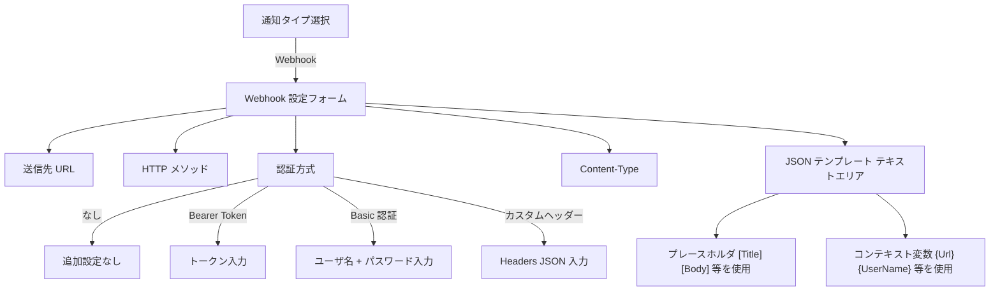
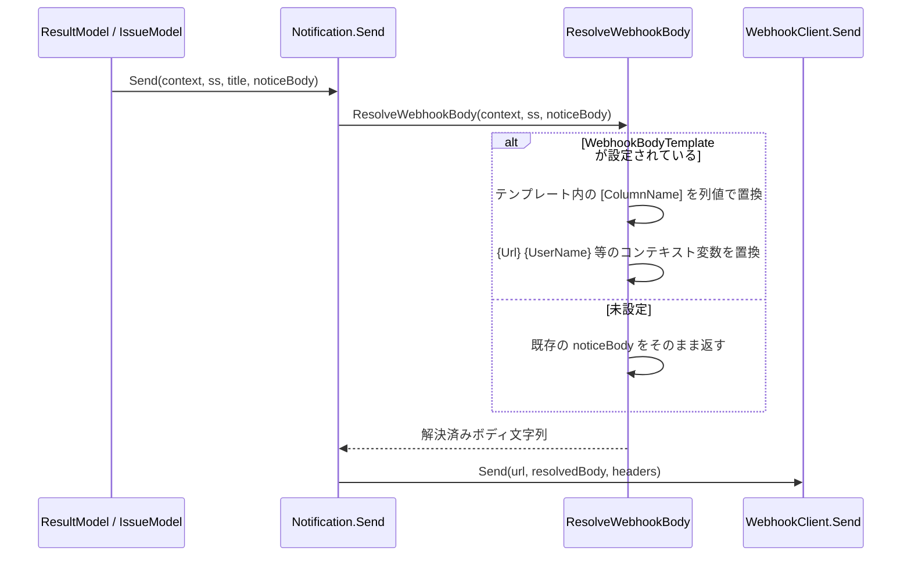

# Webhook通知実装案

プリザンターの既存 HTTP クライアント通知の問題点を整理し、主要 SaaS の Webhook 形式を調査した上で、Webhook 通知機能の実装案を提示する。

<!-- START doctoc generated TOC please keep comment here to allow auto update -->
<!-- DON'T EDIT THIS SECTION, INSTEAD RE-RUN doctoc TO UPDATE -->

- [調査情報](#調査情報)
- [調査目的](#調査目的)
- [現状の HTTP クライアント通知の問題点](#現状の-http-クライアント通知の問題点)
    - [通知タイプの定義](#通知タイプの定義)
    - [問題 1: JSON ボディの組み立て制約](#問題-1-json-ボディの組み立て制約)
    - [問題 2: 認証方式の不足](#問題-2-認証方式の不足)
    - [問題 3: HTTP クライアントの設定項目](#問題-3-http-クライアントの設定項目)
- [主要 SaaS の Webhook 形式調査](#主要-saas-の-webhook-形式調査)
    - [Slack Incoming Webhooks](#slack-incoming-webhooks)
    - [Microsoft Teams（Power Automate HTTP Trigger）](#microsoft-teamspower-automate-http-trigger)
    - [Discord Webhooks](#discord-webhooks)
    - [Google Chat Webhooks](#google-chat-webhooks)
    - [LINE Notify](#line-notify)
    - [Datadog Events API](#datadog-events-api)
    - [PagerDuty Events API v2](#pagerduty-events-api-v2)
    - [認証方式のまとめ](#認証方式のまとめ)
- [必要な機能要件](#必要な機能要件)
    - [要件 1: 任意 JSON テンプレートの記述](#要件-1-任意-json-テンプレートの記述)
    - [要件 2: 認証方式の選択 UI](#要件-2-認証方式の選択-ui)
    - [要件 3: Content-Type の選択](#要件-3-content-type-の選択)
- [実装案](#実装案)
    - [アプローチ比較](#アプローチ比較)
    - [変更が必要なファイルと内容](#変更が必要なファイルと内容)
    - [設定 UI のイメージ](#設定-ui-のイメージ)
    - [JSON テンプレートのプレースホルダ解決フロー](#json-テンプレートのプレースホルダ解決フロー)
    - [各 SaaS への送信設定例](#各-saas-への送信設定例)
- [結論](#結論)
- [関連ソースコード](#関連ソースコード)
- [関連ドキュメント](#関連ドキュメント)

<!-- END doctoc generated TOC please keep comment here to allow auto update -->

## 調査情報

| 調査日        | リポジトリ | ブランチ | タグ/バージョン    | コミット     | 備考     |
| ------------- | ---------- | -------- | ------------------ | ------------ | -------- |
| 2026年2月25日 | Pleasanter | main     | Pleasanter_1.5.1.0 | `34f162a439` | 初回調査 |

## 調査目的

現状の HTTP クライアント通知は以下の制約があり、Slack・Teams・Discord 等の主要 SaaS Webhook エンドポイントへの通知に利用しにくい。本調査では、各 SaaS の Webhook 受信仕様を整理し、必要な機能を特定して実装案を提案する。

---

## 現状の HTTP クライアント通知の問題点

### 通知タイプの定義

**ファイル**: `Implem.Pleasanter/Libraries/Settings/Notification.cs`

```csharp
public enum Types : int
{
    Mail = 1, Slack = 2, ChatWork = 3, Line = 4,
    LineGroup = 5, Teams = 6, RocketChat = 7,
    InCircle = 8, HttpClient = 9, LineWorks = 10,
}
```

### 問題 1: JSON ボディの組み立て制約

`Format` フィールドは改行区切りの文字列で、`NoticeBody` メソッドが各行を個別に処理する。

```csharp
// ResultModel.cs - NoticeBody メソッド（抜粋）
notification.GetFormat(context, ss)
    .Split('\n')
    .Select(line => new {
        Line = line.Trim(),
        Format = line.Trim().Deserialize<NotificationColumnFormat>()  // 各行をJSONとして解析
    })
    .ForEach(data => {
        var column = ss.IncludedColumns(data.Format?.Name)?.FirstOrDefault();
        if (column == null) {
            body.Append(ReplacedContextValues(context, data.Line));
            body.Append("\n");   // 改行を追加して結合
        } else {
            // カラム値を展開して追加
        }
    });
```

この仕組みにより、以下の問題が生じる。

| 問題             | 内容                                                                                         |
| ---------------- | -------------------------------------------------------------------------------------------- |
| ネスト JSON 不可 | 改行を含む JSON（Slack Block Kit, Discord Embeds 等）を直接 Format フィールドに記述できない  |
| 配列構造不可     | `"blocks": [...]` のような配列を含む JSON テンプレートが作れない                             |
| 行分割の制約     | 改行が行区切りとして機能するため、複数行にまたがる JSON オブジェクトは意図通りに解析されない |

### 問題 2: 認証方式の不足

`Token` フィールドは ChatWork・LINE・InCircle 専用であり、HTTP クライアントでは未使用。

```csharp
// NotificationUtilities.cs
private static List<Notification.Types> TokenList()
{
    return new List<Notification.Types>
    {
        Notification.Types.ChatWork,
        Notification.Types.Line,
        Notification.Types.LineGroup,
        Notification.Types.InCircle
        // HttpClient はここに含まれていない
    };
}
```

`Headers` フィールドに JSON 辞書形式（`{"Authorization": "Bearer xxx"}`）で記述することで Authorization ヘッダーを設定できるが、以下の問題がある。

| 問題              | 内容                                                                           |
| ----------------- | ------------------------------------------------------------------------------ |
| HMAC 署名未対応   | リクエストボディから動的に計算する必要があるため、静的なヘッダーでは対応不可   |
| UI での設定が煩雑 | JSON 辞書形式で手動記述が必要であり、設定ミスが起きやすい                      |
| 平文保存          | 認証トークンが設定 JSON 内に平文で保存される（現状は変わらないが改善余地あり） |

### 問題 3: HTTP クライアントの設定項目

**ファイル**: `Implem.Pleasanter/Libraries/DataSources/HttpClient.cs`

```csharp
public class HttpClient
{
    public MethodTypes? MethodType;   // GET/POST/PUT/DELETE
    public string Encoding;           // 文字エンコーディング（utf-8/shift_jis/euc-jp）
    public string MediaType;          // Content-Type
    public string Headers;            // カスタムヘッダー（JSON辞書形式）
}
```

タイムアウト設定や再試行機能がなく、送信失敗はシステムログへの記録のみで通知されない。

---

## 主要 SaaS の Webhook 形式調査

### Slack Incoming Webhooks

| 項目           | 内容                                                      |
| -------------- | --------------------------------------------------------- |
| URL 形式       | `https://hooks.slack.com/services/{T...}/{B...}/{secret}` |
| HTTP メソッド  | POST                                                      |
| Content-Type   | `application/json`                                        |
| 認証方式       | URL にシークレットを含む（追加認証ヘッダーなし）          |
| 最小ペイロード | `{"text": "メッセージ"}`                                  |
| リッチ表示     | Block Kit（`blocks` 配列でセクション・ボタン等を構成）    |

```json
{
    "text": "[Title] が更新されました",
    "blocks": [
        {
            "type": "section",
            "text": {
                "type": "mrkdwn",
                "text": "*[Title]*\n[Body]"
            }
        },
        {
            "type": "context",
            "elements": [
                {
                    "type": "plain_text",
                    "text": "更新者: [Updator]"
                }
            ]
        }
    ]
}
```

### Microsoft Teams（Power Automate HTTP Trigger）

旧 Incoming Webhook コネクタ（Connector）は 2025 年以降段階的に廃止され、現在は Power Automate の「HTTP 要求の受信時」トリガーを使う方式が推奨される。

| 項目           | 内容                                                                                   |
| -------------- | -------------------------------------------------------------------------------------- |
| URL 形式       | Power Automate が発行するトリガー URL（`https://prod-xxx.westus.logic.azure.com/...`） |
| HTTP メソッド  | POST                                                                                   |
| Content-Type   | `application/json`                                                                     |
| 認証方式       | URL にシークレットを含む（SAS 署名）                                                   |
| ペイロード形式 | 任意の JSON（Power Automate フロー内で Teams への投稿カードに変換）                    |

Adaptive Card を直接送信する旧方式（残存 Connector 使用時）:

```json
{
    "type": "message",
    "attachments": [
        {
            "contentType": "application/vnd.microsoft.card.adaptive",
            "content": {
                "$schema": "http://adaptivecards.io/schemas/adaptive-card.json",
                "type": "AdaptiveCard",
                "version": "1.4",
                "body": [
                    {
                        "type": "TextBlock",
                        "text": "[Title]",
                        "weight": "Bolder"
                    }
                ]
            }
        }
    ]
}
```

### Discord Webhooks

| 項目           | 内容                                                            |
| -------------- | --------------------------------------------------------------- |
| URL 形式       | `https://discord.com/api/webhooks/{webhook.id}/{webhook.token}` |
| HTTP メソッド  | POST                                                            |
| Content-Type   | `application/json`                                              |
| 認証方式       | URL にシークレットを含む（追加認証ヘッダーなし）                |
| 最小ペイロード | `{"content": "メッセージ"}` または `{"embeds": [...]}`          |

```json
{
    "username": "Pleasanter",
    "content": "[Title] が更新されました",
    "embeds": [
        {
            "title": "[Title]",
            "description": "[Body]",
            "color": 5814783,
            "fields": [
                {
                    "name": "ステータス",
                    "value": "[Status]",
                    "inline": true
                }
            ],
            "footer": {
                "text": "更新者: [Updator]"
            }
        }
    ]
}
```

### Google Chat Webhooks

| 項目           | 内容                                                                             |
| -------------- | -------------------------------------------------------------------------------- |
| URL 形式       | `https://chat.googleapis.com/v1/spaces/{space}/messages?key={key}&token={token}` |
| HTTP メソッド  | POST                                                                             |
| Content-Type   | `application/json`                                                               |
| 認証方式       | URL にキー・トークンを含む（追加認証ヘッダーなし）                               |
| 最小ペイロード | `{"text": "メッセージ"}`                                                         |

```json
{
    "text": "[Title] が更新されました",
    "cards": [
        {
            "header": {
                "title": "[Title]"
            },
            "sections": [
                {
                    "widgets": [
                        {
                            "textParagraph": {
                                "text": "[Body]"
                            }
                        }
                    ]
                }
            ]
        }
    ]
}
```

### LINE Notify

| 項目           | 内容                                            |
| -------------- | ----------------------------------------------- |
| URL 形式       | `https://notify-api.line.me/api/notify`（固定） |
| HTTP メソッド  | POST                                            |
| Content-Type   | `application/x-www-form-urlencoded`             |
| 認証方式       | `Authorization: Bearer {access_token}` ヘッダー |
| ペイロード形式 | フォームエンコード（`message=テキスト`）        |

プリザンターの既存 `Line`/`LineGroup` 通知タイプとは異なり、LINE Notify は個人または Notify 連携チャンネルへの通知サービス。

### Datadog Events API

| 項目           | 内容                                      |
| -------------- | ----------------------------------------- |
| URL 形式       | `https://api.datadoghq.com/api/v1/events` |
| HTTP メソッド  | POST                                      |
| Content-Type   | `application/json`                        |
| 認証方式       | `DD-API-KEY: {api_key}` ヘッダー          |
| ペイロード形式 | JSON                                      |

```json
{
    "title": "[Title]",
    "text": "[Body]",
    "tags": ["source:pleasanter", "env:production"],
    "alert_type": "info"
}
```

### PagerDuty Events API v2

| 項目           | 内容                                              |
| -------------- | ------------------------------------------------- |
| URL 形式       | `https://events.pagerduty.com/v2/enqueue`（固定） |
| HTTP メソッド  | POST                                              |
| Content-Type   | `application/json`                                |
| 認証方式       | `routing_key` をボディ JSON 内に含める            |
| ペイロード形式 | JSON（`routing_key` は必須フィールド）            |

```json
{
    "routing_key": "{service_key}",
    "event_action": "trigger",
    "payload": {
        "summary": "[Title]",
        "severity": "info",
        "source": "Pleasanter",
        "custom_details": {
            "body": "[Body]",
            "updator": "[Updator]"
        }
    },
    "links": [
        {
            "href": "{Url}",
            "text": "レコードを開く"
        }
    ]
}
```

### 認証方式のまとめ

調査した SaaS の認証方式を以下に整理する。

| 認証方式                   | 採用 SaaS の例                         | 現状サポート                                    |
| -------------------------- | -------------------------------------- | ----------------------------------------------- |
| URL 埋め込みシークレット   | Slack, Discord, Google Chat, Teams     | 可（URL に含めるだけ）                          |
| Bearer Token ヘッダー      | LINE Notify, Notion, GitHub API        | 手動で Headers に記述可（UI 不便）              |
| API キーヘッダー（独自名） | Datadog (`DD-API-KEY`), AWS など       | 手動で Headers に記述可（UI 不便）              |
| ボディ内シークレット       | PagerDuty (`routing_key`)              | JSON テンプレートに直接記述可（後述の改善必要） |
| HMAC-SHA256 署名ヘッダー   | GitHub Webhook 受信検証, Chatwork など | 未対応                                          |
| Basic 認証                 | Jenkins, 社内ツール等                  | 手動で Headers に記述可（UI 不便）              |

---

## 必要な機能要件

調査結果から、以下の機能が必要と判断される。

### 要件 1: 任意 JSON テンプレートの記述

現状の `Format` フィールドはプレースホルダを改行区切りで記述する形式であり、Slack Block Kit・Discord Embeds のようなネスト構造を持つ JSON を構築できない。

**必要な機能**: HTTP クライアント通知において、任意の JSON を直接記述できる「JSON テンプレートモード」の提供。

- プレースホルダ（`[Title]`, `[Body]`, `[Status]` 等）を JSON 文字列値として使用可能
- `{Url}`, `{UserName}` 等のコンテキスト変数も JSON 内で使用可能
- 改行を含む整形済み JSON を記述できる（複数行のテキストエリア）

### 要件 2: 認証方式の選択 UI

`Headers` フィールドへの JSON 手動記述に代わり、認証方式を選択できる UI が必要。

| 優先度 | 認証方式             | 対象 SaaS                       |
| ------ | -------------------- | ------------------------------- |
| 高     | なし（URL 埋め込み） | Slack, Discord, Google Chat     |
| 高     | Bearer Token         | LINE Notify, Notion, GitHub API |
| 中     | カスタムヘッダー     | Datadog, AWS, 社内ツール        |
| 中     | Basic 認証           | Jenkins, 社内ツール             |
| 低     | HMAC-SHA256 署名     | GitHub Webhook 検証, Chatwork   |

### 要件 3: Content-Type の選択

JSON 以外のフォームエンコード形式（LINE Notify 等）への対応として、Content-Type 選択を改善する。

| Content-Type                        | 対象        |
| ----------------------------------- | ----------- |
| `application/json`                  | ほぼ全 SaaS |
| `application/x-www-form-urlencoded` | LINE Notify |

---

## 実装案

### アプローチ比較

| アプローチ                                  | メリット                                                        | デメリット                                                   |
| ------------------------------------------- | --------------------------------------------------------------- | ------------------------------------------------------------ |
| A: 既存 HttpClient 通知の設定項目を拡張する | コードへの影響が最小限。既存設定との後方互換を維持しやすい      | Webhook 専用 UI を作りにくい。既存の問題（ボディ形式）が残る |
| B: 新しい `Webhook` 通知タイプを追加する    | Webhook 専用 UI・機能を独立して設計できる。既存機能に影響しない | 追加コード量が多い。HttpClient との実装重複が生じる          |

**推奨**: アプローチ B（新しい `Webhook` タイプの追加）を推奨する。Webhook と HTTP クライアントは用途・設定項目が異なるため、独立したタイプとして扱う方が設定 UI・機能を明確に分離できる。

### 変更が必要なファイルと内容

#### 1. `Notification.cs` - 型定義と新フィールドの追加

```csharp
public enum Types : int
{
    Mail = 1, Slack = 2, ChatWork = 3, Line = 4,
    LineGroup = 5, Teams = 6, RocketChat = 7,
    InCircle = 8, HttpClient = 9, LineWorks = 10,
    Webhook = 11,   // 追加
}

// 追加フィールド
public WebhookAuthTypes? WebhookAuthType;  // 認証方式
public string WebhookAuthToken;            // Bearer / API Key トークン値
public string WebhookAuthUsername;         // Basic 認証ユーザ名
public string WebhookAuthPassword;         // Basic 認証パスワード
public string WebhookBodyTemplate;         // JSON テンプレート文字列

public enum WebhookAuthTypes : int
{
    None = 0,           // 認証なし（URL 埋め込み）
    BearerToken = 1,    // Authorization: Bearer {token}
    BasicAuth = 2,      // Authorization: Basic {base64(user:pass)}
    CustomHeader = 3,   // カスタムヘッダー名 + トークン（既存 Headers フィールドと共用）
}
```

#### 2. `Notification.cs` - `Send` メソッドへの Webhook ケースの追加

```csharp
case Types.Webhook:
    if (Parameters.Notification.Webhook)
    {
        new WebhookClient(
            _context: context,
            _body: ResolveWebhookBody(context, ss, body))
        {
            MethodType = MethodType,
            MediaType = MediaType,
            Headers = BuildAuthHeaders()   // 認証ヘッダーを自動構築
        }
        .Send(Address);
    }
    break;
```

**`BuildAuthHeaders` メソッドのロジック**:

```csharp
private Dictionary<string, string> BuildAuthHeaders()
{
    var headers = Headers?.Deserialize<Dictionary<string, string>>()
        ?? new Dictionary<string, string>();
    switch (WebhookAuthType)
    {
        case WebhookAuthTypes.BearerToken:
            headers["Authorization"] = $"Bearer {WebhookAuthToken}";
            break;
        case WebhookAuthTypes.BasicAuth:
            var credentials = Convert.ToBase64String(
                System.Text.Encoding.UTF8.GetBytes($"{WebhookAuthUsername}:{WebhookAuthPassword}"));
            headers["Authorization"] = $"Basic {credentials}";
            break;
    }
    return headers;
}
```

#### 3. `Notification.cs` - JSON テンプレートのプレースホルダ解決

JSON テンプレートモードでは `NoticeBody` の行分割処理を使わず、テンプレート文字列にプレースホルダを直接置換する新しいメソッドを用意する。

```csharp
private string ResolveWebhookBody(Context context, SiteSettings ss, string noticeBody)
{
    if (string.IsNullOrEmpty(WebhookBodyTemplate))
    {
        return noticeBody;   // テンプレート未設定時は既存の NoticeBody をそのまま使用
    }
    var result = WebhookBodyTemplate;
    // コンテキスト変数の置換（{Url}, {UserName} 等）
    // カラムプレースホルダの置換（[Title], [Body] 等）は
    // 別途 ss のカラム値マップを引数で受け取って置換する
    return result;
}
```

#### 4. `NotificationUtilities.cs` - Webhook タイプの追加

```csharp
// Types メソッドに追加
if (Parameters.Notification.Webhook)
{
    notificationTypes.Add(
        Notification.Types.Webhook.ToInt().ToString(),
        Displays.Webhook(context: context));
}

// NotificationType の判定を拡張
public static bool IsHttpBased(Notification notification)
{
    return notification.Type == Notification.Types.HttpClient
        || notification.Type == Notification.Types.Webhook;
}
```

#### 5. `SiteUtilities.cs` - 設定 UI への Webhook フィールドの追加

現状の HTTP クライアントフィールド（MethodType, Encoding, MediaType, Headers）に加え、Webhook タイプ選択時に以下を表示する。

```
[認証方式 ドロップダウン]     ← WebhookAuthType
  - なし
  - Bearer Token
  - Basic 認証
  - カスタムヘッダー（既存 Headers フィールドを使用）

[トークン テキストボックス]   ← WebhookAuthToken（BearerToken / CustomHeader 選択時に表示）
[ユーザ名 テキストボックス]   ← WebhookAuthUsername（Basic 認証選択時に表示）
[パスワード テキストボックス] ← WebhookAuthPassword（Basic 認証選択時に表示）

[JSON テンプレート テキストエリア（複数行）] ← WebhookBodyTemplate
  ※ プレースホルダ [Title], [Body] 等が使用可能
```

#### 6. `Notification.json` - パラメータ追加

**ファイル**: `Implem.Pleasanter/App_Data/Parameters/Notification.json`

```json
{
    "Webhook": false,
    ...
}
```

#### 7. 表示文字列ファイルの追加

**新規ファイル**: `Implem.Pleasanter/App_Data/Displays/Webhook.json`（既存の `HttpClient.json` と同形式）

#### 8. `Implem.DefinitionAccessor/Initializer.cs` - パラメータ初期化

自動生成コードと手動コードを確認し、`Notification` パラメータクラスに `Webhook` プロパティを追加する。

### 設定 UI のイメージ



### JSON テンプレートのプレースホルダ解決フロー



### 各 SaaS への送信設定例

#### Slack Incoming Webhooks

| 設定項目          | 値                                               |
| ----------------- | ------------------------------------------------ |
| 通知タイプ        | Webhook                                          |
| 送信先 URL        | `https://hooks.slack.com/services/T.../B.../...` |
| HTTP メソッド     | POST                                             |
| 認証方式          | なし                                             |
| Content-Type      | `application/json`                               |
| JSON テンプレート | `{"text": "[Title] が更新されました\n{Url}"}`    |

#### Datadog Events API

| 設定項目          | 値                                                             |
| ----------------- | -------------------------------------------------------------- |
| 通知タイプ        | Webhook                                                        |
| 送信先 URL        | `https://api.datadoghq.com/api/v1/events`                      |
| HTTP メソッド     | POST                                                           |
| 認証方式          | カスタムヘッダー                                               |
| Headers           | `{"DD-API-KEY": "xxxxx"}`                                      |
| Content-Type      | `application/json`                                             |
| JSON テンプレート | `{"title": "[Title]", "text": "[Body]", "alert_type": "info"}` |

#### PagerDuty Events API v2

| 設定項目          | 値                                                                                                                                   |
| ----------------- | ------------------------------------------------------------------------------------------------------------------------------------ |
| 通知タイプ        | Webhook                                                                                                                              |
| 送信先 URL        | `https://events.pagerduty.com/v2/enqueue`                                                                                            |
| HTTP メソッド     | POST                                                                                                                                 |
| 認証方式          | なし（`routing_key` をテンプレートに埋め込む）                                                                                       |
| Content-Type      | `application/json`                                                                                                                   |
| JSON テンプレート | `{"routing_key": "xxxxx", "event_action": "trigger", "payload": {"summary": "[Title]", "severity": "info", "source": "Pleasanter"}}` |

---

## 結論

| 項目                | 現状                                            | 改善案                                              |
| ------------------- | ----------------------------------------------- | --------------------------------------------------- |
| JSON ボディ組み立て | 改行区切り行分割形式のみ（ネスト JSON 不可）    | JSON テンプレートモードを新設（任意の JSON 記述可） |
| 認証方式            | 手動 Headers JSON 記述のみ                      | 認証方式選択 UI を追加（Bearer/Basic/カスタム）     |
| 通知タイプ          | HttpClient（汎用的すぎて Webhook 用途に不向き） | `Webhook` タイプを新設して設定項目を分離            |
| 対応 SaaS           | URL 埋め込みシークレット型のみ実用的            | Bearer Token / カスタムヘッダー型 SaaS にも対応     |
| HMAC 署名           | 未対応                                          | 今回スコープ外（高難度のため将来対応）              |

実装の優先順位:

1. `Webhook` 通知タイプの追加（`Types` 列挙値・パラメータ・UI）
2. JSON テンプレートフィールド（`WebhookBodyTemplate`）と複数行テキストエリア UI
3. 認証方式選択 UI（Bearer Token / Basic 認証 / カスタムヘッダー）

---

## 関連ソースコード

| ファイル                                                            | 概要                                                     |
| ------------------------------------------------------------------- | -------------------------------------------------------- |
| `Implem.Pleasanter/Libraries/Settings/Notification.cs`              | 通知設定クラス・`Send` メソッド・通知タイプ定義          |
| `Implem.Pleasanter/Libraries/Settings/NotificationUtilities.cs`     | 通知タイプ一覧・Token 要否判定                           |
| `Implem.Pleasanter/Libraries/DataSources/HttpClient.cs`             | HTTP クライアント通知の送信処理                          |
| `Implem.Pleasanter/Libraries/DataSources/NotificationHttpClient.cs` | HTTP 送信の実装（`System.Net.Http.HttpClient` ラッパー） |
| `Implem.Pleasanter/Models/Results/ResultModel.cs`                   | `NoticeBody`・`ReplacedContextValues` メソッド           |
| `Implem.Pleasanter/Models/Sites/SiteUtilities.cs`                   | 通知設定フォームの HTML 組み立て                         |
| `Implem.Pleasanter/App_Data/Parameters/Notification.json`           | 通知機能の ON/OFF パラメータ                             |
| `Implem.Pleasanter/App_Data/Displays/HttpClient.json`               | 表示文字列（新規 `Webhook.json` の参考）                 |

## 関連ドキュメント

- [004-通知カスタムフォーマット・プレースホルダの仕組み](004-通知カスタムフォーマット・プレースホルダ.md)
- [005-通知コンテキスト変数の展開不具合](005-通知コンテキスト変数の展開不具合.md)
