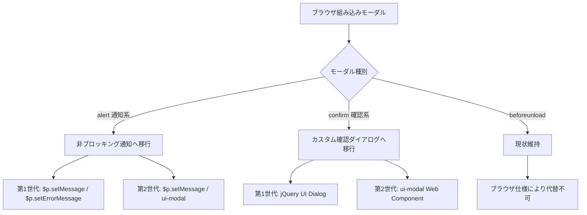
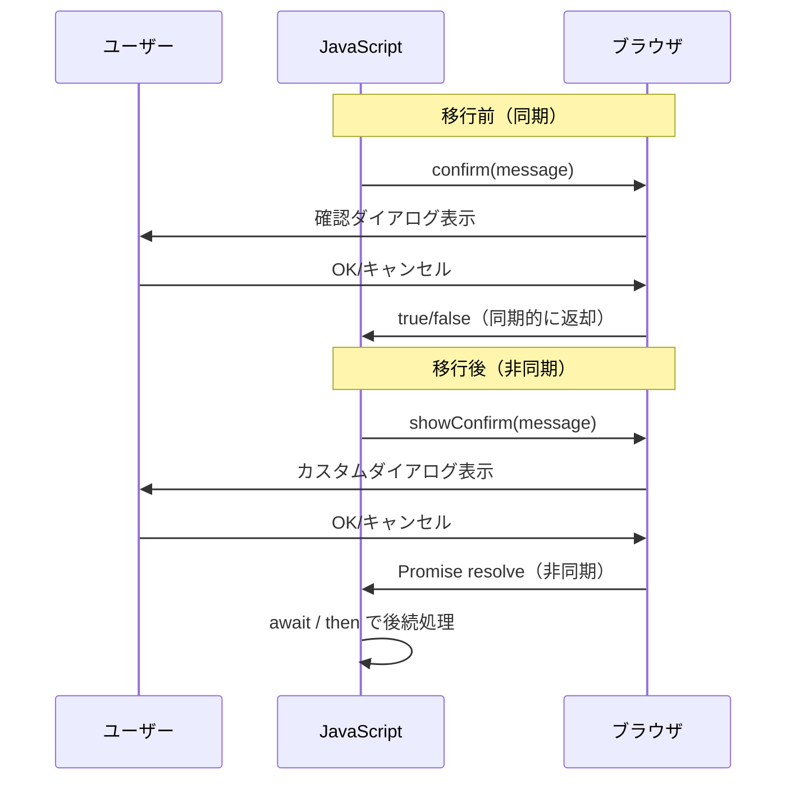

# ブラウザ組み込みモーダル使用箇所と移行手段

プリザンターのフロントエンドで使用されている `window.alert()`、`window.confirm()`、`beforeunload` などブラウザ組み込みモーダルの使用箇所を洗い出し、第1世代テーマ・第2世代テーマそれぞれの移行手段をまとめた調査結果。

<!-- START doctoc generated TOC please keep comment here to allow auto update -->
<!-- DON'T EDIT THIS SECTION, INSTEAD RE-RUN doctoc TO UPDATE -->

- [調査情報](#調査情報)
- [調査目的](#調査目的)
- [テーマ世代の定義](#テーマ世代の定義)
- [ブラウザ組み込みモーダルの使用箇所一覧](#ブラウザ組み込みモーダルの使用箇所一覧)
    - [alert() の使用箇所](#alert-の使用箇所)
    - [confirm() の使用箇所](#confirm-の使用箇所)
    - [beforeunload イベントの使用箇所](#beforeunload-イベントの使用箇所)
- [分類別の整理](#分類別の整理)
    - [通知系（alert）](#通知系alert)
    - [確認系（confirm）](#確認系confirm)
    - [ページ離脱警告（beforeunload）](#ページ離脱警告beforeunload)
- [プリザンター内部のダイアログ・メッセージ機構](#プリザンター内部のダイアログメッセージ機構)
    - [1. jQuery UI Dialog（第1世代テーマ向け）](#1-jquery-ui-dialog第1世代テーマ向け)
    - [2. メッセージ表示機構](#2-メッセージ表示機構)
    - [3. `<ui-modal>` Web Component（第2世代テーマ向け）](#3-ui-modal-web-component第2世代テーマ向け)
    - [4. data-confirm 属性（サーバーサイド定義の確認ダイアログ）](#4-data-confirm-属性サーバーサイド定義の確認ダイアログ)
- [移行手段](#移行手段)
    - [移行方針の概要](#移行方針の概要)
    - [beforeunload イベントについて](#beforeunload-イベントについて)
    - [第1世代テーマでの移行手段](#第1世代テーマでの移行手段)
    - [第2世代テーマでの移行手段](#第2世代テーマでの移行手段)
- [移行時の注意事項](#移行時の注意事項)
    - [同期から非同期への変更](#同期から非同期への変更)
    - [data-confirm 属性の影響範囲](#data-confirm-属性の影響範囲)
    - [SmartDesign コンポーネントの対応](#smartdesign-コンポーネントの対応)
- [移行優先度](#移行優先度)
- [結論](#結論)
- [関連ソースコード](#関連ソースコード)

<!-- END doctoc generated TOC please keep comment here to allow auto update -->

## 調査情報

| 調査日        | リポジトリ | ブランチ | タグ/バージョン    | コミット     | 備考     |
| ------------- | ---------- | -------- | ------------------ | ------------ | -------- |
| 2026年2月26日 | Pleasanter | main     | Pleasanter_1.5.1.0 | `34f162a439` | 初回調査 |

## 調査目的

- プリザンター内で使用されている `window.alert()`・`window.confirm()`・`beforeunload` イベントの全使用箇所を特定する
- ブラウザ組み込みモーダルはスタイルのカスタマイズが不可能であり、UX の統一性を損なうため、プリザンター内部のダイアログ・メッセージ機構への移行手段を検討する
- 第1世代テーマ（jQuery UI ベース）と第2世代テーマ（SmartDesign）それぞれに適した移行方法を整理する

---

## テーマ世代の定義

プリザンターのテーマは `Context.ThemeVersion()` で世代が判定される。

**ファイル**: `Implem.Pleasanter/Libraries/Requests/Context.cs`（行番号: 1287-1322）

```csharp
public decimal ThemeVersion()
{
    switch (Theme())
    {
        case "cerulean":
        case "green-tea":
        case "mandarin":
        case "midnight":
            return 2.0M;
        default:
            return 1.0M;
    }
}
```

| 世代    | テーマ名                                 | 基盤技術                     |
| ------- | ---------------------------------------- | ---------------------------- |
| 第1世代 | blitzer, cupertino, dark-hive 等（25種） | jQuery UI テーマ             |
| 第2世代 | cerulean, green-tea, mandarin, midnight  | SmartDesign（Svelte + Vite） |

---

## ブラウザ組み込みモーダルの使用箇所一覧

### alert() の使用箇所

| #   | ファイル                 | 関数/コンテキスト                     | 表示キー                            | 用途                                   |
| --- | ------------------------ | ------------------------------------- | ----------------------------------- | -------------------------------------- |
| 1   | `clipboard.js:11`        | `$p.copyDirectUrlToClipboard`         | `DirectUrlCopied`                   | URL コピー完了通知                     |
| 2   | `fieldselectable.js:37`  | `$p.moveColumnsById`                  | ハードコード `'outsideDialog'`      | ダイアログ外操作の警告（デバッグ用途） |
| 3   | `fieldselectable.js:118` | `$p.moveColumnsById`                  | 動的（`NessesaryMessage` 要素の値） | 必須カラム削除防止の警告               |
| 4   | `_ajax.js:114`           | `$p.send` の `.fail` コールバック     | `BadRequest`                        | HTTP 400 エラー通知                    |
| 5   | `_ajax.js:116`           | `$p.send` の `.fail` コールバック     | `UnauthorizedRequest`               | HTTP 403 エラー通知                    |
| 6   | `_ajax.js:123`           | `$p.send` の `.fail` コールバック     | 動的（サーバーエラーメッセージ）    | 汎用エラー通知                         |
| 7   | `_ajax.js:212`           | `$p.postAjax` の `.fail` コールバック | `BadRequest`                        | HTTP 400 エラー通知                    |
| 8   | `_ajax.js:214`           | `$p.postAjax` の `.fail` コールバック | `UnauthorizedRequest`               | HTTP 403 エラー通知                    |
| 9   | `_ajax.js:216`           | `$p.postAjax` の `.fail` コールバック | 動的（レスポンステキスト）          | 汎用エラー通知                         |
| 10  | `passkey.ts:12`          | `passkeyRegister`                     | `PasskeyNotAvailable`               | パスキー API 未対応通知                |
| 11  | `passkey.ts:80`          | `passkeyGetAssertionOptions`          | `PasskeyNotAvailable`               | パスキー API 未対応通知                |
| 12  | `passkey.ts:89`          | `passkeyLogin`                        | `PasskeyNotAvailable`               | パスキー API 未対応通知                |
| 13  | `passkey.ts:150`         | `openPasskeyDialog`                   | `PasskeyNotAvailable`               | パスキー API 未対応通知                |
| 14  | `passkey.ts:270`         | `catchError`                          | `PasskeyOperationTimeoutOrAbort`    | パスキー操作タイムアウト/中断          |
| 15  | `passkey.ts:272`         | `catchError`                          | 動的（`e.message`）                 | パスキーカスタムエラー                 |
| 16  | `passkey.ts:274`         | `catchError`                          | `PasskeyOperationAborted`           | パスキー操作中断                       |
| 17  | `passkey.ts:276`         | `catchError`                          | `PasskeyResponseInvalid`            | パスキーレスポンス不正                 |
| 18  | `passkey.ts:278`         | `catchError`                          | `PasskeyOperationTimeoutOrAbort`    | パスキー操作タイムアウト/中断          |
| 19  | `passkey.ts:281`         | `catchError`                          | `PasskeyServerUnavailable`          | パスキーサーバー接続不可               |
| 20  | `components_DR0K6XV1.js` | SmartDesign Svelte コンポーネント     | ハードコード `'Error'` / `'ERROR'`  | SmartDesign データ読み込みエラー       |

上記ファイルパスはすべて `Implem.PleasanterFrontend/wwwroot/src/scripts/generals/` 配下。
ただし #20 は `Implem.Pleasanter/wwwroot/components/` 配下のビルド済みバンドル。

### confirm() の使用箇所

| #   | ファイル                 | 関数/コンテキスト          | 表示キー                      | 用途                                   |
| --- | ------------------------ | -------------------------- | ----------------------------- | -------------------------------------- |
| 1   | `_ajax.js:58`            | `$p.send`                  | 動的（`data-confirm` 属性値） | AJAX 送信前の汎用確認                  |
| 2   | `lockevents.js:5`        | ロック解除イベントハンドラ | `ConfirmUnlockRecord`         | レコードロック解除の確認               |
| 3   | `sitesettings.js:306`    | `$p.confirmTimeLineSites`  | `ResetTimeLineView`           | タイムラインビューリセット確認         |
| 4   | `sitesettings.js:319`    | `$p.confirmCalendarSites`  | `ResetCalendarView`           | カレンダービューリセット確認           |
| 5   | `sitesettings.js:332`    | `$p.confirmKambanSites`    | `ResetKambanView`             | かんばんビューリセット確認             |
| 6   | `sitesettings.js:345`    | `$p.confirmIndexSites`     | `ResetIndexView`              | 一覧ビューリセット確認                 |
| 7   | `confirm.js:3`           | `$p.confirmReload`         | `ConfirmUnload`               | 未保存変更がある状態でのページ離脱確認 |
| 8   | `toastmenubuttons.ts:32` | `resetAndDisableColumn`    | `ConfirmResetAndDisable`      | エディタカラムのリセットと無効化の確認 |

ファイルパスは `Implem.PleasanterFrontend/wwwroot/src/scripts/generals/` 配下。ただし #8 は `modules/editorColumns/` 配下。

### beforeunload イベントの使用箇所

| #   | ファイル                 | コンテキスト                          | 表示キー        | 用途                                  |
| --- | ------------------------ | ------------------------------------- | --------------- | ------------------------------------- |
| 1   | `confirmevents.js:15`    | `$(window).bind('beforeunload', ...)` | `ConfirmUnload` | フォーム変更検知後のページ離脱警告    |
| 2   | `jqueryui.js:247-250`    | シンプルモード切替                    | -               | `onbeforeunload` の一時保存と復元制御 |
| 3   | `components_DR0K6XV1.js` | SmartDesign Svelte コンポーネント     | `ConfirmUnload` | SmartDesign 編集時のページ離脱警告    |

`beforeunload` イベントはブラウザ仕様上、カスタムメッセージの表示が制限されており（主要ブラウザはカスタムテキストを無視してデフォルトメッセージを表示）、代替手段が限られる。

---

## 分類別の整理

使用箇所を目的別に分類すると以下のとおり。

### 通知系（alert）

ユーザーに結果やエラーを伝えるために `alert()` を使用している。操作のブロッキングが不要なケースが多く、移行優先度が高い。

| 分類               | 件数 | 箇所                                               |
| ------------------ | ---- | -------------------------------------------------- |
| 成功通知           | 1    | clipboard.js（URL コピー完了）                     |
| AJAX エラー通知    | 6    | \_ajax.js（400/403/汎用エラー x 2系統）            |
| パスキーエラー通知 | 10   | passkey.ts（API 未対応、操作エラー）               |
| バリデーション警告 | 2    | fieldselectable.js（ダイアログ外操作、必須カラム） |
| SmartDesign エラー | 1    | components（データ読み込み失敗）                   |

### 確認系（confirm）

ユーザーの意思確認を行う `confirm()` の使用。OK/キャンセルの戻り値に依存するため、非同期のダイアログへの移行にはロジック変更が伴う。

| 分類               | 件数 | 箇所                             |
| ------------------ | ---- | -------------------------------- |
| AJAX 送信前確認    | 1    | \_ajax.js（`data-confirm` 属性） |
| レコード操作確認   | 1    | lockevents.js（ロック解除）      |
| ビューリセット確認 | 4    | sitesettings.js（4種のビュー）   |
| ページ離脱確認     | 1    | confirm.js                       |
| カラム操作確認     | 1    | toastmenubuttons.ts              |

### ページ離脱警告（beforeunload）

ブラウザ標準の離脱警告機能。カスタマイズ不可。

| 分類             | 件数 | 箇所                                        |
| ---------------- | ---- | ------------------------------------------- |
| フォーム変更検知 | 2    | confirmevents.js, components（SmartDesign） |
| モード切替制御   | 1    | jqueryui.js                                 |

---

## プリザンター内部のダイアログ・メッセージ機構

移行先として利用可能なプリザンター内部の仕組みを整理する。

### 1. jQuery UI Dialog（第1世代テーマ向け）

**ファイル**: `Implem.PleasanterFrontend/wwwroot/src/scripts/generals/dialog.js`

```javascript
$p.openDialog = function ($control, appendTo) {
    $($control.attr('data-selector')).dialog({
        modal: true,
        width: '420px',
        appendTo: appendTo,
        resizable: false,
    });
};

$p.closeDialog = function ($control) {
    $p.clearMessage();
    $control.closest('.ui-dialog-content').dialog('close');
};
```

| 特徴       | 説明                             |
| ---------- | -------------------------------- |
| 基盤       | jQuery UI `.dialog()`            |
| モーダル   | `modal: true` でオーバーレイ付き |
| スタイル   | jQuery UI テーマに連動           |
| コンテンツ | 任意の HTML を表示可能           |
| 戻り値制御 | コールバック関数で実現           |

### 2. メッセージ表示機構

**ファイル**: `Implem.PleasanterFrontend/wwwroot/src/scripts/generals/message.js`

```javascript
$p.setMessage = function (target, value) {
    var message = JSON.parse(value);
    // #Message または .message-dialog に表示
    // CSS クラスでスタイルを制御（alert-error 等）
};

$p.setErrorMessage = function (error, target) {
    var data = {};
    data.Css = 'alert-error';
    data.Text = $p.display(error);
    $p.clearMessage();
    $p.setMessage(target, JSON.stringify(data));
};
```

| 特徴           | 説明                                                             |
| -------------- | ---------------------------------------------------------------- |
| 表示位置       | `#Message`（ページ上部）または `.message-dialog`（ダイアログ内） |
| 非ブロッキング | ユーザー操作を妨げない                                           |
| 閉じるボタン   | `ui-icon-close` クラスのアイコン付き                             |
| スタイル       | `alert-error` 等の CSS クラスで制御                              |

### 3. `<ui-modal>` Web Component（第2世代テーマ向け）

**ファイル**: `Implem.PleasanterFrontend/wwwroot/src/scripts/generals/modal/ui-modal.ts`

```typescript
export class UiModal extends HTMLElement {
    static hasActiveModalCount: number = 0;
    private shadow: ShadowRoot;
    private modalElem: HTMLDialogElement | null = null;
    onOpened?: () => void;
    onClosed?: () => void;
    // ...
    get open(): boolean {
        return this.isOpen;
    }
    set open(val: boolean) {
        if (val) {
            this.modalOpen();
        } else {
            this.modalClose();
        }
    }
}
customElements.define('ui-modal', UiModal);
```

| 特徴             | 説明                                                  |
| ---------------- | ----------------------------------------------------- |
| 基盤             | HTML `<dialog>` 要素 + Web Components                 |
| Shadow DOM       | スタイルのカプセル化                                  |
| スロット         | `header`、`default`（body）、`footer` の3スロット     |
| スクロールロック | モーダル表示中に `document.body` のスクロールを無効化 |
| アクセス         | `window.$p.modal[id]` で参照可能                      |
| トランジション   | CSS トランジション連動の開閉アニメーション            |

### 4. data-confirm 属性（サーバーサイド定義の確認ダイアログ）

**ファイル**: `Implem.Pleasanter/Libraries/Html/HtmlAttributes.cs`（行番号: 559-567）

```csharp
public HtmlAttributes DataConfirm(string value, bool _using = true)
{
    if (!value.IsNullOrEmpty() && _using)
    {
        Add("data-confirm");
        Add(HttpUtility.HtmlAttributeEncode(value));
    }
    return this;
}
```

C# 側で HTML 要素に `data-confirm` 属性を付与し、`_ajax.js` の `$p.send()` が AJAX 送信前に `confirm()` を呼び出す仕組み。現在は `confirm()` をそのまま使用しているため、この仕組み自体も移行対象になる。

---

## 移行手段

### 移行方針の概要



### beforeunload イベントについて

`beforeunload` イベントはブラウザ仕様上の制約があり、移行対象外とする。

| 制約                   | 説明                                                                |
| ---------------------- | ------------------------------------------------------------------- |
| カスタムメッセージ不可 | 主要ブラウザ（Chrome 51+、Firefox 44+）はカスタムテキストを無視する |
| 代替手段なし           | ページ離脱前の警告はこのイベント以外に実現方法がない                |
| 現状維持が適切         | ブラウザ標準の動作に委ねるのが最善                                  |

### 第1世代テーマでの移行手段

第1世代テーマは jQuery UI ベースのため、jQuery UI Dialog とメッセージ機構を活用する。

#### alert() の移行

| 移行パターン       | 移行先                                              | 対象箇所              |
| ------------------ | --------------------------------------------------- | --------------------- |
| 成功通知           | `$p.setMessage('#Message', ...)`                    | clipboard.js          |
| エラー通知         | `$p.setErrorMessage(error)`                         | \_ajax.js, passkey.ts |
| バリデーション警告 | `$p.setErrorMessage(error)` または jQuery UI Dialog | fieldselectable.js    |

`$p.setMessage` による移行例（clipboard.js の場合）:

```javascript
// 移行前
alert($p.display('DirectUrlCopied'));

// 移行後
var data = { Css: 'alert-success', Text: $p.display('DirectUrlCopied') };
$p.clearMessage();
$p.setMessage('#Message', JSON.stringify(data));
```

#### confirm() の移行

`confirm()` は同期的に `true`/`false` を返すため、jQuery UI Dialog のコールバックで非同期に処理する必要がある。

`$p.send` の `data-confirm` の移行例:

```javascript
// 移行前
if (!confirm($p.display(_confirm))) {
    return false;
}

// 移行後（jQuery UI Dialog）
var $dialog = $('<div>').attr('title', $p.display('Confirm')).text($p.display(_confirm));
$dialog.dialog({
    modal: true,
    width: '420px',
    resizable: false,
    buttons: [
        {
            text: $p.display('Ok'),
            click: function () {
                $(this).dialog('close');
                // 元の処理を続行
                proceedWithAction();
            },
        },
        {
            text: $p.display('Cancel'),
            click: function () {
                $(this).dialog('close');
            },
        },
    ],
    close: function () {
        $(this).remove();
    },
});
```

このパターンでは同期的な `return false` が使えなくなるため、呼び出し元のロジックも非同期対応に変更する必要がある。

### 第2世代テーマでの移行手段

第2世代テーマでは `<ui-modal>` Web Component を活用する。

#### alert() の移行

第1世代と同様に `$p.setMessage` / `$p.setErrorMessage` を使用する方法と、`<ui-modal>` を通知用に使用する方法がある。

`<ui-modal>` による通知の例:

```html
<!-- HTML（サーバーサイドで生成） -->
<ui-modal id="AlertModal">
    <div slot="header"><h3>通知</h3></div>
    <div id="AlertModalBody"></div>
    <div slot="footer">
        <button type="button" onclick="$p.modal.AlertModal.open = false;">OK</button>
    </div>
</ui-modal>
```

```javascript
// JavaScript
function showAlert(message) {
    document.getElementById('AlertModalBody').textContent = message;
    $p.modal.AlertModal.open = true;
}
```

#### confirm() の移行

`<ui-modal>` に OK/キャンセルボタンを配置し、Promise ベースで結果を返す方法が考えられる。

```html
<!-- HTML -->
<ui-modal id="ConfirmModal">
    <div slot="header"><h3>確認</h3></div>
    <div id="ConfirmModalBody"></div>
    <div slot="footer">
        <button type="button" id="ConfirmOk">OK</button>
        <button type="button" id="ConfirmCancel">キャンセル</button>
    </div>
</ui-modal>
```

```javascript
// JavaScript
function showConfirm(message) {
    return new Promise(function (resolve) {
        document.getElementById('ConfirmModalBody').textContent = message;
        var modal = $p.modal.ConfirmModal;
        document.getElementById('ConfirmOk').onclick = function () {
            modal.open = false;
            resolve(true);
        };
        document.getElementById('ConfirmCancel').onclick = function () {
            modal.open = false;
            resolve(false);
        };
        modal.onClosed = function () {
            resolve(false);
        };
        modal.open = true;
    });
}

// 使用例（async/await）
async function handleAction() {
    if (await showConfirm($p.display('ConfirmDelete'))) {
        // 削除処理を実行
    }
}
```

---

## 移行時の注意事項

### 同期から非同期への変更

`confirm()` は同期的に値を返すが、カスタムダイアログは非同期になるため、呼び出し元のコードも変更が必要になる。



### data-confirm 属性の影響範囲

`data-confirm` 属性は C# サーバーサイドで付与され、`_ajax.js` の `$p.send()` で処理される。この仕組みを変更する場合、以下のすべての箇所に影響する。

| C# ファイル            | 使用箇所               | data-confirm 値       |
| ---------------------- | ---------------------- | --------------------- |
| `HtmlComments.cs:145`  | コメント削除ボタン     | `ConfirmDelete`       |
| `HtmlControls.cs:794`  | 汎用ボタンコントロール | 引数で指定            |
| `HtmlTemplates.cs:419` | テナント切替リンク     | `ConfirmSwitchTenant` |
| `HtmlTemplates.cs:436` | ユーザー切替リンク     | `ConfirmSwitchUser`   |

### SmartDesign コンポーネントの対応

`components_DR0K6XV1.js` 内の `alert()` はビルド済みの Svelte コンポーネントに含まれている。移行には Svelte ソースコードの修正とビルドパイプラインでの再ビルドが必要。

---

## 移行優先度

| 優先度 | 対象                                                 | 理由                                         |
| ------ | ---------------------------------------------------- | -------------------------------------------- |
| 高     | `_ajax.js` のエラー通知（alert x 6箇所）             | 全画面で発生しうるため影響範囲が大きい       |
| 高     | `_ajax.js` の `data-confirm`（confirm x 1箇所）      | 全画面の AJAX 操作で使用されるため           |
| 中     | `passkey.ts` のエラー通知（alert x 10箇所）          | パスキー利用ユーザーに限定されるが件数が多い |
| 中     | `sitesettings.js` の確認（confirm x 4箇所）          | ダッシュボード設定画面に限定                 |
| 中     | `lockevents.js` の確認（confirm x 1箇所）            | レコード編集画面に限定                       |
| 中     | `toastmenubuttons.ts` の確認（confirm x 1箇所）      | エディタカラム設定に限定                     |
| 低     | `clipboard.js` の通知（alert x 1箇所）               | 成功通知のみで影響は軽微                     |
| 低     | `fieldselectable.js` の警告（alert x 2箇所）         | 設定画面のカラム操作に限定                   |
| 低     | `confirm.js` のページ離脱確認（confirm x 1箇所）     | `confirmReload` は `beforeunload` と重複     |
| 対象外 | `confirmevents.js` / `jqueryui.js` の `beforeunload` | ブラウザ仕様上の制約により代替不可           |
| 対象外 | `components_DR0K6XV1.js` のエラー通知                | Svelte ビルド済みバンドルのため別途対応      |

---

## 結論

| 項目                  | 内容                                                                                   |
| --------------------- | -------------------------------------------------------------------------------------- |
| alert() 使用箇所      | 20箇所（8ファイル）                                                                    |
| confirm() 使用箇所    | 8箇所（6ファイル）                                                                     |
| beforeunload 使用箇所 | 3箇所（3ファイル）                                                                     |
| 合計                  | 31箇所                                                                                 |
| 移行対象              | 28箇所（beforeunload 3箇所は対象外）                                                   |
| 第1世代テーマの移行先 | alert は `$p.setMessage` / `$p.setErrorMessage`、confirm は jQuery UI Dialog           |
| 第2世代テーマの移行先 | alert は `$p.setMessage` / `$p.setErrorMessage`、confirm は `<ui-modal>` Web Component |
| 移行の課題            | confirm の同期→非同期変換に伴う呼び出し元ロジックの変更                                |

---

## 関連ソースコード

| ファイル                                                                                  | 説明                                  |
| ----------------------------------------------------------------------------------------- | ------------------------------------- |
| `Implem.PleasanterFrontend/wwwroot/src/scripts/generals/_ajax.js`                         | AJAX 通信（alert x 6、confirm x 1）   |
| `Implem.PleasanterFrontend/wwwroot/src/scripts/generals/passkey.ts`                       | パスキー認証（alert x 10）            |
| `Implem.PleasanterFrontend/wwwroot/src/scripts/generals/clipboard.js`                     | クリップボード操作（alert x 1）       |
| `Implem.PleasanterFrontend/wwwroot/src/scripts/generals/fieldselectable.js`               | カラム選択（alert x 2）               |
| `Implem.PleasanterFrontend/wwwroot/src/scripts/generals/sitesettings.js`                  | サイト設定（confirm x 4）             |
| `Implem.PleasanterFrontend/wwwroot/src/scripts/generals/lockevents.js`                    | ロック制御（confirm x 1）             |
| `Implem.PleasanterFrontend/wwwroot/src/scripts/generals/confirm.js`                       | 確認ダイアログ（confirm x 1）         |
| `Implem.PleasanterFrontend/wwwroot/src/scripts/generals/confirmevents.js`                 | beforeunload イベント                 |
| `Implem.PleasanterFrontend/wwwroot/src/scripts/generals/jqueryui.js`                      | jQuery UI 初期化（beforeunload 制御） |
| `Implem.PleasanterFrontend/wwwroot/src/scripts/modules/editorColumns/toastmenubuttons.ts` | トーストメニュー（confirm x 1）       |
| `Implem.PleasanterFrontend/wwwroot/src/scripts/generals/modal/ui-modal.ts`                | `<ui-modal>` Web Component            |
| `Implem.PleasanterFrontend/wwwroot/src/scripts/generals/dialog.js`                        | jQuery UI Dialog ラッパー             |
| `Implem.PleasanterFrontend/wwwroot/src/scripts/generals/message.js`                       | メッセージ表示機構                    |
| `Implem.Pleasanter/Libraries/Html/HtmlAttributes.cs`                                      | `DataConfirm` 属性定義                |
| `Implem.Pleasanter/Libraries/Requests/Context.cs`                                         | テーマバージョン判定                  |
