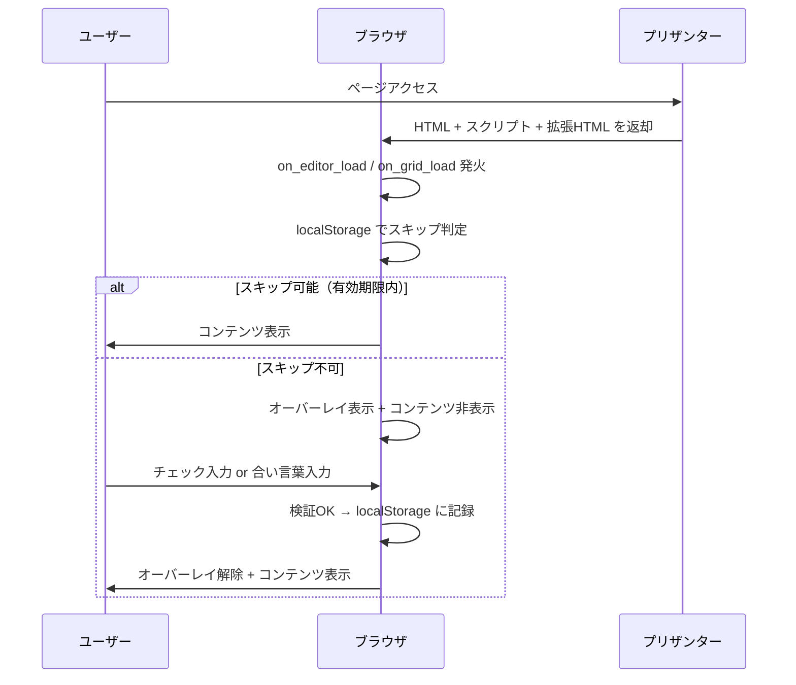
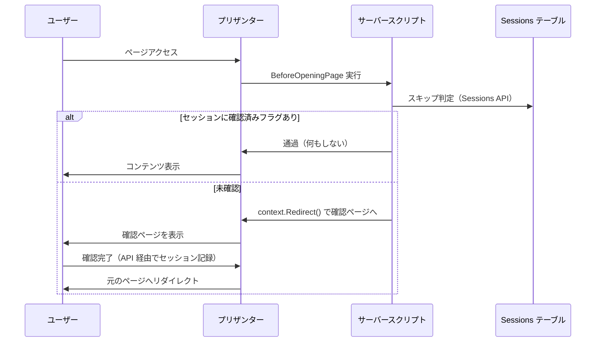
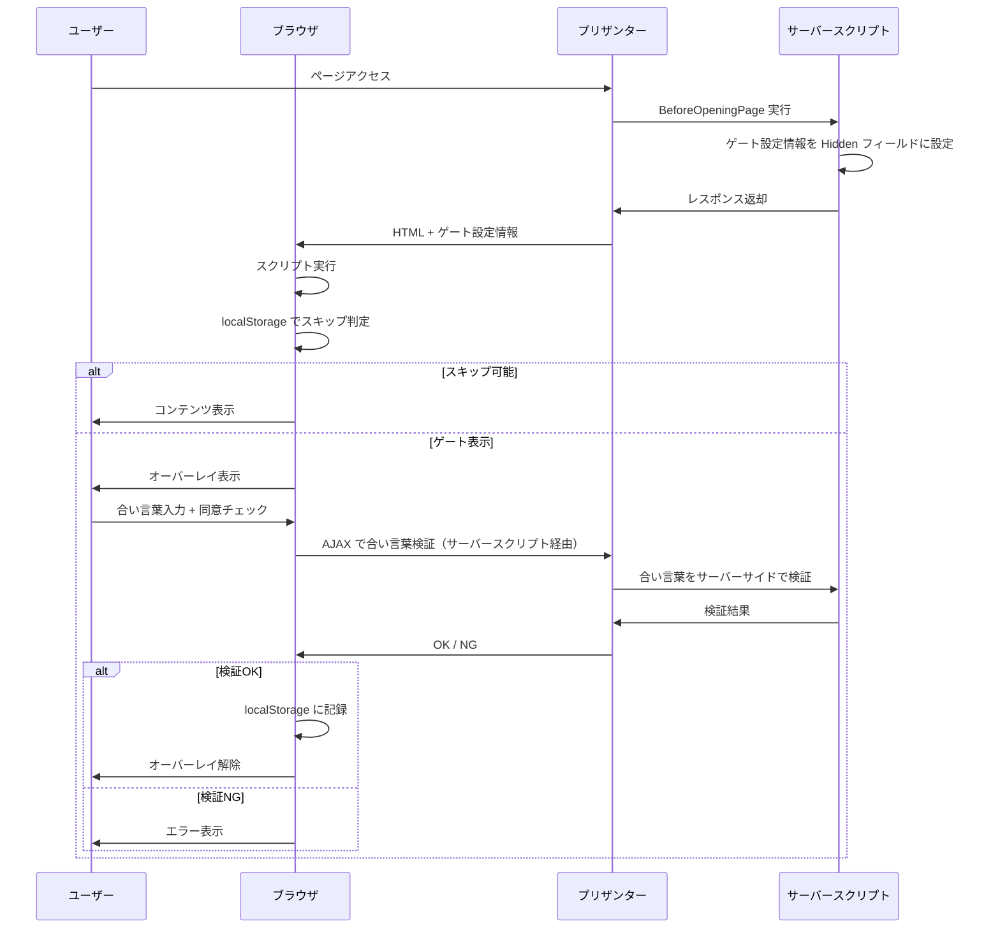
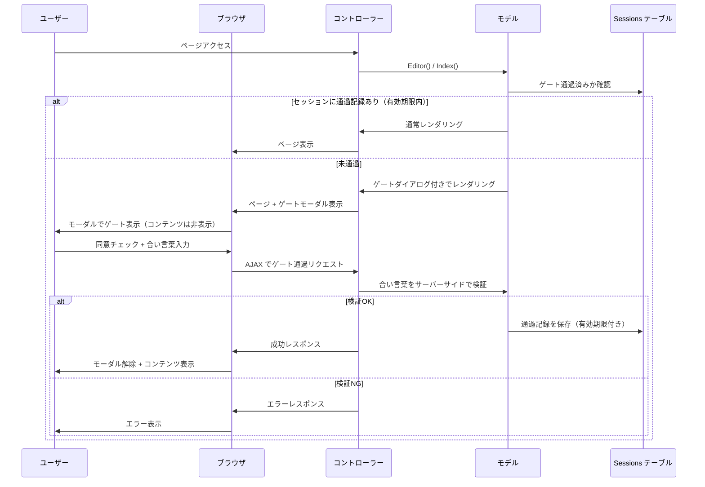
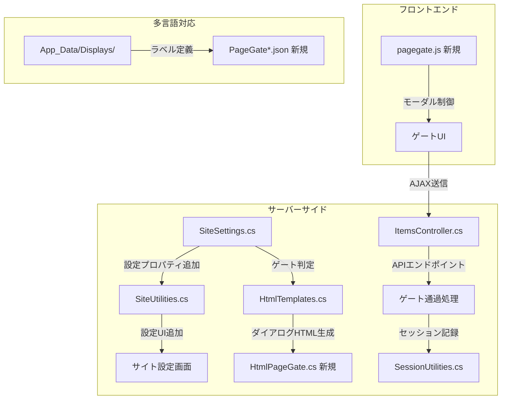
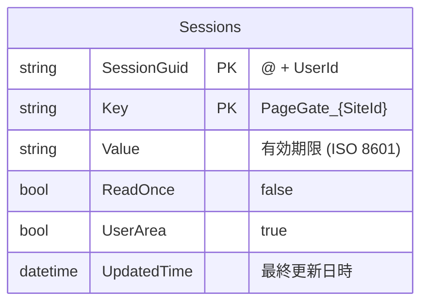

# ページゲート機能

ページを開く前にワンステップの確認操作（注意事項の同意チェック・合い言葉の入力）を挟み、条件を満たさない限りコンテンツを表示しない「ページゲート」機能について、プリザンター本体の標準機能として実装するための改修箇所と、既存拡張機構を用いた暫定実装方法を調査した結果。

<!-- START doctoc generated TOC please keep comment here to allow auto update -->
<!-- DON'T EDIT THIS SECTION, INSTEAD RE-RUN doctoc TO UPDATE -->

- [調査情報](#調査情報)
- [調査目的](#調査目的)
- [要件の整理](#要件の整理)
- [実装アプローチの比較](#実装アプローチの比較)
- [アプローチ A: クライアントサイド方式](#アプローチ-a-クライアントサイド方式)
    - [概要](#概要)
    - [アーキテクチャ](#アーキテクチャ)
    - [実装方法](#実装方法)
    - [セキュリティ上の考慮事項](#セキュリティ上の考慮事項)
    - [イベントフック](#イベントフック)
- [アプローチ B: サーバーサイド方式](#アプローチ-b-サーバーサイド方式)
    - [概要](#概要-1)
    - [アーキテクチャ](#アーキテクチャ-1)
    - [サーバースクリプトの仕組み](#サーバースクリプトの仕組み)
    - [ServerScript の context で利用可能なメソッド](#serverscript-の-context-で利用可能なメソッド)
    - [実装の課題](#実装の課題)
- [アプローチ C: ハイブリッド方式（推奨）](#アプローチ-c-ハイブリッド方式推奨)
    - [概要](#概要-2)
    - [アーキテクチャ](#アーキテクチャ-2)
    - [実装方法](#実装方法-1)
- [スキップ機能の実装方式](#スキップ機能の実装方式)
    - [方式比較](#方式比較)
    - [localStorage 方式（推奨）](#localstorage-方式推奨)
    - [Sessions API 方式（高セキュリティ用途）](#sessions-api-方式高セキュリティ用途)
- [ダイアログ機構の活用](#ダイアログ機構の活用)
    - [利用可能なダイアログ機構](#利用可能なダイアログ機構)
- [テーマ世代別の注意点](#テーマ世代別の注意点)
- [実装パターンの一覧](#実装パターンの一覧)
    - [パターン 1: 注意事項の同意のみ（合い言葉なし）](#パターン-1-注意事項の同意のみ合い言葉なし)
    - [パターン 2: 合い言葉の入力のみ（注意事項なし）](#パターン-2-合い言葉の入力のみ注意事項なし)
    - [パターン 3: 注意事項 + 合い言葉（フル機能）](#パターン-3-注意事項--合い言葉フル機能)
- [セキュリティに関する総合評価](#セキュリティに関する総合評価)
- [アプローチ D: 標準機能化（本体改修）](#アプローチ-d-標準機能化本体改修)
    - [概要](#概要-3)
    - [アーキテクチャ](#アーキテクチャ-3)
    - [改修箇所の全体像](#改修箇所の全体像)
    - [改修 1: SiteSettings へのプロパティ追加](#改修-1-sitesettings-へのプロパティ追加)
    - [改修 2: サイト設定 UI の追加](#改修-2-サイト設定-ui-の追加)
    - [改修 3: 多言語ラベルの追加](#改修-3-多言語ラベルの追加)
    - [改修 4: ゲートダイアログの HTML 生成](#改修-4-ゲートダイアログの-html-生成)
    - [改修 5: サーバーサイドのゲート通過処理](#改修-5-サーバーサイドのゲート通過処理)
    - [改修 6: フロントエンドのゲート制御スクリプト](#改修-6-フロントエンドのゲート制御スクリプト)
    - [改修ファイルまとめ](#改修ファイルまとめ)
    - [テーマ世代ごとのダイアログ実装](#テーマ世代ごとのダイアログ実装)
    - [セッション管理の詳細](#セッション管理の詳細)
    - [API アクセス時のゲート制御](#api-アクセス時のゲート制御)
    - [サイト設定画面のイメージ](#サイト設定画面のイメージ)
- [暫定実装: 拡張機構を用いた方式](#暫定実装-拡張機構を用いた方式)
- [結論](#結論)
- [関連ソースコード](#関連ソースコード)
- [関連ドキュメント](#関連ドキュメント)

<!-- END doctoc generated TOC please keep comment here to allow auto update -->

## 調査情報

| 調査日        | リポジトリ | ブランチ | タグ/バージョン    | コミット     | 備考     |
| ------------- | ---------- | -------- | ------------------ | ------------ | -------- |
| 2026年2月26日 | Pleasanter | main     | Pleasanter_1.5.1.0 | `34f162a439` | 初回調査 |

## 調査目的

- ページを開く際に「注意事項を表示して『理解した』にチェックを入れないと開けない」仕組みを実現する
- ページを開く際に「簡単な合い言葉を入力しないと開けない」仕組みを実現する
- 一度確認・入力を済ませたら数時間はスキップできる仕組みを実現する
- 上記をプリザンター本体の**標準機能として実装**するための改修箇所を特定する
- 暫定的に既存拡張機構（スクリプト・サーバースクリプト・拡張HTML）のみで実現する方法も調査する

---

## 要件の整理

| #   | 要件                         | 詳細                                                                    |
| --- | ---------------------------- | ----------------------------------------------------------------------- |
| R1  | 注意事項の表示と同意チェック | モーダルやオーバーレイで注意文を表示し、チェックボックスを入れて通過    |
| R2  | 合い言葉の入力               | 事前に共有された合い言葉を入力しないとコンテンツが閲覧できない          |
| R3  | 一定時間のスキップ           | 一度通過したら数時間は再確認なしでアクセス可能                          |
| R4  | サイト単位での適用           | 特定のサイト（テーブル/フォルダ）だけに適用できる                       |
| R5  | 標準機能としての実装         | プリザンター本体のサイト設定から GUI で設定可能な標準機能として実装する |

---

## 実装アプローチの比較

4つの実装アプローチを検討する。

| アプローチ                    | 主な実装手段                                   | 本体改修 | スキップ対応 | 推奨度 |
| ----------------------------- | ---------------------------------------------- | :------: | :----------: | :----: |
| A. クライアントサイド方式     | スクリプト + 拡張HTML + localStorage           |   不要   |     可能     |   低   |
| B. サーバーサイド方式         | サーバースクリプト + Sessions API + スクリプト |   不要   |     可能     |   低   |
| C. ハイブリッド方式           | サーバースクリプト（制御）+ スクリプト（UI）   |   不要   |     可能     |   中   |
| **D. 標準機能化（本体改修）** | SiteSettings + HtmlBuilder + Session           | **必要** |   **可能**   | **高** |

---

## アプローチ A: クライアントサイド方式

### 概要

スクリプト（サイト設定のスクリプト機能）と拡張HTML を用いて、ページ読み込み完了時にモーダルオーバーレイを表示し、確認が済むまでコンテンツを隠す方式。スキップ判定には `localStorage` を使用する。

### アーキテクチャ



### 実装方法

#### 手順 1: 拡張HTML の登録

サイト設定の「HTML」タブで、ゲート用のオーバーレイHTML を登録する。

| 設定項目 | 値                              |
| -------- | ------------------------------- |
| タイトル | ページゲート                    |
| 挿入位置 | BodyScriptBottom（9010）        |
| 出力先   | 一覧（Index）、編集（Edit）など |

**ファイル**: `Implem.Pleasanter/Libraries/Settings/Html.cs`（行番号: 8-14）

```csharp
public enum PositionTypes: int
{
    HeadTop = 1000,
    HeadBottom = 1010,
    BodyScriptTop = 9000,
    BodyScriptBottom = 9010
}
```

拡張HTMLの `PositionType` に `BodyScriptBottom (9010)` を指定すると、`</body>` 直前に HTML が挿入される。

登録するHTML例:

```html
<div
    id="pageGateOverlay"
    style="
  position: fixed; top: 0; left: 0; width: 100%; height: 100%;
  background: rgba(0,0,0,0.7); z-index: 99999;
  display: flex; align-items: center; justify-content: center;"
>
    <div
        style="
    background: #fff; border-radius: 8px; padding: 32px;
    max-width: 480px; width: 90%; box-shadow: 0 4px 24px rgba(0,0,0,0.3);"
    >
        <h3 style="margin-top: 0;">注意事項</h3>
        <p>
            このページには機密情報が含まれています。<br />
            以下の内容を確認し、同意のうえアクセスしてください。
        </p>
        <ul>
            <li>閲覧した内容を第三者に共有しないこと</li>
            <li>業務目的以外でデータを使用しないこと</li>
        </ul>
        <hr />
        <div id="pageGateAgreement">
            <label>
                <input type="checkbox" id="pageGateCheck" />
                上記の注意事項を理解しました
            </label>
        </div>
        <div id="pageGatePassphrase" style="margin-top: 12px;">
            <label>合い言葉を入力してください:</label><br />
            <input type="password" id="pageGateInput" style="width: 100%; padding: 6px; margin-top: 4px;" />
        </div>
        <div style="margin-top: 16px; text-align: right;">
            <button type="button" id="pageGateSubmit" style="padding: 8px 24px; cursor: pointer;">アクセスする</button>
        </div>
        <p id="pageGateError" style="color: red; margin-top: 8px; display: none;"></p>
    </div>
</div>
```

#### 手順 2: スクリプトの登録

サイト設定の「スクリプト」タブで、ゲート制御スクリプトを登録する。

**ファイル**: `Implem.Pleasanter/Libraries/Settings/Script.cs`

`Script` クラスのプロパティにより、スクリプトの適用対象画面を制御できる。

| プロパティ | 説明               |
| ---------- | ------------------ |
| All        | 全画面に適用       |
| New        | 新規作成画面に適用 |
| Edit       | 編集画面に適用     |
| Index      | 一覧画面に適用     |

登録するスクリプト例:

```javascript
// ページゲート制御スクリプト
(function () {
    // --- 設定 ---
    var PASSPHRASE = 'あいことば'; // 合い言葉（平文）
    var SKIP_HOURS = 4; // スキップ有効時間（時間）
    var STORAGE_KEY = 'pageGate_' + $p.siteId();
    // --- 設定ここまで ---

    var overlay = document.getElementById('pageGateOverlay');
    if (!overlay) return;

    // スキップ判定
    var stored = localStorage.getItem(STORAGE_KEY);
    if (stored) {
        var expiry = parseInt(stored, 10);
        if (Date.now() < expiry) {
            overlay.remove();
            return; // スキップ
        }
        localStorage.removeItem(STORAGE_KEY);
    }

    // メインコンテンツを非表示にする
    var mainForm = document.getElementById('MainForm');
    if (mainForm) mainForm.style.display = 'none';

    // 送信ボタンのイベント
    document.getElementById('pageGateSubmit').addEventListener('click', function () {
        var errorEl = document.getElementById('pageGateError');
        errorEl.style.display = 'none';
        // チェックボックスの検証
        var check = document.getElementById('pageGateCheck');
        if (check && !check.checked) {
            errorEl.textContent = '注意事項への同意が必要です。';
            errorEl.style.display = 'block';
            return;
        }
        // 合い言葉の検証
        var input = document.getElementById('pageGateInput');
        if (input && input.value !== PASSPHRASE) {
            errorEl.textContent = '合い言葉が正しくありません。';
            errorEl.style.display = 'block';
            return;
        }
        // 通過 → localStorage に記録してオーバーレイ解除
        var expiryTime = Date.now() + SKIP_HOURS * 60 * 60 * 1000;
        localStorage.setItem(STORAGE_KEY, expiryTime.toString());
        overlay.remove();
        if (mainForm) mainForm.style.display = '';
    });
})();
```

### セキュリティ上の考慮事項

| 項目                           | 評価 | 説明                                                                                   |
| ------------------------------ | ---- | -------------------------------------------------------------------------------------- |
| 合い言葉の秘匿性               | 低   | スクリプト内に平文で記述されるため、ブラウザの開発者ツールで閲覧可能                   |
| バイパス耐性                   | 低   | JavaScript を無効化するか開発者ツールで DOM を操作すれば突破可能                       |
| スキップ判定の信頼性           | 中   | localStorage はユーザーが自由に操作できる                                              |
| CSP（Content Security Policy） | 注意 | プリザンターが CSP nonce を使用している場合、インラインスクリプトは `nonce` 属性が必要 |

CSP に関して、サイト設定で登録されたスクリプトはプリザンターが自動的に `nonce` 属性を付与するため問題ない。

**ファイル**: `Implem.Pleasanter/Libraries/HtmlParts/HtmlScripts.cs`（行番号: 113-138）

```csharp
.Script(
    script: ss.GetScriptBody(
        context: context,
        peredicate: o => o.All == true && o.Disabled != true),
    _using: context.ContractSettings.Script != false
        && ss.ScriptsAllDisabled != true
        && ss.Scripts?.Any() == true,
    nonce: context.Nonce)
```

ただし、拡張HTML に `<script>` タグを含める場合は `nonce` が自動付与されないため、インラインスクリプトは拡張HTML ではなくスクリプト機能側に記述する必要がある。

### イベントフック

スクリプトの実行タイミングは、プリザンターのページ読み込みイベントに依存する。

**ファイル**: `Implem.Pleasanter/Libraries/HtmlParts/HtmlScripts.cs`（行番号: 241-260）

```csharp
case "edit":
    hb.Script(
        script: "window.addEventListener('load', () => { $p.execEvents('on_editor_load',''); });",
        nonce: context.Nonce);
    break;
case "index":
    hb.Script(
        script: "window.addEventListener('load', () => { $p.execEvents('on_grid_load',''); });",
        nonce: context.Nonce);
    break;
```

サイト設定のスクリプトは `<script>` タグとしてページに埋め込まれるため、DOM 読み込み時に即時実行される。
上記のように即時実行関数 `(function(){ ... })()` で記述すれば、
`on_editor_load` 等のイベントを待たずにゲートを適用できる。

---

## アプローチ B: サーバーサイド方式

### 概要

サーバースクリプト（`BeforeOpeningPage`）で Sessions API を用いたスキップ判定を行い、未確認の場合は `context.Redirect()` で専用の確認ページにリダイレクトする方式。

### アーキテクチャ



### サーバースクリプトの仕組み

`BeforeOpeningPage` は一覧画面・編集画面の両方で実行される。

**ファイル**: `Implem.Pleasanter/Models/Shared/_BaseModel.cs`（行番号: 807-829）

```csharp
public virtual ServerScriptModelRow SetByBeforeOpeningPageServerScript(
    Context context,
    SiteSettings ss,
    View view = null,
    GridData gridData = null)
{
    var scriptValues = ServerScriptUtilities.Execute(
        context: context,
        ss: ss,
        gridData: gridData,
        itemModel: null,
        view: view,
        where: script => script.BeforeOpeningPage == true,
        condition: ServerScriptConditions.BeforeOpeningPage);
    // ...
    return scriptValues;
}
```

### ServerScript の context で利用可能なメソッド

**ファイル**: `Implem.Pleasanter/Libraries/ServerScripts/ServerScriptModelContext.cs`（行番号: 147-195）

| メソッド                                              | 説明                                         |
| ----------------------------------------------------- | -------------------------------------------- |
| `context.Redirect(url)`                               | 指定 URL へリダイレクト                      |
| `context.Error(message)`                              | カスタムエラーを設定（ページ表示をブロック） |
| `context.AddMessage(text, css)`                       | メッセージを表示                             |
| `context.AddResponse(method, target, value, options)` | クライアントサイドのレスポンスコマンドを追加 |
| `context.Log(log)`                                    | サーバーログに出力                           |

### 実装の課題

| 課題                | 説明                                                                                     |
| ------------------- | ---------------------------------------------------------------------------------------- |
| 確認ページの構築    | プリザンター内に専用の確認ページを構築する手段が限られる                                 |
| リダイレクトループ  | 確認ページ自体もプリザンター上に作る場合、`BeforeOpeningPage` が再度発火する可能性がある |
| Sessions API の制約 | サーバースクリプトから直接 Sessions API を呼び出す手段が限定的                           |

`context.Redirect()` は外部ページへのリダイレクトに適しているが、プリザンター内で完結する確認フローを構築するには、クライアントサイド方式と組み合わせるハイブリッド方式が適している。

---

## アプローチ C: ハイブリッド方式（推奨）

### 概要

サーバースクリプト（`BeforeOpeningPage`）でスキップ判定のヒントとなる情報を
Hidden フィールドに設定し、クライアントサイドのスクリプトでゲート表示の要否を判断する方式。
スキップ状態の管理には `localStorage` を使用しつつ、
合い言葉のハッシュをサーバースクリプトで検証することでセキュリティを向上させる。

### アーキテクチャ



### 実装方法

#### 手順 1: サーバースクリプト（BeforeOpeningPage）

サイト設定のサーバースクリプトで、ゲートの設定情報を Hidden フィールドに追加する。

```javascript
// サーバースクリプト（BeforeOpeningPage = true）
// ゲートの有効/無効とメッセージをクライアントに伝達
context.Hidden.Add('pageGateEnabled', 'true');
context.Hidden.Add('pageGateMessage', 'このページには機密情報が含まれています。');
context.Hidden.Add('pageGateRequirePassphrase', 'true');
```

**ファイル**: `Implem.Pleasanter/Libraries/ServerScripts/ServerScriptModelHidden.cs`

```csharp
public class ServerScriptModelHidden
{
    public Dictionary<string, string> GetAll()
    public string Get(string key)
    public void Add(string key, object value)
}
```

Hidden フィールドはクライアント側から `$('#pageGateEnabled').val()` で参照できる。

#### 手順 2: サーバースクリプト（合い言葉検証用）

合い言葉をサーバーサイドで検証するために、もう1つサーバースクリプトを用意する方式もある。ただし、サーバースクリプトにはクライアントからの任意の値を受け取る汎用的な仕組みが限られるため、以下のいずれかの方法を採用する。

**方式 1: 説明欄等の一時フィールドを利用**

```javascript
// サーバースクリプト（BeforeUpdate = true）
// クライアントから一時的に Body フィールドに合い言葉を設定して送信
var input = model.Body;
var expected = 'あいことば';
if (input === expected) {
    // 検証成功 → Sessions API で記録
    // ※ サーバースクリプトから直接 Sessions API を呼ぶ方法は限定的
}
```

**方式 2: クライアントサイドで完結（簡易版）**

セキュリティ要件が厳密でない場合は、アプローチ A のようにクライアントサイドで合い言葉を検証する方式を採用する。

#### 手順 3: スクリプト（ゲート制御）

```javascript
// スクリプト（サイト設定のスクリプト機能）
(function () {
    // Hidden フィールドからゲート設定を取得
    var enabled = document.getElementById('pageGateEnabled');
    if (!enabled || enabled.value !== 'true') return;

    var SKIP_HOURS = 4;
    var STORAGE_KEY = 'pageGate_' + $p.siteId();

    // スキップ判定
    var stored = localStorage.getItem(STORAGE_KEY);
    if (stored && Date.now() < parseInt(stored, 10)) {
        return; // スキップ
    }
    localStorage.removeItem(STORAGE_KEY);

    // メインコンテンツを非表示にする
    var mainForm = document.getElementById('MainForm');
    if (mainForm) mainForm.style.display = 'none';

    // ゲートUIの構築（拡張HTML または JavaScript で動的生成）
    var message = document.getElementById('pageGateMessage');
    var requirePassphrase = document.getElementById('pageGateRequirePassphrase');

    var overlay = document.createElement('div');
    overlay.id = 'pageGateOverlay';
    overlay.style.cssText =
        'position:fixed;top:0;left:0;width:100%;height:100%;' +
        'background:rgba(0,0,0,0.7);z-index:99999;' +
        'display:flex;align-items:center;justify-content:center;';

    var box = document.createElement('div');
    box.style.cssText = 'background:#fff;border-radius:8px;padding:32px;' + 'max-width:480px;width:90%;';

    var html = '<h3 style="margin-top:0">注意事項</h3>';
    html += '<p>' + (message ? message.value : '') + '</p>';
    html += '<label><input type="checkbox" id="pgCheck"> ';
    html += '上記の注意事項を理解しました</label>';
    if (requirePassphrase && requirePassphrase.value === 'true') {
        html += '<div style="margin-top:12px">';
        html += '<label>合い言葉:</label><br>';
        html += '<input type="password" id="pgInput" style="width:100%;padding:6px;margin-top:4px">';
        html += '</div>';
    }
    html += '<div style="margin-top:16px;text-align:right">';
    html += '<button type="button" id="pgSubmit" style="padding:8px 24px;cursor:pointer">';
    html += 'アクセスする</button></div>';
    html += '<p id="pgError" style="color:red;margin-top:8px;display:none"></p>';

    box.innerHTML = html;
    overlay.appendChild(box);
    document.body.appendChild(overlay);

    document.getElementById('pgSubmit').addEventListener('click', function () {
        var err = document.getElementById('pgError');
        err.style.display = 'none';
        if (!document.getElementById('pgCheck').checked) {
            err.textContent = '注意事項への同意が必要です。';
            err.style.display = 'block';
            return;
        }
        if (requirePassphrase && requirePassphrase.value === 'true') {
            var PASSPHRASE = 'あいことば'; // ※ 簡易版: クライアント検証
            if (document.getElementById('pgInput').value !== PASSPHRASE) {
                err.textContent = '合い言葉が正しくありません。';
                err.style.display = 'block';
                return;
            }
        }
        var expiryTime = Date.now() + SKIP_HOURS * 60 * 60 * 1000;
        localStorage.setItem(STORAGE_KEY, expiryTime.toString());
        overlay.remove();
        if (mainForm) mainForm.style.display = '';
    });
})();
```

---

## スキップ機能の実装方式

一度ゲートを通過したら一定時間はスキップする機能の実装方式を比較する。

### 方式比較

| 方式           | 保存先                | 有効範囲         | 改ざん耐性 | 実装難易度 |
| -------------- | --------------------- | ---------------- | :--------: | :--------: |
| localStorage   | ブラウザ              | 同一ブラウザのみ |     低     |     低     |
| sessionStorage | ブラウザ（タブ単位）  | 同一タブのみ     |     低     |     低     |
| Cookie         | ブラウザ              | 同一ブラウザ     |     中     |     低     |
| Sessions API   | サーバー（RDB/Redis） | ユーザー単位     |     高     |     高     |

### localStorage 方式（推奨）

```javascript
// 保存（ゲート通過時）
var expiryTime = Date.now() + SKIP_HOURS * 60 * 60 * 1000;
localStorage.setItem(STORAGE_KEY, expiryTime.toString());

// 判定（ページ読み込み時）
var stored = localStorage.getItem(STORAGE_KEY);
if (stored && Date.now() < parseInt(stored, 10)) {
    // スキップ
}
```

| 利点                   | 説明                                       |
| ---------------------- | ------------------------------------------ |
| 実装が簡単             | JavaScript のみで完結する                  |
| サーバー負荷なし       | クライアント側で完結するため追加通信不要   |
| サイト単位の制御が容易 | `$p.siteId()` でキーを分離すれば独立管理可 |

| 注意点                   | 説明                                                 |
| ------------------------ | ---------------------------------------------------- |
| ブラウザ間で共有されない | 別ブラウザ・別端末では再度ゲートが表示される         |
| ユーザーが操作可能       | 開発者ツールから localStorage を直接編集できる       |
| プライベートモード       | プライベートブラウジングではセッション終了時に消える |

### Sessions API 方式（高セキュリティ用途）

プリザンターの Sessions API を使ってサーバーサイドでスキップ状態を管理する。

```javascript
// Sessions API で保存（ゲート通過時）
var expiry = new Date(Date.now() + SKIP_HOURS * 60 * 60 * 1000).toISOString();
$.ajax({
    url: '/api/sessions/Set',
    type: 'POST',
    contentType: 'application/json',
    headers: { 'X-Api-Key': apiKey },
    data: JSON.stringify({
        SessionKey: 'pageGate_' + $p.siteId(),
        SessionValue: expiry,
        SavePerUser: true,
    }),
});

// Sessions API で判定（ページ読み込み時）
$.ajax({
    url: '/api/sessions/Get',
    type: 'POST',
    contentType: 'application/json',
    headers: { 'X-Api-Key': apiKey },
    data: JSON.stringify({
        SessionKey: 'pageGate_' + $p.siteId(),
        SavePerUser: true,
    }),
    success: function (response) {
        // response.Value に有効期限が格納されている
    },
});
```

**ファイル**: `Implem.Pleasanter/Controllers/Api/SessionsController.cs`

```csharp
[HttpPost("Get")]    // SessionUtilities.GetByApi()
[HttpPost("Set")]    // SessionUtilities.SetByApi()
[HttpPost("Delete")] // SessionUtilities.DeleteByApi()
```

Sessions API 方式の場合、API キーが必要であり、クライアントサイドスクリプトに API キーを埋め込む必要がある点に注意する。

---

## ダイアログ機構の活用

プリザンターには複数のダイアログ/モーダル機構が存在する。ゲートUIの実装に活用できるかを検討する。

### 利用可能なダイアログ機構

| 機構                                   | テーマ世代 | 適合性 | 理由                                                  |
| -------------------------------------- | ---------- | :----: | ----------------------------------------------------- |
| jQuery UI Dialog                       | 第1世代    |   中   | カスタムHTML を表示可能だが、閉じるボタンで回避される |
| `<ui-modal>` Web Component             | 第2世代    |   中   | Shadow DOM で制御可能だが、動的生成が必要             |
| 独自オーバーレイ（div）                | 全テーマ   |   高   | 完全にカスタム制御でき、閉じるボタンを制御可能        |
| `$p.setMessage` / `$p.setErrorMessage` | 全テーマ   |   低   | 通知用途でありブロッキングには不向き                  |

独自オーバーレイ方式が最も柔軟であり、ゲート機能には適している。jQuery UI Dialog や `<ui-modal>` は閉じるボタンの制御やバイパス防止の観点で追加の対策が必要になる。

---

## テーマ世代別の注意点

プリザンターのテーマは `Context.ThemeVersion()` で第1世代（1.0M）と第2世代（2.0M）に分かれる。

**ファイル**: `Implem.Pleasanter/Libraries/Requests/Context.cs`（行番号: 1287-1322）

| 世代    | テーマ名                                 | ゲート実装への影響          |
| ------- | ---------------------------------------- | --------------------------- |
| 第1世代 | blitzer, cupertino, dark-hive 等（25種） | jQuery UI Dialog が利用可能 |
| 第2世代 | cerulean, green-tea, mandarin, midnight  | `<ui-modal>` が利用可能     |

独自オーバーレイ方式は HTML/CSS のみで構築するため、テーマ世代に依存しない。

---

## 実装パターンの一覧

用途に応じた実装パターンを以下に整理する。

### パターン 1: 注意事項の同意のみ（合い言葉なし）

| 項目         | 内容                                   |
| ------------ | -------------------------------------- |
| ゲート条件   | チェックボックスへのチェック           |
| スキップ     | localStorage（4時間）                  |
| セキュリティ | 低（注意喚起が目的）                   |
| 実装方式     | アプローチ A（クライアントサイド方式） |
| 必要な設定   | スクリプト x 1、拡張HTML x 1           |

### パターン 2: 合い言葉の入力のみ（注意事項なし）

| 項目         | 内容                                   |
| ------------ | -------------------------------------- |
| ゲート条件   | 合い言葉の一致                         |
| スキップ     | localStorage（4時間）                  |
| セキュリティ | 低〜中（合い言葉はクライアント検証）   |
| 実装方式     | アプローチ A（クライアントサイド方式） |
| 必要な設定   | スクリプト x 1                         |

### パターン 3: 注意事項 + 合い言葉（フル機能）

| 項目         | 内容                                   |
| ------------ | -------------------------------------- |
| ゲート条件   | チェック + 合い言葉                    |
| スキップ     | localStorage（4時間）                  |
| セキュリティ | 中（サーバースクリプトで設定管理）     |
| 実装方式     | アプローチ C（ハイブリッド方式）       |
| 必要な設定   | サーバースクリプト x 1、スクリプト x 1 |

---

## セキュリティに関する総合評価

| 評価項目         | 拡張機構方式（A〜C） | 標準機能（D） | 補足                                                    |
| ---------------- | :------------------: | :-----------: | ------------------------------------------------------- |
| 合い言葉の秘匿性 |          低          |      高       | 標準機能ではサーバーサイドで管理し、クライアント非公開  |
| バイパス耐性     |          低          |      高       | サーバーサイドでゲート通過を強制でき、API でも適用可能  |
| 改ざん耐性       |          低          |      高       | セッション管理がサーバー側で完結                        |
| スキップの信頼性 |          低          |      高       | Sessions テーブルで管理するため改ざん不可               |
| 実装の容易さ     |          高          |      中       | 標準機能は改修箇所が多いが、一度実装すれば GUI 操作のみ |

拡張機構方式（A〜C）は「注意喚起・簡易認証」の位置づけである。
標準機能（D）として実装すれば、サーバーサイドで完結するため、
セキュリティレベルを大幅に向上させることができる。

---

## アプローチ D: 標準機能化（本体改修）

### 概要

ページゲート機能をプリザンター本体のサイト設定に組み込み、
GUI から設定可能な標準機能として実装する方式。
合い言葉の検証やスキップ状態の管理をすべてサーバーサイドで行い、
セキュリティと利便性を両立する。

### アーキテクチャ



### 改修箇所の全体像



---

### 改修 1: SiteSettings へのプロパティ追加

ゲートの有効/無効、注意事項テキスト、合い言葉、スキップ時間を
SiteSettings のプロパティとして追加する。

**ファイル**: `Implem.Pleasanter/Libraries/Settings/SiteSettings.cs`

既存のプロパティ定義パターン（行番号: 100-102）:

```csharp
public bool? DisableSiteConditions;
public bool? GuideAllowExpand;
public string GuideExpand;
```

追加するプロパティ:

```csharp
// ページゲート設定
public bool? PageGateEnabled;              // ゲート有効/無効
public string PageGateMessage;             // 注意事項テキスト
public bool? PageGateRequireAgreement;     // 同意チェック要否
public bool? PageGateRequirePassphrase;    // 合い言葉要否
public string PageGatePassphrase;          // 合い言葉（平文 or ハッシュ）
public int? PageGateSkipMinutes;           // スキップ有効時間（分）
```

`Set` メソッドへの追加（行番号: 4038-4044 付近）:

```csharp
case "PageGateEnabled": PageGateEnabled = value.ToBool(); break;
case "PageGateMessage": PageGateMessage = value; break;
case "PageGateRequireAgreement": PageGateRequireAgreement = value.ToBool(); break;
case "PageGateRequirePassphrase": PageGateRequirePassphrase = value.ToBool(); break;
case "PageGatePassphrase": PageGatePassphrase = value; break;
case "PageGateSkipMinutes": PageGateSkipMinutes = value.ToInt(); break;
```

`SiteSettings` は `[Serializable()]` で JSON シリアライズされるため、
`public` プロパティを追加するだけで自動的にサイト設定 JSON に含まれる。
`[NonSerialized]` を付けない限り永続化される。

---

### 改修 2: サイト設定 UI の追加

サイト設定画面にページゲート設定タブまたはセクションを追加する。

**ファイル**: `Implem.Pleasanter/Models/Sites/SiteUtilities.cs`

#### タブの追加

既存のタブ定義パターン（行番号: 3984-4028）:

```csharp
href: "#GridSettingsEditor",
href: "#FiltersSettingsEditor",
href: "#EditorSettingsEditor",
// ...
```

追加:

```csharp
href: "#PageGateSettingsEditor",
```

#### 設定フィールドの追加

既存の `FieldCheckBox` / `FieldTextBox` パターン
（行番号: 5566-5571、6906-6910）:

```csharp
.FieldCheckBox(
    controlId: "DisableSiteConditions",
    fieldCss: "field-auto-thin",
    labelText: Displays.DisableSiteConditions(context: context),
    _checked: ss.DisableSiteConditions == true)
.FieldCheckBox(
    controlId: "AllowLockTable",
    fieldCss: "field-auto-thin",
    labelText: Displays.AllowLockTable(context: context),
    _checked: ss.AllowLockTable == true)
```

ページゲート設定セクションの実装:

```csharp
private static HtmlBuilder PageGateSettingsEditor(
    this HtmlBuilder hb, Context context, SiteSettings ss)
{
    return hb.FieldSet(id: "PageGateSettingsEditor", action: () => hb
        .FieldCheckBox(
            controlId: "PageGateEnabled",
            fieldCss: "field-auto-thin",
            labelText: Displays.PageGateEnabled(context: context),
            _checked: ss.PageGateEnabled == true)
        .FieldCheckBox(
            controlId: "PageGateRequireAgreement",
            fieldCss: "field-auto-thin",
            labelText: Displays.PageGateRequireAgreement(context: context),
            _checked: ss.PageGateRequireAgreement == true)
        .FieldMarkDown(
            context: context,
            controlId: "PageGateMessage",
            fieldCss: "field-wide",
            labelText: Displays.PageGateMessage(context: context),
            text: ss.PageGateMessage,
            alwaysSend: true)
        .FieldCheckBox(
            controlId: "PageGateRequirePassphrase",
            fieldCss: "field-auto-thin",
            labelText: Displays.PageGateRequirePassphrase(context: context),
            _checked: ss.PageGateRequirePassphrase == true)
        .FieldTextBox(
            controlId: "PageGatePassphrase",
            fieldCss: "field-auto-thin",
            controlType: HtmlTypes.TextTypes.Password,
            labelText: Displays.PageGatePassphrase(context: context),
            text: ss.PageGatePassphrase)
        .FieldTextBox(
            controlId: "PageGateSkipMinutes",
            fieldCss: "field-auto-thin",
            labelText: Displays.PageGateSkipMinutes(context: context),
            text: ss.PageGateSkipMinutes?.ToString() ?? "240",
            validateNumber: true));
}
```

---

### 改修 3: 多言語ラベルの追加

`App_Data/Displays/` ディレクトリに各ラベルの JSON ファイルを追加する。

**ファイル**: `Implem.Pleasanter/App_Data/Displays/`

既存ファイルのフォーマット例（`AllowLockTable.json`）:

```json
{
    "Id": "AllowLockTable",
    "Type": 110,
    "Languages": [{ "Body": "Allow lock table" }, { "Language": "ja", "Body": "テーブルのロックを許可" }]
}
```

追加する表示ラベル:

| ファイル名                       | Id                        | 英語                    | 日本語                     |
| -------------------------------- | ------------------------- | ----------------------- | -------------------------- |
| `PageGateEnabled.json`           | PageGateEnabled           | Enable page gate        | ページゲートを有効にする   |
| `PageGateRequireAgreement.json`  | PageGateRequireAgreement  | Require agreement       | 同意チェックを必須にする   |
| `PageGateMessage.json`           | PageGateMessage           | Gate message            | ゲートメッセージ           |
| `PageGateRequirePassphrase.json` | PageGateRequirePassphrase | Require passphrase      | 合い言葉を必須にする       |
| `PageGatePassphrase.json`        | PageGatePassphrase        | Passphrase              | 合い言葉                   |
| `PageGateSkipMinutes.json`       | PageGateSkipMinutes       | Skip duration (minutes) | スキップ有効時間（分）     |
| `PageGateAgreementRequired.json` | PageGateAgreementRequired | Agreement is required   | 同意が必要です             |
| `PageGatePassphraseInvalid.json` | PageGatePassphraseInvalid | Passphrase is incorrect | 合い言葉が正しくありません |
| `PageGateSettingsEditor.json`    | PageGateSettingsEditor    | Page Gate               | ページゲート               |

ラベル追加後、CodeDefiner（`_def` コマンド）を実行して
`Displays` クラスに対応する静的メソッドを自動生成する。

---

### 改修 4: ゲートダイアログの HTML 生成

ページテンプレートにゲート用のモーダル HTML を出力する。

**ファイル**: `Implem.Pleasanter/Libraries/HtmlParts/HtmlTemplates.cs`

既存の `TemplateDialogs` メソッド（行番号: 627-647）にゲートダイアログを追加する。

```csharp
private static HtmlBuilder TemplateDialogs(
    this HtmlBuilder hb, Context context, SiteSettings ss,
    bool useNavigationMenu = true)
{
    return !context.Ajax
        ? hb.Div(
            id: "TemplateDialogs",
            action: () => hb
                .Div(
                    id: "ChangePassword",
                    action: () => hb.Div(/* ... */),
                    _using: useNavigationMenu
                        && Parameters.Service.ShowChangePassword)
                .PageGateDialog(       // ← 追加
                    context: context,
                    ss: ss))
        : hb;
}
```

ゲートダイアログの HTML 生成メソッド（新規ファイルまたは既存ファイルに追加）:

**ファイル**: `Implem.Pleasanter/Libraries/HtmlParts/HtmlPageGate.cs`（新規）

```csharp
public static class HtmlPageGate
{
    public static HtmlBuilder PageGateDialog(
        this HtmlBuilder hb,
        Context context,
        SiteSettings ss)
    {
        if (ss?.PageGateEnabled != true) return hb;
        // スキップ判定はセッションで行う
        var sessionKey = $"PageGate_{ss.SiteId}";
        var skipUntil = SessionUtilities.GetUserArea(
            context: context,
            key: sessionKey);
        if (!skipUntil.IsNullOrEmpty()
            && DateTime.TryParse(skipUntil, out var expiry)
            && expiry > DateTime.Now)
        {
            return hb; // スキップ
        }
        return hb.Div(
            attributes: new HtmlAttributes()
                .Id("PageGateOverlay")
                .Style("position:fixed;top:0;left:0;" +
                    "width:100%;height:100%;" +
                    "background:rgba(0,0,0,0.7);" +
                    "z-index:99999;" +
                    "display:flex;align-items:center;" +
                    "justify-content:center;"),
            action: () => hb.Div(
                attributes: new HtmlAttributes()
                    .Id("PageGateBox")
                    .Class("page-gate-box"),
                action: () => hb
                    .H(3, Displays.PageGateSettingsEditor(
                        context: context))
                    .Div(action: () => hb
                        .Raw(ss.PageGateMessage ?? string.Empty))
                    .Div(
                        action: () => hb
                            .FieldCheckBox(
                                controlId: "PageGateAgreementCheck",
                                labelText: Displays
                                    .PageGateRequireAgreement(
                                        context: context),
                                _checked: false),
                        _using: ss.PageGateRequireAgreement == true)
                    .Div(
                        action: () => hb
                            .FieldTextBox(
                                controlId: "PageGatePassphraseInput",
                                controlType:
                                    HtmlTypes.TextTypes.Password,
                                labelText: Displays
                                    .PageGatePassphrase(
                                        context: context)),
                        _using: ss.PageGateRequirePassphrase == true)
                    .Div(css: "command-center", action: () => hb
                        .Button(
                            controlId: "PageGateSubmit",
                            text: Displays.Submit(context: context),
                            controlCss: "button-icon",
                            onClick: "$p.submitPageGate();",
                            icon: "ui-icon-check"))
                    .P(
                        id: "PageGateError",
                        css: "message-dialog",
                        style: "display:none")));
    }
}
```

第1世代テーマでは jQuery UI Dialog のスタイルが適用され、
第2世代テーマでは `<ui-modal>` への置換も検討できる。
ただし、ゲートの特性上「閉じるボタンなし・ESC キー無効」が必要であるため、
独自オーバーレイ（`position: fixed` の `div`）が最も適切である。

---

### 改修 5: サーバーサイドのゲート通過処理

合い言葉の検証とセッション記録を行う API エンドポイントを追加する。

**ファイル**: `Implem.Pleasanter/Controllers/ItemsController.cs`
（または専用コントローラーを新規作成）

```csharp
[HttpPost]
public ActionResult SubmitPageGate(long id)
{
    var context = new Context();
    var siteModel = new SiteModel(context: context, siteId: id);
    var ss = siteModel.SiteSettings;
    if (ss?.PageGateEnabled != true)
    {
        return Content("error");
    }
    // 同意チェックの検証
    if (ss.PageGateRequireAgreement == true)
    {
        var agreed = context.Forms.Bool("PageGateAgreementCheck");
        if (!agreed)
        {
            return Content(JsonConvert.SerializeObject(new {
                error = Displays.PageGateAgreementRequired(
                    context: context)
            }));
        }
    }
    // 合い言葉の検証
    if (ss.PageGateRequirePassphrase == true)
    {
        var input = context.Forms.Data("PageGatePassphraseInput");
        if (input != ss.PageGatePassphrase)
        {
            return Content(JsonConvert.SerializeObject(new {
                error = Displays.PageGatePassphraseInvalid(
                    context: context)
            }));
        }
    }
    // セッションに通過記録を保存
    var skipMinutes = ss.PageGateSkipMinutes ?? 240;
    var expiry = DateTime.Now
        .AddMinutes(skipMinutes).ToString("o");
    SessionUtilities.Set(
        context: context,
        key: $"PageGate_{ss.SiteId}",
        value: expiry,
        userArea: true); // ユーザー単位で保存
    return Content(JsonConvert.SerializeObject(new {
        success = true
    }));
}
```

`SessionUtilities.Set` の `userArea: true` パラメータにより、
セッションデータはユーザー単位で保存される。
これにより、別ブラウザ・別端末からでもスキップが共有される。

**ファイル**: `Implem.Pleasanter/Models/Sessions/SessionUtilities.cs`
（行番号: 88-107）

```csharp
public static void Set(
    Context context,
    string key,
    string value,
    bool readOnce = false,
    bool page = false,
    bool userArea = false,   // ← ユーザー単位の保存
    string sessionGuid = null)
```

`userArea: true` の場合、`sessionGuid` が `"@" + UserId` 形式で保存されるため、
ブラウザセッションではなくユーザー ID に紐づく永続的な保存となる。

---

### 改修 6: フロントエンドのゲート制御スクリプト

ゲートモーダルの操作と AJAX 送信を行うスクリプトを追加する。

**ファイル**: `Implem.PleasanterFrontend/wwwroot/src/scripts/generals/pagegate.js`
（新規）

```javascript
$p.submitPageGate = function () {
    var error = document.getElementById('PageGateError');
    if (error) error.style.display = 'none';
    $p.send($('#PageGateSubmit'), 'SubmitPageGate', {
        done: function (data) {
            var result = JSON.parse(data);
            if (result.success) {
                var overlay = document.getElementById('PageGateOverlay');
                if (overlay) overlay.remove();
                var mainForm = document.getElementById('MainForm');
                if (mainForm) mainForm.style.display = '';
            } else if (result.error && error) {
                error.textContent = result.error;
                error.style.display = 'block';
            }
        },
    });
};
```

また、ページ読み込み時に `MainForm` を非表示にする初期化処理を追加する。
これは `HtmlScripts.cs` に直接埋め込むか、`pagegate.js` 内で即時実行する。

```javascript
// ページ読み込み時にゲートが存在すればMainFormを非表示
(function () {
    if (document.getElementById('PageGateOverlay')) {
        var mainForm = document.getElementById('MainForm');
        if (mainForm) mainForm.style.display = 'none';
    }
})();
```

---

### 改修ファイルまとめ

#### サーバーサイド（C#）

| #   | ファイル                               | 改修内容                            | 種別 |
| --- | -------------------------------------- | ----------------------------------- | ---- |
| 1   | `Libraries/Settings/SiteSettings.cs`   | ゲート設定プロパティ + Set メソッド | 修正 |
| 2   | `Models/Sites/SiteUtilities.cs`        | 設定 UI（タブ + フィールド群）      | 修正 |
| 3   | `Libraries/HtmlParts/HtmlTemplates.cs` | TemplateDialogs にゲート追加        | 修正 |
| 4   | `Libraries/HtmlParts/HtmlPageGate.cs`  | ゲートダイアログ HTML 生成          | 新規 |
| 5   | `Controllers/ItemsController.cs`       | ゲート通過 API エンドポイント       | 修正 |

#### フロントエンド（JavaScript）

| #   | ファイル                                   | 改修内容                     | 種別 |
| --- | ------------------------------------------ | ---------------------------- | ---- |
| 6   | `wwwroot/src/scripts/generals/pagegate.js` | ゲート操作 + AJAX 送信       | 新規 |
| 7   | `wwwroot/src/scripts/generals/_init.js`    | `$p.submitPageGate` の初期化 | 修正 |

#### 多言語対応（Display JSON）

| #   | ファイル                                           | 改修内容           | 種別 |
| --- | -------------------------------------------------- | ------------------ | ---- |
| 8   | `App_Data/Displays/PageGateEnabled.json`           | 有効化ラベル       | 新規 |
| 9   | `App_Data/Displays/PageGateMessage.json`           | メッセージラベル   | 新規 |
| 10  | `App_Data/Displays/PageGateRequireAgreement.json`  | 同意必須ラベル     | 新規 |
| 11  | `App_Data/Displays/PageGateRequirePassphrase.json` | 合い言葉必須ラベル | 新規 |
| 12  | `App_Data/Displays/PageGatePassphrase.json`        | 合い言葉ラベル     | 新規 |
| 13  | `App_Data/Displays/PageGateSkipMinutes.json`       | スキップ時間ラベル | 新規 |
| 14  | `App_Data/Displays/PageGateAgreementRequired.json` | 同意必要エラー     | 新規 |
| 15  | `App_Data/Displays/PageGatePassphraseInvalid.json` | 合い言葉エラー     | 新規 |
| 16  | `App_Data/Displays/PageGateSettingsEditor.json`    | 設定タブラベル     | 新規 |

#### CodeDefiner

| #   | ファイル         | 改修内容                          | 種別 |
| --- | ---------------- | --------------------------------- | ---- |
| 17  | CodeDefiner 実行 | `_def` コマンドで Displays 再生成 | 実行 |

---

### テーマ世代ごとのダイアログ実装

ゲートダイアログの実装は、テーマ世代に応じて分岐させることもできる。

| テーマ世代 | 実装方式                       | 制御方法                                                |
| ---------- | ------------------------------ | ------------------------------------------------------- |
| 全テーマ   | 独自オーバーレイ（`div` 方式） | `position: fixed` + `z-index: 99999` で全画面をカバー   |
| 第1世代    | jQuery UI Dialog（代替案）     | `.dialog({ modal: true, closeOnEscape: false })` で制御 |
| 第2世代    | `<ui-modal>`（代替案）         | `onClosed` ハンドラで再表示を強制                       |

独自オーバーレイ方式はテーマ世代に依存せず、閉じるボタンや ESC キーによるバイパスが
発生しないため、ゲート機能には最も適している。

---

### セッション管理の詳細

スキップ状態は `Sessions` テーブルで管理する。

**ファイル**: `Implem.Pleasanter/Models/Sessions/SessionUtilities.cs`

| 項目        | 値                                   |
| ----------- | ------------------------------------ |
| SessionGuid | `@{UserId}`（UserArea 方式）         |
| Key         | `PageGate_{SiteId}`                  |
| Value       | ISO 8601 形式の有効期限              |
| ストレージ  | RDB（Sessions テーブル）または Redis |



UserArea 方式のセッションは `sessionGuid` が `"@" + UserId` で保存されるため、
以下の利点がある:

| 利点                     | 説明                                                 |
| ------------------------ | ---------------------------------------------------- |
| ユーザー単位の管理       | 同一ユーザーが別ブラウザからアクセスしてもスキップ可 |
| ブラウザセッション非依存 | セッション cookie が切れても維持される               |
| サーバーサイド完結       | クライアントからの改ざんが不可能                     |

---

### API アクセス時のゲート制御

標準機能化にあたり、API 経由のアクセスにもゲートを適用するか検討が必要。

| アクセス経路   | ゲート適用 | 理由                                               |
| -------------- | :--------: | -------------------------------------------------- |
| ブラウザ（UI） |    適用    | モーダルによる対話的なゲートが可能                 |
| API            |   非適用   | API は自動処理が前提であり、対話的なゲートは不適切 |
| ServerScript   |   非適用   | サーバー内部処理のため対象外                       |

API アクセスはページゲートの対象外とし、
API の利用制限には既存の API キー認証とレートリミッターを使用する。

---

### サイト設定画面のイメージ

標準機能化した場合のサイト設定画面の構成を以下に示す。

```text
テーブルの管理
├── 一覧
├── 集計
├── エディタ
├── ...
├── ページゲート          ← 新規タブ
│   ├── [x] ページゲートを有効にする
│   ├── [x] 同意チェックを必須にする
│   ├── ゲートメッセージ: [Markdown テキストエリア]
│   ├── [x] 合い言葉を必須にする
│   ├── 合い言葉: [パスワード入力]
│   └── スキップ有効時間（分）: [240]
├── ...
└── アクセス制御
```

---

## 暫定実装: 拡張機構を用いた方式

本体改修が完了するまでの暫定実装として、
既存の拡張機構（スクリプト・拡張HTML・サーバースクリプト）を用いた方式も記載する。

---

## 結論

| 項目                       | 内容                                                                                               |
| -------------------------- | -------------------------------------------------------------------------------------------------- |
| 標準機能としての実現可能性 | 既存の SiteSettings + HtmlBuilder + Session の設計パターンに沿って実装可能                         |
| 推奨アプローチ             | アプローチ D（標準機能化）を推奨。暫定的にはアプローチ C（ハイブリッド方式）で対応可能             |
| 改修ファイル数             | サーバーサイド 5 ファイル + フロントエンド 2 ファイル + Display JSON 9 ファイル + CodeDefiner 実行 |
| 注意事項の同意チェック     | SiteSettings で設定 → サーバーサイドでダイアログ HTML 生成 → AJAX で通過検証                       |
| 合い言葉の入力             | SiteSettings に合い言葉を保存 → サーバーサイドで検証（クライアント非公開）                         |
| スキップ機能               | Sessions テーブル（UserArea 方式）で有効期限付きセッションとしてサーバーサイド管理                 |
| セキュリティ               | 標準機能化により合い言葉の秘匿性・バイパス耐性・改ざん耐性が大幅に向上                             |
| API アクセス               | ページゲートの対象外（API キー認証 + レートリミッターで制御）                                      |

---

## 関連ソースコード

| ファイル                                                                | 説明                                         |
| ----------------------------------------------------------------------- | -------------------------------------------- |
| `Implem.Pleasanter/Libraries/Settings/SiteSettings.cs`                  | サイト設定（ゲート設定プロパティの追加先）   |
| `Implem.Pleasanter/Models/Sites/SiteUtilities.cs`                       | サイト設定 UI（タブ + フィールド群の追加先） |
| `Implem.Pleasanter/Libraries/HtmlParts/HtmlTemplates.cs`                | ページテンプレート（ゲートダイアログ挿入先） |
| `Implem.Pleasanter/Libraries/Settings/Script.cs`                        | カスタムスクリプトの定義                     |
| `Implem.Pleasanter/Libraries/Settings/Html.cs`                          | カスタムHTML の定義と PositionTypes          |
| `Implem.Pleasanter/Libraries/Settings/ServerScript.cs`                  | サーバースクリプトの条件定義                 |
| `Implem.Pleasanter/Libraries/HtmlParts/HtmlScripts.cs`                  | スクリプトの HTML 出力と nonce 付与          |
| `Implem.Pleasanter/Libraries/ServerScripts/ServerScriptModelContext.cs` | ServerScript の context メソッド             |
| `Implem.Pleasanter/Libraries/ServerScripts/ServerScriptModelHidden.cs`  | Hidden フィールドの追加                      |
| `Implem.Pleasanter/Models/Shared/_BaseModel.cs`                         | BeforeOpeningPage の実行                     |
| `Implem.Pleasanter/Controllers/Api/SessionsController.cs`               | Sessions API エンドポイント                  |
| `Implem.Pleasanter/Models/Sessions/SessionUtilities.cs`                 | セッション CRUD 操作（スキップ管理）         |
| `Implem.Pleasanter/App_Data/Displays/AllowLockTable.json`               | Display JSON のフォーマット参照              |
| `Implem.PleasanterFrontend/wwwroot/src/scripts/generals/_event.js`      | クライアントサイドイベントシステム           |
| `Implem.PleasanterFrontend/wwwroot/src/scripts/generals/_dispatch.js`   | サーバーレスポンスの処理                     |

## 関連ドキュメント

| ドキュメント                                                                                    | 関連性                         |
| ----------------------------------------------------------------------------------------------- | ------------------------------ |
| [Session 管理の実装](../02-セッション/002-セッション管理.md)                                    | Sessions API のストレージ構造  |
| [ブラウザ組み込みモーダル使用箇所と移行手段](015-ブラウザ組み込みモーダル使用箇所と移行手段.md) | ダイアログ/モーダル機構の比較  |
| [ServerScript 実装](../05-基盤・ツール/006-ServerScript実装.md)                                 | サーバースクリプトの実行フロー |
