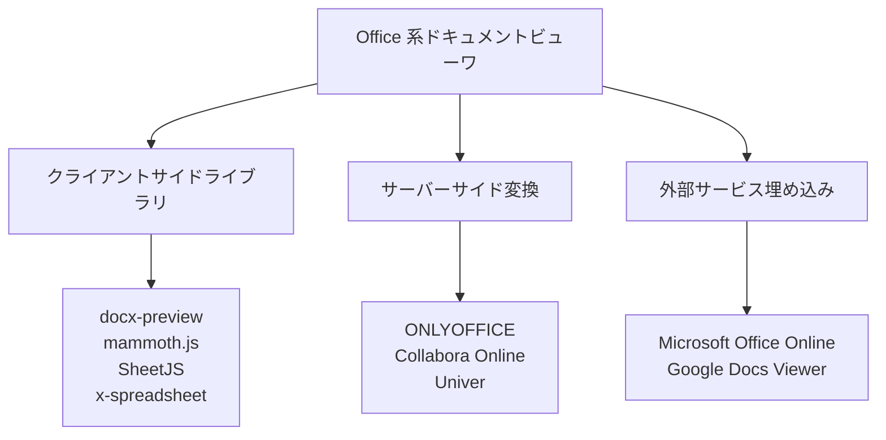
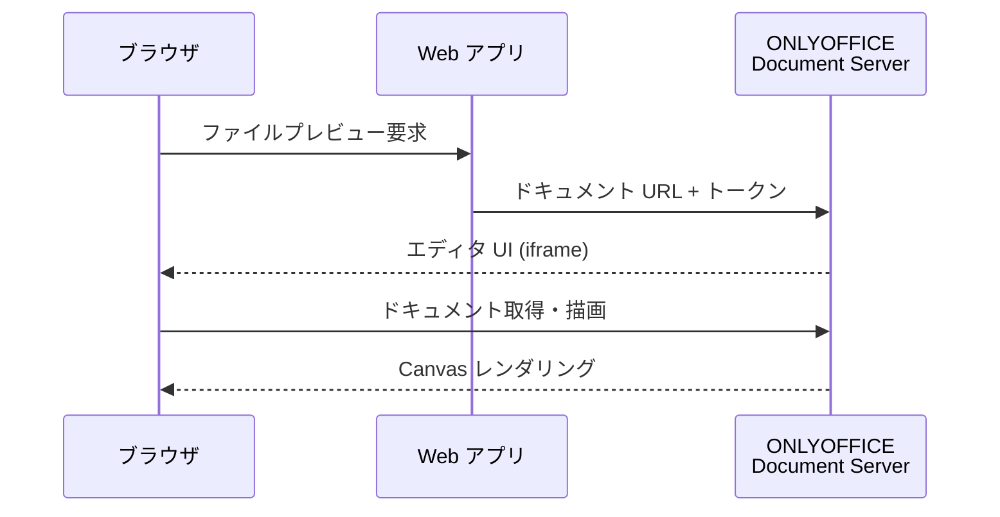
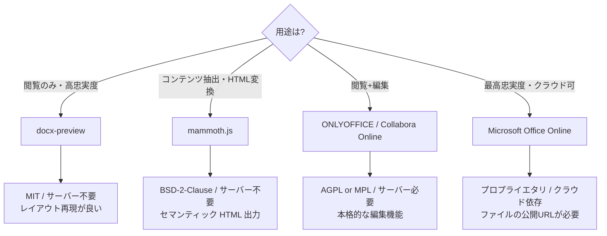
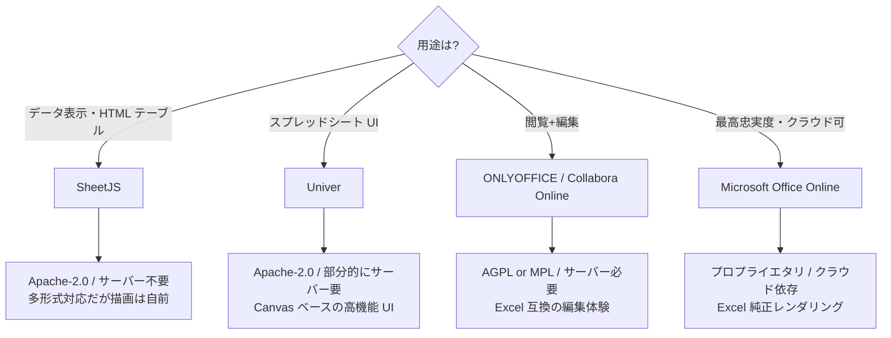
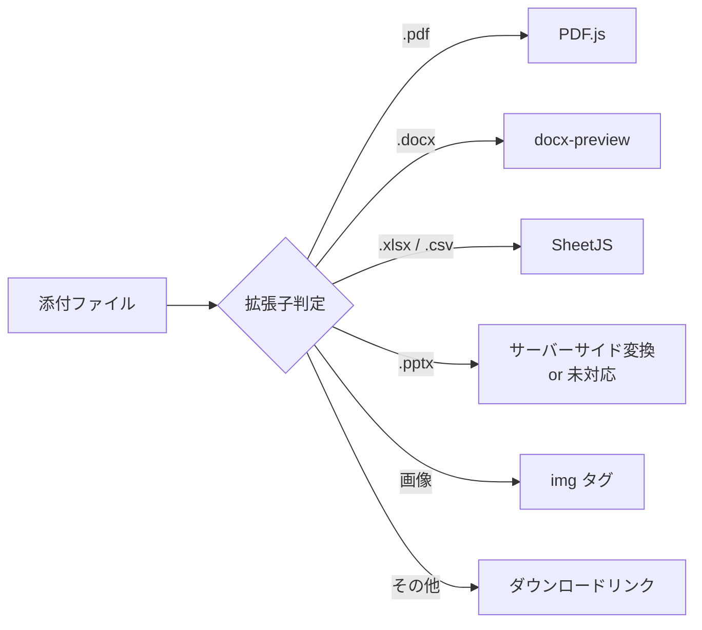

# Office 系ドキュメントビューワ比較

PDF.js のようにブラウザ上に埋め込んで使える Office 系ドキュメント（Word / Excel / PowerPoint）のビューワライブラリ・サービスを比較調査する。

<!-- START doctoc generated TOC please keep comment here to allow auto update -->
<!-- DON'T EDIT THIS SECTION, INSTEAD RE-RUN doctoc TO UPDATE -->

- [調査情報](#調査情報)
- [調査目的](#調査目的)
- [PDF.js の特徴（比較基準）](#pdfjs-の特徴比較基準)
- [ビューワの分類](#ビューワの分類)
- [クライアントサイドライブラリ](#クライアントサイドライブラリ)
    - [docx-preview](#docx-preview)
    - [mammoth.js](#mammothjs)
    - [SheetJS（xlsx）](#sheetjsxlsx)
    - [x-spreadsheet](#x-spreadsheet)
    - [vue-office](#vue-office)
- [サーバーサイド変換型](#サーバーサイド変換型)
    - [ONLYOFFICE Document Server](#onlyoffice-document-server)
    - [Collabora Online](#collabora-online)
    - [Univer](#univer)
- [外部サービス埋め込み型](#外部サービス埋め込み型)
    - [Microsoft Office Online（Office for the web）](#microsoft-office-onlineoffice-for-the-web)
    - [Google Docs Viewer](#google-docs-viewer)
- [比較一覧](#比較一覧)
    - [対応形式の比較](#対応形式の比較)
    - [導入・運用面の比較](#導入運用面の比較)
- [用途別の推奨ライブラリ](#用途別の推奨ライブラリ)
    - [Word（DOCX）プレビュー](#worddocxプレビュー)
    - [Excel（XLSX）プレビュー](#excelxlsxプレビュー)
    - [PowerPoint（PPTX）プレビュー](#powerpointpptxプレビュー)
- [プリザンターへの統合を考慮した評価](#プリザンターへの統合を考慮した評価)
    - [前提条件](#前提条件)
    - [各方式の適合度](#各方式の適合度)
    - [推奨構成](#推奨構成)
- [結論](#結論)
- [関連リンク](#関連リンク)

<!-- END doctoc generated TOC please keep comment here to allow auto update -->

## 調査情報

| 調査日        | リポジトリ | ブランチ | タグ/バージョン    | コミット   | 備考                              |
| ------------- | ---------- | -------- | ------------------ | ---------- | --------------------------------- |
| 2026年2月27日 | Pleasanter | main     | Pleasanter_1.5.1.0 | `34f162a4` | PDF.js 相当の Office ビューワ調査 |

## 調査目的

- PDF.js と同様にブラウザへ埋め込み可能な Office ドキュメントビューワの候補を洗い出す
- 各ライブラリ・サービスの対応形式、ライセンス、導入方式を比較する
- プリザンター添付ファイルのプレビュー用途に適した選択肢を整理する

---

## PDF.js の特徴（比較基準）

Office 系ビューワを評価するにあたり、比較基準となる PDF.js の特徴を整理する。

| 項目                 | 内容                                       |
| -------------------- | ------------------------------------------ |
| 対応形式             | PDF                                        |
| レンダリング方式     | クライアントサイド（Canvas / SVG）         |
| サーバー依存         | なし（静的ファイルのみで動作）             |
| ライセンス           | Apache-2.0                                 |
| GitHub Stars         | 約 50,000                                  |
| 提供形態             | npm パッケージ / CDN / 静的ファイル        |
| フレームワーク非依存 | はい（Vanilla JS）                         |
| 主な利用例           | Firefox 内蔵 PDF ビューワ、各種 Web アプリ |

> PDF.js は **サーバー不要**・**高忠実度レンダリング**・**OSS（Apache-2.0）** という3点が大きな強みである。Office 系ビューワではこの3条件すべてを満たすものは存在せず、いずれかのトレードオフが発生する。

---

## ビューワの分類

Office 系ドキュメントビューワは、大きく3つの方式に分類できる。



| 方式                 | 概要                                            | サーバー要否 | レンダリング忠実度 |
| -------------------- | ----------------------------------------------- | ------------ | ------------------ |
| クライアントサイド   | JS ライブラリがブラウザ上でファイルを解析・描画 | 不要         | 中～低             |
| サーバーサイド変換   | サーバーでファイルを解析し HTML/画像に変換      | 必要         | 高                 |
| 外部サービス埋め込み | Microsoft / Google のサービスに iframe で委譲   | 不要         | 最高               |

---

## クライアントサイドライブラリ

### docx-preview

DOCX ファイルを HTML に変換してブラウザ上でレンダリングするライブラリ。Office 系の「PDF.js 相当」に最も近い位置づけである。

| 項目             | 内容                                                                                              |
| ---------------- | ------------------------------------------------------------------------------------------------- |
| リポジトリ       | [VolodymyrBaydalka/docxjs](https://github.com/VolodymyrBaydalka/docxjs)                           |
| npm パッケージ   | `docx-preview`                                                                                    |
| 対応形式         | DOCX（.docx）のみ                                                                                 |
| レンダリング方式 | DOCX → HTML + CSS 変換                                                                            |
| サーバー依存     | なし（クライアント完結）                                                                          |
| ライセンス       | MIT                                                                                               |
| 依存ライブラリ   | JSZip（ZIP 展開）                                                                                 |
| 主な機能         | ヘッダー/フッター、脚注、コメント（実験的）、ページ区切り、変更履歴（実験的）、テーブル、画像描画 |
| 制限事項         | リアルタイムページ分割は未対応、DOC 形式は非対応、複雑なレイアウトの再現性に限界あり              |

```javascript
// 使用例
import { renderAsync } from 'docx-preview';

const response = await fetch('/api/binaries/{guid}');
const blob = await response.blob();
await renderAsync(blob, document.getElementById('container'));
```

### mammoth.js

DOCX を意味的な HTML に変換するライブラリ。見た目の忠実度よりも HTML セマンティクスを重視する設計。

| 項目             | 内容                                                                       |
| ---------------- | -------------------------------------------------------------------------- |
| リポジトリ       | [mwilliamson/mammoth.js](https://github.com/mwilliamson/mammoth.js)        |
| npm パッケージ   | `mammoth`                                                                  |
| GitHub Stars     | 約 6,100                                                                   |
| 対応形式         | DOCX（.docx）のみ                                                          |
| レンダリング方式 | DOCX → セマンティック HTML 変換                                            |
| サーバー依存     | なし（クライアント / Node.js 両対応）                                      |
| ライセンス       | BSD-2-Clause                                                               |
| 設計思想         | 見た目の再現ではなく、HTML の意味構造（h1, p, table 等）への変換を重視する |
| 制限事項         | レイアウトやスタイルの再現性は低い、表示目的よりもコンテンツ抽出向き       |

### SheetJS（xlsx）

Excel / CSV / ODS 等のスプレッドシートファイルを解析するライブラリ。データの読み書きに特化しており、ビューワとして使う場合は別途 UI の構築が必要。

| 項目             | 内容                                                                    |
| ---------------- | ----------------------------------------------------------------------- |
| リポジトリ       | [SheetJS/sheetjs](https://github.com/SheetJS/sheetjs)                   |
| npm パッケージ   | `xlsx`                                                                  |
| GitHub Stars     | 約 36,200                                                               |
| 対応形式         | XLSX / XLS / CSV / ODS / XLSB 等（多数）                                |
| レンダリング方式 | データ解析のみ（HTML テーブル出力も可能だがスタイルは限定的）           |
| サーバー依存     | なし（クライアント / Node.js 両対応）                                   |
| ライセンス       | Apache-2.0（Community Edition） / 商用ライセンス（Pro Edition）         |
| 制限事項         | グラフ・条件付き書式・ピボットテーブル等の描画は Community 版では非対応 |

### x-spreadsheet

Canvas ベースの軽量スプレッドシート UI。XLSX の直接読み込みには SheetJS との併用が必要。

| 項目             | 内容                                                              |
| ---------------- | ----------------------------------------------------------------- |
| リポジトリ       | [myliang/x-spreadsheet](https://github.com/myliang/x-spreadsheet) |
| GitHub Stars     | 約 14,600（後継: wolf-table/table）                               |
| 対応形式         | 独自データ形式（SheetJS と組み合わせて XLSX 読み込み可能）        |
| レンダリング方式 | Canvas ベース                                                     |
| サーバー依存     | なし                                                              |
| ライセンス       | MIT                                                               |
| 状態             | メンテナンス終了（後継プロジェクトへ移行済み）                    |

### vue-office

Vue コンポーネントとして Word / Excel / PDF / PPTX のプレビューを提供する統合パッケージ。内部的に docx-preview や SheetJS 等を利用している。

| 項目             | 内容                                                                |
| ---------------- | ------------------------------------------------------------------- |
| リポジトリ       | [501351981/vue-office](https://github.com/501351981/vue-office)     |
| GitHub Stars     | 約 5,500                                                            |
| 対応形式         | DOCX / XLSX / PDF / PPTX                                            |
| レンダリング方式 | 各形式の専用ライブラリをラップ                                      |
| サーバー依存     | なし                                                                |
| ライセンス       | MIT                                                                 |
| フレームワーク   | Vue 2 / Vue 3（React 等には非対応）                                 |
| 制限事項         | Vue に強く依存するため、Pleasanter のような jQuery ベースには不向き |

---

## サーバーサイド変換型

### ONLYOFFICE Document Server

Office ドキュメントの閲覧・編集機能を提供する本格的なドキュメントサーバー。Docker コンテナとして提供される。

| 項目             | 内容                                                                                         |
| ---------------- | -------------------------------------------------------------------------------------------- |
| リポジトリ       | [ONLYOFFICE/DocumentServer](https://github.com/ONLYOFFICE/DocumentServer)                    |
| GitHub Stars     | 約 6,300                                                                                     |
| 対応形式         | DOCX / XLSX / PPTX / ODP / ODS / ODT / PDF 等                                                |
| レンダリング方式 | サーバーサイド処理 + クライアント描画（Canvas）                                              |
| サーバー依存     | 必要（Docker / オンプレミスサーバー）                                                        |
| ライセンス       | AGPL-3.0（Community Edition） / 商用ライセンス                                               |
| 主な機能         | 閲覧 / 編集 / 共同編集 / コメント / 変更履歴 / PDF 変換                                      |
| 制限事項         | Community Edition は同時接続 20 ユーザーまで。サーバーリソース（RAM 4GB 以上推奨）を消費する |
| 統合方式         | iframe + JavaScript API で既存 Web アプリに埋め込み可能                                      |



### Collabora Online

LibreOffice をベースとしたオンラインドキュメントサーバー。Nextcloud や ownCloud との統合実績が豊富。

| 項目             | 内容                                                                    |
| ---------------- | ----------------------------------------------------------------------- |
| リポジトリ       | [CollaboraOnline/online](https://github.com/CollaboraOnline/online)     |
| GitHub Stars     | 約 3,000                                                                |
| 対応形式         | DOCX / XLSX / PPTX / ODP / ODS / ODT / PDF 等                           |
| レンダリング方式 | サーバーサイド処理（LibreOffice Core） + WebSocket + Canvas / SVG       |
| サーバー依存     | 必要（Docker / オンプレミスサーバー）                                   |
| ライセンス       | MPL-2.0（CODE = Collabora Online Development Edition） / 商用ライセンス |
| 主な機能         | 閲覧 / 編集 / 共同編集 / コメント / 変更履歴                            |
| 制限事項         | LibreOffice ランタイムが必要でサーバーリソース消費が大きい              |
| 統合方式         | WOPI プロトコル + iframe で既存 Web アプリに埋め込み可能                |

### Univer

スプレッドシート・ドキュメント・スライドの統合フレームワーク。Luckysheet の後継プロジェクト。

| 項目             | 内容                                                            |
| ---------------- | --------------------------------------------------------------- |
| リポジトリ       | [dream-num/univer](https://github.com/dream-num/univer)         |
| GitHub Stars     | 約 12,500                                                       |
| 対応形式         | XLSX / DOCX（一部）                                             |
| レンダリング方式 | Canvas ベース（クライアント描画）                               |
| サーバー依存     | Univer Server（共同編集やインポート/エクスポート時に必要）      |
| ライセンス       | Apache-2.0（フロントエンド） / 商用ライセンス（サーバーサイド） |
| 主な機能         | スプレッドシート編集・数式・条件付き書式・フィルター・ピボット  |
| 制限事項         | PPTX 対応は限定的、サーバー部分は商用ライセンス                 |

---

## 外部サービス埋め込み型

### Microsoft Office Online（Office for the web）

Microsoft が提供する Office ドキュメントの Web ビューワ。公開 URL のファイルを iframe で表示できる。

| 項目               | 内容                                                                          |
| ------------------ | ----------------------------------------------------------------------------- |
| 対応形式           | DOCX / XLSX / PPTX / DOC / XLS / PPT                                          |
| レンダリング忠実度 | 最高（Microsoft 純正レンダリング）                                            |
| サーバー依存       | Microsoft のクラウドサービスに依存                                            |
| ライセンス         | 無料（ビューワ）/ Microsoft 365 ライセンス（編集）                            |
| 統合方式           | iframe 埋め込み（`https://view.officeapps.live.com/op/embed.aspx?src={URL}`） |
| 制限事項           | ファイルがインターネット上で公開 URL としてアクセス可能である必要がある       |
| オンプレミス対応   | 不可（クラウドのみ）                                                          |

```html
<!-- 使用例 -->
<iframe
    src="https://view.officeapps.live.com/op/embed.aspx?src=https://example.com/doc.docx"
    width="100%"
    height="600"
    frameborder="0"
>
</iframe>
```

### Google Docs Viewer

Google が提供するドキュメントビューワ。公開 URL のファイルを iframe で表示できる。

| 項目               | 内容                                                                                     |
| ------------------ | ---------------------------------------------------------------------------------------- |
| 対応形式           | DOCX / XLSX / PPTX / PDF / TIFF 等                                                       |
| レンダリング忠実度 | 高                                                                                       |
| サーバー依存       | Google のクラウドサービスに依存                                                          |
| ライセンス         | 無料（ビューワ）                                                                         |
| 統合方式           | iframe 埋め込み（`https://docs.google.com/gview?url={URL}&embedded=true`）               |
| 制限事項           | ファイルがインターネット上でアクセス可能である必要がある、ファイルサイズ上限あり（25MB） |
| オンプレミス対応   | 不可（クラウドのみ）                                                                     |

---

## 比較一覧

### 対応形式の比較

| ライブラリ/サービス     | DOCX | XLSX  | PPTX | DOC | XLS | PPT | PDF | ODF |
| ----------------------- | :--: | :---: | :--: | :-: | :-: | :-: | :-: | :-: |
| docx-preview            | Yes  |   -   |  -   |  -  |  -  |  -  |  -  |  -  |
| mammoth.js              | Yes  |   -   |  -   |  -  |  -  |  -  |  -  |  -  |
| SheetJS                 |  -   |  Yes  |  -   |  -  | Yes |  -  |  -  | Yes |
| x-spreadsheet           |  -   | (\*1) |  -   |  -  |  -  |  -  |  -  |  -  |
| vue-office              | Yes  |  Yes  | Yes  |  -  |  -  |  -  | Yes |  -  |
| ONLYOFFICE              | Yes  |  Yes  | Yes  | Yes | Yes | Yes | Yes | Yes |
| Collabora Online        | Yes  |  Yes  | Yes  | Yes | Yes | Yes | Yes | Yes |
| Univer                  |  -   |  Yes  |  -   |  -  |  -  |  -  |  -  |  -  |
| Microsoft Office Online | Yes  |  Yes  | Yes  | Yes | Yes | Yes |  -  |  -  |
| Google Docs Viewer      | Yes  |  Yes  | Yes  |  -  |  -  |  -  | Yes |  -  |

> (\*1) SheetJS との組み合わせで XLSX の読み込みが可能

### 導入・運用面の比較

| ライブラリ/サービス     | サーバー不要 | OSS ライセンス    | オンプレミス | 編集機能 | レンダリング忠実度 |
| ----------------------- | :----------: | ----------------- | :----------: | :------: | :----------------: |
| docx-preview            |     Yes      | MIT               |     Yes      |    -     |         中         |
| mammoth.js              |     Yes      | BSD-2-Clause      |     Yes      |    -     |         低         |
| SheetJS                 |     Yes      | Apache-2.0        |     Yes      |    -     |         低         |
| x-spreadsheet           |     Yes      | MIT               |     Yes      |   Yes    |         中         |
| ONLYOFFICE              |      -       | AGPL-3.0          |     Yes      |   Yes    |         高         |
| Collabora Online        |      -       | MPL-2.0           |     Yes      |   Yes    |         高         |
| Univer                  |    (\*2)     | Apache-2.0 / 商用 |     Yes      |   Yes    |         中         |
| Microsoft Office Online |     Yes      | プロプライエタリ  |      -       |  (\*3)   |        最高        |
| Google Docs Viewer      |     Yes      | プロプライエタリ  |      -       |    -     |         高         |

> (\*2) ビューワとしての基本機能はクライアントのみで動作するが、インポート/エクスポート/共同編集にはサーバーが必要
>
> (\*3) 編集には Microsoft 365 ライセンスが必要

---

## 用途別の推奨ライブラリ

### Word（DOCX）プレビュー



### Excel（XLSX）プレビュー



### PowerPoint（PPTX）プレビュー

PPTX に特化したクライアントサイドビューワは成熟した OSS が存在しない。以下のアプローチが考えられる。

| アプローチ                        | 説明                                                  |
| --------------------------------- | ----------------------------------------------------- |
| ONLYOFFICE / Collabora Online     | サーバーサイドでの本格的な PPTX レンダリング          |
| Microsoft Office Online           | iframe 埋め込みで最高忠実度のプレビュー               |
| Google Docs Viewer                | iframe 埋め込みで簡易プレビュー                       |
| サーバーサイドで PDF / 画像に変換 | LibreOffice CLI 等で事前に変換し、PDF.js や画像で表示 |

---

## プリザンターへの統合を考慮した評価

プリザンターの添付ファイルプレビューとして導入する場合の技術的な考慮点を整理する。

### 前提条件

| 項目                 | プリザンターの現状                                                    |
| -------------------- | --------------------------------------------------------------------- |
| フロントエンド構成   | jQuery 3.6.0 ベース + Svelte コンポーネント併用                       |
| 添付ファイル取得 API | `GET /api/binaries/{guid}/file` で Blob 取得可能                      |
| 拡張スクリプト配置   | `wwwroot/Extensions/` ディレクトリに JS ファイルを配置                |
| セキュリティ         | 添付ファイルは認証済みユーザーのみがアクセス可能（公開 URL ではない） |

### 各方式の適合度

| 方式                    | プリザンターとの適合度 | 理由                                                                  |
| ----------------------- | :--------------------: | --------------------------------------------------------------------- |
| docx-preview            |           高           | サーバー不要、認証後に取得した Blob を直接渡せる、jQuery と共存可能   |
| mammoth.js              |           中           | サーバー不要だが、レイアウト再現性が低くプレビュー用途には不向き      |
| SheetJS + HTML テーブル |           中           | サーバー不要だが、見た目の再現には追加の UI 実装が必要                |
| ONLYOFFICE              |           中           | 高機能だが、別途 Document Server の構築・運用が必要                   |
| Collabora Online        |           中           | 高機能だが、LibreOffice ランタイムを含むサーバーの構築・運用が必要    |
| Univer                  |           中           | XLSX 表示に優れるが、フルスタックフレームワークのためサイズが大きい   |
| Microsoft Office Online |           低           | 添付ファイルが公開 URL でないため利用不可（認証付きファイルは非対応） |
| Google Docs Viewer      |           低           | 添付ファイルが公開 URL でないため利用不可（認証付きファイルは非対応） |

> プリザンターの添付ファイルは認証が必要なため、ファイルの公開 URL を前提とする Microsoft Office Online および Google Docs Viewer は、追加のファイル公開機構を用意しない限り直接利用できない。

### 推奨構成

プリザンターの添付ファイルプレビューとして、以下の構成を推奨する。

| ファイル形式 | 推奨ビューワ       | 理由                                                       |
| ------------ | ------------------ | ---------------------------------------------------------- |
| PDF          | PDF.js             | 業界標準、サーバー不要、高忠実度                           |
| DOCX         | docx-preview       | サーバー不要、レイアウト再現性が比較的高い、MIT ライセンス |
| XLSX         | SheetJS            | サーバー不要、多形式対応、Apache-2.0                       |
| PPTX         | （該当なし）       | 成熟したクライアントサイド OSS がない                      |
| 画像         | ブラウザネイティブ | img タグで表示可能                                         |



---

## 結論

| 観点                      | 内容                                                                                                                 |
| ------------------------- | -------------------------------------------------------------------------------------------------------------------- |
| PDF.js 相当の万能ビューワ | Office 系ファイルに対して PDF.js のように単一ライブラリで全形式をカバーする OSS は存在しない                         |
| DOCX に最適               | **docx-preview** が PDF.js に最も近い。MIT ライセンス、サーバー不要、HTML + CSS ベースのレンダリングで実用的         |
| XLSX に最適               | **SheetJS** がデファクトスタンダード。データ解析は強力だが、見た目の再現には追加 UI 構築が必要                       |
| PPTX の課題               | クライアントサイドの成熟した OSS がなく、サーバーサイド変換（LibreOffice CLI 等で PDF/画像化）が現実的               |
| 全形式対応が必要な場合    | **ONLYOFFICE Document Server**（AGPL-3.0）または **Collabora Online**（MPL-2.0）がサーバー構築コストと引き換えに最適 |
| クラウド利用可能な場合    | ファイルを公開 URL で配信できるなら **Microsoft Office Online** の iframe 埋め込みが最高忠実度                       |
| プリザンター統合          | 認証付き添付ファイルの制約から、クライアントサイドライブラリ（docx-preview + SheetJS）の組み合わせが最も現実的       |

---

## 関連リンク

| リンク                                                                     | 説明                                                    |
| -------------------------------------------------------------------------- | ------------------------------------------------------- |
| [PDF.js](https://mozilla.github.io/pdf.js/)                                | Mozilla PDF ビューワ（比較基準）                        |
| [docx-preview](https://github.com/VolodymyrBaydalka/docxjs)                | DOCX → HTML レンダリングライブラリ                      |
| [mammoth.js](https://github.com/mwilliamson/mammoth.js)                    | DOCX → セマンティック HTML 変換                         |
| [SheetJS](https://github.com/SheetJS/sheetjs)                              | スプレッドシート解析ライブラリ                          |
| [x-spreadsheet](https://github.com/myliang/x-spreadsheet)                  | Canvas ベースの軽量スプレッドシート（後継: wolf-table） |
| [ONLYOFFICE Document Server](https://github.com/ONLYOFFICE/DocumentServer) | OSS ドキュメントサーバー（AGPL-3.0）                    |
| [Collabora Online](https://github.com/CollaboraOnline/online)              | LibreOffice ベースのオンラインオフィス（MPL-2.0）       |
| [Univer](https://github.com/dream-num/univer)                              | スプレッドシート/ドキュメントフレームワーク             |
| [vue-office](https://github.com/501351981/vue-office)                      | Vue 向け Office プレビューコンポーネント                |
| [Handsontable](https://github.com/handsontable/handsontable)               | スプレッドシート風データグリッド                        |
