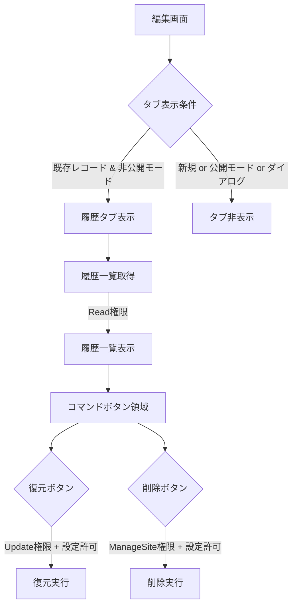
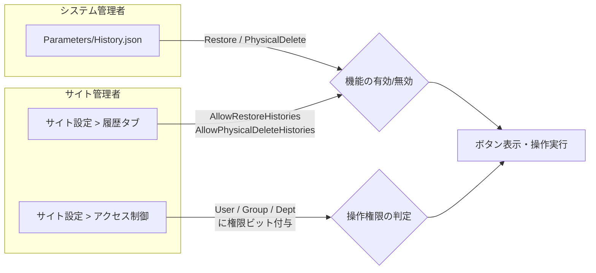

# 履歴タブ表示条件

編集画面の履歴タブ（変更履歴一覧）の表示条件と、履歴からの復元・履歴の削除に必要な権限、およびそれらをユーザ・グループ単位で制御できるかどうかを調査した結果。

<!-- START doctoc generated TOC please keep comment here to allow auto update -->
<!-- DON'T EDIT THIS SECTION, INSTEAD RE-RUN doctoc TO UPDATE -->

- [調査情報](#調査情報)
- [調査目的](#調査目的)
- [全体像](#全体像)
- [履歴タブ自体の表示条件](#履歴タブ自体の表示条件)
    - [タブ（リンク）の表示条件](#タブリンクの表示条件)
    - [タブパネル（コンテンツ領域）の表示条件](#タブパネルコンテンツ領域の表示条件)
    - [履歴データ取得時の権限チェック](#履歴データ取得時の権限チェック)
- [履歴からの復元](#履歴からの復元)
    - [コマンドボタンの表示条件](#コマンドボタンの表示条件)
    - [サーバーサイドのバリデーション](#サーバーサイドのバリデーション)
    - [必要な権限](#必要な権限)
- [履歴の削除](#履歴の削除)
    - [コマンドボタンの表示条件](#コマンドボタンの表示条件-1)
    - [サーバーサイドのバリデーション](#サーバーサイドのバリデーション-1)
    - [必要な権限](#必要な権限-1)
- [コマンドボタン領域全体の表示条件](#コマンドボタン領域全体の表示条件)
- [制御の仕組み](#制御の仕組み)
    - [サーバーパラメータ（システム全体の制御）](#サーバーパラメータシステム全体の制御)
    - [サイト設定（サイト単位の制御）](#サイト設定サイト単位の制御)
    - [権限（ユーザ/グループ/組織単位の制御）](#権限ユーザグループ組織単位の制御)
- [権限別の操作可否まとめ](#権限別の操作可否まとめ)
- [ユーザ・グループ・組織による制御](#ユーザグループ組織による制御)
    - [制御可能か](#制御可能か)
    - [制御方法](#制御方法)
    - [制御例](#制御例)
- [CodeDefiner による自動生成](#codedefiner-による自動生成)
- [結論](#結論)
- [関連ソースコード](#関連ソースコード)
- [関連ドキュメント](#関連ドキュメント)

<!-- END doctoc generated TOC please keep comment here to allow auto update -->

## 調査情報

| 調査日        | リポジトリ | ブランチ | タグ/バージョン    | コミット    | 備考     |
| ------------- | ---------- | -------- | ------------------ | ----------- | -------- |
| 2026年2月28日 | Pleasanter | main     | Pleasanter_1.5.1.0 | `34f162a43` | 初回調査 |

## 調査目的

- 編集画面の履歴タブ自体の表示条件を把握する
- 履歴からの復元に必要な権限と制御方法を明確にする
- 履歴の削除に必要な権限と制御方法を明確にする
- それぞれをユーザ・グループ・組織単位で制御できるかを確認する

---

## 全体像

履歴機能は以下の3つの要素で構成される。それぞれ異なるレベルの権限で制御される。



---

## 履歴タブ自体の表示条件

### タブ（リンク）の表示条件

履歴タブのリンクは `EditorTabs()` メソッドで生成される。表示条件は以下の通り。

| 条件                            | 説明                                      |
| ------------------------------- | ----------------------------------------- |
| `MethodType != MethodTypes.New` | 新規作成時はタブを表示しない              |
| `!context.Publish`              | 公開モード（Publish）時はタブを表示しない |
| `!editInDialog`                 | ダイアログ内編集時はタブを表示しない      |

**権限チェックは行われない。** 編集画面を開けるユーザ（Read権限以上）であれば、履歴タブは表示される。

```csharp
// IssueUtilities.cs (L1796-1832)
private static HtmlBuilder EditorTabs(
    this HtmlBuilder hb,
    Context context,
    SiteSettings ss,
    IssueModel issueModel,
    bool editInDialog = false)
{
    return hb
    .Ul(
        id: "EditorTabs",
        action: () => hb
            // ... 一般タブ、カスタムタブ ...
            .Li(
                _using: issueModel.MethodType != BaseModel.MethodTypes.New
                    && !context.Publish
                    && !editInDialog,
                action: () => hb
                    .A(
                        href: "#FieldSetHistories",
                        text: Displays.ChangeHistoryList(context: context)))
            // ... レコードアクセス制御タブ ...
    );
}
```

### タブパネル（コンテンツ領域）の表示条件

履歴タブのコンテンツ領域（`FieldSetHistories`）も同様の条件で表示される。

```csharp
// IssueUtilities.cs (L1674-1680)
.FieldSet(
    attributes: new HtmlAttributes()
        .Id("FieldSetHistories")
        .DataAction("Histories")
        .DataMethod("post"),
    _using: issueModel.MethodType != BaseModel.MethodTypes.New
        && !context.Publish)
```

タブをクリックすると、`DataAction("Histories")` により非同期で履歴データが取得される。

### 履歴データ取得時の権限チェック

履歴タブの内容を取得する `Histories()` メソッドでは、`CanRead` 権限のチェックが行われる。

```csharp
// IssueUtilities.cs (L6166-6174)
public static string Histories(
    Context context, SiteSettings ss, long issueId, Message message = null)
{
    var issueModel = new IssueModel(context: context, ss: ss, issueId: issueId);
    var columns = ss.GetHistoryColumns(context: context, checkPermission: true);
    if (!context.CanRead(ss: ss))
    {
        return Error.Types.HasNotPermission.MessageJson(context: context);
    }
    // ...
}
```

---

## 履歴からの復元

### コマンドボタンの表示条件

復元ボタンは `HtmlHistoryCommands.cs` の `HistoryCommands()` メソッドで生成される。

```csharp
// HtmlHistoryCommands.cs (L19-29)
.Button(
    text: Displays.Restore(context: context),
    controlCss: "button-icon button-positive",
    onClick: "$p.send($(this));",
    icon: "ui-icon-arrowreturnthick-1-n",
    action: "RestoreFromHistory",
    method: "post",
    confirm: "ConfirmRestore",
    _using: Parameters.History.Restore
        && context.CanUpdate(ss: ss)
        && ss.AllowRestoreHistories != false)
```

| 条件                                | 説明                                           | 制御レベル      |
| ----------------------------------- | ---------------------------------------------- | --------------- |
| `Parameters.History.Restore`        | サーバーパラメータで復元機能が有効であること   | システム全体    |
| `context.CanUpdate(ss: ss)`         | 現在のユーザがレコードの更新権限を持つこと     | ユーザ/グループ |
| `ss.AllowRestoreHistories != false` | サイト設定で履歴からの復元が許可されていること | サイト単位      |

### サーバーサイドのバリデーション

復元実行時には、`RestoreFromHistory()` メソッドと `OnUpdating` バリデータで二重チェックが行われる。

```csharp
// IssueUtilities.cs (L6054-6071)
public static string RestoreFromHistory(
    Context context, SiteSettings ss, long issueId)
{
    if (!Parameters.History.Restore
        || ss.AllowRestoreHistories == false)
    {
        return Error.Types.InvalidRequest.MessageJson(context: context);
    }
    var issueModel = new IssueModel(context, ss, issueId);
    var invalid = IssueValidators.OnUpdating(
        context: context,
        ss: ss,
        issueModel: issueModel);
    // ...
}
```

復元操作は内部的にレコードの更新（`Update`）として処理されるため、`OnUpdating` バリデータの全チェックが適用される。

### 必要な権限

| 権限レベル     | ビットフラグ | 説明                                                 |
| -------------- | ------------ | ---------------------------------------------------- |
| Update（更新） | 4            | サイトのアクセス権限設定で付与されるレコード更新権限 |

---

## 履歴の削除

### コマンドボタンの表示条件

削除ボタンも `HtmlHistoryCommands.cs` で生成される。

```csharp
// HtmlHistoryCommands.cs (L30-40)
.Button(
    text: Displays.DeleteHistory(context: context),
    controlCss: "button-icon button-negative",
    onClick: "$p.send($(this));",
    icon: "ui-icon-closethick",
    action: "DeleteHistory",
    method: "delete",
    confirm: "ConfirmPhysicalDelete",
    _using: Parameters.History.PhysicalDelete
        && context.CanManageSite(ss: ss)
        && ss.AllowPhysicalDeleteHistories != false)
```

| 条件                                       | 説明                                             | 制御レベル      |
| ------------------------------------------ | ------------------------------------------------ | --------------- |
| `Parameters.History.PhysicalDelete`        | サーバーパラメータで履歴削除機能が有効であること | システム全体    |
| `context.CanManageSite(ss: ss)`            | 現在のユーザがサイト管理権限を持つこと           | ユーザ/グループ |
| `ss.AllowPhysicalDeleteHistories != false` | サイト設定で履歴の物理削除が許可されていること   | サイト単位      |

### サーバーサイドのバリデーション

削除実行時には、`OnDeleteHistory` バリデータで厳密なチェックが行われる。

```csharp
// IssueValidators.cs (L1099-1155)
public static ErrorData OnDeleteHistory(
    Context context,
    SiteSettings ss,
    IssueModel issueModel,
    bool api = false,
    bool serverScript = false)
{
    if (!Parameters.History.PhysicalDelete
        || ss.AllowPhysicalDeleteHistories == false)
    {
        return new ErrorData(type: Error.Types.InvalidRequest);
    }
    if (!context.CanManageSite(ss: ss) || issueModel.ReadOnly)
    {
        return new ErrorData(type: Error.Types.HasNotPermission);
    }
    // API バリデーション ...
    // ロックレコード チェック ...
}
```

### 必要な権限

| 権限レベル               | ビットフラグ | 説明                                               |
| ------------------------ | ------------ | -------------------------------------------------- |
| ManageSite（サイト管理） | 128          | サイトのアクセス権限設定で付与されるサイト管理権限 |

---

## コマンドボタン領域全体の表示条件

復元ボタンと削除ボタンを含むコマンド領域全体にも表示条件がある。

```csharp
// HtmlHistoryCommands.cs (L41-45)
_using: (Parameters.History.Restore || Parameters.History.PhysicalDelete)
    && context.Controller == "items"
    && (context.CanUpdate(ss: ss) || context.CanManageSite(ss: ss))
    && (ss.AllowRestoreHistories != false || ss.AllowPhysicalDeleteHistories != false)
    && !ss.Locked()
```

| 条件                                                                | 説明                                           |
| ------------------------------------------------------------------- | ---------------------------------------------- |
| `Parameters.History.Restore \|\| Parameters.History.PhysicalDelete` | いずれかの機能がサーバーパラメータで有効       |
| `context.Controller == "items"`                                     | items コントローラ経由のアクセスであること     |
| `context.CanUpdate \|\| context.CanManageSite`                      | 更新権限またはサイト管理権限を持つこと         |
| `ss.AllowRestoreHistories \|\| ss.AllowPhysicalDeleteHistories`     | いずれかの操作がサイト設定で許可されていること |
| `!ss.Locked()`                                                      | サイトがロックされていないこと                 |

---

## 制御の仕組み

### サーバーパラメータ（システム全体の制御）

`App_Data/Parameters/History.json` で、システム全体の履歴機能を制御する。

```json
{
    "Restore": true,
    "PhysicalDelete": true
}
```

| パラメータ       | デフォルト | 説明                          |
| ---------------- | ---------- | ----------------------------- |
| `Restore`        | `true`     | 履歴からの復元機能の有効/無効 |
| `PhysicalDelete` | `true`     | 履歴の物理削除機能の有効/無効 |

これらを `false` に設定すると、全サイト・全ユーザで該当機能が無効化される。

### サイト設定（サイト単位の制御）

サイト設定の「履歴」タブ（`HistoriesSettingsEditor`）で、サイト単位の制御が可能。

```csharp
// SiteSettings.cs (L230-231)
public bool? AllowRestoreHistories;       // デフォルト: true
public bool? AllowPhysicalDeleteHistories; // デフォルト: true
```

| 設定                           | デフォルト | 説明                                   |
| ------------------------------ | ---------- | -------------------------------------- |
| `AllowRestoreHistories`        | `true`     | このサイトで履歴からの復元を許可するか |
| `AllowPhysicalDeleteHistories` | `true`     | このサイトで履歴の物理削除を許可するか |

これらのチェックボックスは、サイト管理権限（ManageSite）を持つユーザが「テーブルの管理」画面の「履歴」タブで変更できる。

### 権限（ユーザ/グループ/組織単位の制御）

権限の判定は `Permissions.cs` の `ItemsCan()` メソッドで行われ、ユーザ・グループ・組織に付与されたアクセス権限のビットフラグで判定される。

```csharp
// Permissions.cs (L808-829)
private static bool ItemsCan(
    this Context context,
    SiteSettings ss,
    Types type,
    bool site,
    bool checkLocked = true)
{
    if (checkLocked && ss.Locked())
    {
        if ((type & Types.Update) == Types.Update) return false;
        if ((type & Types.Delete) == Types.Delete) return false;
    }
    // ...
    return (ss.GetPermissionType(context: context, site: site) & type) == type
        || context.HasPrivilege;
}
```

`GetPermissionType()` はサイトのアクセス権限テーブル（`Permissions` テーブル）に登録されたユーザ・グループ・組織のビットフラグを論理和（OR）で合成して返す。

```csharp
// Permissions.cs (L16-30)
public enum Types : long
{
    NotSet = 0,
    Read = 1,               // 読取
    Create = 2,             // 作成
    Update = 4,             // 更新
    Delete = 8,             // 削除
    SendMail = 16,          // メール送信
    Export = 32,            // エクスポート
    Import = 64,            // インポート
    ManageSite = 128,       // サイト管理
    ManagePermission = 256, // 権限管理
    ManageTenant = 1073741824,
    ManageService = 2147483648,
}
```

---

## 権限別の操作可否まとめ

| 操作             | Read (1) | Update (4) | ManageSite (128) | 制御方法                                  |
| ---------------- | -------- | ---------- | ---------------- | ----------------------------------------- |
| 履歴タブの表示   | 可       | 可         | 可               | 権限不要（編集画面を開ければ表示）        |
| 履歴一覧の取得   | 可       | 可         | 可               | Read 権限                                 |
| 復元ボタンの表示 | 不可     | 可         | 可               | Update 権限 + サイト設定 + パラメータ     |
| 復元の実行       | 不可     | 可         | 可               | Update 権限 + サイト設定 + パラメータ     |
| 削除ボタンの表示 | 不可     | 不可       | 可               | ManageSite 権限 + サイト設定 + パラメータ |
| 削除の実行       | 不可     | 不可       | 可               | ManageSite 権限 + サイト設定 + パラメータ |

---

## ユーザ・グループ・組織による制御

### 制御可能か

履歴機能の操作権限は、ユーザ・グループ・組織（Dept）単位で制御**できる**。

プリザンターのアクセス権限は、サイトの「アクセス制御」設定でユーザ・グループ・組織に対して権限ビットフラグを個別に設定できる。たとえば、あるユーザに Update 権限を与えず Read 権限だけを与えた場合、そのユーザには復元ボタンが表示されない。

### 制御方法



| 制御レベル   | 対象     | 設定場所                                     | 影響範囲         |
| ------------ | -------- | -------------------------------------------- | ---------------- |
| システム全体 | 全ユーザ | `App_Data/Parameters/History.json`           | 全サイト共通     |
| サイト単位   | 全ユーザ | テーブルの管理 > 履歴タブのチェックボックス  | 該当サイトのみ   |
| ユーザ単位   | 個人     | テーブルの管理 > アクセス制御 > ユーザ追加   | 該当ユーザのみ   |
| グループ単位 | グループ | テーブルの管理 > アクセス制御 > グループ追加 | 該当グループのみ |
| 組織単位     | 組織     | テーブルの管理 > アクセス制御 > 組織追加     | 該当組織のみ     |

### 制御例

**例1: 特定ユーザのみ履歴を復元させたい場合**

1. サイト設定で `AllowRestoreHistories` を有効にする（デフォルトで有効）
2. アクセス制御で該当ユーザに Update（更新）権限を付与する
3. 他のユーザには Read（読取）権限のみを付与する

**例2: 全ユーザで履歴削除を禁止したい場合**

- 方法A: サイト設定で `AllowPhysicalDeleteHistories` のチェックを外す
- 方法B: `Parameters/History.json` の `PhysicalDelete` を `false` に設定する（全サイトに影響）
- 方法C: アクセス制御で全ユーザに ManageSite 権限を付与しない

**例3: 履歴タブ自体を非表示にしたい場合**

履歴タブの表示は権限チェックを行わないため、**標準機能ではタブ自体の非表示制御はできない**。
タブを非表示にするには、拡張スクリプト（ExtendedScripts）で JavaScript による DOM 操作が必要となる。

```javascript
// 拡張スクリプトでの履歴タブ非表示の例
$('#EditorTabs a[href="#FieldSetHistories"]').parent().hide();
```

---

## CodeDefiner による自動生成

履歴関連のバリデータ・ユーティリティは CodeDefiner のテンプレートから自動生成される。

| テンプレート                               | 生成先                                        | 内容                   |
| ------------------------------------------ | --------------------------------------------- | ---------------------- |
| `Model_Validator_OnDeleteHistory_Body.txt` | `{Model}Validators.cs` の `OnDeleteHistory`   | 削除時のバリデーション |
| `Model_Utilities_Restore_Items_Body.txt`   | `{Model}Utilities.cs` の `RestoreFromHistory` | 復元処理               |

Issues / Results / Wikis の各モデルで同一のロジックが生成される。`HtmlHistoryCommands.cs` は共通コードとして全モデルで共有される。

---

## 結論

- **履歴タブの表示**: 権限チェックなし。既存レコードの編集画面を開けるユーザであれば表示される。タブ自体の非表示は標準機能では制御できない
- **履歴からの復元**: Update（更新）権限が必要。サーバーパラメータとサイト設定でも制御可能。ユーザ・グループ・組織単位での制御が可能
- **履歴の削除**: ManageSite（サイト管理）権限が必要。サーバーパラメータとサイト設定でも制御可能。ユーザ・グループ・組織単位での制御が可能
- 3つの制御レベル（サーバーパラメータ、サイト設定、アクセス権限）の全てが許可されている場合にのみ、操作が可能となる

## 関連ソースコード

| ファイル                                                                                     | 概要                                   |
| -------------------------------------------------------------------------------------------- | -------------------------------------- |
| `Libraries/HtmlParts/HtmlHistoryCommands.cs`                                                 | 復元・削除ボタンの HTML 生成と表示条件 |
| `Models/Issues/IssueUtilities.cs` (EditorTabs, RestoreFromHistory, DeleteHistory, Histories) | タブ表示・復元・削除・一覧取得の実装   |
| `Models/Issues/IssueValidators.cs` (OnDeleteHistory)                                         | 削除時のバリデーション                 |
| `Libraries/Security/Permissions.cs`                                                          | 権限チェックロジック                   |
| `Libraries/Settings/SiteSettings.cs` (AllowRestoreHistories, AllowPhysicalDeleteHistories)   | サイト設定の定義とデフォルト値         |
| `App_Data/Parameters/History.json`                                                           | サーバーパラメータの定義               |
| `Models/Sites/SiteUtilities.cs` (HistoriesSettingsEditor)                                    | サイト設定 UI の生成                   |
| `Controllers/ItemsController.cs`                                                             | HTTP エンドポイントの定義              |

## 関連ドキュメント

- [ユーザアクセス権限・アクセス制御](../01-認証・権限/001-ユーザアクセス権限・アクセス制御.md)
- [権限階層構造（User・Group・Dept）](../01-認証・権限/002-権限階層構造.md)
