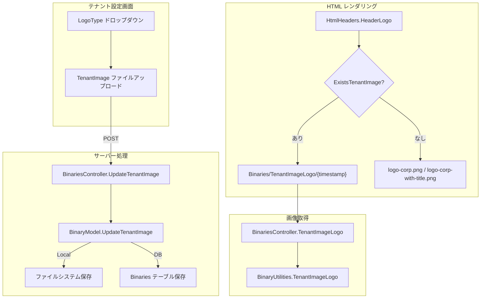
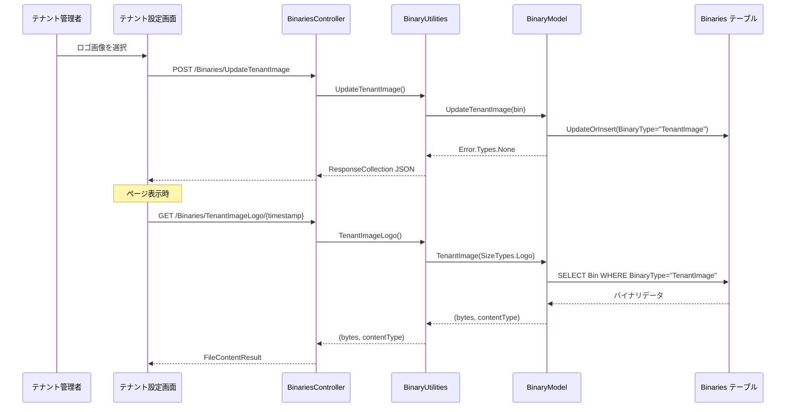
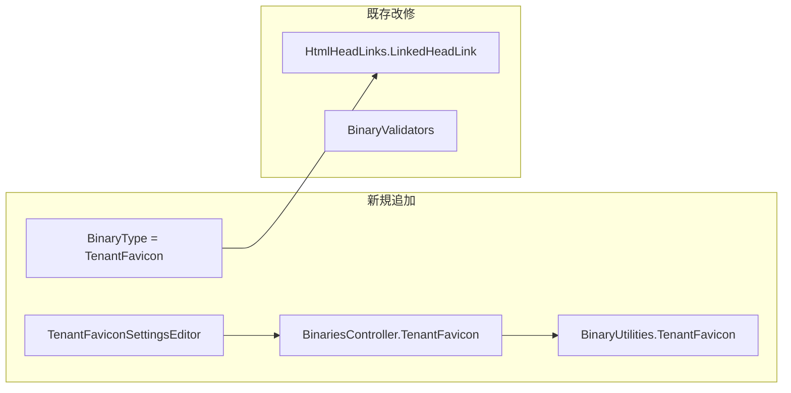

# Favicon カスタマイズ

CorpLogo と同様に Favicon をテナントごとにカスタマイズできるかを調査し、現行実装と改修方針をまとめる。

<!-- START doctoc generated TOC please keep comment here to allow auto update -->
<!-- DON'T EDIT THIS SECTION, INSTEAD RE-RUN doctoc TO UPDATE -->

- [調査情報](#調査情報)
- [調査目的](#調査目的)
- [現行の Favicon 実装](#現行の-favicon-実装)
    - [HTML 出力](#html-出力)
    - [デフォルトファイル](#デフォルトファイル)
    - [現行の制約](#現行の制約)
- [CorpLogo の実装（参考）](#corplogo-の実装参考)
    - [アーキテクチャ概要](#アーキテクチャ概要)
    - [CorpLogo の構成要素](#corplogo-の構成要素)
    - [CorpLogo のデータフロー](#corplogo-のデータフロー)
    - [ImageData の型定義](#imagedata-の型定義)
- [Favicon カスタマイズの改修方針](#favicon-カスタマイズの改修方針)
    - [改修対象の全体像](#改修対象の全体像)
    - [1. BinaryType の追加](#1-binarytype-の追加)
    - [2. BinaryModel への Favicon メソッド追加](#2-binarymodel-への-favicon-メソッド追加)
    - [3. BinaryUtilities への Favicon ユーティリティ追加](#3-binaryutilities-への-favicon-ユーティリティ追加)
    - [4. BinariesController へのルート追加](#4-binariescontroller-へのルート追加)
    - [5. HtmlHeadLinks.LinkedHeadLink の改修](#5-htmlheadlinkslinkedheadlink-の改修)
    - [6. テナント設定画面の UI 追加](#6-テナント設定画面の-ui-追加)
    - [改修ファイル一覧](#改修ファイル一覧)
- [考慮事項](#考慮事項)
    - [ICO ファイルの取り扱い](#ico-ファイルの取り扱い)
    - [apple-touch-icon の追加](#apple-touch-icon-の追加)
    - [キャッシュ制御](#キャッシュ制御)
    - [マルチテナント環境での動作](#マルチテナント環境での動作)
- [結論](#結論)
- [関連ソースコード](#関連ソースコード)

<!-- END doctoc generated TOC please keep comment here to allow auto update -->

## 調査情報

| 調査日       | リポジトリ | ブランチ | タグ/バージョン    | コミット     | 備考     |
| ------------ | ---------- | -------- | ------------------ | ------------ | -------- |
| 2026年3月1日 | Pleasanter | main     | Pleasanter_1.5.1.0 | `34f162a439` | 初回調査 |

## 調査目的

プリザンターではテナント設定画面からロゴ画像（CorpLogo）をアップロードし、ヘッダーに表示するカスタマイズ機能が提供されている。同様の仕組みで Favicon（ブラウザタブに表示されるアイコン）もテナントごとにカスタマイズできるかを調査する。

---

## 現行の Favicon 実装

### HTML 出力

Favicon は `HtmlHeadLinks.cs` の `LinkedHeadLink` メソッドで HTML の `<link>` タグとして出力される。

**ファイル**: `Implem.Pleasanter/Libraries/HtmlParts/HtmlHeadLinks.cs`（行番号: 105-120）

```csharp
public static HtmlBuilder LinkedHeadLink(
    this HtmlBuilder hb, Context context, SiteSettings ss)
{
    return hb
        .Link(
            href: Responses.Locations.Get(
                context: context,
                parts: "favicon.ico"),
            rel: "shortcut icon")
        .EsModuleLinks(/* ... */)
        .EsModuleLinks(/* ... */);
}
```

生成される HTML は以下のようになる。

```html
<link href="/favicon.ico" rel="shortcut icon" />
```

### デフォルトファイル

`wwwroot/favicon.ico` に固定の ICO ファイルが 1 つだけ配置されている。テナントやユーザーによる切り替え機構は存在しない。

### 現行の制約

| 項目                       | 状態   |
| -------------------------- | ------ |
| テナント単位のカスタマイズ | 未対応 |
| ユーザー単位のカスタマイズ | 未対応 |
| パラメータでの差し替え     | 未対応 |
| apple-touch-icon           | 未出力 |
| Web App Manifest           | 未出力 |

---

## CorpLogo の実装（参考）

Favicon カスタマイズの改修方針を検討するため、既に実装されている CorpLogo の仕組みを整理する。

### アーキテクチャ概要



### CorpLogo の構成要素

| 構成要素         | 実装箇所                                            | 概要                                                         |
| ---------------- | --------------------------------------------------- | ------------------------------------------------------------ |
| データモデル     | `TenantModel.cs`（39行目）                          | `LogoType` プロパティ（`LogoTypes` 列挙型）                  |
| 列挙型           | `TenantModel.cs`（1571-1575行目）                   | `ImageOnly`（0）/ `ImageAndTitle`（1）                       |
| 画像存在チェック | `BinaryUtilities.ExistsTenantImage()`               | `BinaryType = "TenantImage"` で Binaries テーブルを検索      |
| 画像アップロード | `BinaryModel.UpdateTenantImage()`（1044-1075行目）  | ICO/PNG をリサイズして Binaries テーブルまたはローカルに保存 |
| 画像削除         | `BinaryModel.DeleteTenantImage()`（1106-1127行目）  | Binaries テーブルまたはローカルファイルを削除                |
| HTML 生成        | `HtmlHeaders.LogoImage()`（161-187行目）            | テナント画像があれば動的 URL、なければ既定の PNG を参照      |
| コントローラー   | `BinariesController.TenantImageLogo()`（58-71行目） | GET で画像バイナリを返却（ResponseCache 付き）               |
| 設定 UI          | `TenantUtilities.TenantImageSettingsEditor()`       | ファイルアップロード用 FieldTextBox を生成                   |
| キャッシュ制御   | `BinaryUtilities.TenantImageUpdatedTime()`          | 更新日時をクエリ文字列に付与してキャッシュバスト             |

### CorpLogo のデータフロー



### ImageData の型定義

**ファイル**: `Implem.Pleasanter/Libraries/Images/ImageData.cs`（行番号: 19-31）

```csharp
public enum Types : int
{
    SiteImage = 1,
    TenantImage = 2
}

public enum SizeTypes : int
{
    Regular = 1,
    Thumbnail = 2,
    Icon = 3,
    Logo = 4,
}
```

CorpLogo は `Types.TenantImage` + `SizeTypes.Logo` の組み合わせで画像を管理している。Favicon 用に `SizeTypes` に新しい値を追加するか、既存の `Icon` を活用する方法が考えられる。

---

## Favicon カスタマイズの改修方針

CorpLogo と同じパターンを踏襲し、最小限の改修で Favicon をテナント単位でカスタマイズ可能にする方針を示す。

### 改修対象の全体像



### 1. BinaryType の追加

Binaries テーブルの `BinaryType` カラムに新しい値 `"TenantFavicon"` を追加する。既存の `"TenantImage"`（CorpLogo 用）と同じ構造を流用する。

| BinaryType      | 用途     | SizeType |
| --------------- | -------- | -------- |
| `TenantImage`   | CorpLogo | Logo     |
| `TenantFavicon` | Favicon  | Icon     |

### 2. BinaryModel への Favicon メソッド追加

`BinaryModel.cs` に以下のメソッドを追加する。`UpdateTenantImage` / `DeleteTenantImage` と同じパターンで実装する。

```csharp
// アップロード
public Error.Types UpdateTenantFavicon(
    Context context, SiteSettings ss, byte[] bin)
{
    BinaryType = "TenantFavicon";
    // ICO/PNG をそのまま保存（リサイズ不要）
    // UpdateOrInsert で Binaries テーブルに格納
}

// 削除
public Error.Types DeleteTenantFavicon(Context context)
{
    BinaryType = "TenantFavicon";
    // PhysicalDeleteBinaries で削除
}
```

### 3. BinaryUtilities への Favicon ユーティリティ追加

`BinaryUtilities.cs` に以下のメソッドを追加する。

```csharp
// Favicon 存在チェック
public static bool ExistsTenantFavicon(
    Context context, SiteSettings ss, long referenceId)

// Favicon バイナリ取得
public static (byte[] bytes, string contentType) TenantFavicon(
    Context context, TenantModel tenantModel)

// Favicon アップロード処理
public static string UpdateTenantFavicon(
    Context context, TenantModel tenantModel)

// Favicon 削除処理
public static string DeleteTenantFavicon(
    Context context, TenantModel tenantModel)
```

### 4. BinariesController へのルート追加

`BinariesController.cs` に以下のアクションメソッドを追加する。

```csharp
// Favicon 取得
[HttpGet]
[ResponseCache(Duration = int.MaxValue)]
public ActionResult TenantFavicon()

// Favicon アップロード
[HttpPost]
public string UpdateTenantFavicon(ICollection<IFormFile> file)

// Favicon 削除
[HttpDelete]
public string DeleteTenantFavicon()
```

### 5. HtmlHeadLinks.LinkedHeadLink の改修

`LinkedHeadLink` メソッドを改修し、テナント Favicon が登録されている場合はそちらを参照するようにする。

```csharp
public static HtmlBuilder LinkedHeadLink(
    this HtmlBuilder hb, Context context, SiteSettings ss)
{
    var existsFavicon = BinaryUtilities.ExistsTenantFavicon(
        context: context,
        ss: ss,
        referenceId: context.TenantId);
    var faviconHref = existsFavicon
        ? Responses.Locations.Get(
            context: context,
            parts: new string[]
            {
                "Binaries",
                "TenantFavicon",
                BinaryUtilities.TenantFaviconUpdatedTime(/* ... */)
                    .ToString("?yyyyMMddHHmmss")
            })
        : Responses.Locations.Get(
            context: context,
            parts: "favicon.ico");
    return hb
        .Link(href: faviconHref, rel: "shortcut icon")
        .EsModuleLinks(/* ... */)
        .EsModuleLinks(/* ... */);
}
```

### 6. テナント設定画面の UI 追加

`TenantUtilities.cs` の `TenantImageSettingsEditor` を参考に、Favicon 用のアップロード UI を追加する。

### 改修ファイル一覧

| ファイル                               | 改修内容                                      | 種別     |
| -------------------------------------- | --------------------------------------------- | -------- |
| `Libraries/HtmlParts/HtmlHeadLinks.cs` | `LinkedHeadLink` の Favicon 分岐追加          | 既存改修 |
| `Models/Binaries/BinaryModel.cs`       | `UpdateTenantFavicon` / `DeleteTenantFavicon` | 新規追加 |
| `Models/Binaries/BinaryUtilities.cs`   | Favicon ユーティリティメソッド群              | 新規追加 |
| `Models/Binaries/BinaryValidators.cs`  | Favicon バリデーション                        | 新規追加 |
| `Controllers/BinariesController.cs`    | Favicon 用エンドポイント 3 つ                 | 新規追加 |
| `Models/Tenants/TenantUtilities.cs`    | Favicon アップロード UI                       | 新規追加 |
| `Libraries/Images/ImageData.cs`        | `Types` 列挙型への追加（必要に応じて）        | 既存改修 |

---

## 考慮事項

### ICO ファイルの取り扱い

| 項目             | CorpLogo                    | Favicon                                        |
| ---------------- | --------------------------- | ---------------------------------------------- |
| 推奨フォーマット | PNG                         | ICO（複数解像度格納可） または PNG             |
| リサイズ         | `SizeTypes.Logo` でリサイズ | リサイズ不要（アップロード画像をそのまま使用） |
| Content-Type     | `image/png`                 | `image/x-icon` または `image/png`              |

Favicon は ICO 形式（複数解像度を 1 ファイルに格納可能）と PNG 形式の両方をサポートすることが望ましい。アップロード時の Content-Type に基づいてレスポンスを返却する。

### apple-touch-icon の追加

Favicon と併せて `apple-touch-icon`（iOS ホーム画面用アイコン）の出力も検討できる。`LinkedHeadLink` メソッドに以下を追加する。

```html
<link rel="apple-touch-icon" href="/Binaries/TenantFavicon?size=180" />
```

### キャッシュ制御

CorpLogo と同様に `ResponseCache(Duration = int.MaxValue)` とクエリ文字列によるキャッシュバストを採用する。Favicon はブラウザが強力にキャッシュするため、更新時にユーザーへキャッシュクリアの案内が必要になる場合がある。

### マルチテナント環境での動作

テナントごとに異なる Favicon を設定する場合、ブラウザのタブ表示で視覚的にテナントを区別できるようになる。これはマルチテナント運用時に有用である。

---

## 結論

| 項目                       | 結果                                                                                 |
| -------------------------- | ------------------------------------------------------------------------------------ |
| Favicon カスタマイズの可否 | 現行未対応だが、CorpLogo と同じパターンで実装可能                                    |
| 改修規模                   | CorpLogo 実装の踏襲で小〜中規模                                                      |
| 主な改修箇所               | HtmlHeadLinks / BinaryModel / BinaryUtilities / BinariesController / TenantUtilities |
| BinaryType                 | `"TenantFavicon"` を新設                                                             |
| DB スキーマ変更            | 不要（Binaries テーブルの `BinaryType` カラムで区別）                                |
| テナント設定 UI            | CorpLogo のアップロード UI と同じパターンで追加可能                                  |
| フォーマット               | ICO / PNG の両方をサポートすることが望ましい                                         |
| CodeDefiner 対応           | `BinaryType` は文字列値のため CodeDefiner による自動生成への影響は軽微               |
| apple-touch-icon           | 同時に対応可能                                                                       |

---

## 関連ソースコード

| ファイル                                                 | 概要                                            |
| -------------------------------------------------------- | ----------------------------------------------- |
| `Implem.Pleasanter/Libraries/HtmlParts/HtmlHeadLinks.cs` | Favicon の `<link>` タグ出力（105-120行目）     |
| `Implem.Pleasanter/Libraries/HtmlParts/HtmlHeaders.cs`   | CorpLogo の HTML 生成（115-198行目）            |
| `Implem.Pleasanter/Models/Tenants/TenantModel.cs`        | LogoType プロパティ・列挙型定義（39, 1571行目） |
| `Implem.Pleasanter/Models/Binaries/BinaryModel.cs`       | テナント画像の CRUD（1044-1127行目）            |
| `Implem.Pleasanter/Models/Binaries/BinaryUtilities.cs`   | テナント画像ユーティリティ（81-119行目）        |
| `Implem.Pleasanter/Controllers/BinariesController.cs`    | テナント画像エンドポイント（58-127行目）        |
| `Implem.Pleasanter/Models/Tenants/TenantUtilities.cs`    | テナント設定 UI                                 |
| `Implem.Pleasanter/Libraries/Images/ImageData.cs`        | 画像型・サイズ型の列挙（19-31行目）             |
