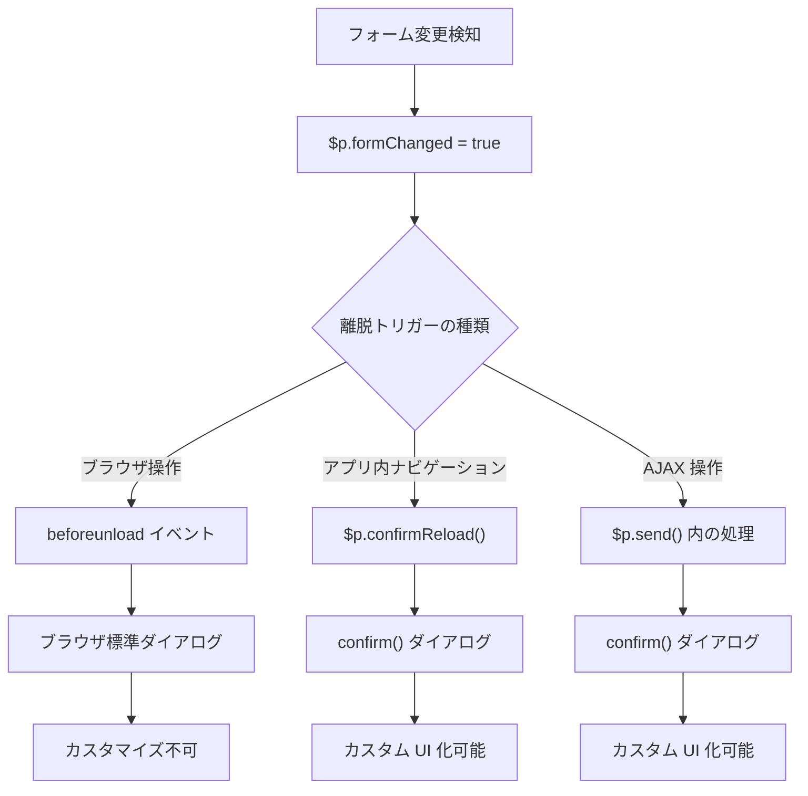
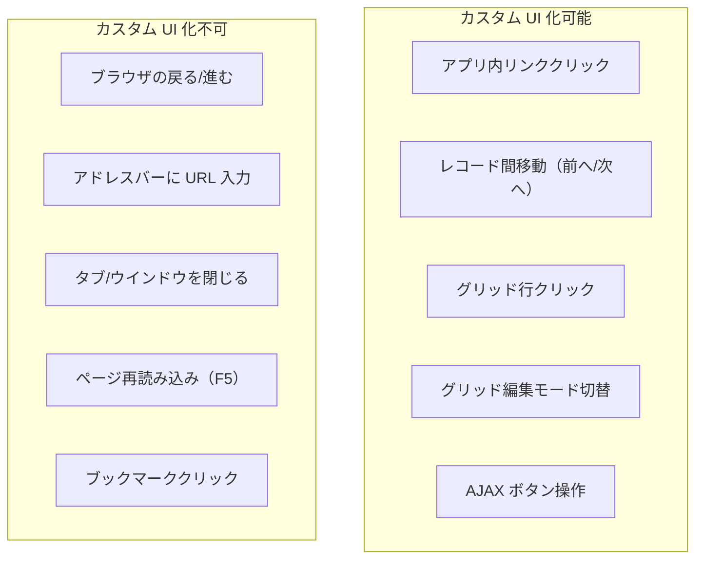
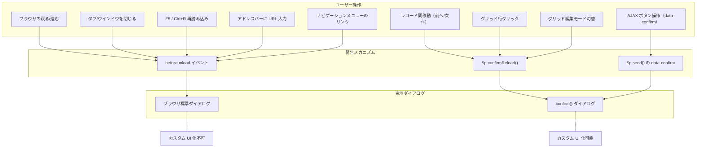

# ページ離脱警告のカスタム UI 化

未保存の変更がある状態でページを離れようとした際に表示されるブラウザ標準の離脱警告を、プリザンター側のメッセージウインドウに統一できるかを調査した結果。

<!-- START doctoc generated TOC please keep comment here to allow auto update -->
<!-- DON'T EDIT THIS SECTION, INSTEAD RE-RUN doctoc TO UPDATE -->

- [調査情報](#調査情報)
- [調査目的](#調査目的)
- [現在の実装](#現在の実装)
    - [全体フロー](#全体フロー)
    - [1. フォーム変更検知（confirmevents.js）](#1-フォーム変更検知confirmeventsjs)
    - [2. beforeunload イベントによるブラウザ標準警告](#2-beforeunload-イベントによるブラウザ標準警告)
    - [3. confirmReload() によるアプリ内ナビゲーション警告](#3-confirmreload-によるアプリ内ナビゲーション警告)
    - [4. SmartDesign（第2世代テーマ）の実装](#4-smartdesign第2世代テーマの実装)
    - [5. formChanged フラグのリセット](#5-formchanged-フラグのリセット)
- [離脱警告の分類と代替可否](#離脱警告の分類と代替可否)
    - [トリガー別の分類](#トリガー別の分類)
    - [代替可否の詳細](#代替可否の詳細)
- [ブラウザ仕様上の制約](#ブラウザ仕様上の制約)
    - [beforeunload の仕様](#beforeunload-の仕様)
    - [制約の根拠](#制約の根拠)
- [カスタム UI 化が可能な範囲のアプローチ](#カスタム-ui-化が可能な範囲のアプローチ)
    - [アプローチ 1: confirmReload() のカスタム UI 化](#アプローチ-1-confirmreload-のカスタム-ui-化)
    - [アプローチ 2: アプリ内リンクのクリックインターセプト](#アプローチ-2-アプリ内リンクのクリックインターセプト)
    - [アプローチ 3: 拡張スクリプトによる部分的な対応](#アプローチ-3-拡張スクリプトによる部分的な対応)
- [各アプローチの比較](#各アプローチの比較)
- [ナビゲーション発生経路の全体像](#ナビゲーション発生経路の全体像)
- [結論](#結論)
- [関連ソースコード](#関連ソースコード)
- [関連ドキュメント](#関連ドキュメント)

<!-- END doctoc generated TOC please keep comment here to allow auto update -->

## 調査情報

| 調査日       | リポジトリ | ブランチ | タグ/バージョン    | コミット     | 備考     |
| ------------ | ---------- | -------- | ------------------ | ------------ | -------- |
| 2026年3月1日 | Pleasanter | main     | Pleasanter_1.5.1.0 | `34f162a439` | 初回調査 |

## 調査目的

- 未保存時のページ離脱警告がブラウザ標準のダイアログで表示される現状を把握する
- プリザンター側のメッセージウインドウ（`$p.setMessage` / jQuery UI Dialog / `<ui-modal>`）に揃えられるかを検証する
- 揃えられる範囲と揃えられない範囲を明確にし、実現可能なアプローチを提示する

---

## 現在の実装

プリザンターの未保存変更検知と離脱警告は、以下の3つの仕組みで構成されている。

### 全体フロー



### 1. フォーム変更検知（confirmevents.js）

`confirm-unload` クラスを持つフォーム要素の変更を監視し、`$p.formChanged` フラグを `true` に設定する。

**ファイル**: `Implem.PleasanterFrontend/wwwroot/src/scripts/generals/confirmevents.js`

```javascript
$(function () {
    $(document).on(
        'change',
        '.confirm-unload input, .confirm-unload select, .confirm-unload textarea, .confirm-unload .control-spinner',
        function () {
            $p.setFormChanged($(this));
        }
    );
    $(document).on('click', '.confirm-unload .current-time', function () {
        $p.setFormChanged($(this));
    });
    $(document).on('spin', '.confirm-unload .control-spinner', function () {
        $p.setFormChanged($(this));
    });
    $(window).bind('beforeunload', function () {
        if ($p.formChanged) {
            return $p.display('ConfirmUnload');
        }
    });
});
```

`$p.setFormChanged` は `_form.js` で定義されており、`not-set-form-changed` クラスを持たない要素に対してフラグを設定する。

**ファイル**: `Implem.PleasanterFrontend/wwwroot/src/scripts/generals/_form.js`（行番号: 116-120）

```javascript
$p.setFormChanged = function ($control) {
    if (!$control.hasClass('not-set-form-changed')) {
        $p.formChanged = true;
    }
};
```

### 2. beforeunload イベントによるブラウザ標準警告

`confirmevents.js` の末尾で `beforeunload` イベントハンドラが登録されている。`$p.formChanged` が `true` の場合にメッセージを返すことで、ブラウザ標準の離脱警告ダイアログが表示される。

主要ブラウザの仕様により、返却されたメッセージ文字列は無視され、ブラウザ固有の定型文が表示される。

| ブラウザ      | 表示メッセージ                                                        |
| ------------- | --------------------------------------------------------------------- |
| Chrome / Edge | "このサイトを離れますか？ 行った変更が保存されない可能性があります。" |
| Firefox       | "このページを離れてもよろしいですか？"                                |
| Safari        | "変更内容が保存されない可能性があります。"                            |

### 3. confirmReload() によるアプリ内ナビゲーション警告

アプリ内でのページ遷移やデータ再読み込み時には `$p.confirmReload()` が呼び出される。こちらは `confirm()` を使用しており、`beforeunload` とは別の仕組みである。

**ファイル**: `Implem.PleasanterFrontend/wwwroot/src/scripts/generals/confirm.js`

```javascript
$p.confirmReload = function confirmReload() {
    if ($p.formChanged) {
        return confirm($p.display('ConfirmUnload'));
    } else {
        return true;
    }
};
```

`confirmReload()` の呼び出し箇所は以下の通り。

| ファイル        | 関数/コンテキスト          | 用途                                |
| --------------- | -------------------------- | ----------------------------------- |
| `grid.js`       | `$p.editOnGrid()`          | グリッド編集モード切替時の確認      |
| `item.js`       | `$p.get()`                 | レコード間移動（前へ/次へ）時の確認 |
| `gridevents.js` | グリッド行クリックハンドラ | 履歴バージョン切替時の確認          |

### 4. SmartDesign（第2世代テーマ）の実装

第2世代テーマの Svelte コンポーネントでは、`window.onbeforeunload` を動的に設定している。

**ファイル**: `Implem.Pleasanter/wwwroot/components/components_DR0K6XV1.js`（ビルド済み）

```javascript
// 変更検知時に onbeforeunload を設定
window.onbeforeunload = function (e) {
    return (e.preventDefault(), s('ConfirmUnload'));
};
```

### 5. formChanged フラグのリセット

`$p.formChanged` フラグは、サーバーからの AJAX レスポンスで `SetMemory` コマンドを通じてリセットされる。

**ファイル**: `Implem.PleasanterFrontend/wwwroot/src/scripts/generals/_dispatch.js`（行番号: 65-67）

```javascript
case 'SetMemory':
    $p[target] = value;
    break;
```

C# サーバーサイドでは、保存成功時のレスポンスに `.SetMemory("formChanged", false)` を含めることで、クライアント側のフラグをリセットしている。
Issues / Results / Wikis / Sites 等の全モデルの Update / Create レスポンスで使用されている。

---

## 離脱警告の分類と代替可否

ページ離脱警告が発生するトリガーを分類し、それぞれの代替可否を整理する。

### トリガー別の分類



### 代替可否の詳細

| トリガー                        | 現在の実装        | カスタム UI 化 | 理由                                        |
| ------------------------------- | ----------------- | :------------: | ------------------------------------------- |
| ブラウザの戻る/進むボタン       | `beforeunload`    |      不可      | ブラウザ仕様上、カスタム UI を表示できない  |
| アドレスバーに URL 入力         | `beforeunload`    |      不可      | ブラウザ仕様上、カスタム UI を表示できない  |
| タブ/ウインドウを閉じる         | `beforeunload`    |      不可      | ブラウザ仕様上、カスタム UI を表示できない  |
| ページ再読み込み（F5 / Ctrl+R） | `beforeunload`    |      不可      | ブラウザ仕様上、カスタム UI を表示できない  |
| ブックマーククリック            | `beforeunload`    |      不可      | ブラウザ仕様上、カスタム UI を表示できない  |
| レコード間移動（前へ/次へ）     | `confirmReload()` |      可能      | JavaScript の `confirm()` を使用している    |
| グリッド行クリック              | `confirmReload()` |      可能      | JavaScript の `confirm()` を使用している    |
| グリッド編集モード切替          | `confirmReload()` |      可能      | JavaScript の `confirm()` を使用している    |
| アプリ内リンククリック          | `beforeunload`    | 可能（条件付） | リンクの `click` イベントを捕捉して制御可能 |

---

## ブラウザ仕様上の制約

### beforeunload の仕様

`beforeunload` イベントはブラウザのセキュリティモデルにより、カスタム UI の表示が制限されている。

| 仕様                   | 説明                                                                                     |
| ---------------------- | ---------------------------------------------------------------------------------------- |
| カスタムメッセージ不可 | Chrome 51+、Firefox 44+ でカスタムテキストは無視される（W3C 仕様準拠）                   |
| 非同期処理不可         | `beforeunload` ハンドラ内で Promise や非同期 UI を表示することはできない                 |
| DOM 操作の制限         | `beforeunload` ハンドラ内で新しいモーダル/ダイアログを表示してもブラウザが即座に破棄する |
| 標準化の方向性         | W3C は `beforeunload` のカスタマイズを意図的に制限している（詐欺サイト対策）             |

### 制約の根拠

HTML Living Standard では `beforeunload` イベントのカスタムメッセージ表示を非推奨としており、`event.preventDefault()` による標準メッセージの表示のみが保証されている。

```javascript
// 現在のブラウザで動作するのはこのパターンのみ
window.addEventListener('beforeunload', function (e) {
    e.preventDefault();
    // 戻り値やカスタムメッセージは無視される
});
```

---

## カスタム UI 化が可能な範囲のアプローチ

### アプローチ 1: confirmReload() のカスタム UI 化

`$p.confirmReload()` は `confirm()` を使用しているため、カスタムダイアログに置き換えが可能である。ただし、`confirm()` は同期的に値を返すため、非同期のカスタムダイアログに移行するには呼び出し元のロジック変更が必要になる。

#### 第1世代テーマ（jQuery UI Dialog）

```javascript
// 移行後の $p.confirmReload()
$p.confirmReload = function () {
    return new Promise(function (resolve) {
        if (!$p.formChanged) {
            resolve(true);
            return;
        }
        var $dialog = $('<div>').attr('title', $p.display('Confirm')).text($p.display('ConfirmUnload'));
        $dialog.dialog({
            modal: true,
            width: '420px',
            resizable: false,
            buttons: [
                {
                    text: $p.display('Ok'),
                    click: function () {
                        $(this).dialog('close');
                        resolve(true);
                    },
                },
                {
                    text: $p.display('Cancel'),
                    click: function () {
                        $(this).dialog('close');
                        resolve(false);
                    },
                },
            ],
            close: function () {
                $(this).remove();
                resolve(false);
            },
        });
    });
};
```

#### 第2世代テーマ（ui-modal）

```javascript
// 移行後の $p.confirmReload()（ui-modal 版）
$p.confirmReload = function () {
    return new Promise(function (resolve) {
        if (!$p.formChanged) {
            resolve(true);
            return;
        }
        document.getElementById('ConfirmUnloadBody').textContent = $p.display('ConfirmUnload');
        var modal = $p.modal.ConfirmUnloadModal;
        document.getElementById('ConfirmUnloadOk').onclick = function () {
            modal.open = false;
            resolve(true);
        };
        document.getElementById('ConfirmUnloadCancel').onclick = function () {
            modal.open = false;
            resolve(false);
        };
        modal.onClosed = function () {
            resolve(false);
        };
        modal.open = true;
    });
};
```

#### 呼び出し元の変更

`confirmReload()` を非同期化すると、呼び出し元も `async/await` 対応が必要になる。

```javascript
// 変更前（同期）
$p.get = function ($control, ajax) {
    if (!$p.confirmReload()) return false;
    // 後続処理
};

// 変更後（非同期）
$p.get = async function ($control, ajax) {
    if (!(await $p.confirmReload())) return false;
    // 後続処理
};
```

影響を受ける箇所は以下の通り。

| ファイル        | 関数                       | 変更内容   |
| --------------- | -------------------------- | ---------- |
| `item.js`       | `$p.get()`                 | `async` 化 |
| `grid.js`       | `$p.editOnGrid()`          | `async` 化 |
| `gridevents.js` | グリッド行クリックハンドラ | `async` 化 |

### アプローチ 2: アプリ内リンクのクリックインターセプト

アプリ内の `<a>` タグクリックを捕捉し、未保存変更がある場合にカスタムダイアログを表示してからナビゲーションを行う方式。

```javascript
// アプリ内リンクのクリックを捕捉
$(document).on('click', 'a[href]', function (e) {
    if (!$p.formChanged) return; // 変更なしならそのまま遷移
    var href = $(this).attr('href');
    if (!href || href === '#' || href.startsWith('javascript:')) return;
    e.preventDefault();
    // カスタムダイアログを表示
    showConfirmLeaveDialog(function (confirmed) {
        if (confirmed) {
            $p.formChanged = false; // beforeunload を抑止
            window.location.href = href;
        }
    });
});
```

この方式では、アプリ内のリンククリックに限りプリザンターのメッセージウインドウで確認ダイアログを表示できる。ただし、既存の `anchorevents.js` が `e.stopPropagation()` を行っているため、イベント伝播の順序に注意が必要である。

### アプローチ 3: 拡張スクリプトによる部分的な対応

プリザンター本体を改修せず、拡張スクリプト（ExtendedScripts）で対応する方法。`confirmReload()` のオーバーライドと、リンクのクリックインターセプトを組み合わせる。

```javascript
// 拡張スクリプトでの実装例
(function () {
    // confirmReload のオーバーライド（同期版）
    // 注意: confirm() を使うため、外見は変わるがブラウザ標準の confirm() ダイアログのまま
    // 非同期のカスタム UI を使う場合は呼び出し元の変更も必要

    // アプリ内リンクのインターセプト
    $(document).on('click', 'a[href]:not([href^="#"]):not([href^="javascript"])', function (e) {
        if (!$p.formChanged) return;
        e.preventDefault();
        var href = $(this).attr('href');
        $p.clearMessage();
        var data = {
            Css: 'alert-warning',
            Text: $p.display('ConfirmUnload'),
        };
        $p.setMessage('#Message', JSON.stringify(data));
        // メッセージ表示後、確認ボタンを動的に追加
        var $confirmBtn = $('<button>')
            .text($p.display('Ok'))
            .addClass('button-icon button-positive')
            .css({ 'margin-left': '8px' })
            .on('click', function () {
                $p.formChanged = false;
                window.location.href = href;
            });
        $('#Message .alert').append($confirmBtn);
    });
})();
```

この方式には以下の制約がある。

| 制約                   | 説明                                                         |
| ---------------------- | ------------------------------------------------------------ |
| beforeunload は残る    | ブラウザ操作（タブを閉じる等）時はブラウザ標準ダイアログ     |
| confirmReload は同期的 | 拡張スクリプトだけでは非同期のカスタム UI に変更できない     |
| メッセージ領域の流用   | `$p.setMessage` は通知向けで、確認ダイアログの代替には不向き |
| キャンセル操作         | メッセージ表示だけではキャンセル導線が不明確                 |

---

## 各アプローチの比較

| 項目                           | アプローチ 1（confirmReload 改修）  | アプローチ 2（リンクインターセプト） | アプローチ 3（拡張スクリプト） |
| ------------------------------ | :---------------------------------: | :----------------------------------: | :----------------------------: |
| プリザンター本体の改修         |                必要                 |                 必要                 |              不要              |
| 対応範囲                       | confirmReload 呼び出し箇所（3箇所） |          アプリ内リンク全般          |       アプリ内リンクのみ       |
| ブラウザ操作（タブを閉じる等） |              対応不可               |               対応不可               |            対応不可            |
| 同期→非同期の変更              |                必要                 |           不要（新規追加）           |          一部対応可能          |
| テーマ別の対応                 |       必要（第1世代/第2世代）       |                 共通                 |              共通              |
| 保守性                         |                 高                  |                  中                  |               低               |

---

## ナビゲーション発生経路の全体像

プリザンターでページ離脱が発生する全経路と、カスタム UI 化の可否をまとめる。



---

## 結論

| 項目                                           | 内容                                                                     |
| ---------------------------------------------- | ------------------------------------------------------------------------ |
| ブラウザ標準の離脱警告をカスタム UI 化         | 不可（ブラウザ仕様上の制約）                                             |
| `confirmReload()` のカスタム UI 化             | 可能（プリザンター本体の改修が必要、同期→非同期の変更を伴う）            |
| アプリ内リンクのインターセプト                 | 可能（`<a>` タグのクリックイベントを捕捉して確認ダイアログを表示）       |
| 拡張スクリプトのみでの対応                     | 部分的に可能（アプリ内リンクの捕捉は可能だが制約が多い）                 |
| 完全にプリザンターのメッセージウインドウに統一 | 不可能（ブラウザ操作による離脱は常にブラウザ標準ダイアログが表示される） |

未保存時のページ離脱警告を完全にプリザンター側の UI に揃えることはブラウザ仕様上不可能である。ブラウザの戻る/進む、タブを閉じる、F5 再読み込み等のブラウザ操作に対しては、`beforeunload` イベントによるブラウザ標準のダイアログしか表示できない。

一方、プリザンターのアプリ内ナビゲーション（レコード間移動、グリッド行クリック等）で使用されている `confirm()` ダイアログは、jQuery UI Dialog や `<ui-modal>` に置き換えることが可能である。
ただし、`confirm()` は同期的に値を返すのに対し、カスタムダイアログは非同期となるため、呼び出し元のロジック変更（`async/await` 化）が必要になる。

---

## 関連ソースコード

| ファイル                                                                   | 説明                                        |
| -------------------------------------------------------------------------- | ------------------------------------------- |
| `Implem.PleasanterFrontend/wwwroot/src/scripts/generals/confirmevents.js`  | 変更検知・`beforeunload` ハンドラ           |
| `Implem.PleasanterFrontend/wwwroot/src/scripts/generals/confirm.js`        | `$p.confirmReload()` 定義                   |
| `Implem.PleasanterFrontend/wwwroot/src/scripts/generals/_form.js`          | `$p.setFormChanged()` 定義                  |
| `Implem.PleasanterFrontend/wwwroot/src/scripts/generals/_dispatch.js`      | `SetMemory` による `formChanged` リセット   |
| `Implem.PleasanterFrontend/wwwroot/src/scripts/generals/item.js`           | `$p.get()` での `confirmReload` 使用        |
| `Implem.PleasanterFrontend/wwwroot/src/scripts/generals/grid.js`           | `$p.editOnGrid()` での `confirmReload` 使用 |
| `Implem.PleasanterFrontend/wwwroot/src/scripts/generals/gridevents.js`     | グリッドイベントでの `confirmReload` 使用   |
| `Implem.PleasanterFrontend/wwwroot/src/scripts/generals/navigation.js`     | `$p.transition()` / `$p.back()` 定義        |
| `Implem.PleasanterFrontend/wwwroot/src/scripts/generals/anchorevents.js`   | `<a>` タグのクリックイベント制御            |
| `Implem.PleasanterFrontend/wwwroot/src/scripts/generals/dialog.js`         | jQuery UI Dialog ラッパー                   |
| `Implem.PleasanterFrontend/wwwroot/src/scripts/generals/message.js`        | メッセージ表示機構                          |
| `Implem.PleasanterFrontend/wwwroot/src/scripts/generals/modal/ui-modal.ts` | `<ui-modal>` Web Component                  |

## 関連ドキュメント

- [ブラウザ組み込みモーダル使用箇所と移行手段](016-ブラウザ組み込みモーダル使用箇所と移行手段.md)
