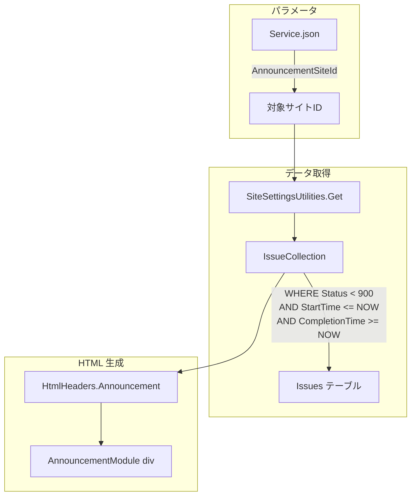
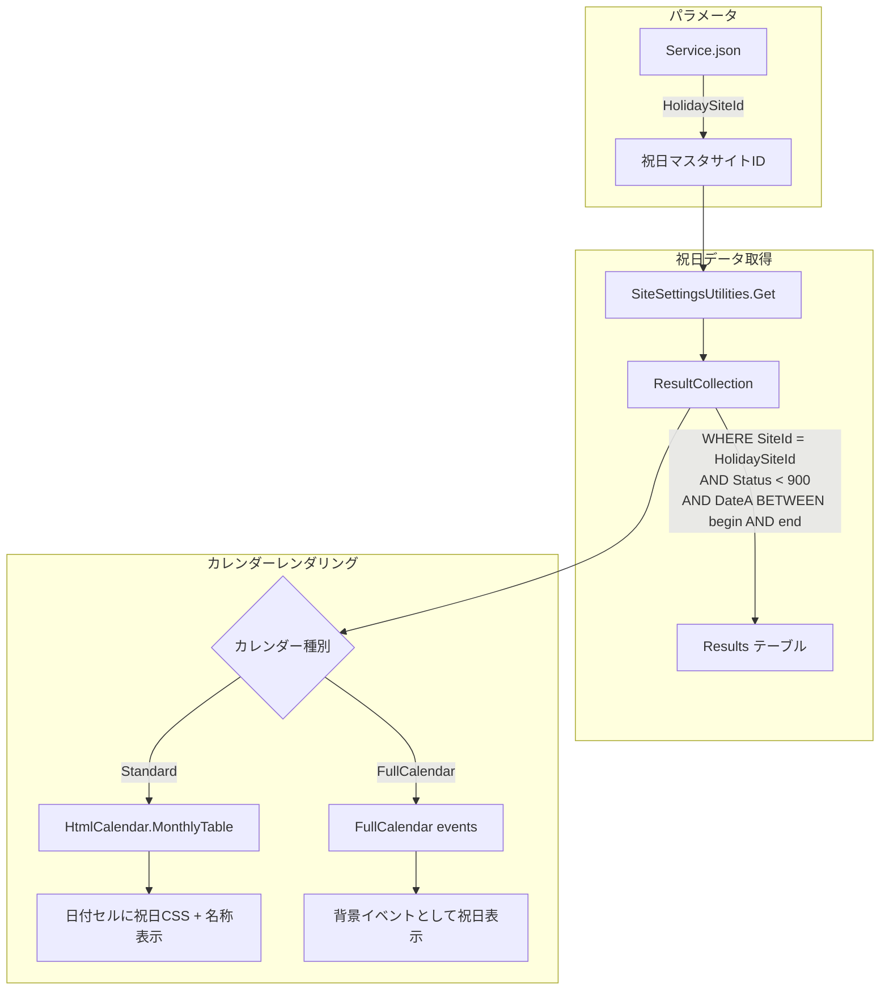
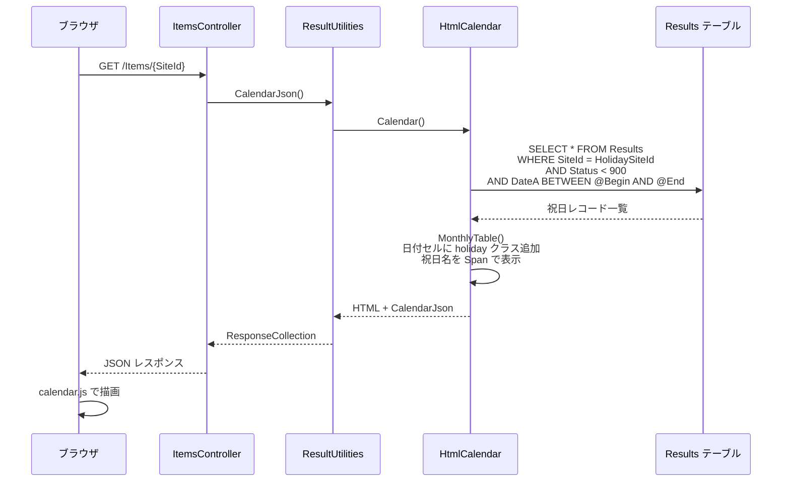
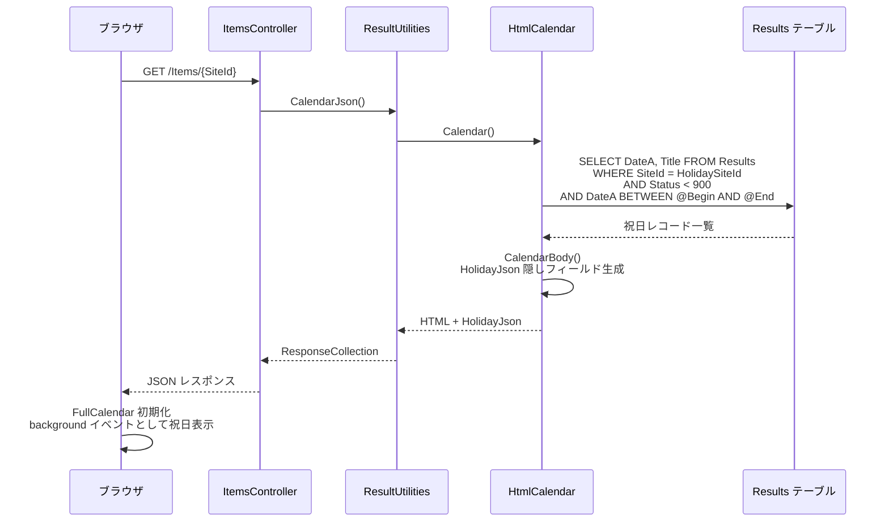
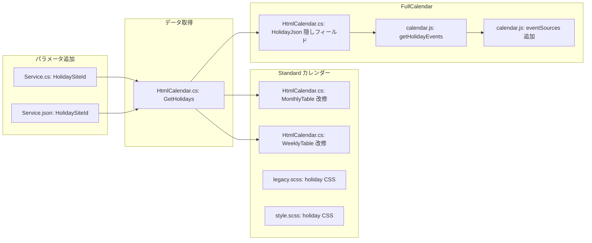

# カレンダー祝日表示（休日表示）

カレンダービューに祝日（休日）を表示する機能を実装するための調査。既存のアナウンス機能の実装パターンを参考に、Results テーブルをマスタとして DateA・Title・Status を参照する方式を設計する。

<!-- START doctoc generated TOC please keep comment here to allow auto update -->
<!-- DON'T EDIT THIS SECTION, INSTEAD RE-RUN doctoc TO UPDATE -->

- [調査情報](#調査情報)
- [調査目的](#調査目的)
- [現行のカレンダー実装](#現行のカレンダー実装)
    - [カレンダーの種類](#カレンダーの種類)
    - [Standard カレンダーのセル構造](#standard-カレンダーのセル構造)
    - [曜日の CSS クラス適用](#曜日の-css-クラス適用)
    - [FullCalendar の初期化](#fullcalendar-の初期化)
    - [カレンダーデータの取得](#カレンダーデータの取得)
- [既存のアナウンス機能（参考）](#既存のアナウンス機能参考)
    - [アナウンスの仕組み](#アナウンスの仕組み)
    - [アナウンスデータの取得](#アナウンスデータの取得)
    - [アナウンスのフィールド対応](#アナウンスのフィールド対応)
    - [アナウンスのアーキテクチャ](#アナウンスのアーキテクチャ)
- [祝日表示の設計](#祝日表示の設計)
    - [基本方針](#基本方針)
    - [パラメータの追加](#パラメータの追加)
    - [祝日マスタの構成](#祝日マスタの構成)
    - [祝日データの取得](#祝日データの取得)
    - [全体アーキテクチャ](#全体アーキテクチャ)
- [Standard カレンダーへの祝日表示](#standard-カレンダーへの祝日表示)
    - [日付セルへの CSS クラス追加](#日付セルへの-css-クラス追加)
    - [CSS スタイルの追加](#css-スタイルの追加)
- [FullCalendar への祝日表示](#fullcalendar-への祝日表示)
    - [Background Events の活用](#background-events-の活用)
    - [FullCalendar 初期化への組み込み](#fullcalendar-初期化への組み込み)
    - [隠しフィールドの追加](#隠しフィールドの追加)
- [データフロー](#データフロー)
    - [Standard カレンダーのデータフロー](#standard-カレンダーのデータフロー)
    - [FullCalendar のデータフロー](#fullcalendar-のデータフロー)
- [改修対象の全体像](#改修対象の全体像)
    - [改修ファイル一覧](#改修ファイル一覧)
- [考慮事項](#考慮事項)
    - [パフォーマンス](#パフォーマンス)
    - [権限制御](#権限制御)
    - [複数年対応](#複数年対応)
    - [CodeDefiner への影響](#codedefiner-への影響)
    - [Standard カレンダーと FullCalendar の両対応](#standard-カレンダーと-fullcalendar-の両対応)
- [結論](#結論)
- [関連ソースコード](#関連ソースコード)

<!-- END doctoc generated TOC please keep comment here to allow auto update -->

## 調査情報

| 調査日       | リポジトリ | ブランチ | タグ/バージョン    | コミット     | 備考     |
| ------------ | ---------- | -------- | ------------------ | ------------ | -------- |
| 2026年3月2日 | Pleasanter | main     | Pleasanter_1.5.1.0 | `34f162a439` | 初回調査 |

## 調査目的

プリザンターのカレンダービューに祝日（休日）を表示する機能を実装したい。祝日マスタの管理方式として、既存のアナウンス機能が Issues テーブルを参照する仕組みを参考にし、Results テーブルの DateA（日付）・Title（名称）・Status（有効/無効）を参照するパターンで設計する。

---

## 現行のカレンダー実装

### カレンダーの種類

プリザンターには 2 種類のカレンダービューが存在する。

| 種類         | 実装方式                       | 設定値                           |
| ------------ | ------------------------------ | -------------------------------- |
| Standard     | 独自 HTML テーブル             | `CalendarTypes.Standard = 1`     |
| FullCalendar | FullCalendar v6.1.8 ライブラリ | `CalendarTypes.FullCalendar = 2` |

デフォルトは `Parameters.General.DefaultCalendarType = 2`（FullCalendar）である。

### Standard カレンダーのセル構造

Standard カレンダーでは `HtmlCalendar.cs` の `MonthlyTable` メソッドで各日付セルをレンダリングしている。

**ファイル**: `Implem.Pleasanter/Libraries/HtmlParts/HtmlCalendar.cs`（行番号: 508-525）

```csharp
hb.Td(
    attributes: new HtmlAttributes()
        .Class("container" +
            (currentDate == DateTime.Now.ToLocal(context: context).Date
                ? " today"
                : string.Empty) +
            (date.ToLocal(context: context).Month
                != currentDate.ToLocal(context: context).Month
                    ? " other-month"
                    : string.Empty))
        .DataValue(value: choice.Key, _using: choice.Value != null)
        .DataId(currentDate.ToString("yyyy/M/d")),
    action: () => hb
        .Div(action: () => hb
            .Div(
                css: "day",
                action: () => hb
                    .Text(currentDate.Day.ToString()))));
```

現行のセル CSS クラスは以下の 3 種類のみである。

| CSS クラス    | 条件           | 用途             |
| ------------- | -------------- | ---------------- |
| `container`   | 全セル         | 基本スタイル     |
| `today`       | 当日           | 当日のハイライト |
| `other-month` | 表示月外の日付 | 薄いグレー表示   |

曜日（saturday / sunday）の CSS クラスはヘッダー `<th>` にのみ適用されており、日付セル `<td>` には適用されていない。

### 曜日の CSS クラス適用

**ファイル**: `Implem.Pleasanter/Libraries/HtmlParts/HtmlCalendar.cs`（行番号: 481-487）

```csharp
for (var x = 0; x < 7; x++)
{
    hb.Th(css: DayOfWeekCss(x) + " calendar-header", action: () => hb
        .Text(text: DayOfWeekString(
            context: context,
            x: x)));
}
```

`DayOfWeekCss()` メソッドは `DayOfWeek` 列挙型の名前を小文字で返す（`"sunday"`, `"saturday"` 等）。

**ファイル**: `Implem.Pleasanter/Libraries/HtmlParts/HtmlCalendar.cs`（行番号: 798-803）

```csharp
private static string DayOfWeekCss(int x)
{
    return Parameters.General.FirstDayOfWeek + x > 6
        ? ((DayOfWeek)(Parameters.General.FirstDayOfWeek + x - 7)).ToString().ToLower()
        : ((DayOfWeek)(Parameters.General.FirstDayOfWeek + x)).ToString().ToLower();
}
```

### FullCalendar の初期化

FullCalendar モードでは `calendar.js` で FullCalendar ライブラリを初期化している。

**ファイル**: `Implem.PleasanterFrontend/wwwroot/src/scripts/generals/calendar.js`（行番号: 466 付近）

```javascript
$p.fullCalendar = new FullCalendar.Calendar(calendarEl, {
    headerToolbar: {
        left: 'prev,next today',
        center: 'title',
        right: 'dayGridMonth,timeGridWeek,timeGridDay,listMonth',
    },
    firstDay: 1,
    initialDate: calendarMiddle,
    selectable: true,
    navLinks: true,
    businessHours: true,
    editable: true,
    locale: supportedLanguages.includes(language) ? language : 'en',
    events: getEventsDatas(calendarSuffix),
    eventDrop: updateRecord(calendarSuffix),
    eventResize: updateRecord(calendarSuffix),
});
```

### カレンダーデータの取得

カレンダーに表示するデータは `CalendarDataRows` メソッドで取得される。

**ファイル**: `Implem.Pleasanter/Models/Results/ResultUtilities.cs`（CalendarDataRows メソッド）

```sql
SELECT Results.ResultId AS Id,
       SiteId, Status,
       FromColumn AS "From",
       ToColumn AS "To",
       UpdatedTime, ItemTitle, GroupBy
WHERE FromColumn BETWEEN @Begin AND @End
   OR ToColumn BETWEEN @Begin AND @End
   OR (FromColumn <= @Begin AND ToColumn >= @End)
```

取得した DataRow は `CalendarElement` または `FullCalendarElement` に変換され、隠しフィールド `CalendarJson` を通じて JavaScript に渡される。

---

## 既存のアナウンス機能（参考）

### アナウンスの仕組み

アナウンス機能は、指定した Issues テーブルからデータを取得し、ページ上部にバナーとして表示する仕組みである。`Parameters.Service.AnnouncementSiteId` で対象サイトを指定する。

**ファイル**: `Implem.ParameterAccessor/Parts/Service.cs`

```csharp
public class Service
{
    // ...
    public long AnnouncementSiteId;
    // ...
}
```

### アナウンスデータの取得

**ファイル**: `Implem.Pleasanter/Libraries/HtmlParts/HtmlHeaders.cs`（行番号: 49-86）

```csharp
public static HtmlBuilder Announcement(this HtmlBuilder hb, Context context)
{
    var siteId = Parameters.Service.AnnouncementSiteId;
    if (siteId > 0)
    {
        var ss = SiteSettingsUtilities.Get(
            context: context,
            siteId: siteId);
        var now = DateTime.Now;
        var issueCollection = new IssueCollection(
            context: context,
            ss: ss,
            where: Rds.IssuesWhere()
                .SiteId(Parameters.Service.AnnouncementSiteId)
                .Status(_operator: $"<{Parameters.General.CompletionCode}")
                .StartTime(now, _operator: "<=")
                .CompletionTime(now, _operator: ">="));
        hb.Div(
            attributes: new HtmlAttributes()
                .Id("AnnouncementModule")
                .Class("announcements"),
            _using: !context.IsForm,
            action: () => issueCollection.ForEach(issueModel =>
            {
                if (!IsHiddenAnnouncement(
                    context: context,
                    issueModel: issueModel))
                {
                    hb.Div(
                        attributes: new HtmlAttributes()
                            .Id($"AnnouncementContainer_{issueModel.IssueId}")
                            .Class("annonymous", _using: !context.Authenticated),
                        action: () => hb.Raw(text: issueModel.Body));
                }
            }));
    }
    return hb;
}
```

### アナウンスのフィールド対応

| フィールド     | 用途                             | 条件                                         |
| -------------- | -------------------------------- | -------------------------------------------- |
| Title          | アナウンスのタイトル             | -                                            |
| Body           | アナウンスの本文（HTML 表示）    | -                                            |
| Status         | 有効/無効の判定                  | `Status < Parameters.General.CompletionCode` |
| StartTime      | 表示開始日時                     | `StartTime <= 現在日時`                      |
| CompletionTime | 表示終了日時                     | `CompletionTime >= 現在日時`                 |
| CheckA         | 他のページでは非表示             | -                                            |
| CheckB         | ログイン画面では非表示           | -                                            |
| CheckC         | トップページでは非表示           | -                                            |
| CheckD         | ユーザーによる閉じるボタンの表示 | -                                            |

### アナウンスのアーキテクチャ



---

## 祝日表示の設計

### 基本方針

アナウンス機能のパターンを踏襲し、以下の方針で祝日表示機能を実装する。

| 項目           | アナウンス機能             | 祝日表示機能（新規）        |
| -------------- | -------------------------- | --------------------------- |
| テーブル種別   | Issues テーブル            | Results テーブル            |
| パラメータ     | `AnnouncementSiteId`       | `HolidaySiteId`（新規追加） |
| 日付フィールド | StartTime / CompletionTime | DateA                       |
| 名称フィールド | Title                      | Title                       |
| 有効/無効判定  | Status < CompletionCode    | Status < CompletionCode     |
| 表示先         | ページ上部バナー           | カレンダーの日付セル        |

### パラメータの追加

`Service.json` に `HolidaySiteId` パラメータを追加する。

**ファイル**: `Implem.ParameterAccessor/Parts/Service.cs`

```csharp
public class Service
{
    // ...
    public long AnnouncementSiteId;
    public long HolidaySiteId;  // 追加
    // ...
}
```

**ファイル**: `Implem.Pleasanter/App_Data/Parameters/Service.json`

```json
{
    "AnnouncementSiteId": 0,
    "HolidaySiteId": 0
}
```

### 祝日マスタの構成

Results テーブルに以下の構成で祝日マスタを作成する。

| フィールド | 用途       | 入力例      |
| ---------- | ---------- | ----------- |
| Title      | 祝日の名称 | 元日        |
| DateA      | 祝日の日付 | 2026/01/01  |
| Status     | 有効/無効  | 100（有効） |

Status が `Parameters.General.CompletionCode`（デフォルト: 900）未満のレコードを有効な祝日として扱う。Status を 900 以上に設定することで、レコードを削除せずに無効化できる。

### 祝日データの取得

アナウンス機能の `IssueCollection` パターンに倣い、`ResultCollection` で祝日データを取得する。

```csharp
public static ResultCollection GetHolidays(Context context)
{
    var siteId = Parameters.Service.HolidaySiteId;
    if (siteId <= 0) return null;
    var ss = SiteSettingsUtilities.Get(
        context: context,
        siteId: siteId);
    return new ResultCollection(
        context: context,
        ss: ss,
        where: Rds.ResultsWhere()
            .SiteId(siteId)
            .Status(_operator: $"<{Parameters.General.CompletionCode}"));
}
```

カレンダーの表示範囲に絞り込む場合は、DateA で期間フィルタを追加する。

```csharp
return new ResultCollection(
    context: context,
    ss: ss,
    where: Rds.ResultsWhere()
        .SiteId(siteId)
        .Status(_operator: $"<{Parameters.General.CompletionCode}")
        .DateA(begin, _operator: ">=")
        .DateA(end, _operator: "<="));
```

### 全体アーキテクチャ



---

## Standard カレンダーへの祝日表示

### 日付セルへの CSS クラス追加

`MonthlyTable` メソッドで日付セルを生成する際に、祝日に該当する日付に `holiday` CSS クラスを追加する。

```csharp
// 祝日判定用の辞書（DateA -> Title のマッピング）
var holidays = GetHolidays(context)?
    .ToDictionary(
        r => r.DateA.ToLocal(context: context).Date,
        r => r.Title.Value);

// セル生成時の改修
var isHoliday = holidays?.ContainsKey(currentDate) == true;
hb.Td(
    attributes: new HtmlAttributes()
        .Class("container" +
            (currentDate == DateTime.Now.ToLocal(context: context).Date
                ? " today"
                : string.Empty) +
            (date.ToLocal(context: context).Month
                != currentDate.ToLocal(context: context).Month
                    ? " other-month"
                    : string.Empty) +
            (isHoliday
                ? " holiday"
                : string.Empty))
        .DataValue(value: choice.Key, _using: choice.Value != null)
        .DataId(currentDate.ToString("yyyy/M/d")),
    action: () => hb
        .Div(action: () => hb
            .Div(
                css: "day",
                action: () => hb
                    .Text(currentDate.Day.ToString()))
            .Span(
                css: "holiday-name",
                action: () => hb.Text(holidays?[currentDate] ?? string.Empty),
                _using: isHoliday)));
```

### CSS スタイルの追加

既存の `saturday` / `sunday` スタイルに合わせて `holiday` クラスを追加する。

**legacy.scss**:

```scss
.CalendarBody .holiday {
    background-color: #ffe0e0;
}

.CalendarBody .holiday .holiday-name {
    font-size: 0.75em;
    color: #c00;
    display: block;
}
```

**style.scss**:

```scss
.CalendarBody .holiday {
    background-color: var(--commonColor02Sub);
}

.CalendarBody .holiday .holiday-name {
    font-size: 0.75em;
    color: var(--commonColor02);
    display: block;
}
```

---

## FullCalendar への祝日表示

### Background Events の活用

FullCalendar v6 は `display: 'background'` プロパティにより背景イベントをサポートしている。祝日を背景イベントとして追加することで、通常のレコードイベントとは別レイヤーで祝日を表示できる。

```javascript
// 祝日データを背景イベントとして追加
function getHolidayEvents(calendarSuffix) {
    var holidayJson = $('#HolidayJson' + calendarSuffix).val();
    if (!holidayJson) return [];
    return JSON.parse(holidayJson).map(function (holiday) {
        return {
            title: holiday.Title,
            start: holiday.DateA,
            display: 'background',
            backgroundColor: '#ffe0e0',
            classNames: ['holiday-event'],
        };
    });
}
```

### FullCalendar 初期化への組み込み

`calendar.js` の FullCalendar 初期化時に `eventSources` として祝日データを追加する。

```javascript
$p.fullCalendar = new FullCalendar.Calendar(calendarEl, {
    // 既存設定 ...
    eventSources: [
        { events: getEventsDatas(calendarSuffix) }, // 既存のレコードイベント
        { events: getHolidayEvents(calendarSuffix) }, // 祝日イベント（追加）
    ],
});
```

### 隠しフィールドの追加

祝日データを JavaScript に渡すため、`HtmlCalendar.cs` の `CalendarBody` メソッドに隠しフィールドを追加する。

```csharp
hb.Hidden(
    controlId: $"HolidayJson{suffix}",
    value: GetHolidays(context)?
        .Where(r => r.DateA >= begin && r.DateA <= end)
        .Select(r => new {
            Title = r.Title.Value,
            DateA = r.DateA.ToLocal(context: context).ToString("yyyy-MM-dd")
        })
        .ToJson());
```

---

## データフロー

### Standard カレンダーのデータフロー



### FullCalendar のデータフロー



---

## 改修対象の全体像



### 改修ファイル一覧

| ファイル                                   | 改修内容                                          | 種別     |
| ------------------------------------------ | ------------------------------------------------- | -------- |
| `ParameterAccessor/Parts/Service.cs`       | `HolidaySiteId` プロパティ追加                    | 既存改修 |
| `App_Data/Parameters/Service.json`         | `HolidaySiteId` パラメータ追加                    | 既存改修 |
| `Libraries/HtmlParts/HtmlCalendar.cs`      | 祝日データ取得・セル CSS 追加・隠しフィールド追加 | 既存改修 |
| `wwwroot/src/scripts/generals/calendar.js` | FullCalendar 祝日背景イベント追加                 | 既存改修 |
| `wwwroot/styles/legacy.scss`               | `.holiday` CSS クラス追加                         | 既存改修 |
| `wwwroot/styles/style.scss`                | `.holiday` CSS クラス追加                         | 既存改修 |

---

## 考慮事項

### パフォーマンス

祝日マスタのデータ量は年間 20 件程度と少量であるが、カレンダーの月表示が変わるたびにクエリが実行される。キャッシュの導入も検討できる。

| 方式                 | 利点                   | 欠点                         |
| -------------------- | ---------------------- | ---------------------------- |
| 都度クエリ           | 実装が単純             | 月切替ごとに DB アクセス     |
| メモリキャッシュ     | DB アクセス削減        | キャッシュ無効化のタイミング |
| セッションキャッシュ | ユーザー単位で管理可能 | セッション肥大化の可能性     |

祝日データは年間 20 件程度であり、都度クエリでも実用上問題ない。

### 権限制御

アナウンス機能では `SiteSettingsUtilities.Get` で対象サイトの `SiteSettings` を取得しており、権限チェックが暗黙的に行われる。祝日マスタも同様に、閲覧権限のあるユーザーのみデータ取得が可能となる。全ユーザーに祝日を表示する場合は、対象サイトの権限設定で全ユーザーに読み取り権限を付与する必要がある。

### 複数年対応

祝日マスタに複数年分のデータを登録できる。カレンダー表示範囲（`@Begin` / `@End`）で DateA をフィルタするため、表示月に該当する祝日のみが取得される。

### CodeDefiner への影響

`HolidaySiteId` パラメータは `Service.cs` への単純なプロパティ追加であり、CodeDefiner による自動生成コードへの影響はない。
カレンダー関連のコードは `Model_Utilities_Calendar_Body.txt` というコード定義テンプレートから生成されるため、テンプレート側の改修も必要になる。

### Standard カレンダーと FullCalendar の両対応

祝日表示は Standard カレンダーと FullCalendar の両方で対応が必要である。Standard カレンダーはサーバーサイド HTML 生成で対応し、FullCalendar は背景イベント（`display: 'background'`）で対応する。実装アプローチが異なるため、それぞれ独立して改修する。

---

## 結論

| 項目                | 結果                                                                 |
| ------------------- | -------------------------------------------------------------------- |
| 実装方式            | アナウンス機能のパターンを踏襲し、Results テーブルをマスタとして参照 |
| パラメータ          | `Service.json` に `HolidaySiteId` を追加                             |
| 祝日マスタ          | Results テーブル（DateA: 日付、Title: 名称、Status: 有効/無効）      |
| 有効/無効の判定     | Status < `CompletionCode`（デフォルト 900）                          |
| Standard カレンダー | 日付セルに `holiday` CSS クラスと祝日名を追加                        |
| FullCalendar        | `display: 'background'` の背景イベントとして表示                     |
| DB スキーマ変更     | 不要（既存の Results テーブルを使用）                                |
| 改修規模            | パラメータ追加 + HtmlCalendar 改修 + calendar.js 改修 + CSS 追加     |
| CodeDefiner 対応    | `Model_Utilities_Calendar_Body.txt` テンプレートの改修が必要         |
| パフォーマンス      | 祝日は年間 20 件程度のため都度クエリで実用上問題なし                 |

---

## 関連ソースコード

| ファイル                                                                         | 概要                                                 |
| -------------------------------------------------------------------------------- | ---------------------------------------------------- |
| `Implem.Pleasanter/Libraries/HtmlParts/HtmlCalendar.cs`                          | カレンダー HTML 生成（MonthlyTable 508-525行目）     |
| `Implem.Pleasanter/Libraries/HtmlParts/HtmlHeaders.cs`                           | アナウンス機能（49-86行目）                          |
| `Implem.ParameterAccessor/Parts/Service.cs`                                      | AnnouncementSiteId パラメータ定義                    |
| `Implem.ParameterAccessor/Parts/General.cs`                                      | CompletionCode パラメータ定義（デフォルト 900）      |
| `Implem.Pleasanter/App_Data/Parameters/Service.json`                             | サービスパラメータ設定ファイル                       |
| `Implem.Pleasanter/Models/Results/ResultUtilities.cs`                            | CalendarJson / CalendarDataRows メソッド             |
| `Implem.PleasanterFrontend/wwwroot/src/scripts/generals/calendar.js`             | カレンダー JavaScript（FullCalendar 初期化 466行目） |
| `Implem.PleasanterFrontend/wwwroot/src/plugins/fullcalendar/index.global.min.js` | FullCalendar v6.1.8 ライブラリ                       |
| `Implem.Pleasanter/Libraries/HtmlParts/CalendarElement.cs`                       | Standard カレンダーのデータ要素                      |
| `Implem.Pleasanter/Libraries/HtmlParts/FullCalendarElement.cs`                   | FullCalendar のデータ要素                            |
