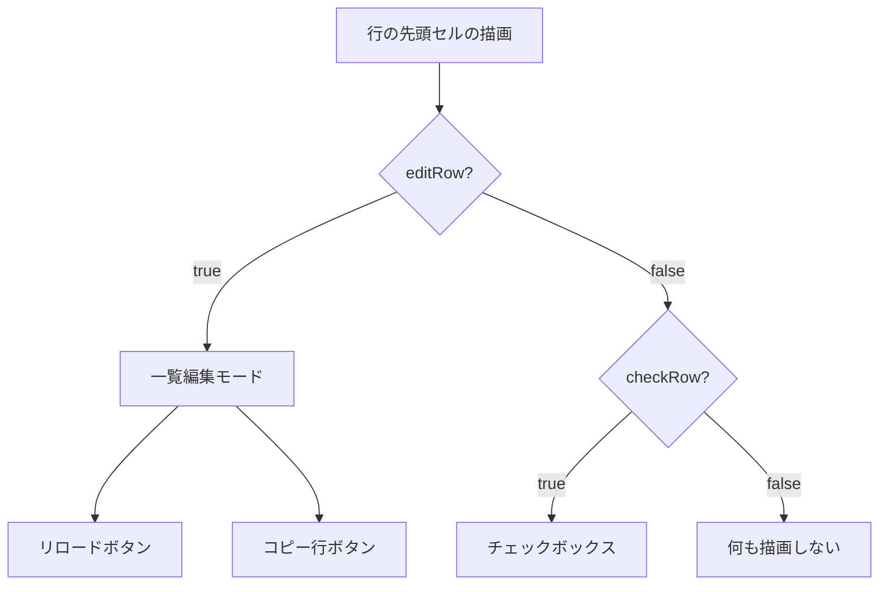
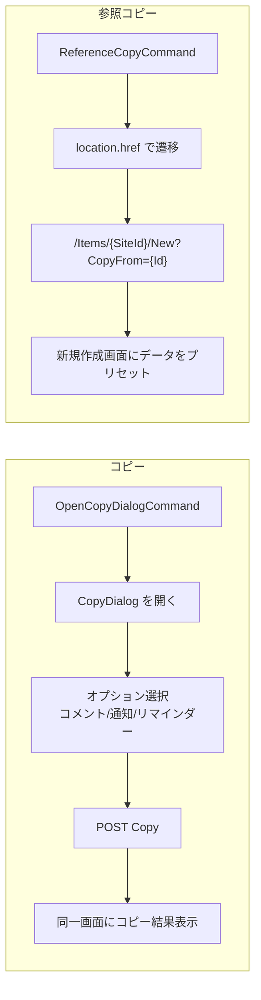
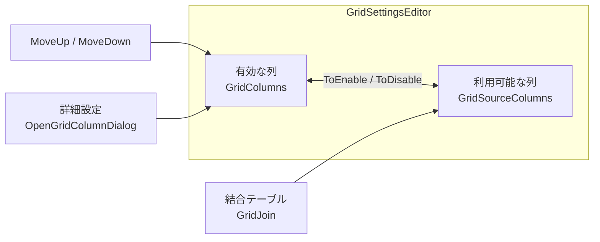
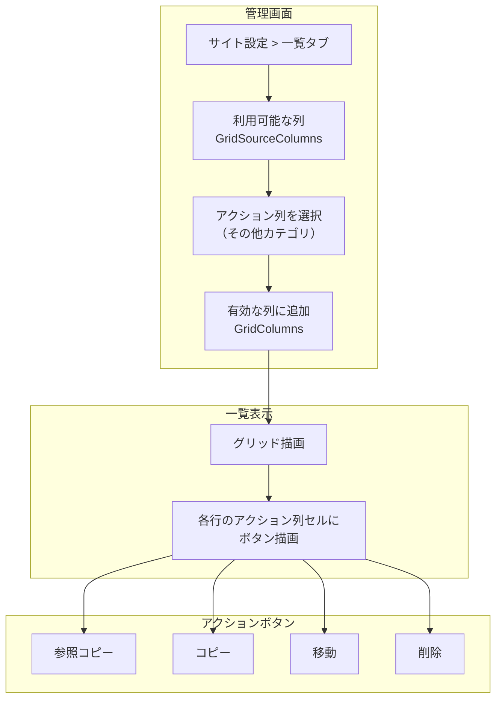
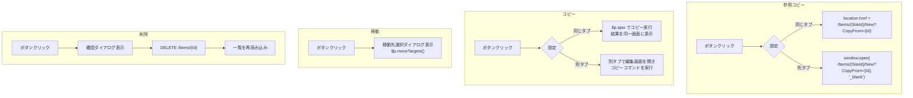
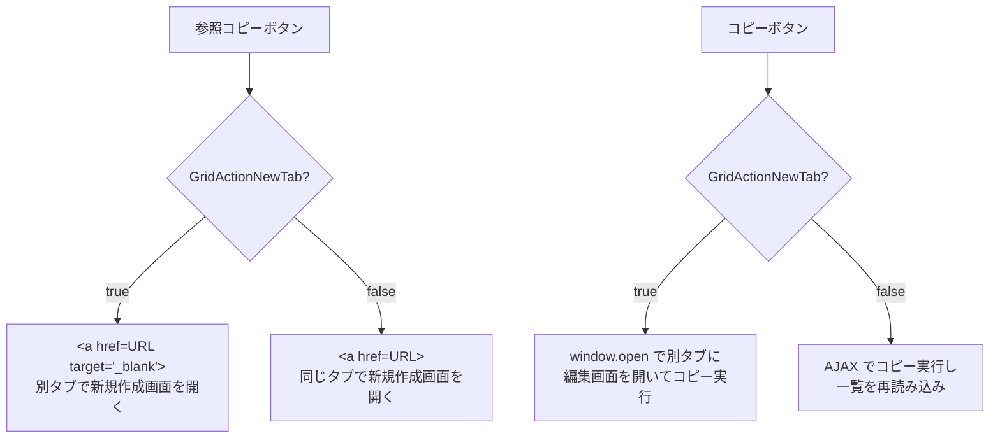

# 一覧セルアクションボタン

一覧画面の各行セルに参照コピー・コピー・削除・移動のアクションボタンを追加する方針を調査し、管理画面での設定方法と実装アプローチをまとめる。

<!-- START doctoc generated TOC please keep comment here to allow auto update -->
<!-- DON'T EDIT THIS SECTION, INSTEAD RE-RUN doctoc TO UPDATE -->

- [調査情報](#調査情報)
- [調査目的](#調査目的)
- [現行の一覧画面のアーキテクチャ](#現行の一覧画面のアーキテクチャ)
    - [一覧の行構造](#一覧の行構造)
    - [行の先頭セルの構成](#行の先頭セルの構成)
    - [行クリック時のナビゲーション](#行クリック時のナビゲーション)
- [現行の編集画面コマンドボタン](#現行の編集画面コマンドボタン)
    - [コマンドボタン一覧](#コマンドボタン一覧)
    - [コピーと参照コピーの違い](#コピーと参照コピーの違い)
- [管理画面の「その他」カテゴリ](#管理画面のその他カテゴリ)
    - [現行の「その他」カテゴリ](#現行のその他カテゴリ)
    - [一覧設定（GridSettingsEditor）の構成](#一覧設定gridsettingseditorの構成)
- [実装方針](#実装方針)
    - [方針 1: GridDesign による HTML カスタムセル](#方針-1-griddesign-による-html-カスタムセル)
    - [方針 2: 専用のアクション列を新設する（推奨）](#方針-2-専用のアクション列を新設する推奨)
- [詳細実装設計](#詳細実装設計)
    - [改修対象ファイル](#改修対象ファイル)
    - [HtmlGrids.cs の改修](#htmlgridscs-の改修)
    - [アクションボタンの描画](#アクションボタンの描画)
    - [参照コピー・コピーの「別タブで開く」設定](#参照コピーコピーの別タブで開く設定)
    - [管理画面の設定 UI](#管理画面の設定-ui)
    - [JavaScript 側の実装](#javascript-側の実装)
    - [イベント伝播の制御](#イベント伝播の制御)
- [権限チェック](#権限チェック)
- [CommandDisplayTypes との関連](#commanddisplaytypes-との関連)
- [既存実装との整合性](#既存実装との整合性)
    - [一覧編集モードとの共存](#一覧編集モードとの共存)
    - [チェックボックスとの共存](#チェックボックスとの共存)
- [セキュリティ考慮事項](#セキュリティ考慮事項)
    - [CSRF 対策](#csrf-対策)
    - [レコードロック](#レコードロック)
- [結論](#結論)
- [関連ソースコード](#関連ソースコード)

<!-- END doctoc generated TOC please keep comment here to allow auto update -->

## 調査情報

| 調査日       | リポジトリ | ブランチ | タグ/バージョン    | コミット     | 備考     |
| ------------ | ---------- | -------- | ------------------ | ------------ | -------- |
| 2026年3月2日 | Pleasanter | main     | Pleasanter_1.5.1.0 | `34f162a439` | 初回調査 |

## 調査目的

- 一覧画面の各行にワンクリックで操作できるアクションボタン（参照コピー・コピー・削除・移動）を追加する方法を調査する
- 管理画面（サイト設定）の「その他」カテゴリにアクションボタン列を追加し、ワンクリックで有効化できる仕組みを検討する
- 参照コピー・コピーでは「別タブで開く」と「そのまま開く」を選択可能にする方法を調査する

---

## 現行の一覧画面のアーキテクチャ

### 一覧の行構造

一覧画面のグリッドは `HtmlGrids.cs` で生成される。各行は `<tr class="grid-row">` として描画され、`data-id` 属性にレコード ID が付与される。

**ファイル**: `Implem.Pleasanter/Libraries/HtmlParts/HtmlGrids.cs`（行番号: 370-380）

```csharp
return hb.Tr(
    attributes: new HtmlAttributes()
        .Class("grid-row" + extendedRowCss)
        .DataId(dataId.ToString())
        .DataVer(dataVersion)
        .DataLatest(1, _using: !isHistory)
        .Add(name: "data-history", value: "1", _using: isHistory)
        .Add(name: "data-locked", value: "1", _using: dataRow.Bool("Locked"))
        .Add(name: "data-extension", value: serverScriptModelRow?.ExtendedRowData),
    action: () => { /* セル描画 */ });
```

### 行の先頭セルの構成

行の先頭セルには、モードに応じてチェックボックスまたは編集用ボタン（リロード・コピー）が描画される。



**一覧編集モードの先頭セル:**

```csharp
hb.Td(action: () => hb
    .Button(
        title: Displays.Reload(context: context),
        controlCss: "button-icon",
        onClick: $"$p.getData($(this)).Id={dataId};$p.send($(this));",
        icon: "ui-icon-refresh",
        action: "ReloadRow",
        method: "post",
        _using: !isHistory)
    .Button(
        title: Displays.Copy(context: context),
        controlCss: "button-icon",
        onClick: $"$p.getData($(this)).OriginalId={dataId};$p.send($(this));",
        icon: "ui-icon-copy",
        action: "CopyRow",
        method: "post",
        _using: !isHistory && context.CanCreate(ss: ss))
    .Hidden(/* Timestamp */));
```

**通常モードの先頭セル:**

```csharp
hb.Td(action: () => hb
    .CheckBox(
        controlCss: "grid-check",
        _checked: recordSelector?.Checked(dataId) ?? false,
        dataId: dataId.ToString(),
        _using: !isHistory));
```

### 行クリック時のナビゲーション

通常モードではセルクリック時にレコードの編集画面へ遷移する。この動作は `gridevents.js` のイベントハンドラで制御される。

**ファイル**: `Implem.PleasanterFrontend/wwwroot/src/scripts/generals/gridevents.js`（行番号: 37-90）

```javascript
$(document).on('click', '.grid-row td', function (event) {
    // ...
    var dataId = $(this).closest('.grid-row').attr('data-id');
    if ($grid.hasClass('new-tab')) {
        let url = $('#BaseUrl').val() + dataId;
        window.open(url, '_blank', 'noopener noreferrer');
    } else {
        // ...
        if ($('#EditorDialog').length === 1) {
            // モーダル表示
            let data = {};
            data.EditInDialog = true;
            let url = $('#BaseUrl').val() + dataId + paramVer;
            $p.ajax(url, 'post', data);
        } else {
            // ページ遷移
            $p.transition($('#BaseUrl').val() + dataId + paramVer + paramStr);
        }
    }
});
```

---

## 現行の編集画面コマンドボタン

編集画面では以下のコマンドボタンが `HtmlCommands.cs` の `Common` メソッドで描画される。

**ファイル**: `Implem.Pleasanter/Libraries/HtmlParts/HtmlCommands.cs`（行番号: 510-620）

### コマンドボタン一覧

| ボタン     | controlId             | アクション                 | 表示条件                                      | ショートカット |
| ---------- | --------------------- | -------------------------- | --------------------------------------------- | -------------- |
| 更新       | UpdateCommand         | POST Update                | `CanUpdate` かつ `!readOnly`                  | s              |
| コピー     | OpenCopyDialogCommand | コピーダイアログを開く     | `CanCreate` かつ `AllowCopy == true`          | c              |
| 参照コピー | ReferenceCopyCommand  | 新規作成画面へ遷移         | `CanCreate` かつ `AllowReferenceCopy == true` | k              |
| 移動       | MoveTargetsCommand    | 移動先選択ダイアログを開く | `CanUpdate` かつ `MoveTargets` が設定済み     | o              |
| メール     | EditOutgoingMail      | メール送信ダイアログを開く | `CanSendMail`                                 | m              |
| 削除       | DeleteCommand         | POST Delete                | `CanDelete` かつ `!readOnly`                  | r              |

### コピーと参照コピーの違い



**コピー（OpenCopyDialogCommand）:**

- コピーダイアログを開き、コメント・通知・リマインダーのコピー可否を選択できる
- サーバーサイドで `Copy` アクションを実行し、そのまま編集画面にコピー結果を表示する
- `SiteSettings.AllowCopy == true` が必要

**参照コピー（ReferenceCopyCommand）:**

- `location.href` で `/Items/{SiteId}/New?CopyFrom={Id}` へ遷移する
- 新規作成画面が開き、元レコードのデータがプリセットされる
- `SiteSettings.AllowReferenceCopy == true` が必要
- 遷移先は新規作成画面のため、別タブで開くことが容易

```csharp
// 参照コピーボタンの実装（HtmlCommands.cs:548-558）
.Button(
    commandDisplayTypes: view?.ReferenceCopyCommand,
    controlId: "ReferenceCopyCommand",
    text: Displays.ReferenceCopy(context: context),
    controlCss: "button-icon button-positive",
    accessKey: "k",
    onClick: $"location.href='{Locations.ItemNew(context: context, id: ss.SiteId)}?CopyFrom={context.Id}'",
    icon: "ui-icon-copy",
    _using: copyButton
        && context.CanCreate(ss: ss)
        && !ss.IsSite(context: context)
        && ss.AllowReferenceCopy == true)
```

---

## 管理画面の「その他」カテゴリ

### 現行の「その他」カテゴリ

サイト設定画面の「エディタ」タブには「その他の列設定」（OtherColumnsSettings）セクションがあり、Creator・Updator・CreatedTime・UpdatedTime の 4 列の表示設定を管理する。

**ファイル**: `Implem.Pleasanter/Libraries/SiteManagement/SettingsJsonConverter.Settings.cs`（行番号: 2550-2555）

```csharp
var columns = new string[] { "Creator", "Updator", "CreatedTime", "UpdatedTime" };
```

### 一覧設定（GridSettingsEditor）の構成

一覧に表示する列は「一覧」タブの `GridSettingsEditor` で設定する。利用可能な列は `GridSelectableOptions` メソッドで取得され、「有効」側と「無効」側のリストを操作して列を選択する。

**ファイル**: `Implem.Pleasanter/Models/Sites/SiteUtilities.cs`（行番号: 5976-6040）



---

## 実装方針

### 方針 1: GridDesign による HTML カスタムセル

`Column.GridDesign` プロパティを使用して、セルの内容を自由な HTML で描画する方式。

**ファイル**: `Implem.Pleasanter/Libraries/Settings/Column.cs`（行番号: 107）

```csharp
public string GridDesign;
```

GridDesign が設定されている列は、通常の値表示の代わりに `TdCustomValue` メソッドで描画される。

```csharp
// IssueUtilities.cs:790-796
else if (!column.GridDesign.IsNullOrEmpty())
{
    return hb.TdCustomValue(
        context: context, ss: ss,
        gridDesign: column.GridDesign,
        css: column.CellCss(serverScriptModelColumn?.ExtendedCellCss),
        issueModel: issueModel);
}
```

GridDesign ではプレースホルダ `[ColumnName]` を使ってレコードの値を埋め込むことができるが、JavaScript やボタンの埋め込みには対応していない。GridDesign は主にレイアウトのカスタマイズを目的としており、動的な操作ボタンの実装には適さない。

### 方針 2: 専用のアクション列を新設する（推奨）

一覧の列として「アクション列」を新たに定義し、セル内にボタンを描画する方式。一覧編集モードの先頭セルに既にリロード・コピーのボタンが存在する実装パターンを参考にする。

#### 全体設計



#### アクション列の定義

グリッドの列として定義できる特殊列を追加する。`ColumnDefinition` に新しいエントリとして定義する。

| 項目       | 値                       |
| ---------- | ------------------------ |
| 列名       | `_ActionButtons`         |
| 表示名     | アクション               |
| カテゴリ   | その他                   |
| GridColumn | 有効（グリッド表示可能） |
| 編集不可   | true                     |
| ソート不可 | true                     |

#### 各ボタンの動作仕様



---

## 詳細実装設計

### 改修対象ファイル

| ファイル                                  | 改修内容                                     |
| ----------------------------------------- | -------------------------------------------- |
| `Libraries/HtmlParts/HtmlGrids.cs`        | アクション列セルの描画処理を追加             |
| `Libraries/Settings/Column.cs`            | アクション列の特殊列フラグを追加             |
| `Libraries/Settings/SiteSettings.cs`      | アクション列の選択可能列への追加             |
| `Libraries/Settings/ColumnUtilities.cs`   | GridDefinitions にアクション列を含める       |
| `Models/Sites/SiteUtilities.cs`           | 管理画面のその他カテゴリにアクション列を追加 |
| `App_Data/Definitions/ColumnDefinition.*` | アクション列の定義を追加                     |

### HtmlGrids.cs の改修

`Tr` メソッド内で columns をループする箇所で、アクション列の場合にボタンを描画する分岐を追加する。

```csharp
columns.ForEach(column =>
{
    if (column.ColumnName == "_ActionButtons")
    {
        hb.Td(
            css: "grid-action-buttons",
            action: () => hb.GridActionButtons(
                context: context,
                ss: ss,
                dataId: dataId,
                isHistory: isHistory));
        return;
    }
    // 既存の列描画処理
});
```

### アクションボタンの描画

```csharp
private static HtmlBuilder GridActionButtons(
    this HtmlBuilder hb,
    Context context,
    SiteSettings ss,
    long dataId,
    bool isHistory)
{
    return hb
        .A(
            href: $"{Locations.ItemNew(context: context, id: ss.SiteId)}?CopyFrom={dataId}",
            target: ss.GridActionNewTab ? "_blank" : null,
            title: Displays.ReferenceCopy(context: context),
            css: "grid-action-button",
            icon: "ui-icon-copy",
            _using: !isHistory
                && context.CanCreate(ss: ss)
                && ss.AllowReferenceCopy == true)
        .Button(
            title: Displays.Copy(context: context),
            controlCss: "grid-action-button",
            onClick: ss.GridActionNewTab
                ? $"window.open('{Locations.ItemEdit(context, dataId)}?action=copy', '_blank')"
                : $"$p.gridAction($(this), {dataId}, 'Copy');",
            icon: "ui-icon-copy",
            _using: !isHistory
                && context.CanCreate(ss: ss)
                && ss.AllowCopy == true)
        .Button(
            title: Displays.Move(context: context),
            controlCss: "grid-action-button",
            onClick: $"$p.gridMoveTargets($(this), {dataId});",
            icon: "ui-icon-transferthick-e-w",
            _using: !isHistory
                && ss.MoveTargets?.Any() == true
                && context.CanUpdate(ss: ss))
        .Button(
            title: Displays.Delete(context: context),
            controlCss: "grid-action-button button-negative",
            onClick: $"$p.gridDelete($(this), {dataId});",
            icon: "ui-icon-trash",
            _using: !isHistory
                && context.CanDelete(ss: ss));
}
```

### 参照コピー・コピーの「別タブで開く」設定

SiteSettings に `GridActionNewTab` プロパティを追加し、管理画面から設定可能にする。

```csharp
// SiteSettings.cs
public bool? GridActionNewTab;
```

参照コピーではリンク（`<a>` タグ）を使用し、`target="_blank"` を制御する。



### 管理画面の設定 UI

一覧タブの `GridSettingsEditor` に、アクション列の設定セクションを追加する。

#### アクション列の追加方法

アクション列は `GridSourceColumns`（利用可能な列）に「その他」カテゴリとして表示される。`GridSelectableOptions` の戻り値にアクション列を追加する。

```csharp
// SiteSettings.cs - GridSelectableOptions の拡張
// 利用可能な列にアクション列を追加
```

#### アクション列の詳細設定ダイアログ

`GridColumnDialog` を拡張し、アクション列選択時に以下のオプションを表示する。

| 設定項目                 | 型   | 既定値 | 説明                               |
| ------------------------ | ---- | ------ | ---------------------------------- |
| 参照コピーボタン表示     | bool | true   | 参照コピーボタンの表示/非表示      |
| コピーボタン表示         | bool | true   | コピーボタンの表示/非表示          |
| 移動ボタン表示           | bool | true   | 移動ボタンの表示/非表示            |
| 削除ボタン表示           | bool | true   | 削除ボタンの表示/非表示            |
| 参照コピーを別タブで開く | bool | false  | 参照コピー時に別タブで開くかどうか |
| コピーを別タブで開く     | bool | false  | コピー時に別タブで開くかどうか     |

### JavaScript 側の実装

**ファイル**: 新規作成 `Implem.PleasanterFrontend/wwwroot/src/scripts/generals/gridactions.js`

```javascript
// グリッドのアクションボタン用ハンドラ

// グリッド行の削除
$p.gridDelete = function ($control, dataId) {
    if (!confirm($p.display('ConfirmDelete'))) return;
    var data = $p.getData($control);
    data.Id = dataId;
    $p.send($control, 'MainForm', 'Delete', 'delete');
};

// グリッド行の移動（移動先選択ダイアログ）
$p.gridMoveTargets = function ($control, dataId) {
    var data = $p.getData($control);
    data.Id = dataId;
    $p.send($control, 'MainForm', 'MoveTargets', 'get');
    $p.openDialog($control, '.main-form');
};

// グリッド行のコピー
$p.gridAction = function ($control, dataId, action) {
    var data = $p.getData($control);
    data.Id = dataId;
    $p.send($control, 'MainForm', action, 'post');
};
```

### イベント伝播の制御

アクションボタンのクリックイベントが行のクリックイベントに伝播しないよう、`event.stopPropagation()` を処理する必要がある。

```javascript
// gridevents.js の行クリックイベントハンドラに追加
$(document).on('click', '.grid-row td', function (event) {
    // アクションボタンセルのクリックは行遷移しない
    if ($(event.target).closest('.grid-action-buttons').length > 0) return;
    // 既存の行クリック処理
});
```

---

## 権限チェック

各アクションボタンの表示にはそれぞれ権限チェックが必要。

| ボタン     | 必要な権限  | 追加条件                         |
| ---------- | ----------- | -------------------------------- |
| 参照コピー | `CanCreate` | `AllowReferenceCopy == true`     |
| コピー     | `CanCreate` | `AllowCopy == true`              |
| 移動       | `CanUpdate` | `MoveTargets` が設定済み         |
| 削除       | `CanDelete` | レコードがロックされていないこと |

権限チェックは `HtmlGrids.cs` での描画時にサーバーサイドで行い、権限のないボタンは HTML 自体を出力しない。

---

## CommandDisplayTypes との関連

既存のコマンドボタンは `CommandDisplayTypes` 列挙型によりビュー単位で表示制御ができる。

**ファイル**: `Implem.Pleasanter/Libraries/Settings/View.cs`（行番号: 29-35）

```csharp
public enum CommandDisplayTypes : int
{
    Displayed = 0,    // 表示
    None = 1,         // 非表示
    Disabled = 2,     // 無効化
    Hidden = 3,       // 隠し
}
```

アクション列のボタンにも同様の制御を適用するかは、実装の複雑さとユーザーの利便性のバランスで判断する。初期実装ではサイト設定レベル（`SiteSettings`）での ON/OFF 制御のみとし、ビュー単位の制御は将来的な拡張とする。

---

## 既存実装との整合性

### 一覧編集モードとの共存

一覧編集モード（`editRow == true`）では先頭セルにリロード・コピーのボタンが既に存在する。アクション列は通常モード・一覧編集モードの両方で表示できるが、一覧編集モードでは既存の先頭セルボタンと機能が重複する点に注意する。

| 機能       | 先頭セルボタン（一覧編集モード） | アクション列（全モード共通）   |
| ---------- | -------------------------------- | ------------------------------ |
| コピー     | CopyRow（行のインラインコピー）  | コピーダイアログ or 参照コピー |
| リロード   | ReloadRow                        | なし                           |
| 移動       | なし                             | 移動先選択ダイアログ           |
| 削除       | なし                             | 確認後に削除実行               |
| 参照コピー | なし                             | 新規作成画面へ遷移             |

### チェックボックスとの共存

通常モードではチェックボックス列が表示されるが、アクション列はチェックボックスとは独立した追加列として描画する。一括操作（BulkDelete・BulkMove）はチェックボックス選択による既存機能を維持し、アクション列は単一レコードに対する操作を提供する。

---

## セキュリティ考慮事項

### CSRF 対策

一覧画面から直接 POST/DELETE リクエストを送信する場合、CSRF トークンの検証が必要。
既存の `$p.send` 関数は `MainForm` 内の `Token` hidden フィールドを自動送信するため、
`$p.send` 経由でリクエストを行えば CSRF 対策は既存の仕組みで対応可能。

### レコードロック

ロックされたレコードに対する操作を防ぐため、行の `data-locked` 属性を参照してボタンの有効/無効を制御する。

```javascript
// ロック状態のチェック
var isLocked = $(this).closest('.grid-row').attr('data-locked') === '1';
if (isLocked) {
    // 移動・削除ボタンを無効化
}
```

---

## 結論

| 項目                              | 内容                                                                            |
| --------------------------------- | ------------------------------------------------------------------------------- |
| 推奨方式                          | 方針 2: 専用アクション列を新設する                                              |
| アクション列の列名                | `_ActionButtons`（アンダースコアプレフィクスで特殊列であることを明示）          |
| 管理画面での追加方法              | 一覧タブの利用可能な列にその他カテゴリとして表示し、ワンクリックで有効化        |
| 参照コピーの別タブ対応            | `<a>` タグの `target="_blank"` で制御。設定で切り替え可能                       |
| コピーの別タブ対応                | `window.open` で別タブに編集画面を開いてコピー実行。設定で切り替え可能          |
| 権限制御                          | サーバーサイドで各ボタンの表示可否を判定し、権限のないボタンは HTML 出力しない  |
| 既存機能との整合性                | 一覧編集モードの先頭セルボタン、一括操作チェックボックスとは独立して機能する    |
| イベント伝播制御                  | アクションボタンのクリックが行クリックに伝播しないよう `stopPropagation` が必要 |
| GridDesign 方式を不採用とした理由 | GridDesign はテンプレートベースの値表示用であり、動的なボタン描画には不適       |

---

## 関連ソースコード

| ファイル                                                               | 説明                                   |
| ---------------------------------------------------------------------- | -------------------------------------- |
| `Implem.Pleasanter/Libraries/HtmlParts/HtmlGrids.cs`                   | グリッドの行・セル描画                 |
| `Implem.Pleasanter/Libraries/HtmlParts/HtmlCommands.cs`                | 編集画面のコマンドボタン描画           |
| `Implem.Pleasanter/Libraries/HtmlParts/HtmlCopies.cs`                  | コピーダイアログの描画                 |
| `Implem.Pleasanter/Libraries/Settings/Column.cs`                       | 列定義（GridDesign プロパティ等）      |
| `Implem.Pleasanter/Libraries/Settings/SiteSettings.cs`                 | サイト設定・列の選択可能オプション     |
| `Implem.Pleasanter/Libraries/Settings/View.cs`                         | ビュー設定・CommandDisplayTypes 列挙型 |
| `Implem.Pleasanter/Libraries/Responses/Locations.cs`                   | URL 生成ヘルパー（ItemNew 等）         |
| `Implem.Pleasanter/Models/Sites/SiteUtilities.cs`                      | サイト設定画面の描画                   |
| `Implem.PleasanterFrontend/wwwroot/src/scripts/generals/gridevents.js` | グリッド行のクリックイベントハンドラ   |
| `Implem.PleasanterFrontend/wwwroot/src/scripts/generals/grid.js`       | グリッド操作用の `$p` 関数群           |
| `Implem.PleasanterFrontend/wwwroot/src/scripts/generals/move.js`       | 移動操作用の `$p` 関数群               |
