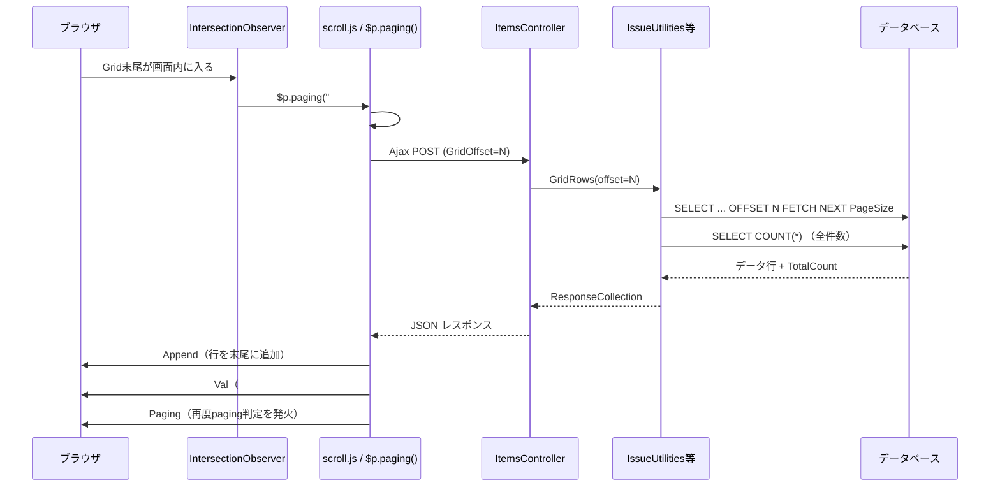
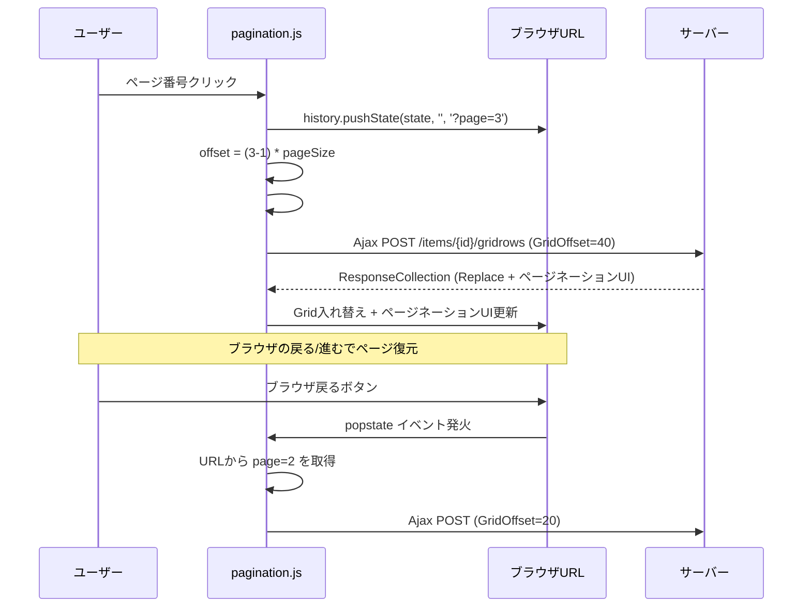
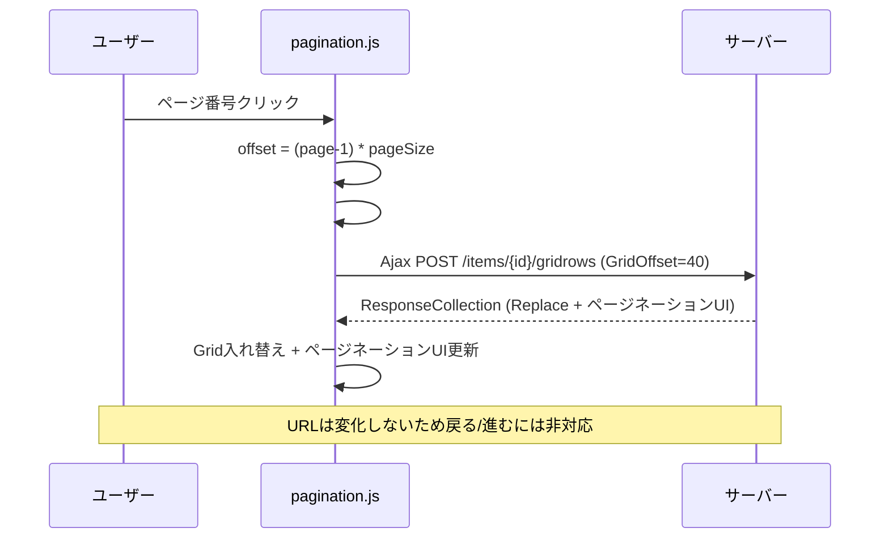
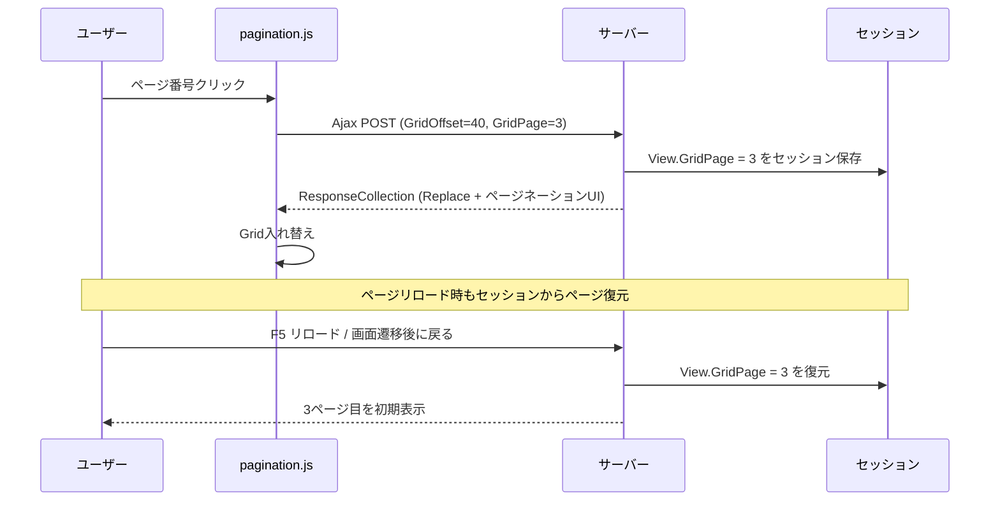

# 一覧画面 ページネーション改修

一覧画面（Grid）の現行無限スクロール方式をページネーション方式に変更するための実装調査。改修対象の特定と改修方針を整理する。

<!-- START doctoc generated TOC please keep comment here to allow auto update -->
<!-- DON'T EDIT THIS SECTION, INSTEAD RE-RUN doctoc TO UPDATE -->

- [調査情報](#調査情報)
- [調査目的](#調査目的)
- [現行実装の全体像](#現行実装の全体像)
    - [無限スクロールの処理フロー](#無限スクロールの処理フロー)
    - [スクロール検知方式（3パターン）](#スクロール検知方式3パターン)
- [現行コードの詳細分析](#現行コードの詳細分析)
    - [1. JavaScript側（フロントエンド）](#1-javascript側フロントエンド)
    - [2. サーバー側（バックエンド）](#2-サーバー側バックエンド)
    - [3. サイト設定（GridPageSize）](#3-サイト設定gridpagesize)
    - [4. 影響を受けるモデル一覧](#4-影響を受けるモデル一覧)
    - [5. SQL生成の仕組み](#5-sql生成の仕組み)
- [改修点の洗い出し](#改修点の洗い出し)
    - [改修方針](#改修方針)
    - [改修箇所一覧](#改修箇所一覧)
- [ページネーションUIの設計案](#ページネーションuiの設計案)
    - [UI構成](#ui構成)
    - [ページネーション HTML 生成ロジック（サーバー側）](#ページネーション-html-生成ロジックサーバー側)
    - [クライアント側ページ遷移ロジック](#クライアント側ページ遷移ロジック)
- [改修時の注意事項](#改修時の注意事項)
    - [CodeDefiner による自動生成](#codedefiner-による自動生成)
    - [既存の `GridPageSize` 設定との整合](#既存の-gridpagesize-設定との整合)
    - [ソート・フィルター時の動作](#ソートフィルター時の動作)
    - [公開テーブル（Publishes）](#公開テーブルpublishes)
- [ページ指定方式の比較](#ページ指定方式の比較)
    - [現行のリクエスト構造（前提知識）](#現行のリクエスト構造前提知識)
    - [方式A: URLクエリパラメータ方式（pushState + ?page=N）](#方式a-urlクエリパラメータ方式pushstate--pagen)
    - [方式B: Ajax POST のみ（URL変更なし）](#方式b-ajax-post-のみurl変更なし)
    - [方式C: セッション保存方式（View にページ情報を追加）](#方式c-セッション保存方式view-にページ情報を追加)
    - [方式比較まとめ](#方式比較まとめ)
    - [推奨方式](#推奨方式)
- [結論](#結論)
- [関連ソースコード](#関連ソースコード)

<!-- END doctoc generated TOC please keep comment here to allow auto update -->

## 調査情報

| 調査日     | リポジトリ | ブランチ | タグ/バージョン    | コミット     | 備考     |
| ---------- | ---------- | -------- | ------------------ | ------------ | -------- |
| 2026-02-12 | Pleasanter | main     | Pleasanter_1.5.1.0 | `34f162a439` | 初回調査 |

## 調査目的

一覧画面は現在、スクロールに応じてデータを自動ロードする「無限スクロール」方式を採用している。これをページネーション（ページ繰り）方式に変更し、1ページあたりの表示件数を管理画面の一覧設定で制御できるようにしたい。そのための改修箇所を洗い出す。

---

## 現行実装の全体像

### 無限スクロールの処理フロー



### スクロール検知方式（3パターン）

| 場面           | 検知方式               | トリガー要素                      |
| -------------- | ---------------------- | --------------------------------- |
| PC 表示        | `IntersectionObserver` | Grid末尾の動的div `#GridObserver` |
| モバイル       | `scroll` イベント      | `#ViewModeContainer` のスクロール |
| ダッシュボード | `scroll` イベント      | `.grid-stack-item-content` の末尾 |

---

## 現行コードの詳細分析

### 1. JavaScript側（フロントエンド）

#### `$p.paging` 関数

**ファイル**: `Implem.PleasanterFrontend/wwwroot/src/scripts/generals/scroll.js`（行番号: 15-35）

```javascript
$p.paging = function (selector) {
    if ($('.ui-dialog:visible').length > 0) {
        return;
    }
    var $control = $(selector);
    var $offset = $(selector + 'Offset'); // #GridOffset
    var $observer = $(selector + 'Observer');
    var buffer = 10;
    if ($control.length) {
        var $target = $observer.length ? $observer : $control;
        if (
            Math.floor($(window).scrollTop() + window.innerHeight + buffer) >=
            Math.floor($target.offset().top + $target.height())
        ) {
            if ($offset.val() !== '-1') {
                $p.setData($offset);
                $offset.val('-1'); // 二重送信防止
                $p.send($control); // Ajax POST
            }
        }
    }
};
```

**動作**: スクロール位置がGrid末端に到達したか判定し、`#GridOffset` が `-1` でなければ Ajax で次のデータを取得。

#### `$p.pageObserve` 関数（IntersectionObserver）

**ファイル**: `Implem.PleasanterFrontend/wwwroot/src/scripts/generals/observer.js`（行番号: 1-46）

- Grid直下に `<div id="GridObserver">` を動的生成
- `IntersectionObserver` で監視し、ビューポートに入ったら `$p.paging()` を発火

#### `$p.setGrid` 関数

**ファイル**: `Implem.PleasanterFrontend/wwwroot/src/scripts/generals/grid.js`（行番号: 1-3）

```javascript
$p.setGrid = function () {
    $p.pageObserve('Grid');
};
```

#### `$p.dashboardPaging` 関数

**ファイル**: `Implem.PleasanterFrontend/wwwroot/src/scripts/generals/scroll.js`（行番号: 37-72）

- ダッシュボード内グリッドのスクロールページング
- suffix 付きの `#GridOffset_{suffix}` を使用

#### レスポンスディスパッチ

**ファイル**: `Implem.PleasanterFrontend/wwwroot/src/scripts/generals/_dispatch.js`（行番号: 131-133）

```javascript
case 'Paging':
    $p.paging(target);
    break;
```

### 2. サーバー側（バックエンド）

#### コントローラー

**ファイル**: `Implem.Pleasanter/Controllers/ItemsController.cs`（行番号: 597-608）

```csharp
[HttpPost]
public string GridRows(long id)
{
    var context = new Context();
    var log = new SysLogModel(context: context);
    var json = new ItemModel(context: context, referenceId: id)
        .GridRows(context: context);
    log.Finish(context: context, responseSize: json.Length);
    return json;
}
```

#### ItemModel のルーティング

**ファイル**: `Implem.Pleasanter/Models/Items/ItemModel.cs`（行番号: 1505-1531）

```csharp
case "Issues":
    return IssueUtilities.GridRows(
        context: context, ss: Site.SiteSettings,
        offset: context.Forms.Int("GridOffset"));
case "Results":
    return ResultUtilities.GridRows(
        context: context, ss: Site.SiteSettings,
        offset: context.Forms.Int("GridOffset"));
```

#### GridRows メソッド（各モデル共通パターン）

**ファイル**: `Implem.Pleasanter/Models/Issues/IssueUtilities.cs`（行番号: 311-460）

| 処理             | コード例                                                            | 行番号 |
| ---------------- | ------------------------------------------------------------------- | ------ |
| データ取得       | `GetGridData(context, ss, view, offset)`                            | L339   |
| 既存行削除       | `.Remove(".grid tr", _using: offset == 0)`                          | L415   |
| 行追加（Append） | `.Append("#Grid", new HtmlBuilder().GridRows(...))`                 | L421   |
| 次オフセット設定 | `.Val("#GridOffset", ss.GridNextOffset(offset, count, totalCount))` | L449   |
| ページング再発火 | `.Paging("#Grid")`                                                  | L457   |

#### GridData クラス

**ファイル**: `Implem.Pleasanter/Libraries/Models/GridData.cs`（行番号: 26-55）

```csharp
public GridData(
    Context context, SiteSettings ss, View view,
    int top = 0, int offset = 0, int pageSize = 0, bool count = true)
```

- 2つのSQLを実行: メインクエリ（`OFFSET ... FETCH NEXT`）+ カウントクエリ（`SELECT COUNT(*)`）
- `TotalCount` プロパティで全件数を保持

#### GridNextOffset メソッド

**ファイル**: `Implem.Pleasanter/Libraries/Settings/SiteSettings.cs`（行番号: 4017-4022）

```csharp
public int GridNextOffset(int offset, int count, int totalCount)
{
    return offset + count < totalCount
        ? offset + GridPageSize.ToInt()
        : -1;  // 終端を示す
}
```

### 3. サイト設定（GridPageSize）

#### プロパティ宣言

**ファイル**: `Implem.Pleasanter/Libraries/Settings/SiteSettings.cs`（行番号: 162）

```csharp
public int? GridPageSize;
```

#### デフォルト値

**ファイル**: `Implem.Pleasanter/Libraries/Settings/SiteSettings.cs`（行番号: 342）

```csharp
GridPageSize = GridPageSize ?? Parameters.General.GridPageSize;
```

#### 管理画面の入力UI（**既に存在する**）

**ファイル**: `Implem.Pleasanter/Models/Sites/SiteUtilities.cs`（行番号: 5903-5911）

```csharp
.FieldSpinner(
    controlId: "GridPageSize",
    fieldCss: "field-auto-thin",
    labelText: Displays.NumberPerPage(context: context),
    value: ss.GridPageSize.ToDecimal(),
    min: Parameters.General.GridPageSizeMin,
    max: Parameters.General.GridPageSizeMax,
    step: 1,
    width: 25)
```

> **重要発見**: 管理画面の一覧タブに「ページ当たりの表示件数」（`GridPageSize`）の設定UIは**既に存在**している。デフォルト値は **20**、設定可能範囲は **10〜200**。

#### パラメータ設定値

**ファイル**: `Implem.Pleasanter/App_Data/Parameters/General.json`（行番号: 31-33）

```json
"GridPageSize": 20,
"GridPageSizeMin": 10,
"GridPageSizeMax": 200,
```

#### 表示ラベル

**ファイル**: `Implem.Pleasanter/App_Data/Displays/NumberPerPage.json`

| 言語 | ラベル                                    |
| ---- | ----------------------------------------- |
| ja   | ページ当たりの表示件数                    |
| en   | No. of entries displayed per page         |
| zh   | 每页显示的条目数                          |
| de   | Anzahl der pro Seite angezeigten Einträge |

### 4. 影響を受けるモデル一覧

`GridRows` メソッドを持つすべてのモデル：

| モデル        | ファイル                   | GridRows 行番号 |
| ------------- | -------------------------- | --------------- |
| Issues        | `IssueUtilities.cs`        | L311            |
| Results       | `ResultUtilities.cs`       | L311            |
| Sites         | `SiteUtilities.cs`         | L278            |
| Users         | `UserUtilities.cs`         | L283, L4376     |
| Groups        | `GroupUtilities.cs`        | L292, L3134     |
| Depts         | `DeptUtilities.cs`         | L287, L2372     |
| SysLogs       | `SysLogUtilities.cs`       | L275, L2544     |
| Registrations | `RegistrationUtilities.cs` | L276, L2497     |
| Dashboards    | `DashboardUtilities.cs`    | L287            |

### 5. SQL生成の仕組み

| DB         | データ範囲句                                         | ファイル                       |
| ---------- | ---------------------------------------------------- | ------------------------------ |
| SQL Server | `OFFSET @Offset ROWS FETCH NEXT @PageSize ROWS ONLY` | `SqlServerCommandText.cs` L108 |
| PostgreSQL | 同上                                                 | 同上                           |
| MySQL      | `LIMIT @PageSize OFFSET @Offset`                     | `MySqlCommandText.cs` L117     |

---

## 改修点の洗い出し

### 改修方針

現行の「Append でデータを末尾追加 + スクロール検知で自動ロード」から「Replace でページ単位に入れ替え + ページネーションUIで遷移」に変更する。

### 改修箇所一覧

#### A. フロントエンド（JavaScript）

| #   | ファイル                  | 改修内容                                                                                                                                         | 影響度 |
| --- | ------------------------- | ------------------------------------------------------------------------------------------------------------------------------------------------ | ------ |
| A-1 | `scroll.js`               | `$p.paging()` の無限スクロール判定ロジックを **無効化または削除**。代わりにページネーションUI操作で `$p.send()` を呼ぶ仕組みに変更。             | 高     |
| A-2 | `observer.js`             | `$p.pageObserve()` の `IntersectionObserver` / `MutationObserver` を **無効化または削除**。                                                      | 高     |
| A-3 | `grid.js`                 | `$p.setGrid()` から `$p.pageObserve('Grid')` 呼び出しを削除。                                                                                    | 中     |
| A-4 | `scrollevents.js`         | モバイル・ダッシュボード向けスクロールイベントのページング部分を削除。                                                                           | 中     |
| A-5 | `_dispatch.js`            | `case 'Paging'` のディスパッチ処理を変更。ページネーションUIの更新処理に置き換え。                                                               | 中     |
| A-6 | **新規** `pagination.js`  | ページネーションUIのイベントハンドラ（ページ番号クリック、前へ/次へ）を新規作成。`#GridOffset` に適切な offset 値を設定して `$p.send()` を呼ぶ。 | 高     |
| A-7 | **新規** `pagination.css` | ページネーションUIのスタイル定義（ページ番号、現在ページ強調、無効状態等）。                                                                     | 中     |

#### B. サーバー側（C# バックエンド）

| #   | ファイル                                                                             | 改修内容                                                                                                                       | 影響度 |
| --- | ------------------------------------------------------------------------------------ | ------------------------------------------------------------------------------------------------------------------------------ | ------ |
| B-1 | `IssueUtilities.cs` / `ResultUtilities.cs` 等の `GridRows` メソッド（**全9モデル**） | ResponseCollection の `.Append()` を **`.ReplaceAll()` または `.Html()`** に変更。ページ単位でグリッド内容を丸ごと入れ替える。 | 高     |
| B-2 | 同上                                                                                 | `.Paging("#Grid")` を **削除または変更**。代わりにページネーションUIのHTMLを返す ResponseCollection アクションを追加。         | 高     |
| B-3 | 同上                                                                                 | `.Val("#GridOffset", ...)` は維持。ただしページ番号情報（現在ページ、総ページ数）も追加で返す。                                | 中     |
| B-4 | `ResponseCollection.cs`                                                              | ページネーションUI更新用の新メソッド追加（例: `.Pagination()`）。または既存の `.Html()` でページネーション領域を更新。         | 中     |
| B-5 | `SiteSettings.cs` の `GridNextOffset`                                                | ページネーションに応じた offset 計算の見直し（現状のロジックはそのまま流用可能だが、任意ページへのジャンプ対応が必要）。       | 低     |

#### C. HTML生成（HtmlBuilder / View）

| #   | ファイル                                          | 改修内容                                                                                                          | 影響度 |
| --- | ------------------------------------------------- | ----------------------------------------------------------------------------------------------------------------- | ------ |
| C-1 | `HtmlGrids.cs` または各モデルの `Grid()` メソッド | Grid テーブルの下部にページネーションUI領域（`<div id="GridPagination">...`）を追加。                             | 高     |
| C-2 | 同上                                              | ページネーションHTMLの生成メソッド新規追加。`PaginationHtml(currentPage, totalPages, pageSize)` 等。              | 高     |
| C-3 | 各モデルの `IndexHtml()` / `Grid()`               | 初回表示時にページネーションUIを描画。現在ページ=1、総ページ数=`ceil(TotalCount / GridPageSize)` を計算して表示。 | 中     |
| C-4 | `HtmlGrids.cs` の `GridRows`                      | offset=0 以外でも既存行を **Replace** で入れ替えるように変更（現在は Append）。                                   | 中     |

#### D. サイト設定（管理画面）

| #   | ファイル | 改修内容                                                                                                   | 影響度 |
| --- | -------- | ---------------------------------------------------------------------------------------------------------- | ------ |
| D-1 | —        | **改修不要**。`GridPageSize` の設定UIは管理画面の一覧タブに既に存在する（`FieldSpinner`、範囲: 10〜200）。 | —      |

#### E. ダッシュボード対応

| #   | ファイル                 | 改修内容                                                                        | 影響度 |
| --- | ------------------------ | ------------------------------------------------------------------------------- | ------ |
| E-1 | `DashboardUtilities.cs`  | `DashboardIndexGridRows` 内の suffix 付きグリッドにもページネーションUIを追加。 | 高     |
| E-2 | `scroll.js`              | `$p.dashboardPaging()` の無限スクロール判定を無効化。                           | 中     |
| E-3 | **新規** `pagination.js` | suffix 対応のページネーション（`#GridPagination_{suffix}`）。                   | 中     |

#### F. フォームパラメータ

| #   | ファイル       | 改修内容                                                                                                                                 | 影響度 |
| --- | -------------- | ---------------------------------------------------------------------------------------------------------------------------------------- | ------ |
| F-1 | `ItemModel.cs` | `context.Forms.Int("GridOffset")` の取得は維持。ページ番号からoffsetへの変換はクライアント側で行う（`offset = (page - 1) * pageSize`）。 | 低     |

---

## ページネーションUIの設計案

### UI構成

```text
┌─────────────────────────────────────────────────────────┐
│ Grid テーブル（1ページ分のデータ）                        │
│ ...                                                      │
└─────────────────────────────────────────────────────────┘
  ◀ 前へ  [1] [2] [3] ... [10]  次へ ▶   全200件 (20件/ページ)
```

### ページネーション HTML 生成ロジック（サーバー側）

```csharp
// HtmlGrids.cs に追加する想定のメソッド
public static HtmlBuilder Pagination(
    this HtmlBuilder hb,
    Context context,
    int totalCount,
    int pageSize,
    int currentPage,
    string suffix = "")
{
    var totalPages = (int)Math.Ceiling((double)totalCount / pageSize);
    return hb.Div(
        id: $"GridPagination{suffix}",
        css: "grid-pagination",
        action: () => hb
            .Button(text: "◀", page: currentPage - 1, disabled: currentPage <= 1)
            .PageNumbers(currentPage, totalPages)
            .Button(text: "▶", page: currentPage + 1, disabled: currentPage >= totalPages)
            .Span(css: "pagination-info",
                  text: $"全{totalCount}件 ({pageSize}件/ページ)"));
}
```

### クライアント側ページ遷移ロジック

```javascript
// pagination.js（新規作成）
$p.gridPagination = function (page, suffix) {
    var pageSize = parseInt($('#GridPageSize' + (suffix || '')).val());
    var offset = (page - 1) * pageSize;
    var $offset = $('#GridOffset' + (suffix || ''));
    $offset.val(offset);
    $p.setData($offset);
    $p.send($('#Grid' + (suffix || '')));
};
```

---

## 改修時の注意事項

### CodeDefiner による自動生成

以下のファイルは `Implem.Pleasanter.CodeDefiner` によるコード自動生成の対象である可能性がある。改修前にCodeDefinerの定義ファイルを確認し、自動生成コードへの手動変更が上書きされないよう注意が必要：

| ファイル                | 自動生成の可能性  |
| ----------------------- | ----------------- |
| `IssueUtilities.cs`     | 高（Models 配下） |
| `ResultUtilities.cs`    | 高（Models 配下） |
| `ItemModel.cs`          | 高（Models 配下） |
| `ResponseCollection.cs` | 中                |
| `HtmlGrids.cs`          | 低                |

**対応方針**: CodeDefiner の定義テンプレートファイル（`Implem.CodeDefiner/` 配下）も併せて修正し、自動生成で改修内容が上書きされないようにする。

### 既存の `GridPageSize` 設定との整合

- 現行の `GridPageSize` は無限スクロール時の「1回の追加ロード件数」として使われている
- ページネーション化後は「1ページあたりの表示件数」としてそのまま流用可能
- **管理画面の設定UI は改修不要**（既存の `FieldSpinner` がそのまま使える）

### ソート・フィルター時の動作

- ソートヘッダクリック時は `offset=0` にリセットして1ページ目を表示（現行と同様）
- フィルター変更時も同様に1ページ目にリセット

### 公開テーブル（Publishes）

`PublishesController` にも `GridRows` アクションがあり（`PublishesController.cs` L87）、同様の改修が必要。

---

## ページ指定方式の比較

ページ繰り時に「現在のページ番号」をどのように伝達・保持するかについて、3つの方式を比較する。

### 現行のリクエスト構造（前提知識）

- `#MainForm` の `action` 属性: `/items/{siteId}/_action_`
- `$p.send()` 実行時に `_action_` を `gridrows` に置換 → POST先: `/items/{siteId}/gridrows`
- offset は POST body の `GridOffset` フォームフィールドで送信
- View の状態（ソート・フィルター）はサーバー側セッションに保存（URL には含まれない）
- `history.pushState` はビューモード切替・レコード移動・検索で既に使用されている
- `popstate` イベントハンドラが存在し、URLパス変更時にAjax再読込を実行

### 方式A: URLクエリパラメータ方式（pushState + ?page=N）

ページ遷移時に `history.pushState` で `?page=N` をURLに反映する方式。

#### 処理フロー



#### 改修箇所

| #       | ファイル                            | 改修内容                                                                                                        |
| ------- | ----------------------------------- | --------------------------------------------------------------------------------------------------------------- |
| A-URL-1 | **新規** `pagination.js`            | ページ遷移時に `history.pushState(null, '', '?page=' + page)` を実行                                            |
| A-URL-2 | `navigationevents.js`               | `popstate` ハンドラにページ番号復元ロジックを追加。`urlParams()['page']` からoffsetを再計算してGridRowsを再取得 |
| A-URL-3 | `ItemsController.cs` の `Index`     | 初回GETアクセス時に `?page=N` クエリパラメータからoffsetを計算して初期表示に反映                                |
| A-URL-4 | `ItemModel.cs` の `Index`           | `context.QueryStrings` から `page` を取得し、初期GridDataの offset に反映                                       |
| A-URL-5 | 各モデルの `IndexHtml()` / `Grid()` | 初期表示時のoffset対応（0以外のoffsetでのGrid生成）                                                             |
| A-URL-6 | `Views.cs` の `GetBySession`        | `?page=N` がある場合のView復元時にoffset情報を保持する仕組み（または View 外で管理）                            |
| A-URL-7 | `_form.js` の `$p.send()`           | Ajax POST時に `$p.addUrlParameter(url, 'page', page)` でページ番号をURLに追加（任意）                           |

#### メリット・デメリット

| 観点               | 評価                                                                         |
| ------------------ | ---------------------------------------------------------------------------- |
| URL共有            | ◎ `?page=3` のURLを共有すれば同じページが開ける                              |
| ブラウザ戻る/進む  | ◎ pushState + popstate で自然に動作                                          |
| ブックマーク       | ◎ ページ番号付きURLをブックマーク可能                                        |
| 改修規模           | △ popstate ハンドラ改修 + Index アクションの初回GET対応が必要                |
| 既存動作への影響   | △ popstate の条件分岐が複雑化。フィルター・ソート変更時のURL整合性管理が必要 |
| セッションとの競合 | △ View はセッション管理、ページはURL管理 → 二重管理になる                    |

### 方式B: Ajax POST のみ（URL変更なし）

現行の `$p.send()` の仕組みをそのまま活用し、URLは変更しない方式。

#### 処理フロー



#### 改修箇所

| #        | ファイル                 | 改修内容                                                             |
| -------- | ------------------------ | -------------------------------------------------------------------- |
| B-POST-1 | **新規** `pagination.js` | ページクリック時に `#GridOffset` を設定して `$p.send()` するのみ     |
| B-POST-2 | 無限スクロール関連JS     | 前回調査の A-1〜A-5 と同じ                                           |
| B-POST-3 | サーバー側               | 前回調査の B-1〜B-4 と同じ（Append→Replace、ページネーションUI返却） |

#### メリット・デメリット

| 観点               | 評価                                              |
| ------------------ | ------------------------------------------------- |
| URL共有            | ✕ ページ位置を共有できない                        |
| ブラウザ戻る/進む  | ✕ 非対応（ページ遷移後に戻ると一覧全体から離脱）  |
| ブックマーク       | ✕ 常に1ページ目から表示                           |
| 改修規模           | ◎ 最小。既存の `$p.send()` の仕組みをそのまま利用 |
| 既存動作への影響   | ◎ URL/セッション/popstate に一切影響なし          |
| セッションとの競合 | ◎ なし                                            |

### 方式C: セッション保存方式（View にページ情報を追加）

ページ番号を `View` オブジェクトに持たせ、セッションに保存する方式。

#### 処理フロー



#### 改修箇所

| #       | ファイル                                    | 改修内容                                                                                 |
| ------- | ------------------------------------------- | ---------------------------------------------------------------------------------------- |
| C-SES-1 | `View.cs`                                   | `public int? GridPage` プロパティを追加                                                  |
| C-SES-2 | `View.cs` の `SetByForm`                    | フォームデータから `GridPage` を取得して保存                                             |
| C-SES-3 | `Views.cs` の `GetBySession` / `SetSession` | GridPage 情報をセッションに保存・復元                                                    |
| C-SES-4 | 各モデルの `IndexHtml()`                    | 初回表示時に `view.GridPage` からoffsetを計算して表示                                    |
| C-SES-5 | 各モデルの `GridRows`                       | `view.GridPage` の更新とセッション再保存                                                 |
| C-SES-6 | `View.cs` の `RecordingData`                | GridPage をJSON シリアライズ対象にするか判断（ビュー定義への保存は不要、セッションのみ） |

#### メリット・デメリット

| 観点              | 評価                                                                                |
| ----------------- | ----------------------------------------------------------------------------------- |
| URL共有           | ✕ URLにページ情報がないため共有不可                                                 |
| ブラウザ戻る/進む | ✕ 非対応                                                                            |
| ブックマーク      | ✕ 不可                                                                              |
| ページリロード    | ◎ セッションからページ番号を復元できる                                              |
| 画面遷移後の復帰  | ◎ 一覧→詳細→一覧で同じページに戻れる                                                |
| 改修規模          | ○ View クラスへのプロパティ追加が必要だが、既存のセッション管理の仕組みに乗れる     |
| 既存動作への影合  | ○ View の仕組みに沿うため自然。ただしフィルター変更時の GridPage リセット処理が必要 |

### 方式比較まとめ

| 観点                       |       A: URL（pushState）       | B: Ajax POST のみ | C: セッション保存 |
| -------------------------- | :-----------------------------: | :---------------: | :---------------: |
| URL共有・ブックマーク      |                ◎                |         ✕         |         ✕         |
| ブラウザ戻る/進む          |                ◎                |         ✕         |         ✕         |
| ページリロード維持         |                ◎                |         ✕         |         ◎         |
| 画面遷移後の復帰           |   △（URLが変われば失われる）    |         ✕         |         ◎         |
| 改修規模                   |             △（大）             |      ◎（小）      |      ○（中）      |
| 既存実装への影響           |     △（popstate等の複雑化）     |     ◎（最小）     |   ○（View拡張）   |
| フィルター・ソートとの整合 | △（URL + セッションの二重管理） |  ◎（現行と同じ）  |  ○（Viewに統合）  |

### 推奨方式

| ユースケース                                   | 推奨                             |
| ---------------------------------------------- | -------------------------------- |
| 最小改修でページネーションを実現したい         | **方式B**（Ajax POST のみ）      |
| ページリロード・画面復帰時にページを維持したい | **方式C**（セッション保存）      |
| URL共有・ブックマークを重視する                | **方式A**（URLクエリパラメータ） |
| URLでのページ指定 + 画面復帰も両立したい       | **方式A + C のハイブリッド**     |

> **方式A + C のハイブリッド** は、ページ遷移時に pushState でURLを更新しつつ、セッションにも GridPage を保存する。初回GETアクセス時は `?page=N` を優先し、なければセッションから復元する。改修規模は最大だが、すべてのユースケースをカバーできる。

---

## 結論

| 項目             | 結果                                                                                                                                                    |
| ---------------- | ------------------------------------------------------------------------------------------------------------------------------------------------------- |
| 現行方式         | 無限スクロール（IntersectionObserver + Append）                                                                                                         |
| 目標方式         | ページネーション（ページ繰りUI + Replace）                                                                                                              |
| 管理画面の設定UI | **改修不要**（`GridPageSize` の FieldSpinner が既存）                                                                                                   |
| 改修対象（JS）   | `scroll.js`, `observer.js`, `grid.js`, `scrollevents.js`, `_dispatch.js` + 新規 `pagination.js`/`.css`                                                  |
| 改修対象（C#）   | 全9モデルの `GridRows` + `HtmlGrids.cs` + `ResponseCollection.cs` + `DashboardUtilities.cs`                                                             |
| 改修の核心       | Append → Replace の切り替え + ページネーションUI生成                                                                                                    |
| 最大のリスク     | CodeDefiner 自動生成コードとの競合                                                                                                                      |
| SQL層            | 改修不要（既存の OFFSET/FETCH がそのまま使える）                                                                                                        |
| GridData クラス  | 改修不要（offset/pageSize/TotalCount が既に完備）                                                                                                       |
| ページ指定方式   | **A: URL（pushState）** / **B: Ajax POST** / **C: セッション保存** の3方式。URL共有重視ならA、最小改修ならB、画面復帰重視ならC。ハイブリッド（A+C）も可 |

---

## 関連ソースコード

| ファイル                                                                     | 説明                                |
| ---------------------------------------------------------------------------- | ----------------------------------- |
| `Implem.PleasanterFrontend/wwwroot/src/scripts/generals/scroll.js`           | 無限スクロールの `$p.paging()`      |
| `Implem.PleasanterFrontend/wwwroot/src/scripts/generals/observer.js`         | IntersectionObserver による検知     |
| `Implem.PleasanterFrontend/wwwroot/src/scripts/generals/grid.js`             | Grid初期化                          |
| `Implem.PleasanterFrontend/wwwroot/src/scripts/generals/_dispatch.js`        | レスポンスディスパッチ              |
| `Implem.PleasanterFrontend/wwwroot/src/scripts/generals/scrollevents.js`     | スクロールイベント                  |
| `Implem.PleasanterFrontend/wwwroot/src/scripts/generals/_form.js`            | `$p.send()` URL生成・Ajax送信       |
| `Implem.PleasanterFrontend/wwwroot/src/scripts/generals/navigationevents.js` | popstate イベントハンドラ           |
| `Implem.PleasanterFrontend/wwwroot/src/scripts/generals/viewmode.js`         | ビューモード切替の pushState        |
| `Implem.Pleasanter/Controllers/ItemsController.cs`                           | Index / GridRows アクション         |
| `Implem.Pleasanter/Controllers/PublishesController.cs`                       | 公開テーブルの GridRows             |
| `Implem.Pleasanter/Models/Items/ItemModel.cs`                                | モデル振り分け                      |
| `Implem.Pleasanter/Models/Issues/IssueUtilities.cs`                          | Issue GridRows 実装                 |
| `Implem.Pleasanter/Models/Results/ResultUtilities.cs`                        | Result GridRows 実装                |
| `Implem.Pleasanter/Models/Dashboards/DashboardUtilities.cs`                  | ダッシュボード GridRows             |
| `Implem.Pleasanter/Libraries/Models/GridData.cs`                             | データ取得・SQL生成                 |
| `Implem.Pleasanter/Libraries/Settings/SiteSettings.cs`                       | GridPageSize・GridNextOffset        |
| `Implem.Pleasanter/Libraries/Settings/View.cs`                               | View 状態管理（ソート・フィルター） |
| `Implem.Pleasanter/Libraries/Requests/Views.cs`                              | View セッション保存・復元           |
| `Implem.Pleasanter/Libraries/Requests/Context.cs`                            | QueryStrings・Forms の取得          |
| `Implem.Pleasanter/Libraries/Responses/ResponseCollection.cs`                | レスポンス生成・PushState           |
| `Implem.Pleasanter/Libraries/Responses/Locations.cs`                         | URL生成（Action / ItemAction）      |
| `Implem.Pleasanter/Libraries/HtmlParts/HtmlGrids.cs`                         | Grid HTML生成                       |
| `Implem.Pleasanter/Models/Sites/SiteUtilities.cs`                            | 管理画面 GridPageSize UI            |
| `Implem.Pleasanter/App_Data/Parameters/General.json`                         | デフォルトパラメータ                |
