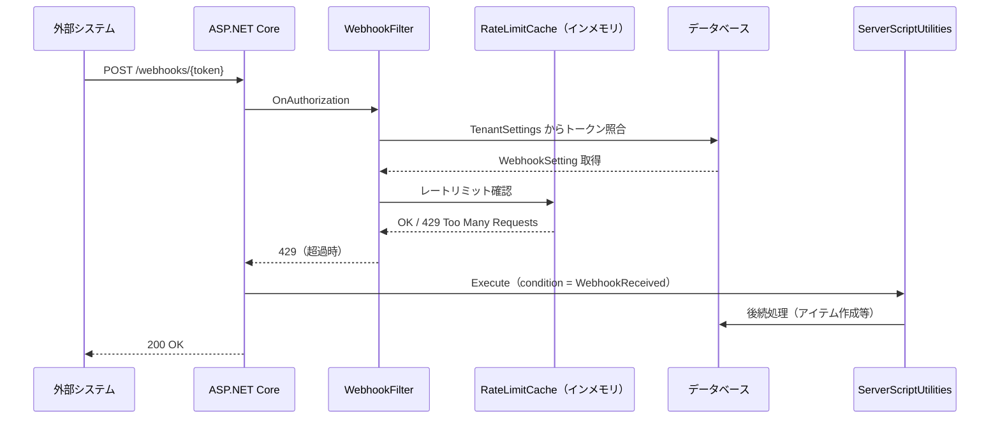
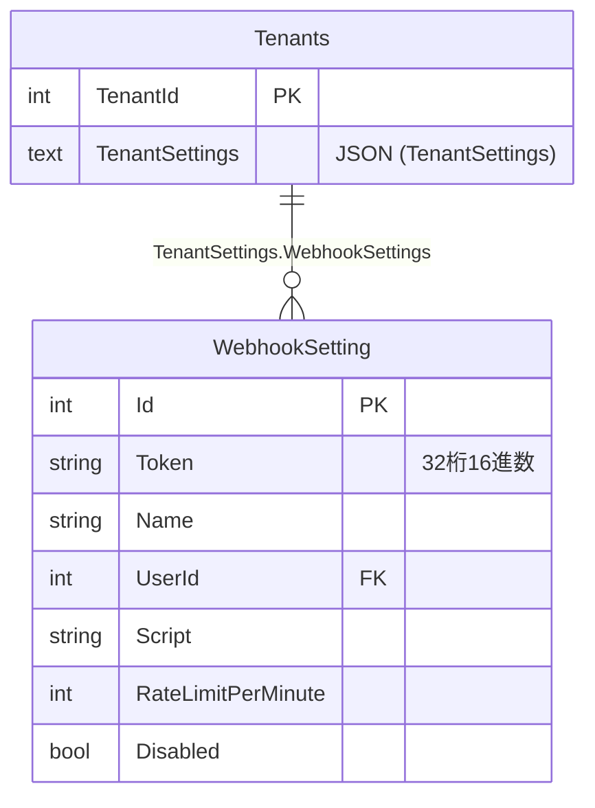
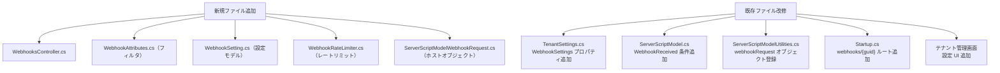

# 外部 Webhook 受信機能の設計調査

外部システムからの HTTP リクエスト（Webhook）をプリザンターで受信し、サーバースクリプトで後続処理を実行する機能の設計を調査する。

<!-- START doctoc generated TOC please keep comment here to allow auto update -->
<!-- DON'T EDIT THIS SECTION, INSTEAD RE-RUN doctoc TO UPDATE -->

- [調査情報](#調査情報)
- [調査目的](#調査目的)
- [機能要件の整理](#機能要件の整理)
- [参考にした既存実装](#参考にした既存実装)
    - [Form 機能によるトークン URL 方式](#form-機能によるトークン-url-方式)
    - [BackgroundServerScript による実行ユーザ指定とスクリプト実行](#backgroundserverscript-による実行ユーザ指定とスクリプト実行)
    - [ApiCount / ContractSettings によるレートリミット（日次上限）](#apicount--contractsettings-によるレートリミット日次上限)
    - [TenantSettings への設定格納](#tenantsettings-への設定格納)
- [設計方針](#設計方針)
    - [全体アーキテクチャ](#全体アーキテクチャ)
    - [URL 設計](#url-設計)
    - [データモデル](#データモデル)
- [各要件の実装方針](#各要件の実装方針)
    - [1. テナント単位で複数作成可能](#1-テナント単位で複数作成可能)
    - [2. 推測困難な URL](#2-推測困難な-url)
    - [3. リクエストレートリミット](#3-リクエストレートリミット)
    - [4. 後続処理はサーバースクリプトで実行](#4-後続処理はサーバースクリプトで実行)
    - [5. 実行ユーザの選択](#5-実行ユーザの選択)
- [コントローラ実装概要](#コントローラ実装概要)
- [フィルタ実装概要（WebhookAttributes）](#フィルタ実装概要webhookattributes)
- [管理機能（設定画面）](#管理機能設定画面)
- [改修が必要なファイル・箇所](#改修が必要なファイル箇所)
- [実装上の注意点](#実装上の注意点)
- [結論](#結論)
- [関連ソースコード](#関連ソースコード)

<!-- END doctoc generated TOC please keep comment here to allow auto update -->

## 調査情報

| 調査日        | リポジトリ | ブランチ | タグ/バージョン    | コミット    | 備考     |
| ------------- | ---------- | -------- | ------------------ | ----------- | -------- |
| 2026年2月25日 | Pleasanter | main     | Pleasanter_1.5.1.0 | `34f162a43` | 初回調査 |

## 調査目的

- 外部システムからの Webhook を受信する機能を追加する際の設計方針を明確にする
- テナント単位で複数 Webhook エンドポイントを管理できる設計を検討する
- URL の推測困難性・レートリミット・後続処理・実行ユーザ選択の各要件を既存実装に基づき整理する

---

## 機能要件の整理

| 要件                             | 詳細                                                       |
| -------------------------------- | ---------------------------------------------------------- |
| テナント単位の複数エンドポイント | 同一テナントで複数の Webhook 受信先を作成・管理できる      |
| 推測困難な URL                   | Form 機能と同様の 32 桁 16 進数トークンを URL に使用する   |
| リクエストレートリミット         | 一定時間内のリクエスト数を制限する                         |
| 後続処理（サーバースクリプト）   | 受信したリクエストをサーバースクリプト内で参照・処理できる |
| 実行ユーザの選択                 | スクリプト実行時のユーザ ID を設定ごとに指定できる         |

---

## 参考にした既存実装

### Form 機能によるトークン URL 方式

Form 機能はサイトごとに 32 桁 16 進数（ハイフンなし GUID）を `Sites.Form` カラムに保持し、
`/forms/{guid}/new` という形式の URL で公開している。

**ファイル**: `Implem.Pleasanter/Models/Sites/SiteUtilities.cs`（行番号: 16975）

```csharp
var formUrl = guid.IsNullOrEmpty()
    ? string.Empty
    : $"{absoluteApplicationRootUri}/forms/{guid}/new".ToLower();
```

**ファイル**: `Implem.Pleasanter/Controllers/FormsController.cs`（行番号: 114）

```csharp
bool isSuccess = Regex.IsMatch(
    json,
    @"""Method""\s*:\s*""Href""\s*,\s*""Value""\s*:\s*""/forms/[a-fA-F0-9]{32}/thanks""");
```

**ファイル**: `Implem.Pleasanter/Startup.cs`（行番号: 461–476）

```csharp
endpoints.MapControllerRoute(
    name: "FormBinaries",
    pattern: "{reference}/{guid}/{controller}/{action}",
    constraints: new
    {
        Guid = "[A-Fa-f0-9]{32}", // ハイフン無し 32 桁 16 進数
    }
);
```

Context 側では、ルートパラメータ `guid` の値で `Sites.Form` カラムを引いてテナント・サイト情報を解決する。

**ファイル**: `Implem.Pleasanter/Libraries/Requests/Context.cs`（行番号: 649–752）

```csharp
case "forms":
    TrySetupController(
        extensionKey: "Form",
        validator: dr => !dr.String("Form").IsNullOrEmpty(),
        specificAction: dr =>
        {
            Id = dr.Int("SiteId");
            IsForm = true;
        }
    );
    break;
// ...
case "forms":
    returnWhere = Rds.SitesWhere()
        .Or(or: Rds.SitesWhere().Form(Guid).SiteId(sub: selectSub));
    break;
```

Webhook では `Sites.Form` の代わりに `Tenants.TenantSettings` に格納した設定を使うことになる。

### BackgroundServerScript による実行ユーザ指定とスクリプト実行

BackgroundServerScript はテナント設定（`TenantSettings`）に格納され、
`UserId` フィールドで実行ユーザを指定できる。

**ファイル**: `Implem.Pleasanter/Libraries/Settings/BackgroundServerScript.cs`

```csharp
public class BackgroundServerScript : ServerScript
{
    public int UserId;
    // ...
}
```

**ファイル**: `Implem.Pleasanter/Libraries/BackgroundServices/BackgroundServerScriptJob.cs`

```csharp
var sqlContext = CreateContext(tenantId: tenatId, userId: userId);
// ...
var ServerScriptModelRow = ServerScriptUtilities.Execute(
    context: sqlContext,
    ss: ss,
    condition: ServerScriptModel.ServerScriptConditions.BackgroundServerScript,
    ...);
```

実行コンテキストの生成には `SiteInfo.User()` でユーザ情報を取得し、`new Context(tenantId, userId, ...)` で認証済みコンテキストを構築している。この方式をそのまま流用できる。

### ApiCount / ContractSettings によるレートリミット（日次上限）

既存の API リクエスト数制限は `Sites.ApiCount` + `Sites.ApiCountDate` カラムによるデータベースベースの日次カウント方式。

**ファイル**: `Implem.Pleasanter/Libraries/Settings/ContractSettings.cs`（行番号: 138–143）

```csharp
public int ApiLimit()
{
    return (ApiLimitPerSite != null)
        ? (int)ApiLimitPerSite
        : Parameters.Api.LimitPerSite;
}
```

この方式は「日次上限」には適しているが、秒単位・分単位のリアルタイムなレートリミットには不向き。
Webhook 向けにはインメモリのスライディングウィンドウ方式が適切であり、別途実装が必要となる。

### TenantSettings への設定格納

`TenantSettings` は `Tenants.TenantSettings` カラムに JSON でシリアライズして保持する。
`BackgroundServerScripts` がすでにテナント単位で管理されており、同じ構造を踏襲できる。

**ファイル**: `Implem.Pleasanter/Libraries/Settings/TenantSettings.cs`

```csharp
public class TenantSettings
{
    public BackgroundServerScripts BackgroundServerScripts { get; set; }
    // ...
}
```

---

## 設計方針

### 全体アーキテクチャ



### URL 設計

Form 機能と同様に 32 桁 16 進数のトークンを URL に使用する。

```text
POST /webhooks/{token}
```

| 項目           | 値                             | 備考                                           |
| -------------- | ------------------------------ | ---------------------------------------------- |
| パス形式       | `/webhooks/{token}`            | token は 32 桁 16 進数（ハイフンなし GUID）    |
| トークン生成   | `Guid.NewGuid().ToString("N")` | N フォーマットでハイフンなし 32 桁             |
| トークン保存先 | `Tenants.TenantSettings`       | `WebhookSettings` 配列として JSON シリアライズ |
| コントローラ名 | `WebhooksController`           | 新規追加                                       |
| ルート制約     | `[A-Fa-f0-9]{32}`              | Form 機能と同様                                |

### データモデル

#### WebhookSetting（設定クラス）

`TenantSettings` に `SettingList<WebhookSetting>` として格納する。

```csharp
public class WebhookSetting
{
    public int Id { get; set; }         // 連番 ID
    public string Token { get; set; }   // 32 桁 16 進数トークン（URL に埋め込む）
    public string Name { get; set; }    // 管理用名称
    public int UserId { get; set; }     // スクリプト実行ユーザ ID
    public string Script { get; set; }  // 実行するサーバースクリプト本文
    public int RateLimitPerMinute { get; set; }  // 分あたりのリクエスト上限
    public bool Disabled { get; set; }  // 無効フラグ
}
```

#### TenantSettings への追加

```csharp
public class TenantSettings
{
    public BackgroundServerScripts BackgroundServerScripts { get; set; }
    public List<WebhookSetting> WebhookSettings { get; set; } // 追加
}
```

#### ER 図



---

## 各要件の実装方針

### 1. テナント単位で複数作成可能

`TenantSettings.WebhookSettings` を `List<WebhookSetting>` で保持することで、テナント単位の複数管理が実現できる。管理 UI は BackgroundServerScript の設定画面と同様に、テナント管理画面（`/admin/tenant`）に追加する。

### 2. 推測困難な URL

32 桁 16 進数トークン（`Guid.NewGuid().ToString("N")`）を URL に埋め込む方式を採用する。これは `2^122`（約 5.3 × 10^36）の組み合わせがあり、総当たりは非現実的。Form 機能と全く同じ設計方針。

```csharp
// トークン生成
var token = Guid.NewGuid().ToString("N"); // 例: "a3f1b2c4d5e6f7a8b9c0d1e2f3a4b5c6"
```

ルーティング設定:

```csharp
endpoints.MapControllerRoute(
    name: "Webhooks",
    pattern: "webhooks/{guid}",
    defaults: new { Controller = "Webhooks", Action = "Receive" },
    constraints: new { Guid = "[A-Fa-f0-9]{32}" }
);
```

### 3. リクエストレートリミット

既存の日次カウント方式（`Sites.ApiCount`）はリアルタイム制限に不向きのため、インメモリのスライディングウィンドウカウンタを実装する。

#### 実装方針

```csharp
// スライディングウィンドウ方式のカウンタ
public static class WebhookRateLimiter
{
    // key: token, value: (timestamps queue)
    private static readonly ConcurrentDictionary<string, Queue<DateTime>> _counters
        = new ConcurrentDictionary<string, Queue<DateTime>>();

    public static bool IsAllowed(string token, int limitPerMinute)
    {
        var now = DateTime.UtcNow;
        var window = TimeSpan.FromMinutes(1);
        var queue = _counters.GetOrAdd(token, _ => new Queue<DateTime>());

        lock (queue)
        {
            // 1分以上古いタイムスタンプを除去
            while (queue.Count > 0 && now - queue.Peek() > window)
                queue.Dequeue();

            if (queue.Count >= limitPerMinute)
                return false;

            queue.Enqueue(now);
            return true;
        }
    }
}
```

フィルタで確認:

```csharp
if (!WebhookRateLimiter.IsAllowed(token, setting.RateLimitPerMinute))
{
    filterContext.HttpContext.Response.StatusCode = 429; // Too Many Requests
    filterContext.Result = new ContentResult
    {
        Content = "Rate limit exceeded",
        StatusCode = 429
    };
    return;
}
```

#### スケールアウト時の考慮

マルチサーバ構成（クラスタ）では、インメモリカウンタはノード間で同期されないため、
本番での厳密な制限には Redis や DB ベースのカウンタへの移行が必要となる。

### 4. 後続処理はサーバースクリプトで実行

BackgroundServerScriptJob の実装（`CreateContext` + `ServerScriptUtilities.Execute`）をそのまま流用する。
受信したリクエストの情報はサーバースクリプトのホストオブジェクトとして公開する。

#### 新規実行条件の追加

`ServerScriptModel.ServerScriptConditions` に `WebhookReceived` を追加する。

```csharp
public enum ServerScriptConditions
{
    // ... 既存の条件 ...
    BackgroundServerScript,
    WebhookReceived,  // 追加
}
```

#### リクエスト情報のホストオブジェクト公開

Webhook 受信時にリクエストボディ・ヘッダ・メソッドをスクリプト内から参照できるよう、
専用のホストオブジェクトを追加する。

```csharp
// ホストオブジェクト: webhookRequest
public class ServerScriptModelWebhookRequest
{
    public string Body { get; }       // リクエストボディ（生文字列）
    public string Method { get; }     // HTTP メソッド（POST 等）
    public string ContentType { get; } // Content-Type ヘッダ
    public Dictionary<string, string> Headers { get; } // 全リクエストヘッダ
    public string Json(string key) { ... } // JSON パース済みの値を取得
}
```

スクリプト内での使用例:

```javascript
// サーバースクリプト本文
var payload = webhookRequest.Json('event'); // JSON フィールドを取得
var body = webhookRequest.Body; // 生リクエストボディ

if (payload === 'order.created') {
    var orderId = webhookRequest.Json('data.id');
    items.Create({
        SiteId: 12345,
        Title: '受注 #' + orderId,
    });
}
```

### 5. 実行ユーザの選択

BackgroundServerScript と同様に、`WebhookSetting.UserId` を参照して実行コンテキストを構築する。

```csharp
private Context CreateWebhookContext(int tenantId, int userId)
{
    var user = SiteInfo.User(
        context: new Context(tenantId: tenantId, request: false),
        userId: userId);
    var context = new Context(
        tenantId: tenantId,
        userId: userId,
        deptId: user.DeptId,
        request: false,
        setAuthenticated: true);
    context.SetTenantProperties(force: true);
    return context;
}
```

---

## コントローラ実装概要

```csharp
[AllowAnonymous]
[WebhookAttributes]  // 専用フィルタ（トークン照合・レートリミット）
public class WebhooksController : Controller
{
    [HttpPost]
    public string Receive(string guid)
    {
        var context = new Context(tenantId: 0);
        // フィルタで設定済みの WebhookSetting を HttpContext.Items から取得
        var setting = (WebhookSetting)HttpContext.Items["WebhookSetting"];

        var execContext = CreateWebhookContext(context.TenantId, setting.UserId);
        var ss = SiteSettingsUtilities.TenantsSiteSettings(context: execContext);

        var request = new ServerScriptModelWebhookRequest(HttpContext.Request);
        var script = new ServerScript { Body = setting.Script };

        ServerScriptUtilities.Execute(
            context: execContext,
            ss: ss,
            condition: ServerScriptModel.ServerScriptConditions.WebhookReceived,
            webhookRequest: request,
            scripts: new[] { script });

        return new { Status = "ok" }.ToJson();
    }
}
```

---

## フィルタ実装概要（WebhookAttributes）

```csharp
public class WebhookAttributes : ActionFilterAttribute, IAuthorizationFilter
{
    public void OnAuthorization(AuthorizationFilterContext filterContext)
    {
        var guid = filterContext.RouteData.Values["guid"]?.ToString()?.ToUpper();

        // TenantSettings から WebhookSetting を検索
        var setting = WebhookSettingsCache.GetByToken(guid);

        if (setting == null || setting.Disabled)
        {
            filterContext.Result = new NotFoundResult();
            return;
        }

        // レートリミット確認
        if (setting.RateLimitPerMinute > 0
            && !WebhookRateLimiter.IsAllowed(guid, setting.RateLimitPerMinute))
        {
            filterContext.HttpContext.Response.StatusCode = 429;
            filterContext.Result = new ContentResult { StatusCode = 429 };
            return;
        }

        filterContext.HttpContext.Items["WebhookSetting"] = setting;
    }
}
```

---

## 管理機能（設定画面）

BackgroundServerScript の管理 UI と同様に、テナント管理画面に Webhook 設定タブを追加する。

| 設定項目                 | 型           | 説明                              |
| ------------------------ | ------------ | --------------------------------- |
| 名称                     | string       | 管理用の表示名                    |
| トークン（URL）          | string（RO） | 自動生成。コピー用ボタンを用意    |
| 実行ユーザ               | DropDown     | テナント内ユーザから選択          |
| スクリプト本文           | Textarea     | 実行するサーバースクリプト        |
| 1 分あたりリクエスト上限 | int          | 0 = 無制限                        |
| 無効フラグ               | bool         | ON にするとエンドポイントを無効化 |

---

## 改修が必要なファイル・箇所



---

## 実装上の注意点

| 項目                       | 内容                                                                                |
| -------------------------- | ----------------------------------------------------------------------------------- |
| トークン推測防止           | URL に格納するのは 32 桁 16 進数のみ。DB には大文字で保存し照合時に正規化する       |
| CSRF 対策不要              | `[AllowAnonymous]` + 外部発信のため、AntiForgeryToken は不要                        |
| リクエストボディの読み取り | `Request.EnableBuffering()` を事前に呼び出し、Stream を複数回読み取り可能にする     |
| マルチサーバ構成           | レートリミットはインメモリのため、厳密な制限が必要な場合は Redis ベースに移行する   |
| 非同期実行                 | スクリプト実行が長時間に及ぶ場合は BackgroundServerScriptJob のキュー方式を検討する |
| ログ記録                   | 受信日時・トークン（先頭 8 桁のみ）・実行結果を SysLog に記録する                   |
| パラメータ制御             | `Parameters.Webhook.Enabled` を追加し、機能ごとの ON/OFF を可能にする               |
| ContractSettings との統合  | `cs.Extensions.Get("Webhook")` でライセンス制御を行う（Form 機能と同様のパターン）  |

---

## 結論

| 要件                             | 実装方針                                                                                                         |
| -------------------------------- | ---------------------------------------------------------------------------------------------------------------- |
| テナント単位の複数エンドポイント | `TenantSettings.WebhookSettings`（`List<WebhookSetting>`）で管理                                                 |
| 推測困難な URL                   | `Guid.NewGuid().ToString("N")` による 32 桁 16 進数トークン（Form 機能と同方式）                                 |
| リクエストレートリミット         | インメモリのスライディングウィンドウ方式（`ConcurrentDictionary`）。クラスタ環境では Redis 移行を検討            |
| 後続処理（サーバースクリプト）   | `ServerScriptConditions.WebhookReceived` を追加。`webhookRequest` ホストオブジェクトで受信データを公開           |
| 実行ユーザの選択                 | `WebhookSetting.UserId` → `CreateWebhookContext()` で認証済みコンテキスト構築（BackgroundServerScript と同方式） |

既存の Form 機能・BackgroundServerScript・TenantSettings の設計を最大限流用できるため、追加実装量は比較的少ない。
最大の新規実装箇所はレートリミットのインメモリカウンタと `ServerScriptModelWebhookRequest` ホストオブジェクトの追加となる。

---

## 関連ソースコード

| ファイル                                                                      | 関連する内容                        |
| ----------------------------------------------------------------------------- | ----------------------------------- |
| `Implem.Pleasanter/Controllers/FormsController.cs`                            | Form 機能 URL（GUID）方式の参考実装 |
| `Implem.Pleasanter/Libraries/Requests/Context.cs`                             | IsForm 判定・GUID によるサイト解決  |
| `Implem.Pleasanter/Startup.cs`                                                | ルーティング設定                    |
| `Implem.Pleasanter/Libraries/Settings/TenantSettings.cs`                      | テナント設定の格納方式              |
| `Implem.Pleasanter/Libraries/Settings/BackgroundServerScript.cs`              | 実行ユーザ指定の参考実装            |
| `Implem.Pleasanter/Libraries/BackgroundServices/BackgroundServerScriptJob.cs` | コンテキスト生成・スクリプト実行    |
| `Implem.Pleasanter/Libraries/Settings/ContractSettings.cs`                    | ApiLimit によるレートリミット参考   |
| `Implem.Pleasanter/Filters/FormsAttributes.cs`                                | フィルタ実装の参考                  |
