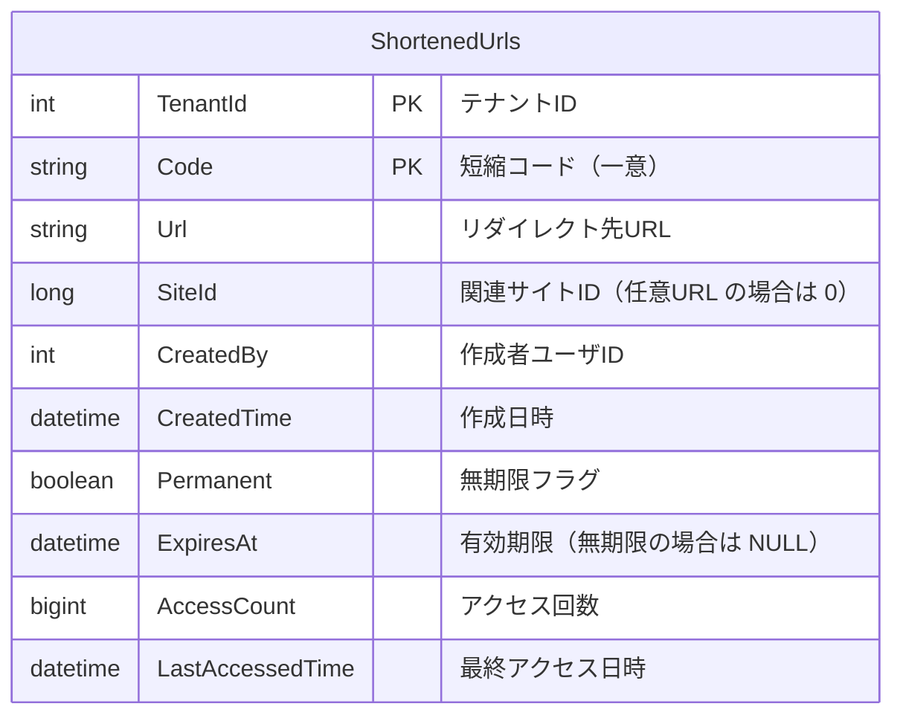
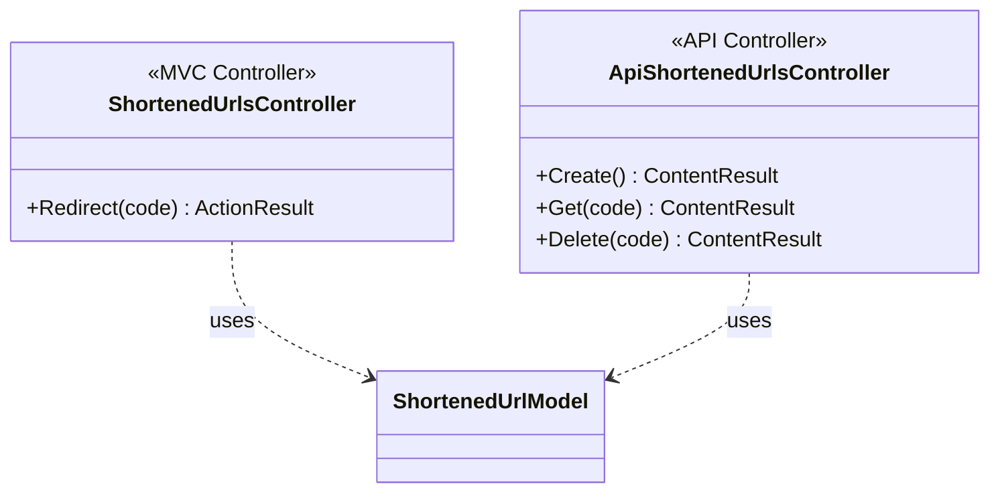
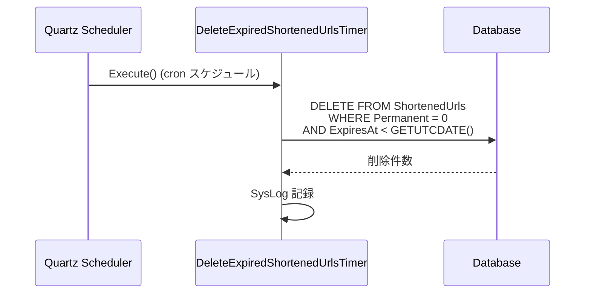
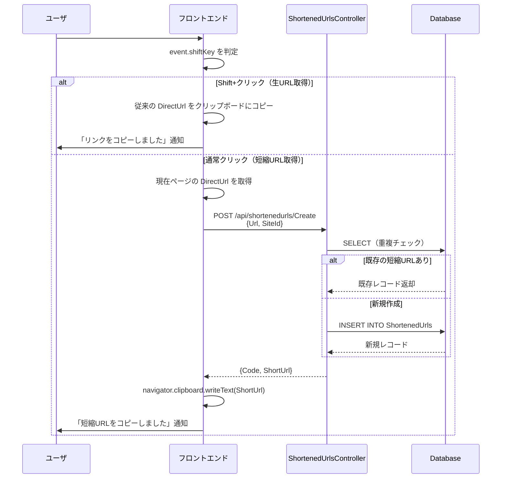
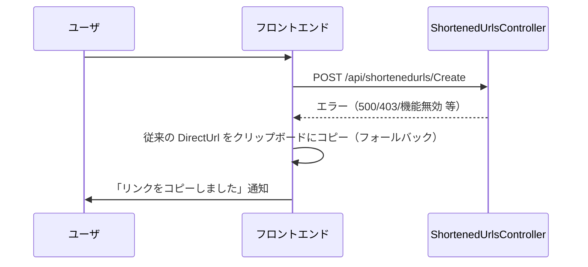
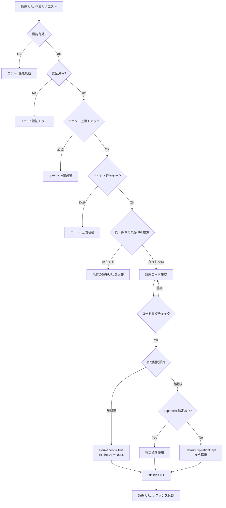
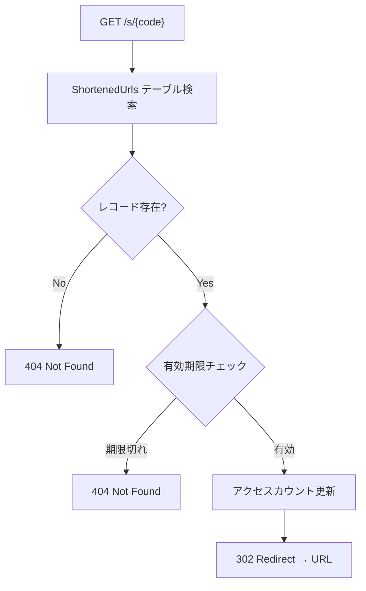

# 短縮 URL 機能設計

プリザンターに短縮 URL 機能を追加するための設計を調査する。
主要ユースケースは `#CopyToClipboards`（リンクコピーボタン）クリック時に短縮 URL を自動発行してクリップボードにコピーする機能であり、サーバースクリプトや API 経由での任意 URL 発行は副次的な機能として位置づける。

<!-- START doctoc generated TOC please keep comment here to allow auto update -->
<!-- DON'T EDIT THIS SECTION, INSTEAD RE-RUN doctoc TO UPDATE -->

- [調査情報](#調査情報)
- [調査目的](#調査目的)
- [既存アーキテクチャの確認](#既存アーキテクチャの確認)
    - [Controller 構成](#controller-構成)
    - [ルーティング構成](#ルーティング構成)
    - [バックグラウンドサービス構成](#バックグラウンドサービス構成)
    - [パラメータ構成](#パラメータ構成)
- [URL 設計](#url-設計)
    - [短縮 URL の形式](#短縮-url-の形式)
    - [短縮コードの生成アルゴリズム](#短縮コードの生成アルゴリズム)
    - [代替案: プレフィックスの検討](#代替案-プレフィックスの検討)
- [DB 設計](#db-設計)
    - [ShortenedUrls テーブル](#shortenedurls-テーブル)
    - [インデックス設計](#インデックス設計)
    - [CodeDefiner 対応](#codedefiner-対応)
- [Controller・Action 設計](#controlleraction-設計)
    - [全体構成](#全体構成)
    - [MVC Controller（リダイレクト用）](#mvc-controllerリダイレクト用)
    - [API Controller（管理用）](#api-controller管理用)
    - [ルーティング設定](#ルーティング設定)
- [API リクエスト・レスポンス設計](#api-リクエストレスポンス設計)
    - [短縮 URL 作成 API](#短縮-url-作成-api)
    - [短縮 URL 取得 API](#短縮-url-取得-api)
    - [短縮 URL 削除 API](#短縮-url-削除-api)
- [パラメータ設計](#パラメータ設計)
    - [ShortenedUrl パラメータクラス](#shortenedurl-パラメータクラス)
    - [BackgroundService パラメータへの追加](#backgroundservice-パラメータへの追加)
    - [パラメータ JSON ファイル](#パラメータ-json-ファイル)
- [バックグラウンドタスク設計](#バックグラウンドタスク設計)
    - [DeleteExpiredShortenedUrlsTimer](#deleteexpiredshortenedurlstimer)
    - [TimerBackground への登録](#timerbackground-への登録)
    - [クリーニング処理フロー](#クリーニング処理フロー)
- [サーバースクリプト対応（副次機能）](#サーバースクリプト対応副次機能)
    - [ServerScript API 設計](#serverscript-api-設計)
    - [ホストオブジェクトの実装](#ホストオブジェクトの実装)
- [主要ユースケース: CopyToClipboards 統合](#主要ユースケース-copytoclipboards-統合)
    - [既存のリンクコピー機構](#既存のリンクコピー機構)
    - [短縮 URL 統合の設計](#短縮-url-統合の設計)
    - [View 付き URL の短縮効果](#view-付き-url-の短縮効果)
    - [パラメータによる機能制御](#パラメータによる機能制御)
    - [ユーザ操作の一覧](#ユーザ操作の一覧)
- [全体処理フロー](#全体処理フロー)
    - [短縮 URL 作成フロー](#短縮-url-作成フロー)
    - [短縮 URL アクセスフロー](#短縮-url-アクセスフロー)
- [同一 URL の重複登録ポリシー](#同一-url-の重複登録ポリシー)
    - [方式比較](#方式比較)
    - [推奨: 重複排除（既存返却）方式](#推奨-重複排除既存返却方式)
    - [重複判定の条件](#重複判定の条件)
    - [有効期間が異なる場合の動作](#有効期間が異なる場合の動作)
    - [インデックス設計への影響](#インデックス設計への影響)
    - [実装例](#実装例)
- [セキュリティ考慮事項](#セキュリティ考慮事項)
    - [脅威と対策の一覧](#脅威と対策の一覧)
    - [オープンリダイレクト対策](#オープンリダイレクト対策)
    - [フィッシング対策: リダイレクト先プレビュー](#フィッシング対策-リダイレクト先プレビュー)
    - [リダイレクト時のセキュリティヘッダ](#リダイレクト時のセキュリティヘッダ)
    - [ドメインホワイトリスト（オプション）](#ドメインホワイトリストオプション)
- [実装上の注意点](#実装上の注意点)
- [結論](#結論)
- [関連ソースコード](#関連ソースコード)
- [関連ドキュメント](#関連ドキュメント)

<!-- END doctoc generated TOC please keep comment here to allow auto update -->

## 調査情報

| 調査日       | リポジトリ | ブランチ | タグ/バージョン    | コミット    | 備考     |
| ------------ | ---------- | -------- | ------------------ | ----------- | -------- |
| 2026年3月2日 | Pleasanter | main     | Pleasanter_1.5.1.0 | `34f162a43` | 初回調査 |

## 調査目的

プリザンターにおいて短縮 URL 機能を実現するために、最適な構成を設計する。
要件は以下の通り。

| 要件                       | 内容                                                               | 優先度 |
| -------------------------- | ------------------------------------------------------------------ | ------ |
| CopyToClipboards 統合      | リンクコピーボタン押下時に短縮 URL を自動発行・クリップボード格納  | 主要   |
| Controller/Action 新規追加 | 短縮 URL のリダイレクトおよび管理用に新規 Controller を追加する    | 主要   |
| 有効期間                   | 無期限・有期限を選択可能にする                                     | 主要   |
| デフォルト有効期間         | 有期限の場合のデフォルト期間をパラメータで保持する                 | 主要   |
| 期限切れクリーニング       | 期限切れ URL のクリーニングをバックグラウンドタスクで実行する      | 主要   |
| 任意 URL 対応              | サーバースクリプトや API 経由で任意の URL に対しても発行可能にする | 副次   |

---

## 既存アーキテクチャの確認

短縮 URL 機能の設計にあたり、プリザンターの既存アーキテクチャを確認する。

### Controller 構成

プリザンターの Controller は以下の 2 種類に分類される。

| 種類           | ディレクトリ       | ルート                  | 属性                                            |
| -------------- | ------------------ | ----------------------- | ----------------------------------------------- |
| MVC Controller | `Controllers/`     | `{controller}/{action}` | `[Authorize]`                                   |
| API Controller | `Controllers/Api/` | `api/[controller]`      | `[CheckApiContextAttributes]` `[ApiController]` |

**ファイル**: `Implem.Pleasanter/Controllers/Api/ItemsController.cs`

```csharp
[CheckApiContextAttributes]
[AllowAnonymous]
[ApiController]
[Route("api/[controller]")]
public class ItemsController : ControllerBase
{
    [HttpPost("{id}/Create")]
    public ContentResult Create(long id) { /* ... */ }
}
```

### ルーティング構成

**ファイル**: `Implem.Pleasanter/Startup.cs`（行番号: 461-546）

```csharp
endpoints.MapControllerRoute(
    name: "Default",
    pattern: "{controller}/{action}",
    defaults: new { Controller = "Items", Action = "Index" });
endpoints.MapControllerRoute(
    name: "Item",
    pattern: "{controller}/{id}/{action}",
    defaults: new { Controller = "Items", Action = "Edit" });
```

### バックグラウンドサービス構成

Quartz スケジューラを使用し、`IJob` インターフェースを実装したタイマークラスで構成される。

**ファイル**: `Implem.Pleasanter/Libraries/BackgroundServices/ExecutionTimerBase.cs`

```csharp
abstract public class ExecutionTimerBase : IJob
{
    virtual public async Task Execute(IJobExecutionContext context)
    {
        await Task.CompletedTask;
    }
}
```

既存のバックグラウンドタイマー一覧:

| タイマー                    | 用途                 | 設定パラメータ                                      |
| --------------------------- | -------------------- | --------------------------------------------------- |
| `ReminderBackgroundTimer`   | リマインダー処理     | `Reminder`                                          |
| `SyncByLdapExecutionTimer`  | LDAP 同期            | `SyncByLdap` / `SyncByLdapTime`                     |
| `DeleteSysLogsTimer`        | システムログ削除     | `DeleteSysLogs` / `DeleteSysLogsTime`               |
| `DeleteTemporaryFilesTimer` | 一時ファイル削除     | `DeleteTemporaryFiles` / `DeleteTemporaryFilesTime` |
| `DeleteTrashBoxTimer`       | ゴミ箱データ物理削除 | `DeleteTrashBox` / `DeleteTrashBoxTime`             |
| `DeleteUnusedRecordTimer`   | 未使用レコード削除   | `DeleteUnusedRecord` / `DeleteUnusedRecordTime`     |

### パラメータ構成

**ファイル**: `Implem.ParameterAccessor/Parts/BackgroundService.cs`

```csharp
public class BackgroundService
{
    public bool DeleteTrashBox;
    public List<string> DeleteTrashBoxTime;
    public int DeleteTrashBoxRetentionPeriod;

    public bool TimerEnabled(string deploymentEnvironment)
    {
        return ServiceEnabled(deploymentEnvironment)
            && (SyncByLdap || DeleteSysLogs || DeleteTemporaryFiles
                || DeleteTrashBox || Reminder || DeleteUnusedRecord);
    }
}
```

---

## URL 設計

### 短縮 URL の形式

短縮 URL は以下の形式とする。

```text
https://{host}/s/{code}
```

| 要素     | 説明                                    |
| -------- | --------------------------------------- |
| `/s/`    | 短縮 URL のプレフィックス（short の略） |
| `{code}` | 一意の短縮コード（英数字、8 文字程度）  |

### 短縮コードの生成アルゴリズム

短縮コードの生成方式を比較する。

| 方式                            | 長さ   | 衝突耐性     | 推測耐性 | 採用 |
| ------------------------------- | ------ | ------------ | -------- | ---- |
| 暗号論的乱数（Base62）          | 8 文字 | 高（再試行） | 高       | 推奨 |
| ハッシュ（SHA-256 先頭 N 文字） | 8 文字 | 中           | 低       | -    |
| 連番（Base62 エンコード）       | 可変   | なし         | 低       | -    |
| UUID v4（先頭 8 文字）          | 8 文字 | 高           | 高       | -    |

推奨は**暗号論的乱数の Base62 エンコード**とする。理由は以下の通り。

- 推測困難で URL が漏洩しにくい
- 衝突時は再生成で対応可能
- 8 文字の Base62 で約 218 兆通り（62^8 = 218,340,105,584,896）の組合せがあり、実用上十分

```csharp
// 生成例
private static string GenerateCode(int length = 8)
{
    const string chars = "0123456789ABCDEFGHIJKLMNOPQRSTUVWXYZabcdefghijklmnopqrstuvwxyz";
    var bytes = RandomNumberGenerator.GetBytes(length);
    return new string(bytes.Select(b => chars[b % chars.Length]).ToArray());
}
```

### 代替案: プレフィックスの検討

| プレフィックス | メリット     | デメリット                       |
| -------------- | ------------ | -------------------------------- |
| `/s/`          | 短い、直感的 | 既存ルートとの衝突リスク（低い） |
| `/go/`         | 用途が明確   | やや長い                         |
| `/r/`          | 短い         | reddit 等を連想する              |
| `/u/`          | 短い         | user を連想する                  |

既存のルーティングパターン（`{controller}/{action}` や `{controller}/{id}/{action}`）と衝突しないことを確認した上で `/s/` を採用する。
`ShortenedUrls` という Controller 名で `s` をプレフィックスとするルーティングを定義する。

---

## DB 設計

### ShortenedUrls テーブル

短縮 URL の情報を格納する専用テーブルを新設する。



| カラム             | 型               | NULL 許可 | 説明                                          |
| ------------------ | ---------------- | --------- | --------------------------------------------- |
| `TenantId`         | `int`            | No        | テナント ID                                   |
| `Code`             | `nvarchar(16)`   | No        | 短縮コード（PK、一意インデックス）            |
| `Url`              | `nvarchar(2048)` | No        | リダイレクト先 URL                            |
| `SiteId`           | `bigint`         | Yes       | 関連サイト ID（サイトリンクの場合に設定）     |
| `CreatedBy`        | `int`            | No        | 作成者ユーザ ID                               |
| `CreatedTime`      | `datetime`       | No        | 作成日時                                      |
| `Permanent`        | `bit`            | No        | 無期限フラグ（true: 無期限）                  |
| `ExpiresAt`        | `datetime`       | Yes       | 有効期限（`Permanent` が true の場合は NULL） |
| `AccessCount`      | `bigint`         | No        | アクセス回数（デフォルト: 0）                 |
| `LastAccessedTime` | `datetime`       | Yes       | 最終アクセス日時                              |

### インデックス設計

| インデックス名             | カラム               | 種類      | 用途                           |
| -------------------------- | -------------------- | --------- | ------------------------------ |
| `PK_ShortenedUrls`         | `TenantId`, `Code`   | Primary   | 主キー                         |
| `IX_ShortenedUrls_Code`    | `Code`               | Unique    | 短縮コードによる高速検索       |
| `IX_ShortenedUrls_Expires` | `ExpiresAt`          | NonUnique | 期限切れレコードのクリーニング |
| `IX_ShortenedUrls_SiteId`  | `TenantId`, `SiteId` | NonUnique | サイト別の短縮 URL 一覧取得    |

### CodeDefiner 対応

テーブル定義は CodeDefiner の定義ファイルに追加する。

**ファイル**: `Implem.Pleasanter/App_Data/Definitions/` 配下に定義 JSON を追加

```json
{
    "Id": "ShortenedUrls",
    "Body": "ShortenedUrls テーブル",
    "TableName": "ShortenedUrls"
}
```

既存の CodeDefiner パターンに準拠し、`Rds.ShortenedUrlsWhere()` や `Rds.ShortenedUrlsParam()` 等のヘルパーメソッドも自動生成する。

---

## Controller・Action 設計

### 全体構成

短縮 URL 機能に必要な Controller は以下の 2 つ。



### MVC Controller（リダイレクト用）

短縮 URL にアクセスした際のリダイレクトを処理する Controller。

**ファイル**: `Implem.Pleasanter/Controllers/ShortenedUrlsController.cs`

```csharp
[AllowAnonymous]
public class ShortenedUrlsController : Controller
{
    [HttpGet]
    public ActionResult Redirect(string code)
    {
        var context = new Context();
        var log = new SysLogModel(context: context);
        var model = new ShortenedUrlModel().Get(
            context: context,
            where: Rds.ShortenedUrlsWhere().Code(code));
        if (model.AccessStatus == Databases.AccessStatuses.Selected
            && !model.IsExpired())
        {
            model.IncrementAccessCount(context: context);
            log.Finish(context: context);
            return Redirect(model.Url);
        }
        log.Finish(context: context);
        return NotFound();
    }
}
```

### API Controller（管理用）

短縮 URL の作成・取得・削除を行う API Controller。

**ファイル**: `Implem.Pleasanter/Controllers/Api/ShortenedUrlsController.cs`

```csharp
[CheckApiContextAttributes]
[AllowAnonymous]
[ApiController]
[Route("api/[controller]")]
public class ShortenedUrlsController : ControllerBase
{
    [HttpPost("Create")]
    public ContentResult Create()
    {
        var body = default(string);
        using (var reader = new StreamReader(Request.Body))
            body = reader.ReadToEnd();
        var context = new Context(
            sessionStatus: User?.Identity?.IsAuthenticated == true,
            sessionData: User?.Identity?.IsAuthenticated == true,
            apiRequestBody: body,
            contentType: Request.ContentType,
            api: true);
        var log = new SysLogModel(context: context);
        var result = context.Authenticated
            ? ShortenedUrlUtilities.CreateByApi(context: context)
            : ApiResults.Unauthorized(context: context);
        log.Finish(context: context, responseSize: result.Content.Length);
        return result.ToHttpResponse(request: Request);
    }

    [HttpPost("{code}/Get")]
    public ContentResult Get(string code) { /* ... */ }

    [HttpPost("{code}/Delete")]
    public ContentResult Delete(string code) { /* ... */ }
}
```

### ルーティング設定

**ファイル**: `Implem.Pleasanter/Startup.cs`

```csharp
// 短縮URL リダイレクト用ルート（既存ルートより前に定義）
endpoints.MapControllerRoute(
    name: "ShortenedUrls",
    pattern: "s/{code}",
    defaults: new { Controller = "ShortenedUrls", Action = "Redirect" },
    constraints: new
    {
        code = "[A-Za-z0-9]{1,16}"
    });
```

既存のルート定義との優先順位を考慮し、Default ルートより**前**に配置する。
`/s/{code}` は 1 セグメント + 英数字制約があるため、既存ルートと衝突しない。

---

## API リクエスト・レスポンス設計

CopyToClipboards 統合ではフロントエンドから短縮 URL 作成 API を呼び出すため、以下の API はフロントエンド・サーバースクリプト・外部システムの共通インフラとなる。

### 短縮 URL 作成 API

**エンドポイント**: `POST /api/shortenedurls/Create`

リクエストボディ:

```json
{
    "ApiVersion": 1.1,
    "ApiKey": "xxx",
    "Url": "https://example.com/items/12345",
    "SiteId": 12345,
    "Permanent": false,
    "ExpiresAt": "2026-06-01T00:00:00"
}
```

| フィールド  | 型         | 必須 | 説明                                                 |
| ----------- | ---------- | ---- | ---------------------------------------------------- |
| `Url`       | `string`   | Yes  | リダイレクト先 URL                                   |
| `SiteId`    | `long`     | No   | 関連サイト ID（サイトリンクの場合）                  |
| `Permanent` | `bool`     | No   | 無期限フラグ（デフォルト: false）                    |
| `ExpiresAt` | `datetime` | No   | 有効期限（未指定時はパラメータのデフォルト値を使用） |

レスポンスボディ:

```json
{
    "StatusCode": 200,
    "Response": {
        "Code": "aB3xK9mQ",
        "Url": "https://example.com/items/12345",
        "ShortUrl": "https://pleasanter.example.com/s/aB3xK9mQ",
        "Permanent": false,
        "ExpiresAt": "2026-06-01T00:00:00",
        "CreatedTime": "2026-03-02T12:00:00"
    }
}
```

### 短縮 URL 取得 API

**エンドポイント**: `POST /api/shortenedurls/{code}/Get`

レスポンスボディ:

```json
{
    "StatusCode": 200,
    "Response": {
        "Code": "aB3xK9mQ",
        "Url": "https://example.com/items/12345",
        "ShortUrl": "https://pleasanter.example.com/s/aB3xK9mQ",
        "SiteId": 12345,
        "Permanent": false,
        "ExpiresAt": "2026-06-01T00:00:00",
        "AccessCount": 42,
        "LastAccessedTime": "2026-03-02T15:30:00",
        "CreatedTime": "2026-03-02T12:00:00"
    }
}
```

### 短縮 URL 削除 API

**エンドポイント**: `POST /api/shortenedurls/{code}/Delete`

レスポンスボディ:

```json
{
    "StatusCode": 200,
    "Message": "Deleted."
}
```

---

## パラメータ設計

### ShortenedUrl パラメータクラス

**ファイル**: `Implem.ParameterAccessor/Parts/ShortenedUrl.cs`

```csharp
public class ShortenedUrl
{
    public bool Enabled;
    public int DefaultExpirationDays;
    public int CodeLength;
    public int MaxUrlLength;
    public int MaxPerSite;
    public int MaxPerTenant;
}
```

| パラメータ              | 型     | デフォルト値 | 説明                              |
| ----------------------- | ------ | ------------ | --------------------------------- |
| `Enabled`               | `bool` | `true`       | 短縮 URL 機能の有効/無効          |
| `DefaultExpirationDays` | `int`  | `365`        | 有期限のデフォルト有効日数        |
| `CodeLength`            | `int`  | `8`          | 短縮コードの長さ                  |
| `MaxUrlLength`          | `int`  | `2048`       | 登録可能な URL の最大長           |
| `MaxPerSite`            | `int`  | `1000`       | 1 サイトあたりの短縮 URL 上限数   |
| `MaxPerTenant`          | `int`  | `100000`     | 1 テナントあたりの短縮 URL 上限数 |

### BackgroundService パラメータへの追加

**ファイル**: `Implem.ParameterAccessor/Parts/BackgroundService.cs`

```csharp
public class BackgroundService
{
    // 既存プロパティ ...
    public bool DeleteExpiredShortenedUrls;
    public List<string> DeleteExpiredShortenedUrlsTime;
}
```

| パラメータ                       | 型             | デフォルト値      | 説明                             |
| -------------------------------- | -------------- | ----------------- | -------------------------------- |
| `DeleteExpiredShortenedUrls`     | `bool`         | `true`            | 期限切れ短縮 URL 削除の有効/無効 |
| `DeleteExpiredShortenedUrlsTime` | `List<string>` | `["0 0 3 * * ?"]` | 実行スケジュール（cron 式）      |

### パラメータ JSON ファイル

**ファイル**: `Implem.Pleasanter/App_Data/Parameters/ShortenedUrl.json`

```json
{
    "Enabled": true,
    "DefaultExpirationDays": 365,
    "CodeLength": 8,
    "MaxUrlLength": 2048,
    "MaxPerSite": 1000,
    "MaxPerTenant": 100000
}
```

---

## バックグラウンドタスク設計

### DeleteExpiredShortenedUrlsTimer

期限切れの短縮 URL を定期的に物理削除するバックグラウンドタスク。
既存の `DeleteTrashBoxTimer` と同様のパターンで実装する。

**ファイル**: `Implem.Pleasanter/Libraries/BackgroundServices/DeleteExpiredShortenedUrlsTimer.cs`

```csharp
[DisallowConcurrentExecution]
public class DeleteExpiredShortenedUrlsTimer : ExecutionTimerBase
{
    public override async Task Execute(IJobExecutionContext jobContext)
    {
        var context = CreateContext();
        var log = CreateSysLogModel(context, "DeleteExpiredShortenedUrls");
        try
        {
            Rds.ExecuteNonQuery(
                context: context,
                statements: Rds.PhysicalDeleteShortenedUrls(
                    where: Rds.ShortenedUrlsWhere()
                        .Permanent(false)
                        .ExpiresAt(_operator: "<", value: DateTime.UtcNow)));
        }
        catch (Exception e)
        {
            new SysLogModel(context, e);
        }
        log.Finish(context);
        await Task.CompletedTask;
    }
}
```

### TimerBackground への登録

**ファイル**: `Implem.Pleasanter/Libraries/BackgroundServices/TimerBackground.cs`

```csharp
// 既存のタイマー登録に追加
if (Parameters.BackgroundService.DeleteExpiredShortenedUrls)
{
    await ScheduleJob<DeleteExpiredShortenedUrlsTimer>(
        Parameters.BackgroundService.DeleteExpiredShortenedUrlsTime);
}
```

### クリーニング処理フロー



---

## サーバースクリプト対応（副次機能）

### ServerScript API 設計

サーバースクリプトから短縮 URL を操作するための API を提供する。
主要ユースケースの CopyToClipboards 統合とは独立して、サーバースクリプト内で任意の URL に対して短縮 URL を発行する用途に対応する。

```javascript
// 短縮URL の作成（サイトリンク）
var result = shortenedUrls.Create({
    url: context.Url + '/items/' + model.SiteId,
    siteId: model.SiteId,
    permanent: false,
    expiresAt: '2026-12-31',
});
// result.Code => "aB3xK9mQ"
// result.ShortUrl => "https://pleasanter.example.com/s/aB3xK9mQ"

// 短縮URL の作成（任意 URL）
var result = shortenedUrls.Create({
    url: 'https://external.example.com/document/123',
    permanent: true,
});

// 短縮URL の取得
var info = shortenedUrls.Get('aB3xK9mQ');

// 短縮URL の削除
shortenedUrls.Delete('aB3xK9mQ');
```

### ホストオブジェクトの実装

**ファイル**: `Implem.Pleasanter/Libraries/ServerScripts/ServerScriptModelShortenedUrls.cs`

```csharp
public class ServerScriptModelShortenedUrls
{
    private readonly Context context;

    public ServerScriptModelShortenedUrls(Context context)
    {
        this.context = context;
    }

    public object Create(object param) { /* ... */ }
    public object Get(string code) { /* ... */ }
    public bool Delete(string code) { /* ... */ }
}
```

ClearScript V8 のホストオブジェクトとして `shortenedUrls` 名で公開する。

---

## 主要ユースケース: CopyToClipboards 統合

短縮 URL 機能の主要ユースケースは、既存のリンクコピーボタン（`#CopyToClipboards`）押下時に短縮 URL を自動発行してクリップボードにコピーすることである。
API やサーバースクリプト経由での利用は副次的な機能として位置づける。

### 既存のリンクコピー機構

現在の `#CopyToClipboards` の実装を確認する。

#### サーバサイド（HTML 生成）

**ファイル**: `Implem.Pleasanter/Libraries/HtmlParts/HtmlBreadcrumb.cs`

```csharp
public static HtmlBuilder CopyDirectUrlToClipboard(
    this HtmlBuilder hb, Context context, View view)
{
    return view != null
        ? hb.Div(
            attributes: new HtmlAttributes()
                .Id("CopyToClipboards"),
            action: () => hb
                .Div(
            attributes: new HtmlAttributes()
                .Id("CopyDirectUrlToClipboard")
                .Class("display-control")
                .OnClick($"$p.copyDirectUrlToClipboard('{DirectUrl(context: context, view: view)}');"),
            action: () => hb
                .Span(css: "ui-icon ui-icon-link")
                .Text(text: string.Empty)))
        : hb;
}
```

ポイント:

- パンくずリスト領域に配置される `<div id="CopyToClipboards">` コンテナ内のボタン
- `DirectUrl()` メソッドが現在ページの絶対 URL（View の JSON を含むクエリ文字列付き）を生成
- 生成された URL は `OnClick` 属性にインラインでハードコードされる（サーバサイドレンダリング時に確定）

#### URL 生成ロジック

**ファイル**: `Implem.Pleasanter/Libraries/HtmlParts/HtmlBreadcrumb.cs`

```csharp
private static string DirectUrl(Context context, View view)
{
    var queryString = HttpUtility.ParseQueryString(context.Query);
    if (view != null)
    {
        queryString["View"] = view.ToJson();
    }
    var url = Locations.AbsoluteDirectUri(context);
    // "gridrows" アクション → "index" に置換
    switch (context.Action)
    {
        case "gridrows":
            url = url.Replace("gridrows", "index");
            break;
    }
    var ub = new System.UriBuilder(url) { Query = queryString.ToString() };
    if (ub.Port == 80 || ub.Port == 443) ub.Port = -1;
    return ub.ToString();
}
```

`Locations.AbsoluteDirectUri()` は `{AbsoluteUri}/{Controller}/{Id}/{Action}` 形式の URL を返す。
View 定義を JSON 化してクエリ文字列に含めるため、URL が非常に長くなる場合がある。

#### クライアントサイド（クリップボードコピー）

**ファイル**: `Implem.PleasanterFrontend/wwwroot/src/scripts/generals/clipboard.js`

```javascript
$p.copyDirectUrlToClipboard = function (url) {
    var div = $('<div>');
    var pre = $('<pre>');
    div.append(pre);
    pre.text(url);
    div.css({ position: 'fixed', left: '-100%', top: '-100%' });
    $(document.body).append(div);
    document.getSelection().selectAllChildren(div.get(0));
    document.execCommand('copy');
    div.remove();
    alert($p.display('DirectUrlCopied'));
};
```

ポイント:

- サーバへの通信は一切発生しない純粋なクライアントサイド処理
- `document.execCommand('copy')` を使用（非推奨だが後方互換性のため維持）
- コピー完了後に `alert()` で通知

#### 呼び出し箇所

`CopyDirectUrlToClipboard()` は以下の Controller / ユーティリティから呼び出される。

| 呼び出し元                           | 対象画面                     |
| ------------------------------------ | ---------------------------- |
| `HtmlBreadcrumb.cs`（depts）         | 組織管理画面                 |
| `HtmlBreadcrumb.cs`（groups）        | グループ管理画面             |
| `HtmlBreadcrumb.cs`（users）         | ユーザ管理画面               |
| `HtmlBreadcrumb.cs`（registrations） | 登録画面                     |
| `HtmlBreadcrumb.cs`（items）         | サイト・レコード全般         |
| `ResponseViewModes.cs`               | ビューモード切替時の応答     |
| `各 *Utilities.cs`                   | Issues/Results/Dashboards 等 |

### 短縮 URL 統合の設計

#### 設計方針

`#CopyToClipboards` ボタンのクリック時に、現在の長い URL の代わりに短縮 URL を自動発行してクリップボードにコピーする。

| 方針                  | 内容                                                                             |
| --------------------- | -------------------------------------------------------------------------------- |
| 透過的な置き換え      | ユーザ操作は従来と同一（ボタン 1 クリック）。内部で短縮 URL を自動発行する       |
| Shift+クリックで生URL | Shift キーを押しながらクリックすると、短縮せず従来の生 URL をコピーする          |
| 同期的な発行          | ボタン押下時に API を呼び出し、短縮 URL を取得してからクリップボードにコピーする |
| 重複排除による高速化  | 同一 URL は重複排除されるため、2 回目以降は DB 検索のみで即座に返却される        |
| フォールバック        | 短縮 URL 機能が無効、またはサーバエラー時は従来の長い URL をコピーする           |
| パラメータ制御        | `ShortenedUrl.Enabled` パラメータで機能全体の ON/OFF を制御する                  |

#### 処理フロー



#### エラー時のフォールバック



#### サーバサイド実装（変更点）

**ファイル**: `Implem.Pleasanter/Libraries/HtmlParts/HtmlBreadcrumb.cs`

`OnClick` 属性で呼び出す関数を `$p.copyShortenedUrlToClipboard` に変更する。
短縮 URL 機能が無効の場合は従来の `$p.copyDirectUrlToClipboard` を維持する。
`event` オブジェクトを渡すことで、Shift+クリック時の生 URL 取得を実現する。

```csharp
public static HtmlBuilder CopyDirectUrlToClipboard(
    this HtmlBuilder hb, Context context, View view)
{
    var directUrl = DirectUrl(context: context, view: view);
    var useShortenedUrl = Parameters.ShortenedUrl?.Enabled == true;
    var onClick = useShortenedUrl
        ? $"$p.copyShortenedUrlToClipboard(event, '{directUrl}', {context.SiteId});"
        : $"$p.copyDirectUrlToClipboard('{directUrl}');";
    return view != null
        ? hb.Div(
            attributes: new HtmlAttributes()
                .Id("CopyToClipboards"),
            action: () => hb
                .Div(
            attributes: new HtmlAttributes()
                .Id("CopyDirectUrlToClipboard")
                .Class("display-control")
                .OnClick(onClick),
            action: () => hb
                .Span(css: "ui-icon ui-icon-link")
                .Text(text: string.Empty)))
        : hb;
}
```

#### クライアントサイド実装（新規追加）

**ファイル**: `Implem.PleasanterFrontend/wwwroot/src/scripts/generals/clipboard.js`

既存の `$p.copyDirectUrlToClipboard` はそのまま残し、短縮 URL 用の新関数を追加する。
第 1 引数に `event` を受け取り、`event.shiftKey` で修飾キーを判定する。

```javascript
$p.copyShortenedUrlToClipboard = function (event, directUrl, siteId) {
    // Shift+クリック: 短縮せず生URLをコピー
    if (event && event.shiftKey) {
        $p.copyDirectUrlToClipboard(directUrl);
        return;
    }
    // 通常クリック: 短縮URLを発行してコピー
    $p.apiPost(
        '/api/shortenedurls/create',
        JSON.stringify({
            Url: directUrl,
            SiteId: siteId,
            Permanent: false,
        }),
        function (data) {
            if (data && data.Response && data.Response.Data) {
                // 短縮 URL をクリップボードにコピー
                navigator.clipboard.writeText(data.Response.Data.ShortUrl).then(function () {
                    alert($p.display('ShortenedUrlCopied'));
                });
            } else {
                // サーバエラー時はフォールバック
                $p.copyDirectUrlToClipboard(directUrl);
            }
        },
        function () {
            // 通信エラー時はフォールバック
            $p.copyDirectUrlToClipboard(directUrl);
        }
    );
};
```

ポイント:

- `event.shiftKey` が `true` の場合、API を呼び出さず従来の `$p.copyDirectUrlToClipboard` で生 URL をコピーする
- Shift キーなしの通常クリック時は `$p.apiPost` を使用して短縮 URL の作成 API を呼び出す
- 成功時は `navigator.clipboard.writeText` で短縮 URL をコピー（`document.execCommand` の後継 API）
- エラー時は従来の `$p.copyDirectUrlToClipboard` にフォールバック
- 重複排除により、同一ページの 2 回目以降の押下は高速に返却される

#### 表示メッセージの追加

**ファイル**: `Implem.Pleasanter/App_Data/Displays/ShortenedUrlCopied.json`

```json
{
    "Id": "ShortenedUrlCopied",
    "Languages": [
        { "Language": "ja", "Body": "短縮URLをクリップボードにコピーしました" },
        { "Language": "", "Body": "Shortened URL copied to clipboard" },
        { "Language": "zh", "Body": "已将缩短URL复制到剪贴板" },
        { "Language": "ko", "Body": "단축 URL이 클립보드에 복사되었습니다" }
    ]
}
```

### View 付き URL の短縮効果

`#CopyToClipboards` で生成される URL は View 定義を JSON としてクエリ文字列に含むため、非常に長くなる場合がある。
短縮 URL に置き換えることで、共有時の利便性が大幅に向上する。

| 種別     | URL 例                                                                                            | 文字数  |
| -------- | ------------------------------------------------------------------------------------------------- | ------- |
| 通常 URL | `https://pleasanter.example.com/items/123/index?View={"ColumnFilterHash":{"Status":["100"]},...}` | 200-500 |
| 短縮 URL | `https://pleasanter.example.com/s/aB3xK9mQ`                                                       | 約 45   |

### パラメータによる機能制御

`ShortenedUrl.Enabled` パラメータが `false` の場合、以下の動作となる。

| 状態                           | 動作                                                            |
| ------------------------------ | --------------------------------------------------------------- |
| `Enabled = true`（デフォルト） | リンクコピーボタン押下時に短縮 URL を発行してクリップボード格納 |
| `Enabled = false`              | 従来通り長い URL をクリップボードにコピー（機能変更なし）       |

### ユーザ操作の一覧

| 操作                       | コピーされる URL | API 呼出 | 用途                                          |
| -------------------------- | ---------------- | -------- | --------------------------------------------- |
| 通常クリック               | 短縮 URL         | あり     | チャット・メール等で共有する短い URL を取得   |
| Shift+クリック             | 生 URL（従来）   | なし     | View 定義を含む完全な URL を取得              |
| 通常クリック（機能無効時） | 生 URL（従来）   | なし     | `Enabled = false` の場合は従来動作            |
| 通常クリック（エラー時）   | 生 URL（従来）   | あり     | API エラー時のフォールバックで従来 URL を返却 |

---

## 全体処理フロー

### 短縮 URL 作成フロー



### 短縮 URL アクセスフロー



---

## 同一 URL の重複登録ポリシー

同一条件（TenantId + Url + SiteId）の短縮 URL が既に存在する場合の動作を検討する。

### 方式比較

| 方式                     | 動作                                    | メリット                                | デメリット                                         |
| ------------------------ | --------------------------------------- | --------------------------------------- | -------------------------------------------------- |
| **重複排除（既存返却）** | 既存の短縮 URL を返却する               | DB 肥大化を防止、同一リソースに同一 URL | 有効期間が異なるリクエストへの対応が必要           |
| 常に新規作成             | 同一 URL でも毎回新しい短縮コードを発行 | 実装がシンプル、用途別に使い分け可能    | DB 肥大化、同一ページに複数の短縮 URL が存在し混乱 |
| エラー返却               | 重複時にエラーを返す                    | 明示的                                  | ユーザ体験が悪い、再取得のための別 API が必要      |

### 推奨: 重複排除（既存返却）方式

以下の理由から**重複排除**方式を推奨する。

| 理由               | 説明                                                                       |
| ------------------ | -------------------------------------------------------------------------- |
| DB リソース節約    | 同一 URL に対して複数レコードが作成されず、テーブル肥大化を防止できる      |
| 一貫性             | 同一リソースに対して常に同一の短縮 URL が返されるため、共有時の混乱がない  |
| 冪等性             | 同じリクエストに対して同じ結果が返されるため、API としての冪等性が保たれる |
| アクセス解析の集約 | アクセスカウントが 1 つのレコードに集約され、正確なアクセス数を把握できる  |

### 重複判定の条件

重複判定は以下の 3 条件の AND で行う。

| 条件       | 説明                                                                   |
| ---------- | ---------------------------------------------------------------------- |
| `TenantId` | 同一テナント内での重複のみ排除する（テナント間は独立）                 |
| `Url`      | リダイレクト先 URL が完全一致する                                      |
| `SiteId`   | 関連サイト ID が一致する（任意 URL の場合は両方 0 または NULL で一致） |

### 有効期間が異なる場合の動作

既存の短縮 URL と異なる有効期間でリクエストされた場合の動作を定義する。

| ケース                                         | 動作                                              |
| ---------------------------------------------- | ------------------------------------------------- |
| 既存が無期限、リクエストが有期限               | 既存の短縮 URL をそのまま返却する（無期限を優先） |
| 既存が有期限、リクエストが無期限               | 既存レコードを無期限に更新して返却する            |
| 既存が有期限、リクエストも有期限（期限異なる） | 既存レコードの期限をより長い方に更新して返却する  |
| 既存が期限切れ                                 | 既存レコードを削除し、新規に作成する              |

### インデックス設計への影響

重複排除のために、以下のインデックスを追加する。

| インデックス名               | カラム                      | 種類      | 用途                 |
| ---------------------------- | --------------------------- | --------- | -------------------- |
| `IX_ShortenedUrls_TenantUrl` | `TenantId`, `Url`, `SiteId` | NonUnique | 重複チェック用の検索 |

### 実装例

```csharp
public static ContentResultInheritance CreateByApi(Context context)
{
    // 同一条件の既存レコード検索
    var existing = new ShortenedUrlModel().Get(
        context: context,
        where: Rds.ShortenedUrlsWhere()
            .TenantId(context.TenantId)
            .Url(requestUrl)
            .SiteId(requestSiteId));
    if (existing.AccessStatus == Databases.AccessStatuses.Selected)
    {
        // 有効期限の更新判定
        if (!existing.Permanent && requestPermanent)
        {
            existing.UpdateToPermanent(context);
        }
        return ApiResults.Success(existing.ToResponse());
    }
    // 新規作成
    // ...
}
```

---

## セキュリティ考慮事項

### 脅威と対策の一覧

| 観点                                       | 脅威の内容                                                  | 対策                                                                          |
| ------------------------------------------ | ----------------------------------------------------------- | ----------------------------------------------------------------------------- |
| オープンリダイレクト                       | 攻撃者が悪意あるサイトへリダイレクトする短縮 URL を作成する | 登録先 URL のスキーム検証（http/https のみ許可）                              |
| SSRF（サーバサイドリクエストフォージェリ） | 内部ネットワークへのリダイレクトを悪用する                  | プライベート IP レンジ・ループバックアドレスへのリダイレクト防止              |
| 推測攻撃                                   | 短縮コードを総当たりで推測し、非公開リソースにアクセスする  | 暗号論的乱数による短縮コード生成（8 文字 Base62 = 218 兆通り）                |
| 列挙攻撃                                   | 短縮コードを順番にスキャンし、有効な URL を収集する         | レートリミッター適用、短縮コードの十分な長さ                                  |
| テナント間情報漏洩                         | 他テナントの短縮 URL にアクセスして情報を取得する           | テナント ID による論理分離（リダイレクト時はテナント不問だが URL 自体は秘匿） |
| 認証バイパス                               | 未認証ユーザが短縮 URL を大量生成する                       | 作成・削除は認証必須、リダイレクトのみ匿名アクセス可能                        |
| URL インジェクション                       | 不正な文字列や過剰に長い URL を登録する                     | 最大長制限（2048 文字）、不正文字チェック、URL パース検証                     |
| フィッシング悪用                           | 正規ドメインの短縮 URL を使ってフィッシングサイトへ誘導する | ドメインホワイトリスト（オプション）、リダイレクト先プレビュー画面            |
| DoS（大量生成）                            | API を大量呼び出しして短縮 URL を生成し、DB を肥大化させる  | テナント・サイト単位の上限数制限、API レートリミッター                        |
| 短縮 URL の悪用追跡困難                    | 短縮 URL 経由の不正アクセスの追跡が困難になる               | SysLog へのアクセス記録、アクセスカウント・最終アクセス日時の記録             |
| XSS（クロスサイトスクリプティング）        | リダイレクト先 URL に JavaScript スキームを埋め込む         | `javascript:` / `data:` / `vbscript:` スキームの拒否                          |
| セッションハイジャック                     | リダイレクト先にセッション情報が漏洩する                    | リダイレクト時に `Referrer-Policy: no-referrer` ヘッダを付与                  |
| 期限切れ URL の再利用                      | 期限切れ後に同一コードが別 URL に再割り当てされる           | 期限切れレコードの物理削除後もコード再利用はしない設計とする                  |

### オープンリダイレクト対策

```csharp
private static bool IsValidUrl(string url)
{
    if (!Uri.TryCreate(url, UriKind.Absolute, out var uri))
        return false;
    // 許可するスキームを限定
    if (uri.Scheme != "http" && uri.Scheme != "https")
        return false;
    // プライベート IP レンジへのリダイレクト防止
    if (IPAddress.TryParse(uri.Host, out var ip))
    {
        if (IPAddress.IsLoopback(ip)) return false;
        // RFC 1918 プライベートレンジチェック
        var bytes = ip.GetAddressBytes();
        if (bytes[0] == 10) return false;
        if (bytes[0] == 172 && bytes[1] >= 16 && bytes[1] <= 31) return false;
        if (bytes[0] == 192 && bytes[1] == 168) return false;
        // リンクローカル
        if (bytes[0] == 169 && bytes[1] == 254) return false;
    }
    return true;
}
```

### フィッシング対策: リダイレクト先プレビュー

外部 URL へのリダイレクト時に、即座にリダイレクトするのではなくプレビュー画面を挟む方式を検討する。

| 方式               | 動作                                              | メリット                   | デメリット             |
| ------------------ | ------------------------------------------------- | -------------------------- | ---------------------- |
| 即時リダイレクト   | 短縮 URL アクセス時に即座にリダイレクトする       | ユーザ体験がスムーズ       | フィッシングリスクあり |
| プレビュー画面表示 | リダイレクト先 URL を表示し、確認後にリダイレクト | フィッシング防止効果が高い | ユーザの手間が増える   |
| パラメータ制御     | プレビュー表示をパラメータで ON/OFF 制御する      | 運用環境に応じて選択可能   | 設定の複雑化           |

社内利用が主目的であれば即時リダイレクトで十分だが、外部公開を想定する場合はプレビュー画面の導入を推奨する。
パラメータ `ShortenedUrl.ShowPreview`（デフォルト: `false`）で制御する。

### リダイレクト時のセキュリティヘッダ

リダイレクト応答に以下のヘッダを付与し、情報漏洩を防止する。

```csharp
Response.Headers.Append("Referrer-Policy", "no-referrer");
Response.Headers.Append("X-Content-Type-Options", "nosniff");
return Redirect(model.Url);
```

### ドメインホワイトリスト（オプション）

パラメータで許可ドメインのホワイトリストを設定可能にする。
ホワイトリストが空の場合は全ドメインを許可する（デフォルト動作）。

```json
{
    "Enabled": true,
    "AllowedDomains": [],
    "ShowPreview": false
}
```

`AllowedDomains` に値が設定されている場合は、登録先 URL のドメインがリストに含まれていることを検証する。

---

## 実装上の注意点

| 項目                     | 内容                                                                                    |
| ------------------------ | --------------------------------------------------------------------------------------- |
| CodeDefiner 対応         | テーブル定義は CodeDefiner の JSON 定義ファイルに追加し、自動生成されるコードを活用する |
| マルチ RDBMS 対応        | SQL Server / PostgreSQL / MySQL の全てで動作するよう、Rds 抽象レイヤーを使用する        |
| 拡張サーバスクリプト制御 | Controller 名 `shortenedurls`（小文字）で制御可能にする                                 |
| SysLog 記録              | 作成・削除・リダイレクトの全操作を SysLog に記録する                                    |
| テナントコンテキスト     | リダイレクト時はテナント ID を Code から逆引きするため、テナント認証は不要              |
| キャッシュ               | 高頻度アクセスが想定される短縮 URL はインメモリキャッシュの検討が必要                   |
| クラスタ環境             | `ClusterExecutionTimerBase` を使用し、多重実行を防止する                                |

---

## 結論

| 項目                           | 設計方針                                                                                    |
| ------------------------------ | ------------------------------------------------------------------------------------------- |
| 主要ユースケース               | `#CopyToClipboards` ボタン押下時に短縮 URL を自動発行・クリップボードにコピー               |
| Shift+クリック                 | Shift キーを押しながらクリックすると、短縮せず従来の生 URL をコピーする                     |
| フォールバック                 | 機能無効時・エラー時は従来の長い URL をコピー                                               |
| Controller 構成                | MVC（リダイレクト用）と API（管理用 / フロントエンド連携）の 2 つを新規追加                 |
| ルーティング                   | `/s/{code}` でリダイレクトアクセス、`/api/shortenedurls/` で管理 API                        |
| DB テーブル                    | `ShortenedUrls` テーブルを新設し、CodeDefiner で管理する                                    |
| 短縮コード生成                 | 暗号論的乱数の Base62 エンコード（8 文字）                                                  |
| 有効期間                       | 無期限 / 有期限を選択可能、デフォルト有効日数はパラメータで管理                             |
| 重複登録ポリシー               | 同一条件（TenantId + Url + SiteId）の重複排除を行い、既存の短縮 URL を返却する              |
| バックグラウンドタスク         | Quartz タイマーで期限切れ URL を定期削除                                                    |
| パラメータ                     | `ShortenedUrl` パラメータクラスを新設、BackgroundService にタイマー設定追加                 |
| サーバースクリプト（副次機能） | `shortenedUrls` ホストオブジェクトで Create/Get/Delete を提供                               |
| API                            | 既存 API パターンに準拠した POST ベースの RESTful API                                       |
| セキュリティ                   | オープンリダイレクト・SSRF・フィッシング・XSS・DoS 等の多層防御、ドメインホワイトリスト対応 |

## 関連ソースコード

| ファイル                                                                | 内容                                                   |
| ----------------------------------------------------------------------- | ------------------------------------------------------ |
| `Implem.Pleasanter/Libraries/HtmlParts/HtmlBreadcrumb.cs`               | `#CopyToClipboards` の HTML 生成・`DirectUrl()` の定義 |
| `Implem.PleasanterFrontend/wwwroot/src/scripts/generals/clipboard.js`   | `$p.copyDirectUrlToClipboard` の実装                   |
| `Implem.Pleasanter/Libraries/Responses/Locations.cs`                    | `AbsoluteDirectUri()` の定義                           |
| `Implem.Pleasanter/Controllers/ItemsController.cs`                      | MVC Controller のパターン参考                          |
| `Implem.Pleasanter/Controllers/Api/ItemsController.cs`                  | API Controller のパターン参考                          |
| `Implem.Pleasanter/Startup.cs`                                          | ルーティング設定                                       |
| `Implem.Pleasanter/Libraries/BackgroundServices/DeleteTrashBoxTimer.cs` | バックグラウンドタスクのパターン参考                   |
| `Implem.Pleasanter/Libraries/BackgroundServices/TimerBackground.cs`     | タイマー登録処理                                       |
| `Implem.ParameterAccessor/Parts/BackgroundService.cs`                   | バックグラウンドサービスパラメータ                     |
| `Implem.Pleasanter/Libraries/ServerScripts/`                            | サーバースクリプト実装パターン                         |

## 関連ドキュメント

| ドキュメント                                                                               | 関連内容                                      |
| ------------------------------------------------------------------------------------------ | --------------------------------------------- |
| [iCal インターフェース設計](001-iCalインターフェース設計.md)                               | GUID ベース URL 設計・Controller 追加パターン |
| [RSS・Atom フィード設計](003-RSS・Atomフィード設計.md)                                     | Controller・ルーティング設計の前例            |
| [API ラッパー実装状況](../03-データ操作・API/006-APIラッパー実装状況.md)                   | API / サーバースクリプトの対応状況            |
| [リクエストレートリミッター実装](../14-セキュリティ/003-リクエストレートリミッター実装.md) | API レートリミッター                          |
