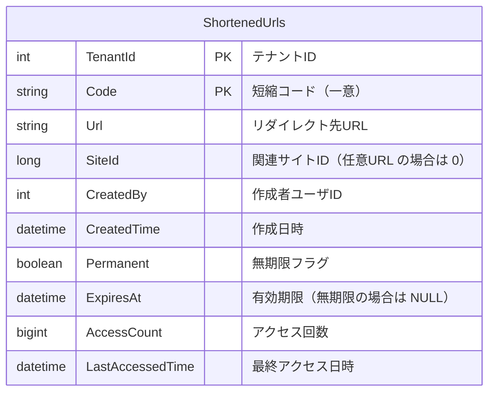
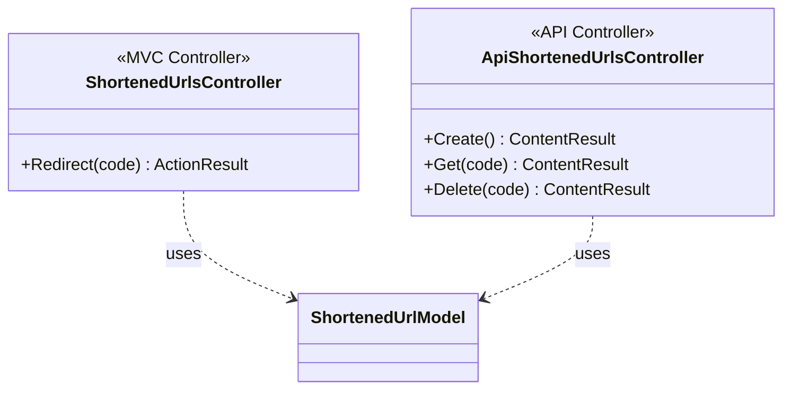
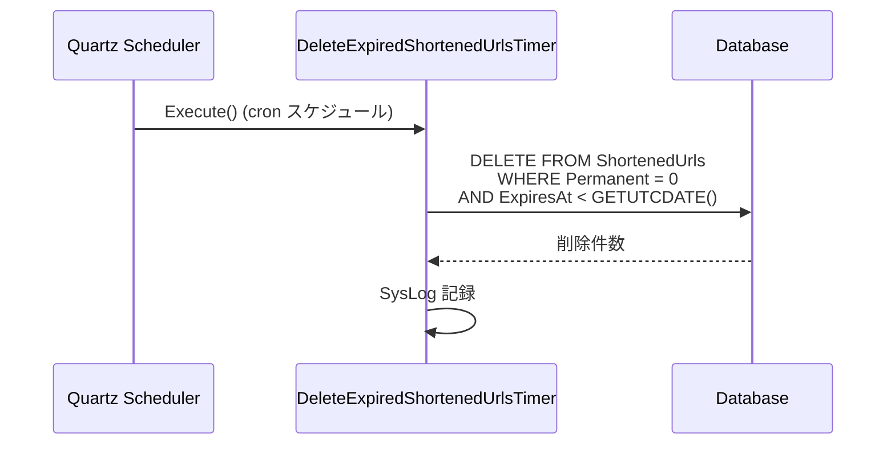
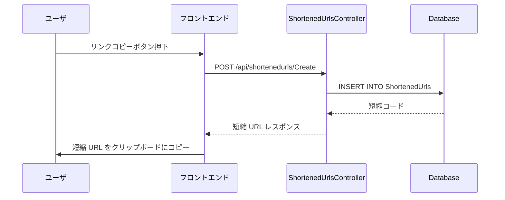
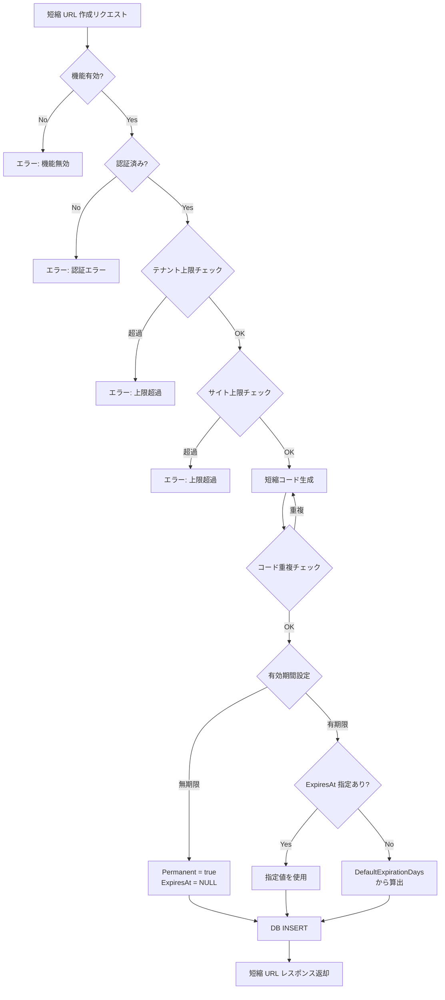
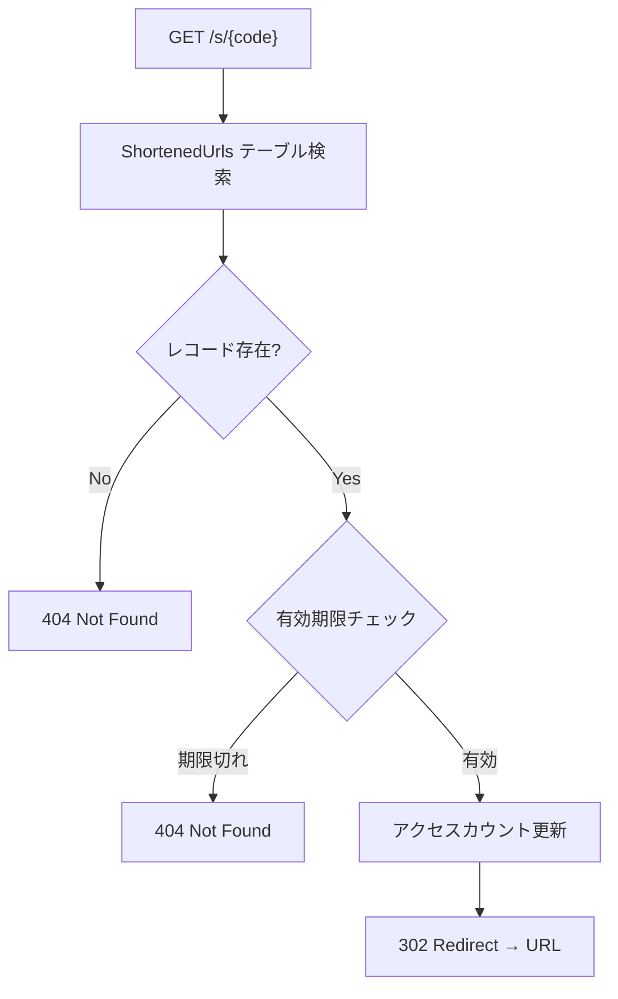

# 短縮 URL 機能設計

プリザンターに短縮 URL 機能を追加するための Controller・Action・DB・バックグラウンドタスクの設計を調査する。
サイトリンク取得時の短縮 URL 発行に加え、サーバースクリプトや API 経由で任意の URL に対しても短縮 URL を発行可能にする。

<!-- START doctoc generated TOC please keep comment here to allow auto update -->
<!-- DON'T EDIT THIS SECTION, INSTEAD RE-RUN doctoc TO UPDATE -->

- [調査情報](#調査情報)
- [調査目的](#調査目的)
- [既存アーキテクチャの確認](#既存アーキテクチャの確認)
    - [Controller 構成](#controller-構成)
    - [ルーティング構成](#ルーティング構成)
    - [バックグラウンドサービス構成](#バックグラウンドサービス構成)
    - [パラメータ構成](#パラメータ構成)
- [URL 設計](#url-設計)
    - [短縮 URL の形式](#短縮-url-の形式)
    - [短縮コードの生成アルゴリズム](#短縮コードの生成アルゴリズム)
    - [代替案: プレフィックスの検討](#代替案-プレフィックスの検討)
- [DB 設計](#db-設計)
    - [ShortenedUrls テーブル](#shortenedurls-テーブル)
    - [インデックス設計](#インデックス設計)
    - [CodeDefiner 対応](#codedefiner-対応)
- [Controller・Action 設計](#controlleraction-設計)
    - [全体構成](#全体構成)
    - [MVC Controller（リダイレクト用）](#mvc-controllerリダイレクト用)
    - [API Controller（管理用）](#api-controller管理用)
    - [ルーティング設定](#ルーティング設定)
- [API リクエスト・レスポンス設計](#api-リクエストレスポンス設計)
    - [短縮 URL 作成 API](#短縮-url-作成-api)
    - [短縮 URL 取得 API](#短縮-url-取得-api)
    - [短縮 URL 削除 API](#短縮-url-削除-api)
- [パラメータ設計](#パラメータ設計)
    - [ShortenedUrl パラメータクラス](#shortenedurl-パラメータクラス)
    - [BackgroundService パラメータへの追加](#backgroundservice-パラメータへの追加)
    - [パラメータ JSON ファイル](#パラメータ-json-ファイル)
- [バックグラウンドタスク設計](#バックグラウンドタスク設計)
    - [DeleteExpiredShortenedUrlsTimer](#deleteexpiredshortenedurlstimer)
    - [TimerBackground への登録](#timerbackground-への登録)
    - [クリーニング処理フロー](#クリーニング処理フロー)
- [サーバースクリプト対応](#サーバースクリプト対応)
    - [ServerScript API 設計](#serverscript-api-設計)
    - [ホストオブジェクトの実装](#ホストオブジェクトの実装)
- [サイトリンク取得時の UI 統合](#サイトリンク取得時の-ui-統合)
    - [リンク取得ダイアログへの統合](#リンク取得ダイアログへの統合)
    - [UI 実装方針](#ui-実装方針)
- [全体処理フロー](#全体処理フロー)
    - [短縮 URL 作成フロー](#短縮-url-作成フロー)
    - [短縮 URL アクセスフロー](#短縮-url-アクセスフロー)
- [セキュリティ考慮事項](#セキュリティ考慮事項)
    - [オープンリダイレクト対策](#オープンリダイレクト対策)
- [実装上の注意点](#実装上の注意点)
- [結論](#結論)
- [関連ソースコード](#関連ソースコード)
- [関連ドキュメント](#関連ドキュメント)

<!-- END doctoc generated TOC please keep comment here to allow auto update -->

## 調査情報

| 調査日       | リポジトリ | ブランチ | タグ/バージョン    | コミット    | 備考     |
| ------------ | ---------- | -------- | ------------------ | ----------- | -------- |
| 2026年3月2日 | Pleasanter | main     | Pleasanter_1.5.1.0 | `34f162a43` | 初回調査 |

## 調査目的

プリザンターにおいて短縮 URL 機能を実現するために、最適な構成を設計する。
要件は以下の通り。

| 要件                       | 内容                                                               |
| -------------------------- | ------------------------------------------------------------------ |
| Controller/Action 新規追加 | 短縮 URL のリダイレクトおよび管理用に新規 Controller を追加する    |
| サイトリンク連携           | サイトのリンク取得時に短縮 URL を生成・取得できるようにする        |
| 任意 URL 対応              | サーバースクリプトや API 経由で任意の URL に対しても発行可能にする |
| 有効期間                   | 無期限・有期限を選択可能にする                                     |
| デフォルト有効期間         | 有期限の場合のデフォルト期間をパラメータで保持する                 |
| 期限切れクリーニング       | 期限切れ URL のクリーニングをバックグラウンドタスクで実行する      |

---

## 既存アーキテクチャの確認

短縮 URL 機能の設計にあたり、プリザンターの既存アーキテクチャを確認する。

### Controller 構成

プリザンターの Controller は以下の 2 種類に分類される。

| 種類           | ディレクトリ       | ルート                  | 属性                                            |
| -------------- | ------------------ | ----------------------- | ----------------------------------------------- |
| MVC Controller | `Controllers/`     | `{controller}/{action}` | `[Authorize]`                                   |
| API Controller | `Controllers/Api/` | `api/[controller]`      | `[CheckApiContextAttributes]` `[ApiController]` |

**ファイル**: `Implem.Pleasanter/Controllers/Api/ItemsController.cs`

```csharp
[CheckApiContextAttributes]
[AllowAnonymous]
[ApiController]
[Route("api/[controller]")]
public class ItemsController : ControllerBase
{
    [HttpPost("{id}/Create")]
    public ContentResult Create(long id) { /* ... */ }
}
```

### ルーティング構成

**ファイル**: `Implem.Pleasanter/Startup.cs`（行番号: 461-546）

```csharp
endpoints.MapControllerRoute(
    name: "Default",
    pattern: "{controller}/{action}",
    defaults: new { Controller = "Items", Action = "Index" });
endpoints.MapControllerRoute(
    name: "Item",
    pattern: "{controller}/{id}/{action}",
    defaults: new { Controller = "Items", Action = "Edit" });
```

### バックグラウンドサービス構成

Quartz スケジューラを使用し、`IJob` インターフェースを実装したタイマークラスで構成される。

**ファイル**: `Implem.Pleasanter/Libraries/BackgroundServices/ExecutionTimerBase.cs`

```csharp
abstract public class ExecutionTimerBase : IJob
{
    virtual public async Task Execute(IJobExecutionContext context)
    {
        await Task.CompletedTask;
    }
}
```

既存のバックグラウンドタイマー一覧:

| タイマー                    | 用途                 | 設定パラメータ                                      |
| --------------------------- | -------------------- | --------------------------------------------------- |
| `ReminderBackgroundTimer`   | リマインダー処理     | `Reminder`                                          |
| `SyncByLdapExecutionTimer`  | LDAP 同期            | `SyncByLdap` / `SyncByLdapTime`                     |
| `DeleteSysLogsTimer`        | システムログ削除     | `DeleteSysLogs` / `DeleteSysLogsTime`               |
| `DeleteTemporaryFilesTimer` | 一時ファイル削除     | `DeleteTemporaryFiles` / `DeleteTemporaryFilesTime` |
| `DeleteTrashBoxTimer`       | ゴミ箱データ物理削除 | `DeleteTrashBox` / `DeleteTrashBoxTime`             |
| `DeleteUnusedRecordTimer`   | 未使用レコード削除   | `DeleteUnusedRecord` / `DeleteUnusedRecordTime`     |

### パラメータ構成

**ファイル**: `Implem.ParameterAccessor/Parts/BackgroundService.cs`

```csharp
public class BackgroundService
{
    public bool DeleteTrashBox;
    public List<string> DeleteTrashBoxTime;
    public int DeleteTrashBoxRetentionPeriod;

    public bool TimerEnabled(string deploymentEnvironment)
    {
        return ServiceEnabled(deploymentEnvironment)
            && (SyncByLdap || DeleteSysLogs || DeleteTemporaryFiles
                || DeleteTrashBox || Reminder || DeleteUnusedRecord);
    }
}
```

---

## URL 設計

### 短縮 URL の形式

短縮 URL は以下の形式とする。

```text
https://{host}/s/{code}
```

| 要素     | 説明                                    |
| -------- | --------------------------------------- |
| `/s/`    | 短縮 URL のプレフィックス（short の略） |
| `{code}` | 一意の短縮コード（英数字、8 文字程度）  |

### 短縮コードの生成アルゴリズム

短縮コードの生成方式を比較する。

| 方式                            | 長さ   | 衝突耐性     | 推測耐性 | 採用 |
| ------------------------------- | ------ | ------------ | -------- | ---- |
| 暗号論的乱数（Base62）          | 8 文字 | 高（再試行） | 高       | 推奨 |
| ハッシュ（SHA-256 先頭 N 文字） | 8 文字 | 中           | 低       | -    |
| 連番（Base62 エンコード）       | 可変   | なし         | 低       | -    |
| UUID v4（先頭 8 文字）          | 8 文字 | 高           | 高       | -    |

推奨は**暗号論的乱数の Base62 エンコード**とする。理由は以下の通り。

- 推測困難で URL が漏洩しにくい
- 衝突時は再生成で対応可能
- 8 文字の Base62 で約 218 兆通り（62^8 = 218,340,105,584,896）の組合せがあり、実用上十分

```csharp
// 生成例
private static string GenerateCode(int length = 8)
{
    const string chars = "0123456789ABCDEFGHIJKLMNOPQRSTUVWXYZabcdefghijklmnopqrstuvwxyz";
    var bytes = RandomNumberGenerator.GetBytes(length);
    return new string(bytes.Select(b => chars[b % chars.Length]).ToArray());
}
```

### 代替案: プレフィックスの検討

| プレフィックス | メリット     | デメリット                       |
| -------------- | ------------ | -------------------------------- |
| `/s/`          | 短い、直感的 | 既存ルートとの衝突リスク（低い） |
| `/go/`         | 用途が明確   | やや長い                         |
| `/r/`          | 短い         | reddit 等を連想する              |
| `/u/`          | 短い         | user を連想する                  |

既存のルーティングパターン（`{controller}/{action}` や `{controller}/{id}/{action}`）と衝突しないことを確認した上で `/s/` を採用する。
`ShortenedUrls` という Controller 名で `s` をプレフィックスとするルーティングを定義する。

---

## DB 設計

### ShortenedUrls テーブル

短縮 URL の情報を格納する専用テーブルを新設する。



| カラム             | 型               | NULL 許可 | 説明                                          |
| ------------------ | ---------------- | --------- | --------------------------------------------- |
| `TenantId`         | `int`            | No        | テナント ID                                   |
| `Code`             | `nvarchar(16)`   | No        | 短縮コード（PK、一意インデックス）            |
| `Url`              | `nvarchar(2048)` | No        | リダイレクト先 URL                            |
| `SiteId`           | `bigint`         | Yes       | 関連サイト ID（サイトリンクの場合に設定）     |
| `CreatedBy`        | `int`            | No        | 作成者ユーザ ID                               |
| `CreatedTime`      | `datetime`       | No        | 作成日時                                      |
| `Permanent`        | `bit`            | No        | 無期限フラグ（true: 無期限）                  |
| `ExpiresAt`        | `datetime`       | Yes       | 有効期限（`Permanent` が true の場合は NULL） |
| `AccessCount`      | `bigint`         | No        | アクセス回数（デフォルト: 0）                 |
| `LastAccessedTime` | `datetime`       | Yes       | 最終アクセス日時                              |

### インデックス設計

| インデックス名             | カラム               | 種類      | 用途                           |
| -------------------------- | -------------------- | --------- | ------------------------------ |
| `PK_ShortenedUrls`         | `TenantId`, `Code`   | Primary   | 主キー                         |
| `IX_ShortenedUrls_Code`    | `Code`               | Unique    | 短縮コードによる高速検索       |
| `IX_ShortenedUrls_Expires` | `ExpiresAt`          | NonUnique | 期限切れレコードのクリーニング |
| `IX_ShortenedUrls_SiteId`  | `TenantId`, `SiteId` | NonUnique | サイト別の短縮 URL 一覧取得    |

### CodeDefiner 対応

テーブル定義は CodeDefiner の定義ファイルに追加する。

**ファイル**: `Implem.Pleasanter/App_Data/Definitions/` 配下に定義 JSON を追加

```json
{
    "Id": "ShortenedUrls",
    "Body": "ShortenedUrls テーブル",
    "TableName": "ShortenedUrls"
}
```

既存の CodeDefiner パターンに準拠し、`Rds.ShortenedUrlsWhere()` や `Rds.ShortenedUrlsParam()` 等のヘルパーメソッドも自動生成する。

---

## Controller・Action 設計

### 全体構成

短縮 URL 機能に必要な Controller は以下の 2 つ。



### MVC Controller（リダイレクト用）

短縮 URL にアクセスした際のリダイレクトを処理する Controller。

**ファイル**: `Implem.Pleasanter/Controllers/ShortenedUrlsController.cs`

```csharp
[AllowAnonymous]
public class ShortenedUrlsController : Controller
{
    [HttpGet]
    public ActionResult Redirect(string code)
    {
        var context = new Context();
        var log = new SysLogModel(context: context);
        var model = new ShortenedUrlModel().Get(
            context: context,
            where: Rds.ShortenedUrlsWhere().Code(code));
        if (model.AccessStatus == Databases.AccessStatuses.Selected
            && !model.IsExpired())
        {
            model.IncrementAccessCount(context: context);
            log.Finish(context: context);
            return Redirect(model.Url);
        }
        log.Finish(context: context);
        return NotFound();
    }
}
```

### API Controller（管理用）

短縮 URL の作成・取得・削除を行う API Controller。

**ファイル**: `Implem.Pleasanter/Controllers/Api/ShortenedUrlsController.cs`

```csharp
[CheckApiContextAttributes]
[AllowAnonymous]
[ApiController]
[Route("api/[controller]")]
public class ShortenedUrlsController : ControllerBase
{
    [HttpPost("Create")]
    public ContentResult Create()
    {
        var body = default(string);
        using (var reader = new StreamReader(Request.Body))
            body = reader.ReadToEnd();
        var context = new Context(
            sessionStatus: User?.Identity?.IsAuthenticated == true,
            sessionData: User?.Identity?.IsAuthenticated == true,
            apiRequestBody: body,
            contentType: Request.ContentType,
            api: true);
        var log = new SysLogModel(context: context);
        var result = context.Authenticated
            ? ShortenedUrlUtilities.CreateByApi(context: context)
            : ApiResults.Unauthorized(context: context);
        log.Finish(context: context, responseSize: result.Content.Length);
        return result.ToHttpResponse(request: Request);
    }

    [HttpPost("{code}/Get")]
    public ContentResult Get(string code) { /* ... */ }

    [HttpPost("{code}/Delete")]
    public ContentResult Delete(string code) { /* ... */ }
}
```

### ルーティング設定

**ファイル**: `Implem.Pleasanter/Startup.cs`

```csharp
// 短縮URL リダイレクト用ルート（既存ルートより前に定義）
endpoints.MapControllerRoute(
    name: "ShortenedUrls",
    pattern: "s/{code}",
    defaults: new { Controller = "ShortenedUrls", Action = "Redirect" },
    constraints: new
    {
        code = "[A-Za-z0-9]{1,16}"
    });
```

既存のルート定義との優先順位を考慮し、Default ルートより**前**に配置する。
`/s/{code}` は 1 セグメント + 英数字制約があるため、既存ルートと衝突しない。

---

## API リクエスト・レスポンス設計

### 短縮 URL 作成 API

**エンドポイント**: `POST /api/shortenedurls/Create`

リクエストボディ:

```json
{
    "ApiVersion": 1.1,
    "ApiKey": "xxx",
    "Url": "https://example.com/items/12345",
    "SiteId": 12345,
    "Permanent": false,
    "ExpiresAt": "2026-06-01T00:00:00"
}
```

| フィールド  | 型         | 必須 | 説明                                                 |
| ----------- | ---------- | ---- | ---------------------------------------------------- |
| `Url`       | `string`   | Yes  | リダイレクト先 URL                                   |
| `SiteId`    | `long`     | No   | 関連サイト ID（サイトリンクの場合）                  |
| `Permanent` | `bool`     | No   | 無期限フラグ（デフォルト: false）                    |
| `ExpiresAt` | `datetime` | No   | 有効期限（未指定時はパラメータのデフォルト値を使用） |

レスポンスボディ:

```json
{
    "StatusCode": 200,
    "Response": {
        "Code": "aB3xK9mQ",
        "Url": "https://example.com/items/12345",
        "ShortUrl": "https://pleasanter.example.com/s/aB3xK9mQ",
        "Permanent": false,
        "ExpiresAt": "2026-06-01T00:00:00",
        "CreatedTime": "2026-03-02T12:00:00"
    }
}
```

### 短縮 URL 取得 API

**エンドポイント**: `POST /api/shortenedurls/{code}/Get`

レスポンスボディ:

```json
{
    "StatusCode": 200,
    "Response": {
        "Code": "aB3xK9mQ",
        "Url": "https://example.com/items/12345",
        "ShortUrl": "https://pleasanter.example.com/s/aB3xK9mQ",
        "SiteId": 12345,
        "Permanent": false,
        "ExpiresAt": "2026-06-01T00:00:00",
        "AccessCount": 42,
        "LastAccessedTime": "2026-03-02T15:30:00",
        "CreatedTime": "2026-03-02T12:00:00"
    }
}
```

### 短縮 URL 削除 API

**エンドポイント**: `POST /api/shortenedurls/{code}/Delete`

レスポンスボディ:

```json
{
    "StatusCode": 200,
    "Message": "Deleted."
}
```

---

## パラメータ設計

### ShortenedUrl パラメータクラス

**ファイル**: `Implem.ParameterAccessor/Parts/ShortenedUrl.cs`

```csharp
public class ShortenedUrl
{
    public bool Enabled;
    public int DefaultExpirationDays;
    public int CodeLength;
    public int MaxUrlLength;
    public int MaxPerSite;
    public int MaxPerTenant;
}
```

| パラメータ              | 型     | デフォルト値 | 説明                              |
| ----------------------- | ------ | ------------ | --------------------------------- |
| `Enabled`               | `bool` | `true`       | 短縮 URL 機能の有効/無効          |
| `DefaultExpirationDays` | `int`  | `365`        | 有期限のデフォルト有効日数        |
| `CodeLength`            | `int`  | `8`          | 短縮コードの長さ                  |
| `MaxUrlLength`          | `int`  | `2048`       | 登録可能な URL の最大長           |
| `MaxPerSite`            | `int`  | `1000`       | 1 サイトあたりの短縮 URL 上限数   |
| `MaxPerTenant`          | `int`  | `100000`     | 1 テナントあたりの短縮 URL 上限数 |

### BackgroundService パラメータへの追加

**ファイル**: `Implem.ParameterAccessor/Parts/BackgroundService.cs`

```csharp
public class BackgroundService
{
    // 既存プロパティ ...
    public bool DeleteExpiredShortenedUrls;
    public List<string> DeleteExpiredShortenedUrlsTime;
}
```

| パラメータ                       | 型             | デフォルト値      | 説明                             |
| -------------------------------- | -------------- | ----------------- | -------------------------------- |
| `DeleteExpiredShortenedUrls`     | `bool`         | `true`            | 期限切れ短縮 URL 削除の有効/無効 |
| `DeleteExpiredShortenedUrlsTime` | `List<string>` | `["0 0 3 * * ?"]` | 実行スケジュール（cron 式）      |

### パラメータ JSON ファイル

**ファイル**: `Implem.Pleasanter/App_Data/Parameters/ShortenedUrl.json`

```json
{
    "Enabled": true,
    "DefaultExpirationDays": 365,
    "CodeLength": 8,
    "MaxUrlLength": 2048,
    "MaxPerSite": 1000,
    "MaxPerTenant": 100000
}
```

---

## バックグラウンドタスク設計

### DeleteExpiredShortenedUrlsTimer

期限切れの短縮 URL を定期的に物理削除するバックグラウンドタスク。
既存の `DeleteTrashBoxTimer` と同様のパターンで実装する。

**ファイル**: `Implem.Pleasanter/Libraries/BackgroundServices/DeleteExpiredShortenedUrlsTimer.cs`

```csharp
[DisallowConcurrentExecution]
public class DeleteExpiredShortenedUrlsTimer : ExecutionTimerBase
{
    public override async Task Execute(IJobExecutionContext jobContext)
    {
        var context = CreateContext();
        var log = CreateSysLogModel(context, "DeleteExpiredShortenedUrls");
        try
        {
            Rds.ExecuteNonQuery(
                context: context,
                statements: Rds.PhysicalDeleteShortenedUrls(
                    where: Rds.ShortenedUrlsWhere()
                        .Permanent(false)
                        .ExpiresAt(_operator: "<", value: DateTime.UtcNow)));
        }
        catch (Exception e)
        {
            new SysLogModel(context, e);
        }
        log.Finish(context);
        await Task.CompletedTask;
    }
}
```

### TimerBackground への登録

**ファイル**: `Implem.Pleasanter/Libraries/BackgroundServices/TimerBackground.cs`

```csharp
// 既存のタイマー登録に追加
if (Parameters.BackgroundService.DeleteExpiredShortenedUrls)
{
    await ScheduleJob<DeleteExpiredShortenedUrlsTimer>(
        Parameters.BackgroundService.DeleteExpiredShortenedUrlsTime);
}
```

### クリーニング処理フロー



---

## サーバースクリプト対応

### ServerScript API 設計

サーバースクリプトから短縮 URL を操作するための API を提供する。

```javascript
// 短縮URL の作成（サイトリンク）
var result = shortenedUrls.Create({
    url: context.Url + '/items/' + model.SiteId,
    siteId: model.SiteId,
    permanent: false,
    expiresAt: '2026-12-31',
});
// result.Code => "aB3xK9mQ"
// result.ShortUrl => "https://pleasanter.example.com/s/aB3xK9mQ"

// 短縮URL の作成（任意 URL）
var result = shortenedUrls.Create({
    url: 'https://external.example.com/document/123',
    permanent: true,
});

// 短縮URL の取得
var info = shortenedUrls.Get('aB3xK9mQ');

// 短縮URL の削除
shortenedUrls.Delete('aB3xK9mQ');
```

### ホストオブジェクトの実装

**ファイル**: `Implem.Pleasanter/Libraries/ServerScripts/ServerScriptModelShortenedUrls.cs`

```csharp
public class ServerScriptModelShortenedUrls
{
    private readonly Context context;

    public ServerScriptModelShortenedUrls(Context context)
    {
        this.context = context;
    }

    public object Create(object param) { /* ... */ }
    public object Get(string code) { /* ... */ }
    public bool Delete(string code) { /* ... */ }
}
```

ClearScript V8 のホストオブジェクトとして `shortenedUrls` 名で公開する。

---

## サイトリンク取得時の UI 統合

### リンク取得ダイアログへの統合

サイトの編集画面からリンクを取得する際に、通常 URL と短縮 URL の両方を表示する。



### UI 実装方針

| 方式                     | 説明                                                | 採用 |
| ------------------------ | --------------------------------------------------- | ---- |
| リンクコピーメニュー拡張 | 既存のリンクコピー機能に「短縮 URL をコピー」を追加 | 推奨 |
| コマンドメニュー追加     | レコードのコマンドメニューに短縮 URL 生成を追加     | 任意 |
| サイト設定タブ追加       | サイト設定に短縮 URL 管理タブを追加                 | 任意 |

フロントエンドの実装は第 2 世代テーマ（Svelte + Vite）を考慮し、`$p` ファンクションの拡張または新規 Web Component で実装する。

---

## 全体処理フロー

### 短縮 URL 作成フロー



### 短縮 URL アクセスフロー



---

## セキュリティ考慮事項

| 観点                 | 対策                                                                     |
| -------------------- | ------------------------------------------------------------------------ |
| オープンリダイレクト | 登録先 URL のスキーム検証（http/https のみ許可）                         |
| 推測攻撃             | 暗号論的乱数による短縮コード生成                                         |
| 列挙攻撃             | レートリミッター適用、短縮コードの十分な長さ（8 文字以上）               |
| テナント分離         | テナント ID による論理分離                                               |
| 認証                 | 作成・削除は認証必須、リダイレクトは匿名アクセス可能                     |
| URL 検証             | 最大長制限、不正文字チェック、プライベート IP レンジへのリダイレクト防止 |

### オープンリダイレクト対策

```csharp
private static bool IsValidUrl(string url)
{
    if (!Uri.TryCreate(url, UriKind.Absolute, out var uri))
        return false;
    if (uri.Scheme != "http" && uri.Scheme != "https")
        return false;
    // プライベート IP レンジへのリダイレクト防止
    if (IPAddress.TryParse(uri.Host, out var ip))
    {
        if (IPAddress.IsLoopback(ip)) return false;
        // RFC 1918 プライベートレンジチェック
    }
    return true;
}
```

---

## 実装上の注意点

| 項目                     | 内容                                                                                    |
| ------------------------ | --------------------------------------------------------------------------------------- |
| CodeDefiner 対応         | テーブル定義は CodeDefiner の JSON 定義ファイルに追加し、自動生成されるコードを活用する |
| マルチ RDBMS 対応        | SQL Server / PostgreSQL / MySQL の全てで動作するよう、Rds 抽象レイヤーを使用する        |
| 拡張サーバスクリプト制御 | Controller 名 `shortenedurls`（小文字）で制御可能にする                                 |
| SysLog 記録              | 作成・削除・リダイレクトの全操作を SysLog に記録する                                    |
| テナントコンテキスト     | リダイレクト時はテナント ID を Code から逆引きするため、テナント認証は不要              |
| キャッシュ               | 高頻度アクセスが想定される短縮 URL はインメモリキャッシュの検討が必要                   |
| クラスタ環境             | `ClusterExecutionTimerBase` を使用し、多重実行を防止する                                |

---

## 結論

| 項目                   | 設計方針                                                                    |
| ---------------------- | --------------------------------------------------------------------------- |
| Controller 構成        | MVC（リダイレクト用）と API（管理用）の 2 つを新規追加                      |
| ルーティング           | `/s/{code}` でリダイレクトアクセス、`/api/shortenedurls/` で管理 API        |
| DB テーブル            | `ShortenedUrls` テーブルを新設し、CodeDefiner で管理する                    |
| 短縮コード生成         | 暗号論的乱数の Base62 エンコード（8 文字）                                  |
| 有効期間               | 無期限 / 有期限を選択可能、デフォルト有効日数はパラメータで管理             |
| バックグラウンドタスク | Quartz タイマーで期限切れ URL を定期削除                                    |
| パラメータ             | `ShortenedUrl` パラメータクラスを新設、BackgroundService にタイマー設定追加 |
| サーバースクリプト     | `shortenedUrls` ホストオブジェクトで Create/Get/Delete を提供               |
| API                    | 既存 API パターンに準拠した POST ベースの RESTful API                       |
| セキュリティ           | オープンリダイレクト対策、推測攻撃防止、テナント分離                        |

## 関連ソースコード

| ファイル                                                                | 内容                                 |
| ----------------------------------------------------------------------- | ------------------------------------ |
| `Implem.Pleasanter/Controllers/ItemsController.cs`                      | MVC Controller のパターン参考        |
| `Implem.Pleasanter/Controllers/Api/ItemsController.cs`                  | API Controller のパターン参考        |
| `Implem.Pleasanter/Startup.cs`                                          | ルーティング設定                     |
| `Implem.Pleasanter/Libraries/BackgroundServices/DeleteTrashBoxTimer.cs` | バックグラウンドタスクのパターン参考 |
| `Implem.Pleasanter/Libraries/BackgroundServices/TimerBackground.cs`     | タイマー登録処理                     |
| `Implem.ParameterAccessor/Parts/BackgroundService.cs`                   | バックグラウンドサービスパラメータ   |
| `Implem.Pleasanter/Libraries/ServerScripts/`                            | サーバースクリプト実装パターン       |

## 関連ドキュメント

| ドキュメント                                                                               | 関連内容                                      |
| ------------------------------------------------------------------------------------------ | --------------------------------------------- |
| [iCal インターフェース設計](001-iCalインターフェース設計.md)                               | GUID ベース URL 設計・Controller 追加パターン |
| [RSS・Atom フィード設計](003-RSS・Atomフィード設計.md)                                     | Controller・ルーティング設計の前例            |
| [API ラッパー実装状況](../03-データ操作・API/006-APIラッパー実装状況.md)                   | API / サーバースクリプトの対応状況            |
| [リクエストレートリミッター実装](../14-セキュリティ/003-リクエストレートリミッター実装.md) | API レートリミッター                          |
