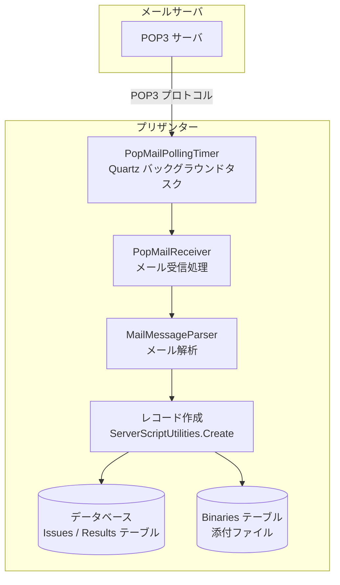
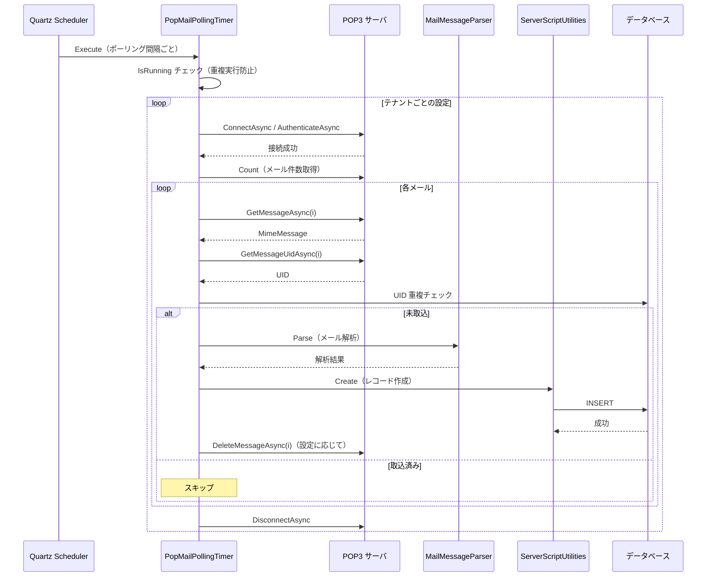
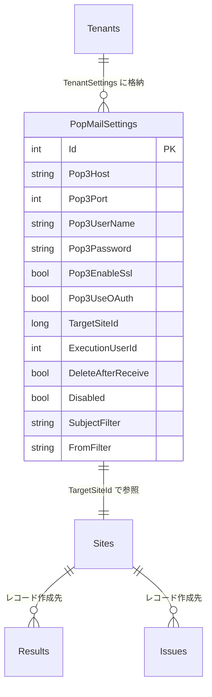
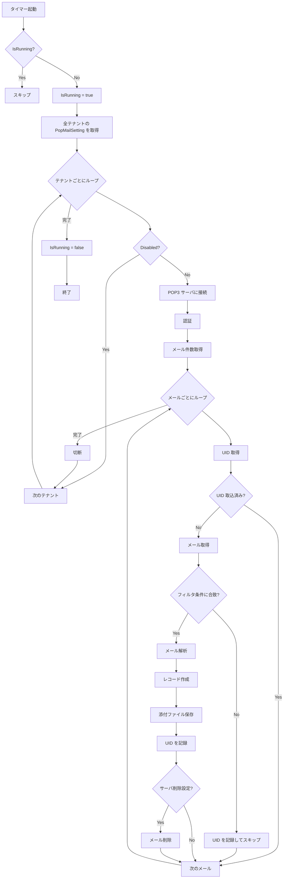
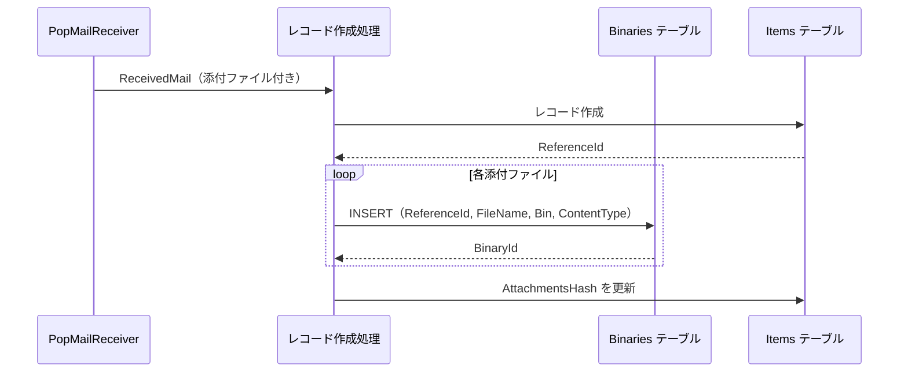
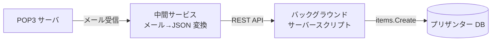

# POP 受信メール取込設計

プリザンターに POP3 メール受信機能を追加し、問い合わせメール等を自動的にレコードとして取り込むための実装方針を調査する。

<!-- START doctoc generated TOC please keep comment here to allow auto update -->
<!-- DON'T EDIT THIS SECTION, INSTEAD RE-RUN doctoc TO UPDATE -->

- [調査情報](#調査情報)
- [調査目的](#調査目的)
- [既存メール基盤の現状](#既存メール基盤の現状)
    - [メール送信の実装状況](#メール送信の実装状況)
    - [メール関連の主要ファイル](#メール関連の主要ファイル)
    - [SMTP 送信の実装パターン](#smtp-送信の実装パターン)
- [MailKit の POP3 クライアント機能](#mailkit-の-pop3-クライアント機能)
    - [Pop3Client の基本操作](#pop3client-の基本操作)
    - [Pop3Client の主要 API](#pop3client-の主要-api)
    - [MimeMessage から取得可能な情報](#mimemessage-から取得可能な情報)
- [バックグラウンドタスク基盤](#バックグラウンドタスク基盤)
    - [既存のタイマー構成](#既存のタイマー構成)
    - [タイマー実装パターン](#タイマー実装パターン)
- [設計方針](#設計方針)
    - [全体アーキテクチャ](#全体アーキテクチャ)
    - [処理シーケンス](#処理シーケンス)
- [パラメータ設計](#パラメータ設計)
    - [Mail パラメータへの POP3 設定追加](#mail-パラメータへの-pop3-設定追加)
    - [Mail.json のパラメータ構成](#mailjson-のパラメータ構成)
    - [BackgroundService パラメータへの追加](#backgroundservice-パラメータへの追加)
- [テナント単位の POP3 設定](#テナント単位の-pop3-設定)
    - [設計方針の比較](#設計方針の比較)
    - [推奨: 方式 B（テナント設定格納）](#推奨-方式-bテナント設定格納)
    - [PopMailSetting クラス](#popmailsetting-クラス)
- [メール受信処理の実装](#メール受信処理の実装)
    - [PopMailReceiver クラス](#popmailreceiver-クラス)
    - [ReceivedMail データクラス](#receivedmail-データクラス)
- [重複取込防止](#重複取込防止)
    - [方式の比較](#方式の比較)
    - [推奨: UID テーブル管理](#推奨-uid-テーブル管理)
- [バックグラウンドタスクの実装](#バックグラウンドタスクの実装)
    - [PopMailPollingTimer クラス](#popmailpollingtimer-クラス)
    - [ポーリング処理の全体フロー](#ポーリング処理の全体フロー)
- [メールからレコードへのマッピング](#メールからレコードへのマッピング)
    - [標準マッピング](#標準マッピング)
    - [カラムマッピング設定](#カラムマッピング設定)
    - [レコード作成処理](#レコード作成処理)
- [添付ファイルの処理](#添付ファイルの処理)
    - [添付ファイルの保存方式](#添付ファイルの保存方式)
    - [添付ファイルサイズの制限](#添付ファイルサイズの制限)
- [フィルタ機能](#フィルタ機能)
    - [フィルタ設定](#フィルタ設定)
- [セキュリティ考慮事項](#セキュリティ考慮事項)
- [改修が必要なファイル・箇所](#改修が必要なファイル箇所)
- [代替案: バックグラウンドサーバースクリプトによる実装](#代替案-バックグラウンドサーバースクリプトによる実装)
    - [方式概要](#方式概要)
    - [サーバースクリプト実装例](#サーバースクリプト実装例)
    - [代替案の比較](#代替案の比較)
- [結論](#結論)
- [関連ソースコード](#関連ソースコード)

<!-- END doctoc generated TOC please keep comment here to allow auto update -->

## 調査情報

| 調査日       | リポジトリ | ブランチ | タグ/バージョン    | コミット   | 備考     |
| ------------ | ---------- | -------- | ------------------ | ---------- | -------- |
| 2026年3月3日 | Pleasanter | main     | Pleasanter_1.5.1.0 | `34f162a4` | 初回調査 |

## 調査目的

- POP3 プロトコルによるメール受信をプリザンターに追加する際の実装方針を明確にする
- 既存のメール送信基盤（MailKit）・バックグラウンドタスク基盤（Quartz）を活用した設計を検討する
- 問い合わせメール等を自動的にプリザンターのレコードとして取り込むための具体的な実装案を提示する

---

## 既存メール基盤の現状

### メール送信の実装状況

プリザンターは MailKit 4.14.1 を利用して SMTP メール送信を実装している。POP3/IMAP による受信機能は未実装である。

| 項目               | 現状                                          |
| ------------------ | --------------------------------------------- |
| メール送信         | MailKit の `SmtpClient` で実装済み            |
| メール受信         | 未実装                                        |
| 通知メール         | `Notification.Types.Mail` で送信可能          |
| 送信記録           | `OutgoingMails` テーブルに保存                |
| OAuth2 対応        | SMTP 送信で OAuth2 トークン認証をサポート済み |
| MailKit バージョン | 4.14.1（POP3/IMAP クライアント機能を含む）    |

### メール関連の主要ファイル

| ファイル                                               | 役割                             |
| ------------------------------------------------------ | -------------------------------- |
| `Implem.ParameterAccessor/Parts/Mail.cs`               | メールパラメータ定義             |
| `Implem.Pleasanter/Libraries/DataSources/Smtp.cs`      | MailKit ベースの SMTP 送信       |
| `Implem.Pleasanter/Libraries/Mails/Addresses.cs`       | メールアドレスの解析・検証       |
| `Implem.Pleasanter/Models/OutgoingMails/`              | 送信メールモデル・テーブル       |
| `Implem.Pleasanter/Libraries/Settings/Notification.cs` | 通知タイプ定義と送信ルーティング |

### SMTP 送信の実装パターン

**ファイル**: `Implem.Pleasanter/Libraries/DataSources/Smtp.cs`（行番号: 121-147）

```csharp
using (var smtpClient = new SmtpClient())
{
    if (Parameters.Mail.ServerCertificateValidationCallback)
    {
        smtpClient.ServerCertificateValidationCallback = (s, c, h, e) => true;
    }
    var options = Enum.TryParse<SecureSocketOptions>(
        Parameters.Mail.SecureSocketOptions, out var op)
        ? op
        : (Parameters.Mail.SmtpEnableSsl
            ? SecureSocketOptions.StartTls
            : SecureSocketOptions.None);
    await smtpClient.ConnectAsync(Host, Port, options);
    if (Parameters.Mail.UseOAuth)
    {
        var accessToken = await GetAccessTokenAsync();
        await smtpClient.AuthenticateAsync(
            new SaslMechanismOAuth2(Parameters.Mail.SmtpUserName, accessToken));
    }
    else if (!Parameters.Mail.SmtpUserName.IsNullOrEmpty()
        && !Parameters.Mail.SmtpPassword.IsNullOrEmpty())
    {
        await smtpClient.AuthenticateAsync(
            Parameters.Mail.SmtpUserName, Parameters.Mail.SmtpPassword);
    }
    await smtpClient.SendAsync(message);
    await smtpClient.DisconnectAsync(true);
}
```

この SMTP 送信パターンと同様の接続・認証フローを POP3 受信にも適用できる。

---

## MailKit の POP3 クライアント機能

MailKit 4.14.1 は `MailKit.Net.Pop3.Pop3Client` を提供しており、追加パッケージなしで POP3 受信を実装できる。

### Pop3Client の基本操作

```csharp
using MailKit.Net.Pop3;
using MailKit.Security;
using MimeKit;

using (var pop3Client = new Pop3Client())
{
    // 接続
    await pop3Client.ConnectAsync(host, port, SecureSocketOptions.SslOnConnect);

    // 認証（基本認証）
    await pop3Client.AuthenticateAsync(username, password);

    // OAuth2 認証（既存の OAuth 基盤を流用可能）
    // await pop3Client.AuthenticateAsync(
    //     new SaslMechanismOAuth2(username, accessToken));

    // メール件数取得
    int count = pop3Client.Count;

    // メール取得（MimeMessage として取得）
    for (int i = 0; i < count; i++)
    {
        MimeMessage message = await pop3Client.GetMessageAsync(i);
        // message.From, message.Subject, message.TextBody 等を利用
    }

    // 取得済みメールの削除（POP3 の標準動作）
    await pop3Client.DeleteMessageAsync(0);

    // 切断
    await pop3Client.DisconnectAsync(quit: true);
}
```

### Pop3Client の主要 API

| メソッド/プロパティ      | 説明                                            |
| ------------------------ | ----------------------------------------------- |
| `ConnectAsync`           | POP3 サーバに接続                               |
| `AuthenticateAsync`      | ユーザ認証（基本認証・OAuth2）                  |
| `Count`                  | サーバ上のメール件数                            |
| `GetMessageAsync(index)` | 指定インデックスのメールを `MimeMessage` で取得 |
| `GetMessageUidAsync`     | メールの一意識別子（UID）を取得                 |
| `DeleteMessageAsync`     | 取得済みメールをサーバから削除                  |
| `DisconnectAsync`        | 接続切断（`quit: true` で削除を確定）           |

### MimeMessage から取得可能な情報

| プロパティ    | 型                        | 説明                 |
| ------------- | ------------------------- | -------------------- |
| `From`        | `InternetAddressList`     | 差出人               |
| `To`          | `InternetAddressList`     | 宛先                 |
| `Cc`          | `InternetAddressList`     | CC                   |
| `Subject`     | `string`                  | 件名                 |
| `Date`        | `DateTimeOffset`          | 送信日時             |
| `MessageId`   | `string`                  | Message-ID ヘッダ    |
| `TextBody`    | `string`                  | プレーンテキスト本文 |
| `HtmlBody`    | `string`                  | HTML 本文            |
| `Attachments` | `IEnumerable<MimeEntity>` | 添付ファイル         |
| `Headers`     | `HeaderList`              | 全ヘッダ             |

---

## バックグラウンドタスク基盤

POP3 受信はポーリング方式で定期的にメールサーバに接続する必要がある。プリザンターは Quartz.NET ベースのバックグラウンドタスク基盤を備えており、これを活用できる。

### 既存のタイマー構成

| クラス                      | 基底クラス                  | 用途               | 間隔          |
| --------------------------- | --------------------------- | ------------------ | ------------- |
| `ReminderBackgroundTimer`   | `ClusterExecutionTimerBase` | リマインダー通知   | 60秒          |
| `BackgroundServerScriptJob` | `ClusterExecutionTimerBase` | サーバースクリプト | Cron 式で指定 |
| `SyncByLdapExecutionTimer`  | `ClusterExecutionTimerBase` | LDAP 同期          | 時刻指定      |
| `DeleteSysLogsTimer`        | `ClusterExecutionTimerBase` | SysLog 削除        | 時刻指定      |

### タイマー実装パターン

**ファイル**: `Implem.Pleasanter/Libraries/BackgroundServices/ReminderBackgroundTimer.cs`

```csharp
class ReminderBackgroundTimer : ClusterExecutionTimerBase
{
    static private bool IsRunning = false;

    public class Param : IExecutionTimerBaseParam
    {
        public static readonly JobKey jobKey =
            new JobKey("ReminderBackgroundTimer", "ExecutionTimerBase");
        public Type JobType => typeof(ReminderBackgroundTimer);
        public bool Enabled => Parameters.BackgroundService.Reminder;
        public JobKey JobKey => jobKey;
        // ...
        public async Task<bool> SetCustomTimer(IScheduler scheduler)
        {
            var trigger = TriggerBuilder.Create()
                .ForJob(JobKey)
                .WithSimpleSchedule(x => x
                    .WithIntervalInSeconds(60)
                    .RepeatForever())
                .Build();
            await scheduler.ScheduleJob(trigger);
            return true;
        }
    }

    public override async Task Execute(IJobExecutionContext context)
    {
        if (IsRunning) return;
        await Task.Run(() =>
        {
            if (IsRunning) return;
            var context = CreateContext();
            try
            {
                IsRunning = true;
                ReminderScheduleUtilities.Remind(context: context);
            }
            finally
            {
                IsRunning = false;
            }
        }, context.CancellationToken);
    }
}
```

このパターンを踏襲して POP3 ポーリングタイマーを実装する。

---

## 設計方針

### 全体アーキテクチャ



### 処理シーケンス



---

## パラメータ設計

### Mail パラメータへの POP3 設定追加

**ファイル**: `Implem.ParameterAccessor/Parts/Mail.cs` への追加項目

```csharp
// POP3 受信設定
public string Pop3Host { get; set; }
public int Pop3Port { get; set; } = 995;
public string Pop3UserName { get; set; }
public string Pop3Password { get; set; }
public bool Pop3EnableSsl { get; set; } = true;
public string Pop3SecureSocketOptions { get; set; }
public bool Pop3UseOAuth { get; set; } = false;
public bool Pop3DeleteAfterReceive { get; set; } = false;
public int Pop3MaxMessagesPerPoll { get; set; } = 50;
```

### Mail.json のパラメータ構成

```json
{
    "SmtpHost": null,
    "SmtpPort": 25,
    "Pop3Host": null,
    "Pop3Port": 995,
    "Pop3UserName": null,
    "Pop3Password": null,
    "Pop3EnableSsl": true,
    "Pop3SecureSocketOptions": "SslOnConnect",
    "Pop3UseOAuth": false,
    "Pop3DeleteAfterReceive": false,
    "Pop3MaxMessagesPerPoll": 50
}
```

### BackgroundService パラメータへの追加

**ファイル**: `Implem.ParameterAccessor/Parts/BackgroundService.cs` への追加項目

```csharp
public bool PopMailPolling;
public int PopMailPollingIntervalSeconds = 300; // 5分間隔
```

| パラメータ                      | 型     | デフォルト   | 説明                              |
| ------------------------------- | ------ | ------------ | --------------------------------- |
| `Pop3Host`                      | string | null         | POP3 サーバのホスト名             |
| `Pop3Port`                      | int    | 995          | POP3 サーバのポート番号           |
| `Pop3UserName`                  | string | null         | POP3 認証ユーザ名                 |
| `Pop3Password`                  | string | null         | POP3 認証パスワード               |
| `Pop3EnableSsl`                 | bool   | true         | SSL/TLS 接続の有無                |
| `Pop3SecureSocketOptions`       | string | SslOnConnect | MailKit の SecureSocketOptions    |
| `Pop3UseOAuth`                  | bool   | false        | OAuth2 認証の使用                 |
| `Pop3DeleteAfterReceive`        | bool   | false        | 受信後にサーバからメールを削除    |
| `Pop3MaxMessagesPerPoll`        | int    | 50           | 1回のポーリングで取得する最大件数 |
| `PopMailPolling`                | bool   | false        | POP3 ポーリングの有効/無効        |
| `PopMailPollingIntervalSeconds` | int    | 300          | ポーリング間隔（秒）              |

---

## テナント単位の POP3 設定

### 設計方針の比較

POP3 設定をどのレイヤーで管理するかにより、実装の複雑さが大きく変わる。

| 方式                  | 概要                              | 利点                               | 欠点                                   |
| --------------------- | --------------------------------- | ---------------------------------- | -------------------------------------- |
| A. パラメータ一括設定 | Mail.json で全テナント共通設定    | 実装が最もシンプル                 | テナントごとに異なるメールボックス不可 |
| B. テナント設定格納   | TenantSettings に POP3 設定を格納 | テナント単位で個別メールボックス   | 設定 UI の追加が必要                   |
| C. サイト設定格納     | SiteSettings に POP3 設定を格納   | サイト（テーブル）単位で取込先指定 | 設定が分散し管理が煩雑                 |

### 推奨: 方式 B（テナント設定格納）

テナント設定（`TenantSettings`）に POP3 接続情報と取込先サイト ID を格納する方式を推奨する。BackgroundServerScript と同様のアプローチである。



### PopMailSetting クラス

```csharp
public class PopMailSetting
{
    public int Id { get; set; }
    public string Pop3Host { get; set; }
    public int Pop3Port { get; set; } = 995;
    public string Pop3UserName { get; set; }
    public string Pop3Password { get; set; }
    public bool Pop3EnableSsl { get; set; } = true;
    public string Pop3SecureSocketOptions { get; set; }
    public bool Pop3UseOAuth { get; set; }
    public long TargetSiteId { get; set; }
    public int ExecutionUserId { get; set; }
    public bool DeleteAfterReceive { get; set; }
    public bool Disabled { get; set; }
    public string SubjectFilter { get; set; }
    public string FromFilter { get; set; }
}
```

---

## メール受信処理の実装

### PopMailReceiver クラス

**配置先**: `Implem.Pleasanter/Libraries/DataSources/PopMailReceiver.cs`

```csharp
using MailKit.Net.Pop3;
using MailKit.Security;
using MimeKit;

public class PopMailReceiver
{
    public static async Task<List<ReceivedMail>> ReceiveAsync(
        PopMailSetting setting)
    {
        var receivedMails = new List<ReceivedMail>();
        using (var pop3Client = new Pop3Client())
        {
            // SSL/TLS オプションの解決（Smtp.cs と同一パターン）
            var options = Enum.TryParse<SecureSocketOptions>(
                setting.Pop3SecureSocketOptions, out var op)
                ? op
                : (setting.Pop3EnableSsl
                    ? SecureSocketOptions.SslOnConnect
                    : SecureSocketOptions.None);

            await pop3Client.ConnectAsync(
                setting.Pop3Host, setting.Pop3Port, options);

            // 認証（OAuth2 / 基本認証）
            if (setting.Pop3UseOAuth)
            {
                var accessToken = await GetOAuthTokenAsync(setting);
                await pop3Client.AuthenticateAsync(
                    new SaslMechanismOAuth2(setting.Pop3UserName, accessToken));
            }
            else
            {
                await pop3Client.AuthenticateAsync(
                    setting.Pop3UserName, setting.Pop3Password);
            }

            var count = Math.Min(
                pop3Client.Count,
                Parameters.Mail.Pop3MaxMessagesPerPoll);

            for (int i = 0; i < count; i++)
            {
                var uid = await pop3Client.GetMessageUidAsync(i);
                var message = await pop3Client.GetMessageAsync(i);

                receivedMails.Add(new ReceivedMail
                {
                    Uid = uid,
                    From = message.From.ToString(),
                    To = message.To.ToString(),
                    Cc = message.Cc.ToString(),
                    Subject = message.Subject,
                    Body = message.TextBody ?? message.HtmlBody,
                    HtmlBody = message.HtmlBody,
                    Date = message.Date,
                    MessageId = message.MessageId,
                    Attachments = ExtractAttachments(message)
                });

                if (setting.DeleteAfterReceive)
                {
                    await pop3Client.DeleteMessageAsync(i);
                }
            }

            await pop3Client.DisconnectAsync(quit: true);
        }
        return receivedMails;
    }

    private static List<MailAttachment> ExtractAttachments(MimeMessage message)
    {
        return message.Attachments
            .OfType<MimePart>()
            .Select(part =>
            {
                using var stream = new MemoryStream();
                part.Content.DecodeTo(stream);
                return new MailAttachment
                {
                    FileName = part.FileName,
                    ContentType = part.ContentType.MimeType,
                    Data = stream.ToArray()
                };
            })
            .ToList();
    }
}
```

### ReceivedMail データクラス

```csharp
public class ReceivedMail
{
    public string Uid { get; set; }
    public string From { get; set; }
    public string To { get; set; }
    public string Cc { get; set; }
    public string Subject { get; set; }
    public string Body { get; set; }
    public string HtmlBody { get; set; }
    public DateTimeOffset Date { get; set; }
    public string MessageId { get; set; }
    public List<MailAttachment> Attachments { get; set; }
}

public class MailAttachment
{
    public string FileName { get; set; }
    public string ContentType { get; set; }
    public byte[] Data { get; set; }
}
```

---

## 重複取込防止

POP3 プロトコルはメールの一意識別子（UID）を提供する。これを利用して既に取り込んだメールの再取込を防止する。

### 方式の比較

| 方式              | 概要                                       | 利点               | 欠点                               |
| ----------------- | ------------------------------------------ | ------------------ | ---------------------------------- |
| UID テーブル管理  | 取込済み UID を専用テーブルに保存          | 確実な重複排除     | テーブル追加が必要                 |
| Message-ID カラム | 取込先レコードに Message-ID を保存して照合 | 追加テーブル不要   | 取込先テーブルへのカラム追加が必要 |
| サーバ削除方式    | 取込後にメールをサーバから削除             | 実装が最もシンプル | メールが消失するリスク             |

### 推奨: UID テーブル管理

取込済みメールの UID を専用テーブルで管理する方式を推奨する。

```sql
CREATE TABLE PopMailUids (
    TenantId       INT          NOT NULL,
    PopMailSettingId INT         NOT NULL,
    Uid            NVARCHAR(512) NOT NULL,
    MessageId      NVARCHAR(998) NULL,
    CreatedTime    DATETIME     NOT NULL DEFAULT GETDATE(),
    CONSTRAINT PK_PopMailUids
        PRIMARY KEY (TenantId, PopMailSettingId, Uid)
);

CREATE INDEX IX_PopMailUids_CreatedTime
    ON PopMailUids (CreatedTime);
```

定期的に古い UID レコードを削除するクリーニング処理も必要となる（90 日経過後など）。

---

## バックグラウンドタスクの実装

### PopMailPollingTimer クラス

**配置先**: `Implem.Pleasanter/Libraries/BackgroundServices/PopMailPollingTimer.cs`

```csharp
class PopMailPollingTimer : ClusterExecutionTimerBase
{
    static private bool IsRunning = false;

    public class Param : IExecutionTimerBaseParam
    {
        public static readonly JobKey jobKey =
            new JobKey("PopMailPollingTimer", "ExecutionTimerBase");
        public Type JobType => typeof(PopMailPollingTimer);
        public IEnumerable<string> TimeList => null;
        public bool Enabled => Parameters.BackgroundService.PopMailPolling;
        public JobKey JobKey => jobKey;
        public string JobName => "PopMailPollingService";

        public async Task<bool> SetCustomTimer(IScheduler scheduler)
        {
            var trigger = TriggerBuilder.Create()
                .ForJob(JobKey)
                .WithSimpleSchedule(x => x
                    .WithIntervalInSeconds(
                        Parameters.BackgroundService.PopMailPollingIntervalSeconds)
                    .RepeatForever())
                .Build();
            await scheduler.ScheduleJob(trigger);
            return true;
        }
    }

    public override async Task Execute(IJobExecutionContext context)
    {
        if (IsRunning) return;
        await Task.Run(async () =>
        {
            if (IsRunning) return;
            var sysContext = CreateContext();
            try
            {
                IsRunning = true;
                await PopMailPollingUtilities.PollAsync(context: sysContext);
            }
            catch (Exception e)
            {
                new SysLogModel(
                    context: sysContext,
                    e: e,
                    extendedErrorMessage: "PopMailPollingService Exception");
            }
            finally
            {
                IsRunning = false;
            }
        }, context.CancellationToken);
    }

    internal static IExecutionTimerBaseParam GetParam()
    {
        return new Param();
    }
}
```

### ポーリング処理の全体フロー



---

## メールからレコードへのマッピング

### 標準マッピング

受信メールの各フィールドをプリザンターのレコードカラムにマッピングする。取込先テーブルの `ReferenceType` に応じて Issues または Results のカラムに対応する。

| メールフィールド | マッピング先カラム | 説明                    |
| ---------------- | ------------------ | ----------------------- |
| Subject          | Title              | 件名をタイトルに        |
| Body             | Body               | 本文を内容に            |
| From             | ClassA（例）       | 差出人を分類項目に      |
| To               | ClassB（例）       | 宛先を分類項目に        |
| Date             | DateA（例）        | 送信日時を日付項目に    |
| MessageId        | ClassC（例）       | Message-ID を分類項目に |
| 添付ファイル     | Attachments        | 添付ファイルとして保存  |

### カラムマッピング設定

テナント設定でカラムマッピングをカスタマイズ可能にする。

```csharp
public class PopMailColumnMapping
{
    public string SubjectColumn { get; set; } = "Title";
    public string BodyColumn { get; set; } = "Body";
    public string FromColumn { get; set; } = "ClassA";
    public string ToColumn { get; set; } = "ClassB";
    public string DateColumn { get; set; } = "DateA";
    public string MessageIdColumn { get; set; } = "ClassC";
    public string CcColumn { get; set; }
}
```

### レコード作成処理

BackgroundServerScript と同様に `ServerScriptUtilities.Create` を使用してレコードを作成する。

```csharp
public static async Task CreateRecordFromMail(
    Context context,
    PopMailSetting setting,
    ReceivedMail mail)
{
    // 実行ユーザのコンテキストを構築
    var execContext = CreateContext(
        tenantId: context.TenantId,
        userId: setting.ExecutionUserId);

    var ss = new SiteSettings(
        context: execContext,
        siteId: setting.TargetSiteId);

    // マッピングに従ってモデルを構築
    var mapping = setting.ColumnMapping;
    var apiModel = new Dictionary<string, object>
    {
        [mapping.SubjectColumn] = mail.Subject,
        [mapping.BodyColumn] = mail.Body,
        [mapping.FromColumn] = mail.From,
        [mapping.ToColumn] = mail.To,
        [mapping.DateColumn] = mail.Date.ToString("yyyy-MM-ddTHH:mm:ss"),
        [mapping.MessageIdColumn] = mail.MessageId
    };

    // レコード作成
    ServerScriptUtilities.Create(
        context: execContext,
        id: setting.TargetSiteId,
        model: apiModel);
}
```

---

## 添付ファイルの処理

### 添付ファイルの保存方式

プリザンターの添付ファイルは `Binaries` テーブルに保存される。レコード作成時に添付ファイルを関連付けるには、`BinaryUtilities` を使用する。



### 添付ファイルサイズの制限

既存の `BinarySettings` パラメータで定義されたファイルサイズ上限を適用する。上限を超える添付ファイルはスキップし、SysLog に警告を記録する。

---

## フィルタ機能

取り込むメールを件名や差出人で絞り込むフィルタ機能を提供する。

### フィルタ設定

| フィルタ項目    | 設定値の例     | 動作                                           |
| --------------- | -------------- | ---------------------------------------------- |
| `SubjectFilter` | `[問い合わせ]` | 件名に指定文字列を含むメールのみ取込           |
| `FromFilter`    | `@example.com` | 差出人アドレスに指定文字列を含むメールのみ取込 |

フィルタが空の場合は全メールを取り込む。複数条件は AND で評価する。

---

## セキュリティ考慮事項

| 考慮事項                     | 対策                                                                  |
| ---------------------------- | --------------------------------------------------------------------- |
| POP3 パスワードの保管        | `Mail.json` または `TenantSettings` に暗号化して保存                  |
| SSL/TLS 接続                 | デフォルトで `SslOnConnect`（ポート 995）を使用                       |
| OAuth2 対応                  | 既存の SMTP 向け OAuth2 基盤を POP3 にも流用                          |
| メール内の悪意あるコンテンツ | HTML 本文のサニタイズ、添付ファイルのウイルススキャン連携を検討       |
| 大量メール対策               | `Pop3MaxMessagesPerPoll` で 1 回のポーリングで処理するメール数を制限  |
| 重複取込防止                 | UID テーブルで取込済みメールを管理                                    |
| 証明書検証                   | `ServerCertificateValidationCallback` パラメータで制御（SMTP と共通） |

---

## 改修が必要なファイル・箇所

| ファイル                                                                    | 変更内容                                      |
| --------------------------------------------------------------------------- | --------------------------------------------- |
| `Implem.ParameterAccessor/Parts/Mail.cs`                                    | POP3 関連パラメータの追加                     |
| `Implem.ParameterAccessor/Parts/BackgroundService.cs`                       | `PopMailPolling` パラメータの追加             |
| `Implem.Pleasanter/App_Data/Parameters/Mail.json`                           | POP3 設定のデフォルト値を追加                 |
| `Implem.Pleasanter/App_Data/Parameters/BackgroundService.json`              | `PopMailPolling` のデフォルト値を追加         |
| `Implem.Pleasanter/Libraries/DataSources/PopMailReceiver.cs`                | POP3 受信処理（新規作成）                     |
| `Implem.Pleasanter/Libraries/BackgroundServices/PopMailPollingTimer.cs`     | ポーリングタイマー（新規作成）                |
| `Implem.Pleasanter/Libraries/BackgroundServices/PopMailPollingUtilities.cs` | ポーリング処理ロジック（新規作成）            |
| `Implem.Pleasanter/Libraries/BackgroundServices/TimerBackground.cs`         | PopMailPollingTimer の登録を追加              |
| `Implem.Pleasanter/Models/Tenants/TenantUtilities.cs`                       | POP3 設定の管理 UI を追加（テナント設定画面） |
| DB マイグレーション                                                         | `PopMailUids` テーブルの作成                  |

---

## 代替案: バックグラウンドサーバースクリプトによる実装

カスタムコード開発を最小限にする代替案として、既存のバックグラウンドサーバースクリプト基盤と `httpClient` を組み合わせた実装がある。

### 方式概要

外部にメール受信用の中間サービス（メール→REST API 変換）を配置し、バックグラウンドサーバースクリプトから定期的にそのサービスを呼び出してメールを取得・レコード化する。



### サーバースクリプト実装例

```javascript
// バックグラウンドサーバースクリプト
// 中間サービスからメールを取得してレコード作成

const targetSiteId = 12345; // 取込先サイト ID

try {
    // 中間サービスからメールを取得
    const response = (httpClient.RequestUri = 'https://mail-bridge.example.com/api/mails');
    httpClient.Get();

    if (!httpClient.IsSuccess) {
        context.Log('メール取得失敗: ' + httpClient.StatusCode);
        return;
    }

    const mails = JSON.parse(httpClient.Content);

    for (const mail of mails) {
        // レコード作成
        const record = items.New();
        record.Title = mail.subject;
        record.Body = mail.body;
        record.ClassA = mail.from;
        record.ClassB = mail.to;
        record.DateA = mail.date;
        items.Create(targetSiteId, record);
    }
} catch (e) {
    context.Log('POP受信処理エラー: ' + e.message);
}
```

### 代替案の比較

| 観点             | 本体組込方式                             | サーバースクリプト + 中間サービス方式 |
| ---------------- | ---------------------------------------- | ------------------------------------- |
| 開発コスト       | 大（C# コード・DB スキーマ変更）         | 小（スクリプト + 軽量中間サービス）   |
| 保守性           | プリザンター本体のアップデートに追従必要 | 本体と独立して運用可能                |
| 信頼性           | 高（本体の障害管理に統合）               | 中（中間サービスの可用性に依存）      |
| 添付ファイル対応 | ネイティブ対応可能                       | 中間サービスでの Base64 変換が必要    |
| テナント分離     | TenantSettings で自然に分離              | 中間サービス側でテナント管理が必要    |
| 設定の容易さ     | テナント設定画面で完結                   | 中間サービスの別途設定が必要          |

---

## 結論

| 項目                | 結論                                                                        |
| ------------------- | --------------------------------------------------------------------------- |
| 実装可能性          | MailKit 4.14.1 が POP3 クライアントを含むため、追加パッケージなしで実装可能 |
| 推奨アーキテクチャ  | Quartz ベースのバックグラウンドタイマーによるポーリング方式                 |
| POP3 設定の管理単位 | テナント設定（TenantSettings）に格納し、テナント単位で管理                  |
| 重複取込防止        | UID テーブルによる管理を推奨                                                |
| 認証方式            | 基本認証と OAuth2 の両方をサポート（既存 SMTP 基盤の流用）                  |
| カラムマッピング    | 設定によりメールフィールドとレコードカラムの対応をカスタマイズ可能          |
| 代替案              | バックグラウンドサーバースクリプト + 中間サービスで簡易実装も可能           |
| 主な改修箇所        | パラメータ追加、POP3 受信クラス新規、タイマー新規、テナント設定 UI 追加     |

---

## 関連ソースコード

| ファイル                                                                      | 参照理由                           |
| ----------------------------------------------------------------------------- | ---------------------------------- |
| `Implem.ParameterAccessor/Parts/Mail.cs`                                      | メールパラメータ定義               |
| `Implem.Pleasanter/Libraries/DataSources/Smtp.cs`                             | MailKit SMTP 送信実装              |
| `Implem.Pleasanter/Libraries/BackgroundServices/ExecutionTimerBase.cs`        | バックグラウンドタスク基底クラス   |
| `Implem.Pleasanter/Libraries/BackgroundServices/ClusterExecutionTimerBase.cs` | クラスタ対応タイマー基底クラス     |
| `Implem.Pleasanter/Libraries/BackgroundServices/ReminderBackgroundTimer.cs`   | タイマー実装パターン               |
| `Implem.Pleasanter/Libraries/BackgroundServices/BackgroundServerScriptJob.cs` | サーバースクリプトジョブ           |
| `Implem.ParameterAccessor/Parts/BackgroundService.cs`                         | バックグラウンドサービスパラメータ |
| `Implem.Pleasanter/Libraries/ServerScripts/ServerScriptModelApiItems.cs`      | レコード作成 API                   |
| `Implem.Pleasanter/Libraries/ServerScripts/ServerScriptModelHttpClient.cs`    | HTTP クライアント API              |
| `Implem.Pleasanter/Models/OutgoingMails/OutgoingMailModel.cs`                 | メール送信モデル（参考）           |
| `Implem.Pleasanter/Libraries/Settings/Notification.cs`                        | 通知タイプ定義                     |
