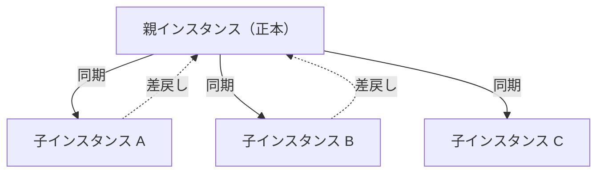
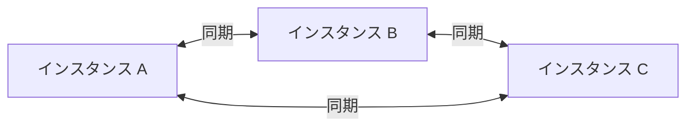
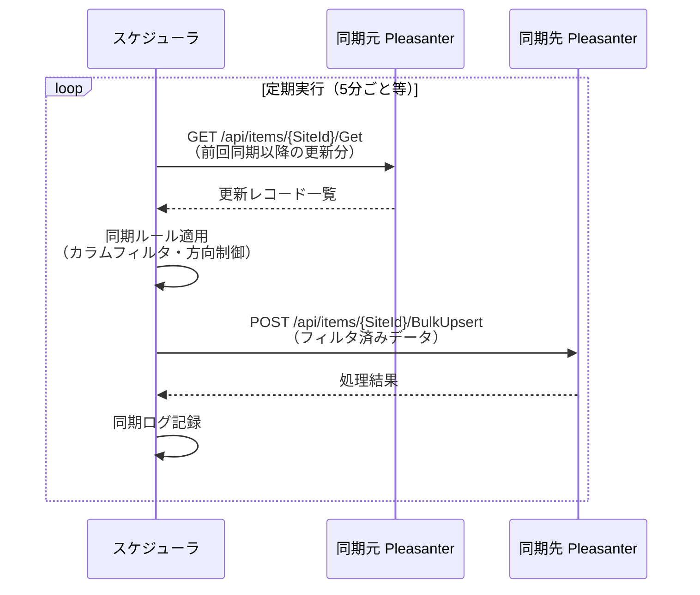
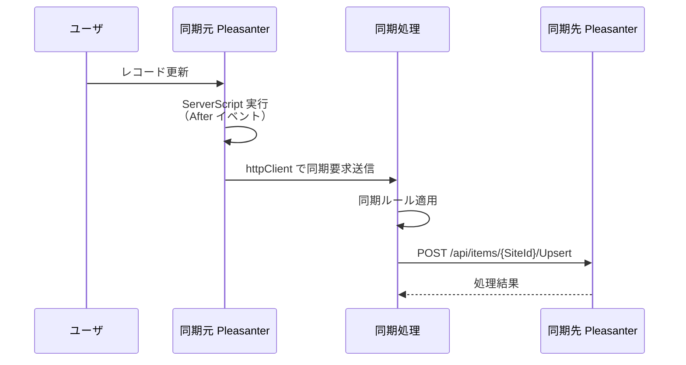
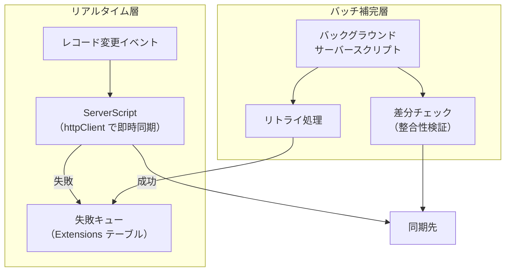
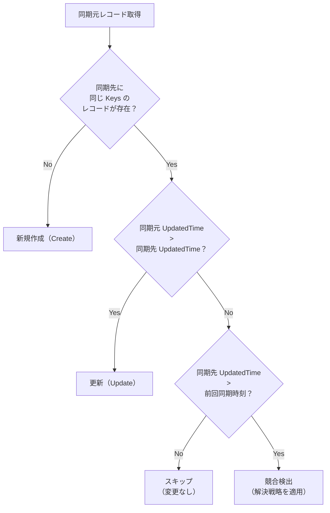
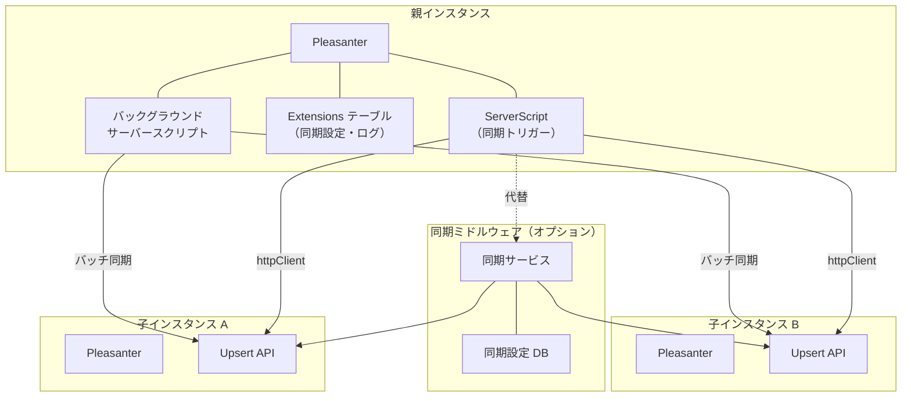
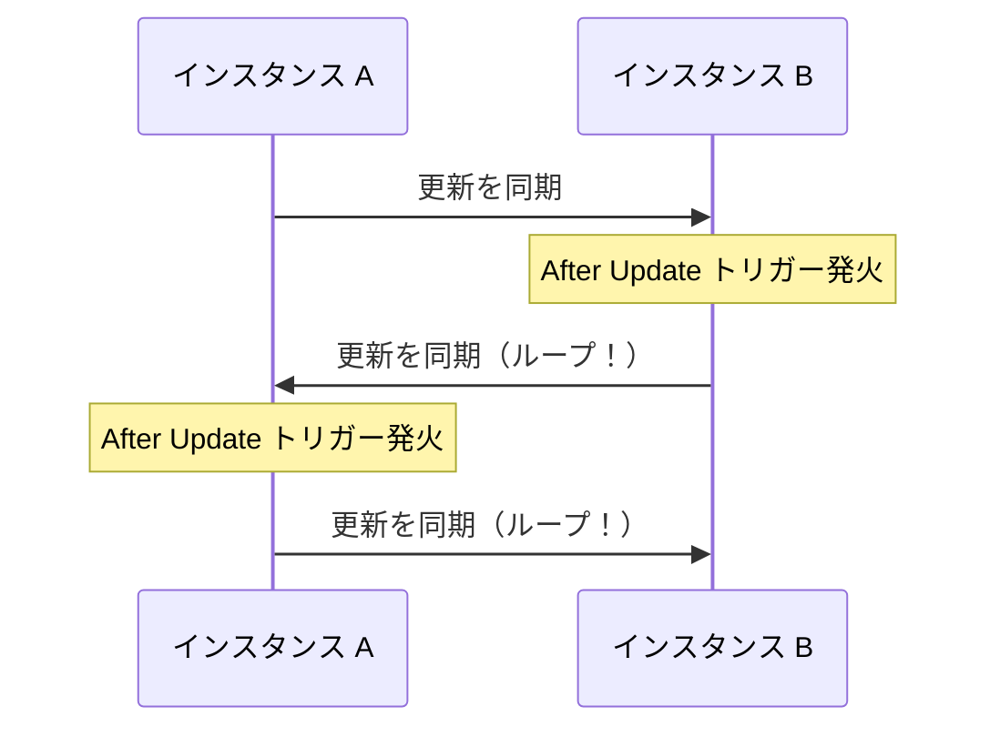

# 複数インスタンス間マスターデータ同期設計

複数のプリザンターインスタンス間で特定のサイト（マスターデータ）を同期させる機能の設計調査。対等型・親子型のトポロジに対応し、項目単位・方向単位の同期制御を備えた仕組みを検討する。

<!-- START doctoc generated TOC please keep comment here to allow auto update -->
<!-- DON'T EDIT THIS SECTION, INSTEAD RE-RUN doctoc TO UPDATE -->

- [調査情報](#調査情報)
- [調査目的](#調査目的)
- [前提: プリザンターの既存同期関連機能](#前提-プリザンターの既存同期関連機能)
    - [利用可能な API・機能](#利用可能な-api機能)
    - [Upsert API の仕様](#upsert-api-の仕様)
- [同期トポロジの整理](#同期トポロジの整理)
    - [パターン 1: 親子型（Hub-Spoke）](#パターン-1-親子型hub-spoke)
    - [パターン 2: 対等型（Peer-to-Peer）](#パターン-2-対等型peer-to-peer)
    - [トポロジの選定指針](#トポロジの選定指針)
- [同期制御の設計](#同期制御の設計)
    - [制御の粒度](#制御の粒度)
    - [同期定義の構成](#同期定義の構成)
    - [設定項目の説明](#設定項目の説明)
- [同期方式の比較](#同期方式の比較)
    - [方式 1: バッチ同期（ポーリング方式）](#方式-1-バッチ同期ポーリング方式)
    - [方式 2: イベント駆動同期（リアルタイム方式）](#方式-2-イベント駆動同期リアルタイム方式)
    - [方式 3: ハイブリッド方式（推奨）](#方式-3-ハイブリッド方式推奨)
- [競合解決の方針](#競合解決の方針)
    - [競合解決戦略](#競合解決戦略)
    - [競合検出の実装](#競合検出の実装)
- [削除の同期](#削除の同期)
    - [方式比較](#方式比較)
- [実装アーキテクチャ](#実装アーキテクチャ)
    - [全体構成](#全体構成)
    - [実装パターンの比較](#実装パターンの比較)
- [推奨実装方式: ServerScript + バックグラウンドスクリプト（パターン D）](#推奨実装方式-serverscript--バックグラウンドスクリプトパターン-d)
    - [構成要素](#構成要素)
- [セキュリティに関する考慮事項](#セキュリティに関する考慮事項)
- [運用上の注意事項](#運用上の注意事項)
    - [サイト定義（SiteSettings）の同期](#サイト定義sitesettingsの同期)
    - [同期キーの設計](#同期キーの設計)
    - [同期ループの防止](#同期ループの防止)
- [結論](#結論)
- [関連ソースコード](#関連ソースコード)
- [注意事項](#注意事項)
- [関連リンク](#関連リンク)

<!-- END doctoc generated TOC please keep comment here to allow auto update -->

## 調査情報

| 調査日        | リポジトリ | ブランチ | タグ/バージョン    | コミット   | 備考     |
| ------------- | ---------- | -------- | ------------------ | ---------- | -------- |
| 2026年3月16日 | Pleasanter | main     | Pleasanter_1.5.1.0 | `34f162a4` | 初回調査 |

## 調査目的

- 複数のプリザンターインスタンス間でマスターデータ（選択肢テーブル等）を同期させる仕組みを設計する
- 対等型（Peer-to-Peer）と親子型（Hub-Spoke）の 2 つのトポロジパターンを整理する
- 全データの無条件同期ではなく、項目単位・方向単位・インスタンス単位で同期範囲を制御できる仕組みを検討する
- リアルタイム同期とバッチ同期の双方のアプローチを比較し、実装方針を示す

---

## 前提: プリザンターの既存同期関連機能

プリザンターには複数インスタンス間を直接同期するネイティブ機能は存在しない。しかし、同期を実現するための構成要素は備わっている。

### 利用可能な API・機能

| 機能                               | 概要                                             | 同期での用途                     |
| ---------------------------------- | ------------------------------------------------ | -------------------------------- |
| Upsert API                         | Keys 指定で存在すれば更新、なければ作成          | 同期先へのデータ書き込み         |
| BulkUpsert API                     | 複数レコードの一括 Upsert                        | バッチ同期のデータ投入           |
| Get API                            | フィルタ条件指定でレコード取得                   | 同期元からのデータ取得           |
| httpClient（ServerScript）         | サーバースクリプト内から外部 HTTP リクエスト送信 | インスタンス間通信               |
| 通知機能（HttpClient 型）          | レコード変更時に HTTP リクエストを送信           | 変更イベントの通知               |
| バックグラウンドサーバースクリプト | 定期実行されるサーバースクリプト                 | バッチ同期のスケジューラ         |
| 拡張 SQL（ExtendedSql）            | カスタム SQL の実行                              | 直接 DB 参照（同一 DB サーバ時） |

### Upsert API の仕様

同期処理の中核となる Upsert API の動作は以下の通り。

```
POST /api/items/{SiteId}/Upsert
```

```json
{
    "Keys": ["ClassA"],
    "ClassHash": {
        "ClassA": "MASTER_001",
        "ClassB": "同期されたデータ"
    },
    "Title": "マスターレコード001"
}
```

| パラメータ | 説明                                                |
| ---------- | --------------------------------------------------- |
| Keys       | 一意性を判定するカラム名の配列（複数指定可）        |
| ClassHash  | 作成・更新するデータ（Keys に含むカラムも指定する） |
| Title      | レコードタイトル                                    |

> **注意**: Upsert API には SELECT と INSERT/UPDATE の間にデータベースレベルのロックがないため、
> 同一 Keys への同時リクエストで競合が発生する可能性がある
> （詳細は [001-Upsert-API.md](../03-データ操作・API/001-Upsert-API.md) を参照）。

---

## 同期トポロジの整理

### パターン 1: 親子型（Hub-Spoke）

1 つの親インスタンスが正本を持ち、複数の子インスタンスにデータを配信する構成。



| 特性       | 内容                                           |
| ---------- | ---------------------------------------------- |
| 正本の所在 | 親インスタンスが唯一の正本                     |
| 同期方向   | 基本は親→子の一方向。子→親は制限付き（差戻し） |
| 競合リスク | 低い（正本が一意に決まるため）                 |
| 適用例     | 本社→支社、管理サーバ→現場端末                 |

### パターン 2: 対等型（Peer-to-Peer）

全インスタンスが同等の権限を持ち、どこで変更しても他のインスタンスに反映される構成。



| 特性       | 内容                                       |
| ---------- | ------------------------------------------ |
| 正本の所在 | 全インスタンスが対等（正本なし）           |
| 同期方向   | 双方向                                     |
| 競合リスク | 高い（同一レコードの同時編集が発生し得る） |
| 適用例     | 拠点間で同等の運用を行うケース             |

### トポロジの選定指針

| 判断基準                 | 親子型推奨   | 対等型推奨         |
| ------------------------ | ------------ | ------------------ |
| マスターデータの管理拠点 | 1 拠点に集約 | 複数拠点で分散管理 |
| 競合発生時の解決コスト   | 低い         | 高い               |
| 実装の複雑度             | 低い         | 高い               |
| 運用の柔軟性             | 限定的       | 高い               |

---

## 同期制御の設計

### 制御の粒度

同期対象を細かく制御するため、以下の 3 レベルの制御粒度を設ける。

| 制御レベル         | 説明                                         | 設定例                                               |
| ------------------ | -------------------------------------------- | ---------------------------------------------------- |
| サイト単位         | 同期対象のサイト（テーブル）を指定する       | サイト A は同期対象、サイト B は対象外               |
| 項目（カラム）単位 | 同期する項目を個別に指定する                 | ClassA は同期、ClassB は同期しない                   |
| 方向単位           | 同期方向とインスタンスの組み合わせで制御する | 子 A→親は ClassC を除外、子 B には ClassD を送らない |

### 同期定義の構成

同期ルールを JSON 形式の設定ファイルで管理する。

```json
{
    "syncId": "master-employee",
    "description": "従業員マスター同期",
    "topology": "hub-spoke",
    "source": {
        "instanceId": "headquarters",
        "baseUrl": "https://hq.example.com",
        "siteId": 12345,
        "apiKey": "{{HQ_API_KEY}}"
    },
    "targets": [
        {
            "instanceId": "branch-a",
            "baseUrl": "https://branch-a.example.com",
            "siteId": 23456,
            "apiKey": "{{BRANCH_A_API_KEY}}"
        },
        {
            "instanceId": "branch-b",
            "baseUrl": "https://branch-b.example.com",
            "siteId": 34567,
            "apiKey": "{{BRANCH_B_API_KEY}}"
        }
    ],
    "keys": ["ClassA"],
    "columns": {
        "default": {
            "include": ["Title", "ClassA", "ClassB", "ClassC", "NumA"],
            "exclude": []
        },
        "overrides": [
            {
                "targetInstanceId": "branch-b",
                "exclude": ["ClassC"]
            }
        ]
    },
    "direction": {
        "sourceToTarget": true,
        "targetToSource": {
            "enabled": true,
            "excludeColumns": ["ClassB", "NumA"]
        },
        "overrides": [
            {
                "targetInstanceId": "branch-a",
                "targetToSource": false
            }
        ]
    },
    "schedule": {
        "mode": "batch",
        "cronExpression": "*/5 * * * *",
        "batchSize": 100
    },
    "conflictResolution": "source-wins"
}
```

### 設定項目の説明

| 項目                       | 型      | 説明                                                 |
| -------------------------- | ------- | ---------------------------------------------------- |
| `syncId`                   | string  | 同期定義の一意識別子                                 |
| `topology`                 | string  | `hub-spoke`（親子型）または `peer-to-peer`（対等型） |
| `source`                   | object  | 同期元インスタンスの接続情報                         |
| `targets`                  | array   | 同期先インスタンスの接続情報の配列                   |
| `keys`                     | array   | Upsert の Keys に使用するカラム名                    |
| `columns.default.include`  | array   | 既定で同期対象とするカラム一覧                       |
| `columns.overrides`        | array   | 特定インスタンス向けのカラム除外設定                 |
| `direction.sourceToTarget` | boolean | 親→子方向の同期を有効にするか                        |
| `direction.targetToSource` | object  | 子→親方向の同期設定（有効フラグと除外カラム）        |
| `direction.overrides`      | array   | 特定インスタンスの方向制御を上書きする設定           |
| `schedule.mode`            | string  | `batch`（バッチ）または `realtime`（リアルタイム）   |
| `schedule.cronExpression`  | string  | バッチ実行の cron 式                                 |
| `schedule.batchSize`       | number  | 1 回のバッチで処理するレコード数                     |
| `conflictResolution`       | string  | 競合時の解決方針                                     |

---

## 同期方式の比較

### 方式 1: バッチ同期（ポーリング方式）

定期的に同期元の更新データを取得し、同期先に反映する方式。



**差分検出の方法**:

Get API の View フィルタで `UpdatedTime` を条件として前回同期時刻以降の更新レコードを取得する。

```json
{
    "View": {
        "ColumnFilterHash": {
            "UpdatedTime": "[\"2026-03-16T00:00:00\",]"
        }
    }
}
```

| メリット                     | デメリット                 |
| ---------------------------- | -------------------------- |
| 実装が単純                   | 同期間隔分の遅延が発生する |
| プリザンター本体の改修が不要 | ポーリングによる API 負荷  |
| 障害時のリトライが容易       | 削除の検出が困難           |
| バッチサイズで負荷を制御可能 | 同期間隔の短縮に限界がある |

### 方式 2: イベント駆動同期（リアルタイム方式）

レコードの変更イベントをトリガーにして即時同期する方式。



プリザンターのサーバースクリプト（After トリガー）から httpClient を使って同期先に直接リクエストを送信する。

```javascript
// サーバースクリプト（After Create/Update）
const syncConfig = JSON.parse(extensions.Get('SyncConfig'));
const targetColumns = syncConfig.columns.default.include;

const syncData = {};
targetColumns.forEach(function (col) {
    syncData[col] = model[col];
});

syncConfig.targets.forEach(function (target) {
    httpClient.RequestUri = target.baseUrl + '/api/items/' + target.siteId + '/upsert';
    httpClient.Content = JSON.stringify({
        ApiVersion: 1.1,
        ApiKey: target.apiKey,
        Keys: syncConfig.keys,
        ClassHash: syncData,
        Title: model.Title,
    });
    httpClient.MediaType = 'application/json';

    var response = httpClient.Post();
    if (!httpClient.IsSuccess) {
        logs.LogError('Sync failed: ' + target.instanceId);
    }
});
```

| メリット                                | デメリット                                     |
| --------------------------------------- | ---------------------------------------------- |
| ほぼリアルタイムの同期                  | サーバースクリプトの実行時間制限に注意が必要   |
| 変更がない時は API 呼び出しが発生しない | 同期先が一時的に到達不能な場合のリトライが困難 |
| 変更イベントに応じた精密な制御が可能    | 同期元のレスポンスタイムに影響する             |

### 方式 3: ハイブリッド方式（推奨）

イベント駆動をベースとし、バッチで整合性を補完するハイブリッド方式。



| 項目           | 内容                                                      |
| -------------- | --------------------------------------------------------- |
| 通常時         | ServerScript の After トリガーで即時同期                  |
| 同期先障害時   | Extensions テーブルに失敗レコードを記録しバッチでリトライ |
| 定期整合性検証 | バックグラウンドサーバースクリプトで差分チェック          |
| 削除の同期     | 論理削除フラグをカラムに持たせ、バッチで検出              |

---

## 競合解決の方針

対等型トポロジでは、同一レコードが複数インスタンスで同時に編集される可能性がある。

### 競合解決戦略

| 戦略              | 説明                                         | 適用場面                             |
| ----------------- | -------------------------------------------- | ------------------------------------ |
| Source Wins       | 同期元（親）のデータを常に優先する           | 親子型で正本が明確な場合             |
| Last Write Wins   | 最終更新日時が新しい方を採用する             | 対等型で更新頻度が低い場合           |
| Manual Resolution | 競合を検出し管理者に通知して手動解決する     | データの正確性が最重要の場合         |
| Field-Level Merge | カラム単位で最終更新を比較し個別にマージする | 同時編集が異なるカラムで発生する場合 |

### 競合検出の実装

`UpdatedTime` を比較して競合を検出する。



---

## 削除の同期

プリザンターの Get API では削除済みレコードを取得できないため、削除の同期には工夫が必要である。

### 方式比較

| 方式              | 概要                                                   | メリット       | デメリット               |
| ----------------- | ------------------------------------------------------ | -------------- | ------------------------ |
| 論理削除フラグ    | 削除の代わりにフラグカラム（例: ClassZ）を立てる       | API で取得可能 | 運用ルールの徹底が必要   |
| 全件比較          | バッチで全件取得し、同期先にのみ存在するレコードを検出 | 確実           | データ量に比例して負荷増 |
| ServerScript 通知 | Before Delete で同期先に削除リクエストを送信           | リアルタイム   | スクリプト障害時に漏れ   |

**推奨**: 論理削除フラグ方式をベースとし、定期バッチで全件比較による整合性チェックを補完する。

---

## 実装アーキテクチャ

### 全体構成



### 実装パターンの比較

| パターン                          | 概要                                                   | 長所                         | 短所                             |
| --------------------------------- | ------------------------------------------------------ | ---------------------------- | -------------------------------- |
| A: ServerScript 直接方式          | ServerScript の httpClient で直接同期先 API を呼び出す | 追加インフラ不要             | スクリプトの複雑化・実行時間制限 |
| B: 外部同期サービス方式           | 専用の同期サービスを別プロセスで稼働させる             | 柔軟な制御・リトライ処理     | 追加インフラが必要               |
| C: バックグラウンドスクリプト方式 | バックグラウンドサーバースクリプトでバッチ同期         | 追加インフラ不要・バッチ処理 | リアルタイム性が低い             |
| D: A+C ハイブリッド方式           | リアルタイム（A）＋バッチ補完（C）                     | バランスが良い               | 実装箇所が増える                 |

---

## 推奨実装方式: ServerScript + バックグラウンドスクリプト（パターン D）

### 構成要素

#### 1. 同期設定の管理

Extensions テーブルに同期設定を JSON で格納する。

```
ExtensionType: "Sync"
ExtensionName: "master-employee"
Body: { /* 同期定義 JSON */ }
```

Extensions API（`/api/extensions/Get`）を使って設定を読み込む。

#### 2. リアルタイム同期（ServerScript）

同期対象サイトの ServerScript（After Create / After Update）に同期処理を記述する。

```javascript
// After Create / After Update トリガー
try {
    const configBody = extensions.Get('master-employee');
    if (!configBody) return;
    const config = JSON.parse(configBody);

    // 同期対象カラムのデータを収集
    const syncData = {};
    config.columns.default.include.forEach(function (col) {
        if (model[col] !== undefined) {
            syncData[col] = model[col];
        }
    });

    // 各ターゲットに同期
    config.targets.forEach(function (target) {
        // ターゲット固有の除外カラムを適用
        var targetData = JSON.parse(JSON.stringify(syncData));
        var overrides = config.columns.overrides.filter(function (o) {
            return o.targetInstanceId === target.instanceId;
        });
        if (overrides.length > 0) {
            overrides[0].exclude.forEach(function (col) {
                delete targetData[col];
            });
        }

        httpClient.RequestUri = target.baseUrl + '/api/items/' + target.siteId + '/upsert';
        httpClient.Content = JSON.stringify({
            ApiVersion: 1.1,
            ApiKey: target.apiKey,
            Keys: config.keys,
            ClassHash: targetData,
            Title: model.Title,
        });
        httpClient.MediaType = 'application/json';

        var response = httpClient.Post();
        if (!httpClient.IsSuccess) {
            // 失敗時は Extensions テーブルにリトライキューを記録
            extensions.Set({
                Name: 'SyncRetry_' + target.instanceId + '_' + model.ResultId,
                Body: JSON.stringify({
                    targetInstanceId: target.instanceId,
                    syncId: config.syncId,
                    recordId: model.ResultId,
                    data: targetData,
                    failedAt: new Date().toISOString(),
                    retryCount: 0,
                }),
            });
            logs.LogError('Sync to ' + target.instanceId + ' failed: ' + httpClient.StatusCode);
        }
    });
} catch (e) {
    logs.LogError('Sync error: ' + e.message);
}
```

#### 3. バッチ補完（バックグラウンドサーバースクリプト）

バックグラウンドサーバースクリプトでリトライ処理と差分検証を行う。

```javascript
// バックグラウンドサーバースクリプト（5分間隔）

// --- リトライ処理 ---
const retryPrefix = 'SyncRetry_';
// Extensions テーブルから失敗キューを取得し再送する
// （extensions.Get で prefix 検索し、成功したら extensions.Delete）

// --- 差分検証 ---
const configBody = extensions.Get('master-employee');
if (!configBody) return;
const config = JSON.parse(configBody);

// 前回同期時刻を取得
const lastSyncKey = 'SyncLastTime_' + config.syncId;
const lastSyncTime = extensions.Get(lastSyncKey) || '2000-01-01T00:00:00';

// 同期元から更新分を取得
httpClient.RequestUri = config.source.baseUrl + '/api/items/' + config.source.siteId + '/get';
httpClient.Content = JSON.stringify({
    ApiVersion: 1.1,
    ApiKey: config.source.apiKey,
    View: {
        ColumnFilterHash: {
            UpdatedTime: '["' + lastSyncTime + '",]',
        },
    },
});
httpClient.MediaType = 'application/json';
httpClient.Post();

if (httpClient.IsSuccess) {
    const result = JSON.parse(httpClient.ResponseBody);
    if (result.Response && result.Response.Data) {
        // 各ターゲットに BulkUpsert で反映
        config.targets.forEach(function (target) {
            // カラムフィルタ適用とBulkUpsert 実行
            // ...
        });
    }
    // 同期時刻を更新
    extensions.Set({
        Name: lastSyncKey,
        Body: new Date().toISOString(),
    });
}
```

#### 4. 削除の同期（ServerScript）

Before Delete トリガーで同期先にも削除を通知する。

```javascript
// Before Delete トリガー
try {
    const configBody = extensions.Get('master-employee');
    if (!configBody) return;
    const config = JSON.parse(configBody);
    const keyValue = model[config.keys[0]];

    config.targets.forEach(function (target) {
        // 同期先で該当レコードを検索
        httpClient.RequestUri = target.baseUrl + '/api/items/' + target.siteId + '/get';
        httpClient.Content = JSON.stringify({
            ApiVersion: 1.1,
            ApiKey: target.apiKey,
            View: {
                ColumnFilterHash: {
                    [config.keys[0]]: keyValue,
                },
            },
        });
        httpClient.MediaType = 'application/json';
        httpClient.Post();

        if (httpClient.IsSuccess) {
            var getResult = JSON.parse(httpClient.ResponseBody);
            if (getResult.Response && getResult.Response.Data && getResult.Response.Data.length > 0) {
                var targetRecordId = getResult.Response.Data[0].ResultId || getResult.Response.Data[0].IssueId;
                // 同期先のレコードを削除
                httpClient.RequestUri = target.baseUrl + '/api/items/' + targetRecordId + '/delete';
                httpClient.Content = JSON.stringify({
                    ApiVersion: 1.1,
                    ApiKey: target.apiKey,
                });
                httpClient.MediaType = 'application/json';
                httpClient.Post();
            }
        }
    });
} catch (e) {
    logs.LogError('Delete sync error: ' + e.message);
}
```

---

## セキュリティに関する考慮事項

| 項目             | 対策                                                              |
| ---------------- | ----------------------------------------------------------------- |
| API キーの管理   | 設定 JSON 内のキーはプレースホルダとし、環境変数で注入する        |
| 通信経路の暗号化 | インスタンス間通信は HTTPS を必須とする                           |
| API キーの権限   | 同期専用の API キーを発行し、対象サイトのみにアクセス権を設定する |
| ログ出力         | API キーやレコード内容をログに出力しない                          |
| レート制限       | バッチサイズと同期間隔で API 呼び出し頻度を制御する               |

---

## 運用上の注意事項

### サイト定義（SiteSettings）の同期

本設計はレコードデータの同期を対象とする。サイト定義（カラム設定・ビュー設定等）の同期は対象外であり、各インスタンスのサイト定義は事前に手動で整合させておく必要がある。

### 同期キーの設計

| 注意点         | 説明                                                              |
| -------------- | ----------------------------------------------------------------- |
| キーの一意性   | 同期キーは全インスタンスで一意になるよう設計する                  |
| 自動採番の回避 | ResultId / IssueId はインスタンス間で異なるため同期キーに使えない |
| 業務キーの使用 | 従業員番号・商品コードなど業務上の一意キーを使用する              |

### 同期ループの防止

双方向同期では、同期によるレコード更新が再び同期トリガーを発火し無限ループとなるリスクがある。



**防止策**:

- ServerScript 内で同期による更新を判定するフラグを設ける
- API キーに紐づくユーザ名で同期経由の更新を判別する
- `context.Action` が API 経由（`"CreateByApi"` / `"UpdateByApi"`）であるかを判定する

```javascript
// 同期ループ防止
if (context.Action === 'CreateByApi' || context.Action === 'UpdateByApi') {
    // API 経由の更新は同期対象外とする
    return;
}
```

---

## 結論

| 項目               | 結論                                                                                   |
| ------------------ | -------------------------------------------------------------------------------------- |
| ネイティブ同期機能 | プリザンターには複数インスタンス間のネイティブ同期機能は存在しない                     |
| 推奨トポロジ       | 親子型（Hub-Spoke）を推奨。競合リスクが低く実装が容易                                  |
| 推奨同期方式       | ハイブリッド方式（ServerScript 即時同期 + バックグラウンドスクリプトによるバッチ補完） |
| 同期制御           | サイト単位・カラム単位・方向単位の 3 レベルで制御可能                                  |
| 同期キー           | 業務上の一意キーを Upsert API の Keys として使用する                                   |
| 競合解決           | 親子型では Source Wins、対等型では Last Write Wins を基本とする                        |
| 削除の同期         | Before Delete トリガー + 論理削除フラグ + 定期全件比較の併用                           |
| 同期ループ防止     | `context.Action` による API 経由判定で防止可能                                         |
| 追加インフラ       | ServerScript + Extensions テーブルの組み合わせにより追加インフラ不要で実現可能         |

---

## 関連ソースコード

| ファイル                                                                   | 概要                          |
| -------------------------------------------------------------------------- | ----------------------------- |
| `Implem.Pleasanter/Controllers/Api/ItemsController.cs`                     | Items API エンドポイント      |
| `Implem.Pleasanter/Models/Results/ResultUtilities.cs`（Upsert メソッド）   | Upsert 処理の実装             |
| `Implem.Pleasanter/Models/Issues/IssueUtilities.cs`（Upsert メソッド）     | Issues テーブルの Upsert 実装 |
| `Implem.Pleasanter/Libraries/ServerScripts/ServerScriptModelHttpClient.cs` | httpClient ホストオブジェクト |
| `Implem.Pleasanter/Libraries/Settings/Notification.cs`                     | 通知タイプ定義                |
| `Implem.Pleasanter/Libraries/BackgroundServices/`                          | バックグラウンドサービス基盤  |
| `Implem.Pleasanter/Libraries/ServerScripts/ServerScriptModelExtensions.cs` | Extensions ホストオブジェクト |

## 注意事項

- Upsert API の競合（Race Condition）については [001-Upsert-API.md](../03-データ操作・API/001-Upsert-API.md) を参照
- サーバースクリプトの実行時間にはタイムアウト制限がある（既定 10 秒）ため、多数のターゲットへの同期は httpClient のレスポンスタイムに注意する
- バックグラウンドサーバースクリプトの実行間隔はパラメータ設定に依存する
- API キーは同期専用ユーザを作成し、最小権限の原則に従って設定する

## 関連リンク

- [001-Upsert-API.md](../03-データ操作・API/001-Upsert-API.md) - Upsert API の競合問題と対策
- [006-API ラッパー実装状況](../03-データ操作・API/006-APIラッパー実装状況.md) - API ラッパーの実装状況
- [002-Webhook・iPaaS 連携の実現可能性調査](002-Webhook・iPaaS連携の実現可能性調査.md) - Webhook アーキテクチャ
- [004-Webhook 通知実装案](004-Webhook通知実装案.md) - Webhook 通知の実装案
- [005-外部 Webhook 受信設計](005-外部Webhook受信設計.md) - 外部 Webhook 受信の設計
- [004-Extensionsテーブル](../03-データ操作・API/004-Extensionsテーブル.md) - Extensions テーブルの構造
