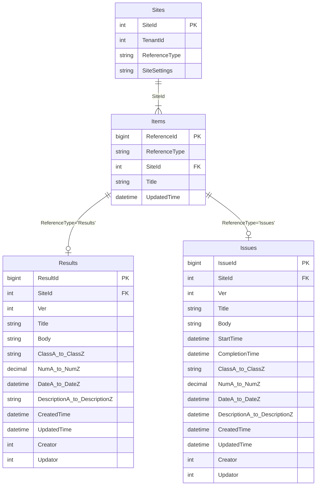
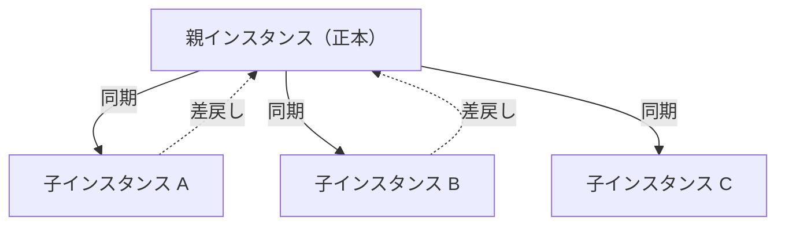
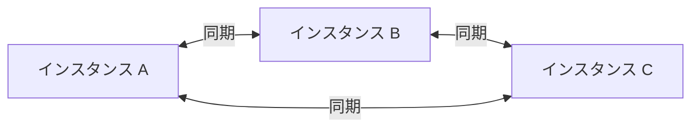
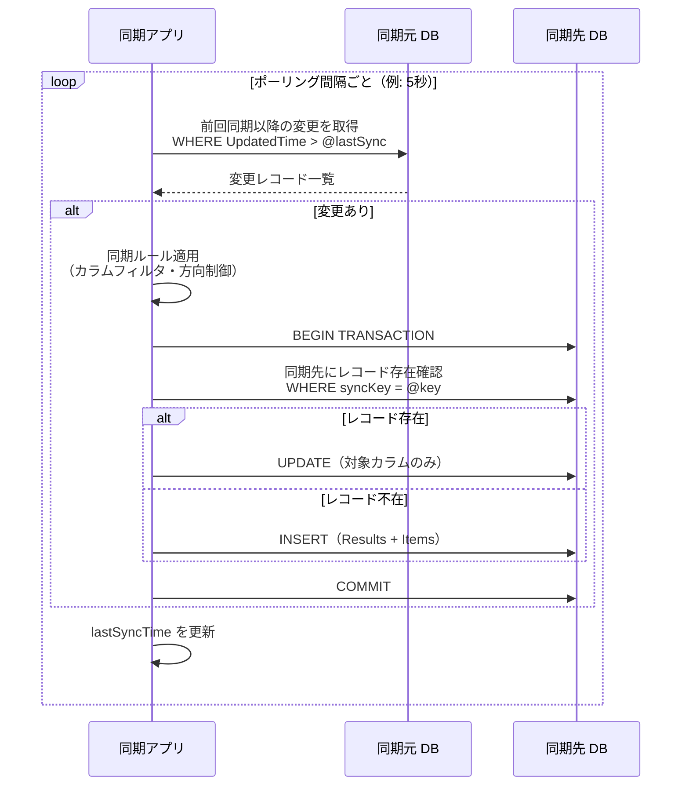
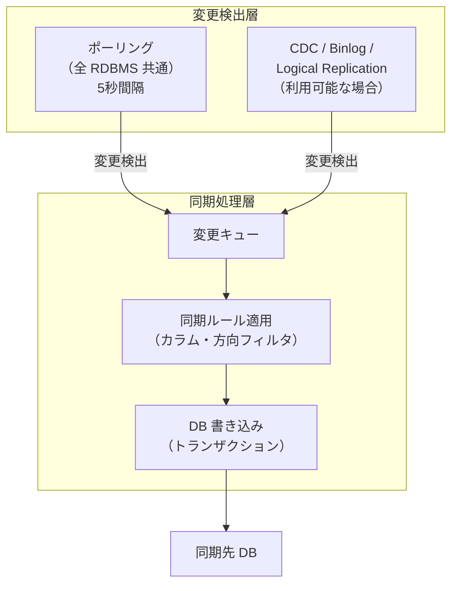
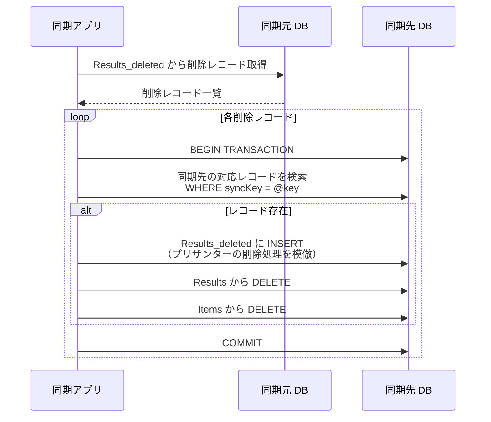
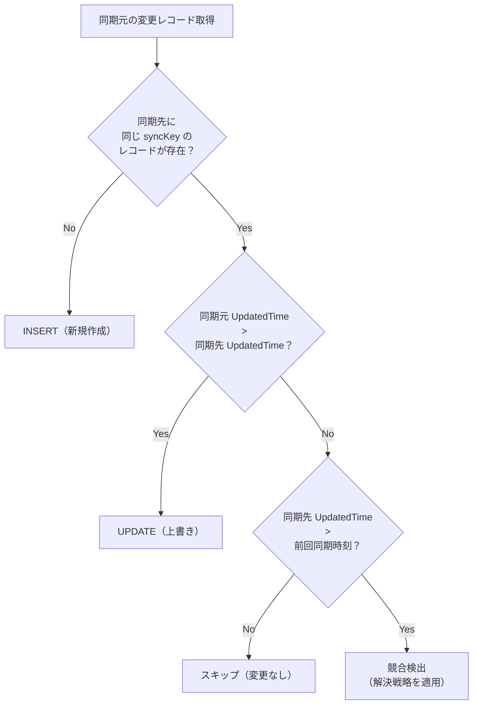
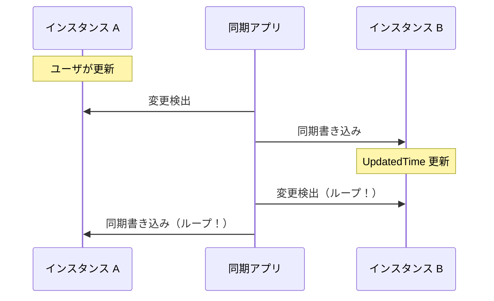
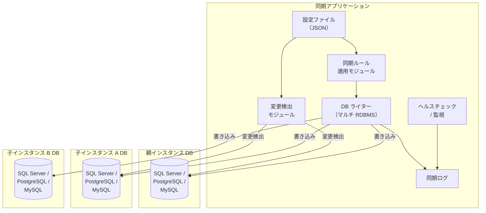
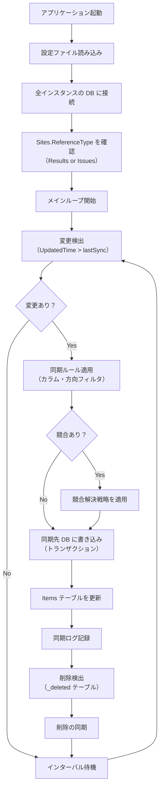

# 複数インスタンス間マスターデータ同期設計

複数のプリザンターインスタンス間で特定のサイト（マスターデータ）を同期させる外部アプリケーションの設計調査。プリザンター本体には手を加えず、RDBMS を直接操作することで同期を実現する。対等型・親子型のトポロジに対応し、項目単位・方向単位の同期制御を備えた仕組みを検討する。

<!-- START doctoc generated TOC please keep comment here to allow auto update -->
<!-- DON'T EDIT THIS SECTION, INSTEAD RE-RUN doctoc TO UPDATE -->

- [調査情報](#調査情報)
- [調査目的](#調査目的)
- [設計方針](#設計方針)
    - [API 不使用の理由](#api-不使用の理由)
- [プリザンターのデータベース構造](#プリザンターのデータベース構造)
    - [テーブル構成](#テーブル構成)
    - [テーブルバリアント（3 テーブル構成）](#テーブルバリアント3-テーブル構成)
    - [Items テーブルとの関係](#items-テーブルとの関係)
    - [同期対象テーブルの判定](#同期対象テーブルの判定)
    - [同期キーとなるカラム](#同期キーとなるカラム)
- [同期トポロジの整理](#同期トポロジの整理)
    - [パターン 1: 親子型（Hub-Spoke）](#パターン-1-親子型hub-spoke)
    - [パターン 2: 対等型（Peer-to-Peer）](#パターン-2-対等型peer-to-peer)
    - [トポロジの選定指針](#トポロジの選定指針)
- [同期制御の設計](#同期制御の設計)
    - [制御の粒度](#制御の粒度)
    - [同期定義の構成](#同期定義の構成)
    - [設定項目の説明](#設定項目の説明)
- [変更検出方式](#変更検出方式)
    - [RDBMS 別の変更検出機能](#rdbms-別の変更検出機能)
    - [方式 1: ポーリング方式（全 RDBMS 共通・推奨）](#方式-1-ポーリング方式全-rdbms-共通推奨)
    - [方式 2: CDC / Binlog / Logical Replication 方式](#方式-2-cdc--binlog--logical-replication-方式)
    - [方式 3: ハイブリッド方式（推奨）](#方式-3-ハイブリッド方式推奨)
- [削除の同期](#削除の同期)
    - [削除検出の SQL](#削除検出の-sql)
    - [削除同期の処理フロー](#削除同期の処理フロー)
- [競合解決の方針](#競合解決の方針)
    - [競合解決戦略](#競合解決戦略)
    - [競合検出の実装](#競合検出の実装)
- [同期ループの防止](#同期ループの防止)
    - [防止策](#防止策)
- [外部同期アプリケーションのアーキテクチャ](#外部同期アプリケーションのアーキテクチャ)
    - [全体構成](#全体構成)
    - [アプリケーション構成](#アプリケーション構成)
    - [技術スタック候補](#技術スタック候補)
    - [処理フロー](#処理フロー)
- [RDBMS 別の SQL 差異](#rdbms-別の-sql-差異)
    - [識別子のクォート](#識別子のクォート)
    - [INSERT 時の自動採番 ID 取得](#insert-時の自動採番-id-取得)
    - [日時関数](#日時関数)
    - [UPSERT 構文（参考）](#upsert-構文参考)
- [セキュリティに関する考慮事項](#セキュリティに関する考慮事項)
- [運用上の注意事項](#運用上の注意事項)
    - [サイト定義（SiteSettings）の同期](#サイト定義sitesettingsの同期)
    - [Ver カラムの取り扱い](#ver-カラムの取り扱い)
    - [History テーブルの取り扱い](#history-テーブルの取り扱い)
    - [同期キーの設計](#同期キーの設計)
- [結論](#結論)
- [関連ソースコード](#関連ソースコード)
- [注意事項](#注意事項)
- [関連リンク](#関連リンク)

<!-- END doctoc generated TOC please keep comment here to allow auto update -->

## 調査情報

| 調査日        | リポジトリ | ブランチ | タグ/バージョン    | コミット   | 備考     |
| ------------- | ---------- | -------- | ------------------ | ---------- | -------- |
| 2026年3月16日 | Pleasanter | main     | Pleasanter_1.5.1.0 | `34f162a4` | 初回調査 |

## 調査目的

- 複数のプリザンターインスタンス間でマスターデータ（選択肢テーブル等）を同期させる仕組みを設計する
- **プリザンター本体を改修せず、外部アプリケーションとして実装する**（既存環境のバージョンアップが困難なため）
- **API を使用せず RDBMS を直接操作する**ことで、高速かつ確実な同期を実現する
- 対応 RDBMS は **SQL Server・MySQL・PostgreSQL** の 3 種とする
- 対等型（Peer-to-Peer）と親子型（Hub-Spoke）の 2 つのトポロジパターンを整理する
- 項目単位・方向単位・インスタンス単位で同期範囲を制御できる仕組みを検討する
- できるだけ**リアルタイムに近い同期**を実現する

---

## 設計方針

| 項目                   | 方針                                                       |
| ---------------------- | ---------------------------------------------------------- |
| 実装形態               | プリザンターとは独立した外部アプリケーション               |
| データアクセス         | RDBMS への直接 SQL 操作（API 不使用）                      |
| 対応 RDBMS             | SQL Server・MySQL・PostgreSQL                              |
| 同期タイミング         | リアルタイム（変更検出ベース）を基本とし、バッチ補完を併用 |
| プリザンター本体の改修 | 不要（既存環境をそのまま利用可能）                         |

### API 不使用の理由

| 観点           | API 方式の課題                               | DB 直接方式の利点                                     |
| -------------- | -------------------------------------------- | ----------------------------------------------------- |
| バージョン依存 | API 仕様がバージョンにより変わる可能性がある | テーブル構造は安定しており変更頻度が低い              |
| パフォーマンス | HTTP オーバーヘッド・認証処理が発生する      | DB 接続で直接操作するため高速                         |
| 一括処理       | BulkUpsert の制約（タイムアウト等）          | SQL の INSERT/UPDATE で大量データを効率的に処理できる |
| 競合制御       | Upsert API に DB レベルのロックがない        | トランザクションと行ロックで競合を確実に防止できる    |
| 削除検出       | API では削除済みレコードを取得できない       | `_deleted` テーブルを直接参照して削除を検出できる     |
| 導入容易性     | 各インスタンスの API キー管理が必要          | DB 接続情報のみで運用可能                             |

---

## プリザンターのデータベース構造

外部同期アプリケーションが操作する主要テーブルの構造を整理する。

### テーブル構成

プリザンターのデータは以下のテーブル群で管理される。



### テーブルバリアント（3 テーブル構成）

各ビジネステーブルは 3 つのバリアントで構成される。

| テーブル          | 用途                   | 同期での扱い           |
| ----------------- | ---------------------- | ---------------------- |
| `Results`         | アクティブなレコード   | 同期の主対象           |
| `Results_deleted` | 論理削除されたレコード | 削除同期の検出に使用   |
| `Results_history` | 更新履歴               | 同期対象外（参考情報） |

### Items テーブルとの関係

Results / Issues テーブルの各レコードには、対応する Items テーブルのレコードが存在する。

| Items カラム    | 説明                                               |
| --------------- | -------------------------------------------------- |
| `ReferenceId`   | Results.ResultId または Issues.IssueId に対応      |
| `ReferenceType` | `"Results"` または `"Issues"`                      |
| `SiteId`        | レコードが属するサイトの ID                        |
| `Title`         | レコードタイトル（Results/Issues の Title と同値） |
| `UpdatedTime`   | 最終更新日時                                       |

> **重要**: レコードを同期する際は、Results/Issues テーブルと Items テーブルの
> **両方を整合的に更新する**必要がある。

### 同期対象テーブルの判定

サイトがどのテーブルにデータを持つかは `Sites.ReferenceType` で判定する。

```sql
-- 同期対象サイトのテーブル種別を取得
SELECT "SiteId", "ReferenceType"
FROM "Sites"
WHERE "SiteId" IN (対象SiteId一覧)
```

| ReferenceType | データテーブル | 主キー     |
| ------------- | -------------- | ---------- |
| `Results`     | Results        | `ResultId` |
| `Issues`      | Issues         | `IssueId`  |

### 同期キーとなるカラム

同期元と同期先でレコードを対応付けるためのキーカラムを設計する。

| カラム種別           | 説明                                                   |
| -------------------- | ------------------------------------------------------ |
| `ResultId`/`IssueId` | インスタンスごとに自動採番されるため同期キーに使用不可 |
| `ClassA`〜`ClassZ`   | 業務キー（従業員番号・商品コード等）を格納するカラム   |
| 複合キー             | 複数の Class カラムの組み合わせで一意性を担保          |

---

## 同期トポロジの整理

### パターン 1: 親子型（Hub-Spoke）

1 つの親インスタンスが正本を持ち、複数の子インスタンスにデータを配信する構成。



| 特性       | 内容                                           |
| ---------- | ---------------------------------------------- |
| 正本の所在 | 親インスタンスが唯一の正本                     |
| 同期方向   | 基本は親→子の一方向。子→親は制限付き（差戻し） |
| 競合リスク | 低い（正本が一意に決まるため）                 |
| 適用例     | 本社→支社、管理サーバ→現場端末                 |

### パターン 2: 対等型（Peer-to-Peer）

全インスタンスが同等の権限を持ち、どこで変更しても他のインスタンスに反映される構成。



| 特性       | 内容                                       |
| ---------- | ------------------------------------------ |
| 正本の所在 | 全インスタンスが対等（正本なし）           |
| 同期方向   | 双方向                                     |
| 競合リスク | 高い（同一レコードの同時編集が発生し得る） |
| 適用例     | 拠点間で同等の運用を行うケース             |

### トポロジの選定指針

| 判断基準                 | 親子型推奨   | 対等型推奨         |
| ------------------------ | ------------ | ------------------ |
| マスターデータの管理拠点 | 1 拠点に集約 | 複数拠点で分散管理 |
| 競合発生時の解決コスト   | 低い         | 高い               |
| 実装の複雑度             | 低い         | 高い               |
| 運用の柔軟性             | 限定的       | 高い               |

---

## 同期制御の設計

### 制御の粒度

同期対象を細かく制御するため、以下の 3 レベルの制御粒度を設ける。

| 制御レベル         | 説明                                         | 設定例                                               |
| ------------------ | -------------------------------------------- | ---------------------------------------------------- |
| サイト単位         | 同期対象のサイト（テーブル）を指定する       | サイト A は同期対象、サイト B は対象外               |
| 項目（カラム）単位 | 同期する項目を個別に指定する                 | ClassA は同期、ClassB は同期しない                   |
| 方向単位           | 同期方向とインスタンスの組み合わせで制御する | 子 A→親は ClassC を除外、子 B には ClassD を送らない |

### 同期定義の構成

同期ルールを JSON 形式の設定ファイルで管理する。

```json
{
    "syncId": "master-employee",
    "description": "従業員マスター同期",
    "topology": "hub-spoke",
    "source": {
        "instanceId": "headquarters",
        "dbms": "PostgreSQL",
        "connectionString": "Host=hq-db;Database=pleasanter;...",
        "siteId": 12345
    },
    "targets": [
        {
            "instanceId": "branch-a",
            "dbms": "SQLServer",
            "connectionString": "Server=branch-a-db;Database=...",
            "siteId": 23456
        },
        {
            "instanceId": "branch-b",
            "dbms": "MySQL",
            "connectionString": "Server=branch-b-db;Database=...",
            "siteId": 34567
        }
    ],
    "syncKeys": ["ClassA"],
    "columns": {
        "default": {
            "include": ["Title", "ClassA", "ClassB", "ClassC", "NumA"],
            "exclude": []
        },
        "overrides": [
            {
                "targetInstanceId": "branch-b",
                "exclude": ["ClassC"]
            }
        ]
    },
    "direction": {
        "sourceToTarget": true,
        "targetToSource": {
            "enabled": true,
            "excludeColumns": ["ClassB", "NumA"]
        },
        "overrides": [
            {
                "targetInstanceId": "branch-a",
                "targetToSource": false
            }
        ]
    },
    "changeDetection": {
        "method": "polling",
        "intervalSeconds": 5
    },
    "conflictResolution": "source-wins",
    "syncUser": {
        "userId": 1,
        "userName": "SyncService"
    }
}
```

### 設定項目の説明

| 項目                              | 型     | 説明                                                 |
| --------------------------------- | ------ | ---------------------------------------------------- |
| `syncId`                          | string | 同期定義の一意識別子                                 |
| `topology`                        | string | `hub-spoke`（親子型）または `peer-to-peer`（対等型） |
| `source`                          | object | 同期元インスタンスの DB 接続情報                     |
| `source.dbms`                     | string | `SQLServer` / `PostgreSQL` / `MySQL`                 |
| `source.connectionString`         | string | DB 接続文字列                                        |
| `source.siteId`                   | number | 同期対象のサイト ID                                  |
| `targets`                         | array  | 同期先インスタンスの DB 接続情報の配列               |
| `syncKeys`                        | array  | レコード照合に使用するカラム名                       |
| `columns.default.include`         | array  | 既定で同期対象とするカラム一覧                       |
| `columns.overrides`               | array  | 特定インスタンス向けのカラム除外設定                 |
| `direction.sourceToTarget`        | bool   | 親→子方向の同期を有効にするか                        |
| `direction.targetToSource`        | object | 子→親方向の同期設定（有効フラグと除外カラム）        |
| `direction.overrides`             | array  | 特定インスタンスの方向制御を上書きする設定           |
| `changeDetection.method`          | string | 変更検出方式（後述）                                 |
| `changeDetection.intervalSeconds` | number | ポーリング間隔（秒）                                 |
| `conflictResolution`              | string | 競合時の解決方針                                     |
| `syncUser`                        | object | 同期処理で使用するプリザンターユーザ情報             |

---

## 変更検出方式

リアルタイム同期を実現するため、RDBMS ごとの変更検出方式を検討する。

### RDBMS 別の変更検出機能

| 方式                | SQL Server          | PostgreSQL             | MySQL               |
| ------------------- | ------------------- | ---------------------- | ------------------- |
| ポーリング          | ✅ UpdatedTime 比較 | ✅ UpdatedTime 比較    | ✅ UpdatedTime 比較 |
| Change Data Capture | ✅ CDC              | ✅ Logical Replication | ✅ Binlog           |
| トリガー            | ✅ DML Trigger      | ✅ NOTIFY/LISTEN       | ✅ DML Trigger      |
| 変更追跡            | ✅ Change Tracking  | ❌                     | ❌                  |

### 方式 1: ポーリング方式（全 RDBMS 共通・推奨）

`UpdatedTime` カラムを条件に定期的に変更レコードを取得する方式。
全 RDBMS で同一ロジックで実装できるため、推奨方式とする。



**変更取得 SQL（PostgreSQL の例）**:

```sql
-- Results テーブルから変更レコードを取得
SELECT
    "ResultId", "SiteId", "Title", "Body",
    "ClassA", "ClassB", "ClassC",
    "NumA", "NumB",
    "DateA",
    "Ver", "Creator", "Updator",
    "CreatedTime", "UpdatedTime"
FROM "Results"
WHERE "SiteId" = @SiteId
    AND "UpdatedTime" > @LastSyncTime
    AND "Updator" <> @SyncUserId
ORDER BY "UpdatedTime" ASC
```

**同期先への書き込み SQL（PostgreSQL の例）**:

```sql
-- 同期先にレコードが存在するか確認
SELECT "ResultId", "Ver", "UpdatedTime"
FROM "Results"
WHERE "SiteId" = @TargetSiteId AND "ClassA" = @SyncKeyValue

-- 存在する場合: UPDATE
UPDATE "Results" SET
    "Title" = @Title,
    "ClassB" = @ClassB,
    "ClassC" = @ClassC,
    "NumA" = @NumA,
    "Body" = @Body,
    "Ver" = "Ver" + 1,
    "Updator" = @SyncUserId,
    "UpdatedTime" = CURRENT_TIMESTAMP
WHERE "SiteId" = @TargetSiteId AND "ClassA" = @SyncKeyValue

-- Items テーブルも更新
UPDATE "Items" SET
    "Title" = @Title,
    "Updator" = @SyncUserId,
    "UpdatedTime" = CURRENT_TIMESTAMP
WHERE "SiteId" = @TargetSiteId
    AND "ReferenceId" = @ResultId
    AND "ReferenceType" = 'Results'

-- 存在しない場合: INSERT
INSERT INTO "Results" (
    "SiteId", "Title", "Body",
    "ClassA", "ClassB", "ClassC", "NumA",
    "Ver", "Creator", "Updator",
    "CreatedTime", "UpdatedTime"
) VALUES (
    @TargetSiteId, @Title, @Body,
    @SyncKeyValue, @ClassB, @ClassC, @NumA,
    1, @SyncUserId, @SyncUserId,
    CURRENT_TIMESTAMP, CURRENT_TIMESTAMP
)

-- Items テーブルにも INSERT
INSERT INTO "Items" (
    "ReferenceId", "ReferenceType", "SiteId",
    "Title", "Updator", "UpdatedTime"
) VALUES (
    @NewResultId, 'Results', @TargetSiteId,
    @Title, @SyncUserId, CURRENT_TIMESTAMP
)
```

| メリット                         | デメリット                       |
| -------------------------------- | -------------------------------- |
| 全 RDBMS で同一ロジック          | ポーリング間隔分の遅延が発生する |
| RDBMS 固有の設定が不要           | 短間隔ポーリングで DB 負荷が増加 |
| 実装が単純で保守しやすい         | 削除の検出に追加処理が必要       |
| プリザンター DB への影響が最小限 |                                  |

### 方式 2: CDC / Binlog / Logical Replication 方式

RDBMS 固有の変更データキャプチャ機能を使用して
リアルタイムに変更を検出する方式。

#### SQL Server: Change Data Capture（CDC）

```sql
-- CDC を有効化（DBA 作業）
EXEC sys.sp_cdc_enable_db
EXEC sys.sp_cdc_enable_table
    @source_schema = N'dbo',
    @source_name = N'Results',
    @role_name = NULL,
    @supports_net_changes = 1

-- 変更データの取得
DECLARE @from_lsn binary(10) =
    sys.fn_cdc_get_min_lsn('dbo_Results')
DECLARE @to_lsn binary(10) =
    sys.fn_cdc_get_max_lsn()
SELECT * FROM cdc.fn_cdc_get_net_changes_dbo_Results(
    @from_lsn, @to_lsn, 'all'
)
```

#### PostgreSQL: Logical Replication

```sql
-- 論理レプリケーションスロットの作成（DBA 作業）
SELECT pg_create_logical_replication_slot(
    'pleasanter_sync', 'pgoutput'
);

-- パブリケーションの作成
CREATE PUBLICATION pleasanter_sync_pub
FOR TABLE "Results", "Items"
WHERE ("SiteId" IN (対象SiteId一覧));
```

アプリケーション側では `pgoutput` プロトコルを使用して
変更ストリームを受信する。

#### MySQL: Binary Log（Binlog）

```sql
-- Binlog の有効化（my.cnf）
-- server-id=1
-- log-bin=mysql-bin
-- binlog-format=ROW
-- binlog-row-image=FULL

-- Binlog イベントの取得
SHOW BINARY LOG STATUS;
-- アプリケーション側で binlog クライアント
-- ライブラリを使用してイベントを受信する
```

| メリット                       | デメリット                                |
| ------------------------------ | ----------------------------------------- |
| ほぼリアルタイムの変更検出     | RDBMS ごとに実装が異なる                  |
| ポーリング不要で DB 負荷が低い | DBA による事前設定が必要                  |
| 削除も含めて全変更を検出可能   | CDC/Binlog の管理（容量・保持期間）が必要 |
|                                | 既存環境への設定変更が必要                |

### 方式 3: ハイブリッド方式（推奨）

ポーリングをベースとし、利用可能な環境では
CDC/Binlog/Logical Replication を併用する方式。



| 環境                | 動作モード                               |
| ------------------- | ---------------------------------------- |
| CDC/Binlog 設定済み | CDC/Binlog で即時検出 + バッチ整合性検証 |
| CDC/Binlog 未設定   | ポーリングのみで動作（フォールバック）   |

---

## 削除の同期

プリザンターはレコード削除時に `_deleted` テーブルにレコードをコピーする。
この仕組みを利用して削除を検出する。

### 削除検出の SQL

```sql
-- _deleted テーブルから削除されたレコードを検出
SELECT
    "ResultId", "SiteId", "ClassA",
    "UpdatedTime" AS "DeletedTime"
FROM "Results_deleted"
WHERE "SiteId" = @SiteId
    AND "UpdatedTime" > @LastSyncTime
ORDER BY "UpdatedTime" ASC
```

### 削除同期の処理フロー



> **注意**: 同期先でのレコード削除はプリザンターの削除フロー
> （base → \_deleted へコピー → base から削除）を忠実に再現する必要がある。
> 直接 DELETE のみを実行すると `_deleted` テーブルとの整合性が崩れる。

---

## 競合解決の方針

対等型トポロジでは、同一レコードが複数インスタンスで同時に編集される可能性がある。

### 競合解決戦略

| 戦略              | 説明                                     | 適用場面                     |
| ----------------- | ---------------------------------------- | ---------------------------- |
| Source Wins       | 同期元（親）のデータを常に優先する       | 親子型で正本が明確な場合     |
| Last Write Wins   | `UpdatedTime` が新しい方を採用する       | 対等型で更新頻度が低い場合   |
| Manual Resolution | 競合を検出し管理者に通知して手動解決する | データの正確性が最重要の場合 |
| Field-Level Merge | カラム単位で最終更新を比較しマージする   | 異なるカラムの同時編集時     |

### 競合検出の実装



---

## 同期ループの防止

双方向同期では、同期による更新が再び変更として検出され
無限ループとなるリスクがある。



### 防止策

| 方式             | 説明                                                       |
| ---------------- | ---------------------------------------------------------- |
| 同期ユーザ判定   | `Updator` が同期専用ユーザ ID の場合は同期対象外とする     |
| 書き込み履歴管理 | 同期アプリ側で書き込み済みレコードを記録し再検出を抑止する |
| UpdatedTime 固定 | 同期書き込み時に元の `UpdatedTime` をそのまま使用する      |

**推奨**: 同期ユーザ判定方式。同期アプリ専用のプリザンターユーザ（例: `SyncService`）を
作成し、`Updator` がそのユーザ ID のレコードは変更検出から除外する。

```sql
-- 変更検出時に同期ユーザの更新を除外
SELECT * FROM "Results"
WHERE "SiteId" = @SiteId
    AND "UpdatedTime" > @LastSyncTime
    AND "Updator" <> @SyncUserId
ORDER BY "UpdatedTime" ASC
```

---

## 外部同期アプリケーションのアーキテクチャ

### 全体構成



### アプリケーション構成

| コンポーネント     | 役割                                                     |
| ------------------ | -------------------------------------------------------- |
| 設定ローダー       | JSON 設定ファイルを読み込み同期定義を管理する            |
| 変更検出モジュール | 各インスタンスの DB をポーリングし変更レコードを検出する |
| 同期ルールエンジン | カラムフィルタ・方向制御・競合解決を適用する             |
| DB ライター        | マルチ RDBMS 対応の SQL 生成・実行を行う                 |
| 同期ログ           | 同期結果（成功・失敗・競合）を記録する                   |
| ヘルスチェック     | DB 接続状態・同期遅延を監視する                          |

### 技術スタック候補

| 要素              | 候補                                                   |
| ----------------- | ------------------------------------------------------ |
| 言語              | C#（.NET 8+）                                          |
| SQL Server 接続   | Microsoft.Data.SqlClient                               |
| PostgreSQL 接続   | Npgsql                                                 |
| MySQL 接続        | MySqlConnector                                         |
| 設定管理          | Microsoft.Extensions.Configuration（JSON ファイル）    |
| ログ              | NLog または Serilog                                    |
| ホスティング      | .NET Generic Host（Windows Service / systemd 対応）    |
| CDC（SQL Server） | SqlClient での CDC クエリ                              |
| CDC（PostgreSQL） | Npgsql.Replication（Logical Replication クライアント） |
| CDC（MySQL）      | MySqlCdc（Binlog クライアントライブラリ）              |

> C# を選定する理由: プリザンター本体が C#（.NET）で実装されており、
> DB アクセスライブラリやデータ型の取り扱いに親和性が高いため。

### 処理フロー



---

## RDBMS 別の SQL 差異

同期アプリケーションが生成する SQL は RDBMS によって構文が異なる。

### 識別子のクォート

| RDBMS      | クォート文字 | 例                       |
| ---------- | ------------ | ------------------------ |
| SQL Server | `[]`         | `[Results].[ClassA]`     |
| PostgreSQL | `""`         | `"Results"."ClassA"`     |
| MySQL      | `` ` ` ``    | `` `Results`.`ClassA` `` |

### INSERT 時の自動採番 ID 取得

| RDBMS      | 方式                       |
| ---------- | -------------------------- |
| SQL Server | `OUTPUT INSERTED.ResultId` |
| PostgreSQL | `RETURNING "ResultId"`     |
| MySQL      | `LAST_INSERT_ID()`         |

### 日時関数

| RDBMS      | 現在日時の取得                |
| ---------- | ----------------------------- |
| SQL Server | `GETDATE()` / `SYSDATETIME()` |
| PostgreSQL | `CURRENT_TIMESTAMP`           |
| MySQL      | `NOW()`                       |

### UPSERT 構文（参考）

各 RDBMS にはネイティブの UPSERT 構文があるが、同期処理では
Items テーブルとの整合性制御が必要なため、
SELECT → INSERT/UPDATE の明示的な分岐を推奨する。

| RDBMS      | UPSERT 構文                            |
| ---------- | -------------------------------------- |
| SQL Server | `MERGE ... WHEN MATCHED / NOT MATCHED` |
| PostgreSQL | `INSERT ... ON CONFLICT DO UPDATE`     |
| MySQL      | `INSERT ... ON DUPLICATE KEY UPDATE`   |

---

## セキュリティに関する考慮事項

| 項目              | 対策                                                          |
| ----------------- | ------------------------------------------------------------- |
| DB 接続情報の管理 | 接続文字列は暗号化して保存する（DPAPI / Key Vault 等）        |
| DB アクセス権限   | 同期対象テーブルのみに SELECT/INSERT/UPDATE/DELETE を付与する |
| 通信経路の暗号化  | DB 接続に TLS を使用する                                      |
| 同期ユーザの分離  | 同期専用のプリザンターユーザ・DB ユーザを作成する             |
| ログ出力          | 接続文字列やレコード内容をログに出力しない                    |
| 監査              | 同期操作の履歴を保持し異常を検出可能にする                    |

---

## 運用上の注意事項

### サイト定義（SiteSettings）の同期

本設計はレコードデータの同期を対象とする。サイト定義（カラム設定・ビュー設定等）の同期は
対象外であり、各インスタンスのサイト定義は事前に手動で整合させておく必要がある。

### Ver カラムの取り扱い

プリザンターの `Ver` カラムは楽観的排他制御に使用される。
同期書き込み時には `Ver` をインクリメントして更新する。

```sql
UPDATE "Results" SET
    "Title" = @Title,
    "ClassA" = @ClassA,
    "Ver" = "Ver" + 1,
    "Updator" = @SyncUserId,
    "UpdatedTime" = CURRENT_TIMESTAMP
WHERE "SiteId" = @SiteId AND "ClassA" = @SyncKeyValue
```

### History テーブルの取り扱い

プリザンターはレコード更新時に `_history` テーブルにバージョン履歴を保存する。
同期書き込み時にもこのパターンを再現する場合は、以下の SQL を追加する。

```sql
-- 更新前のレコードを _history にコピー
INSERT INTO "Results_history" (
    "ResultId", "Ver", "SiteId", "Title", "Body",
    "ClassA", "ClassB",
    "Creator", "Updator", "CreatedTime", "UpdatedTime"
)
SELECT
    "ResultId", "Ver", "SiteId", "Title", "Body",
    "ClassA", "ClassB",
    "Creator", "Updator", "CreatedTime", "UpdatedTime"
FROM "Results"
WHERE "SiteId" = @SiteId AND "ClassA" = @SyncKeyValue
```

> **注意**: History テーブルへの書き込みは必須ではないが、
> プリザンター上でのバージョン履歴表示との整合性を保つためには推奨される。

### 同期キーの設計

| 注意点         | 説明                                                      |
| -------------- | --------------------------------------------------------- |
| キーの一意性   | 同期キーは全インスタンスで一意になるよう設計する          |
| 自動採番の回避 | ResultId / IssueId はインスタンスごとに異なるため使用不可 |
| 業務キーの使用 | 従業員番号・商品コードなど業務上の一意キーを使用する      |

---

## 結論

| 項目           | 結論                                                                                    |
| -------------- | --------------------------------------------------------------------------------------- |
| 実装形態       | プリザンターとは独立した外部アプリケーションとして実装する                              |
| データアクセス | API を使用せず RDBMS を直接操作する                                                     |
| 対応 RDBMS     | SQL Server・MySQL・PostgreSQL の 3 種に対応する                                         |
| 推奨言語       | C#（.NET 8+）。プリザンターとの技術的親和性が高い                                       |
| 変更検出       | ポーリング方式（`UpdatedTime` 比較）を基本とし、CDC/Binlog が利用可能な環境では併用する |
| 推奨トポロジ   | 親子型（Hub-Spoke）を推奨。競合リスクが低く実装が容易                                   |
| 同期制御       | サイト単位・カラム単位・方向単位の 3 レベルで制御可能                                   |
| 同期キー       | 業務上の一意キーを Class カラムに格納して照合に使用する                                 |
| 競合解決       | 親子型では Source Wins、対等型では Last Write Wins を基本とする                         |
| 削除検出       | `_deleted` テーブルを直接参照して削除されたレコードを検出する                           |
| 同期ループ防止 | 同期専用ユーザの `Updator` 判定で防止する                                               |
| Items テーブル | Results/Issues と Items の両テーブルをトランザクション内で整合的に更新する              |
| Ver/History    | `Ver` をインクリメントし、必要に応じて `_history` テーブルにも書き込む                  |
| リアルタイム性 | ポーリング間隔 5 秒程度でほぼリアルタイムの同期を実現可能                               |

---

## 関連ソースコード

| ファイル                                                                 | 概要                         |
| ------------------------------------------------------------------------ | ---------------------------- |
| `Implem.Pleasanter/Models/Results/ResultModel.cs`                        | Results モデル（カラム定義） |
| `Implem.Pleasanter/Models/Issues/IssueModel.cs`                          | Issues モデル（カラム定義）  |
| `Implem.Pleasanter/App_Data/Definitions/Definition_Column/`              | テーブルカラム定義 JSON      |
| `Implem.CodeDefiner/Functions/Rds/TablesConfigurator.cs`                 | テーブル生成ロジック         |
| `Implem.Pleasanter/App_Data/Definitions/Sqls/SQLServer/CreateTable.sql`  | SQL Server テーブル定義      |
| `Implem.Pleasanter/App_Data/Definitions/Sqls/PostgreSQL/CreateTable.sql` | PostgreSQL テーブル定義      |
| `Implem.Pleasanter/App_Data/Definitions/Sqls/MySQL/CreateTable.sql`      | MySQL テーブル定義           |

## 注意事項

- DB 直接操作はプリザンターのアプリケーションレベルのバリデーション
  （権限チェック・入力検証等）をバイパスするため、
  同期データの整合性は同期アプリケーション側で担保する必要がある
- プリザンターのバージョンアップでテーブル構造が変更された場合、
  同期アプリケーションの対応が必要となる
- 同期対象テーブルにインデックスが適切に設定されていることを確認する
  （特に `UpdatedTime` と同期キーカラムへのインデックス）
- 大量レコードの初回同期はバッチサイズを分割して実行する

## 関連リンク

- [データベーステーブル定義一覧](../12-データベース/001-データベーステーブル定義一覧.md)
- [テーブルバリアント使用パターン](../12-データベース/002-テーブルバリアント使用パターンの逸脱分析.md)
- [派生テーブルカラム差分パターン](../12-データベース/003-派生テーブルカラム差分パターン.md)
- [Upsert API](../03-データ操作・API/001-Upsert-API.md) - API 方式の競合問題（参考）
